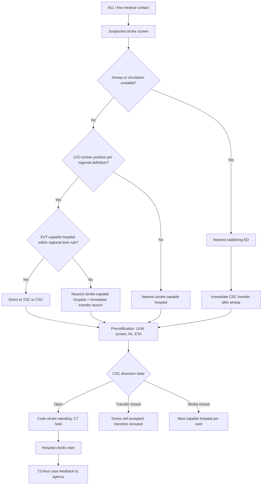

# Prehospital Systems and EMS Partnership

## Opening

The Comprehensive Stroke Center clock starts at first medical contact, not at the emergency department threshold. Every destination decision, every silent arrival, and every diversion that is not published in advance either preserves or spends the only resource reperfusion cannot buy back: time. The Medical Director owns that prehospital interface even when EMS agencies, fire-based first response, air medical, and the transfer center sit outside the hospital's employment structure.

A CSC that treats EMS as a courtesy relationship will look excellent on internal dashboards and mediocre in the region. The 2026 AHA/ASA Guideline for the Early Management of Patients With Acute Ischemic Stroke refined EMS triage and endorsed mobile stroke units at the system level. Those statements are not marketing copy. They are a charge to design destination protocols, large-vessel-occlusion (LVO) screening as a class of tools, prenotification, diversion rules, feedback, and data sharing as a single operating system.

Do not outsource that design to a single champion paramedic or a vendor algorithm. Publish the rules. Train to them. Measure whether they fire at 02:00 on a holiday. Close the loop with every agency that delivers patients to the door.

This chapter is the CSC side of regional systems of care. Pair it with [Systems of Care and the Regional Hub](../foundations/03-systems-of-care.md), [Hyperacute Pathways](11-hyperacute-pathways.md), [Telestroke Network Operations](19-telestroke-networks.md), and [Mobile Stroke Units](20-mobile-stroke-units.md). The job here is the partnership that makes those chapters executable in the field.

## Why This Matters

Reperfusion benefit decays by the minute. Intravenous thrombolysis in the 4.5-hour window and endovascular therapy in early- and late-window populations all depend on the patient arriving at a capable hospital with enough residual time to evaluate and treat. A well-staffed mothership that receives the LVO after an unnecessary stop at a non-EVT facility has already lost the first treatment opportunity and, often, the late-window imaging window as well.

Wrong destination is a system failure, not an EMS failure. LVO screens, used as a class, improve the probability of routing the right patient to the right hospital. They do not diagnose LVO, they do not replace a neurologic examination, and they do not justify building a regional protocol around one proprietary tool. A CSC that endorses a single brand as the only acceptable screen creates vendor lock-in, training fragmentation across mutual-aid agencies, and a false sense of certainty.

Prenotification is the cheapest parallel-processing tool the program owns. A two-minute radio or data alert that includes last known well, screen or deficit pattern, anticoagulants, airway status, and ETA allows CT, pharmacy, and the interventional team to move before the stretcher hits the bay. Silent arrivals convert a designed pathway into a sequential scavenger hunt.

Diversion without a published rule is a patient-safety event. Academic CSCs close to capacity, lose an IR suite to a ruptured aneurysm, or run out of neuro ICU beds. If the field does not know when the CSC is closed to stroke, when it is closed only to transfers, and when it remains open to LVO, crews will either dump every case on the nearest ED or drive past the only capable hospital.

Joint Commission CSC expectations still include 24/7 vascular neurology, neurosurgery, neurointervention, neuroradiology, a dedicated neuro ICU, and advanced imaging. Surveyors test whether those capabilities are reachable from the field. Get With The Guidelines–Stroke and Target: Stroke recognition are downstream of prehospital performance: door-to-needle and door-to-device clocks start only after a destination and a prenotification have already succeeded or failed. CSTK-09, CSTK-11, and CSTK-12 will look unfixable if the real defect is a 40-minute scene-plus-transfer interval that never appears on the hospital stopwatch.

Equity is a prehospital problem. Night and weekend crews, rural mutual aid, language discordance, and "diversion deserts" concentrate delay in the same populations the quality program later flags as outliers. If the Medical Director does not sit on the regional advisory committee, those gaps remain anecdotes.

## Core Framework

Treat the prehospital system as five coupled decisions: who is a suspected stroke, which hospital is the destination, what is said before arrival, when the CSC is closed, and how the field learns whether the system worked.

### Decision rights

| Decision | Owner | Must consult | Must not be owned by |
| --- | --- | --- | --- |
| Regional destination protocol | Regional advisory committee with CSC Medical Director as clinical lead | EMS medical directors, PSC/TSC leaders, public health, air medical | A single hospital marketing office |
| LVO screen class and cut-points | Regional clinical consensus, reviewed annually | EMS education leads, telestroke medical director | A device or software vendor |
| Prenotification minimum data set | CSC Medical Director and transfer-center director | ED, CT, pharmacy, IR, neuro ICU | Individual charge nurses rewriting the script nightly |
| Stroke-specific diversion | CSC Medical Director or documented night delegate | House supervisor, IR lead, NCC attending | An unnamed "bed meeting" with no timestamp |
| Agency-level feedback content | Stroke program director (nursing/ops) with Medical Director co-signature | EMS QI officers | Risk management as the only filter |
| Data-sharing agreement | Hospital compliance + EMS agency counsel | Quality director, registry manager | Informal email of PHI "just this once" |

### Destination logic

Build destination rules from capability and time, not from brand loyalty. Publish them as a one-page field card and as the transfer-center script.

| Field picture | Default destination | Do not do | CSC obligation on arrival |
| --- | --- | --- | --- |
| Suspected stroke, LVO screen negative, stable, within IVT window | Nearest stroke-capable hospital (ASRH/PSC/TSC/CSC per regional map) | Bypass a capable hospital to "go to the university" without a time rationale | Prenotification received; code stroke standing |
| LVO screen positive, stable, EVT-capable hospital within the regional time threshold | Direct to EVT-capable hospital (TSC or CSC) | Stop at a non-EVT hospital "just for a CT" unless airway or instability forces it | Parallel IR/CT/pharmacy activation |
| LVO screen positive, unstable airway, refractory hypoxia, or uncontrolled hemorrhage | Nearest ED capable of airway and resuscitation, then immediate secondary transfer | Drive past a stabilizing hospital with an unsecured airway | Immediate critical-care transfer pathway, not a new diagnostic odyssey |
| Witnessed ICH features (thunderclap, coma, anticoagulant, unequal pupils) with CSC nearby | CSC or nearest facility with neurosurgery per regional map | Park the patient in a hospital that cannot reverse coagulopathy or operate | ICH bundle + neurosurgery/NCC alert |
| Unknown onset or wake-up, otherwise stable | Stroke-capable hospital with advanced imaging; prefer CSC/TSC if the regional time cost is small | Assume the patient is "too late" in the field | DWI-FLAIR or perfusion pathway ready |
| Pediatric suspected AIS | Follow the 2026 AIS pediatric recommendations and the regional pediatric destination addendum | Improvise an adult LVO screen as if it were validated in children | Pre-alert pediatric neurology/NCC per local compact |

Do not encode a single minute-threshold in this handbook as if it were a national constant. The 2026 guideline refined EMS triage; the regional advisory committee must translate that refinement into a local time-and-distance rule, write the rationale, and review it when traffic, night staffing, or a new TSC changes the map.

### LVO screens as a class

LVO screens are structured field examinations that raise or lower the probability of a proximal occlusion. They typically combine gaze, arm drift, speech or neglect, and sometimes consciousness or grip. Tools in the class include, without endorsement of any one instrument as the regional standard: RACE, LAMS, C-STAT, FAST-ED, VAN, CG-FAST, and locally derived composites. Cincinnati and LAPSS-type screens remain useful for suspected stroke but were not designed as LVO routers.

| What the class can do | What the class cannot do |
| --- | --- |
| Sort a population so more true LVOs go to EVT-capable hospitals | Diagnose LVO or exclude mimic |
| Give the CSC a reason to launch IR and CTA in parallel | Replace last-known-well, glucose, anticoagulant history, or airway assessment |
| Support a regional, train-the-trainer curriculum | Survive if every agency uses a different unpublished cutoff |
| Be audited against CTA/MRA ground truth | Justify withholding IVT at a nearer capable hospital when the patient is not an LVO candidate |

Operational rules for the class:

1. Choose one primary screen for the region, plus a documented exception list for mutual-aid agencies that arrive already trained on a different validated tool in the same class.
2. Publish the exact positive definition (which items, which score) on the field card. Do not allow "the medic thought it was an LVO" as a data element.
3. Pair every screen with last known well, blood glucose, and a stability check. A positive screen in an unstable patient is a stabilization problem first.
4. Measure false-negative LVOs that stopped at non-EVT hospitals and false-positive mothership activations. Adjust cut-points only through the regional committee.
5. Never let a vendor dashboard become the destination protocol.

### Prenotification

Prenotification is a clinical order, not a courtesy call. The CSC defines a single inbound number or data channel that reaches a person empowered to activate the code.

**Minimum prenotification data set (sample — adapt locally)**

| Element | Why it is mandatory |
| --- | --- |
| Agency, unit, and callback | Closes the loop if CT is down or diversion flips |
| Age and sex | Pharmacy weight estimate and pediatric branch |
| Last known well (clock time, not "about an hour") | IVT and late-window eligibility |
| LVO screen name, result, and items that fired | Parallel IR vs stroke-only activation |
| Blood glucose if obtained | Avoids launching lytics into hypoglycemia |
| Anticoagulant or antiplatelet if known | Reversal and consent posture |
| Airway, SBP range if obtained, seizure, pregnancy if known | Resuscitation and imaging safety |
| ETA and entry door | CT hold and bed assignment |
| Whether this is a scene run, interfacility transfer, or MSU handoff | Different clocks and different teams |

Silent arrival is a defect. Track it as a numerator (code strokes with no prenotification) over a denominator (EMS-arrived code strokes). Require the charge nurse to document why prenotification failed: no call, call to the wrong number, incomplete data, or data received but not acted on.

### Diversion and bypass

Write three states. Anything fuzzier will be invented at 03:00.

| State | Meaning | Who may declare | Automatic actions |
| --- | --- | --- | --- |
| Open | Accepting scene and transfer stroke | Default | Prenotification line live |
| Stroke-transfer closed | Scene LVO and scene stroke still accepted; interfacility transfers rerouted | Medical Director or night delegate after checking IR, NCC, and ED | Transfer center script changes within 5 minutes; timestamped log |
| Stroke closed | No inbound stroke, scene or transfer | Rare; requires Medical Director or documented executive delegate | Regional notification; estimated reopen time; written after-action |

Never allow "soft diversion" (telling favored agencies one story and the field another). Never close to LVO solely because the neuro ICU is full if a monitored overflow plan exists; make that a documented Medical Director decision, not a bed-meeting rumor. Pair every closure with a reopen clock.

### Mobile stroke units at system level

The 2026 AIS guideline endorses mobile stroke units. That is a system design decision, not a vehicle purchase. The Medical Director must be able to answer: what geography and hours, what staffing model, what imaging and lytic formulary, what destination coupling to the CSC, what equity case (who is not covered), and what quality feed into GWTG and the regional registry. Detailed MSU operations live in [Mobile Stroke Units](20-mobile-stroke-units.md). In this chapter, the requirement is that an MSU, if present, obeys the same destination, prenotification, diversion, and feedback rules as every other prehospital asset — and that the absence of an MSU is a documented system choice, not an accident.

### Feedback and data sharing

EMS will not stay in a protocol that never tells them what happened. Build two products.

| Product | Cadence | Content | Channel |
| --- | --- | --- | --- |
| Case-level feedback | Within 72 hours of a prenotified stroke or a requested review | Final diagnosis class (AIS/ICH/SAH/mimic), LVO yes/no, IVT/EVT/none, door-to-needle or door-to-puncture if treated, one teaching point | Secure EMS QI pathway, not a text to the medic's personal phone |
| System feedback | Monthly to each high-volume agency; quarterly to the region | Prenotification rate, destination accuracy, scene-to-door, screen-positive CTA-confirmed LVO rate, silent arrivals | Regional dashboard + RAC packet |

Data sharing requires a written agreement: purpose, elements, legal authority, retention, and who may not use the file for punitive employment action without a separate process. The registry manager is not a freelance data broker.

### Regional advisory committee

If the region already has a trauma RAC or a state stroke committee, do not invent a parallel club. Take a voting clinical seat and put destination, screen class, diversion, MSU geography, and pediatric addenda on a standing agenda.

!!! tip "Key Actions"
    Publish a one-page regional destination card that names the LVO screen class, the exact positive definition, and the three diversion states. Stand up a single prenotification channel that a paramedic can reach without knowing the hospital operator tree. Sit on the regional advisory committee or create one if the region has only informal phone trees. Require 72-hour case feedback on every prenotified LVO-screen-positive patient. Log every stroke diversion with a start time, reason, decision-maker, and reopen time. Write the MSU decision — operate, partner, or defer — as a system paper, not a hallway opinion.

!!! abstract "Metrics Targets"
    Track prenotification rate among EMS-arrived code strokes with an internal target of ≥90 percent complete data-set prenotifications. Track silent arrivals as defects. Track destination accuracy: LVO on CTA/MRA that first arrived at a non-EVT hospital, and screen-positive patients without LVO who bypassed a nearer PSC. Do not invent a national scene-time number here; set a regional scene-time goal with EMS medical directors and publish it. Hospital clocks remain Target: Stroke Phase III / Elite and Advanced Therapy: 85 percent door-to-needle ≤60 minutes; door-to-device ≤90 minutes for direct arrivals and ≤60 minutes for transfers in at least 50 percent (award threshold) with tighter internal medians. CSTK-09, CSTK-11, and CSTK-12 are hospital measures that will not improve if prenotification and destination are left unmeasured. Stratify every prehospital metric by agency, night/weekend, and ZIP or equivalent geography.

!!! warning "Common Pitfalls"
    Adopting one proprietary LVO tool as the only legal screen and then discovering mutual-aid agencies cannot be trained. Allowing prenotification to land on a clerk who cannot activate CT. Running "soft diversion" that regular crews know about and night crews do not. Giving EMS diagnosis-level PHI by text. Letting hospital marketing rewrite destination language so that every possible stroke is advertised to the mothership. Measuring only door-to-needle and declaring the prehospital system healthy. Ignoring pediatric destination because "we are an adult CSC." Treating air medical as exempt from the data set. Using EMS feedback as a disciplinary letter.

!!! success "Implementation Tips"
    Start with the three highest-volume agencies and the transfer center; do not wait for a 30-agency consensus before the prenotification script is live. Bring one anonymized missed-LVO case and one silent-arrival timeline to the first RAC. Co-brand the field card with EMS medical directors so it is their protocol, not a hospital flyer. Put the diversion state on a status board the transfer center and ED charge both see. Fund EMS case review with CME or protocol hours, not pizza alone. When a new TSC opens, revise the map within 30 days. If the EHR cannot timestamp prenotification, create a structured field this quarter — memory is not a data source.

## How to Do the Work

### Daily / weekly

- Review last night's prenotifications for completeness and for silent arrivals. Require a same-week note on every silent arrival.
- Review LVO-screen-positive arrivals against CTA/MRA. Flag false positives that launched IR and false negatives that arrived as "regular stroke."
- Confirm the diversion log is empty or closed. An open diversion without a reopen time is a page to the night delegate.
- Walk the inbound radio or phone path once a week. If the test call does not produce a code-stroke page, the pathway is fiction.
- Send 72-hour case feedback on prenotified treated patients and on any agency-requested review.
- Include EMS in the weekday hyperacute huddle when a field defect is the day's story. Do not wait for the quarterly RAC to say that last night's destination was wrong.

### Monthly / quarterly

- Publish an agency-level scorecard: volume, prenotification rate, complete data-set rate, destination accuracy, scene-to-door, and one qualitative theme.
- Convene or attend the regional advisory committee with a standing packet: map, diversion hours, screen performance, MSU utilization if any, pediatric cases, and open protocol questions.
- Review interfacility transfer delays separately from scene runs. Transfer-in EVT is a different failure mode (see [Endovascular Therapy Program](14-endovascular-therapy.md)).
- Reconcile hospital GWTG times with EMS ePCR times on a sample of cases. Clock wars are usually definition wars.
- Train new residents, fellows, and ED night faculty on the prenotification script they will hear, not only on NIHSS.
- Audit equity: night/weekend prenotification, language-line use in the bay, and ZIP-level destination accuracy.
- Refresh the field card if a hospital capability changes (new 24/7 EVT, lost night CT tech, pediatric compact).

### Annual / multi-year

- Re-ratify the destination protocol and the LVO screen class with a written evidence note that cites the current AHA/ASA AIS guideline and local performance.
- Renegotiate data-sharing agreements and the diversion MOU.
- Decide the MSU question with finance, equity, and EMS: launch, expand hours, partner, or document deferral.
- Run a multi-agency simulation that includes a diversion flip mid-scenario.
- Present prehospital performance to the CSC executive committee as a Medical Director metric, not as "EMS issues."
- Budget for EMS education FTE or contracted hours. A CSC that will not pay for field training does not have a field protocol.
- Recheck air medical and critical-care transport inclusion. They are EMS.

## Ready-to-Adapt Tools

All tools below are samples. Adapt to local medical-staff rules, EMS protocols, privacy counsel, and the current Joint Commission E-App. They are not a substitute for the regional protocol.

### Sample SOP skeleton — regional destination and prenotification

**Title:** Suspected stroke destination, LVO screen class, and CSC prenotification  
**Owner:** CSC Medical Director  
**Review cycle:** Annual, or within 30 days of a capability change  

1. **Purpose.** Route suspected stroke to the nearest capable hospital; route LVO-screen-positive stable patients to an EVT-capable hospital when the regional time rule is met; guarantee a single prenotification.
2. **Scope.** Scene EMS, air medical, MSU if operating, and the hospital transfer center. In-house stroke is out of scope (see [Hyperacute Pathways](11-hyperacute-pathways.md)).
3. **Definitions.** Last known well; suspected stroke; LVO screen positive (insert regional tool and cut-point); the three diversion states; prenotification complete vs incomplete.
4. **Procedure — field.** Perform suspected-stroke screen. Obtain glucose. Apply LVO screen if the regional protocol requires it. Apply destination table. Call the CSC prenotification line with the minimum data set. Do not delay transport for nonessential interventions.
5. **Procedure — CSC.** Receiver reads back LKW, screen result, and ETA. Activates code stroke and, if screen-positive, the EVT parallel page. Holds CT. Documents prenotification time.
6. **Diversion.** Only the listed roles may change state. Transfer center updates the regional notification within 5 minutes. Log reason and reopen time.
7. **Feedback.** Program office sends case-level feedback within 72 hours for screen-positive and treated patients.
8. **Records.** Prenotification time, diversion log, and feedback log are quality records.
9. **Exceptions.** Unstable airway; mass casualty; documented Medical Director override with reason.

### Sample prenotification script (receiver)

> "Stroke prenotification, go ahead. I am writing last known well as a clock time. Screen name and result. Anticoagulants. Airway. ETA and door. I am activating code stroke [and IR]. Callback number is…"

### Sample time-target grid (prehospital + first hospital interval)

| Interval | Who owns the definition | Floor | Elite internal posture |
| --- | --- | --- | --- |
| First medical contact to departure from scene | EMS medical director + RAC | Regional published goal | Weekly outlier review, not annual |
| Prenotification lead time (call to wheels in bay) | CSC + EMS | Any call before arrival | Enough lead time to hold CT and mix lytic |
| Silent-arrival rate | CSC | Measure it | Near zero for EMS-arrived codes |
| Door-to-needle | Hospital; Target: Stroke | Honor Roll 75% ≤60 min | Elite 85% ≤60 min; Elite Plus 75% ≤45 and 50% ≤30 |
| Door-to-device (direct / transfer) | Hospital; Target: Stroke Advanced Therapy | 50% ≤90 min direct / ≤60 min transfer | Tighter internal medians; CSTK-11/12 |

### Sample role card — CSC Medical Director (prehospital)

- Votes the destination protocol and the screen class.
- Is the only routine authority (or names a 24/7 delegate) for stroke-closed status.
- Co-signs agency feedback templates.
- Brings prehospital defects into the hyperacute M&M, not a separate "EMS meeting" that clinicians skip.

### Sample role card — EMS agency QI officer

- Owns ePCR completeness for LKW, screen items, and prenotification.
- Receives 72-hour case feedback and closes the loop with crews.
- Escalates protocol ambiguity to the RAC, not by local improvisation.

### Sample RACI — prenotification channel

| Task | Medical Director | Stroke program director | ED charge | Transfer center | EMS QI |
| --- | --- | --- | --- | --- | --- |
| Define data set | A/R | R | C | C | C |
| Staff the inbound line | A | R | R | C | I |
| Audit completeness | A | R | C | I | C |
| 72-hour feedback | A | R | I | I | C |
| Diversion notification | A | C | I | R | I |

R = responsible, A = accountable, C = consulted, I = informed.

### Sample RAC agenda (60 minutes)

1. Diversion hours last quarter and after-action (10).
2. Destination misses: LVO to non-EVT, and unnecessary mothership bypass (15).
3. Screen-class performance vs vascular imaging (10).
4. Prenotification completeness by agency (10).
5. Pediatric and MSU addenda (5).
6. Protocol change vote or parking lot (10).

### Sample 72-hour EMS feedback letter (skeleton)

**Sample — adapt; send only via the agreed secure channel.**

- Agency / unit / date / run number.
- Hospital arrival time and prenotification yes/no.
- Working field impression vs final diagnosis class.
- Vascular imaging: LVO present / absent / not imaged (reason).
- Treatment: IVT agent class if given, EVT yes/no, or neither (reason category).
- One time interval that mattered.
- One specific teaching point. No blame sentence.
- Callback name for the stroke program office.

## Integration With Other Pillars

Prehospital design is the front end of [Hyperacute Pathways](11-hyperacute-pathways.md) and the reason [Imaging Architecture](12-imaging-architecture.md) must accept a held scanner. LVO routing is meaningless without a 24/7 [Endovascular Therapy Program](14-endovascular-therapy.md) and a [Neurocritical Care](15-neurocritical-care.md) bed plan that does not generate silent diversion. [Telestroke](19-telestroke-networks.md) is how non-CSC hospitals in the destination map obtain a treatment decision instead of a second long ground transport. [Mobile Stroke Units](20-mobile-stroke-units.md) are a prehospital capability, not a hospital toy.

Quality: prenotification and destination accuracy belong on the same board as STK-4, Target: Stroke, and CSTK-09/11/12 ([Core Metrics](../quality/23-core-metrics.md)). Equity stratification starts in the field ([Equity and Disparities Reduction](../quality/26-equity-disparities.md)). Network strategy and RAC politics live in [Network Leadership](../strategy/33-network-leadership.md) and [Systems of Care](../foundations/03-systems-of-care.md). Education: fellows must ride along or sit in RAC once; otherwise they will treat EMS as a black box ([Interprofessional Education](../education/28-interprofessional-simulation.md)). Research: StrokeNet screening fails if last known well never entered the ePCR.

## Sources

- 2026 Guideline for the Early Management of Patients With Acute Ischemic Stroke. *Stroke*. 2026;57(8):e316–e436. DOI 10.1161/STR.0000000000000513. EMS triage refinement; mobile stroke unit endorsement; IVT and EVT time windows that make destination consequential.
- Joint Commission Disease-Specific Care stroke certification (ASRH, PSC, TSC, CSC); 2026 Stroke Certification Standards (SCS26). Confirm current E-App eligibility tables rather than restating unverified volume numbers.
- Specifications Manual for Joint Commission National Quality Measures, CSTK v2026B (posted 02/06/2026; 3Q–4Q 2026 discharges), especially CSTK-09, CSTK-11, CSTK-12 as hospital reperfusion-time measures downstream of prehospital design.
- Get With The Guidelines–Stroke award criteria and Target: Stroke Honor Roll / Elite / Elite Plus / Advanced Therapy thresholds (AHA public criteria; last reviewed on the AHA page 9 September 2022 at the time of handbook verification).
- Target: Stroke Phase III national goals: 85% door-to-needle ≤60 minutes; door-to-device performance aligned with Advanced Therapy (50% ≤90 minutes direct / ≤60 minutes transfer).
- Brain Attack Coalition 2005 CSC consensus (Alberts et al., *Stroke*) as historical systems context, not as a substitute for current CSC standards.
- HERMES collaboration and the late-window DAWN / DEFUSE 3 trials as the clinical reason LVO routing exists; large-core trials as a program-design issue for who should still come to the mothership (see Chapter 14).
- IHI Model for Improvement / PDSA for prenotification and destination tests of change.
