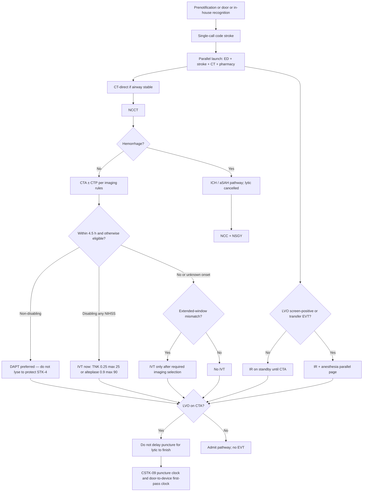
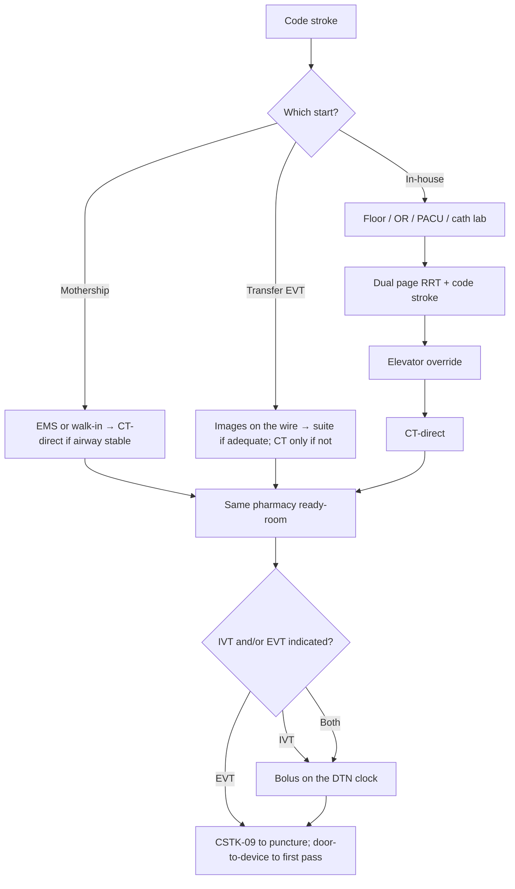

# Hyperacute Pathways and Code Stroke

## Opening

Code stroke is not a page. It is a choreographed interval in which emergency medicine, CT, pharmacy, vascular neurology, interventional radiology, and the receiving ICU move at the same time on a single clock. The Medical Director owns that choreography. If the pathway still depends on a heroic fellow who happens to be in the ED, the program does not have a pathway.

The 2026 AHA/ASA AIS guideline is unambiguous about sequence: treat eligible disabling deficits rapidly within 4.5 hours, regardless of NIHSS, without delaying for advanced imaging selection; give intravenous thrombolysis and endovascular therapy together when both are indicated, without delaying thrombectomy. Target: Stroke Phase III matches the Elite and Advanced Therapy **published award criteria** — not CSC certification floors. The full award table lives in [Core Metrics](../quality/23-core-metrics.md).

Build the IVT clock and the EVT clocks in parallel and refuse to let them negotiate. EVT has two public clocks that are not the same ([ER-TS-AT-DEF](../evidence-register.md)): CSTK-09 is arrival to **skin puncture**; Target: Stroke door-to-device is arrival to **first pass with the thrombectomy device**. Mothership arrivals, transfer arrivals, and in-house strokes are three different codes with the same discipline and different starting conditions. Write all three. Drill all three. Review all three every week.

## Why This Matters

Door-to-needle and door-to-device are not award decorations. They are the operational expression of the same biology that made NINDS, ECASS III, MR CLEAN and its contemporaries, HERMES, DAWN, and DEFUSE 3 practice-changing. HERMES reported mRS 0–2 in 46.0 percent versus 26.5 percent with an NNT of 2.6 for at least a one-point mRS shift. That benefit is not available to a patient who spends 40 minutes in a hallway waiting for a sequential exam, a sequential creatinine, and a sequential call to IR.

Academic CSCs fail hyperacute performance in predictable ways. The page goes to a resident who must then find an attending. CT is "available" but not held. Pharmacy starts the lytic after the bolus decision instead of before it. The transfer arrives as a standard EMS entry rather than a rolling EVT. The in-house stroke on a surgical floor is treated like a rapid response with a neurology consult attached. Night and weekend teams invent a slower pathway because the daytime people are the only ones who practiced the fast one.

Certification and recognition sit on top of this design. STK-4 captures thrombolytic therapy. CSTK-01 requires NIHSS before recanalization (or within 12 hours if no recanalization). CSTK-09 measures arrival to skin puncture. CSTK-11 and CSTK-12 measure rapid effective reperfusion (TICI ≥2B within 120 minutes of arrival and within 60 minutes of puncture). Honor Roll, Elite, Elite Plus, and Advanced Therapy are **published award criteria, not floors** — see [Core Metrics](../quality/23-core-metrics.md) for the full table. Internal aims may be stricter and must be labeled `internal`.

Surveyors will ask who can activate a code, what happens when two codes fire, how the mothership differs from the transfer code, and whether the time clock is a single source of truth. If the answers differ by attending, the pathway is optional.

## Core Framework

### Single-call activation

One number or one EHR order launches the entire team. The list is local; the principle is not. A typical CSC page includes ED attending and charge, stroke APP or resident plus attending vascular neurologist, CT tech, pharmacist, IR attending and charge, neuro ICU charge, and the transfer center. Adding people is cheap. Adding a second call that must succeed before IR hears the page is expensive.

| Activation type | Who may launch | What launches | What does not wait |
| --- | --- | --- | --- |
| EMS prenotified scene stroke | ED charge or transfer-center receiver | Stroke team + CT hold + pharmacy ready-room | Attending physical presence |
| EMS prenotified LVO screen-positive | Same, with IR parallel page | Above + IR and anesthesia per model | CTA completion |
| Walk-in or silent EMS arrival | Any ED clinician | Full code on suspicion; do not wait for NIHSS completion | Registration finishing the visit |
| Transfer-in EVT | Transfer center + IR + stroke simultaneously | Rolling EVT pathway; CT only if images are inadequate | A new "ED evaluation" as if the patient were a scene arrival |
| In-house stroke (floor, OR, PACU, cath lab) | Any staff: circulating RN, PACU charge, anesthesia, cath-lab charge; dual RRT + code stroke | Bedside NIHSS, glucose, named LKW owner, CT transport, pharmacy | The primary team finishing a note; an attending countersignature |
| Second simultaneous code | ED attending + Medical Director delegate | Split roles by prewritten rule | A hallway negotiation |

### Door-in process

The door-in interval is the time from threshold (or in-house recognition) to the CT table. Design it as a straight line.

1. **Threshold.** EMS stays on the stretcher. Registration is a trailing process with a pre-assigned unidentified-patient convention when needed. Weight is estimated or stretcher-scaled; do not walk the patient to a scale.
2. **Bay or CT-direct.** If the prenotification is clean and the airway is stable, CT-direct is the default. A bay stop is for airway, blood pressure crisis that would make scanning unsafe, or a missing last-known-well that can be obtained in under two minutes from family at the bedside — not from a callback hunt.
3. **Parallel, not sequential.** NIHSS, point-of-care glucose, last known well, anticoagulant history, and consent posture happen on the way to or on the table. Bloodwork is drawn but does not gate NCCT or the IVT decision except where the current AHA/ASA guideline requires a result.
4. **Single timekeeper.** One role — typically the stroke APP or a trained ED nurse — owns the clock face that everyone else can see. Competing EHR timestamps are reconciled later; they do not drive the room.

### Parallel processing and ED / CT / pharmacy / IR choreography

| Minute band (direct arrival) | ED | Stroke | CT | Pharmacy | IR / anesthesia |
| --- | --- | --- | --- | --- | --- |
| Prenote to door | Airway plan; bed or CT-direct assignment | Last-known-well hunt by phone if family not on the unit | Scanner held; contrast screened | Ready-room: TNK or alteplase per formulary | IR alert if LVO screen-positive |
| Door to image | Stay on EMS stretcher; two large-bore IVs if not present | NIHSS; eligibility screen | NCCT immediately; CTA without a separate "order debate" | Lytic at bedside or in CT | Team travel; room setup |
| Image to decision | BP management per current AHA/ASA tables | Treat disabling deficit; do not wait for CTP to give IVT in the 4.5-hour window | CTP only if it will change EVT or extended-window IVT | Bolus at decision; do not remake the drug | Groin-ready if LVO likely |
| Decision to needle / puncture | Documentation; family update | Stay with the patient through bolus | Complete vascular imaging | Waste and second-check recorded | Puncture; do not wait for "lytic to finish" |

The 4.5-hour IVT decision does not wait for perfusion maps. Extended-window and unknown-onset IVT do (see [Intravenous Thrombolysis Operations](13-iv-thrombolysis.md) and [Imaging Architecture](12-imaging-architecture.md)). EVT does not wait for the infusion to finish.

### Mothership versus transfer codes

These are not the same pathway with a different parking spot.

| Element | Mothership (scene / walk-in) | Transfer EVT | Common failure if conflated |
| --- | --- | --- | --- |
| Clock start | Hospital arrival | Hospital arrival still starts CSTK-09; clinical work started at the referring site | Re-doing a 20-minute exam |
| Imaging | Full CSC stack unless already complete and adequate | Review transferred images on the wire before arrival; repeat only for a documented reason | Routine repeat NCCT "because we always do" |
| IVT | Give here if eligible | Often already given; do not delay puncture to "finish the paper bolus documentation" | Holding IR for a consent re-do |
| ED role | Primary resuscitation and IVT | Stabilization and straight-to-suite when images and airway allow | Parking the patient in an ED hallway |
| Prenotification | EMS script | Referring physician + transferring crew + image link | Crew arrives, images do not |
| Family | May be inbound | Often hours away; consent posture planned before arrival | Waiting to puncture until a cousin lands |

Write a transfer-in checklist that the transfer center reads back: last known well, NIHSS, agent and time of IVT if given, images sent, airway, anticoagulant, BP, and destination (suite vs CT vs ED). If images are not on the wire, that is a transfer-center defect, not a reason to keep IR in the dark.

### In-house stroke

In-house stroke is where academic CSCs quietly miss Target: Stroke. Recognition is delayed, the rapid-response team does not own a stroke clock, and transport to CT competes with every other stat. This chapter writes the hyperacute path. [In-Hospital and Perioperative Stroke](43-in-hospital-stroke.md) is the program chapter. Require:

- A dual page (rapid response + code stroke) from any unit, including the OR, PACU, and cath lab. Circulating RN, PACU charge, anesthesia, cath-lab attending, or cath-lab charge may activate. No attending countersignature.
- Point-of-care glucose. After anesthesia is on the page, name the **last-known-well owner** — the primary service or the anesthesiologist who last documented a neurologic exam, not the stroke fellow hunting the chart.
- **Recognition time** and **LKW under general anesthesia** as separate fields. Recognition time starts the in-house DTN clock if that is the published local convention. LKW under GA is the last documented normal exam (often pre-induction) and drives the treatment window. Do not let one timestamp stand for both.
- A pre-cleared CT-transport path and an elevator override rule (floor → override → CT-direct).
- The same pharmacy ready-room and the same IVT/EVT parallel rule.
- A distinct in-house denominator, and a **separate perioperative denominator** (OR / PACU / cath lab) so floor delays and anesthetic-emergence delays are not averaged together.

### Time clocks

Define every clock in writing. Award vendors and CSTK will not accept the hallway definition.

| Clock | Start | Stop | Used for |
| --- | --- | --- | --- |
| Door-to-needle (DTN) | Arrival, or the **published** in-house recognition time | Thrombolytic bolus | Target: Stroke DTN awards; STK-4 process |
| CSTK-09 | Arrival | Skin puncture | CSTK arrival-to-puncture. Not a device-pass clock. |
| Target: Stroke door-to-device | Arrival | **First pass with the thrombectomy device** | Advanced Therapy published award: 50% ≤90 min direct / ≤60 min transfer ([ER-TS-AT-DEF](../evidence-register.md)) |
| Puncture-to-reperfusion | Puncture | First TICI ≥2B | CSTK-12 (TICI ≥2B within 60 min of puncture) |
| Arrival-to-reperfusion | Arrival | First TICI ≥2B | CSTK-11 (TICI ≥2B within 120 min of arrival) |
| Door-to-CT | Arrival | NCCT start | Internal only |
| Prenote-to-door | EMS call | Arrival | Prehospital chapter |

Do not collapse door-to-device into door-to-puncture. A fast puncture with a late first pass fails Advanced Therapy and can still pass CSTK-09. A late puncture fails CSTK-09 even if the first pass follows immediately.

Honor Roll, Elite, Elite Plus, and Advanced Therapy are **published award criteria, not CSC floors**. Internal aims may be stricter and must be labeled `internal`. Do not reprint the award table here — use [Core Metrics](../quality/23-core-metrics.md). Do not publish a fake "we are a 20-minute DTN center" target that night staff cannot hit. Publish a target the 02:00 team can name.

Non-disabling branch: [Transitions](17-transitions-prevention.md). Do not lyse to protect STK-4.

Three starts. One ready-room. Two EVT clocks that are not the same.

!!! tip "Key Actions"
    Write three code-stroke SOP pages: mothership, transfer-in EVT, and in-house (OR/PACU/cath included). Make activation a single call that a charge nurse — or circulating RN, PACU charge, or anesthesia — can fire without an attending countersignature. Hold CT for prenotified strokes. Move pharmacy into a ready-room so the drug is at the table before the read. Name one timekeeper per code. Review every DTN >60 minutes, every **Advanced Therapy door-to-device miss**, or every **CSTK-09 puncture miss** within seven days. Never equate those two EVT clocks.

!!! abstract "Metrics Targets"
    Published award criteria (Honor Roll / Elite / Elite Plus / Advanced Therapy / Phase III) live in [Core Metrics](../quality/23-core-metrics.md) — they are not CSC floors. Operational clocks here: CSTK-01 NIHSS before recanalization or within 12 h if none; CSTK-09 arrival to **skin puncture**; Target: Stroke door-to-device = arrival to **first device pass** (Advanced Therapy 50% ≤90 direct / ≤60 transfer); CSTK-11 TICI ≥2B within 120 min of arrival; CSTK-12 TICI ≥2B within 60 min of puncture; STK-4. Internal sample targets (label `internal`): prenotification-to-activation <2 min; door-to-CT median that makes Elite Plus possible; 100% of IVT-eligible disabling deficits treated without a CTP wait in the 4.5-hour window; in-house and perioperative DTN reported as separate denominators.

!!! warning "Common Pitfalls"
    Requiring an attending to "approve the page." Sequential creatinine before CTA in a patient who will get IVT anyway. Holding IR until the TNK push is documented in three systems. Treating transfer-in patients as new ED evaluations. Letting in-house stroke use a different, slower pharmacy path. Running a daytime pathway and a night "we'll get to CT when we can" pathway. Multiple clocks with no designated timekeeper. Celebrating an Honor Roll letter while door-to-device and CSTK-09 misses are never reviewed as separate defects. Stopping the IVT workup because EVT is "the real treatment." Forgetting CSTK-01 in the rush to the suite. Equating first pass with puncture.

!!! success "Implementation Tips"
    Film one mothership and one transfer code per quarter and review them as a tape session, not as a lecture. Put pharmacy and CT on the design team; physicians alone will design an exam, not a pathway. Use a visible countdown clock in CT. Pre-assign unidentified-patient names so registration cannot stall lytic. Create an overflow rule for two simultaneous codes before the second one happens. Give night faculty a laminated role card; they will not reread the 20-page SOP at 03:00. When a fellow is the first voice in the room, the attending still owns the times. If the EHR order set cannot launch the page, fix the order set this quarter.

## How to Do the Work

### Daily / weekly

- Run a weekday 10-minute hyperacute huddle: last 24 hours of codes, every DTN >45 minutes, every Advanced Therapy door-to-device miss or CSTK-09 puncture miss, every silent arrival, every in-house or perioperative stroke.
- Confirm the prenotification line, the page list, and CT hold are functional (see [Prehospital Systems](10-prehospital-ems.md)).
- Reconcile the timekeeper sheet with EHR timestamps twice a week until they match; then sample.
- Walk the physical path from the ambulance door to the CT gantry. Equipment in the corridor is a pathway defect.
- Require same-week structured review of any case that missed a published Elite DTN cut, an Advanced Therapy door-to-device cut, or CSTK-09.
- Check that NIHSS was recorded before recanalization (CSTK-01) on every treated patient.

### Monthly / quarterly

- Publish a hyperacute scorecard: DTN distribution (≤30 / ≤45 / ≤60 / >60), door-to-CT, door-to-device and CSTK-09 each split direct vs transfer, CSTK-11/12, in-house vs ED vs perioperative, night vs day, walk-in vs EMS.
- Review mothership vs transfer vs in-house as three denominators; keep perioperative visible inside in-house.
- Run one announced and one unannounced code-stroke drill, including a double-code scenario quarterly.
- Bring pharmacy waste, mixing errors, and ready-room stock-outs into the same meeting as the times.
- Audit consent and shared-decision documentation for the extended window (Chapter 13) without letting consent become a 4.5-hour delay.
- Report Target: Stroke and CSTK reperfusion measures at monthly quality with equity stratification.

### Annual / multi-year

- Re-map the pathway when the ED, CT, or IR physical plant changes.
- Reconfirm that the single-call list still reaches a human at night, on holidays, and during mass-notification downtime.
- Reset internal targets after a year of Elite performance; do not retire the huddle because an award arrived.
- Include hyperacute times in fellow and faculty evaluation, not only in the quality binder.
- Budget the ready-room, the timekeeper FTE or role protection, and simulation time as clinical operations, not as education extras.
- Recheck Joint Commission CSC capability expectations and the active DSC manual; do not treat last survey's comments as the current standard.

## Ready-to-Adapt Tools

Samples to adapt. Not institutional policy until locally approved.

### Sample SOP skeleton — mothership code stroke

**Title:** Direct-arrival code stroke (mothership)  
**Owner:** CSC Medical Director  
**Review:** Semiannual  

1. **Activation.** Any clinician or the prenotification receiver launches the single-call list. No attending pre-approval.
2. **Door-in.** CT-direct if airway stable. EMS stretcher to gantry. Trailing registration.
3. **Parallel tasks.** NIHSS, glucose, LKW, anticoagulant history, two IVs, lytic to the table, NCCT then CTA.
4. **IVT rule.** Disabling deficit, eligible, within 4.5 hours: treat without waiting for CTP or MRI. Agent and dose per [Intravenous Thrombolysis](13-iv-thrombolysis.md). Non-disabling deficit → DAPT pathway ([Transitions](17-transitions-prevention.md)), not a DTN case.
5. **EVT rule.** LVO: puncture without waiting for lytic completion. Anesthesia model per Chapter 14.
6. **Timekeeper.** Named role; records door, CT start, bolus, puncture, and first device pass as separate stamps.
7. **Stop rules.** Hemorrhage on NCCT; comfort measures documented; not a stroke and documented by the attending.
8. **Handoff.** To NCC or stroke unit with a written time strip.

### Sample SOP skeleton — transfer-in EVT

1. **Accept.** Transfer center takes images, LKW, NIHSS, IVT status, airway, BP, ETA.
2. **Page.** Stroke + IR + anesthesia + NCC bed + CT only if images inadequate.
3. **Destination.** Straight to suite when images adequate and airway safe; otherwise CT then suite.
4. **Do not.** Repeat a full ED stroke workup; delay puncture for family arrival if emergency exception applies under local counsel and medical-staff rules.
5. **Clock.** Arrival still starts CSTK-09 and the door-to-device clock; they stop at different events. Document first-hospital times for system QI.

### Sample SOP skeleton — in-house code stroke

1. **Recognition.** Any staff, including circulating RN, PACU charge, anesthesia, and cath-lab charge. Dual page RRT + code stroke. No attending countersignature. See [In-Hospital Stroke](43-in-hospital-stroke.md).
2. **Bedside.** Glucose. After anesthesia is paged, name the LKW owner (primary service or anesthesiologist who last documented a neurologic exam). Record recognition time and LKW-under-GA as separate fields. NIHSS. Airway.
3. **Transport.** Pre-cleared CT path; elevator override; transporter + nurse; no "waiting for an RN who knows the floor."
4. **From CT onward.** Identical to mothership rules. Same pharmacy ready-room.
5. **Quality.** In-house denominator plus a separate perioperative (OR / PACU / cath lab) denominator.

### Sample time-target grid (hospital interval)

| Interval | Published award / measure (not a CSC floor) | Sample internal management rule |
| --- | --- | --- |
| Door → CT start | None national in this briefing | Every case >15 min reviewed same week |
| Door → needle | Elite / Phase III published award: 85% ≤60 min | Review all >45 min |
| Door → first device pass (direct) | Advanced Therapy published award: 50% ≤90 min | Review every miss; do not substitute puncture |
| Door → first device pass (transfer) | Advanced Therapy published award: 50% ≤60 min | Review every miss; do not substitute puncture |
| Door → skin puncture | CSTK-09 | Review separately from device-pass misses |
| Puncture → TICI ≥2B | CSTK-12: within 60 min | Peer review all failures |
| Arrival → TICI ≥2B | CSTK-11: within 120 min | Peer review all failures |

### Sample role card — timekeeper

- Stands where the team can see the clock.
- Announces door time, 15-minute mark, bolus, puncture, and first device pass once each.
- Does not mix drug, obtain consent, or run the airway.
- Files the time strip before leaving the room.

### Sample role card — ED charge nurse

- Holds CT on prenote.
- Launches the single call.
- Protects the stretcher path.
- Declares a second-code split using the written rule.

### Sample role card — vascular neurology attending

- Owns eligibility and the treat/no-treat decision.
- May delegate exam to the fellow; may not delegate the decision without a real-time closed loop.
- Stays until bolus is in and IR has accepted the LVO plan.

### Sample RACI — code stroke launch

| Task | Med Dir | ED attending | Stroke attending | Charge RN | Pharmacy | IR |
| --- | --- | --- | --- | --- | --- | --- |
| Single-call list content | A | C | C | R | C | C |
| Launch on suspicion | I | A | C | R | I | I |
| IVT decision | I | C | A/R | C | C | I |
| EVT launch | I | C | C | I | I | A/R |
| Time strip | A | C | C | R | I | C |

### Sample weekly huddle agenda (10 minutes)

1. Census of codes (ED / transfer / in-house / perioperative).
2. Any DTN >45, Advanced Therapy door-to-device miss, or CSTK-09 puncture miss — one sentence defect. Never equate the last two.
3. Silent arrival or failed page.
4. CSTK-01 miss.
5. One fix assigned with an owner and a Friday check.

## Integration With Other Pillars

This chapter is the spine of the clinical enterprise. [Prehospital Systems](10-prehospital-ems.md) fills the prenotification column. [Imaging Architecture](12-imaging-architecture.md) decides when CTP or MRI is allowed to consume time. [Intravenous Thrombolysis](13-iv-thrombolysis.md) and [Endovascular Therapy](14-endovascular-therapy.md) are the two treatments the pathway exists to deliver. [In-Hospital Stroke](43-in-hospital-stroke.md) is the program chapter for floor, OR, PACU, and cath-lab codes. [Neurocritical Care](15-neurocritical-care.md) is the receiving system; a perfect puncture with no ICU bed is an unfinished code.

Leadership: decision rights for activation and diversion sit in [Governance Architecture](../leadership/07-governance-architecture.md) and [Medical Director Role](../leadership/05-medical-director-role.md). Quality: the huddle is a PDSA engine ([Continuous Improvement](../quality/24-improvement-high-reliability.md); [Core Metrics](../quality/23-core-metrics.md)). Education: the pathway is the fellowship's highest-stakes simulation ([Fellowship and GME](../education/27-fellowship-gme.md)). Research: 24/7 screening for StrokeNet trials must attach to the same single call without adding a sequential delay ([Trials and Registries](../research/29-trials-registries.md)). Strategy: elite status is a daily time system, not an award cycle ([Elite Performance](../strategy/36-elite-performance.md)).

## Sources

- 2026 Guideline for the Early Management of Patients With Acute Ischemic Stroke. *Stroke*. 2026;57(8):e316–e436. DOI 10.1161/STR.0000000000000513. Rapid IVT for disabling deficits regardless of NIHSS; no delay of EVT for IVT or of IVT for advanced imaging in the 4.5-hour window.
- Goyal et al., HERMES collaboration, 2016 (mRS 0–2 46.0% vs 26.5%; NNT 2.6 for ≥1-point mRS shift) and the contributing early-window EVT trials (MR CLEAN, ESCAPE, EXTEND-IA, SWIFT PRIME, REVASCAT).
- NINDS tPA 1995; ECASS III 2008 (3–4.5 h) as the historical IVT time-window foundation now restated in the 2026 guideline.
- DAWN and DEFUSE 3 as the late-window EVT logic that makes transfer codes and imaging rules consequential.
- Target: Stroke published award criteria (Honor Roll / Elite / Elite Plus / Advanced Therapy) and Phase III goals — tabulated in [Core Metrics](../quality/23-core-metrics.md), not reprinted as floors here.
- [ER-TS-AT-DEF](../evidence-register.md): Advanced Therapy door-to-device = arrival to first pass with the thrombectomy device; CSTK-09 = arrival to skin puncture. Do not collapse the clocks.
- CSTK v2026B: CSTK-01, CSTK-09, CSTK-11, CSTK-12. STK-4 thrombolytic therapy.
- Joint Commission CSC capability expectations: 24/7 vascular neurology, neurointervention, neuroradiology, dedicated neuro ICU, advanced imaging. Confirm current numeric volume tables in the active E-App / DSC manual.
- IHI Model for Improvement; high-reliability preoccupation with failure applied to night-and-weekend codes.
