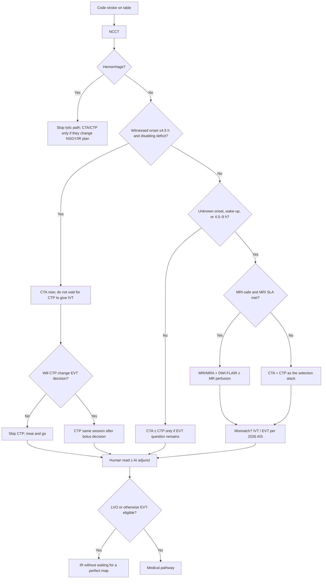
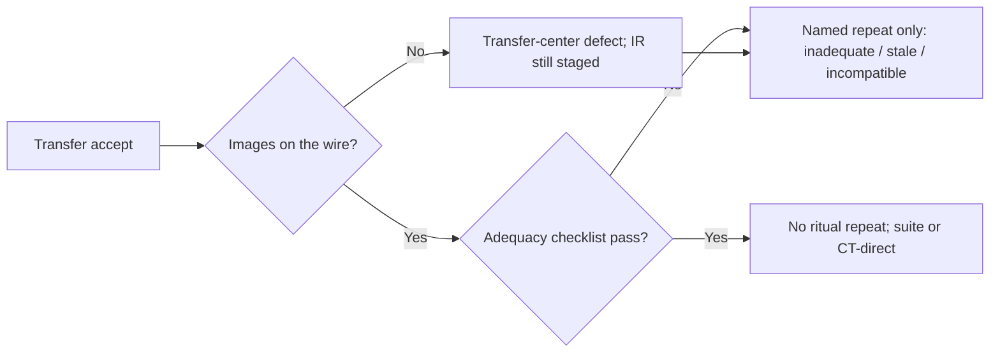

# Imaging Architecture

## Opening

A Comprehensive Stroke Center is an imaging system that happens to have beds. If NCCT, CTA, and (when they change the decision) CTP or MRI are not available with a published service-level agreement at 03:00, the rest of the clinical enterprise is a daytime clinic with a certificate. The Medical Director does not need to be the neuroradiology chief. The Medical Director does need to own who can launch which study, how fast it is acquired and read, when AI is allowed to whisper, and when imaging is forbidden to delay treatment.

The default CSC stack for suspected acute ischemic stroke is noncontrast CT plus CTA, with CTP added when perfusion will change an endovascular or extended-window thrombolysis decision. The 2026 AHA/ASA AIS guideline uses MRI/MRA and DWI-FLAIR mismatch for selected unknown-onset and extended-window patients. That is a second stack, not a replacement for the first. Build both. Staff both. Do not let the second stack cannibalize the first at the door.

This chapter is architecture: modality choice, 24/7 technical and read SLAs, contrast and radiation rules, access equity, AI governance, and launch authority. Protocol physics belongs to radiology. Sequence discipline belongs to the stroke program.

## Why This Matters

Every extra minute in the scanner is a minute not spent treating. The 2026 guideline is explicit that eligible disabling deficits in the 4.5-hour window are treated without delaying for advanced imaging selection. A CSC that "always runs CTP" on a witnessed-onset disabling syndrome at 90 minutes is not being thorough. It is violating the sequence the guideline just restated.

The opposite error is also common. Unknown-onset and 4.5–9-hour patients who need DWI-FLAIR or perfusion mismatch never get it because night MRI is "theoretical," the CTP protocol is locked to attendings who are not in house, or the only person who can inject contrast is at another campus. Those patients are then declared "outside the window" as if the window were a moral fact rather than an imaging-dependent one.

Certification still expects advanced imaging and 24/7 neuroradiology capability as part of the CSC profile. CSTK and Target: Stroke times will not move if door-to-CT is an unmeasured courtesy. Radiation, contrast nephropathy mythology, and scanner geography are equity issues: the night walk-in from a language-discordant household is the patient most likely to get either no CTA or a low-information NCCT-only exam.

AI large-vessel and perfusion tools are now ambient in academic shops. Used as adjuncts with governance, they shorten the time to the right eyes. Used as unofficial attendings, they create phantom activations, missed reads when the server drops, and a generation of fellows who cannot interpret a CTA. The Medical Director governs that tool the same way pharmacy governs a high-alert drug.

## Core Framework

### The two stacks

| Stack | Default contents | When it is the default | What it must not delay |
| --- | --- | --- | --- |
| Door stack | NCCT + CTA ± CTP | Almost all ED and in-house codes | IVT in the 4.5-hour window; the CTA itself must not wait on creatinine theater |
| Selection stack | MRI/MRA with DWI-FLAIR and/or perfusion (CT or MR) | Unknown onset, wake-up, or 4.5–9 h IVT selection; selected late-window EVT when CTP/MR perfusion is the local DAWN/DEFUSE-3 analogue | Door stack on a witnessed, disabling, early-window patient |

CTP is not a personality test for the attending. It is a decision tool. Launch it when the result will change EVT candidacy (late window, large-core program rule, uncertain vascular anatomy) or extended-window IVT candidacy, and when it will not postpone a 4.5-hour lytic bolus.

### Who can launch what

Write launch authority as a privilege list, not as folklore.

| Study | Who may launch | Auto-launch triggers | Who may cancel |
| --- | --- | --- | --- |
| NCCT head | Any code-stroke clinician; prenotification receiver holds the scanner | Every code stroke | Only the stroke or ED attending after a documented stop rule |
| CTA head/neck | Stroke or ED attending; stroke APP/fellow under protocol | Every ischemic-appearing code without a documented contraindication | Contrast-safety stop per protocol, not a standing "need creatinine" |
| CTP | Named list: stroke attending, covering fellow under attending agreement, ED attending for prenoted LVO in the late window | Late window / unknown onset when MRI is not the chosen stack; large-core pathway if that is the local program rule | Medical Director policy: not the CT tech "because we do not do perfusion at night" |
| MRI/MRA + DWI-FLAIR | Stroke attending | Unknown onset / wake-up / 4.5–9 h when MRI is the selected stack and the patient is MRI-safe | Safety screen failure; then CTP must be the backup, not nihilism |
| Repeat vascular imaging after transfer | Stroke or IR attending | Only if transferred images are inadequate, stale relative to a clinical change, or incompatible | Routine repeat is a defect |

If a CT technologist can refuse CTP at night without a published contraindication, the architecture is optional. Put the refusal path through the radiology attending and timestamp it.

### 24/7 technical and read SLAs

Capability without a time is a brochure. Publish SLAs that radiology and stroke both sign.

| Element | Sample SLA (adapt) | How to measure | Failure mode if unsigned |
| --- | --- | --- | --- |
| CT tech at gantry for held scanner | Present at prenote ETA | Door-to-CT start | "Available" meaning on another floor |
| NCCT acquisition complete | Immediate on table arrival | Table-to-first-image | Protocol debates on the table |
| CTA complete after NCCT | Continuous, no return to the bay | NCCT-to-CTA complete | "We'll call you back for the angio" |
| CTP, when indicated | Same session | Added minutes attributable to CTP | CTP deferred to "later if needed" |
| Preliminary vascular read (human) | Define a local minute target that supports Elite Plus DTN and CSTK-11 | First reliable LVO yes/no to the team | AI-only "reads" |
| Staff neuroradiology read | Define a local target for final read; overnight may be a dedicated nighthawk with a named morning over-read | Time to final; discordance rate | No name on the overnight read |
| MRI tech for wake-up / unknown onset | On-call presence within a published interval, 24/7 | Request-to-first-DWI | "MRI starts at 07:00" |
| Image ingest from referring sites | Before the transfer wheels stop | Images available at accept | Repeat entire stack |

Do not invent a Joint Commission minute standard that the briefing does not contain. Write local SLAs that make the published Target: Stroke award criteria and CSTK-11 physically possible, then hold radiology to them as a Medical Director metric. Award criteria are not CSC floors ([Core Metrics](../quality/23-core-metrics.md)).

### Contrast, kidneys, and the mythology that burns windows

CTA contrast is a stroke-treatment drug. The protocol should say so.

- Screen for known severe contrast allergy and for dialysis-dependence as operational facts, not as reasons to skip vascular imaging by default. Have a prewritten premedication and alternative-path (MRA without gadolinium where appropriate, or noncontrast MRA) rather than improvising.
- Do not delay CTA in a disabling 4.5-hour candidate for a serum creatinine that will not return before the lytic decision. Follow current radiology and AHA/ASA contrast guidance as the written rule; do not run an older "creatinine first on everyone" local habit.
- Pregnancy testing, when required by local policy, is a parallel task, not a gate that sends the stretcher back to the bay. See the maternal box below.
- Metformin and other ancillary medication rules belong in the contrast SOP so the CT tech is not the attending.

### Maternal neuroimaging

Do not withhold neuroimaging because of pregnancy ([ER-MAT-2026-02](../evidence-register.md); program compact in [Special Populations](42-special-populations.md)).

| Rule | Operational meaning |
| --- | --- |
| Imaging is not optional because of pregnancy | NCCT, CTA, and MRI proceed on the adult clock. Do not wait for MFM physical presence. |
| CT with or without contrast | Considered safe in pregnancy. Use iodinated contrast when the benefit outweighs the risk (vascular imaging that will change reperfusion). |
| MRI without contrast | Considered safe. Use gadolinium only when benefits outweigh risks. |
| Lead shielding of the gravid uterus | **Not recommended.** Shielding may increase dose or reduce image quality. Do not make an apron a condition of scanning. |
| β-hCG | Parallel draw. Not a CTA gate. Not a bolus gate. |

### Posterior circulation / BAO imaging

Suspected basilar-artery occlusion is an NCCT + CTA problem. PC-ASPECTS is a local imaging adjunct — do not invent a mandatory numeric cut in this chapter. Do **not** require DAWN/DEFUSE perfusion maps to offer 2026-eligible BAO EVT ([ER-AIS-2026-BAO](../evidence-register.md)). Effectiveness is not well established for NIHSS 6–9; that decision and the GA default live in [Endovascular Therapy](14-endovascular-therapy.md), not in a night CTP habit.

### Radiation and access equity

A CSC will irradiate the same patient more than once: scene CT at a PSC, repeat NCCT on arrival, CTA, CTP, angiographic runs, a next-day scan. Architecture is how you stop unindicated repeats.

| Equity / safety issue | Operational control |
| --- | --- |
| Repeat NCCT on every transfer "because we always do" | Accept/reject transferred images against a written adequacy rule |
| CTP on every early-window disabling stroke | Launch rules above |
| Night MRI unavailable, so unknown-onset patients get no selection imaging | 24/7 MRI tech SLA or CTP backup that is actually used |
| Language discordance → incomplete last-known-well → over-imaging or under-treatment | Language access in the bay and on prenote (Chapter 10) |
| Larger patients, rural transfers, or uninsured patients routed to the older scanner | One protocol, any capable scanner; no "B-team gantry" |
| Pediatric AIS | Separate pediatric imaging addendum; do not apply adult CTP defaults |

Track radiation-relevant repeats as a quality metric: percent of transfer-in EVT patients with a same-session repeat NCCT that added no decision.

### AI decision-support as adjunct

AI LVO and perfusion packages may page IR faster than a tired human. They also false-positive cavernomas, miss distal occlusions, and go silent when the routing breaks.

Governance minimum:

1. **Intended use.** Adjunct to human interpretation. Not a discharge diagnosis. Not the sole IR activation.
2. **Failure mode.** If the algorithm is down, the human SLA still holds. If the algorithm fires and the human disagrees, the human wins and the disagreement is logged.
3. **Who is notified.** A controlled list. An AI page that wakes the entire city for every "possible LVO" will be ignored within a month.
4. **Validation.** Local sensitivity/specificity against the neuroradiology gold standard, stratified by scanner, night vs day, and vendor version. Re-validate on every software update.
5. **Equity.** Monitor performance by age, sex, and image quality; do not assume the training set looks like the night census.
6. **Fellows.** Training still requires unassisted CTA interpretation. AI is turned off for specified educational cases.
7. **Procurement.** Stroke Medical Director and neuroradiology chief are clinical owners. Informatics does not sign a stroke AI contract alone.

Deeper innovation governance sits in [Innovation, AI, and Decision-Support Governance](../research/31-innovation-ai.md). This chapter requires that no stroke AI goes live without the seven items above.

!!! tip "Key Actions"
    Publish the door stack (NCCT+CTA ± CTP) and the selection stack (MRI DWI-FLAIR / perfusion) on one page with launch authority. Sign 24/7 tech and read SLAs with radiology, including night MRI or an explicit CTP backup. Forbid creatinine-first CTA in early-window disabling stroke. Write the maternal imaging rule (ER-MAT-2026-02) onto the tech script: no withheld scan, no β-hCG gate, no uterine shield default. Do not require DAWN/DEFUSE maps for 2026-eligible BAO EVT. Write the AI intended-use statement before the next vendor renewal. Measure door-to-CT and unjustified repeat imaging weekly. Name who may launch CTP at night and put that name in the order set.

!!! abstract "Metrics Targets"
    Door-to-CT start: no national award number in this briefing — set a local median that makes the published Elite Plus DTN criteria possible (full table in [Core Metrics](../quality/23-core-metrics.md); awards are not floors). Percent of 4.5-hour IVT-eligible patients whose bolus waited on CTP or MRI: internal target zero. Percent of unknown-onset / 4.5–9 h candidates who received a documented selection stack (MRI or CTP): internal target near 100% of MRI- or CTP-eligible patients. Preliminary human LVO read within the local SLA. AI–human discordance log complete. Transfer-in repeat NCCT rate with no decision change: drive down. CSTK-01 still requires NIHSS, not an ASPECTS substitute. Do not hold BAO EVT for DAWN/DEFUSE maps. CSTK-09 (puncture) and door-to-device (first pass) remain the downstream clocks imaging must serve — they are not the same clock.

!!! warning "Common Pitfalls"
    "We always do CTP" in the early window. "We never do MRI at night," therefore unknown-onset patients go untreated. Holding CTA for β-hCG or a uterine shield debate. Requiring DAWN/DEFUSE perfusion maps before offering 2026-eligible BAO EVT. Launch authority that exists only in a chief's head. AI pages IR while the human read sits for 40 minutes. Creatinine theater. Repeating the entire PSC stack on every transfer. A second scanner with a different contrast protocol. Fellows who cannot read a CTA without the heatmap. Radiology and stroke meetings that never share a slide. Treating ASPECTS or an AI core volume as a secret EVT veto without a program-level large-core policy (Chapter 14).

!!! success "Implementation Tips"
    Build the order set so the default code-stroke click is NCCT+CTA, with CTP as a single additional click that records the indication. Put the indication list on the tech's script so "who ordered perfusion?" is answerable. Co-locate the preliminary read — even a phone — with the team, not in an anonymous queue. If nighthawk is used, require a named local over-read and a discordance file. Walk a wake-up-stroke MRI path at 02:00 once a quarter. When a new AI version deploys, treat it like a formulary change: downtime plan, re-validation, training note. Give neuroradiology a seat on the hyperacute huddle for any week with an SLA breach.

## How to Do the Work

### Daily / weekly

- Review every code in which IVT waited on advanced imaging in the 4.5-hour window. That is a pathway defect until proven otherwise.
- Review every unknown-onset or 4.5–9-hour patient who received neither MRI selection nor CTP. That is a capability defect.
- Check AI downtime and discordance logs.
- Confirm transferred images arrived before the patient at least as often as they did not; fix the ingest path when they did not.
- Include door-to-CT and table-to-CTA in the weekday hyperacute huddle.

### Monthly / quarterly

- Joint stroke–radiology operations meeting: SLA attainment, contrast events, radiation/repeat rates, AI performance, night MRI utilization, tech staffing holes.
- Re-validate AI against human reads after any software or scanner change.
- Audit launch-authority compliance: who ordered CTP, whether the indication was on the list, whether a tech refused a study.
- Stratify time-to-image by night/weekend, language, and transfer vs scene ([Equity](../quality/26-equity-disparities.md)).
- Feed imaging delays into CSTK-09/11 and Target: Stroke reviews as assignable causes, not as weather.

### Annual / multi-year

- Re-sign SLAs when vendors, nighthawk contracts, or physical scanners change.
- Recheck the 2026 AIS imaging recommendations against local protocols after any guideline update.
- Capital plan: gantry geography relative to the ambulance door, backup scanner, MRI access, and injection equipment.
- Radiation program review with medical physics.
- Training: fellows, ED faculty, and techs on launch rules; unassisted CTA competency for the fellowship.
- Confirm Joint Commission advanced-imaging expectations in the active CSC standards book (SCS26 and successor).

## Ready-to-Adapt Tools

Samples to adapt with radiology, medical physics, and counsel.

### Sample SOP skeleton — acute stroke imaging launch

**Title:** Code-stroke imaging stacks and launch authority  
**Owner:** CSC Medical Director and neuroradiology chief (dyad)  
**Review:** Semiannual  

1. **Door stack.** NCCT + CTA for every ischemic-appearing code unless a documented contraindication exists.
2. **CTP indication list.** Unknown onset or >4.5 h when MRI is not used; late-window **anterior** EVT selection (DAWN 6–24 h / DEFUSE 3 6–16 h analogues); large-core program entry if locally adopted; uncertain need after CTA. Not indicated solely because "we always do it" in a witnessed <4.5 h disabling stroke. Not required to offer 2026-eligible BAO EVT.
3. **MRI indication list.** Unknown onset / wake-up / 4.5–9 h IVT selection when the patient is MRI-safe and the SLA can be met; otherwise CTP.
4. **Launch authority.** Named roles above. Order set enforces the names.
5. **Contrast.** Follow current institutional contrast policy aligned with AHA/ASA and radiology society guidance; no creatinine gate for early-window CTA. Maternal imaging per ER-MAT-2026-02: do not withhold; β-hCG is parallel; no uterine lead-shield default.
6. **AI.** Adjunct only; human read required; downtime procedure.
7. **Repeats.** Transfer images reviewed against adequacy checklist before a repeat is ordered.
8. **Refusal.** Tech or nighthawk refusal escalates immediately to radiology attending; timestamped.

### Sample SOP skeleton — AI adjunct

1. Intended use statement signed by stroke and neuroradiology.
2. Notification list and suppression rules.
3. Downtime: human SLA unchanged.
4. Discordance file and weekly review.
5. Version control and re-validation trigger.
6. Training and fellow-off cases.
7. Equity monitoring plan.

### Sample time-target grid — imaging

| Interval | Floor | Sample internal rule |
| --- | --- | --- |
| Door → NCCT start | Local; must support Elite Plus | Same-week review above the local median target |
| NCCT → CTA complete | Continuous same session | Any return-to-bay is a defect |
| Decision to add CTP | Same session when indicated | Added minutes recorded |
| MRI request → first DWI (selection cases) | Published on-call SLA | Missed SLA = treated as a capability event |
| Images-on-wire before transfer arrival | Expected | Failure assigned to transfer center, not IR |
| Human LVO yes/no to team | Local SLA | AI may assist; may not be the only timestamp |

### Sample role card — CT technologist

- Holds the scanner on prenote.
- Runs NCCT→CTA without a bay return.
- Adds CTP only with a listed indication and a listed launcher.
- Escalates, rather than silently drops, a night perfusion request.

### Sample role card — neuroradiology attending (or nighthawk)

- Provides the human LVO read inside the SLA.
- Over-reads AI; logs discordance.
- Does not cancel CTP or MRI except for safety or a conversation with the stroke attending.

### Sample role card — stroke attending

- Chooses door stack vs selection stack.
- Gives IVT in the 4.5-hour window without waiting for CTP.
- Documents why selection imaging was omitted when it was.

### Sample RACI — CTP launch

| Task | Stroke attending | ED attending | Fellow/APP | CT tech | Neuroradiology | Med Dir |
| --- | --- | --- | --- | --- | --- | --- |
| Indication list | R | C | I | C | C | A |
| Night launch | A/R | R (listed) | R if privileged | C | C | I |
| Safety cancel | C | C | I | R | A | I |
| SLA review | C | I | I | C | R | A |

### Sample adequacy checklist — inbound transfer images (yes/no)

- NCCT readable, no disc-only mystery format.
- CTA covers head and neck or a documented reason it does not.
- Time of study known.
- Contrast phase adequate for proximal LVO call.
- If late window, perfusion or MRI present or explicitly waived with a reason.
- If inadequate: repeat plan chosen before wheels down.

Inbound imaging is a transfer-center product. Ritual repeat NCCT is a defect.

## Integration With Other Pillars

Imaging is how [Hyperacute Pathways](11-hyperacute-pathways.md) stay honest. It is the selection engine for [Intravenous Thrombolysis](13-iv-thrombolysis.md) in the extended window and for [Endovascular Therapy](14-endovascular-therapy.md) in late-window and large-core patients. [Prehospital](10-prehospital-ems.md) prenotification is what makes a held scanner possible. [Neurocritical Care](15-neurocritical-care.md) needs a next-day imaging rule that does not reinvent the acute stack.

Quality and equity: door-to-CT and missed selection imaging belong on the same board as Target: Stroke ([Core Metrics](../quality/23-core-metrics.md); [Equity](../quality/26-equity-disparities.md)). AI governance links to [Innovation](../research/31-innovation-ai.md). Capital and night-tech FTE are [Financial Stewardship](../strategy/34-financial-stewardship.md) problems. Surveyors will ask who reads at night ([Certification Readiness](../quality/25-certification-readiness.md)). Fellowship competence in unassisted CTA is an education standard ([Fellowship](../education/27-fellowship-gme.md)).

## Sources

- 2026 Guideline for the Early Management of Patients With Acute Ischemic Stroke. *Stroke*. 2026;57(8):e316–e436. DOI 10.1161/STR.0000000000000513. No delay of 4.5-hour IVT for advanced imaging; DWI-FLAIR or perfusion mismatch for selected unknown-onset and 4.5–9 h patients.
- [ER-AIS-2026-BAO](../evidence-register.md): EVT for BAO within 24 h if NIHSS ≥10; do not apply DAWN/DEFUSE perfusion maps. PC-ASPECTS is a local adjunct. Program rule in [Endovascular Therapy](14-endovascular-therapy.md).
- [ER-MAT-2026-02](../evidence-register.md): do not withhold neuroimaging because of pregnancy; CT ± contrast and MRI without contrast considered safe; contrast when benefits outweigh risks; lead shielding of the gravid uterus not recommended; β-hCG is parallel, not a CTA/bolus gate.
- DAWN (6–24 h) and DEFUSE 3 (6–16 h) late-window **anterior** EVT imaging logic — do not collapse them, and do not export them onto BAO. Early-window EVT trials and HERMES as the reason CTA must be same-session, not next-shift.
- Joint Commission CSC advanced-imaging and 24/7 neuroradiology capability expectations; 2026 Stroke Certification Standards (SCS26). Confirm current E-App language.
- CSTK v2026B reperfusion-time measures (CSTK-09 puncture; CSTK-11, CSTK-12) as downstream clocks; CSTK-01 NIHSS, not imaging severity, as the required clinical score.
- Target: Stroke published award criteria (not floors) — see [Core Metrics](../quality/23-core-metrics.md).
- Local contrast and MRI-safety policies to be aligned with current radiology society and AHA/ASA statements; do not freeze older creatinine-first rules without a documented reconciliation.
