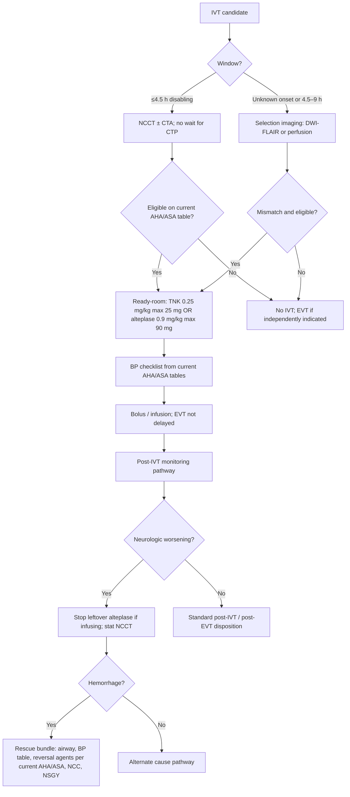

# Intravenous Thrombolysis Operations

## Opening

Intravenous thrombolysis is a pharmacy, consent, blood-pressure, and rescue operation attached to a two-drug formulary. The 2026 AHA/ASA AIS guideline allows either tenecteplase 0.25 mg/kg IV push, maximum 25 mg, or alteplase 0.9 mg/kg, maximum 90 mg (10 percent bolus, remainder over 60 minutes) in the 4.5-hour window. Eligible disabling deficits are treated rapidly, regardless of NIHSS, without delaying for advanced imaging selection. Selected unknown-onset and 4.5–9-hour patients are treated only after DWI-FLAIR or perfusion mismatch. Patients eligible for both IVT and EVT receive both, without delaying thrombectomy.

The Medical Director's job is not to re-argue those sentences at the gantry. The job is to make them executable: a ready-room that can produce the chosen agent before the read, a consent and shared-decision script that does not consume the window, blood-pressure control as a checklist drawn from current AHA/ASA tables, a hemorrhage-rescue pathway that a night nurse can run, and — if the formulary is changing — a tenecteplase conversion program that is a project, not a memo.

Do not invent local doses. Do not invent millimeter-of-mercury targets in this handbook. Use the current AHA/ASA tables, bind them into the order set, and audit whether the team actually opens them.

## Why This Matters

STK-4 and the GWTG achievement measure for IV thrombolysis (arrive by 3.5 hours, treat by 4.5 hours) are the public faces of this operation. Target: Stroke Honor Roll, Elite, Elite Plus, and Phase III are the speed faces. CSTK-05 (hemorrhagic transformation) and CSTK-01 (NIHSS before recanalization) are the safety and documentation faces. A program can hit Elite on the clock and still be unsafe if rescue is a binder on a shelf, or still be inequitable if extended-window selection imaging never happens at night.

The 2026 guideline's "regardless of NIHSS" clause ends a long academic habit of watching mild but disabling syndromes until they are no longer mild. Aphasia, hemianopia, and dominant-hand weakness are treatment indications, not observation trials. The opposite error — treating non-disabling deficits to protect a door-to-needle percentage — is how the program trades STK-4 for harm. Define disabling in the SOP. Do not leave it to the loudest voice in CT.

Tenecteplase at 0.25 mg/kg (max 25 mg) is now a first-line operational choice, not a research footnote. EXTEND-IA TNK informed the pre-EVT use case; the 2026 guideline is the practice authority. Conversion from alteplase is a high-alert change: mixing, labeling, waste, pediatric vs adult, drip-and-ship from sites that still stock alteplase, and the rescue pathway that used to assume an infusion could be stopped. A conversion that is only a P&T slide will produce a wrong-dose event.

Consent is an operation. In the 4.5-hour witnessed window the default is emergency treatment with a documented attempt to share the decision. In the extended window the default is a true shared decision because the evidence structure is different. Mixing those two postures is how teams either delay a clear bolus or push a drug a family never heard of.

## Core Framework

### Formulary and dose — locked to the 2026 guideline

| Agent | Dose (do not locally rewrite) | Administration | Operational implication |
| --- | --- | --- | --- |
| Tenecteplase | 0.25 mg/kg IV push, maximum 25 mg | Single bolus | Ready-room can stage a labeled syringe; no infusion pump for the lytic itself |
| Alteplase | 0.9 mg/kg, maximum 90 mg | 10% bolus, remainder over 60 minutes | Pump, second-nurse check on the infusion, drip-and-ship residual-dose problem |

Choose a preferred adult agent and keep the other as a documented backup (shortage, inbound drip-and-ship, clinical exception). Write the weight source: stretcher scale preferred, then estimated weight with a named estimator. Recalculate if a later measured weight would have changed the cap; that is a safety review, not a second bolus.

### Who is treated, and who waits for imaging

| Population | Imaging gate | Decision posture |
| --- | --- | --- |
| Disabling deficit, last known well within 4.5 h, otherwise eligible | NCCT without hemorrhage (CTA does not gate the bolus) | Treat now. NIHSS number does not veto a disabling deficit. |
| Non-disabling deficit within 4.5 h | NCCT; do not manufacture an indication | Do not give IVT to protect a metric. Consider other pathways (including DAPT where CHANCE/POINT logic applies — see [Transitions and Prevention](17-transitions-prevention.md)). |
| Unknown onset or 4.5–9 h, selected | DWI-FLAIR or perfusion mismatch per 2026 AIS | Treat only after selection imaging. Shared decision. |
| Eligible for IVT and EVT | Do not wait for puncture to give IVT; do not wait for infusion end to puncture | Both, rapidly |
| Inbound already receiving alteplase | Confirm dose given and remaining | Do not reflexively add TNK. Complete or stop per a written inbound rule. |
| Pediatric AIS | 2026 AIS first pediatric recommendations; local pediatric compact | Do not apply the adult ready-room by habit |

Eligibility exclusions remain those in the current AHA/ASA guideline. This handbook does not reprint a contraindication laundry list that will drift. Bind the current table into the order set and date-stamp the reconciliation.

### Pharmacy ready-room

The ready-room is a physical and digital state, not a hope that the central pharmacy is paying attention.

Minimum ready-room standard (sample):

1. **Location.** Drug at or immediately adjacent to CT, not a 10-minute tube ride after the decision.
2. **Kit.** Preferred agent, backup agent if stocked, labeled syringes or mixing tools, weight-dose card that matches the 2026 doses, waste container, second-check sheet.
3. **People.** A pharmacist on the single-call page, or a trained ED/ICU nurse mixer under a double-check protocol when pharmacy cannot physically arrive inside the local SLA.
4. **Premix vs mix-on-decision.** Either is acceptable if the stability policy is written. Premix that expires and is not replaced is a stock-out.
5. **Drip-and-ship inbound.** A separate bin and a separate calculation sheet for completing an alteplase infusion started elsewhere.
6. **Shortage.** A dated backup plan that names the alternate agent and who is notified.

Waste is a quality measure. A program that wastes a vial every time a hemorrhage is seen on NCCT has a staging problem, not a "careful pharmacy" badge.

### Consent and shared decision

| Scenario | Operational default | Documentation |
| --- | --- | --- |
| 4.5-hour, disabling, standard eligibility | Emergency treatment; share the decision if family is present; do not delay bolus for a missing relative | Indication, time, agent, dose, who was spoken with, and that delay was not introduced |
| Extended window / unknown onset after mismatch | Shared decision using a prewritten risk–benefit script | Mismatch type, script used, decision-maker, dissent if any |
| Language discordance | Interpreter now, including phone/video; family English is not an interpreter | Interpreter ID |
| No available decision-maker and emergency exception applies | Follow medical-staff and counsel rules | Exception cited |
| Patient refuses | Stop. Offer EVT if independently indicated. | Refusal documented; clock still recorded |

Write the scripts. Do not let fellows invent percentages at the bedside. Update scripts when the guideline updates.

### Blood pressure as an operational checklist

Do not invent millimeter-of-mercury numbers in local teaching slides if they are not copied from the current AHA/ASA tables. Build the checklist as a pointer plus a workflow.

**Sample BP operations checklist (values = current AHA/ASA AIS tables, dated in the order set)**

1. Open the current pre-IVT and post-IVT BP tables (2026 AIS guideline). Confirm the order set matches that date.
2. Measure BP on a documented interval before bolus and after bolus (the interval is the guideline's, not a local guess).
3. Name the first-line and second-line agents on the hospital formulary that can hit those tables. Stock them in the same ready-room footprint.
4. If BP is above the pre-IVT table: treat BP and give IVT only when the table allows — do not abandon the window while hunting a rare drug.
5. If BP is labile post-IVT: stay on the post-treatment table; the rescue pathway owns hemorrhage, not improvisational tightening.
6. Transfer-in patients: send the table with the drip-and-ship order so the referring site is not using a 2013 pocket card.

When the guideline changes a number, the order set changes the same week. That is a Medical Director task, not a "we'll catch it at the next P&T."

### Hemorrhage rescue pathway

Symptomatic hemorrhage after IVT is a single-call emergency, not a consult. Write it as a pathway that pharmacy, NCC, and neurosurgery already know.

Rescue operations (sample skeleton — agent choice and doses from current AHA/ASA ICH and AIS guidance, not invented here):

- Single-call: stroke attending, NCC, pharmacy, neurosurgery, CT.
- Stop any remaining alteplase infusion immediately. Tenecteplase has already been given; say that out loud so the team does not hunt for a pump.
- Airway and BP per current tables.
- Reverse according to the current AHA/ASA ICH guideline and the 2024 ICH performance measures (CSTK-04 is the ICH procoagulant-reversal measure; know which agents the hospital actually stocks).
- No antithrombotics, no VTE chemoprophylaxis, no extra arterial sticks until the attending clears them.
- Family update with a prewritten "this is a known complication we prepare for" script.
- Structured review within seven days, including whether the original indication was sound.

### Tenecteplase conversion program

Treat conversion as a time-limited operations project with a named owner.

| Workstream | Content | Done when |
| --- | --- | --- |
| P&T and formulary | 0.25 mg/kg, max 25 mg, adult indication, backup alteplase | Order set live |
| Ready-room | New kit, labels, waste, look-alike/sound-alike vs other TNK doses used in cardiology | Night kit inspected |
| Education | ED, pharmacy, stroke, NCC, EMS/MSU, referring sites | Competency signed |
| Drip-and-ship | Referring sites may still send alteplase; inbound rule written | First inbound case reviewed |
| Rescue | Pathway rewritten so it does not assume an infusion | Drill completed |
| Metrics | Wrong-dose, wrong-agent, DTN during the first 90 days | No critical dose events; DTN not worse than baseline |
| Pediatrics / off-label edges | Explicitly in or out | Written |
| Cardiology collision | If the hospital uses a different TNK dose for MI, physical separation and labeling | No mixed bins |

Do not run two preferred adult stroke doses. Do not let cardiology's TNK strength sit unlabeled next to stroke TNK.

!!! tip "Key Actions"
    Lock the order set to TNK 0.25 mg/kg max 25 mg and/or alteplase 0.9 mg/kg max 90 mg (10% bolus, remainder over 60 minutes). Define "disabling" in one sentence and treat those patients without a CTP wait in the 4.5-hour window. Stand up a physical ready-room on the single-call page. Point the BP orders at the current AHA/ASA tables and date-stamp them. Write and drill the hemorrhage rescue pathway. If converting to TNK, run it as a 90-day project with a cardiology look-alike plan. Separate 4.5-hour emergency treatment from extended-window shared decision.

!!! abstract "Metrics Targets"
    Target: Stroke Honor Roll 75% DTN ≤60 min; Elite / Phase III 85% DTN ≤60 min; Elite Plus 75% ≤45 min and 50% ≤30 min (minimum 6 patients). GWTG achievement: IVT arrive-by-3.5 h / treat-by-4.5 h at the 85% award floor if pursuing Bronze/Silver/Gold. STK-4. CSTK-01 NIHSS before recanalization. CSTK-05 hemorrhagic transformation. Internal: zero 4.5-hour eligible disabling cases delayed for CTP/MRI; near-100% selection imaging among extended-window candidates; ready-room stock-out rate zero; wrong-dose events zero; rescue-drill completion quarterly; consent script used in extended-window cases. Do not invent a numeric IVT volume requirement; confirm the current Joint Commission E-App / CSC eligibility table (older public summaries cited 25 IV thrombolysis cases — treat that figure as historical / confirm current).

!!! warning "Common Pitfalls"
    Inventing a house TNK dose that is not 0.25 mg/kg max 25 mg. Holding the 4.5-hour bolus for CTP. Treating non-disabling deficits to protect STK-4. Using family English as interpretation. BP numbers copied from memory or from a 2018 pocket card. Rescue pathway that says "give reversal" without naming who gets the drug from where. Converting to TNK without separating cardiology stock. Adding TNK on top of inbound alteplase. Letting the fellow negotiate eligibility while the attending is "available by text." Counting door-to-needle from bolus decision rather than bolus in.

!!! success "Implementation Tips"
    Put the dose card on the syringe label, not on a wall no one faces. Film a TNK conversion dry-run with pharmacy and a night nurse before the go-live date. Keep alteplase competence alive for inbound infusions. Use a two-column consent card: left = 4.5-hour emergency, right = mismatch shared decision. When a mild disabling case is missed, review it as a classification error, not as "the NIHSS was only 3." Give referring PSCs a one-page TNK/alteplase inbound sheet so drip-and-ship does not become a second dosing event. Put CSTK-05 reviews in the same room as DTN reviews so speed and safety do not become rival churches.

## How to Do the Work

### Daily / weekly

- Review every IVT case for dose, weight source, window class (4.5 h vs extended), and whether imaging delayed a 4.5-hour bolus.
- Review every eligible miss: disabling deficit not treated, with a coded reason.
- Confirm ready-room stock and expiration, including the backup agent.
- Review any neurologic worsening after IVT the same week, whether or not it was a hemorrhage.
- Check NIHSS-before-recanalization (CSTK-01) on every treated patient.

### Monthly / quarterly

- DTN distribution and Elite / Elite Plus posture.
- CSTK-05 with chart-level review of symptomatic vs radiographic transformation.
- Extended-window denominator: mismatch obtained, treated, refused, imaging unavailable.
- Ready-room: waste, stock-outs, pharmacist arrival times.
- If in TNK conversion: wrong-dose, wrong-agent, inbound alteplase handling.
- BP order-set date versus current AHA/ASA table date — they must match.
- Equity: treatment rates by language, night/weekend, sex, and transfer vs scene.
- Quarterly rescue drill (can combine with an ICH reversal drill).

### Annual / multi-year

- Reconcile the entire eligibility table to the current AIS guideline.
- Re-decide preferred agent based on operations, not on a single conference talk.
- Refresh consent scripts and interpreter workflow.
- Recheck Joint Commission IVT-related eligibility and STK-4 specifications in the active manuals.
- Fellowship competency: dose calculation, extended-window classification, rescue leadership.
- Network: referring-site formulary map so inbound drug identity is never a surprise ([Telestroke](19-telestroke-networks.md), [Network Leadership](../strategy/33-network-leadership.md)).

## Ready-to-Adapt Tools

Samples. Adapt with P&T, pharmacy, counsel, and the current AHA/ASA tables.

### Sample SOP skeleton — IVT administration

**Title:** Intravenous thrombolysis for AIS  
**Owner:** CSC Medical Director  
**Review:** With every AHA/ASA AIS update, and at least annually  

1. **Agents and doses.** Tenecteplase 0.25 mg/kg IV push, max 25 mg; or alteplase 0.9 mg/kg, max 90 mg, 10% bolus then remainder over 60 minutes.
2. **4.5-hour rule.** Disabling deficit, eligible, NCCT without hemorrhage: treat. Do not wait for CTP/MRI. NIHSS does not veto disability.
3. **Extended-window rule.** Unknown onset or 4.5–9 h: treat only with DWI-FLAIR or perfusion mismatch and a shared decision.
4. **Concurrent EVT.** Do not delay puncture.
5. **Weight.** Stretcher scale or documented estimate.
6. **BP.** Current AHA/ASA tables in the order set; see BP checklist.
7. **Consent.** Emergency vs shared-decision column.
8. **Documentation.** LKW, NIHSS, agent, dose, clock times, CSTK-01.
9. **Rescue.** Launch hemorrhage pathway on neurologic worsening.

### Sample SOP skeleton — hemorrhage after IVT

1. Single-call list.
2. Stop residual alteplase. State TNK already in if applicable.
3. Stat NCCT; airway; BP per current tables.
4. Reversal agents per current AHA/ASA ICH / AIS guidance and local formulary (do not freeze brand names here).
5. NCC + NSGY at the bedside.
6. Family script.
7. Seven-day structured review.

### Sample SOP skeleton — TNK conversion (90 days)

1. Charter, owner, go-live date.
2. Order-set build and dose-range hard stops (max 25 mg).
3. Ready-room rebuild; cardiology stock separation.
4. Education roster and competency.
5. Inbound alteplase rule.
6. Rescue rewrite and drill.
7. Daily safety huddle for 14 days post go-live; weekly for the rest of 90.
8. After-action and whether alteplase remains a backup.

### Sample time-target grid — IVT

| Interval / event | Floor | Internal management |
| --- | --- | --- |
| Door → needle | Elite / Phase III 85% ≤60 min | Review all >45 min |
| Decision → bolus | Local | Ready-room should make this minutes, not a new send-out |
| 4.5 h bolus waiting on CTP | Not acceptable | Defect |
| Extended-window imaging → decision | Local | Family script ready before the map appears |
| Worsening → NCCT | Immediate | Rescue clock started |

### Sample role card — pharmacist on code

- Arrives with the preferred agent or confirms the kit.
- Calculates 0.25 mg/kg (max 25) or 0.9 mg/kg (max 90) from the stated weight.
- Double-checks the cap.
- Does not leave until bolus is in (and alteplase infusion is running if that agent is used).

### Sample role card — stroke attending

- Classifies disabling vs not, 4.5 h vs extended.
- Owns the treat/no-treat decision.
- Opens the BP table, not memory.
- Stays for bolus and for any immediate worsening.

### Sample role card — mixer/second check (if no pharmacist)

- Reads the dose card aloud.
- Refuses an unlabeled syringe.
- Documents the second check before the push.

### Sample RACI — TNK conversion

| Task | Med Dir | P&T | Pharmacy | ED | Stroke faculty | Cardiology |
| --- | --- | --- | --- | --- | --- | --- |
| Dose lock | A | R | R | C | C | I |
| Kit separation | A | I | R | C | C | C |
| Order-set hard stop | A | C | R | C | C | I |
| Rescue rewrite | A | I | R | C | R | I |
| 90-day review | A | C | R | C | R | I |

### Sample ready-room daily check (yes/no)

- Preferred agent in date and in the stroke bin (not the cardiology bin).
- Backup agent in date.
- Weight-dose card matches 0.25 mg/kg max 25 mg and 0.9 mg/kg max 90 mg.
- Second-check sheets stocked.
- BP first-line agent stocked.
- Rescue reversal agents located and in date (list from current ICH/AIS tables).
- Night pharmacist or mixer roster current.

## Integration With Other Pillars

IVT is the first treatment arm of [Hyperacute Pathways](11-hyperacute-pathways.md). [Imaging](12-imaging-architecture.md) decides when a map is allowed to precede the bolus. [EVT](14-endovascular-therapy.md) must start without waiting for the infusion to end. [Neurocritical Care](15-neurocritical-care.md) owns post-IVT monitoring, glucose, dysphagia, temperature, and the rescue bed. [Prehospital](10-prehospital-ems.md) and [MSU](20-mobile-stroke-units.md) may give the same doses in the field; the hospital ready-room must understand inbound drug identity.

Quality: STK-4, Target: Stroke, CSTK-01, CSTK-05 ([Core Metrics](../quality/23-core-metrics.md)). Safety: high-alert drug conversion is a CUSP/HRO problem ([Improvement](../quality/24-improvement-high-reliability.md)). Equity: night extended-window access and interpreter use ([Equity](../quality/26-equity-disparities.md)). Education: dose calculation and rescue leadership are fellowship competencies. Research: EXTEND-IA TNK is background; new dose or window trials attach to StrokeNet screening without delaying the standard bolus ([Trials](../research/29-trials-registries.md)).

## Sources

- 2026 Guideline for the Early Management of Patients With Acute Ischemic Stroke. *Stroke*. 2026;57(8):e316–e436. DOI 10.1161/STR.0000000000000513. TNK 0.25 mg/kg max 25 mg or alteplase 0.9 mg/kg max 90 mg (10% bolus, remainder over 60 min); treat disabling deficits regardless of NIHSS without advanced-imaging delay in the 4.5-hour window; extended-window / unknown-onset IVT with DWI-FLAIR or perfusion mismatch; concurrent IVT+EVT without delaying thrombectomy; glucose and dysphagia updates that affect the post-IVT pathway.
- NINDS tPA 1995; ECASS III 2008; EXTEND-IA TNK (0.25 mg/kg vs alteplase before EVT).
- 2022 AHA/ASA ICH Guideline (*Stroke*, DOI 10.1161/STR.0000000000000407) and 2024 AHA/ASA ICH performance measures for reversal operations (CSTK-04 adjacent logic).
- CSTK v2026B: CSTK-01, CSTK-05. STK-4. GWTG-Stroke achievement measure for IVT timing. Target: Stroke Honor Roll / Elite / Elite Plus / Phase III.
- CHANCE / POINT as the non-disabling minor stroke/TIA alternative logic — not an IVT indication.
- Joint Commission CSC eligibility: confirm current IVT volume tables in the active E-App; treat older "25 IVT cases" figures as historical / confirm current.
- IHI PDSA for conversion and ready-room tests of change.
