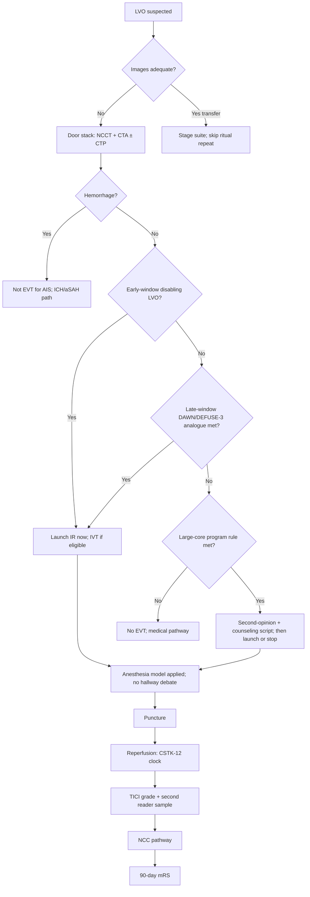

# Endovascular Therapy Program

## Opening

Endovascular therapy is the capability that makes a Comprehensive Stroke Center a mothership rather than a very good primary stroke hospital. The Medical Director does not have to be the operator. The Medical Director does have to own 24/7 team design, the anesthesia model, the inclusion logic across early-window LVO, late-window DAWN/DEFUSE-3-type imaging, and large-core program rules, the transfer-in pathway, on-call backup, and peer review of TICI and complications.

The early-window EVT trials and HERMES (mRS 0–2 46.0 percent versus 26.5 percent; NNT 2.6 for at least a one-point mRS shift) remain the reason a positive CTA at the door is an IR launch, not a conference. DAWN and DEFUSE 3 remain the late-window logic. SELECT2, ANGEL-ASPECT, and RESCUE-Japan LIMIT made large-core EVT a program-design issue rather than a whispered exception. Write the local rule for each population. Do not leave it to the operator who happens to be on call.

CSTK-08, CSTK-09, CSTK-11, and CSTK-12 are the public reperfusion measures. Target: Stroke Advanced Therapy and Phase III set the door-to-device floors: 50 percent ≤90 minutes for direct arrivals and ≤60 minutes for transfers. Elite internal targets should be tighter. Award floors are not the design spec.

## Why This Matters

A CSC that cannot puncture at 03:00 on a holiday is not a CSC at that hour. Historical Joint Commission capability language still used operationally includes 24/7 neurointervention. Confirm current numeric EVT volume expectations in the active E-App / DSC manual; do not run the program on a remembered number from an older slide deck.

Time is the first quality problem. CSTK-09 (arrival to skin puncture), CSTK-11 (TICI ≥2B within 120 minutes of arrival), and CSTK-12 (TICI ≥2B within 60 minutes of puncture) will expose a slow door, a slow room, or a slow operator with more honesty than a morbidity conference. CSTK-08 (TICI post-treatment reperfusion grade) is worthless if grading is not peer-reviewed.

Inclusion is the second quality problem. Early-window proximal LVO with disabling deficit is not optional. Late-window patients need a written imaging rule. Large-core patients need a written program rule that names which trial logic the center is operationalizing, how family counseling is done, and how futile or comfort-leaning cases are kept out of the suite without becoming informal age discrimination.

Anesthesia is the third. A CSC that has not chosen conscious sedation versus general anesthesia as a default-plus-exception model will lose 20 minutes to a hallway debate and then lose the airway on the table. Transfer EVT is the fourth: the referring hospital and the aircraft are part of the procedure. Backup call is the fifth: illness, overlapping aSAH, and the second LVO of the night are predictable.

Complications — hemorrhage, dissection, embolization to a new territory, access injury — belong in a structured peer-review file, not in a private IR chat. CSTK-05 will capture some hemorrhagic transformation; it will not capture the rest.

## Core Framework

### Three populations, one program

| Population | Evidence spine | Operational rule the program must write | Common failure |
| --- | --- | --- | --- |
| Early-window LVO | MR CLEAN, ESCAPE, EXTEND-IA, SWIFT PRIME, REVASCAT; HERMES | Disabling LVO: launch. IVT if eligible, without delaying puncture. | Waiting for "the full NIHSS in the suite" |
| Late-window (about 6–24 h class) | DAWN; DEFUSE 3 | Publish the local imaging analogue (perfusion and/or clinical-core mismatch) and the clock definitions | Each operator using a private cutoff |
| Large core | SELECT2; ANGEL-ASPECT; RESCUE-Japan LIMIT | Program-level inclusion, counseling script, and when not to offer | Informal "I don't do those" vs "I do all of those" depending on the call schedule |

The 2026 AIS guideline is the practice authority for offering EVT and for not delaying it for IVT. Trial names in the table are design inputs, not a menu the family is asked to order from.

Large-core as program design, not case-by-case folklore:

1. Decide whether the center offers EVT for large-core presentations that match the trial populations, and write the imaging definition (CT ASPECTS / core volume method) the center will use.
2. Decide who may say no. A single operator veto without a second opinion is not a program.
3. Write the goals-of-care script before the first 02:00 large-core transfer. Survival with severe disability is a possible outcome; do not pretend the conversation is the same as HERMES-era small-core counseling.
4. Track outcomes (90-day mRS, CSTK-02/10) separately for large-core so the program can see what it is actually producing.
5. Revisit the rule when new guideline text or new trials supersede the 2022–2023 large-core cluster.

### 24/7 team and on-call backup

| Role | Minimum operational expectation | Backup rule |
| --- | --- | --- |
| Neurointerventional attending | In-house or published response time that makes CSTK-11 possible | Second attending on a backup panel; overlapping aSAH/LVO rule written |
| IR technologist and nurse | Two-deep at night | Cross-trained pool; no "only one person knows the room" |
| Anesthesia | Per chosen model, same speed at night | Backup anesthesiologist for GA conversions |
| Stroke attending | At puncture decision and available for intra-procedure neurologic change | Fellow may first-respond; attending closed loop |
| NCC / receiving bed | A bed plan, not a hope | Overflow algorithm owned by the Medical Director (Chapter 15) |
| Transfer center | Images before wheels down | Escalate missing images as a defect |

Write an "operator down" and "two rooms" algorithm. Academic CSCs with a single night operator and a busy aneurysm practice will otherwise steal the LVO window for a problem that could have been sequenced.

### Anesthesia model

Choose a default. Publish exceptions.

| Model | Use when | Operational requirement |
| --- | --- | --- |
| Conscious sedation default | Cooperative, protected airway, expected short puncture-to-reperfusion | Sedation-competent IR/stroke nurses; instant GA conversion kit |
| General anesthesia default | Center choice, or always for unstable / aphasic / vomiting / posterior / pediatric | Anesthesia on the parallel page, not called after groin prep |
| Case-by-case | Only if the decision tree is written and does not add a discussion delay | Tree posted; time-to-anesthesia-decision audited |

The Medical Director and the IR director sign the model together. Changing it for one operator's preference is a program change, not a personality right.

### Clocks and CSTK reperfusion measures

| Measure | What it is | How the program uses it |
| --- | --- | --- |
| CSTK-08 | TICI post-treatment reperfusion grade | Every case graded; peer review of grade vs film |
| CSTK-09 | Arrival time to skin puncture (overall) | Door-to-puncture management system |
| CSTK-11 | TICI ≥2B within 120 min of arrival | Combined door + room + operator speed |
| CSTK-12 | TICI ≥2B within 60 min of puncture | Room and operator problem when door was fine |
| Target: Stroke Advanced Therapy / Phase III | 50% door-to-device ≤90 min direct / ≤60 min transfer | Award floor; internal medians tighter |
| CSTK-01 | NIHSS before recanalization | Still required in the rush to the suite |
| CSTK-02 / CSTK-10 | 90-day mRS; favorable 90-day mRS | Outcome, not just speed |
| CSTK-05 | Hemorrhagic transformation | Safety paired with reperfusion |

TICI grading is a shared language. If only the operator grades the case, CSTK-08 is an honor system. Require a second reader on a sample large enough to scare everyone into honesty, and on every claimed 2C/3 that looks like a 2B in M&M.

### Transfer EVT

Transfer EVT is a product. Design it as if the referring physician were a member of the team.

1. **Accept on images plus a clock**, not on a story. Last known well, NIHSS, IVT status and agent, anticoagulant, airway, BP, and a working image link.
2. **Do not repeat the PSC stack** without an adequacy failure ([Imaging Architecture](12-imaging-architecture.md)).
3. **Straight to suite** when images are adequate and the airway is safe.
4. **Keep IVT running** if alteplase is infusing; do not park the patient to "let it finish."
5. **Family may be hours behind.** Emergency exception and remote consent follow local counsel; write the rule before the argument.
6. **Repatriation** is a network promise, not an afterthought ([Telestroke](19-telestroke-networks.md), [Network Leadership](../strategy/33-network-leadership.md)).
7. **Feedback** to the referring site mirrors EMS feedback: 72 hours, diagnosis, TICI, times, one teaching point.

Door-to-device ≤60 minutes for transfers is an Advanced Therapy / Phase III threshold. It is only possible if the suite is staged before wheels down.

### Peer review of TICI and complications

| File | Cadence | Required elements |
| --- | --- | --- |
| TICI discordance | Monthly sample + all CSTK-11/12 failures | Operator grade, second-reader grade, film |
| Access and technical complications | Every case | Dissection, perforation, embolus to new territory, groin injury |
| Symptomatic ICH / CSTK-05 | Every case | Device, passes, BP, IVT, time |
| Futile or aborted | Every case | Why launched, why stopped, counseling |
| 90-day mRS outliers | Quarterly | CSTK-02/10; large-core stratum |
| Transfer defects | Monthly | Images late, repeat CT, suite not ready |

Peer review is confidential under the local quality statute. It is not optional because someone is tenured.

!!! tip "Key Actions"
    Write three inclusion pages: early-window LVO, late-window imaging analogue, large-core program rule. Sign a 24/7 team roster with a named backup operator and a two-room algorithm. Publish the anesthesia default and the GA-conversion kit. Make transfer-in a straight-to-suite product with images on the wire. Grade TICI with a second reader sample. Review every CSTK-11 and CSTK-12 miss within seven days. Confirm current EVT volume language in the E-App instead of reciting a remembered number.

!!! abstract "Metrics Targets"
    Target: Stroke Advanced Therapy / Phase III: 50% door-to-device ≤90 min direct and ≤60 min transfer. CSTK-09 arrival to puncture. CSTK-11 TICI ≥2B within 120 min of arrival. CSTK-12 TICI ≥2B within 60 min of puncture. CSTK-08 TICI grade complete on every MER case. CSTK-01 NIHSS before recanalization. CSTK-02 and CSTK-10 90-day mRS. CSTK-05 hemorrhagic transformation. Internal sample posture: tighter medians than award floors; 100% review of Advanced Therapy misses; second-reader TICI concordance target set locally; backup-panel utilization logged; transfer images-before-arrival rate near 100%. Do not invent a current Joint Commission EVT volume number; confirm the active eligibility table.

!!! warning "Common Pitfalls"
    One night operator and no backup when an aneurysm and an LVO collide. Late-window criteria that change with the call schedule. Large-core nihilism or large-core adventurism without a written rule. Calling anesthesia after the groin is prepped. Repeating the entire PSC CT. Letting the operator be the only TICI rater. Counting "device in" as reperfusion. Ignoring CSTK-01 because the patient was intubated. Using age as a silent large-core exclusion. No repatriation plan, so referring PSCs stop calling. Treating HERMES numbers as the expected outcome for a SELECT2 anatomy.

!!! success "Implementation Tips"
    Stage the suite on prenote for every LVO-screen-positive and every accepted transfer. Put CSTK-11 and CSTK-12 on the same weekly huddle as DTN so IVT and EVT stop competing. Film a transfer-in arrival quarterly. Give referring sites a one-page "what the CSC needs in order to accept" card. When a new operator joins, privilege the program rules, not only the technical skill. Separate quality TICI review from employment actions unless a pattern meets the medical-staff threshold. If large-core is offered, add a counselor or NCC attending to the 02:00 script so the operator is not the only voice on prognosis.

## How to Do the Work

### Daily / weekly

- Know who is on primary and backup IR call tonight. A blank backup slot is a page to the IR director.
- Review last night's EVT: door-to-puncture, puncture-to-2B, TICI, IVT overlap, anesthesia model used, transfer vs direct.
- Review every Advanced Therapy or CSTK-11/12 miss the same week.
- Confirm inbound images arrived before the patient.
- Check NIHSS-before-recanalization on every MER case.

### Monthly / quarterly

- Scorecard: volume by population (early / late / large-core), times, TICI distribution, complications, 90-day mRS when due, night vs day, transfer vs direct.
- TICI second-reader session.
- Anesthesia-model compliance and GA-conversion events.
- Transfer defects and referring-site feedback.
- On-call backup activations and two-room events.
- Equity: time and offer rates by sex, language, night, and geography.
- Joint IR–stroke–NCC M&M.

### Annual / multi-year

- Re-ratify late-window and large-core rules against current AHA/ASA text.
- Recheck E-App EVT eligibility language.
- Workforce: backup depth, succession, and whether the night pool is three tired people.
- Capital: biplane reliability, backup room, anesthesia machine in the IR suite.
- Network: which TSCs should keep local EVT and which should transfer — a strategy question, not a trophy question.
- Research: StrokeNet EVT trials attach to the same launch without adding a sequential consent that burns CSTK-12.

## Ready-to-Adapt Tools

Samples to adapt with IR, anesthesia, and medical staff.

### Sample SOP skeleton — early-window EVT

**Title:** Early-window LVO thrombectomy  
**Owner:** CSC Medical Director and IR director (dyad)  

1. **Indication.** Disabling deficit, LVO on CTA/MRA, early window per current AHA/ASA.
2. **IVT.** Give if eligible; do not delay puncture.
3. **Activation.** Parallel IR page from LVO screen or CTA.
4. **Anesthesia.** Apply the signed default.
5. **Clocks.** Timekeeper records arrival, puncture, first ≥2B.
6. **TICI.** Operator grade same day; second reader per sampling rule.
7. **Disposition.** NCC pathway (Chapter 15).

### Sample SOP skeleton — late-window EVT

1. **Imaging rule.** Insert the center's DAWN/DEFUSE-3 analogue (perfusion and/or clinical-core mismatch) with clock starts defined.
2. **Who may decline.** Attending pair (stroke + IR), not a solo text.
3. **Counseling.** Script that this is selected imaging, not a guarantee of HERMES-like outcomes.
4. **Otherwise** same as early-window operations.

### Sample SOP skeleton — large-core program rule

1. **Definition.** Imaging method and thresholds the center uses (do not leave "large core" undefined).
2. **Offer.** Yes / no / trial-only — pick one.
3. **Second opinion.** Required before a no in a transferring patient who meets the written offer rule.
4. **Goals of care.** NCC or stroke attending leads; operator adds technical risk.
5. **Outcomes.** Separate 90-day mRS file.
6. **Review.** Every large-core launch and every large-core decline.

### Sample SOP skeleton — transfer-in EVT

1. Accept packet: images, LKW, NIHSS, IVT agent/time, airway, BP, ETA.
2. Suite staged before wheels down.
3. Destination: suite vs CT vs ED per written tree.
4. No ritual repeat imaging.
5. Family/consent rule.
6. 72-hour referring-site feedback.
7. Repatriation trigger.

### Sample time-target grid — EVT

| Interval | Award / measure floor | Sample internal rule |
| --- | --- | --- |
| Door → puncture (direct) | Advanced Therapy 50% ≤90 min; CSTK-09 | Review all >75 min |
| Door → puncture (transfer) | Advanced Therapy 50% ≤60 min | Review all >45 min |
| Puncture → TICI ≥2B | CSTK-12 within 60 min | Peer review all failures |
| Arrival → TICI ≥2B | CSTK-11 within 120 min | Peer review all failures |
| Accept → images on wire | Local | Failure is a transfer-center defect |
| Operator backup arrival | Local | Two-room algorithm drill yearly |

### Sample role card — IR attending

- Punctures without waiting for lytic completion.
- Grades TICI honestly the same day.
- Activates backup rather than stacking two emergencies silently.
- Follows the large-core rule even when it disagrees with a personal prior.

### Sample role card — stroke attending (EVT)

- Classifies early / late / large-core.
- Ensures NIHSS is done (CSTK-01).
- Leads or assigns the counseling script.
- Does not "save the case for the morning operator."

### Sample role card — anesthesia

- On the parallel page when the model requires it.
- Converts sedation to GA by kit, not by debate.
- Documents times that affect puncture-to-reperfusion.

### Sample RACI — large-core offer

| Task | Stroke attending | IR attending | NCC | Med Dir | Counselor/SW |
| --- | --- | --- | --- | --- | --- |
| Program rule | R | R | C | A | I |
| Night offer | R | R | C | I | C |
| Night decline of an otherwise eligible transfer | R | R | C | A if disputed | I |
| 90-day outcome file | C | C | C | A | I |

### Sample weekly EVT huddle add-on (10 minutes)

1. Cases: direct / transfer / late / large-core.
2. Any CSTK-11/12 or Advanced Therapy miss — one defect sentence.
3. TICI that will go to second reader.
4. Backup or two-room event.
5. Referring-site image failure.

## Integration With Other Pillars

EVT is why [Prehospital](10-prehospital-ems.md) LVO routing exists and why [Hyperacute Pathways](11-hyperacute-pathways.md) run a parallel IR page. [Imaging](12-imaging-architecture.md) supplies the late-window and large-core definitions. [IVT](13-iv-thrombolysis.md) is concurrent, not a competitor. [Neurocritical Care](15-neurocritical-care.md) receives every reperfusion and every complication. [Hemorrhagic and complex cerebrovascular](21-hemorrhagic-complex.md) shares the same operators and the same night; the two-room algorithm is the peace treaty.

Quality: CSTK-08/09/11/12, CSTK-01/02/05/10 ([Core Metrics](../quality/23-core-metrics.md)). Network and finance: transfer products and biplane capital ([Network Leadership](../strategy/33-network-leadership.md); [Financial Stewardship](../strategy/34-financial-stewardship.md)). Education: fellowship and IR training must not slow CSTK-12; supervision rules are explicit. Research: EVT trials are a screening attachment, not a second pathway. Elite status is a door-to-device management system ([Elite Performance](../strategy/36-elite-performance.md)).

## Sources

- 2026 Guideline for the Early Management of Patients With Acute Ischemic Stroke. *Stroke*. 2026;57(8):e316–e436. DOI 10.1161/STR.0000000000000513. Concurrent IVT+EVT; no delay of thrombectomy.
- Early-window EVT: MR CLEAN, ESCAPE, EXTEND-IA, SWIFT PRIME, REVASCAT; HERMES collaboration 2016 (mRS 0–2 46.0% vs 26.5%; NNT 2.6 for ≥1-point mRS shift).
- Late window: DAWN; DEFUSE 3.
- Large core as program design: SELECT2; ANGEL-ASPECT; RESCUE-Japan LIMIT.
- CSTK v2026B: CSTK-08, CSTK-09, CSTK-11, CSTK-12; also CSTK-01, CSTK-02, CSTK-05, CSTK-10. CSTK-07 is not in the current set.
- Target: Stroke Advanced Therapy and Phase III door-to-device thresholds (50% ≤90 min direct / ≤60 min transfer).
- Joint Commission CSC 24/7 neurointervention capability; confirm current EVT volume tables in the active E-App / DSC manual rather than restating unverified numbers.
- EXTEND-IA TNK as the pre-EVT lytic operations link to Chapter 13.
