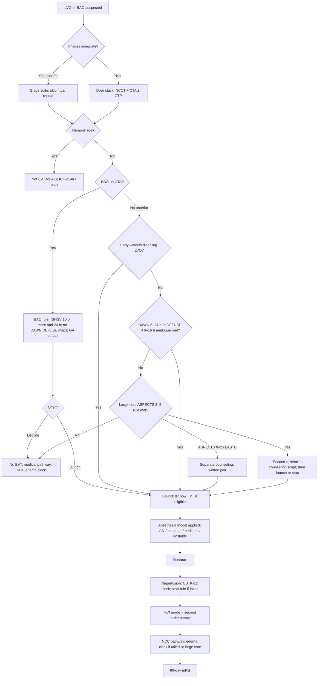
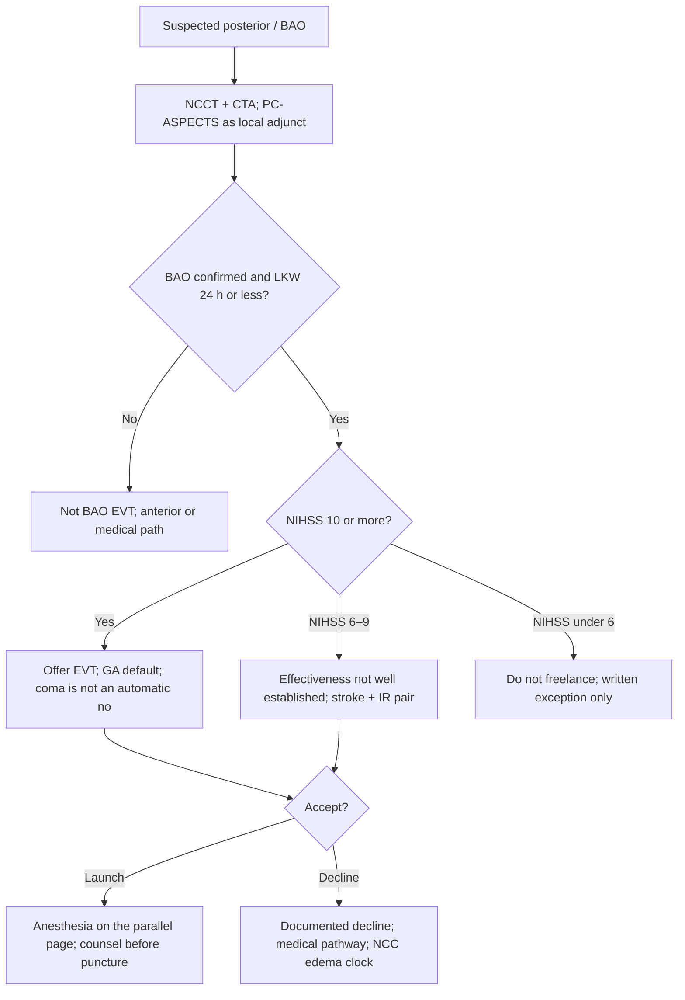

# Endovascular Therapy Program

## Opening

Endovascular therapy is the capability that makes a Comprehensive Stroke Center a mothership rather than a very good primary stroke hospital. The Medical Director does not have to be the operator. The Medical Director does have to own 24/7 team design, the anesthesia model, the inclusion logic across early-window LVO, DAWN 6–24 h, DEFUSE 3 6–16 h, basilar-artery occlusion, and large-core program rules, the transfer-in pathway, access default, on-call backup, and peer review of TICI and complications.

The early-window EVT trials and HERMES (mRS 0–2 46.0 percent versus 26.5 percent; NNT 2.6 for at least a one-point mRS shift) remain the reason a positive CTA at the door is an IR launch, not a conference. DAWN (6–24 h) and DEFUSE 3 (6–16 h) are separate late-window clocks — never a single “6–24 h class.” The 2026 AIS guideline already endorses selected large-core EVT (ASPECTS 3–5 class) and gives a strong recommendation for BAO EVT within 24 hours if NIHSS ≥10 (ATTENTION / BAOCHE; ER-AIS-2026-BAO). Write the local rule for each population. Do not leave it to the operator who happens to be on call.

CSTK reperfusion IDs live in [Core Metrics](../quality/23-core-metrics.md). Target: Stroke Advanced Therapy remains **50 percent** door-to-device ≤90 minutes direct and ≤60 minutes transfer. Door-to-device is first pass with the thrombectomy device; CSTK-09 is arrival to skin puncture — different clocks (ER-TS-AT-DEF). Award criteria are not CSC certification floors.

## Why This Matters

A CSC that cannot puncture at 03:00 on a holiday is not a CSC at that hour. Historical Joint Commission capability language still used operationally includes 24/7 neurointervention. Confirm current numeric EVT volume expectations in the active E-App / DSC manual; do not run the program on a remembered number from an older slide deck.

Time is the first quality problem. CSTK-09, CSTK-11, and CSTK-12 will expose a slow door, a slow room, or a slow operator with more honesty than a morbidity conference. CSTK-08 is worthless if grading is not peer-reviewed. Do not manage the Advanced Therapy device-pass clock as if it were puncture.

Inclusion is the second quality problem. Early-window proximal LVO with disabling deficit is not optional. Late-window patients need two written imaging clocks (DAWN 6–24 h; DEFUSE 3 6–16 h). BAO is its own rule — do not apply DAWN/DEFUSE perfusion maps. Large-core patients need a written program rule that implements the 2026 AIS ASPECTS 3–5 class, counsels ASPECTS 0–2 / LASTE separately, and keeps futile or comfort-leaning cases out of the suite without becoming informal age discrimination.

Anesthesia is the third. Choose a default. The 2026 AIS text treats general anesthesia and sedation as comparable on 90-day outcomes; that is not a license for a hallway debate, and it is not a license to skip GA for posterior, pediatric, or unstable patients. Transfer EVT is the fourth: the referring hospital and the aircraft are part of the procedure. Backup call is the fifth: illness, overlapping aSAH, and the second LVO of the night are predictable. Access, tandem lesions, and the failed-recanalization stop-rule are written program rules, not operator folklore.

Complications — hemorrhage, dissection, embolization to a new territory, access injury — belong in a structured peer-review file, not in a private IR chat. CSTK-05 will capture some hemorrhagic transformation; it will not capture the rest.

## Core Framework

### EVT populations, one program

| Population | Evidence spine | Operational rule the program must write | Common failure |
| --- | --- | --- | --- |
| Early-window LVO | MR CLEAN, ESCAPE, EXTEND-IA, SWIFT PRIME, REVASCAT; HERMES | Disabling LVO: launch. IVT if eligible, without delaying puncture. | Waiting for "the full NIHSS in the suite" |
| Late-window DAWN 6–24 h | DAWN; ER-TR-DAWN-DEF3 | Publish the clinical-core mismatch analogue and the DAWN clock starts | Collapsing DAWN into a “6–24 h class” with DEFUSE 3 |
| Late-window DEFUSE 3 6–16 h | DEFUSE 3; ER-TR-DAWN-DEF3 | Publish the perfusion-mismatch analogue and the DEFUSE 3 clock (stops at 16 h) | Using a 24-hour DEFUSE clock the trial never wrote |
| BAO / posterior | ATTENTION; BAOCHE; 2026 AIS strong rec (ER-AIS-2026-BAO) | EVT within 24 h if NIHSS ≥10. Do not apply DAWN/DEFUSE maps. GA default. Coma is not an automatic no. | Treating posterior as “too sick” or running anterior perfusion maps |
| Large core | 2026 AIS ASPECTS 3–5 class; SELECT2; ANGEL-ASPECT; RESCUE-Japan LIMIT | Local rule implements the guideline. Counsel ASPECTS 0–2 / LASTE separately. | Waiting for “new guideline text,” or offering 0–2 as if it were 3–5 |

The 2026 AIS guideline is the practice authority for offering EVT and for not delaying it for IVT. Trial names in the table are design inputs, not a menu the family is asked to order from.

Medium- and distal-vessel occlusion (MeVO / DMVO): no freelance distal EVT on call until a written program rule exists. The 2026 AIS text is the practice authority for which distal segments are not recommended.

Large-core as program design, not case-by-case folklore:

1. The 2026 AIS guideline already endorses selected large-core EVT (ASPECTS 3–5 class). The local rule implements that text. Do not wait for newer guideline language before writing the page.
2. Write the imaging definition (CT ASPECTS / core volume method) the center will use. Counsel ASPECTS 0–2 / LASTE as a separate conversation — not as if it were the ASPECTS 3–5 class.
3. Decide who may say no. A single operator veto without a second opinion is not a program.
4. Write the goals-of-care script before the first 02:00 large-core transfer. Survival with severe disability is a possible outcome; do not pretend the conversation is the same as HERMES-era small-core counseling.
5. Track outcomes (90-day mRS, CSTK-02/10) separately for large-core, and separately again for ASPECTS 0–2 / LASTE if those cases are offered.

### 24/7 team and on-call backup

| Role | Minimum operational expectation | Backup rule |
| --- | --- | --- |
| Neurointerventional attending | In-house or published response time that makes CSTK-11 possible | Second attending on a backup panel; overlapping aSAH/LVO rule written |
| IR technologist and nurse | Two-deep at night | Cross-trained pool; no "only one person knows the room" |
| Anesthesia | Per chosen model, same speed at night | Backup anesthesiologist for GA conversions |
| Stroke attending | At puncture decision and available for intra-procedure neurologic change | Fellow may first-respond; attending closed loop |
| NCC / receiving bed | A bed plan, not a hope | Overflow algorithm owned by the Medical Director (Chapter 15) |
| Transfer center | Images before wheels down | Escalate missing images as a defect |

Write an "operator down" and "two rooms" algorithm. Academic CSCs with a single night operator and a busy aneurysm practice will otherwise steal the LVO window for a problem that could have been sequenced.

### Anesthesia model

Choose a default. Publish exceptions. The 2026 AIS guideline recommends either general anesthesia or procedural sedation to facilitate EVT — 90-day outcomes do not force one model. That equivalence is not a hallway debate. Sign one default. Keep GA as the default for posterior circulation (including BAO), pediatric AIS, and the unstable / unprotected airway.

| Model | Use when | Operational requirement |
| --- | --- | --- |
| Conscious sedation default | Cooperative, protected airway, expected short puncture-to-reperfusion, anterior circulation | Sedation-competent IR/stroke nurses; instant GA conversion kit |
| General anesthesia default | Center choice; always for posterior / BAO / pediatric / unstable / aphasic / vomiting | Anesthesia on the parallel page, not called after groin prep |
| Case-by-case | Only if the decision tree is written and does not add a discussion delay | Tree posted; time-to-anesthesia-decision audited |

The Medical Director and the IR director sign the model together. Changing it for one operator's preference is a program change, not a personality right.

### Access

Default femoral versus radial is a local written default, not an operator habit. Pregnancy is radial-first when possible (ER-MAT-2026-03; [Special Populations](42-special-populations.md)). Write the failed-radial conversion: when to convert, who converts, and how that conversion is timed against the CSTK-12 clock. Attach every groin complication to the peer-review file in the table below — not to a private IR chat.

### Tandem lesions

Intracranial reperfusion first versus acute cervical stent is a written program rule, signed by the IR director and the Medical Director. Do not invent dual-antiplatelet doses in this handbook. When an acute cervical stent is placed after tenecteplase or alteplase, DAPT is a documented attending decision with a named owner, not a verbal “load them.” Who consents for the stent is written before the first 02:00 tandem. Peer-review every acute cervical stent — indication, sequence (intracranial first or not), antiplatelet choice, and hemorrhagic outcome.

### Failed recanalization

Max-passes, ICAD rescue-stent, and abort are a written stop-rule, not a mood. The 2026 AIS text leaves rescue intracranial angioplasty/stenting uncertain — that is an argument for a local stop-rule, not for improvisation. When the case is aborted or reperfusion is incomplete, start the NCC edema clock immediately and point the triad at [Neurocritical Care](15-neurocritical-care.md) hemicraniectomy operations. Do not send a failed large-core or failed BAO to a monitored floor “to see how they do overnight.”

### Clocks and CSTK reperfusion measures

| Measure | What it is | How the program uses it |
| --- | --- | --- |
| CSTK-08 | TICI post-treatment reperfusion grade | Every case graded; peer review of grade vs film |
| CSTK-09 | Arrival time to **skin puncture** | Door-to-puncture management system — not the Advanced Therapy clock |
| Target: Stroke Advanced Therapy | **50%** door-to-**device** ≤90 min direct / ≤60 min transfer | First pass with the thrombectomy device (ER-TS-AT-DEF). Award criterion, not a CSC floor |
| CSTK-11 | TICI ≥2B within 120 min of arrival | Combined door + room + operator speed |
| CSTK-12 | TICI ≥2B within 60 min of puncture | Room and operator problem when door was fine |
| CSTK-01 / 02 / 05 / 10 | NIHSS before recanalization; 90-day mRS; hemorrhagic transformation | Still required in the rush to the suite |

TICI grading is a shared language. If only the operator grades the case, CSTK-08 is an honor system. Require a second reader on a sample large enough to scare everyone into honesty, and on every claimed 2C/3 that looks like a 2B in M&M.

### Transfer EVT

Transfer EVT is a product. Design it as if the referring physician were a member of the team.

1. **Accept on images plus a clock**, not on a story. Last known well, NIHSS, IVT status and agent, anticoagulant, airway, BP, and a working image link.
2. **Do not repeat the PSC stack** without an adequacy failure ([Imaging Architecture](12-imaging-architecture.md)).
3. **Straight to suite** when images are adequate and the airway is safe.
4. **Keep IVT running** if alteplase is infusing; do not park the patient to "let it finish."
5. **Family may be hours behind.** Emergency exception and remote consent follow local counsel; write the rule before the argument.
6. **Repatriation** is a network promise, not an afterthought ([Telestroke](19-telestroke-networks.md), [Network Leadership](../strategy/33-network-leadership.md)).
7. **Feedback** to the referring site mirrors EMS feedback: 72 hours, diagnosis, TICI, times, one teaching point.

Advanced Therapy is **50 percent** door-to-device ≤60 minutes for transfers. It is only possible if the suite is staged before wheels down. Do not report puncture as device pass.

### Peer review of TICI and complications

| File | Cadence | Required elements |
| --- | --- | --- |
| TICI discordance | Monthly sample + all CSTK-11/12 failures | Operator grade, second-reader grade, film |
| Access and technical complications | Every case | Dissection, perforation, embolus to new territory, groin injury |
| Symptomatic ICH / CSTK-05 | Every case | Device, passes, BP, IVT, time |
| Futile or aborted | Every case | Why launched, why stopped, counseling |
| Acute cervical stent | Every case | Sequence, consent, antiplatelet decision, hemorrhage |
| 90-day mRS outliers | Quarterly | CSTK-02/10; large-core stratum |
| Transfer defects | Monthly | Images late, repeat CT, suite not ready |

Peer review is confidential under the local quality statute. It is not optional because someone is tenured.



!!! tip "Key Actions"
    Write inclusion pages for early-window LVO, DAWN 6–24 h, DEFUSE 3 6–16 h, BAO, and large-core (ASPECTS 3–5 implement; 0–2 / LASTE counsel separately). Sign a 24/7 roster with a named backup operator and a two-room algorithm. Publish the anesthesia default (GA for posterior / pediatric / unstable), the access default (radial-first in pregnancy), the tandem sequence rule, and the failed-recanalization stop-rule. Make transfer-in a straight-to-suite product. Grade TICI with a second reader sample. Review every CSTK-11/12 miss and every Advanced Therapy miss within seven days. Confirm current EVT volume language in the E-App.

!!! abstract "Metrics Targets"
    Advanced Therapy: **50%** door-to-device ≤90 min direct / ≤60 min transfer (device pass ≠ CSTK-09 puncture; ER-TS-AT-DEF). CSTK reperfusion IDs and 90-day mRS: [Core Metrics](../quality/23-core-metrics.md). Internal sample: tighter medians than award floors; 100% review of Advanced Therapy misses; second-reader TICI concordance set locally; backup-panel utilization logged; transfer images-before-arrival near 100%; every acute cervical stent and every aborted case in peer review. Do not invent a current Joint Commission EVT volume number.

!!! warning "Common Pitfalls"
    Collapsing DAWN and DEFUSE 3 into a “6–24 h class.” Applying anterior perfusion maps to BAO. Treating coma as an automatic BAO no. Waiting for “new guideline text” before writing the ASPECTS 3–5 rule, or counseling ASPECTS 0–2 as if it were 3–5. Freelance distal / MeVO EVT on call. Calling anesthesia after groin prep. Default access that changes with the operator. Acute cervical stent without a written DAPT-after-lytic rule. No max-passes / abort stop-rule, so the NCC edema clock starts in the morning. Counting puncture as device pass. One night operator when an aneurysm and an LVO collide.

!!! success "Implementation Tips"
    Stage the suite on prenote for every LVO-screen-positive and every accepted transfer. Put CSTK-11/12 and the Advanced Therapy device-pass clock on the same weekly huddle as DTN. Film a transfer-in arrival quarterly. Privilege new operators on the program rules — BAO, large-core, tandem, stop-rule, access — not only technical skill. Add an NCC attending to the 02:00 large-core and BAO scripts so the operator is not the only voice on prognosis. Keep the groin-complication file on the same monthly agenda as TICI discordance.

## How to Do the Work

### Daily / weekly

- Know who is on primary and backup IR call tonight. A blank backup slot is a page to the IR director.
- Review last night's EVT: door-to-puncture, door-to-device (first pass), puncture-to-2B, TICI, IVT overlap, anesthesia model used, access used, transfer vs direct, BAO vs anterior, large-core vs not.
- Review every Advanced Therapy or CSTK-11/12 miss the same week. Do not treat a puncture-on-time / device-late case as a hit.
- Confirm inbound images arrived before the patient.
- Check NIHSS-before-recanalization on every MER case.
- Log any aborted case, ICAD rescue-stent, or acute cervical stent for peer review.

### Monthly / quarterly

- Scorecard: volume by population (early / DAWN / DEFUSE 3 / BAO / large-core ASPECTS 3–5 / 0–2), times (puncture and device pass), TICI, complications, 90-day mRS when due, night vs day, transfer vs direct.
- TICI second-reader session; every acute stent; every abort.
- Anesthesia-model compliance, GA-conversion events, access-default compliance (including pregnancy radial-first).
- Transfer defects and referring-site feedback.
- On-call backup activations and two-room events.
- Equity: time and offer rates by sex, language, night, and geography — including BAO and large-core declines.
- Joint IR–stroke–NCC M&M, including failed recanalization and the edema clock.

### Annual / multi-year

- Re-ratify DAWN, DEFUSE 3, BAO, large-core (ASPECTS 3–5 vs 0–2 / LASTE), tandem, access, and stop-rule pages against current AHA/ASA text. Do not wait for a future guideline to implement the 2026 large-core class.
- Recheck E-App EVT eligibility language.
- Workforce: backup depth, succession, and whether the night pool is three tired people.
- Capital: biplane reliability, backup room, anesthesia machine in the IR suite.
- Network: which TSCs should keep local EVT and which should transfer — a strategy question, not a trophy question.
- Research: StrokeNet EVT trials attach to the same launch without adding a sequential consent that burns CSTK-12.

## Ready-to-Adapt Tools

Samples to adapt with IR, anesthesia, and medical staff.

### Sample SOP skeleton — early-window EVT

**Title:** Early-window LVO thrombectomy  
**Owner:** CSC Medical Director and IR director (dyad)  

1. **Indication.** Disabling deficit, LVO on CTA/MRA, early window per current AHA/ASA.
2. **IVT.** Give if eligible; do not delay puncture.
3. **Activation.** Parallel IR page from LVO screen or CTA.
4. **Anesthesia.** Apply the signed default.
5. **Clocks.** Timekeeper records arrival, puncture, first device pass, first ≥2B. Device pass is not puncture.
6. **TICI.** Operator grade same day; second reader per sampling rule.
7. **Disposition.** NCC pathway (Chapter 15).

### Sample SOP skeleton — late-window EVT

1. **Two clocks.** DAWN analogue 6–24 h (clinical-core mismatch). DEFUSE 3 analogue 6–16 h (perfusion mismatch). Never a single “6–24 h class.”
2. **Who may decline.** Attending pair (stroke + IR), not a solo text.
3. **Counseling.** Script that this is selected imaging, not a guarantee of HERMES-like outcomes.
4. **Otherwise** same as early-window operations.

### Sample SOP skeleton — BAO

**Title:** Basilar-artery occlusion thrombectomy  
**Owner:** CSC Medical Director and IR director (dyad)  
**Authority:** 2026 AIS strong rec; ATTENTION / BAOCHE; ER-AIS-2026-BAO



1. **Imaging.** CTA to confirm BAO. PC-ASPECTS is a local imaging adjunct — write the house rule; do not invent a second unpublished cut. Do not apply DAWN/DEFUSE perfusion maps.
2. **Indication.** Strong recommendation within 24 h if NIHSS ≥10. NIHSS 6–9: effectiveness not well established. Coma ≠ automatic no.
3. **Anesthesia.** GA default. Parallel page, not after groin prep.
4. **Accept / decline.** Stroke + IR pair. Documented decline goes to the peer-review file.
5. **Counseling.** Posterior outcomes are not HERMES anterior numbers. Time-limited ICU trial named.
6. **Disposition.** NCC pathway; edema / decompression clock if reperfusion fails ([Neurocritical Care](15-neurocritical-care.md)).

### Sample SOP skeleton — large-core program rule

```
TITLE: Large-core EVT program rule    ID: SOP-CSC-EVT-LC
Owner: CSC Medical Director + IR director
Review: implements 2026 AIS ASPECTS 3–5 class now — do not wait for newer guideline text

Imaging method: [ ] ASPECTS on NCCT   [ ] core mL on CTP/MR    product: ________
ASPECTS 3–5 (2026 AIS endorsed class): offer per written rule    [ ] yes
ASPECTS 0–2 / LASTE: separate counseling page    [ ] written  [ ] not offered
Clock: last known well ________    window class: [ ] early  [ ] late
Who may offer: stroke attending + IR attending
Who may decline an otherwise eligible transfer: the pair above; Medical Director if disputed
Counseling (read aloud): survival with severe disability is a possible outcome;
  this is not a HERMES small-core conversation. Time-limited ICU trial: __ hours
Decline reason (100% peer review if "judgment"):
  [ ] below threshold  [ ] goals of care  [ ] medically unstable
  [ ] family decline  [ ] judgment
90-day mRS file, separate large-core stratum: [ ] 3–5  [ ] 0–2 / LASTE
```

### Sample SOP skeleton — transfer-in EVT

1. Accept packet: images, LKW, NIHSS, IVT agent/time, airway, BP, ETA.
2. Suite staged before wheels down.
3. Destination: suite vs CT vs ED per written tree.
4. No ritual repeat imaging.
5. Family/consent rule.
6. 72-hour referring-site feedback.
7. Repatriation trigger.

### Sample time-target grid — EVT

| Interval | Award / measure floor | Sample internal rule |
| --- | --- | --- |
| Door → first device pass (direct) | Advanced Therapy **50%** ≤90 min | Review all >75 min. Device pass ≠ puncture |
| Door → first device pass (transfer) | Advanced Therapy **50%** ≤60 min | Review all >45 min |
| Door → puncture | CSTK-09 | Separate clock (ER-TS-AT-DEF) |
| Puncture → TICI ≥2B | CSTK-12 within 60 min | Peer review all failures |
| Arrival → TICI ≥2B | CSTK-11 within 120 min | Peer review all failures |
| Accept → images on wire | Local | Failure is a transfer-center defect |
| Operator backup arrival | Local | Two-room algorithm drill yearly |

### Sample role card — IR attending

- Punctures without waiting for lytic completion.
- Grades TICI honestly the same day.
- Activates backup rather than stacking two emergencies silently.
- Follows the large-core, BAO, tandem, access, and stop-rule pages even when they disagree with a personal prior.
- Does not freelance distal / MeVO EVT.

### Sample role card — stroke attending (EVT)

- Classifies early / DAWN / DEFUSE 3 / BAO / large-core (3–5 vs 0–2).
- Ensures NIHSS is done (CSTK-01).
- Leads or assigns the counseling script.
- Does not "save the case for the morning operator."

### Sample role card — anesthesia

- On the parallel page when the model requires it.
- Converts sedation to GA by kit, not by debate.
- Documents times that affect puncture-to-reperfusion.

### Sample RACI — large-core offer

| Task | Stroke attending | IR attending | NCC | Med Dir | Counselor/SW |
| --- | --- | --- | --- | --- | --- |
| Program rule | R | R | C | A | I |
| Night offer | R | R | C | I | C |
| Night decline of an otherwise eligible transfer | R | R | C | A if disputed | I |
| 90-day outcome file | C | C | C | A | I |

### Sample weekly EVT huddle add-on (10 minutes)

1. Cases: direct / transfer / DAWN / DEFUSE 3 / BAO / large-core.
2. Any CSTK-11/12 or Advanced Therapy miss — one defect sentence. Device pass is not puncture.
3. TICI that will go to second reader; any acute stent; any abort.
4. Backup or two-room event.
5. Referring-site image failure.

## Integration With Other Pillars

EVT is why [Prehospital](10-prehospital-ems.md) LVO routing exists and why [Hyperacute Pathways](11-hyperacute-pathways.md) run a parallel IR page. [Imaging](12-imaging-architecture.md) supplies the DAWN, DEFUSE 3, BAO (CTA / PC-ASPECTS adjunct), and large-core definitions. [IVT](13-iv-thrombolysis.md) is concurrent, not a competitor. [Neurocritical Care](15-neurocritical-care.md) receives every reperfusion, every aborted case, and the hemicraniectomy clock. [Special Populations](42-special-populations.md) owns pregnancy radial-first. [Hemorrhagic and complex cerebrovascular](21-hemorrhagic-complex.md) shares the same operators and the same night; the two-room algorithm is the peace treaty.

Quality IDs live in [Core Metrics](../quality/23-core-metrics.md). Network and finance: transfer products and biplane capital ([Network Leadership](../strategy/33-network-leadership.md); [Financial Stewardship](../strategy/34-financial-stewardship.md)). Education: fellowship and IR training must not slow CSTK-12. Research: EVT trials are a screening attachment, not a second pathway. Door-to-device (device pass) is the Advanced Therapy management system ([Elite Performance](../strategy/36-elite-performance.md)).

## Sources

- 2026 Guideline for the Early Management of Patients With Acute Ischemic Stroke. *Stroke*. 2026;57(8):e316–e436. DOI 10.1161/STR.0000000000000513. Concurrent IVT+EVT; selected large-core EVT (ASPECTS 3–5 class); BAO EVT within 24 h if NIHSS ≥10; either GA or sedation recommended.
- Early-window EVT: MR CLEAN, ESCAPE, EXTEND-IA, SWIFT PRIME, REVASCAT; HERMES collaboration 2016 (mRS 0–2 46.0% vs 26.5%; NNT 2.6 for ≥1-point mRS shift).
- Late window: DAWN 6–24 h; DEFUSE 3 6–16 h (ER-TR-DAWN-DEF3). Do not collapse them to a single 24-hour class.
- BAO: ATTENTION; BAOCHE; ER-AIS-2026-BAO. Do not apply DAWN/DEFUSE maps. Effectiveness not well established for NIHSS 6–9.
- Large core: 2026 AIS ASPECTS 3–5 class already endorsed; SELECT2; ANGEL-ASPECT; RESCUE-Japan LIMIT (ER-TR-LARGECORE). Counsel ASPECTS 0–2 / LASTE separately.
- Access in pregnancy: transradial preferred when possible (ER-MAT-2026-03).
- Door-to-device ≠ CSTK-09 puncture (ER-TS-AT-DEF). Advanced Therapy **50%** ≤90 min direct / ≤60 min transfer.
- CSTK v2026B reperfusion IDs: [Core Metrics](../quality/23-core-metrics.md). CSTK-07 is not in the current set.
- Joint Commission CSC 24/7 neurointervention capability; confirm current EVT volume tables in the active E-App / DSC manual.
- EXTEND-IA TNK as the pre-EVT lytic operations link to Chapter 13.
