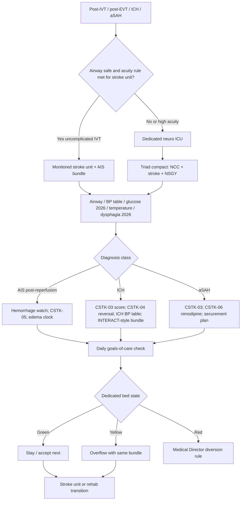

# Neurocritical Care Integration

## Opening

A Comprehensive Stroke Center without a reliable neurocritical care bed is a reperfusion service that ends in a hallway. Joint Commission CSC capability language still used operationally includes a dedicated neuro ICU. The Medical Director may not employ the NCC attendings and does not place every central line. The Medical Director does own the receiving pathway after IVT and EVT, the ICU standard for ICH and aSAH, the 2026 AIS physiologic bundle (airway, blood pressure, glucose, temperature, dysphagia), goals-of-care discipline, and — most politically — bed access.

Treat bed access as a clinical operations problem, not as a house-supervisor courtesy. If the neuro ICU is full, the next LVO and the next ICH still exist. Diversion, overflow, and boarding rules that are not written will be invented by the tired person holding the bed phone.

The working structure is a triad: vascular neurology / stroke, neurocritical care, and neurosurgery. When that triad shares a board, a note template, and a 24/7 decision right, the rest of this chapter is executable. When each service leaves a separate plan in the chart, the nurse will follow the most recent page.

## Why This Matters

Reperfusion is a time-limited procedure. Recovery is a multi-day physiologic argument. Post-IVT and post-EVT deterioration, reperfusion hemorrhage (CSTK-05), malignant edema, aspiration, fever, and uncontrolled glucose erase HERMES-like gains in a unit that thinks "neuro" means "q1h NIHSS and otherwise medical ICU defaults."

ICH and aSAH are CSC-defining. The April 2, 2025 Joint Commission announcement reduced the annual aSAH volume criterion to 10 (official manual update January 2026). That change does not reduce the ICU standard. CSTK-03 (severity measurement for SAH and ICH), CSTK-04 (procoagulant reversal initiation for ICH), and CSTK-06 (nimodipine) are public measures. The 2022 ICH guideline, the 2024 ICH performance measures, the 2023 aSAH guideline, and INTERACT3-style care bundles are the practice spine. A CSC that reverses coagulopathy slowly, gives nimodipine late, or cannot get an aneurysm secured because the ICU cannot take the patient is not a hemorrhagic center.

The 2026 AIS guideline updated glucose and dysphagia management. Those updates are operational checklists, not nutrition footnotes. Airway and temperature belong in the same bundle. Blood-pressure targets remain the current AHA/ASA tables for AIS, ICH, and aSAH — not memory, not a 2015 slide, and not a number invented in this handbook.

Goals of care are a neuro ICU procedure. Large-core EVT, severe ICH, and high-grade aSAH produce survival with disability that families did not imagine at 02:00. If the triad does not lead that conversation, someone else will — usually late, usually without the time-limited trial the team actually intended.

Surveyors will ask where stroke patients go after reperfusion, who owns the physiologic bundle, how ICH reversal is timed, and what happens when the dedicated unit is full. Fellows will imitate whatever they see at night. The Medical Director's silence is a policy.

## Core Framework

### Dedicated neuro ICU as a CSC expectation

"Dedicated" is a function, not a paint color.

| Element | Functional meaning | Failure mode |
| --- | --- | --- |
| Unit identity | A defined bed group with neuro-competent nursing ratios and competencies | Stroke boarded in a surgical ICU with no NIHSS skill |
| Attending coverage | NCC or equivalently privileged coverage 24/7 with a named backup | "The intensivist will look if they have time" |
| Stroke / NSGY presence | Daily triad rounds on shared patients | Three notes, three BP plans |
| Monitoring | Protocolized neuro checks, airway, EVD, multimodal when indicated | Checks skipped for "the patient is intubated" |
| Access rules | Stroke and hemorrhagic emergencies have a written preemption path | House supervisor as the de facto Medical Director |
| Overflow | Named overflow unit with the same bundle, time-limited | Silent diversion (Chapter 10) |

If the hospital cannot staff a physically separate unit every night, the Medical Director still writes which beds are functionally dedicated and which competencies they require. A name on the door without the competencies is theater.

### The NCC–stroke–NSGY triad

| Decision | Typical accountable voice | Must not be unilateral |
| --- | --- | --- |
| Post-EVT destination (NCC vs stroke unit) | Stroke + NCC using a written acuity rule | IR sending "wherever is empty" |
| ICH reversal and SBP pathway | NCC or stroke per local compact, using 2022 ICH / 2024 measures | Waiting for a daytime hematology consult to start CSTK-04 |
| aSAH securement timing and nimodipine | NSGY + NCC; CSTK-06 is a system measure | Nimodipine "when the floor pharmacist attends" |
| Airway / tracheostomy / PEGs | NCC leads, triad agrees | A covering resident scheduling a PEG to clear a bed |
| Time-limited ICU trial | Triad + family | One service pronouncing futility at 06:00 before rounds |
| Bed preemption / diversion | CSC Medical Director or night delegate | Unnamed bed meeting |
| Research screening in the ICU | Stroke PI + NCC | Coordinators interrupting an unstable resuscitation |

Write a one-page compact. Renew it when chiefs turn over.

### Post-IVT and post-EVT pathways

These are not "ICU vs floor" personality tests. They are acuity rules.

| Situation | Default receiving system | Bundle emphasis |
| --- | --- | --- |
| Uncomplicated IVT, low NIHSS, stable | Monitored stroke unit if competency equals the post-lytic check schedule | Post-IVT BP table, neuro checks, dysphagia screen before any oral intake |
| IVT + EVT, or high NIHSS, or unstable BP/airway | Dedicated neuro ICU | Full AIS physiologic bundle; puncture-site and reperfusion-hemorrhage watch |
| Failed or incomplete reperfusion, large core, basilar, or fluctuating | Neuro ICU | Edema / decompression clock with NSGY |
| Post-IVT or post-EVT symptomatic worsening | Neuro ICU if not already there; stat NCCT; rescue (Chapter 13) | Airway first |
| Transfer-in after reperfusion elsewhere | Acuity rule, not "they already had the procedure" | Same bundle; inbound lytic identity known |

Post-procedure handoff is a time strip, not a vibe: LKW, NIHSS, agent and dose, TICI, anesthesia type, remaining alteplase or not, BP table in force, swallow status (nothing by mouth until screen), glucose, temperature, goals-of-care status, and family location.

### ICH and aSAH ICU care

| Domain | Operational standard | Measure / source |
| --- | --- | --- |
| Severity score on arrival | Documented early | CSTK-03 |
| ICH reversal | Immediate initiation of the indicated procoagulant pathway | CSTK-04; 2022 ICH guideline; 2024 ICH measures |
| ICH BP | Current AHA/ASA ICH tables and INTERACT-style bundle discipline — do not invent mmHg here | Order set dated to the guideline |
| ICH bundle | Airway, BP, glucose, temperature, reversal, surgical triage as a package | INTERACT3 logic as operations, not as a logo |
| aSAH nimodipine | Administer unless a documented contraindication | CSTK-06; 2023 aSAH guideline |
| aSAH securement | Time-to-securing as a triad metric | 2023 aSAH guideline; volume criterion now 10 per the April 2, 2025 announcement — capability is unchanged |
| EVD / ICP | Who may place, who may clamp, who may transport | Written; nurses trained |
| Rebleed / DIND / hydrocephalus | Recognition scripts on the unit | Do not wait for daytime NSGY rounds |

Hemorrhagic program design beyond the ICU lives in [Hemorrhagic Stroke and Complex Cerebrovascular Programs](21-hemorrhagic-complex.md). This chapter owns the ICU hour-to-hour.

### Airway, BP, glucose, temperature, dysphagia

Build one AIS physiologic bundle that the 2026 guideline updates can sit inside. Values and screen instruments come from the current AHA/ASA tables and the local SLP protocol — not from this page.

| Domain | Operations (not invented numbers) | Common defect |
| --- | --- | --- |
| Airway | Pre-intubation plan for deteriorating NIHSS, post-EVT GA emergence, ICH/aSAH; extubation readiness is a daily triad item | "Watchful waiting" until aspiration |
| Blood pressure | Separate AIS post-IVT/EVT, ICH, and aSAH tables in the EHR, each dated to the current guideline | One SBP order for the whole unit |
| Glucose | Apply the 2026 AIS glucose recommendations as the order set; hypo- and hyperglycemia both have a first-line action | Old sliding-scale folklore |
| Temperature | Measure on a published interval; treat fever as a neurologic emergency, not as comfort care only | First fever at 02:00 ignored |
| Dysphagia | Apply the 2026 AIS dysphagia updates; no oral intake, including meds, until the screen; SLP pathway for fails | Water in the ED after TNK |
| VTE | STK-1 still applies; timing after IVT/ICH is a safety decision, not a core-measure panic | Chemical prophylaxis before the hemorrhage is stable |

The bundle is a checklist on admission to the unit and a checklist every shift. It is not a lecture.

### Goals of care

| Situation | Operational default |
| --- | --- |
| First night after severe AIS, ICH, or high-grade aSAH | Stabilize and gather prognosis; avoid irreversible non-beneficial procedures that only clear beds |
| Large-core EVT offered | Time-limited ICU trial stated out loud, with a review hour |
| Brain-death possible | Follow hospital policy; stroke Medical Director does not freelance |
| Conflict among triad | Escalate to the compact; ethics on a published trigger |
| Language / culture | Interpreter; do not use family as the only voice for the patient and the only interpreter |
| Discharge to comfort | CSTK exclusions may apply (CSTK-01 excludes comfort measures day of / after arrival among other criteria); document timing honestly |

Goals of care are not the opposite of aggressive care. They are how aggressive care stays honest.

### Bed access as a Medical Director problem

Write four states, analogous to diversion:

| State | Meaning | Who declares |
| --- | --- | --- |
| Green | Dedicated beds available for the next reperfusion or ICH | NCC charge + house supervisor |
| Yellow | Overflow unit open under the same bundle; scene stroke still accepted | NCC attending + CSC Medical Director delegate |
| Red | No safe neuro-competent bed; stroke-transfer closed or stroke closed per Chapter 10 | CSC Medical Director or documented night delegate |
| Black | Internal disaster / surge | Hospital command; see [Disaster and Surge](../strategy/35-disaster-surge.md) |

Boarding an intubated ICH in the ED because "the unit is protecting staff ratios" is a Medical Director event, not a staffing anecdote. Measure ED and PACU boarder hours for stroke and hemorrhage. Those hours are a clinical outcome.

!!! tip "Key Actions"
    Sign a one-page NCC–stroke–NSGY compact. Write the acuity rule that sorts post-IVT/EVT patients to the dedicated neuro ICU versus the stroke unit. Build a single AIS physiologic bundle that points at 2026 glucose and dysphagia text and at current BP tables — no memorized mmHg. Make ICH reversal and aSAH nimodipine automatic order-set items (CSTK-04, CSTK-06). Publish bed-state rules and take diversion authority back from an unnamed bed meeting. Measure boarder hours. Require a time-limited-trial sentence on every large-core and severe-ICH admission.

!!! abstract "Metrics Targets"
    CSTK-03 severity measurement for SAH and ICH. CSTK-04 procoagulant reversal initiation for ICH. CSTK-05 hemorrhagic transformation. CSTK-06 nimodipine. CSTK-01 NIHSS when the patient is ischemic. CSTK-02 / CSTK-10 90-day mRS. STK-1 VTE prophylaxis. Target: Stroke clocks remain upstream; they do not excuse a missing ICU bed. Internal sample posture: zero oral intake before dysphagia screen; 2026 glucose order-set compliance; fever-response interval defined locally and audited; ICH reversal started on a timed pathway (use the 2024 ICH measures, not an invented minute); nimodipine unless contraindicated; boarder hours near zero for intubated stroke/ICH/aSAH; dedicated-unit competency roster complete. aSAH volume: confirm the active manual; the April 2, 2025 announcement reduced the annual criterion to 10.

!!! warning "Common Pitfalls"
    Calling any ICU with a monitor a neuro ICU. Three BP goals in three notes. Water in the ED after lytic. ICH reversal waiting for a confirmatory "daytime" conversation. Nimodipine delayed for a swallow evaluation that has not happened — use an allowable route. Medical Director treating beds as someone else's problem until diversion is already on. Goals-of-care conversation led by the most junior person because attendings left. Overflow unit that does not know the post-EVT puncture-site rule. Using CSTK-01 comfort-measures exclusion as a documentation trick. Pretending the 2026 glucose and dysphagia updates are "nursing issues."

!!! success "Implementation Tips"
    Co-write the compact in a single sitting with the three chiefs; do not circulate it for a month of redlines. Put the physiologic bundle on one EHR sidebar, not five policies. Give the NCC charge a direct line to the Medical Director delegate for Red state — not a voicemail. Walk the overflow unit at night and ask a nurse to name the post-IVT BP table. Combine ICH reversal drills with IVT rescue drills (Chapter 13). Invite NCC to the hyperacute huddle whenever a receiving-bed defect appears. When chiefs change, re-sign the compact in the first two weeks.

## How to Do the Work

### Daily / weekly

- Know the dedicated-bed state before the morning hyperacute huddle.
- Review every ED/PACU boarder and every overflow admission for bundle fidelity.
- Review every post-IVT/EVT worsening and every ICH reversal interval.
- Confirm nimodipine status on every aSAH patient (CSTK-06).
- Confirm nothing-by-mouth until dysphagia screen on every new AIS admission.
- Triad board: one plan for BP, airway, and goals of care.

### Monthly / quarterly

- Scorecard: boarder hours, overflow hours, diversion hours, CSTK-03/04/05/06, bundle audit (glucose, temperature, dysphagia), VTE (STK-1), 90-day mRS for ICU survivors.
- Competency roster for dedicated and overflow nurses.
- Goals-of-care audit: time-limited trials documented vs not.
- Equity: language access for ICU family meetings; night reversal times vs day.
- Joint M&M: malignant edema decompression delays, rebleeds, aspiration after a failed screen.
- Reconcile order sets to the 2026 AIS glucose and dysphagia text if a local patch is still older.

### Annual / multi-year

- Re-sign the triad compact.
- Recheck CSC dedicated-ICU language in SCS26 / the active manual and the aSAH volume criterion (post–April 2, 2025: 10, confirm current).
- Workforce: NCC FTE, night coverage, APPs, SLP 24/7 access.
- Capital: monitoring, portable CT vs travel risk, EVD competency.
- Surge: how the dedicated unit expands ([Disaster and Surge](../strategy/35-disaster-surge.md)).
- Education: fellows rotate in the neuro ICU with explicit triad etiquette, not as visitors.

## Ready-to-Adapt Tools

Samples to adapt with NCC, NSGY, nursing, SLP, and counsel.

### Sample SOP skeleton — post-reperfusion destination

**Title:** Post-IVT and post-EVT receiving pathway  
**Owner:** CSC Medical Director with NCC director  

1. **Acuity rule.** List who goes to dedicated neuro ICU vs monitored stroke unit.
2. **Handoff strip.** LKW, NIHSS, agent/dose, TICI, anesthesia, BP table, NPO, glucose, temperature, family, goals.
3. **Bundle.** Airway, current AHA/ASA BP table for the diagnosis, 2026 glucose orders, temperature protocol, 2026 dysphagia screen before any oral intake.
4. **Worsening.** Stat NCCT + rescue / edema pathway.
5. **VTE.** STK-1 with a timed safety decision after IVT or hemorrhage.
6. **Disposition.** Written step-down criteria.

### Sample SOP skeleton — ICH first hours

1. CSTK-03 severity score.
2. Reversal launch (CSTK-04) from the current 2022 ICH / 2024 measure tables; stock location named.
3. BP pathway from current ICH tables (no memorized mmHg).
4. INTERACT-style bundle checklist (airway, glucose, temperature, reversal, surgical triage).
5. NSGY notification time standard.
6. Goals-of-care first conversation timed, not postponed to "after the weekend."

### Sample SOP skeleton — aSAH first hours

1. CSTK-03 score.
2. Nimodipine (CSTK-06) by an allowable route if swallow is unsafe.
3. Securement plan and time goal with NSGY/IR.
4. BP and vasospasm recognition per 2023 aSAH guideline tables.
5. EVD rules.
6. Dedicated ICU or documented equivalent.

### Sample SOP skeleton — bed state and overflow

1. Definitions of Green / Yellow / Red / Black.
2. Who may declare Red.
3. Overflow unit competencies (must match the bundle).
4. Link to Chapter 10 diversion notification.
5. Boarder-hour log as a quality record.
6. After-action when Red is declared.

### Sample time-target grid — ICU interface

| Event | Floor / measure | Sample internal rule |
| --- | --- | --- |
| ICH reversal initiation | CSTK-04; 2024 ICH measures | Timed pathway; same-week review of delays |
| aSAH nimodipine | CSTK-06 | Unless contraindicated, first-shift administration |
| Dysphagia screen before oral intake | 2026 AIS update as operations | Any oral intake first is a defect |
| Post-EVT arrival to ICU bed | Local | Boarder hours visible on the huddle |
| Fever to first treatment | Local interval | Audit night vs day |
| Time-limited trial review | Local | Hour written on admission for large-core / severe ICH |

### Sample role card — NCC attending

- Owns the physiologic bundle in the dedicated unit.
- Co-owns ICH reversal and aSAH nimodipine execution.
- Calls Red state with the Medical Director delegate; does not silently refuse the next LVO.
- Leads or assigns goals-of-care with the triad.

### Sample role card — stroke attending in the ICU

- Translates reperfusion times and residual LVO risk into an ICU plan.
- Ensures CSTK-01/02/05/10 data capture.
- Does not write a conflicting BP order.

### Sample role card — neurosurgery attending

- Owns securement, decompression, and EVD decisions on a clock.
- Joins the compact rather than leaving a postoperative note that rewrites BP.

### Sample role card — CSC Medical Director (beds)

- Publishes bed-state rules.
- Reviews boarder hours weekly.
- Is the only routine authority for stroke-closed status when the constraint is ICU access.

### Sample RACI — dedicated bed access

| Task | Med Dir | NCC director | House supervisor | Stroke attending | NSGY |
| --- | --- | --- | --- | --- | --- |
| Bed-state definitions | A | R | C | C | C |
| Declare Yellow | C | A/R | R | I | I |
| Declare Red | A | R | C | C | C |
| Overflow competency | A | R | I | C | I |
| Boarder-hour review | A | R | C | C | I |

### Sample triad compact (one page)

- One BP plan per patient, named table, named owner.
- One airway plan.
- One daily goals-of-care sentence.
- Conflict → same-day attending-to-attending, then Medical Director.
- Research screening never delays reversal, nimodipine, or a securement trip.

### Sample admission bundle checklist (yes/no)

- Destination matches acuity rule.
- Handoff strip complete.
- Correct BP table selected (AIS vs ICH vs aSAH) and dated.
- 2026 glucose orders active.
- Temperature protocol active.
- NPO until dysphagia screen; screen ordered.
- ICH: CSTK-03 and reversal launched if indicated.
- aSAH: CSTK-03 and nimodipine ordered by an allowable route.
- Goals-of-care status written.
- Family contact and interpreter need written.

## Integration With Other Pillars

NCC is the receiving system for [Hyperacute Pathways](11-hyperacute-pathways.md), [IVT](13-iv-thrombolysis.md), and [EVT](14-endovascular-therapy.md), and the first home of most [hemorrhagic and complex](21-hemorrhagic-complex.md) care. Bed state drives [Prehospital](10-prehospital-ems.md) diversion. Step-down lands in the [Inpatient Stroke Unit](16-inpatient-stroke-unit.md); swallow and mobility continue into [Rehabilitation](18-rehabilitation-continuum.md).

Quality: CSTK-03/04/05/06, STK-1, 90-day mRS ([Core Metrics](../quality/23-core-metrics.md)). High reliability: preoccupation with failure on night reversal and night fever ([Improvement](../quality/24-improvement-high-reliability.md)). Equity: interpreter-quality family meetings and night-vs-day reversal ([Equity](../quality/26-equity-disparities.md)). Leadership: triad decision rights ([Governance](../leadership/07-governance-architecture.md); [Organizational Design](../leadership/08-organizational-design.md)). Strategy: ICU FTE and surge ([Financial Stewardship](../strategy/34-financial-stewardship.md); [Disaster](../strategy/35-disaster-surge.md)). Education: the ICU is where fellows learn that reperfusion was the start of the case.

## Sources

- 2026 Guideline for the Early Management of Patients With Acute Ischemic Stroke. *Stroke*. 2026;57(8):e316–e436. DOI 10.1161/STR.0000000000000513. Glucose and dysphagia updates; post-reperfusion physiologic care; pediatric AIS implications for ICU addenda.
- 2022 AHA/ASA ICH Guideline. *Stroke*. DOI 10.1161/STR.0000000000000407.
- 2024 AHA/ASA Performance and Quality Measures for Spontaneous ICH.
- 2023 AHA/ASA aSAH Guideline. *Stroke*. 2023;54:e314–e370. DOI 10.1161/STR.0000000000000436 (replaces 2012).
- INTERACT2 / ENCHANTED2 / INTERACT3 as ICH care-bundle operations inputs; use guideline tables for numeric targets.
- CSTK v2026B: CSTK-03, CSTK-04, CSTK-05, CSTK-06; CSTK-01, CSTK-02, CSTK-10 as relevant. STK-1 VTE prophylaxis. CSTK-07 is not in the current set.
- Joint Commission CSC dedicated neuro ICU capability language; April 2, 2025 announcement reducing the annual aSAH volume criterion to 10 (manual update January 2026). Confirm current E-App tables.
- Target: Stroke and HERMES as the upstream reason the ICU must not erase reperfusion gains.
- IHI Model for Improvement and high-reliability organizing for bed-access and bundle failures.
