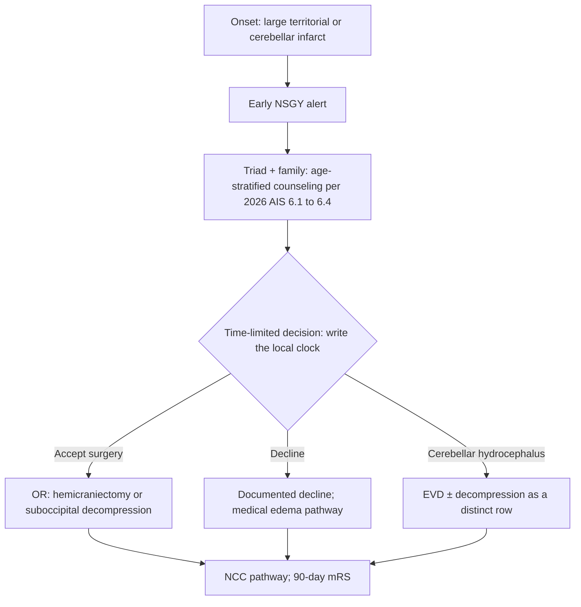

# Neurocritical Care Integration

## Opening

A Comprehensive Stroke Center without a reliable neurocritical care bed is a reperfusion service that ends in a hallway. Joint Commission CSC capability language still used operationally includes a dedicated neuro ICU. The Medical Director may not employ the NCC attendings and does not place every central line. The Medical Director does own the receiving pathway after IVT and EVT, the ICU standard for ICH and aSAH, the 2026 AIS physiologic bundle (airway, blood pressure, glucose, temperature, dysphagia), goals-of-care discipline, and — most politically — bed access.

Treat bed access as a clinical operations problem, not as a house-supervisor courtesy. If the neuro ICU is full, the next LVO and the next ICH still exist. Diversion, overflow, and boarding rules that are not written will be invented by the tired person holding the bed phone.

The working structure is a triad: vascular neurology / stroke, neurocritical care, and neurosurgery. When that triad shares a board, a note template, and a 24/7 decision right, the rest of this chapter is executable. When each service leaves a separate plan in the chart, the nurse will follow the most recent page.

## Why This Matters

Reperfusion is a time-limited procedure. Recovery is a multi-day physiologic argument. Post-IVT and post-EVT deterioration, reperfusion hemorrhage (CSTK-05), malignant edema, aspiration, fever, and uncontrolled glucose erase HERMES-like gains in a unit that thinks "neuro" means "q1h NIHSS and otherwise medical ICU defaults."

ICH and aSAH are CSC-defining. The April 2, 2025 Joint Commission announcement reduced the annual aSAH volume criterion to 10 (official manual update January 2026). That change does not reduce the ICU standard. CSTK-03 (severity measurement for SAH and ICH), CSTK-04 (procoagulant reversal initiation for ICH), and CSTK-06 (nimodipine) are public measures. The 2022 ICH guideline, the 2024 ICH performance measures, the 2023 aSAH guideline, and INTERACT3-style care bundles are the practice spine. A CSC that reverses coagulopathy slowly, gives nimodipine late, or cannot get an aneurysm secured because the ICU cannot take the patient is not a hemorrhagic center.

The 2026 AIS guideline updated glucose and dysphagia management. Those updates are operational checklists, not nutrition footnotes. AIS glucose is **140–180 mg/dL**; 80–130 is not recommended; treat <60 (ER-AIS-2026-GLU). AIS fever is treat temperatures **>37.5 °C** (ER-AIS-2026-09). After successful EVT, intensive SBP <140 is harmful and not recommended even with TICI 3 (ER-AIS-2026-BP). Do not import INTERACT3 110–140 onto AIS. Do not put 38.0 on an AIS board.

Goals of care are a neuro ICU procedure. Large-core EVT, severe ICH, and high-grade aSAH produce survival with disability that families did not imagine at 02:00. If the triad does not lead that conversation, someone else will — usually late, usually without the time-limited trial the team actually intended.

Surveyors will ask where stroke patients go after reperfusion, who owns the physiologic bundle, how ICH reversal is timed, and what happens when the dedicated unit is full. Fellows will imitate whatever they see at night. The Medical Director's silence is a policy.

## Core Framework

### Dedicated neuro ICU as a CSC expectation

"Dedicated" is a function, not a paint color.

| Element | Functional meaning | Failure mode |
| --- | --- | --- |
| Unit identity | A defined bed group with neuro-competent nursing ratios and competencies | Stroke boarded in a surgical ICU with no NIHSS skill |
| Attending coverage | NCC or equivalently privileged coverage 24/7 with a named backup | "The intensivist will look if they have time" |
| Stroke / NSGY presence | Daily triad rounds on shared patients | Three notes, three BP plans |
| Monitoring | Protocolized neuro checks, airway, EVD, multimodal when indicated | Checks skipped for "the patient is intubated" |
| Access rules | Stroke and hemorrhagic emergencies have a written preemption path | House supervisor as the de facto Medical Director |
| Overflow | Named overflow unit with the same bundle, time-limited | Silent diversion (Chapter 10) |

If the hospital cannot staff a physically separate unit every night, the Medical Director still writes which beds are functionally dedicated and which competencies they require. A name on the door without the competencies is theater.

### The NCC–stroke–NSGY triad

| Decision | Typical accountable voice | Must not be unilateral |
| --- | --- | --- |
| Post-EVT destination (NCC vs stroke unit) | Stroke + NCC using a written acuity rule | IR sending "wherever is empty" |
| ICH reversal and SBP pathway | NCC or stroke per local compact, using 2022 ICH / 2024 measures | Waiting for a daytime hematology consult to start CSTK-04 |
| aSAH securement timing and nimodipine | NSGY + NCC; CSTK-06 is a system measure | Nimodipine "when the floor pharmacist attends" |
| Airway / tracheostomy / PEGs | NCC leads, triad agrees | A covering resident scheduling a PEG to clear a bed |
| Time-limited ICU trial | Triad + family | One service pronouncing futility at 06:00 before rounds |
| Bed preemption / diversion | CSC Medical Director or night delegate | Unnamed bed meeting |
| Research screening in the ICU | Stroke PI + NCC | Coordinators interrupting an unstable resuscitation |

Write a one-page compact. Renew it when chiefs turn over.

### Post-IVT and post-EVT pathways

These are not "ICU vs floor" personality tests. They are acuity rules.

| Situation | Default receiving system | Bundle emphasis |
| --- | --- | --- |
| Uncomplicated IVT, low NIHSS, stable | Monitored stroke unit if competency equals the post-lytic check schedule | Post-IVT BP table, neuro checks, dysphagia screen before any oral intake |
| IVT + EVT, or high NIHSS, or unstable BP/airway | Dedicated neuro ICU | Full AIS physiologic bundle; puncture-site and reperfusion-hemorrhage watch |
| Failed or incomplete reperfusion, large core, basilar, or fluctuating | Neuro ICU | Edema / decompression clock with NSGY |
| Post-IVT or post-EVT symptomatic worsening | Neuro ICU if not already there; stat NCCT; rescue (Chapter 13) | Airway first |
| Transfer-in after reperfusion elsewhere | Acuity rule, not "they already had the procedure" | Same bundle; inbound lytic identity known |

Post-procedure handoff is a time strip, not a vibe: LKW, NIHSS, agent and dose, TICI, anesthesia type, remaining alteplase or not, BP table in force, swallow status (nothing by mouth until screen), glucose, temperature, goals-of-care status, and family location.

### ICH and aSAH ICU care

| Domain | Operational standard | Measure / source |
| --- | --- | --- |
| Severity score on arrival | Documented early | CSTK-03 |
| ICH reversal | Immediate initiation of the indicated procoagulant pathway | CSTK-04; 2022 ICH guideline; 2024 ICH measures |
| ICH BP | Current AHA/ASA ICH tables and INTERACT-style bundle discipline — do not invent mmHg here | Order set dated to the guideline |
| ICH bundle | Airway, BP, glucose, temperature, reversal, surgical triage as a package | INTERACT3 logic as operations, not as a logo |
| aSAH nimodipine | Administer unless a documented contraindication | CSTK-06; 2023 aSAH guideline |
| aSAH securement | Time-to-securing as a triad metric | 2023 aSAH guideline; volume criterion now 10 per the April 2, 2025 announcement — capability is unchanged |
| EVD / ICP | Who may place, who may clamp, who may transport | Written; nurses trained |
| Rebleed / DIND / hydrocephalus | Recognition scripts on the unit | Do not wait for daytime NSGY rounds |

Hemorrhagic program design beyond the ICU lives in [Hemorrhagic Stroke and Complex Cerebrovascular Programs](21-hemorrhagic-complex.md). This chapter owns the ICU hour-to-hour.

### Airway, BP, glucose, temperature, dysphagia

Build one AIS physiologic bundle that the 2026 guideline updates can sit inside. Values and screen instruments come from the current AHA/ASA tables and the local SLP protocol — not from this page.

| Domain | Operations (not invented numbers) | Common defect |
| --- | --- | --- |
| Airway | Pre-intubation plan for deteriorating NIHSS, post-EVT GA emergence, ICH/aSAH; extubation readiness is a daily triad item | "Watchful waiting" until aspiration |
| Blood pressure | Separate AIS post-IVT/EVT, ICH, and aSAH tables in the EHR, each dated to the current guideline. Post-EVT: intensive SBP **<140 is harmful and not recommended**, even with TICI 3 (ER-AIS-2026-BP). Incomplete reperfusion is a written triad exception — do not invent a second mmHg number here. | One SBP order for the whole unit; “TICI 3 so run them under 140” |
| Glucose | AIS: treat <60 mg/dL; persistent hyperglycemia **140–180 mg/dL**; intensive 80–130 is not recommended; treat marked hyperglycemia commonly >180 (ER-AIS-2026-GLU). ICH: INTERACT3 bands in [Hemorrhagic Stroke](21-hemorrhagic-complex.md). Do not import INTERACT3 110–140 onto AIS. | Old sliding-scale folklore; ICH band copied onto AIS |
| Temperature | AIS: treat temperatures **>37.5 °C** to achieve normothermia (ER-AIS-2026-09). ICH: INTERACT3 ≤37.5 °C trial-bundle ([Hemorrhagic Stroke](21-hemorrhagic-complex.md)). Same number; do not invent 38.0. No induced hypothermia as routine neuroprotection. | First fever at 02:00 ignored; a 38.0 AIS card still posted |
| Dysphagia | Apply the 2026 AIS dysphagia updates; no oral intake, including meds, until the screen; SLP pathway for fails | Water in the ED after TNK |
| VTE | STK-1 still applies; timing after IVT/ICH is a safety decision, not a core-measure panic | Chemical prophylaxis before the hemorrhage is stable |

The bundle is a checklist on admission to the unit and a checklist every shift. It is not a lecture.

### Goals of care

| Situation | Operational default |
| --- | --- |
| First night after severe AIS, ICH, or high-grade aSAH | Stabilize and gather prognosis; avoid irreversible non-beneficial procedures that only clear beds |
| Large-core EVT offered or failed recanalization | Time-limited ICU trial stated out loud, with a review hour; start the hemicraniectomy clock |
| Brain-death possible | Follow hospital policy; stroke Medical Director does not freelance |
| Conflict among triad | Escalate to the compact; ethics on a published trigger |
| Language / culture | Interpreter; do not use family as the only voice for the patient and the only interpreter |
| Discharge to comfort | CSTK exclusions may apply (CSTK-01 excludes comfort measures day of / after arrival among other criteria); document timing honestly |

Goals of care are not the opposite of aggressive care. They are how aggressive care stays honest.

### Malignant edema and decompressive surgery

Failed recanalization, large-core presentations, and large cerebellar infarcts start an edema clock on arrival, not when the pupil changes. DESTINY, DECIMAL, and HAMLET are landmark context. The 2026 AIS guideline §§6.1–6.4 is the practice authority. Do not treat hour-48 as a Joint Commission certification number; it is a common operating clock to write locally against that text.

| Row | Operational rule | Who decides | Do not |
| --- | --- | --- | --- |
| Hemispheric hemicraniectomy | Early NSGY alert on large territorial infarct — do not wait for herniation. Time-limited decision. Age-stratified counseling per 2026 AIS §§6.1–6.4; do not invent age cutoffs as local requirements. | Triad + family; NSGY owns the OR decision | A night fellow declaring “too old” without the written counseling page |
| Cerebellar infarct decompression | A distinct row from hemispheric surgery. Hydrocephalus and brainstem compression are not the MCA script. EVD ± suboccipital decompression per 2026 AIS §6.4. | NSGY + NCC; stroke does not freelance the posterior fossa | Treating cerebellar mass effect as “watch overnight on the floor” |
| Who may decline | Named attending pair (NSGY + stroke or NCC) after the counseling script; Medical Director if the pair disagrees | Documented on the admission note | Silence, or a family hallway conversation with no note |
| Documented decline | Reason, who spoke, interpreter if needed, medical pathway that follows | Same pair | “Family not ready” as a missing note |

Point failed EVT at this subsection from [Endovascular Therapy](14-endovascular-therapy.md). The stop-rule in the suite is not the end of the case.

### Bed access as a Medical Director problem

Write four states, analogous to diversion:

| State | Meaning | Who declares |
| --- | --- | --- |
| Green | Dedicated beds available for the next reperfusion or ICH | NCC charge + house supervisor |
| Yellow | Overflow unit open under the same bundle; scene stroke still accepted | NCC attending + CSC Medical Director delegate |
| Red | No safe neuro-competent bed; stroke-transfer closed or stroke closed per Chapter 10 | CSC Medical Director or documented night delegate |
| Black | Internal disaster / surge | Hospital command; see [Disaster and Surge](../strategy/35-disaster-surge.md) |

Boarding an intubated ICH in the ED because "the unit is protecting staff ratios" is a Medical Director event, not a staffing anecdote. Measure ED and PACU boarder hours for stroke and hemorrhage. Those hours are a clinical outcome.

!!! tip "Key Actions"
    Sign a one-page NCC–stroke–NSGY compact. Write the acuity rule that sorts post-IVT/EVT patients to the dedicated neuro ICU versus the stroke unit. Build one AIS physiologic bundle: glucose **140–180**, treat <60, do not target 80–130; treat temps **>37.5 °C**; post-EVT intensive SBP <140 is harmful even with TICI 3. Make ICH reversal and aSAH nimodipine automatic order-set items. Publish the hemicraniectomy clock and the EVD card. Publish bed-state rules. Measure boarder hours. Require a time-limited-trial sentence on every large-core, failed-EVT, and severe-ICH admission.

!!! abstract "Metrics Targets"
    CSTK-03/04/05/06 and STK-1 IDs live in [Core Metrics](../quality/23-core-metrics.md). Internal sample: zero oral intake before dysphagia screen; AIS glucose 140–180 compliance with zero unprotocolized <60 events; fever >37.5 °C to first treatment on a local interval; no AIS 38.0 card on the wall; post-EVT SBP <140 not used as a TICI-3 trophy; ICH reversal on a timed 2024-measure pathway; nimodipine unless contraindicated; NSGY alert time on every large territorial / cerebellar infarct; documented decline when surgery is not done; boarder hours near zero for intubated stroke/ICH/aSAH. aSAH volume: the April 2, 2025 announcement reduced the annual criterion to 10 — confirm the active manual.

!!! warning "Common Pitfalls"
    Calling any ICU with a monitor a neuro ICU. Three BP goals in three notes. Running AIS patients to SBP <140 because TICI was 3. Copying INTERACT3 110–140 glucose onto AIS. Leaving a 38.0 AIS fever card on the board. Waiting for herniation before paging NSGY. Treating cerebellar mass effect as the hemispheric script. An unsigned EVD clamp for transport. Water in the ED after lytic. ICH reversal waiting for a daytime conversation. Nimodipine delayed for a swallow evaluation — use an allowable route. Goals-of-care led by the most junior person.

!!! success "Implementation Tips"
    Co-write the compact in a single sitting with the three chiefs. Put the physiologic bundle on one EHR sidebar: 140–180, >37.5 °C, post-EVT not <140. Walk the overflow unit at night and ask a nurse to name the post-EVT BP table and the fever cut. Drill the hemicraniectomy clock with the same seriousness as ICH reversal. Keep the EVD card on the charge clipboard. Invite NCC to the hyperacute huddle whenever a receiving-bed defect appears. When chiefs change, re-sign the compact in the first two weeks.

## How to Do the Work

### Daily / weekly

- Know the dedicated-bed state before the morning hyperacute huddle.
- Review every ED/PACU boarder and every overflow admission for bundle fidelity.
- Review every post-IVT/EVT worsening, every ICH reversal interval, and every large territorial / cerebellar infarct for NSGY-alert time.
- Confirm nimodipine status on every aSAH patient (CSTK-06).
- Confirm nothing-by-mouth until dysphagia screen on every new AIS admission.
- Confirm the AIS board reads treat >37.5 °C and glucose 140–180 — not 38.0, not 80–130, not INTERACT3 110–140.
- Triad board: one plan for BP (including the post-EVT <140 prohibition), airway, edema clock, and goals of care.

### Monthly / quarterly

- Scorecard: boarder hours, overflow hours, diversion hours, CSTK-03/04/05/06, bundle audit (glucose 140–180, treat <60, temp >37.5 °C, dysphagia), VTE (STK-1), 90-day mRS for ICU survivors, hemicraniectomy-clock misses, EVD-transport defects.
- Competency roster for dedicated and overflow nurses.
- Goals-of-care audit: time-limited trials documented vs not; documented surgical declines.
- Equity: language access for ICU family meetings; night reversal and night NSGY-alert times vs day.
- Joint M&M: malignant edema decompression delays, rebleeds, aspiration after a failed screen, post-EVT SBP <140 used as a reflex.
- Reconcile order sets to 2026 AIS glucose (140–180; not 80–130) and temperature (>37.5 °C; retire 38.0).

### Annual / multi-year

- Re-sign the triad compact.
- Recheck CSC dedicated-ICU language in SCS26 / the active manual and the aSAH volume criterion (post–April 2, 2025: 10, confirm current).
- Workforce: NCC FTE, night coverage, APPs, SLP 24/7 access.
- Capital: monitoring, portable CT vs travel risk, EVD competency.
- Surge: how the dedicated unit expands ([Disaster and Surge](../strategy/35-disaster-surge.md)).
- Education: fellows rotate in the neuro ICU with explicit triad etiquette, not as visitors.

## Ready-to-Adapt Tools

Samples to adapt with NCC, NSGY, nursing, SLP, and counsel.

### Sample SOP skeleton — post-reperfusion destination

**Title:** Post-IVT and post-EVT receiving pathway  
**Owner:** CSC Medical Director with NCC director  

1. **Acuity rule.** List who goes to dedicated neuro ICU vs monitored stroke unit.
2. **Handoff strip.** LKW, NIHSS, agent/dose, TICI, anesthesia, BP table, NPO, glucose, temperature, family, goals.
3. **Bundle.** Airway; current AHA/ASA BP table (post-EVT: intensive SBP <140 not recommended even with TICI 3); AIS glucose 140–180, treat <60, do not target 80–130; treat temps >37.5 °C; 2026 dysphagia screen before any oral intake.
4. **Worsening.** Stat NCCT + rescue / edema pathway.
5. **VTE.** STK-1 with a timed safety decision after IVT or hemorrhage.
6. **Disposition.** Written step-down criteria.

### Sample SOP skeleton — ICH first hours

1. CSTK-03 severity score.
2. Reversal launch (CSTK-04) from the current 2022 ICH / 2024 measure tables; stock location named.
3. BP pathway from current ICH tables (no memorized mmHg).
4. INTERACT-style bundle checklist (airway, glucose, temperature, reversal, surgical triage).
5. NSGY notification time standard.
6. Goals-of-care first conversation timed, not postponed to "after the weekend."

### Sample SOP skeleton — aSAH first hours

1. CSTK-03 score.
2. Nimodipine (CSTK-06) by an allowable route if swallow is unsafe.
3. Securement plan and time goal with NSGY/IR.
4. BP and vasospasm recognition per 2023 aSAH guideline tables.
5. EVD card below.
6. Dedicated ICU or documented equivalent.

### Sample EVD card

| Action | Who | Do not |
| --- | --- | --- |
| Place | NSGY attending, or privileged fellow under attending presence | A covering resident “because the kit is there” |
| Clamp | Named NSGY or NCC attending order, timed and written | Informal clamp “for the trip” |
| Transport | Trained RN + documented open/clamp state on the ticket | Sending an unsigned EVD with the transporter |

The same card covers cerebellar-infarct hydrocephalus and aSAH. Who places, who clamps, and who transports is not a night-shift negotiation.

### Sample SOP skeleton — bed state and overflow

1. Definitions of Green / Yellow / Red / Black.
2. Who may declare Red.
3. Overflow unit competencies (must match the bundle).
4. Link to Chapter 10 diversion notification.
5. Boarder-hour log as a quality record.
6. After-action when Red is declared.

### Sample time-target grid — ICU interface

| Event | Floor / measure | Sample internal rule |
| --- | --- | --- |
| ICH reversal initiation | CSTK-04; 2024 ICH measures | Timed pathway; same-week review of delays |
| aSAH nimodipine | CSTK-06 | Unless contraindicated, first dose at diagnosis / before leaving the ED (allowable route if NPO) |
| Dysphagia screen before oral intake | 2026 AIS update as operations | Any oral intake first is a defect |
| Post-EVT arrival to ICU bed | Local | Boarder hours visible on the huddle |
| Fever >37.5 °C to first treatment | Local interval | Audit night vs day; retire any 38.0 AIS card |
| NSGY alert for large territorial / cerebellar infarct | Local operating clock (48 h is a common clock to write, not a certification number) | Same-week review of late pages |
| Time-limited trial review | Local | Hour written on admission for large-core / failed EVT / severe ICH |

### Sample role card — NCC attending

- Owns the physiologic bundle in the dedicated unit.
- Co-owns ICH reversal and aSAH nimodipine execution.
- Calls Red state with the Medical Director delegate; does not silently refuse the next LVO.
- Leads or assigns goals-of-care with the triad.

### Sample role card — stroke attending in the ICU

- Translates reperfusion times and residual LVO risk into an ICU plan.
- Ensures CSTK-01/02/05/10 data capture.
- Does not write a conflicting BP order.

### Sample role card — neurosurgery attending

- Owns securement, decompression, and EVD decisions on a clock. Joins the hemicraniectomy page early; does not wait for herniation.
- Joins the compact rather than leaving a postoperative note that rewrites BP.

### Sample role card — CSC Medical Director (beds)

- Publishes bed-state rules.
- Reviews boarder hours weekly.
- Is the only routine authority for stroke-closed status when the constraint is ICU access.

### Sample RACI — dedicated bed access

| Task | Med Dir | NCC director | House supervisor | Stroke attending | NSGY |
| --- | --- | --- | --- | --- | --- |
| Bed-state definitions | A | R | C | C | C |
| Declare Yellow | C | A/R | R | I | I |
| Declare Red | A | R | C | C | C |
| Overflow competency | A | R | I | C | I |
| Boarder-hour review | A | R | C | C | I |

### Sample triad compact (one page)

- One BP plan per patient, named table, named owner.
- One airway plan.
- One daily goals-of-care sentence.
- Conflict → same-day attending-to-attending, then Medical Director.
- Research screening never delays reversal, nimodipine, or a securement trip.

### Sample admission bundle checklist (yes/no)

- Destination matches acuity rule.
- Handoff strip complete.
- Correct BP table selected (AIS vs ICH vs aSAH) and dated. Post-EVT: intensive SBP <140 not used as the default, even if TICI 3.
- AIS glucose 140–180 active; treat <60; 80–130 not a target. ICH uses the INTERACT3 bands — not this row.
- Temperature protocol: treat AIS **>37.5 °C**; ICH INTERACT3 ≤37.5 °C. No 38.0 AIS card.
- NPO until dysphagia screen; screen ordered.
- ICH: CSTK-03 and reversal launched if indicated. ICH SBP, glucose, and temperature follow the INTERACT3 operationalization in [Hemorrhagic Stroke](21-hemorrhagic-complex.md). Do not apply 2026 AIS glucose tables to ICH.
- aSAH: CSTK-03 and nimodipine ordered by an allowable route.
- Goals-of-care status written.
- Family contact and interpreter need written.

## Integration With Other Pillars

NCC is the receiving system for [Hyperacute Pathways](11-hyperacute-pathways.md), [IVT](13-iv-thrombolysis.md), and [EVT](14-endovascular-therapy.md), and the first home of most [hemorrhagic and complex](21-hemorrhagic-complex.md) care. Bed state drives [Prehospital](10-prehospital-ems.md) diversion. Step-down lands in the [Inpatient Stroke Unit](16-inpatient-stroke-unit.md); swallow and mobility continue into [Rehabilitation](18-rehabilitation-continuum.md).

Quality: CSTK-03/04/05/06, STK-1, 90-day mRS ([Core Metrics](../quality/23-core-metrics.md)). High reliability: preoccupation with failure on night reversal and night fever ([Improvement](../quality/24-improvement-high-reliability.md)). Equity: interpreter-quality family meetings and night-vs-day reversal ([Equity](../quality/26-equity-disparities.md)). Leadership: triad decision rights ([Governance](../leadership/07-governance-architecture.md); [Organizational Design](../leadership/08-organizational-design.md)). Strategy: ICU FTE and surge ([Financial Stewardship](../strategy/34-financial-stewardship.md); [Disaster](../strategy/35-disaster-surge.md)). Education: the ICU is where fellows learn that reperfusion was the start of the case.

## Sources

- 2026 Guideline for the Early Management of Patients With Acute Ischemic Stroke. *Stroke*. 2026;57(8):e316–e436. DOI 10.1161/STR.0000000000000513. §§6.1–6.4 brain swelling and decompressive surgery; glucose **140–180**, 80–130 not recommended, treat <60 (ER-AIS-2026-GLU); treat temps **>37.5 °C** (ER-AIS-2026-09); post-EVT intensive SBP <140 harmful / not recommended even with TICI 3 (ER-AIS-2026-BP).
- DESTINY, DECIMAL, and HAMLET as landmark hemicraniectomy context; 2026 AIS is the practice authority. Hour-48 is a common operating clock to write locally, not a certification number.
- 2022 AHA/ASA ICH Guideline. *Stroke*. DOI 10.1161/STR.0000000000000407.
- 2024 AHA/ASA Performance and Quality Measures for Spontaneous ICH.
- 2023 AHA/ASA aSAH Guideline. *Stroke*. 2023;54:e314–e370. DOI 10.1161/STR.0000000000000436 (replaces 2012).
- INTERACT2 / ENCHANTED2 / INTERACT3 as ICH care-bundle operations inputs (ICH temperature ≤37.5 °C trial-bundle; ICH glucose bands — do not import 110–140 onto AIS).
- CSTK v2026B IDs: [Core Metrics](../quality/23-core-metrics.md). CSTK-07 is not in the current set.
- Joint Commission CSC dedicated neuro ICU capability language; April 2, 2025 announcement reducing the annual aSAH volume criterion to 10 (manual update January 2026). Confirm current E-App tables.
- IHI Model for Improvement and high-reliability organizing for bed-access and bundle failures.
