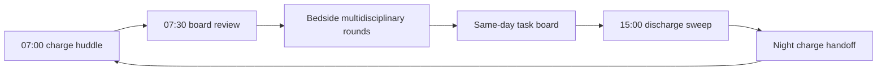

# Inpatient Stroke Unit Operations

## Opening

The dedicated stroke unit is where most of an academic Comprehensive Stroke Center's inpatient value is created after the first hours. Door-to-needle and door-to-device times are necessary. They are not sufficient. A patient who receives tenecteplase at 28 minutes and then spends four days on a scattered medical bed without a swallow screen, without sequential compression devices, and without an antithrombotic by the end of hospital day 2 has received a hyperacute intervention and a mediocre hospitalization. Surveyors, families, and 90-day outcomes will notice the second half of that story.

Treat the inpatient unit as a designed system, not as leftover capacity after the emergency department and neuro ICU have finished their work. The Medical Director owns four design decisions: whether stroke patients live on a geographically dedicated unit or are scattered; which nurse competencies are non-negotiable; which daily bundle items are hard-stopped in the electronic health record; and how the unit dashboard is reviewed so weekend, night, and holiday performance cannot hide inside a monthly average.

This chapter is an operating manual for that system. It covers unit geography, nurse competency, swallow screening, mobilization, venous thromboembolism prophylaxis (STK-1), early antithrombotics (STK-5), glycemic and temperature control, weekend discharge reliability, multidisciplinary rounds, and the unit-level dashboard. It assumes the hyperacute pathway and neurocritical care service already exist and that the unit's job is to convert those investments into a reliable hospital stay and a clean handoff.

Do not wait for a new building to professionalize the unit. Geography helps. Competency, rounding discipline, and a visible scorecard help more, and they can be stood up on the current floor this quarter.

## Why This Matters

Organized inpatient stroke-unit care is one of the few interventions in cerebrovascular medicine with a decades-long evidence base for reducing death and dependency. The Cochrane synthesis of organized stroke-unit care (Langhorne and colleagues) remains the operational justification for concentrating patients, staff, and protocols rather than distributing stroke admissions across general medicine. The effect is not a single drug. It is a place that does the same right things, every shift.

Joint Commission inpatient stroke (STK) measures convert that principle into a scorecard the CSC cannot ignore. STK-1 (VTE prophylaxis) and STK-5 (antithrombotic by the end of hospital day 2) live or die on the unit, not in the angiography suite. GWTG-Stroke achievement awards require **85%** compliance on each of seven achievement measures; two of those seven — early antithrombotics and VTE prophylaxis — are unit products. Fail them and the Gold award is gone regardless of door-to-needle performance.

The 2026 AHA/ASA Guideline for the Early Management of Patients With Acute Ischemic Stroke updates two unit-owned physiologic domains. Intensive glucose control to 80–130 mg/dL is not recommended to improve outcome and increases severe hypoglycemia; treat hypoglycemia below 60 mg/dL and treat marked hyperglycemia (commonly operationalized above 180 mg/dL) without chasing intensive targets. Temperature management belongs on the same board: treat fever, identify the source, and do not induce hypothermia in otherwise normothermic patients as a neuroprotectant. Dysphagia screening and management are explicit 2026 updates. A unit that cannot execute swallow, glucose, and temperature as a nurse-driven bundle is not executing the current guideline.

Weekend and holiday discharge is an equity and length-of-stay problem disguised as a staffing inconvenience. Patients ready for home or inpatient rehabilitation on Saturday who wait until Tuesday accumulate hospital-acquired harm, lose rehabilitation days, and generate family distrust. Academic CSCs that tolerate a Friday-to-Monday discharge cliff are choosing a lower-reliability product for half the calendar.

Finally, the unit is the surveyor's walk-through. Chart abstraction can be repaired after the fact. A nurse who cannot describe the swallow algorithm, a sequential compression device hanging unused on the footboard, or a white board that still lists last month's door-to-needle time will be the survey finding. Build the unit so a 06:00 walk-through would be a source of pride.

## Core Framework

### Dedicated unit versus scattered beds

A dedicated stroke unit is a geographically defined set of beds, staffed by nurses with stroke competencies, with physical therapy, occupational therapy, speech-language pathology, and case management that treat the unit as their primary assignment. Scattered beds place stroke patients wherever a bed opens, usually on general medicine or mixed telemetry, and ask a stroke coordinator to chase them.

| Design choice | Use it when | Do not use it when | What the Medical Director must lock |
| --- | --- | --- | --- |
| Dedicated stroke unit (preferred CSC model) | The hospital can cohort most non-ICU ischemic and stable hemorrhagic patients on one floor | Leadership wants the label without protected beds or a nurse manager who reports into the stroke dyad | Bed-hold rules, charge-nurse escalation, and a written overflow plan |
| Dedicated unit plus defined overflow | Census regularly exceeds the unit and a second floor can be competency-trained | Overflow becomes the de facto unit and competencies dilute | A 24-hour repatriation rule back to the home unit |
| Scattered beds with a virtual stroke service | Only as a documented, time-limited surge posture | As the standing operating model for a CSC | Daily locator huddle, same bundle hard-stops, and a public sunset date |
| Mixed neuro floor (stroke + epilepsy + spine) | Volume cannot support a pure stroke unit and neuro nursing is already strong | Stroke competencies are optional add-ons to a spine-heavy culture | Stroke-specific competency, charge-nurse designation, and separate dashboards |

Protected beds are a governance problem, not a facilities problem. Write the rule: a stroke-unit bed is not a general medicine overflow bed after 20:00 unless the Medical Director or the on-call associate is notified and the overflow is logged. Unlogged overflow is how dedicated units die.

### Nurse competency as the safety system

Unit reliability is a nursing product. Physician presence at 07:30 does not rescue a 02:00 swallow failure. Define a three-tier competency model and put it in the nurse manager's annual evaluation.

| Tier | Who | Non-negotiable skills | Recertification |
| --- | --- | --- | --- |
| Core unit nurse | Every RN assigned to the stroke unit | NIHSS, swallow screen, VTE device application and documentation, neurocheck cadence, glucose and temperature protocols, stroke education elements (STK-8), fall and restraint standards | Annual observed skills plus chart audit |
| Charge / resource | Every charge nurse and weekend resource RN | Code-stroke reactivation, blood-pressure parameters after reperfusion or ICH, transfer-back from ICU criteria, weekend discharge checklist ownership | Semiannual simulation plus case review |
| Advanced / preceptor | Preceptors, stroke resource nurses, float-pool neuro specialists | Mentoring new hires, rare-event drills (angioedema, hemorrhagic transformation, malignant edema), dashboard interpretation | Annual portfolio reviewed by the nurse manager and Medical Director |

NIHSS competency is not a one-time online module. Require observed performance and inter-rater checks against a vascular neurologist or a certified stroke coordinator. A unit that reports NIHSS on every patient but cannot reproduce scores is manufacturing CSTK-01 compliance without clinical meaning.

### The unit care bundle

Build one bundle. Teach one bundle. Audit one bundle. Do not let each attending invent a private version.

| Bundle element | Operational standard | Owner on the unit | Failure mode to watch |
| --- | --- | --- | --- |
| Swallow screen before oral intake | Validated screen (nursing) before any PO medication, including aspirin; failed screens go to speech-language pathology the same shift | Bedside RN; SLP for failed screens | "Just the home meds" exceptions at 03:00 |
| Mobilization | Out-of-bed assessment within 24 hours when medically eligible; avoid the AVERT pattern of very-early, high-dose mobilization in unstable patients | PT/OT with RN partnership | Confusing "early" with "immediate and intense" |
| VTE prophylaxis (STK-1) | Mechanical prophylaxis at arrival to the unit if not already on; pharmacologic prophylaxis when the attending documents that hemorrhage risk allows it | RN + covering APP | SCD tubing on the floor; "ambulatory" used as a false exclusion |
| Early antithrombotic (STK-5) | Documented antithrombotic by the end of hospital day 2 unless a contraindication is written | Covering APP with pharmacy double-check | Post-thrombolysis 24-hour hold that silently becomes a 48-hour hold |
| Glycemic control | Correct glucose <60 mg/dL; treat marked hyperglycemia (commonly >180 mg/dL); do not target 80–130 mg/dL as a quality goal | RN-driven protocol with hospitalist/endocrine backup | Insulin drips ordered as a reflex after one reading of 200 |
| Temperature | Treat temperature >37.5 °C; find the source; no induced hypothermia as routine neuroprotection | RN-driven protocol | Acetaminophen given, source workup skipped |
| Blood pressure parameters | Written parameters within 1 hour of unit arrival, matched to reperfusion, ICH, or aSAH pathway | Covering APP | "Keep BP normal" as a verbal order |
| Stroke education (STK-8) | Personal risk factors, warning signs, activation of EMS, follow-up, and medications taught and documented before discharge | RN + teach-back | Packet handed over without teach-back |

### Multidisciplinary rounds

Rounds are the unit's operating meeting. They are not a teaching tour that happens to mention disposition at the end.

Lock the cast: vascular neurology or the covering APP, charge nurse, case management, PT/OT/SLP representation, and pharmacy at least four weekdays. Fellows may lead, but an attending must be present for disposition and anticoagulation decisions. Time-box to the board, not to the Socratic method. Teaching happens; it does not consume the only hour in which STK-5 and Saturday IRF placement can still be saved.

### Unit dashboard

A unit dashboard is not the hospital's monthly GWTG extract. It is a short list the charge nurse can brief at 07:00.

| Signal | Cadence | Why it sits on the unit board |
| --- | --- | --- |
| Swallow screen before first PO | Daily | Preventable aspiration is a same-shift failure |
| SCD in place at the moment of audit | Daily | STK-1 is a process you can see |
| Antithrombotic ordered for hospital day 2 | Daily | STK-5 is lost in the afternoon, not at coding |
| Expected discharges in the next 36 hours | Daily | Weekend cliff prevention |
| Glucose <60 events and temperature >38.0 °C untreated >60 min | Daily | 2026 physiologic standards |
| Falls, restraint-hours, hospital-acquired infection | Weekly | Unit harm that stroke metrics miss |
| STK-1, STK-5, STK-8, STK-10 rolling 30-day | Weekly | Connect the huddle to the award set |
| Weekend versus weekday length of stay | Monthly | Exposes the discharge cliff |

!!! tip "Key Actions"
    Designate a single geographically defined stroke unit and write a bed-hold / overflow rule this month. Stand up a three-tier nurse competency with observed NIHSS and swallow-screen sign-off. Convert swallow, SCD application, day-2 antithrombotic, glucose, and temperature into EHR hard-stops rather than pocket-card suggestions. Install a 07:00 charge huddle and a 15:00 discharge sweep that run Saturday and Sunday. Put a six-signal unit board in the hallway the charge nurse owns, and review weekend-versus-weekday length of stay at the next stroke operations meeting.

!!! abstract "Metrics Targets"
    Treat STK-1 and STK-5 as unit-owned measures with an internal target of **≥95%**, above the GWTG achievement floor of **85%**. Track swallow screen before first oral intake at **≥98%**, including night and weekend admissions. Target documented out-of-bed assessment within 24 hours for medically eligible patients at **≥90%**. Hold severe hypoglycemia (<60 mg/dL) events to a reviewed count of zero unprotocolized cases per month. Set an internal target that weekend discharges equal at least **80%** of the weekday discharge rate for patients already dispositioned by Friday 12:00. Report STK-8 and STK-10 on the same unit scorecard so education and rehabilitation assessment cannot be treated as case-management afterthoughts.

!!! warning "Common Pitfalls"
    Calling a mixed neuro floor a stroke unit while allowing spine and overflow medicine to set the culture. Allowing "the patient is ambulatory" to exempt sequential compression devices without a documented walking assessment. Letting the post-thrombolysis 24-hour imaging hold erase STK-5 because no one re-orders the antithrombotic after the scan. Using intensive insulin protocols leftover from older ICU culture, which the 2026 guideline now explicitly does not support for outcome improvement. Closing case management and therapy services at 15:00 Friday and then declaring Monday a capacity crisis. Publishing a beautiful monthly dashboard that averages away nights, weekends, and the overflow floor.

!!! success "Implementation Tips"
    Start with geography and the charge nurse, not with a construction request. Pair the nurse manager with the Medical Director as a visible dyad on the unit twice a week for 20 minutes; presence changes SCD compliance faster than a memo. Build the day-2 antithrombotic as an order-set that fires at 18 hours after arrival and again at 36 hours, with a required contraindication if not given. Train every night-shift RN on the swallow screen before expanding the day-shift education calendar. Negotiate a Saturday therapy and case-management block as a capacity investment, not a courtesy. When census forces overflow, send a resource nurse with the patient and keep the patient on the unit locator list until repatriation.

## How to Do the Work

### Daily / weekly

Walk the unit before clinic. The 07:00 charge huddle should name yesterday's swallow misses, today's expected discharges, any patient still without an antithrombotic plan, and any overflow patient off the home unit. The Medical Director or associate does not need to speak at every huddle. Someone from the dyad should be present often enough that the huddle does not become optional.

During weekday multidisciplinary rounds, force three decisions into the open: Can this patient take oral medication today? What is the antithrombotic plan for hospital day 2? What is the disposition and what would have to be true for a Saturday discharge? Write those answers on the task board before the team leaves the bedside.

Run a 15:00 discharge sweep Monday through Sunday. Case management, the charge nurse, and the covering APP review every patient with a potential 36-hour departure. Prescriptions, stroke education teach-back, rehabilitation assessment (STK-10), and follow-up appointments are finished in daylight, not at 19:00 when the outpatient pharmacy is closed.

Once a week, the nurse manager and stroke coordinator audit ten charts and ten bedsides: swallow before first PO, SCD in place, neurocheck cadence, glucose protocol adherence, and temperature action. Feed misses into the next huddle the following morning, not into a quarterly committee.

### Monthly / quarterly

Present the unit scorecard at the stroke operations committee: STK-1, STK-5, STK-8, STK-10, swallow before PO, weekend-versus-weekday length of stay, overflow-bed hours, hypoglycemia events, and unplanned ICU transfers from the unit. Stratify by night versus day and by home unit versus overflow. Unstratified success is not success.

Review every STK-1 and STK-5 fallout within 14 days using a short defect worksheet: which shift, which order-set, which documentation gap, which attending. Assign a single owner and a due date. Do not let fallouts accumulate into a year-end abstract.

Quarterly, recertify a sample of nurses on NIHSS and swallow screening with an observed encounter. Quarterly, walk the overflow plan: how many hours did stroke patients spend off-unit, and did the repatriation rule hold. Quarterly, sit with pharmacy and review antithrombotic timing after intravenous thrombolysis so the 24-hour hold cannot silently become a missed STK-5.

Use the monthly meeting to retire local customs that conflict with the 2026 physiologic guidance. If an attending still writes for intensive insulin to 110 mg/dL, correct it in the order-set, not in an email chain.

### Annual / multi-year

Annually, re-justify the bed map. Volume growth, thrombectomy transfers, and a rising ICH census will push the unit past its design. Confirm current CSC eligibility tables in the active DSC manual before using historical volume figures to argue for expansion; historical summaries of thrombolysis or hemorrhage volumes are not a substitute for the current E-App table.

Annually, renegotiate Saturday therapy, case-management, and pharmacy coverage against the weekend discharge metric. Annually, refresh nurse competencies against any guideline update and against the actual fallout themes of the prior year.

Multi-year, decide whether the academic CSC needs a step-down cluster inside the unit for post-EVT and stable ICH patients who do not require the neuro ICU but cannot tolerate a standard medical-surgical ratio. That decision belongs in the FTE and capital plan, not in a midnight page to the house supervisor. Pair it with the neurocritical care chapter's transfer-back criteria so the ICU and the unit do not fight over the same patient for opposite reasons.

## Ready-to-Adapt Tools

### Tool A — Stroke-unit daily charge huddle (7 minutes)

| Minute | Item | Owner | Done when |
| --- | --- | --- | --- |
| 0–1 | Census, overflow locations, expected arrivals | Charge RN | Locator list matches the EHR |
| 1–3 | Swallow, SCD, day-2 antithrombotic exceptions | Charge RN + APP | Every exception has a named plan |
| 3–5 | Discharges in the next 36 hours, including Saturday | Case management | Barriers listed, not adjectives |
| 5–6 | Watches: fever, glucose, neurochange, family conflict | Charge RN | Resource nurse assigned |
| 6–7 | Staffing and competency gaps this shift | Nurse manager or charge | Escalation called or explicitly deferred |

### Tool B — STK-5 rescue order-set logic (SOP skeleton)

1. At 18 hours after arrival, the EHR asks: antithrombotic ordered, held for post-thrombolysis imaging, held for hemorrhagic diagnosis, or contraindicated with reason.
2. At 36 hours, if no antithrombotic and no documented contraindication, a interruptive alert fires to the covering APP and the unit pharmacist.
3. After post-thrombolysis 24-hour imaging is resulted, an automatic task appears: restart or start antithrombotic, or document why not.
4. Comfort-measures-only orders automatically exclude the patient from the worklist and from the internal target denominator, matching the spirit of STK exclusion logic.
5. The stroke coordinator reviews every fired-and-overridden alert each weekday.

### Tool C — Weekend discharge readiness checklist

- Disposition chosen (home / IRF / SNF / other) by Friday 12:00
- Therapy recommendations signed
- Antithrombotic, statin, anticoagulation, and antihypertensive prescriptions sent to a pharmacy that is open on the discharge day
- Swallow plan and diet orders current
- STK-8 education with teach-back documented, including a caregiver if the patient cannot participate
- Follow-up appointment within the clinic access standard
- Transportation confirmed
- Receiving facility packet (if IRF/SNF) including imaging, vessel studies, and pending results
- Attending or associate on-call identified for Saturday questions

### Tool D — RACI for unit reliability

| Decision | Medical Director | Nurse manager | Stroke coordinator | Covering APP | Charge RN |
| --- | --- | --- | --- | --- | --- |
| Bed-hold / overflow rule | A | R | C | I | R |
| Nurse competency standard | A | R | C | I | C |
| Bundle order-sets | A | C | R | R | I |
| Daily huddle runs | C | A | C | C | R |
| STK-1 / STK-5 fallout review | A | C | R | C | I |
| Weekend staffing model | A | R | C | I | C |

R = responsible, A = accountable, C = consulted, I = informed.

### Tool E — Ten-bedside weekly audit sheet

Audit ten occupied stroke-unit beds each week. Score yes / no / not applicable.

- Validated swallow screen completed before first PO
- Current diet matches the latest swallow recommendation
- SCD on and functioning, or pharmacologic VTE documented
- Neurocheck frequency matches the pathway
- Blood-pressure parameters written and the last three readings are inside them
- Glucose protocol followed for the last 24 hours
- Temperature >37.5 °C acted on within 60 minutes
- Patient or caregiver can name the stroke warning signs (if education already given)
- White-board disposition matches the case-management note
- No undocumented overflow off the home unit

Post the weekly percentage next to the unit board. A private audit that never returns to the hallway will not change behavior.

## Integration With Other Pillars

The unit is downstream of [Hyperacute Pathways and Code Stroke](11-hyperacute-pathways.md), [Intravenous Thrombolysis Operations](13-iv-thrombolysis.md), [Endovascular Therapy Program](14-endovascular-therapy.md), and [Neurocritical Care Integration](15-neurocritical-care.md). Transfer-back criteria, post-reperfusion blood-pressure targets, and the 24-hour imaging hold must be identical on the unit and in the ICU or patients will bounce. The unit is upstream of [Transitions, Secondary Prevention, and Clinic](17-transitions-prevention.md) and [Rehabilitation and Post-Acute Continuum](18-rehabilitation-continuum.md): STK-10, medication reconciliation, and Saturday IRF placement are unit products with clinic and rehabilitation customers.

Quality ownership sits with [Core Metrics: GWTG, STK, and CSTK](../quality/23-core-metrics.md) and [Continuous Improvement and High Reliability](../quality/24-improvement-high-reliability.md). The unit dashboard is a local control board; the official STK/GWTG submission is the enterprise scorecard. Do not let the two contradict each other. Education ownership sits with [Interprofessional Education, Simulation, and Community Teaching](../education/28-interprofessional-simulation.md): swallow-screen and NIHSS competency belong in the simulation calendar, not only in annual modules. Staffing and dyad design sit with [Organizational Design and FTE Architecture](../leadership/08-organizational-design.md) and [Medical Director Role and Authority](../leadership/05-medical-director-role.md). If the nurse manager of the unit does not have a real line to the stroke dyad, the rest of this chapter is theater.

## Sources

- 2026 Guideline for the Early Management of Patients With Acute Ischemic Stroke. *Stroke*. 2026;57(8):e316–e436. DOI 10.1161/STR.0000000000000513. Glucose, dysphagia, temperature, and stroke-unit supportive care updates.
- Langhorne P, Ramachandra S; Stroke Unit Trialists' Collaboration. Organised inpatient (stroke unit) care for stroke: network meta-analysis. *Cochrane Database Syst Rev*. 2020.
- AVERT Trial Collaboration group. Efficacy and safety of very early mobilisation within 24 h of stroke onset (AVERT). *Lancet*. 2015;386:46–55.
- Middleton S, et al. Implementation of evidence-based treatment protocols to manage fever, hyperglycaemia, and swallowing dysfunction in acute stroke (QASC). *Lancet*. 2011;378:1699–1706.
- Dennis M, et al. Effectiveness of intermittent pneumatic compression in reduction of risk of deep vein thrombosis in patients who have had a stroke (CLOTS 3). *Lancet*. 2013;382:516–524.
- Johnston KC, et al. Intensive vs standard treatment of hyperglycemia and functional outcome in patients with acute ischemic stroke (SHINE). *JAMA*. 2019;322:326–335.
- Specifications Manual for Joint Commission National Quality Measures, STK set (current version; confirm v2026B and successor). STK-1 VTE prophylaxis; STK-5 antithrombotic by end of hospital day 2; STK-8 stroke education; STK-10 assessed for rehabilitation.
- AHA Get With The Guidelines–Stroke achievement award criteria (public criteria last reviewed on the AHA page September 9, 2022, and still the published bar): **85%** on each of seven achievement measures, including early antithrombotics and VTE prophylaxis.
- Joint Commission 2026 Stroke Certification Standards (SCS26) and the active DSC manual / E-App eligibility table. Confirm current numeric volume requirements rather than relying on historical summaries.
- Alberts MJ, et al. Recommendations for comprehensive stroke centers: a consensus statement from the Brain Attack Coalition. *Stroke*. 2005. Foundational CSC unit expectations; not a substitute for current Joint Commission CSC standards.
