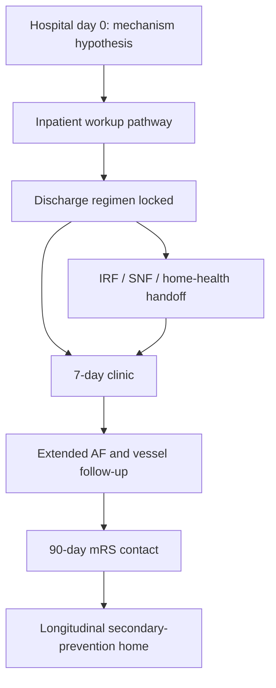

# Transitions, Secondary Prevention, and Clinic

## Opening

A Comprehensive Stroke Center that thrombolyses and retrieves well and then discharges a patient without an etiology plan, without the right antithrombotic, and without a clinic slot inside a week has performed a procedure, not completed an episode of care. Secondary prevention is not a discharge summary paragraph. It is a timed pathway that starts on hospital day 0, runs through a seven-day clinic visit, and closes with a 90-day modified Rankin Scale (mRS) contact the CSC can defend under CSTK-02 and CSTK-10.

The Medical Director owns the operating system that turns TOAST classification, atrial fibrillation detection, lipid therapy, antithrombotic choice, dual antiplatelet therapy for non-disabling events, medication reconciliation, post-acute handoff, and 90-day outcome capture into a single, auditable chain. Vascular neurology cannot delegate that chain to "whoever writes the discharge." Hospitalists, fellows, pharmacists, and the clinic manager will execute pieces. The Medical Director sets the decision rights and the fail-safes.

The 2026 AHA/ASA acute ischemic stroke guideline changed one high-visibility fork: for patients with non-disabling deficits in the 4.5-hour window, dual antiplatelet therapy is preferred over intravenous thrombolysis. That preference does not retire CHANCE and POINT. It adds an emergency-department and same-day-unit decision that must be written, taught, and abstracted correctly. The 2021 AHA/ASA secondary prevention guideline remains the major reference for the rest of the workup and the discharge regimen unless a later AHA update is cited.

This chapter is the operations manual for that chain. It is written for the academic CSC, where the same patient may leave for an inpatient rehabilitation facility, a skilled nursing facility, home with services, or another hospital in the network, and where 90-day mRS is both a certification measure and a research endpoint.

## Why This Matters

Most recurrent strokes that an academic CSC will see this year are prevention failures, not hyperacute failures. The workup that never named a mechanism, the statin that was "moderate intensity because the LDL was only 92," the anticoagulation for atrial fibrillation that was "deferred to the PCP," and the clinic appointment booked at six weeks are the usual sequence.

Joint Commission and GWTG-Stroke make parts of this sequence non-optional. STK-2 (discharged on antithrombotic) and STK-3 (anticoagulation for atrial fibrillation or flutter) are longstanding inpatient stroke measures. GWTG-Stroke achievement awards require **85%** on each of seven measures; that set includes antithrombotics at discharge, anticoagulation for AF/flutter, and **intensive statin at discharge**. CSTK-02 requires 90-day mRS collection. CSTK-10 reports favorable 90-day outcome. A CSC that cannot find its patients at 90 days cannot claim outcome excellence, and it cannot complete its certification data set.

The 2026 guideline's preference for DAPT over thrombolysis in non-disabling stroke will create two new failure modes if the program does not operationalize it. First, eligible disabling strokes will be under-treated because someone generalizes "DAPT is preferred" beyond the non-disabling population. Second, non-disabling patients will still receive thrombolysis out of habit, or will receive neither thrombolysis nor a loaded DAPT regimen. Write the fork. Teach the fork. Audit the fork.

Transitions of care are also an equity system. Patients discharged to skilled nursing, patients with limited English proficiency, and patients without a usual clinician are the ones who miss seven-day clinic, never start anticoagulation, and never contribute a 90-day mRS. If the scorecard is not stratified, the program will congratulate itself on a clinic that serves the easiest third of the census.

## Core Framework

### One episode, four clocks

Assign a clock owner. Day-0 mechanism belongs to the admitting vascular neurologist. Discharge regimen belongs to the discharging APP or fellow with pharmacy co-sign. Seven-day clinic belongs to the clinic manager with a daily access huddle. Ninety-day mRS belongs to a named coordinator, not to "the registry vendor."

### Mechanism workup as an operations pathway

TOAST remains the shared language: large-artery atherosclerosis, cardioembolism, small-vessel occlusion, other determined, and undetermined. Academic CSCs add contemporary granularity (embolic stroke of undetermined source, arterial dissection, hypercoagulable state, endocarditis) without abandoning a one-line mechanism that case management and the clinic can use.

| Mechanism hypothesis | Inpatient minimum | Do not delay discharge for | Clinic / outpatient next step |
| --- | --- | --- | --- |
| Large-artery atherosclerosis | Extracranial and intracranial vessel imaging; LDL and high-intensity statin started | Complete dental clearance or "routine" echo if vessels already explain the event and rhythm is documented | Revascularization conference if stenosis is symptomatic and anatomy is actionable |
| Cardioembolism / known AF | Rhythm documentation; anticoagulation plan or documented contraindication | Transesophageal echo when transthoracic plus rhythm already suffice | INR or DOAC tolerance check inside 7 days |
| Suspected occult AF | Inpatient telemetry for the entire stay; TSH and basic labs | Implantable loop recorder placement before discharge in every case | Time-defined extended monitoring pathway |
| Small-vessel / lacunar | MRI when it changes counseling or DAPT duration; BP regimen | An antibody panel with no clinical indication | Tight BP follow-up; do not call it ESUS |
| ESUS / undetermined | Vessel imaging, prolonged rhythm observation, echo strategy documented | Every advanced test in the catalog | Named residual questions on the discharge problem list |
| Dissection / other determined | Vessel imaging, trauma and connective-tissue history, antithrombotic choice documented | Genetic panels that will not change the next 90 days | Specialty clinic or vascular neurology continuity |

Write a "workup complete enough for discharge" definition. The enemy is two opposite errors: the four-day stay for an echocardiogram that will not change treatment, and the 36-hour stay that never images the neck.

### Atrial fibrillation detection pathway

AF detection is a pathway, not a single telemetry order.

1. **Inpatient continuous monitoring** for the entire ischemic-stroke stay unless a firm alternative mechanism is already treated and the attending documents why further rhythm search will not change care.
2. **Admission ECG** plus any prehospital AF documentation captured in the record.
3. **Risk-tiered extended monitoring** after discharge for patients without found AF and without another fully treated mechanism: ambulatory monitor duration chosen by age, cortical/embolic pattern, left atrial size, and residual suspicion.
4. **Implantable loop recorder** considered in a weekly multidisciplinary slot for high-suspicion ESUS, not as an automatic implant on hospital day 2.
5. **Anticoagulation start rules** written in advance so a newly found AF strip at 02:00 does not wait until Friday clinic.

STK-3 measures anticoagulation at discharge for documented AF/flutter. It does not measure whether the program looked hard enough. Build both the measure and the search.

### Antithrombotic and DAPT operations

| Population | Default discharge antithrombotic | Clock | What must be documented |
| --- | --- | --- | --- |
| Disabling AIS treated with IVT or EVT | Single antiplatelet after the post-treatment imaging hold, unless a specific indication for anticoagulation | STK-5 by end of hospital day 2; STK-2 at discharge | Why DAPT is not used; imaging hold start and stop |
| Non-disabling AIS or high-risk TIA, non-cardioembolic | Short-course DAPT (CHANCE/POINT evidence; 2026 preference for DAPT rather than IVT when deficits are non-disabling in the 4.5-hour window) | Load in the ED or on arrival to the unit; stop date in the discharge med list | NIHSS and a one-line functional statement that the deficit is non-disabling; planned DAPT duration |
| AF / flutter | Anticoagulation unless contraindication is written (STK-3) | Start or bridge plan before discharge | Agent, dose, follow-up lab or tolerance check |
| Symptomatic high-grade intracranial stenosis | Time-limited DAPT per secondary-prevention guidance, then monotherapy | Duration on the med list | Why duration differs from the minor-stroke default |
| Mechanical valve, LV thrombus, other definite cardioembolic | Anticoagulation pathway with cardiology co-management | Same hospitalization | Who owns INR or DOAC questions after discharge |

Operationalize CHANCE and POINT as evidence, not as a brand war. CHANCE used a 300 mg clopidogrel load and 21 days of DAPT. POINT used a 600 mg load and 90 days of DAPT, with most of the benefit and most of the hemorrhage risk front-loaded. The local protocol must pick a load dose, a duration (commonly 21 days, with 90 days reserved for defined high-risk situations), a stop date that appears on the after-visit summary, and a clinic check that DAPT actually stopped. Unexplained lifelong DAPT is a preventable bleed.

Teach the 2026 fork in one sentence the night resident can repeat: treat eligible **disabling** deficits rapidly with thrombolysis regardless of NIHSS; for **non-disabling** deficits (for example, isolated sensory syndrome) inside 4.5 hours, DAPT is preferred over thrombolysis. "Mild NIHSS" is not the same as "non-disabling." Ambulation and swallowing independence belong in that determination.

### Intensive statin and the lipid pathway

GWTG-Stroke achievement includes intensive statin at discharge. High-intensity statin (atorvastatin 40–80 mg or rosuvastatin 20–40 mg, or the current equivalent in the hospital formulary) is the default for atherosclerotic ischemic stroke and TIA unless a contraindication is written. Do not titrate from a moderate-intensity agent because the admission LDL "was not that high." Obtain a lipid panel, start the intensive agent, and let the clinic decide about add-on therapy (ezetimibe, PCSK9 pathway) using the 2021 secondary prevention guideline and any later AHA lipid update.

### Seven-day clinic access

Seven-day access is an operations standard, not a courtesy. The clinic is the safety net for missed AF, DAPT stop dates, blood-pressure rescue, statin intolerance, and the IRF patient whose mechanism workup was incomplete.

| Access rule | Internal standard | Owner |
| --- | --- | --- |
| Clinic slot offered before discharge | 100% of ischemic stroke and TIA discharges | Discharging team + clinic scheduler |
| Completed visit within 7 calendar days | Internal target ≥80%; review every miss | Clinic manager |
| Virtual visit allowed | Yes, when a neurologic exam is not required and meds can be reconciled | Medical Director policy |
| No-show rescue | Same-week outreach, twice, then a letter and PCP alert | Coordinator |
| IRF / SNF patients | Scheduled before transfer; completed by telemedicine if the patient cannot travel | Case management + clinic |

A filled template appointment at day 21 that no one can change is not seven-day access. Hold a daily 15-minute access huddle that releases unused new-patient slots to stroke discharges.

### Medication reconciliation and post-acute handoff

Reconciliation is a two-pharmacist, one-clinician problem. Home list, hospital list, and discharge list must be forced into a single source of truth. High-risk discrepancies: two antiplatelets plus a DOAC; DAPT without a stop date; a moderate-intensity statin replacing the intensive agent the attending intended; an antihypertensive held for TNK-related blood-pressure caution and never restarted.

IRF and SNF handoffs fail in predictable places. Build a packet standard: mechanism one-liner, NIHSS and mRS, imaging and vessel results, pending tests, DAPT stop date, anticoagulation plan, blood-pressure parameters, swallow status, and the named clinic appointment. A discharge summary that buries those facts in four pages of imported EHR text is not a handoff.

### Ninety-day mRS capture

CSTK-02 is performance of the 90-day mRS. CSTK-10 is favorable outcome among those assessed. Programs that only call patients who answer the first time will inflate CSTK-10 and fail CSTK-02. Build a capture system:

- Consent and preferred contact method collected before discharge.
- Window defined (classically 75–105 days; confirm the current CSTK specifications manual).
- Scripted, certified raters — not an untrained scheduler improvising.
- At least three contact attempts plus a mailed / portal instrument.
- IRF, SNF, and out-of-network patients included.
- Central review of a sample for inter-rater reliability.

!!! tip "Key Actions"
    Publish a one-page mechanism-to-regimen table that the night resident can use without a fellow. Write the 2026 DAPT-versus-thrombolysis fork into the code-stroke and TIA pathways this week, with a required functional statement that the deficit is or is not disabling. Convert intensive statin, STK-2, and STK-3 into discharge hard-stops. Create a daily clinic access huddle that guarantees a seven-day slot before the patient leaves. Name a 90-day mRS owner and a three-attempt protocol. Add a DAPT stop date to the after-visit summary and to the seven-day clinic template.

!!! abstract "Metrics Targets"
    Hold STK-2 and STK-3 at an internal target of **≥95%**, above the GWTG achievement floor of **85%**. Hold GWTG intensive-statin achievement at **≥90%** internally. Complete a seven-day clinic visit for **≥80%** of ischemic stroke and TIA discharges, stratified by home versus IRF/SNF and by language. Capture 90-day mRS on **≥90%** of CSTK-02-eligible patients; do not manage CSTK-10 in isolation. Document a DAPT stop date on **100%** of short-course DAPT discharges. Review 100% of non-disabling 4.5-hour presentations for correct pathway selection (DAPT versus thrombolysis) each month.

!!! warning "Common Pitfalls"
    Treating NIHSS ≤5 as automatically non-disabling and withholding thrombolysis from a patient who cannot walk or swallow. Loading DAPT and never writing the stop date. Calling the stroke "cryptogenic" without vessel imaging. Starting a moderate-intensity statin because LDL was 88 mg/dL. Documenting AF and discharging on aspirin "until the PCP decides." Booking clinic at four weeks and calling the access standard met. Collecting 90-day mRS only from clinic attendees, which both fails CSTK-02 and biases CSTK-10. Sending an IRF a 14-page imported summary that does not state the mechanism or the anticoagulation plan.

!!! success "Implementation Tips"
    Put the mechanism one-liner, antithrombotic, statin intensity, DAPT stop date, and clinic date in a structured discharge block that cannot be bypassed. Have pharmacy own the DAPT calendar card. Use telemedicine for IRF and rural patients rather than declaring them lost. Pair every new AF diagnosis with a same-stay anticoagulation order or a written contraindication, not a "will discuss" note. Sample ten discharge packets a month with the IRF medical director and fix the packet, not the relationship. When the 2026 DAPT preference is new to the faculty, review the first twenty cases in person rather than by email.

## How to Do the Work

### Daily / weekly

On daily board rounds, require a mechanism hypothesis by the end of hospital day 1 and a discharge-regimen draft by the day before expected departure. The draft names the antithrombotic, statin intensity, anticoagulation plan, DAPT duration if any, and the clinic slot. If the slot does not exist, the clinic manager is paged during rounds, not after discharge.

Each weekday, the stroke coordinator reviews yesterday's ischemic discharges against STK-2, STK-3, intensive statin, DAPT stop date, and seven-day appointment. Same-week defects are still repairable by a phone order and a clinic add-on. Weekly, the AF pathway list is reviewed: who is still without a rhythm strategy, who is waiting for an implantable monitor decision, who has new AF without anticoagulation.

Weekly, pull every code-stroke or TIA case with a non-disabling presentation and confirm the 2026 fork was applied correctly. This is a 20-minute review. It prevents a silent drift back to "we lyse everyone with a measurable NIHSS" or the opposite drift, "we never lyse an NIHSS under 6."

### Monthly / quarterly

Monthly, present a transitions scorecard: STK-2, STK-3, intensive statin, seven-day access, no-show rate, DAPT duration errors, anticoagulation start lag after new AF, and 90-day mRS capture. Stratify by discharge destination, race and ethnicity, language, and insurance class. Equity gaps in clinic access are usually scheduling design, not patient noncompliance.

Monthly, run a 30-minute prevention conference: selected ESUS, dissection, young stroke, and failed-prevention readmissions. This is where academic CSCs convert operations into teaching and into trial screening.

Quarterly, sit with cardiology and electrophysiology to clean the extended-monitoring pathway. Quarterly, sit with the IRF and the major SNF partners to audit ten handoffs. Quarterly, re-certify mRS raters and report inter-rater agreement. Quarterly, reconcile the local DAPT protocol against any new AHA update so CHANCE/POINT operations and the 2026 acute preference remain aligned.

### Annual / multi-year

Annually, decide whether clinic capacity matches discharge volume. A CSC that grows thrombectomy transfers without growing seven-day clinic is manufacturing CSTK and STK failures. Annually, re-credential the 90-day program as if it were a clinical service: script, attempts, language access, and data lock.

Multi-year, build a true secondary-prevention home: vascular neurology plus pharmacy plus a nurse practitioner, with defined handoff to primary care after the high-risk window. Multi-year, decide which prevention trials the site will keep open (intensive medical management, AF detection, residual risk) so the clinic is a research environment, not only a refill environment. Confirm current certification volume tables in the active DSC manual before using clinic volume as a proxy for CSC eligibility.

## Ready-to-Adapt Tools

### Tool A — Discharge regimen block (required structured fields)

- Mechanism one-liner (TOAST plus free-text)
- Disabling versus non-disabling at presentation (if AIS)
- Antithrombotic at discharge and indication
- DAPT stop date or "not applicable"
- Anticoagulation agent / dose / start date / contraindication
- Statin agent / intensity / LDL value
- Blood-pressure target and regimen
- Glucose plan if diabetic
- Smoking-cessation offer (GWTG achievement measure)
- Clinic date, time, modality, and after-hours number
- Pending results and who will call them
- 90-day mRS preferred contact method

### Tool B — Seven-day access huddle agenda (15 minutes)

1. Yesterday's discharges without a completed booking
2. Today's unused new-patient slots that can be released
3. IRF/SNF patients due this week (telemedicine first)
4. Language-interpreter needs
5. No-shows from yesterday and the rescue plan
6. Clinician sick-call coverage for the next 72 hours

### Tool C — AF detection pathway card

| Step | When | Default action | Escalation |
| --- | --- | --- | --- |
| ECG | Arrival | Store in the stroke chart | Compare with EMS documentation |
| Telemetry | Entire stay | Continuous | Document any gap >4 hours |
| Inpatient AF found | Same day | Anticoagulation plan or written contraindication | Hematology or cardiology if high bleed risk |
| No AF, embolic pattern | Before discharge | Order extended outpatient monitor | Weekly ESUS conference if implant considered |
| Monitor result positive | Within 1 business day | Start anticoagulation; notify patient | Clinic add-on within 72 hours |
| Monitor result negative | Within 1 week | Update mechanism; stop the AF clock or extend once | Medical Director review if third-negative and still ESUS |

### Tool D — IRF / SNF handoff packet checklist

- One-page mechanism and regimen sheet (Tool A fields)
- Last NIHSS and discharge mRS
- Imaging disc or links: CT, CTA/MRA, MRI, catheter angiography
- Swallow status and diet
- DVT prophylaxis status
- Lines, wounds, and isolation
- Pending cultures and vessel studies
- Code status and surrogate
- Named receiving clinician and fax / EHR route
- Clinic appointment already scheduled

### Tool E — 90-day mRS SOP skeleton

1. Identify the CSTK-02 denominator from the daily stroke list, not from clinic attendance.
2. Collect preferred contact and a backup contact before discharge.
3. First attempt at day 80 by the patient's preferred method.
4. Second and third attempts by alternate methods, including the IRF/SNF social worker.
5. Use a certified rater and a scripted instrument.
6. Record "unable to contact" only after three attempts and a mailed instrument.
7. Lock the score; do not let later clinic notes silently overwrite it.
8. Sample 10% for dual rating each quarter.

### Tool F — RACI for transitions

| Decision | Medical Director | Clinic manager | Stroke coordinator | Discharging APP | Pharmacy |
| --- | --- | --- | --- | --- | --- |
| DAPT protocol and 2026 fork | A | I | C | R | C |
| STK-2 / STK-3 hard-stops | A | I | R | R | R |
| Seven-day slot guarantee | A | R | C | C | I |
| AF extended-monitoring pathway | A | C | R | C | I |
| 90-day mRS capture | A | C | R | I | I |
| IRF packet standard | A | I | R | R | C |

## Integration With Other Pillars

This chapter completes the stay that [Inpatient Stroke Unit Operations](16-inpatient-stroke-unit.md) runs and that [Hyperacute Pathways and Code Stroke](11-hyperacute-pathways.md) and [Intravenous Thrombolysis Operations](13-iv-thrombolysis.md) start. The 2026 DAPT preference is a hyperacute decision with a prevention tail; both chapters must tell the same story. [Rehabilitation and Post-Acute Continuum](18-rehabilitation-continuum.md) owns IRF versus SNF choice; this chapter owns the packet and the clinic appointment that must survive that choice.

Quality measurement lives in [Core Metrics: GWTG, STK, and CSTK](../quality/23-core-metrics.md). Equity stratification of clinic access and 90-day capture lives in [Equity and Disparities Reduction](../quality/26-equity-disparities.md). Fellowship education on mechanism reasoning lives in [Vascular Neurology Fellowship and GME](../education/27-fellowship-gme.md). Prevention trial screening lives in [Clinical Trials, Registries, and Research Operations](../research/29-trials-registries.md). If the clinic is not a StrokeNet screening site, the academic mission is leaking at the most repeatable patient contact the CSC has.

## Sources

- 2026 Guideline for the Early Management of Patients With Acute Ischemic Stroke. *Stroke*. 2026;57(8):e316–e436. DOI 10.1161/STR.0000000000000513. Includes the preference for DAPT over thrombolysis in non-disabling deficits within 4.5 hours, and the instruction to treat eligible disabling deficits rapidly regardless of NIHSS.
- Kleindorfer DO, et al. 2021 Guideline for the Prevention of Stroke in Patients With Stroke and Transient Ischemic Attack. *Stroke*. 2021;52:e364–e467. Major secondary-prevention reference unless a later AHA update is cited.
- Wang Y, et al. Clopidogrel with aspirin in acute minor stroke or transient ischemic attack (CHANCE). *N Engl J Med*. 2013;369:11–19.
- Johnston SC, et al. Clopidogrel and aspirin in acute ischemic stroke and high-risk TIA (POINT). *N Engl J Med*. 2018;379:215–225.
- Johnston SC, et al. Ticagrelor and aspirin or aspirin alone in acute ischemic stroke or TIA (THALES). *N Engl J Med*. 2020;383:207–217.
- Chen HS, et al. Dual antiplatelet therapy vs alteplase for patients with minor nondisabling acute ischemic stroke (ARAMIS). *JAMA*. 2023;329:2135–2144.
- Adams HP Jr, et al. Classification of subtype of acute ischemic stroke: TOAST. *Stroke*. 1993;24:35–41.
- Sanna T, et al. Cryptogenic stroke and underlying atrial fibrillation (CRYSTAL AF). *N Engl J Med*. 2014;370:2478–2486.
- Specifications Manual for Joint Commission National Quality Measures: STK-2, STK-3, STK-6; CSTK-02 (mRS at 90 days) and CSTK-10 (90-day favorable outcome), v2026B and successors.
- AHA Get With The Guidelines–Stroke achievement measures, including antithrombotics at discharge, anticoagulation for AF/flutter, smoking cessation, and intensive statin at discharge; **85%** achievement bar (public criteria last reviewed September 9, 2022).
