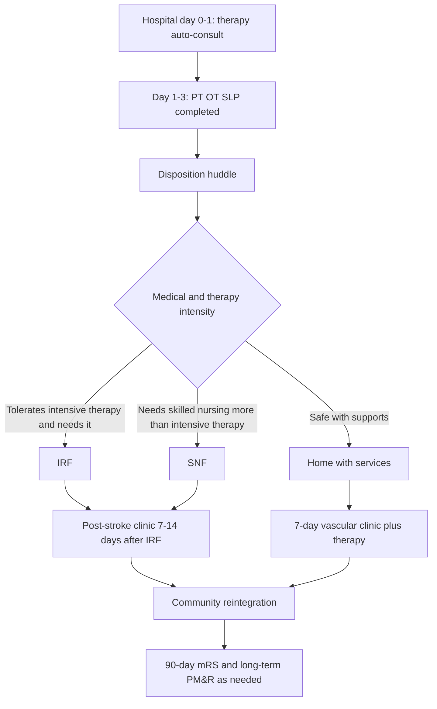

# Rehabilitation and Post-Acute Continuum

## Opening

Rehabilitation is not what happens after the Comprehensive Stroke Center is finished. It is the longest phase of the episode and the phase families will use to judge whether the academic medical center kept its promise. STK-10 (assessed for rehabilitation) is the certification floor. It is a checkbox if the assessment is a copied phrase in the discharge summary. It is a system if every patient receives a timely, discipline-complete evaluation, a reasoned IRF-versus-SNF decision, screening for aphasia, dysphagia, spasticity, and depression, a taught caregiver, and a path back into a post-stroke clinic.

The Medical Director does not need to become a physiatrist. The Medical Director does need to treat physical medicine and rehabilitation as a core CSC service, not as a consulting courtesy. In an academic center that usually means a formal partnership with the PM&R department, shared decision rights on disposition, joint quality review of patients who bounce from IRF to acute care, and a clinic that can see spasticity, shoulder pain, mood, and return-to-drive questions without forcing the patient to reinvent the health system.

The 2026 AHA/ASA acute ischemic stroke guideline continues to support organized multidisciplinary rehabilitation assessment early in the stay and continues to warn against the AVERT pattern of very-early, high-dose mobilization in unstable patients. That is the unit-level starting gun. This chapter covers the rest of the continuum: assessment operations, IRF versus SNF decision rights, impairment screening, the academic PM&R partnership, community reintegration, the post-stroke clinic, and caregiver teaching.

## Why This Matters

Functional outcome is the product the public thinks it is buying. Door-to-device time is a professional metric. Walking into a daughter's wedding is a family metric. CSTK-10 (favorable 90-day mRS) will expose the rehabilitation continuum whether or not the program has a physiatrist at the table. Programs that obsess over reperfusion and then accept whatever skilled-nursing bed is empty on Saturday are choosing their 90-day outcomes in the case-management office.

STK-10 exists because assessment was historically forgotten. The measure is necessary and insufficient. A CSC can pass STK-10 on patients who never stood with a physical therapist and never saw speech-language pathology. Build the measure and then build the actual evaluation.

Disposition is an equity system. Patients with identical NIHSS scores leave for IRF or SNF based on insurance, family structure, language, and how hard the team is willing to appeal. If the Medical Director does not review IRF-eligible patients who left for SNF, the program will launder structural inequity through "patient preference." It is sometimes preference. Audit it.

Academic CSCs have a structural advantage they often waste: a PM&R department, therapy schools, and an inpatient rehabilitation facility that may sit on the same campus. That advantage becomes real only when stroke leadership and PM&R leadership share a written partnership — staffing, consult timing, teaching, research, and a joint M&M for failed dispositions. Without that document, the relationship is a series of individual friendships that reset every July.

Finally, caregiver teaching is a safety intervention. Aspiration after a "passed" diet, missed anticoagulation doses, and falls in the first week at home are continuum failures. STK-8 stroke education is the minimum. Caregivers of patients with aphasia, neglect, or severe hemiparesis need a taught skill set, not a folder.

## Core Framework

### The continuum as a designed pathway

Auto-consult therapy on every stroke admission, including ICH and aSAH once medically eligible. Do not wait for an attending to remember. The only acceptable reason to cancel a therapy consult is a documented medical contraindication, not "waiting for MRI."

### STK-10 and the real assessment

| Layer | What "assessed" must mean | Owner | Failure mode |
| --- | --- | --- | --- |
| STK-10 documentation | A dated assessment that the patient was evaluated for rehabilitation services | Any qualified clinician; usually PT or the stroke APP | Copied phrase, no discipline contact |
| Discipline-complete evaluation | PT, OT, and SLP each see the patient or document why not | Therapy leadership | OT skipped because "PT already went" |
| Function score | A reproducible score (for example, AM-PAC or an equivalent the hospital already licenses) on admission and near discharge | Therapy | Narrative-only notes that cannot be trended |
| Disposition recommendation | Explicit IRF / SNF / home recommendation with the reason | PT/OT plus PM&R when the decision is contested | "Will defer to case management" |
| Caregiver assessment | Named caregiver, teaching needs, and return-demonstration plan | RN + therapy + case management | Assuming a spouse can manage a hoist |

Complete the core assessments early. The 2026 guideline supports multidisciplinary inpatient evaluation in the first days of the stay. Pair that with the unit chapter's mobilization rule: assess early; do not reproduce AVERT by pushing high-dose out-of-bed activity inside 24 hours in unstable patients.

### IRF versus SNF decision operations

This is a clinical decision with a regulatory wrapper. Medicare IRF payment rules (the "three-hour rule," medical necessity, and the IRF-PAI) are real constraints. They are not a substitute for a physician recommendation. Write a local decision table the team can defend.

| Question | Favors IRF | Favors SNF | Favors home with services |
| --- | --- | --- | --- |
| Can the patient tolerate intensive therapy? | Yes, or likely within days | No — endurance, behavior, or medical instability dominate | Yes, and needs are part-time |
| Does the patient need daily physician and interdisciplinary management? | Yes — dense deficits, medical complexity, tone emerging | Needs nursing more than daily interdisciplinary intensity | Needs education and outpatient therapy |
| Prognosis for meaningful gain | Plausible in weeks | Slow, uncertain, or comfort-leaning | Already near baseline |
| Supervision and home setup | Home cannot yet supervise | Home cannot supervise and intensity is not tolerated | Home can supervise |
| Insurance and appeal | Appeal when clinical criteria are met and the payer refuses | Do not use insurance as the first-line clinical reason | Same |

Rules the Medical Director should lock:

- A vascular neurologist or physiatrist, not a utilization-review nurse alone, signs the clinical recommendation.
- Every IRF-eligible patient who leaves for SNF is reviewed within 14 days.
- Payer denials are appealed when the team still believes IRF is right; track appeal win-rate.
- Saturday IRF admission is a capacity metric, not a favor (see the unit chapter's weekend discharge work).
- Patients with aphasia, neglect, or age under 65 are not steered to SNF by default.

### Impairment screening beyond hemiparesis

A CSC rehabilitation program that only measures the arm and the gait is incomplete.

| Domain | When to screen | Who | What happens if positive |
| --- | --- | --- | --- |
| Dysphagia | Before first PO; again after any neurologic change | RN screen, then SLP | Instrumental assessment when the bedside exam cannot answer aspiration risk |
| Aphasia and cognition | First 48 hours if communication is impaired or the lesion is language-eligible | SLP | Communication plan on the white board; caregiver teaching; outpatient SLP booked |
| Neglect and visual field | OT evaluation | OT + neurology | Environment setup, sitting plan, return-to-drive deferral |
| Shoulder and arm integrity | OT/PT on first evaluation | OT/PT | Positioning, sling policy, pain treatment |
| Spasticity | Before discharge and at the post-stroke clinic | PM&R + therapy | Stretching plan; tone clinic referral; do not wait for contracture |
| Depression and mood | Validated screen during the stay and again in clinic | RN or social work, with psychiatry backup | Treatment or referral before discharge, not "mention to PCP" |
| Continence | Daily nursing assessment | RN + OT | Scheduled toileting; do not reflexively catheterize |
| Sleep and fatigue | Clinic visit | Clinic APP / PM&R | Treat apnea suspicion; dose therapy around fatigue |
| Return to drive / work / sex | Clinic, not the acute discharge day unless the answer is clearly no | PM&R or vascular clinic | Written restriction and a review date |

Depression screening belongs in the CSC scorecard. Post-stroke depression is common, treatable, and routinely missed. A PHQ-2/PHQ-9 pathway (or the hospital's equivalent) with a same-stay social-work response is the minimum.

### Academic PM&R partnership

Write a one-page partnership. Friendship is not a governance structure.

| Element | Floor | Elite academic practice |
| --- | --- | --- |
| Acute consult | PM&R available weekdays | Same-day consult for contested dispositions and severe impairment |
| IRF leadership | IRF accepts stroke patients | Shared M&M, shared dashboards, Saturday admissions |
| Clinic | Separate calendars | Integrated post-stroke clinic (vascular + PM&R + pharmacy + SLP) |
| Teaching | Residents rotate if they ask | Required vascular and PM&R cross-rotation |
| Research | Occasional shared paper | Recovery trials on the StrokeNet menu, shared coordinator |
| Spasticity / ITB / chemo-denervation | Referred out | On-campus tone program as a CSC differentiator |
| Governance | "We call them" | PM&R on the stroke operations committee with vote |

### Community reintegration and the post-stroke clinic

The post-stroke clinic is not a duplicate of the seven-day vascular-prevention visit. Prevention clinic owns mechanism, antithrombotics, statin, and AF. Post-stroke clinic owns function, tone, pain, mood, equipment, driving, return to work, and caregiver collapse. They may be the same afternoon and the same hallway. They are not the same template.

Community reintegration work the CSC should staff or formally partner:

- Outpatient PT/OT/SLP with stroke-competent therapists, not a generic orthopedic gym.
- Aphasia community groups and supported conversation training for caregivers.
- Driving evaluation pathway with a written restriction policy.
- Vocational rehabilitation contact for working-age patients.
- Peer support and stroke-survivor groups, screened so they do not become unsupervised medical advice.
- Home-safety evaluation for patients going home with dense deficits.

!!! tip "Key Actions"
    Auto-consult PT, OT, and SLP on every stroke admission and measure completed evaluations by hospital day 3. Put a physiatrist or a designated PM&R APP on weekday disposition huddles. Review every IRF-eligible patient who left for SNF within 14 days. Add aphasia, dysphagia, spasticity, and depression screens to the unit bundle and the post-stroke clinic template. Sign a written PM&R partnership covering consults, IRF M&M, clinic, teaching, and research. Book the post-stroke function visit before discharge, separate from or paired with the seven-day prevention visit.

!!! abstract "Metrics Targets"
    Hold STK-10 at **≥95%** internally, above the usual certification expectation of high compliance. Complete PT, OT, and SLP evaluations (or a documented reason for omission) by the end of hospital day 3 in **≥90%** of surviving inpatients. Target an IRF-among-IRF-eligible rate that is reviewed monthly; do not set a fake national percentage — track the local eligible cohort and the appeal win-rate instead. Screen depression with a validated tool in **≥90%** of patients able to participate. Complete a post-stroke function visit within 30 days of discharge or IRF/SNF departure in **≥70%** as an internal build target, then raise it. Include rehabilitation destination and 90-day mRS in the same equity-stratified report.

!!! warning "Common Pitfalls"
    Equating STK-10 with a rehabilitation program. Allowing utilization review to make the IRF-versus-SNF decision in a hallway conversation the attending never sees. Treating aphasia as a discharge instruction rather than a treated impairment. Declaring patients "unmotivated" when they are delirious, depressed, or aphasic. Sending working-age patients with hemiparesis to SNF because the IRF "is full this week" and never measuring how often that happens. Building a post-stroke clinic that only refills statins. Forgetting caregivers until the day of discharge. Mobilizing unstable patients aggressively in the first 24 hours because someone remembered "early rehab" and forgot AVERT.

!!! success "Implementation Tips"
    Start the PM&R partnership with Saturday IRF admissions and contested dispositions — shared pain creates shared governance. Put the disposition recommendation in a structured field, not a therapy narrative. Teach case managers a 60-second IRF-versus-SNF script so insurance conversations start from the clinical recommendation. Co-locate the function clinic with the prevention clinic one afternoon a week so patients make one trip. Use telemedicine into the IRF and SNF for the first function visit. When depression screens are positive, require a same-stay action, not a phrase in the after-visit summary.

## How to Do the Work

### Daily / weekly

Auto-consults should already be in the admission order-set. The daily huddle names any patient still unseen by a needed therapy discipline and any patient whose disposition is contested. A physiatrist or PM&R APP joins the huddle on weekdays; on weekends the covering APP uses the decision table and the weekend discharge checklist.

Therapy documentation must produce a recommendation, not only minutes. Charge nurses should be able to read, on the board, "IRF-likely," "SNF-likely," or "home-likely" by hospital day 3 for the typical ischemic stroke.

Weekly, the stroke coordinator and therapy supervisor review STK-10 fallouts, incomplete discipline evaluations, and IRF-eligible patients who left for SNF. Weekly, social work reviews positive depression screens that lack a treatment or referral.

### Monthly / quarterly

Monthly, present a rehabilitation scorecard to stroke operations: STK-10, day-3 evaluation completion, destination mix, IRF-eligible-to-SNF leakage, payer denials and appeals, unplanned readmissions from IRF, depression-screen completion and action, and 90-day mRS by destination. Invite the IRF medical director. If that person is not in the room, the continuum is not being managed.

Quarterly, run a joint stroke–PM&R M&M: failed IRF stays, preventable aspiration after discharge, missed spasticity, caregiver collapse leading to readmission, and working-age patients who never received vocational referral. Quarterly, audit aphasia care: was SLP consulted, was a communication plan visible, was outpatient SLP actually booked.

Quarterly, walk the equity cut: destination and 90-day mRS by language, race and ethnicity, payer, and rural origin. Fix scheduling, interpreter access, and appeal effort before declaring a biological difference.

### Annual / multi-year

Annually, renegotiate therapy staffing against completed-evaluation performance, not against last year's budget. Annually, renew the PM&R partnership and decide whether the CSC needs more IRF beds, a dedicated stroke IRF team, or a tone clinic.

Multi-year, treat recovery research as a CSC pillar. StrokeNet and other recovery trials need screening on the unit and at the IRF, not only in the hyperacute bay. Multi-year, decide whether community reintegration (driving, vocation, aphasia groups) is provided, partnered, or absent. Absence is a choice; write it down and revisit it. Confirm any certification language about rehabilitation services in the current DSC manual rather than relying on historical CSC consensus statements alone.

## Ready-to-Adapt Tools

### Tool A — Day-3 rehabilitation completeness checklist

- PT evaluation completed or contraindication written
- OT evaluation completed or contraindication written
- SLP evaluation completed or not indicated (and why)
- Function score recorded
- Dysphagia status current
- Aphasia / cognition status current
- Depression screen completed or "unable" documented
- Disposition recommendation entered in the structured field
- Caregiver named
- STK-10 documentation satisfied as a by-product, not as the goal

### Tool B — Contested disposition huddle (10 minutes)

Attendees: vascular neurology, PM&R, therapy, case management, and the charge nurse.

1. What does the patient need that only IRF can deliver in the next two weeks?
2. What medical barrier makes intensive therapy unsafe today, and is it reversible in 48 hours?
3. What does the caregiver actually understand?
4. What did the payer say, and who is appealing?
5. What is the 48-hour plan if IRF is unavailable Saturday?

### Tool C — Post-stroke clinic template (function visit)

- Interval history: falls, sleep, mood, pain, continence, tone, return to work or drive
- Medication list with focus on anticholinergics, sedatives, and missed antithrombotics
- Brief exam: language, neglect, arm, gait, tone, shoulder
- PHQ-9 or equivalent if not done this month
- Equipment and home-safety review
- Therapy progress and new referrals
- Spasticity plan
- Caregiver stress question, asked of the caregiver
- Next visit and the 90-day mRS plan if not already captured

### Tool D — Caregiver teaching checklist (return demonstration)

- How to supervise eating and what "off the diet" looks like
- Medications: what, why, and the DAPT stop date if any
- Blood-pressure parameters that should trigger a call
- Warning signs and EMS activation (STK-8)
- Transfers and fall recovery — demonstrated, not described
- Shoulder protection
- Communication strategies if aphasia is present
- Who to call at 14:00 Saturday
- Follow-up dates, written

### Tool E — PM&R partnership one-pager (SOP skeleton)

- Purpose: shared ownership of function from hospital day 1 through community reintegration
- Consult standard: same-day weekday PM&R for contested IRF/SNF and for NIHSS above a locally chosen threshold
- IRF: Saturday admission pathway; joint monthly dashboard
- Clinic: one shared afternoon per week
- Teaching: named cross-rotations
- Research: named recovery-trial portfolio and coordinator time
- Governance: PM&R seat on stroke operations; stroke seat on IRF quality
- Review date: annual

### Tool F — RACI for the continuum

| Decision | Medical Director | PM&R lead | Therapy supervisor | Case management | Stroke coordinator |
| --- | --- | --- | --- | --- | --- |
| Auto-consult rules | A | C | R | I | C |
| IRF vs SNF clinical recommendation | A | R | C | C | I |
| Appeal of IRF denial | A | R | C | R | I |
| Depression-screen pathway | A | C | I | C | R |
| Post-stroke clinic design | A | R | C | I | C |
| STK-10 reliability | A | C | C | I | R |

## Integration With Other Pillars

Assessment starts on the [Inpatient Stroke Unit](16-inpatient-stroke-unit.md) and, for the sickest patients, in [Neurocritical Care Integration](15-neurocritical-care.md). Do not write conflicting mobilization rules. [Transitions, Secondary Prevention, and Clinic](17-transitions-prevention.md) owns the seven-day prevention visit and the 90-day mRS capture; this chapter owns the function visit and the destination decision that determine whether those contacts happen. [Hemorrhagic Stroke and Complex Cerebrovascular Programs](21-hemorrhagic-complex.md) must be inside the same therapy auto-consult system; ICH and aSAH patients are not "too complicated for IRF" by default.

Quality and equity live in [Core Metrics](../quality/23-core-metrics.md) and [Equity and Disparities Reduction](../quality/26-equity-disparities.md). Education lives in [Interprofessional Education, Simulation, and Community Teaching](../education/28-interprofessional-simulation.md) — caregiver teaching and supported conversation belong there. Recovery trials live in [Clinical Trials, Registries, and Research Operations](../research/29-trials-registries.md). FTE for therapy and PM&R belong in [Organizational Design and FTE Architecture](../leadership/08-organizational-design.md). Community reintegration is also a [Network Leadership](../strategy/33-network-leadership.md) problem when the CSC's rural partners have no stroke-competent outpatient therapy.

## Sources

- 2026 Guideline for the Early Management of Patients With Acute Ischemic Stroke. *Stroke*. 2026;57(8):e316–e436. DOI 10.1161/STR.0000000000000513. Supportive care, dysphagia, and rehabilitation assessment.
- Winstein CJ, et al. Guidelines for Adult Stroke Rehabilitation and Recovery. *Stroke*. 2016;47:e98–e169. Still the major AHA rehabilitation framework unless a later update is cited.
- AVERT Trial Collaboration group. Efficacy and safety of very early mobilisation within 24 h of stroke onset (AVERT). *Lancet*. 2015;386:46–55.
- Langhorne P, Ramachandra S; Stroke Unit Trialists' Collaboration. Organised inpatient (stroke unit) care for stroke: network meta-analysis. *Cochrane Database Syst Rev*. 2020.
- Towfighi A, et al. Poststroke Depression: A Scientific Statement for Healthcare Professionals From the American Heart Association/American Stroke Association. *Stroke*. 2017;48:e30–e43.
- Specifications Manual for Joint Commission National Quality Measures: STK-10 (assessed for rehabilitation); STK-8 (stroke education); CSTK-02 and CSTK-10 (90-day mRS). Confirm the current version.
- Centers for Medicare & Medicaid Services IRF prospective payment and coverage rules (three-hour therapy expectation, medical necessity, IRF-PAI). Use the current CMS IRF manual rather than memory.
- Alberts MJ, et al. Recommendations for comprehensive stroke centers. *Stroke*. 2005. Foundational expectation of rehabilitation services; not a substitute for current Joint Commission CSC standards.
