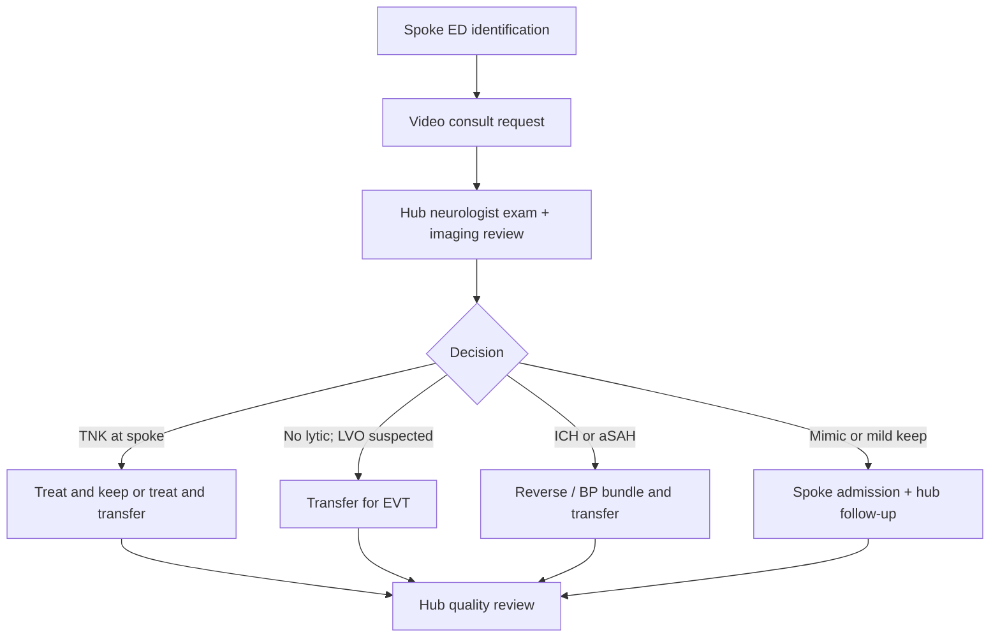

# Telestroke Network Operations

## Opening

Telestroke is how an academic Comprehensive Stroke Center extends vascular neurology to places that will never have a 24/7 on-site specialist. It is not a video cart and a call schedule. It is a governed network: credentialing, licensing, documentation, decision rights for tenecteplase and transfer, a standard for what a video examination must include, spoke education, written transfer criteria, night coverage that does not collapse onto one fellow, and an equity obligation to rural and critical-access partners.

The Medical Director of the hub CSC is the clinical owner of that network even when a vendor hosts the platform and even when a health-system telemedicine office holds the contracts. Vendors do not decide whether a spoke patient receives tenecteplase. Health-system telemedicine offices do not decide when a large-vessel occlusion moves. If those decision rights are fuzzy, the network will produce delayed treatment, unnecessary transfers, and avoidable keep-in-place disasters.

The 2026 AHA/ASA acute ischemic stroke guideline continues to support telestroke as a method for accurate thrombolytic decision-making and for triage toward endovascular therapy, and it frames telemedicine support as an equity tool for patients whose geography would otherwise deny them specialist care. That is the clinical license. This chapter is the operating system: how the hub runs the network so a Tuesday afternoon consult and a 03:00 consult are the same product.

Do not build billing strategy into this chapter's center of gravity. Professional and facility reimbursement for telehealth is real, regulated, and changeable. Keep finance principles at a high level, keep them current with counsel and the revenue-cycle office, and do not run the network as a volume machine.

## Why This Matters

Most patients with stroke in the United States still present to hospitals that are not CSCs. The academic CSC's regional duty is to make the first hospital the right hospital for thrombolysis and the right router for thrombectomy and hemorrhage. Telestroke is the only scalable way to do that after 17:00 and outside the metro beltway.

Evidence, not sentiment, supports the model. The STRokEDOC randomized trials showed that video consultation improves thrombolytic eligibility decisions compared with telephone-only consultation. Observational systems have associated telestroke-capable hospitals with lower mortality relative to control hospitals. The 2026 guideline treats these findings as a reason for institutions, payers, and governments to keep supporting telestroke so access does not depend on the accident of the nearest on-call neurologist.

Operations, not evidence, are where academic networks fail. A neurologist licensed in the hub state but not in the spoke state. A spoke emergency physician who cannot give tenecteplase without a second private call to a local internist. A video exam that never sees ataxia or visual fields. A transfer that leaves 40 minutes after decision because no one owns EMS. A night roster that is "the fellow, with attending backup" in theory and "the fellow" in fact. A rural spoke that gets lectures during Stroke Month and silence in February.

Certification and reputation follow the same failures. Surveyors will ask how the hub credentials telestroke physicians, how spoke staff are educated, and how transfer decisions are reviewed. Referring hospitals will vote with their EMS pattern. A network that over-transfers minor strokes and under-transfers large-vessel occlusions will lose both trust and time.

## Core Framework

### Hub-and-spoke governance

Name the network as a clinical service with a budget, a medical director (often the CSC Medical Director or a designated Telestroke Director who reports to that person), a program manager, and a seat for spoke voices on **monthly quality**. Network strategy and FTE fights escalate to **quarterly stroke executive**. Do not invent a third "stroke governance committee."

| Governance object | Who holds it | What "held" means |
| --- | --- | --- |
| Clinical protocols (TNK, BP, reversal, transfer) | Hub Medical Director | One protocol book; spoke-specific addenda only for pharmacy or imaging constraints |
| Credentialing at each spoke | Hub medical staff office + each spoke | Privileges in place before the physician takes a first call |
| Licensing | Each physician, tracked centrally | Active license or compact privilege in the spoke state before the shift |
| Platform and security | Health-system telemedicine + information security | Downtime procedure tested |
| Transfer agreements | Hospital executives + Medical Director | Written, current, and known to night nursing supervisors |
| Quality review | Monthly quality (hub + spoke voices) | Cases, times, misses, and education, not a hub-only M&M |
| Education calendar | Telestroke program manager | Required, recorded, and spoke-attended |
| Night coverage | Medical Director | Attending-level decision rights 24/7 |

A vendor is a platform supplier. A vendor is not the Medical Director.

### Credentialing, licensing, and documentation

Credentialing is local. Each spoke medical staff must privilege the hub physicians who will recommend or order thrombolysis and who will direct transfer.

CMS telemedicine privileging is **confirm-live** against 42 CFR 482.22. The spoke (originating site) may run a full local credentialing file or, by written agreement, a proxy pathway that relies on the distant-site hospital or distant-site telemedicine entity's credentialing and privileging. Either path still requires licensure in the spoke state and a current privilege list before the first call. Focused and ongoing professional practice evaluation (FPPE/OPPE), or the hospital's equivalent, and the performance-information exchange 482.22 requires (adverse events and complaints sent back to the distant site) are medical-staff work. Confirm the live CoP text and the hospital bylaws. Do not invent a surveyor checklist in this chapter.

Licensing is state-based. The Interstate Medical Licensure Compact reduces friction for participating states; it does not create a national license. Maintain a living matrix: physician × state × expiration date. A physician who is perfect on the hub campus and unlicensed at a rural spoke is not covering that spoke.

### EMTALA at the hub — recipient-hospital rule (42 CFR 489.24)

The hub CSC is a **recipient hospital**. Under 42 CFR 489.24, a hospital with specialized capabilities may not refuse an appropriate transfer of a patient who requires those capabilities if it has the capacity to treat. Capacity plus specialized capability is the test. Insurance status is not. Do not screen the inbound transfer for payor, plan, or "out of network."

The spoke emergency department owns the medical screening examination and the physician certification of the transfer. The hub neurologist recommends treatment and destination. Joining the video does **not** make the hub neurologist the spoke EMTALA physician.

Decline-for-capacity is a **named attending** decision with a written log: time, attending, what capacity was missing (ICU bed, IR suite, OR, blood bank), and the redirect offered. An unnamed "we are busy" from the transfer-center agent is not a decline. Review every logged decline at the next weekday huddle; patterns go to monthly quality.

Documentation standards the network should lock:

- Time of request, time of video start, time of decision, time of TNK bolus or transfer accept.
- NIHSS performed on camera, with itemization available for audit.
- Imaging reviewed (and by whom — neurologist, teleradiologist, both).
- Decision and rationale, including why TNK was not given.
- Transfer destination and mode.
- Attending identity. Fellow participation is welcome; attending responsibility is required.
- A note that lands in the spoke EHR, not only in the hub EHR.

Telephone-only backup is a downtime procedure, not the night pathway. The 2026 guideline and the STRokEDOC evidence favor video for eligibility decisions.

### Decision rights for tenecteplase and transfer

Write decision rights so a spoke emergency physician and a hub neurologist do not negotiate from first principles at 02:00.

| Decision | Authority | Spoke obligation | Hub obligation |
| --- | --- | --- | --- |
| Activate telestroke | Spoke ED physician or approved RN protocol | Activate on suspected stroke within treatment windows, not only on "obvious" cases | Answer within the network time standard |
| Give TNK 0.25 mg/kg (max 25 mg) or alteplase 0.9 mg/kg (max 90 mg) | Hub neurologist recommends; spoke ED administers under local policy | Maintain drug, mixing competency, and BP control | Complete a video exam and image review before yes |
| Withhold lytic | Hub neurologist | Document and do not give "a little TNK anyway" | State the reason in the note |
| Transfer for EVT | Hub neurologist + accepting CSC attending | Call EMS at decision, not after packing | Accept or redirect within a defined number of minutes. No insurance screen (42 CFR 489.24). |
| Transfer for ICH / aSAH | Hub neurologist + neurosurgery / NCC | Start reversal and BP bundle before the wheels move | Name the receiving unit and surgeon/NIR plan |
| Decline for capacity | Named hub attending; written log | Do not shop payors while waiting | Log time, attending, missing capacity, redirect. Not a transfer-center solo decision. |
| Keep at spoke | Hub neurologist | Admit to an agreed pathway; recapture if the exam worsens | Offer a next-day video follow-up for selected keeps |
| Downgrade a transfer en route | Accepting attending | Update EMS | Never leave EMS without a destination |

The 2026 guideline's drug choice — tenecteplase 0.25 mg/kg IV push, maximum 25 mg, or alteplase 0.9 mg/kg, maximum 90 mg — must be identical at every spoke that stocks a lytic. Mixed inventories are a dosing error waiting for night shift. If a spoke still stocks only alteplase, the protocol must say so on the first page, not in a footnote.

Non-disabling deficits inside 4.5 hours follow the 2026 preference for DAPT rather than thrombolysis. The hub neurologist must see enough of the exam to decide "non-disabling," not guess from an NIHSS number the spoke nurse recorded.

### Quality of the video examination

A video NIHSS is a medical procedure. Define the standard.

| Element | Required on camera | Common miss |
| --- | --- | --- |
| Level of consciousness and commands | Yes | Nurse answering for the patient |
| Visual fields | Yes, with a second person confronting | Skipping fields because the camera is tight |
| Gaze and facial symmetry | Yes | Camera at the foot of the bed |
| Arm and leg drift | Yes, full uncovering | Testing under blankets |
| Ataxia | Yes, when alert | Never standing or finger-nose testing |
| Sensory and language | Yes | Family translating medical content without an interpreter |
| Dysarthria and extinction | Yes | Ending the exam after the motor score |
| Swallow | Do not test PO on camera as a lytic decision | Giving water "to see" |
| Technical quality | Face-lighted, stable camera, working audio | Using a personal phone in a hallway |

If the video fails, the neurologist documents what could not be examined and either repairs the connection or treats the case as downtime. Guessing the unexamined items is not a consult.

### Spoke education and transfer criteria

Education is a network product with attendance, not a slide deck emailed in October.

| Audience | Cadence | Content |
| --- | --- | --- |
| Spoke ED physicians | Quarterly plus onboarding | Activation criteria, TNK mixing and consent, 2026 DAPT fork, when to transfer |
| Spoke nurses | Biannual skills plus new-hire | NIHSS assistance, camera setup, BP after lytic, swallow hold |
| Spoke radiology | Annual plus new protocol | CTA performance, when to call the hub before the formal read |
| EMS agencies that serve spokes | Annual | Destination, prenotification, when not to bypass the spoke |
| Spoke leadership | Semiannual operations review | Times, keep-versus-transfer mix, grievances |

Transfer criteria should be short enough to live on a badge card:

- Suspected LVO after lytic or when lytic is contraindicated.
- NIHSS or deficit that the spoke cannot monitor (airway, fluctuating, post-lytic complication).
- ICH or aSAH, once reversal and BP are started.
- Pediatric stroke — transfer, do not improvise.
- Diagnostic uncertainty that will change acute treatment and cannot be resolved on video.
- Do **not** transfer isolated, non-disabling, workup-complete TIA if the spoke can execute the DAPT and clinic pathway.

### Billing and operating principles (high level)

Keep finance in principles. Do not publish dollar claims, conversion factors, or invented professional fees.

- Professional telehealth billing and originating-site facility fees are regulated and change. Confirm current payer rules with counsel and revenue cycle before asserting a capture strategy.
- Documentation of time, medical decision-making, and patient location must match what is billed. The clinical note is not a billing afterthought.
- Network sustainability is a mix of professional revenue, contractual support from spokes or the health system, and the avoided cost of delayed treatment and unnecessary transfer. Do not claim a specific return on investment.
- A spoke that cannot staff a camera assistant at night is not a billing problem. It is a coverage problem.
- Never let capture of a professional fee delay TNK or the transfer call.

### Night coverage and rural equity

Night is the product. If the network is excellent from 08:00 to 16:00 and improvisational after midnight, the network is improvisational.

- Attending-level decision rights 24/7. Fellows may perform the exam; they may not be the undocumented decider.
- A second-call attending when the first is trapped in an EVT.
- A tested downtime path (phone plus image share) with a time standard.
- Language access on the video platform, not "the grandson will translate."
- Rural spokes scheduled first for education, equipment replacement, and quality visits — not last.
- Public reporting inside the network of time-to-answer and time-to-TNK by spoke, including the smallest hospital.

!!! tip "Key Actions"
    Appoint a Telestroke Director who reports to the CSC Medical Director and give that person protocol authority. Build a physician × state license matrix and a spoke-by-spoke privilege list before the next schedule is published; confirm 42 CFR 482.22 proxy-versus-full and FPPE/OPPE against the live CoP and bylaws. Write TNK and transfer decision rights on one page and post them at every spoke. Write the EMTALA recipient rule (42 CFR 489.24): accept if capacity and specialized capability exist; no insurance screen; decline-for-capacity is a named attending with a written log. Define a video NIHSS standard and audit ten nighttime exams a month. Put spoke leaders on monthly quality. Replace telephone-as-routine with telephone-as-downtime. Measure night answer times separately from daytime answer times.

!!! abstract "Metrics Targets"
    Answer video requests within an internal standard (commonly ≤10 minutes from request to neurologist on camera; publish the local number and hold it). Manage spoke door-to-needle against the same Target: Stroke published cuts as the hub — those cuts live in [Core Metrics](../quality/23-core-metrics.md); label any tighter aim `internal`. Document a complete video NIHSS on **≥95%** of lytic decisions. Review **100%** of post-telestroke sICH, of capacity declines, and of LVO patients who arrived at the hub beyond a locally defined acceptable transfer interval. Complete annual education attendance for **≥80%** of spoke ED physicians. Track keep-versus-transfer mix and 90-day mRS for transferred patients as a network outcome, not only a hub outcome.

!!! warning "Common Pitfalls"
    Allowing a vendor to own clinical protocols. Scheduling physicians who are not privileged at the spoke that will call. Using telephone consults at night because "video takes too long," which is how eligibility errors are made. Letting fellows give TNK recommendations without a named attending. Transferring every stroke because it is easier than teaching the spoke to keep a non-disabling DAPT patient. Screening an inbound transfer for insurance. Letting the transfer center decline for capacity without a named attending and a written log. Treating the hub neurologist as the spoke EMTALA physician. Refusing rural transfers at 02:00 and then presenting the CSC as a regional resource at noon. Building a dashboard that averages the flagship spoke with the critical-access hospital. Treating interpreter use as optional.

!!! success "Implementation Tips"
    Start governance with three documents: decision rights, the license-and-privilege matrix (482.22 path named: proxy or full), and the EMTALA decline log. Visit spokes in person, at night, once. Night visits reveal camera placement, pharmacy friction, and whether the posted algorithm is the real algorithm. Record (with consent and policy) a sample of video exams for coaching, the way simulation is used in the hub ED. Give each spoke a single hub liaison physician so relationships survive shift work. When a spoke repeatedly misses CTA, send a radiology educator, not another memo. Publish a monthly one-page network letter that includes a case, a time metric, and a protocol change.

## How to Do the Work

### Daily / weekly

The on-call telestroke attending treats the network as a service, not as an interruption of campus work. Request-to-camera time is watched the next morning. Every TNK decision, every declined lytic, and every transfer is listed. Defects (late answer, incomplete exam, delayed EMS, missing note in the spoke EHR) are reviewed within 72 hours.

Weekly, the program manager and Telestroke Director walk the license and privilege exceptions, the equipment tickets, and any spoke that has gone quiet. A quiet spoke is sometimes a healthy spoke. It is sometimes a spoke that stopped calling because the last consult was unusable.

### Monthly / quarterly

Monthly quality reviews volume, times, lytic rates, transfer rates, capacity-decline log, sICH, LVO arrival intervals, keep-in-place bounce-backs, and education attendance, with spoke clinicians in the room presenting their own cases. Hub-only review is not network review. FTE, contract, and spoke-addition decisions go to quarterly stroke executive.

Quarterly, re-audit video exam quality with a structured rubric. Quarterly, tabletop the downtime procedure. Quarterly, reconcile the TNK/alteplase inventory list so the protocol first page matches what is in each Pyxis. Quarterly, review equity: answer times and transfer accept times for the smallest and most rural spokes compared with the busiest suburban spoke.

### Annual / multi-year

Annually, renew contracts, privileges, and the protocol book against the current AHA guideline and the current Joint Commission stroke standards. Annually, renegotiate night coverage FTE using actual consult volume, not folklore. Annually, decide which spokes should gain CTA capability, which should remain treat-and-transfer, and which new hospitals to invite.

Multi-year, treat the network as a regional system-of-care instrument (see the network-leadership chapter), not as a consult inbox. That includes spoke quality improvement, EMS destination design, repatriation, and research recruitment that does not extract patients from communities without returning results. Confirm any certification expectations for telemedicine in the current DSC manual rather than citing historical BAC language as if it were the present standard.

## Ready-to-Adapt Tools

### Tool A — Telestroke consult script (hub neurologist)

1. Confirm location, callback number, and camera function.
2. Time last known well, anticoagulant status, glucose, and blood pressure.
3. Perform the video NIHSS against the standard.
4. Review imaging personally or with teleradiology; say what was seen.
5. State the decision: TNK or alteplase (dose, max), DAPT for non-disabling, no lytic and why, transfer or keep.
6. If TNK: confirm weight, mixing, bolus, post-lytic BP, and no PO.
7. If transfer: destination, mode, accept name, EMS now.
8. If keep: admission pathway, deterioration trigger, next video.
9. Record times. Identify the attending.
10. Place the note in the spoke record before ending the shift.

### Tool B — Spoke activation checklist

- Last known well and witness contact
- Glucose treated if low
- Weight
- Anticoagulant and last dose
- Large-bore access
- Camera in the room, lights on, interpreter if needed
- Imaging protocol launched (noncontrast CT ± CTA per network rule)
- TNK or alteplase kit pulled, not yet mixed
- EMS pre-alerted if LVO is plausible
- Family location for consent conversations

### Tool C — License and privilege matrix (fields)

- Physician name and NPI
- Hub privileges current through
- States licensed or compact privileges, with expiration
- Spokes privileged, with expiration
- DEA if locally required for the role
- Status this month (green / expiring 90 days / blocked)
- 482.22 path at each spoke (full local file vs proxy) — confirm live
- Backup physician if blocked

### Tool D — Night coverage RACI

| Event | Telestroke attending | Fellow | Spoke ED | Hub transfer center | CSC accepting attending |
| --- | --- | --- | --- | --- | --- |
| Answer the consult | R / A | C | R (activates) | I | I |
| Lytic decision | A | R (exam) | R (gives) | I | I |
| EVT transfer | C | C | R (packages) | R | A |
| Capacity decline | I | I | I | R (logs) | A (named attending) |
| ICH / aSAH transfer | C | C | R | R | A (NSGY/NCC) |
| Note in spoke EHR | A | R | C | I | I |
| Next-morning review | A | C | I | I | C |

### Tool E — Monthly network quality agenda (45 minutes)

1. Safety events, sICH, and EMTALA capacity-decline log (15 minutes)
2. Times: request-to-camera, door-to-needle, decision-to-EMS (10)
3. Transfer and keep mix, including bounce-backs (5)
4. Video-exam audit themes (5)
5. One spoke-presented case (5)
6. Education and equipment (3)
7. Decisions and owners (2)

### Tool F — Rural equity addendum

- Answer-time target identical to urban spokes
- Equipment replacement priority for single-camera hospitals
- Annual on-site night visit
- Interpreter platform tested quarterly
- Repatriation pathway so families are not stranded at the hub
- Data returned to the spoke in plain language

## Integration With Other Pillars

Telestroke sits on [Prehospital Systems and EMS Partnership](10-prehospital-ems.md) and [Hyperacute Pathways](11-hyperacute-pathways.md). Transfer criteria must match the hub code-stroke and EVT pathways in [Endovascular Therapy Program](14-endovascular-therapy.md) and the hemorrhage bundles in [Hemorrhagic Stroke and Complex Cerebrovascular Programs](21-hemorrhagic-complex.md). If an MSU exists, [Mobile Stroke Units](20-mobile-stroke-units.md) and telestroke must share destination logic so they do not compete for the same patient.

Credentialing and FTE belong to [Governance Architecture](../leadership/07-governance-architecture.md) and [Organizational Design and FTE Architecture](../leadership/08-organizational-design.md). Quality methods belong to [Continuous Improvement and High Reliability](../quality/24-improvement-high-reliability.md) and [Equity and Disparities Reduction](../quality/26-equity-disparities.md). Spoke education belongs to [Interprofessional Education, Simulation, and Community Teaching](../education/28-interprofessional-simulation.md). Regional strategy belongs to [Network Leadership and Regional Integration](../strategy/33-network-leadership.md). Research using the network belongs to [Clinical Trials, Registries, and Research Operations](../research/29-trials-registries.md) and must be governed so spokes are partners, not feeder sites.

## Sources

- 2026 Guideline for the Early Management of Patients With Acute Ischemic Stroke. *Stroke*. 2026;57(8):e316–e436. DOI 10.1161/STR.0000000000000513. Telestroke, EMS, TNK and alteplase dosing, DAPT for non-disabling stroke, pediatric AIS.
- Meyer BC, et al. Efficacy of site-independent telemedicine in the STRokE DOC trial: a randomised, blinded, prospective study. *Lancet Neurol*. 2008;7:787–795.
- Müller-Barna P, et al. and subsequent telestroke outcome syntheses cited in the 2026 guideline supportive text on mortality and access.
- American Heart Association/American Stroke Association policy and systems-of-care statements on telemedicine in stroke (use the current AHA policy page when refreshing).
- Interstate Medical Licensure Compact Commission — current participating-state list and the fact that compact privilege is not a national license.
- 42 CFR 489.24 (EMTALA): recipient-hospital duty to accept an appropriate transfer if capacity and specialized capability exist; no delay of screening, treatment, or transfer to inquire about payment or insurance. Spoke ED owns the medical screening examination and transfer certification.
- 42 CFR 482.22 (CMS Condition of Participation: Medical staff): telemedicine privileging — full local file versus written-agreement proxy through a distant-site hospital or distant-site telemedicine entity; licensure in the originating-site state; performance-information exchange for FPPE/OPPE. Confirm live CoP text; do not invent a surveyor checklist.
- Joint Commission stroke certification standards (SCS26) and the active DSC manual for any telemedicine-related expectations. Confirm current language; do not invent numeric volume requirements.
- Target: Stroke published cuts — see [Core Metrics](../quality/23-core-metrics.md); do not restate Honor Roll / Elite / Elite Plus numbers here as if they were CSC certification floors.
