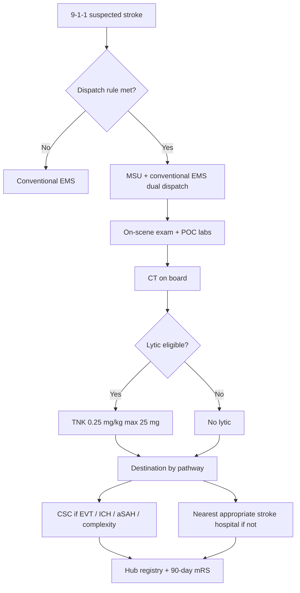

# Mobile Stroke Units

## Opening

A mobile stroke unit is a specialized ambulance with a CT scanner, point-of-care laboratory capability, a stroke-capable clinician (in person or by video), and a protocol that can diagnose and treat eligible patients before they reach an emergency department door. The 2026 AHA/ASA Guideline for the Early Management of Patients With Acute Ischemic Stroke endorses mobile stroke units on the strength of randomized evidence — notably BEST-MSU in the United States and B_PROUD in Berlin — that MSU care increases thrombolysis, shortens onset-to-treatment time, raises golden-hour treatment rates, and improves 90-day function in lytic-eligible patients, without a safety signal for symptomatic hemorrhage or mimic treatment that would offset the benefit.

That endorsement is not a mandate to buy a truck. It is a mandate to take the question seriously. The Medical Director of an academic Comprehensive Stroke Center should be able to explain, in one sitting, whether an MSU would add treatment that the current EMS-and-telestroke system cannot deliver, what staffing and dispatch design would preserve the trial effect, where patients would go after on-board treatment, how data and research would run, and how the unit would sit beside EMS and the telestroke network rather than beside them as a competitor.

This chapter is a decision and operations manual. It covers when an academic CSC should consider an MSU, staffing, dispatch, CT, pharmacy, destination, data, research, and cost/benefit principles. It does not invent a return-on-investment number. Anyone who quotes a universal payback period for an MSU is selling something.

## Why This Matters

Minutes before the door are the minutes most hospitals cannot see. Target: Stroke has compressed door-to-needle time inside the building. Onset-to-door time is an EMS, geography, and public-recognition problem. An MSU attacks a slice of that pre-door interval by bringing CT and the lytic to the patient. BEST-MSU and B_PROUD showed that the slice is large enough, in the systems studied, to change 90-day disability for thrombolysis-eligible patients. Meta-analytic work has associated MSU care with more treatment inside 60 minutes of onset. That is the clinical case.

The 2026 guideline's top take-home list leads with this point: MSUs enable rapid identification and treatment of thrombolytic-eligible patients, and when available they are now part of recommended implementation, not a novelty. Secondary analyses and subsequent reviews have been more cautious about endovascular time metrics unless the unit performs CTA and the destination logic is tight. An MSU that improves lytic time and worsens EVT routing is a mixed blessing. Design for both.

Academic CSCs face a second question that community programs do not: is the MSU a clinical service, a research platform, a philanthropy object, or all three. Unclear motive produces an under-staffed truck that is parked for "maintenance" whenever a coordinator is on vacation. Clear motive produces a service with a research protocol running on top of it, not instead of it.

There is also a regional equity case. Neighborhoods and towns with long transport times to a lytic-capable door are the theoretical beneficiaries. An MSU that only cruises the blocks around the flagship hospital during weekday business hours will not meet that case. If the Medical Director cannot point to the census tracts the unit is designed to serve, the unit is a marketing asset.

## Core Framework

### When an academic CSC should consider an MSU

Treat the decision as a go / no-go with documented criteria. Do not start with a vendor demonstration.

| Criterion | Favors go | Favors wait or no-go |
| --- | --- | --- |
| Unmet lytic-eligible population | EMS data show a meaningful number of suspected strokes with long onset-to-door or long scene-to-door times in a reachable catchment | Most lytic-eligible patients already arrive inside a short window; the remaining delay is recognition, not transport |
| EMS partnership | A single or dominant EMS agency will dispatch the MSU under a written agreement | Fragmented EMS, political hostility, or no willingness to change dispatch |
| Telestroke and destination already work | The CSC can already route LVO and hemorrhage; the MSU will plug into that logic | Destination is improvisational; the truck will invent a second system |
| Staffing reality | A sustainable model exists for clinician, CT technologist, and paramedic coverage | The plan depends on volunteer faculty and "the fellow can ride" |
| Imaging and pharmacy | CT quality, radiation safety, and a TNK pathway can be run off-campus | No medical-physics support, no controlled-substance policy for the street |
| Equity case | Deployment covers high-need tracts, nights, and weekends over time | Daytime downtown only |
| Research and data | A registry and, ideally, a trial question are designed before first shift | "We will figure out the paper later" |
| Capital and operating funds | Multi-year operating support is identified, not only the purchase gift | A donated truck with no operating budget |

A no-go is a respectable academic decision. Write it, date it, and revisit when EMS data or guideline implementation guidance change. A half-built MSU is worse than none.

### The operating model

Dual dispatch with conventional EMS is the usual safety model. The MSU is not a replacement for first-arriving paramedics who manage airway and trauma. It is an overlay that adds imaging and treatment.

### Staffing

There is no single correct crew. There is a correct function list.

| Function | Typical ways to fill it | Non-negotiable |
| --- | --- | --- |
| Scene medical leadership | Vascular neurologist or emergency physician on board, or a trained APP / paramedic with immediate video neurologist | A named decision-maker for TNK before the bolus |
| Nursing / advanced practice | Critical-care or ED RN, or an APP | Mixing, administration, post-bolus monitoring |
| CT acquisition | Licensed CT technologist, or a dual-trained clinician where state law and medical physics allow | Image quality and radiation safety |
| EMS operations | Paramedics who own driving, scene safety, and ALS | The truck remains an ambulance under EMS regulation |
| Video backup | Hub neurologist on a dedicated line | Used when the on-board clinician is not a stroke physician |
| Command / dispatch liaison | EMS supervisor | Prevents the unit from becoming a self-dispatching curiosity |

Academic programs over-index on having an attending neurologist in the passenger seat and then discover they cannot staff nights. Design the video-supported model from the first business plan if 24/7 coverage is the goal. The 2026 guideline implementation language accepts specialist expertise in person or by remote consultation.

Fellows may ride for education. Fellows may not be the undocumented prescriber.

### Dispatch

Dispatch is the difference between trial-like benefit and an expensive parked scanner.

- Use a written suspected-stroke dispatch rule tied to the 9-1-1 system, not to individual paramedic enthusiasm.
- Dual-dispatch with the closest ALS unit.
- Define a maximum intercept radius and a cancel rule so the MSU does not drive across the region for a resolved dizzy spell while a nearby lytic-eligible patient waits.
- Include nights and weekends in the planned coverage fraction. Publish that fraction. A unit that runs 08:00–16:00 weekdays should not be described as a 24/7 capability.
- Prenotify the destination from the scene, with treatment already given or explicitly not given.
- Integrate with air medical assets when geography requires it; the MSU is not a helicopter.

### CT, pharmacy, and destination

CT on an MSU is a regulated imaging service. Medical physics, radiation safety, image transfer, and storage in the enterprise PACS are required, not optional academic niceties. Noncontrast CT is the lytic enabler. CTA on board has been associated, in synthesis work cited around the 2026 guideline, with better EVT process metrics than MSU programs that skip vascular imaging. If the academic case for the unit includes EVT, plan CTA, contrast safety, and a read pathway (on-board, teleradiology, or hub neurologist).

Pharmacy on the street is a controlled-substance and sterile-product problem:

- Tenecteplase 0.25 mg/kg, maximum 25 mg, as a single IV push, is the operationally simpler lytic for an MSU and matches the 2026 dose.
- If alteplase is used, the 10% bolus and 60-minute infusion must be executable in a moving vehicle.
- Storage, wasting, discrepancy reporting, and temperature logs follow hospital pharmacy rules, not a tackle box culture.
- Antihypertensives for pre-lytic blood-pressure control, glucose, and reversal agents for the unexpected ICH are part of the kit list, with training.

Destination logic must be written before the first shift:

| On-board finding | Default destination |
| --- | --- |
| Lytic given, no LVO suspected | Nearest appropriate stroke hospital **or** the CSC, per regional plan — pick one rule and teach it |
| Lytic given or not, LVO suspected | EVT-capable center; do not unload at a non-EVT spoke "for a second look" |
| ICH or aSAH | CSC with neurosurgery and neurocritical care |
| Mimic after CT | Local ED unless another emergency dominates |
| Pediatric suspected stroke | The designated pediatric-capable center, not the adult convenience campus |

The mothership-versus-drip-and-ship debate does not disappear because treatment started in a driveway. The MSU should reduce, not multiply, unloading at the wrong hospital.

### Data, research, and cost/benefit principles

An academic MSU that does not capture data is not an academic MSU.

Minimum data: 9-1-1 time, dispatch time, on-scene time, CT time, decision time, bolus time, destination arrival, NIHSS, imaging findings, final diagnosis, sICH, and 90-day mRS. Link to GWTG-Stroke and to the CSC registry so MSU patients are not a side spreadsheet.

Research is a reason to do this at an academic CSC and a reason to staff coordinators. StrokeNet and investigator-initiated questions (imaging on board, EVT routing, ICH diagnosis, implementation science, equity of dispatch) belong in the original protocol. Do not treat enrollment as something that starts after "operations stabilize." Operations never stabilize.

Cost/benefit principles, without invented ROI:

- Capital cost (vehicle, CT, radios, garage) is the smaller conversation. Operating cost (people, maintenance, CT uptime, pharmacy, dispatch) is the conversation that kills programs in year three.
- Benefits accrue as faster lytic treatment, more golden-hour treatment, possible improvement in 90-day function, research output, and regional leadership. They do not accrue as a guaranteed reduction in a specific dollar amount of post-stroke care.
- Philanthropy can buy a truck. Philanthropy rarely funds year-four salaries. Require a multi-year operating commitment before accepting the gift.
- Shared funding with EMS agencies, municipalities, and the health system is more durable than a department-of-neurology hobby.
- Confirm current professional and facility billing rules with counsel. Do not assert that MSU care "pays for itself" from professional fees.
- Compare the MSU proposal against alternative uses of the same operating money: another telestroke spoke, night APP coverage, or Saturday IRF staffing. An honest Medical Director can name the alternative.

!!! tip "Key Actions"
    Pull one year of EMS suspected-stroke times and map them before entertaining a vendor. Write a go / no-go memo against the criteria table. If the answer is go, lock dispatch, destination, and a multi-year operating budget before the chassis is ordered. Choose TNK 0.25 mg/kg as the on-board lytic unless a documented constraint forbids it. Decide CTA-on-board as a yes/no with EVT metrics in mind. Staff a video-supported model if 24/7 is the claim. Build the registry and the 90-day mRS pathway into the first protocol. Sit with EMS leadership until dual dispatch is a signed procedure.

!!! abstract "Metrics Targets"
    Track onset-to-needle and dispatch-to-needle for MSU-treated lytic patients against conventional EMS controls in the same catchment. Internal targets should aim to reproduce the direction of BEST-MSU and B_PROUD: shorter treatment times and a higher proportion treated within 60 minutes of onset. Hold sICH and mimic-treatment rates at or below conventional-care comparators and review every case. Capture 90-day mRS on MSU patients at the same **≥90%** internal standard used for CSTK-02. Publish coverage fraction (hours the unit is in service divided by hours in the year) and the share of those hours that are nights and weekends. If CTA is performed on board, track alert-to-puncture for EVT patients separately so a lytic win is not hiding an EVT loss.

!!! warning "Common Pitfalls"
    Buying the truck with donated capital and no operating plan. Staffing with volunteer faculty who disappear after the press conference. Dispatching from a neurologist's cell phone instead of from 9-1-1. Cruising the campus zip code while the long-transport tracts go uncovered. Unloading every patient at the CSC regardless of need, angering EMS and filling beds. Skipping radiation safety and PACS integration. Running alteplase infusions that interrupt during movement without a practiced workaround. Claiming a dollar ROI. Treating the MSU and telestroke as rival empires. Letting a fellow give TNK on the street without a named attending.

!!! success "Implementation Tips"
    Start as a limited-hour implementation with full data capture, then expand hours against the coverage-fraction metric. Put an EMS leader in the governance chair next to the Medical Director. Practice CT acquisition and TNK mixing in the garage weekly for the first quarter. Use the telestroke platform as the on-board video backbone so credentialing and documentation match the network. Report MSU cases in the same weekly reperfusion conference as ED cases so the unit does not become a sidecar. When philanthropy calls, hand them the operating-budget page first.

## How to Do the Work

### Daily / weekly

If the unit is running, the daily board includes its status: in service, maintenance, or staffed-but-down. Every completed deployment is logged before the crew leaves. Lytic cases enter the same same-week defect review as ED thrombolysis. CT downtime is a patient-safety event, not a facilities ticket that can wait.

Weekly, EMS and stroke leadership review cancel rates, long transits, destination deviations, and any scene-safety issue. Weekly, pharmacy reconciles the kit.

### Monthly / quarterly

Monthly, present MSU times, treatment rates, destinations, sICH, 90-day capture, coverage fraction, and equity of dispatch (which tracts actually received the unit). Monthly, the radiation-safety officer reviews exposures and image rejects.

Quarterly, decide whether hours should expand, contract, or shift toward nights. Quarterly, audit destination compliance. Quarterly, submit or review trial enrollment if the unit is a research platform.

### Annual / multi-year

Annually, repeat the go / no-go logic against new EMS data. A unit that no longer reaches untreated patients should be redesigned or retired. Annually, refresh credentialing, controlled-substance policy, and the destination table against the current guideline.

Multi-year, decide whether a second unit, an expanded radius, or an on-board CTA upgrade is the next dollar. Multi-year, publish outcomes. An academic CSC that runs an MSU and does not contribute data to the field is using regional patients as a private experience. Confirm any future certification language about prehospital programs in the active DSC manual; do not invent a volume requirement for MSU runs.

## Ready-to-Adapt Tools

### Tool A — Go / no-go briefing memo skeleton

1. Problem statement: which patients wait too long today
2. EMS data summary (12 months)
3. Equity map
4. Proposed hours and coverage fraction
5. Staffing model (including video)
6. Dispatch rule and cancel rule
7. Imaging (NCCT ± CTA) and pharmacy
8. Destination table
9. Data and 90-day mRS
10. Research questions
11. Capital and **operating** budget, years 1–4
12. Alternatives the same money could buy
13. Recommendation and review date

### Tool B — On-board lytic checklist

- Identity, last known well, witness phone
- Glucose and blood pressure
- Weight
- Anticoagulant history
- NIHSS by the decision-maker
- NCCT reviewed; hemorrhage excluded
- Eligibility stated aloud
- TNK 0.25 mg/kg, maximum 25 mg, dose calculated independently by two clinicians
- Bolus time recorded
- Post-treatment BP plan
- Destination stated to EMS and to the receiving charge nurse
- Family location

### Tool C — Dispatch rule skeleton

- Include: sudden focal deficit, last known well within the locally chosen window, location inside the intercept radius, unit available
- Exclude: major trauma, airway unsecured that conventional ALS must manage alone, scene unsafe, another MSU already assigned
- Dual dispatch: always
- Cancel: symptoms resolved and exam normal **or** imaging already done at a clinic **or** intercept time exceeds the written maximum
- Night rule: same clinical inclusion; do not add a "judgment" filter that quietly kills rural night runs

### Tool D — MSU RACI

| Decision | CSC Medical Director | EMS medical director | MSU lead clinician | Pharmacy | Dispatch |
| --- | --- | --- | --- | --- | --- |
| Go / no-go and hours | A | C | C | I | I |
| Dispatch inclusion | A | A | C | I | R |
| On-board TNK | A | C | R | C | I |
| Destination | A | C | R | I | I |
| Radiation safety | A | I | C | I | I |
| Registry and research | A | C | R | I | I |

Joint accountability for dispatch is intentional. An MSU that EMS does not own will not be dispatched.

### Tool E — Monthly MSU scorecard fields

- Hours advertised versus hours actually in service
- Night/weekend share of in-service hours
- Dispatches, cancels, completed scenes
- CT performed, CTA performed
- Lytics given; onset-to-needle; dispatch-to-needle
- EVT patients and alert-to-puncture
- ICH/aSAH diagnosed on board
- Destination compliance
- sICH and mimics treated
- 90-day mRS capture
- Tracts served versus tracts intended

### Tool F — Garage drill (30 minutes, weekly in quarter 1)

1. Radio check and video check
2. CT phantom or equivalent quality check
3. TNK dose calculation from a random weight
4. Simulated hemorrhage on CT — destination and BP
5. Simulated LVO — CTA decision and mothership routing
6. Controlled-substance count

## Integration With Other Pillars

The MSU is a prehospital instrument and must be designed with [Prehospital Systems and EMS Partnership](10-prehospital-ems.md), not as a neurology bypass of EMS. On-board treatment must match [Intravenous Thrombolysis Operations](13-iv-thrombolysis.md) and [Hyperacute Pathways](11-hyperacute-pathways.md). Destination for LVO and hemorrhage must match [Endovascular Therapy Program](14-endovascular-therapy.md) and [Hemorrhagic Stroke and Complex Cerebrovascular Programs](21-hemorrhagic-complex.md). Video support must be the same system described in [Telestroke Network Operations](19-telestroke-networks.md).

Data belong in [Quality System and Data Infrastructure](../quality/22-quality-data-infrastructure.md) and [Core Metrics](../quality/23-core-metrics.md). Equity of dispatch belongs in [Equity and Disparities Reduction](../quality/26-equity-disparities.md). Staffing and capital belong in [Organizational Design](../leadership/08-organizational-design.md) and [Financial Stewardship](../strategy/34-financial-stewardship.md). Research belongs in [Clinical Trials, Registries, and Research Operations](../research/29-trials-registries.md). Regional politics belong in [Network Leadership](../strategy/33-network-leadership.md). An MSU that ignores those chapters becomes a photogenic orphan.

## Sources

- 2026 Guideline for the Early Management of Patients With Acute Ischemic Stroke. *Stroke*. 2026;57(8):e316–e436. DOI 10.1161/STR.0000000000000513. MSU endorsement; TNK 0.25 mg/kg max 25 mg; alteplase 0.9 mg/kg max 90 mg; implementation notes on dispatch, specialist expertise in person or remote, and prenotification.
- Grotta JC, et al. Prospective, multicenter, controlled trial of mobile stroke units (BEST-MSU). *N Engl J Med*. 2021;385:971–981.
- Ebinger M, et al. Association between dispatch of mobile stroke units and functional outcomes among patients with acute ischemic stroke in Berlin (B_PROUD). *JAMA*. 2021;325:454–466.
- Mac Grory B, et al. Mobile stroke unit management in patients with acute ischemic stroke: subsequent syntheses and secondary analyses. See 2024 *JAMA Neurology* review and the 2026 guideline supportive text on lytic benefit versus EVT process metrics.
- AHA Get With The Guidelines–Stroke and Target: Stroke public criteria for in-hospital time metrics (do not treat them as MSU-specific awards).
- Joint Commission stroke certification standards (SCS26) and the active DSC manual. Confirm any current language on prehospital programs; do not invent MSU volume requirements.
