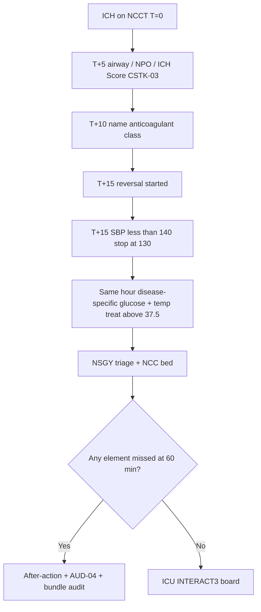
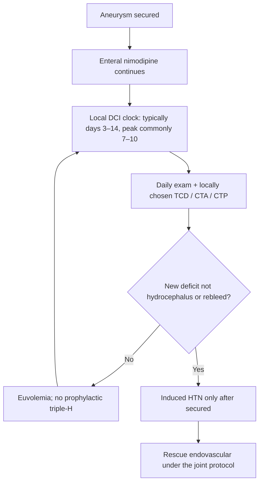
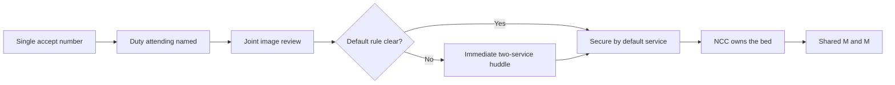

# Hemorrhagic Stroke and Complex Cerebrovascular Programs

## Opening

An academic Comprehensive Stroke Center is judged, internally and externally, on what it does with hemorrhage and with the lesions that cause it. Ischemic reperfusion is necessary. It is also increasingly distributed. What remains concentrated at the CSC is the 24/7 ability to reverse coagulopathy, run an ICH care bundle, secure a ruptured aneurysm, manage delayed cerebral ischemia, and receive ruptured AVM, ruptured dAVF, and moyamoya presenting as stroke. Elective unruptured work lives in [Elective Cerebrovascular Program](46-elective-cerebrovascular.md).

The Medical Director does not have to be the operating neurosurgeon or the neurointerventionalist. The Medical Director does have to build shared governance between neurosurgery and neurointervention, a single hemorrhage pathway that the emergency department cannot freelance, and a quality system that treats CSTK-03, CSTK-04, and CSTK-06 as operational clocks rather than abstractor chores. CSTK-03 is Hunt and Hess for SAH and the ICH Score for ICH, documented before surgery or within 6 hours of arrival if there is no surgery. CSTK-04 is PCC, FFP, or rFVIIa for ICH with arrival INR ≥1.4 — not the entire 2022 reversal SOP. CSTK-06 is first enteral nimodipine within 24 hours of arrival.

Two documents set the clinical floor: the 2022 AHA/ASA ICH guideline and the 2023 AHA/ASA aSAH guideline. A third document, the 2024 AHA/ASA performance and quality measures for spontaneous ICH, converts the 2022 guideline into a measure set the CSC should adopt even where Joint Commission does not yet require every element. A fourth fact changes the certification conversation: the April 2, 2025 Joint Commission announcement reduced the annual aSAH volume criterion to 10 (announced with AHA/ASA; the official manual update followed in January 2026). That change lowers a historic barrier. It does not lower the obligation to secure aneurysms around the clock or to keep a hemorrhage service that is actually used.

## Why This Matters

ICH remains among the deadliest stroke types the CSC will admit this year. Outcome is determined in the first hours by hematoma expansion, airway, blood pressure, and coagulopathy — and then by days of neurocritical care, venous prophylaxis, swallow, and honest goals-of-care work. INTERACT3 showed that a goal-directed bundle (early systolic blood-pressure lowering, glucose control, temperature control, and rapid reversal of warfarin-related anticoagulation) can improve functional outcome. That is an operations trial as much as a physiology trial. A CSC that "knows the guideline" and cannot execute the bundle at 03:00 has not implemented INTERACT3.

Aneurysmal SAH is the original CSC differentiator. The 2023 guideline replaced the 2012 document and remains the operational source for nimodipine, early aneurysm securing, hydrocephalus, and delayed cerebral ischemia. CSTK-06 will reveal whether the first enteral nimodipine dose landed inside 24 hours of arrival. CSTK-03 will reveal whether Hunt and Hess (SAH) or the ICH Score (ICH) was recorded before surgery or within 6 hours if no surgery. Neither measure will reveal whether a night-time rupture waited until the morning elective board. That is a governance measure, and the Medical Director owns it.

The April 2, 2025 volume change will tempt two errors: complacency ("we only need 10") and predatory marketing (declaring CSC readiness on the new floor without 24/7 securing). Use 10 as the certification floor. Use 24/7 securing, bundle reliability, and shared NSGY–NIR governance as the academic standard. Elective unruptured aneurysm, AVM, and dAVF program-building lives in [Elective Cerebrovascular Program](46-elective-cerebrovascular.md). This chapter keeps the ruptured and acute-hemorrhage operating system.

## Core Framework

### One hemorrhage door, two diseases, one command

Do not run separate, conflicting ED pathways for "stroke" and "neurosurgery bleed." The first hour is the same team. Ownership splits after the diagnosis is named, under a written rule. Blood on NCCT plus a venous syndrome (progressive headache, seizure at onset, infarcts that do not respect an arterial territory) is **not** this reversal card — follow the 2024 CVT algorithm in [Special Populations](42-special-populations.md). Do not withhold anticoagulation as folklore because there is blood on the scan.

### ICH: 2022 guideline into an operating bundle

The 2022 ICH guideline is the clinical source. The 2024 ICH performance and quality measure set (Ruff and colleagues) translates that guideline into 15 performance measures and 5 quality measures spanning prehospital through post-hospital care. Adopt the set as a local scorecard. Do not invent unofficial measure IDs. Map each operational step below to the current published measure name when the abstraction vendor is configured.

INTERACT3 trial-bundle targets (confirm in Ma et al., Lancet 2023 appendix); local order-set follows 2022 ICH tables.

| Bundle element | Operational target | Source logic | Owner |
| --- | --- | --- | --- |
| Severity score | **ICH Score** documented prior to surgery, or within **6 hours of arrival** if no surgery (CSTK-03b). Do not substitute WFNS or modified Fisher for the measure. | CSTK-03 (ER-CSTK-03T); 2024 ICH PM domain | ED APP + neurology |
| Airway and swallowing | Protect the airway; no PO until screen | 2022 guideline supportive care | ED + RN |
| Blood pressure | Time-stamped intensive lowering toward SBP <140 mm Hg when the presenting SBP is in the treatable range, with a floor that avoids overshoot (INTERACT3 used <140 with a 130 cessation threshold) | INTERACT2 / INTERACT3; 2022 guideline | ED + NCC |
| Glucose | INTERACT3 bands: 110–140 mg/dL without diabetes, 140–180 with diabetes. AIS uses a different card (140–180 reasonable; 80–130 not recommended). Shared fever number; disease-specific glucose order-sets. | INTERACT3; do not import the AIS glucose card onto ICH | RN-driven protocol |
| Temperature | INTERACT3 trial-bundle: treat to **≤37.5 °C** and find the source. The 2026 AIS guideline also treats temperatures **>37.5 °C**. The number is shared; the order-set is not. Do not put a second AIS cut of 38.0 on the same board. | INTERACT3 trial-bundle; ER-AIS-2026-09 | RN-driven protocol |
| Reversal | Class-specific clinical SOP (below). CSTK-04 is a narrower measure: INR ≥1.4 → PCC, FFP, or rFVIIa. | CSTK-04 (ER-CSTK-04D) plus 2022 ICH SOP; INTERACT3 INR <1.5 within 1 hour for warfarin | Pharmacy + ED |
| VTE | IPC immediately; pharmacologic prophylaxis when the hemorrhage is stable | 2022 guideline; STK-1 still applies | NCC / unit |
| Surgery / MIS | Written indications for cerebellar decompression and for consideration of minimally invasive evacuation | 2022 guideline; evolving trial evidence | NSGY |
| Goals of care | Full intensive care unless and until a structured conversation says otherwise; avoid early nihilism | 2022 guideline | Attending, not the night intern |

Write blood-pressure agents and reversal agents in the order-set. "Lower the BP" is not a bundle. Nicardipine, clevidipine, or the hospital's equivalent, with a start-time field, is a bundle.

### Reversal operations — CSTK-04 is not the whole SOP

**The measure (v2026B).** Denominator: ICH with **INR ≥1.4 at arrival**. Numerator: initiation of **PCC, FFP, or rFVIIa**. That is what the abstractor scores. Andexanet, idarucizumab, and protamine are **not** CSTK-04 numerator agents. Do not teach abstractors that giving andexanet or idarucizumab "is CSTK-04." CSTK-04 does not apply to post-IVT hemorrhagic transformation (that is CSTK-05). Confirm live MIF0289 before each submission cycle.

**The clinical SOP (2022 ICH guideline), run in parallel.** Every ICH patient still gets a class-specific reversal path. Warfarin / VKA with INR ≥1.4 is both the CSTK-04 population and a clinical emergency — give PCC (preferred) plus intravenous vitamin K; FFP or rFVIIa count for the measure if PCC is not the agent used. Dabigatran gets idarucizumab. Factor Xa inhibitors get andexanet where available and indicated, or PCC per the written local protocol. Heparin and LMWH get protamine. Those last three are clinical care. They are not the measure.

| Antithrombotic | Clinical first-line (2022 SOP) | Does this satisfy CSTK-04? | Do not |
| --- | --- | --- | --- |
| Vitamin K antagonist, INR ≥1.4 | Four-factor PCC plus intravenous vitamin K; INR target <1.5 | **Yes** if PCC, FFP, or rFVIIa is started | Lead with FFP if PCC is available; skip vitamin K |
| Dabigatran | Idarucizumab | **No** — not a numerator agent | Tell the abstractor this "is CSTK-04" |
| Factor Xa inhibitor | Andexanet where available and indicated, or PCC per the written local protocol | **Only if PCC** (or FFP / rFVIIa) is the agent started | Debate at the bedside without a default |
| Unfractionated heparin | Protamine | **No** | Partial-dose guesswork |
| LMWH | Protamine per dose-and-time table | **No** | Treat like UFH |
| Antiplatelet only | Usually no routine platelet transfusion | Not in the measure | Transfuse platelets as a reflex |
| Unknown anticoagulant | PCC while the medication list is being confirmed | **Yes** if PCC / FFP / rFVIIa started and arrival INR ≥1.4 | Wait an hour for a perfect history |

Stock the agents where ICH arrives, including the transfer dock. A PCC that lives only in the main pharmacy basement is not a CSTK-04 pathway. Idarucizumab and andexanet belong on the same map because the patient needs them — not because they score the measure.

### aSAH: 2023 guideline into a 24/7 service

| Element | Operational standard | Measure |
| --- | --- | --- |
| Diagnosis | NCCT; LP only when suspicion survives a negative CT and the story is still SAH | Door-to-imaging |
| Severity | **Hunt and Hess** documented prior to surgery, or within **6 hours of arrival** if no surgery (CSTK-03a). WFNS and modified Fisher are clinical adjuncts. They are **not** the measure. Sampling: Yes. | CSTK-03 (ER-CSTK-03T) |
| Blood pressure | Written pre-securing parameters; avoid both extreme hypertension and casual hypotension | Local bundle |
| Nimodipine | First **enteral** dose within **24 hours of arrival** (CSTK-06). **Never give nimodipine intravenously** (U.S. boxed warning). Clinical course commonly 60 mg every 4 hours; hypotension adjustment is local. Continue for the guideline course (classically 21 days). | CSTK-06 (ER-CSTK-06T) |
| Hydrocephalus | EVD indications written; do not delay for the daylight attending if the patient is declining | Time-to-EVD |
| Aneurysm securing | 24/7 capability by clip, coil, or both, with a named decision process | Decision-to-secure clock |
| DCI surveillance | Daily exam plus a locally chosen tool (TCD, CTA, CTP, or a combination). Write the local clock; do not invent TCD velocity cutoffs as a national rule. | Daily DCI huddle |
| Rescue | Induced hypertension for symptomatic DCI **only after the aneurysm is secured**; endovascular rescue under the joint protocol | Rescue log |
| Sodium and volume | Euvolemia. No prophylactic triple-H. Treat hyponatremia as a monitored pathway. | NCC protocol |

ULTRA and related work refined antifibrinolytic timing; they did not retire nimodipine. The 2023 aSAH guideline is the operational source. Do not run a local custom that quietly omits nimodipine because someone read a trial abstract on the antifibrinolytic question.

### Delayed cerebral ischemia — local clock, not a folklore board

Write a DCI product. Do not leave "watch for vasospasm" as a night-nurse proverb.

Surveillance typically runs **days 3–14**, with a peak commonly **days 7–10**. Those numbers are a local clock to write, not a national mandate and not a reason to stop looking on day 2 or day 15. The daily product is a documented neurologic exam plus a locally chosen adjunct — TCD, CTA, CTP, or a combination the NCC and NIR services can actually staff. Do **not** invent TCD velocity or Lindegaard-ratio cutoffs in this handbook.

Induced hypertension is a rescue for symptomatic DCI **after the aneurysm is secured**. Euvolemia is the volume default. Do not run prophylactic triple-H. Nimodipine continues (enteral) through the surveillance window unless a documented hypotension protocol holds or adjusts it. Rescue endovascular therapy (intra-arterial vasodilator, angioplasty, or the joint-protocol equivalent) is a named NIR pathway, not a 02:00 improvisation.

### Volume, 24/7 securing, and the April 2025 change

The April 2, 2025 Joint Commission announcement reduced the annual aSAH volume criterion to 10. Confirm the current E-App / CSC eligibility table in the active DSC manual at each reapplication. Do not quote older "20 aSAH" language as if it were still in force, and do not invent current numeric volume requirements for EVT or IVT.

Ten is a certification floor. It is not a staffing model. A CSC that sees 10 ruptures and cannot secure at 02:00 on a Sunday is not an academic hemorrhage program. Write the 24/7 rule:

- A neurointerventionalist **or** a cerebrovascular neurosurgeon is on call at all times.
- The two services share a single accept call, not two competing pagers.
- If the on-call operator cannot secure the aneurysm, a documented backup (second operator, partner hospital, or transfer-out under a written exception) exists. Transfer-out of a ruptured aneurysm from a CSC should be a reportable event.
- Diagnostic catheter angiography and operating-room / angiography-suite readiness are night-capable, including anesthesia and nursing.
- Unruptured aneurysm and elective AVM / dAVF work does not consume the night team to the point that a rupture waits. Build that elective program in [Chapter 46](46-elective-cerebrovascular.md).

### Elective unruptured aneurysm, AVM, and dAVF — pointer

Ruptured AVM and ruptured dAVF stay on this chapter's hemorrhage pathway. **Elective** unruptured aneurysm, AVM, and dAVF program design lives in [Elective Cerebrovascular Program](46-elective-cerebrovascular.md). Moyamoya or cavernoma that presents as hemorrhage uses the same single accept number. A quarterly brochure is not a program.

### NSGY–NIR shared governance

This is the political core of the chapter. Unshared governance produces two accept calls, two consent videos, two follow-up clinics, and a patient who waits while the services negotiate.

| Decision | Shared rule |
| --- | --- |
| Who accepts the transfer | One number; a single documented attending of record within 10 minutes |
| Who secures the aneurysm | Anatomy-first rule written in advance (for example, wide-neck middle-cerebral aneurysms default to clip discussion; most posterior-circulation defaults to endovascular) with an immediate joint look when the default is unclear |
| Who owns the ICU | Neurocritical care, with both procedural services as consultants |
| Who presents at M&M | Both, on every secure and every rebleed |
| Who owns the elective conference | Rotating chair; equal case submission rights |
| Who hires | Search committees include the other service and the stroke Medical Director |
| Who speaks for the CSC | The Medical Director on system issues; the treating operator on the individual case |

!!! tip "Key Actions"
    Publish a single ICH bundle order-set that includes ICH Score (or Hunt and Hess for SAH) inside the CSTK-03 window, SBP target and agent, disease-specific glucose, temperature treat-above-37.5, and class-specific reversal. Teach abstractors that CSTK-04 is PCC / FFP / rFVIIa for INR ≥1.4 — not andexanet or idarucizumab. Stock reversal agents at the point of arrival. Make first **enteral** nimodipine within 24 hours a hard-stop; never give it IV. Write the DCI clock (typically days 3–14) and the no-prophylactic-triple-H rule. Create one accept number for ruptured aneurysms with a 10-minute attending-of-record rule. Point elective unruptured / AVM / dAVF work at [Chapter 46](46-elective-cerebrovascular.md). Adopt the 2024 ICH performance-measure domains onto the local scorecard. Brief the executive team on the April 2, 2025 aSAH volume change without using it as an excuse to thin the service.

!!! abstract "Metrics Targets"
    CSTK-03: Hunt and Hess (SAH) or ICH Score (ICH) before surgery or within **6 hours of arrival** if no surgery — internal target **≥95%**. CSTK-04: PCC, FFP, or rFVIIa started for arrival INR **≥1.4** — internal target **≥90%**, with a process timer from CT to first numerator agent. Do not score andexanet or idarucizumab as CSTK-04. CSTK-06: first enteral nimodipine within **24 hours of arrival** — internal target **≥95%**. INTERACT3-style bundle reliability: all applicable elements completed on **≥80%** of ICH arrivals as a build target, then raise it. Decision-to-secure for ruptured aneurysms: define a local clock (commonly inside 24 hours) and review every outlier. Transfer-out of a ruptured aneurysm from the CSC: target zero except under the written backup exception. DCI: daily exam documented on **100%** of aSAH patients through the local days 3–14 clock; rescue log complete. Elective conference completion is a Chapter 46 metric.

!!! warning "Common Pitfalls"
    Separate ED pathways that delay reversal while "neurosurgery is on the way." Teaching abstractors that andexanet or idarucizumab "is CSTK-04." Scoring WFNS or modified Fisher as CSTK-03. Giving nimodipine intravenously. Missing the 24-hour arrival clock because "we were waiting for the NG tube." PCC sitting in a locked central pharmacy. Declaring the ICH "nonsurvivable" before the bundle and a structured conversation. Dropping nimodipine for hypotension without a local dose-adjustment protocol. Inventing a TCD velocity cutoff as a national rule. Running prophylactic triple-H. Induced hypertension before the aneurysm is secured. Two pagers for one rupture. Elective cases crowding the night team. Using the April 2025 reduction to 10 as a reason to stop recruiting cerebrovascular surgeons. Ignoring the 2024 ICH measure set because "we already submit CSTK." Allowing antiplatelet-associated ICH to trigger automatic platelet transfusion. Putting two different fever numbers on one board.

!!! success "Implementation Tips"
    Launch the ICH bundle as a 90-day PDSA in the ED and NCC, not as a 40-page protocol. Pair pharmacy with the ED nurse manager on reversal-stock locations. Sit NSGY and NIR in the same M&M for six months before rewriting the service line — shared cases change politics faster than shared org charts. Put the DCI clock on the NCC board the morning after securing. When CSTK-04 fails, walk the minutes from CT to a **numerator** agent and check the arrival INR, not the abstraction slogan. Tell executives that 10 is the floor and 24/7 securing is the product. Send elective program design to Chapter 46 so this chapter stays a hemorrhage operating system.

## How to Do the Work

### Daily / weekly

Every ICH and aSAH admission appears on the morning board with bundle status: Hunt and Hess or ICH Score inside the CSTK-03 window, BP trajectory, CSTK-04 numerator agent if INR ≥1.4, class-specific SOP if another anticoagulant, first enteral nimodipine time, securing plan, DCI watch list. The Medical Director or associate scans that board the way they scan the EVT list.

Daily, pharmacy confirms reversal-agent stock at the ED and the transfer dock. Daily, the aSAH list includes first-dose clock (24 hours from arrival), subsequent nimodipine administration times, and any held doses.

Weekly, a joint NSGY–NIR–NCC huddle reviews every unsecured aneurysm, every rebleed, every EVD infection signal, and every ICH surgical decision. Weekly, the stroke coordinator reviews CSTK-03, CSTK-04, and CSTK-06 fallouts while the chart is still alive.

### Monthly / quarterly

Monthly, the hemorrhage scorecard goes to monthly quality and to the NSGY–NIR joint committee: CSTK-03/04/06 (instruments and clocks as specified), bundle reliability, diagnosis-to-numerator-agent time, decision-to-secure time, rebleeds, DCI-related infarcts, EVD infections, and 90-day mRS for ICH and aSAH. Invite the ED director. Most reversal delays start in the first 20 minutes.

Quarterly, audit ten ICH charts against the 2024 ICH performance-measure domains, not only against CSTK. Quarterly, audit clip-versus-coil decisions against the written default table. Quarterly, send elective unruptured / AVM / dAVF conference compliance to the Chapter 46 owner. Quarterly, tabletop a Sunday-night rupture with both operators "already in a case."

### Annual / multi-year

Annually, reapply using the current E-App table. State the April 2, 2025 aSAH volume change accurately and confirm the live number. Annually, reassess 24/7 depth: how often the backup operator was called, how often securing waited for daylight, how often a case left the CSC.

Multi-year, recruit so that aneurysm securing and complex cerebrovascular surgery do not depend on one person. Multi-year, decide which complex programs are real (staffed, conferenced, reported) and which are brochure language to retire. Multi-year, attach the hemorrhage service to StrokeNet and investigator-initiated ICH and aSAH trials so the academic CSC contributes evidence rather than only consuming it. Confirm any additional numeric volume expectations in the active DSC manual; historical figures used in older summaries are not current law.

## Ready-to-Adapt Tools

### Tool A — ICH first-hour checklist

- Time of last known well and time of CT diagnosis
- ICH Score entered prior to surgery or within 6 hours of arrival — CSTK-03b
- Airway plan; head-of-bed; no PO
- SBP target and agent started; next BP in 5 minutes
- ICH glucose protocol activated (not the AIS 140–180 card)
- Temperature recorded; treat if >37.5 °C (shared number; ICH order-set)
- Anticoagulant class named; arrival INR recorded
- If INR ≥1.4: PCC, FFP, or rFVIIa **started** — that is CSTK-04
- Class-specific SOP in parallel (idarucizumab / andexanet or PCC / protamine) — not the measure
- Repeat INR / specific labs timed
- NSGY notified; NCC bed requested
- Family located; early nihilism deferred
- Vascular imaging decision (CTA/CTV or catheter) documented

### Tool B — aSAH securing clock (SOP skeleton)

1. Diagnosis time (CT or LP).
2. Hunt and Hess entered prior to surgery or within 6 hours of arrival (CSTK-03a). WFNS / modified Fisher are adjuncts.
3. First **enteral** nimodipine within 24 hours of arrival (CSTK-06). Never IV.
4. Single accept attending named within 10 minutes.
5. Vascular imaging completed or scheduled immediately.
6. Clip-versus-coil default applied or huddle called.
7. Suite or OR hold placed.
8. Secure time recorded.
9. If not secured inside the local clock, the exception is written and reviewed the next weekday.
10. Post-secure DCI plan posted on the NCC board: local days 3–14 clock, daily exam, locally chosen TCD/CTA/CTP, euvolemia, no prophylactic triple-H, induced HTN only after secured, rescue endovascular under the joint protocol.

### Tool C — Reversal stock map

| Location | Agents | Check cadence | Owner |
| --- | --- | --- | --- |
| ED resus | PCC, vitamin K, idarucizumab, andexanet or documented alternative, protamine | Every shift | ED pharmacist |
| Transfer dock / helipad refrigerator | PCC, vitamin K | Daily | Transfer-center RN + pharmacy |
| NCC | Full set | Daily | NCC pharmacist |
| Main pharmacy backup | Full set plus extras | Per pharmacy policy | Pharmacy director |

A hole in PCC / FFP / rFVIIa is a CSTK-04 defect waiting to happen. A hole in idarucizumab, andexanet, or protamine is a clinical defect. Score them separately.

### Tool D — Weekly cerebrovascular conference agenda

1. Every ruptured aneurysm, ruptured AVM, and hemorrhagic dAVF from the past week (15)
2. DCI watch list and rescue log (5)
3. Elective unruptured / AVM / dAVF cases — route the conference product to [Chapter 46](46-elective-cerebrovascular.md); hard-stop if no minutes (5)
4. Moyamoya or cavernous cases that presented as hemorrhage (5)
5. Trial screening (5)
6. Decisions, owners, dates (5)

### Tool E — NSGY–NIR RACI

| Decision | Stroke Medical Director | Cerebrovascular NSGY lead | NIR lead | NCC lead | ED lead |
| --- | --- | --- | --- | --- | --- |
| ICH bundle content | A | C | I | R | R |
| Reversal stock | A | I | I | C | R |
| aSAH securing defaults | A | R | R | C | I |
| Night backup rule | A | R | R | C | I |
| Single accept number | A | R | R | C | C |
| Complex-lesion conference | A | R | R | C | I |
| CSTK-03/04/06 reliability | A | C | C | C | C |

Joint R on securing defaults is intentional. If only one service "owns" the table, the other service will ignore it.

### Tool F — Quarterly hemorrhage M&M packet

- All in-hospital rebleeds
- All CSTK-04 misses (INR ≥1.4 and no PCC / FFP / rFVIIa)
- All class-specific SOP misses scored separately (idarucizumab, andexanet, protamine)
- All nimodipine misses (no enteral dose inside 24 hours of arrival, or any IV dose)
- All DCI-surveillance gaps and rescue-log gaps
- All securing-clock outliers
- All transfer-outs of ruptured aneurysms
- All ICH patients labeled comfort-care in the first 12 hours (review for nihilism)
- All EVD infections
- All elective complex cases treated without conference minutes

## Integration With Other Pillars

Hemorrhage care starts in [Prehospital Systems](10-prehospital-ems.md) and [Hyperacute Pathways](11-hyperacute-pathways.md) and lives in [Neurocritical Care Integration](15-neurocritical-care.md). Reversal and the ICH bundle must be identical in the ED, the unit, and the ICU. [Inpatient Stroke Unit Operations](16-inpatient-stroke-unit.md) and [Rehabilitation and Post-Acute Continuum](18-rehabilitation-continuum.md) must include ICH and aSAH rather than treating them as neurosurgery-only patients. [Telestroke Network Operations](19-telestroke-networks.md) and [Mobile Stroke Units](20-mobile-stroke-units.md) need the same reversal and destination rules. Elective unruptured aneurysm, AVM, and dAVF program operations live in [Elective Cerebrovascular Program](46-elective-cerebrovascular.md).

CSTK measurement lives in [Core Metrics](../quality/23-core-metrics.md). Survey language lives in [Certification Readiness](../quality/25-certification-readiness.md). Shared service-line politics live in [Governance Architecture](../leadership/07-governance-architecture.md) and [Culture of Excellence](../leadership/09-culture-of-excellence.md). Complex-lesion research and device governance live in [Clinical Trials, Registries, and Research Operations](../research/29-trials-registries.md) and [Innovation, AI, and Decision-Support Governance](../research/31-innovation-ai.md). Volume strategy after the April 2025 change lives in [Strategy, Growth, Volume, and Complexity](../strategy/32-strategy-growth.md). Do not let marketing use the new floor of 10 to advertise a capability the night team cannot deliver.

## Sources

- Greenberg SM, et al. 2022 Guideline for the Management of Patients With Spontaneous Intracerebral Hemorrhage. *Stroke*. 2022. DOI 10.1161/STR.0000000000000407.
- Hoh BL, et al. 2023 Guideline for the Management of Patients With Aneurysmal Subarachnoid Hemorrhage. *Stroke*. 2023;54:e314–e370. DOI 10.1161/STR.0000000000000436. Replaces the 2012 aSAH guideline.
- Ruff IM, et al. 2024 AHA/ASA Performance and Quality Measures for Spontaneous Intracerebral Hemorrhage. *Stroke*. 2024;55:e199–e230. DOI 10.1161/STR.0000000000000464. Fifteen performance measures and five quality measures based on the 2022 ICH guideline.
- Ma L, et al. The third Intensive Care Bundle with Blood Pressure Reduction in Acute Cerebral Haemorrhage Trial (INTERACT3). *Lancet*. 2023. Bundle: SBP <140 mm Hg, glucose bands as above, temperature ≤37.5 °C, warfarin reversal to INR <1.5 within 1 hour.
- Anderson CS, et al. Rapid blood-pressure lowering in patients with acute intracerebral hemorrhage (INTERACT2). *N Engl J Med*. 2013;368:2355–2365.
- Specifications Manual for Joint Commission National Quality Measures, CSTK v2026B (posted 02/06/2026; 3Q–4Q 2026 discharges). CSTK-03 (MIF0288): Hunt and Hess for SAH (03a); ICH Score for ICH (03b); prior to surgical intervention or within 6 hours of arrival if no surgery; WFNS and modified Fisher are not the measure; sampling yes. CSTK-04 (MIF0289): denominator ICH with INR ≥1.4 at arrival; numerator PCC, FFP, or rFVIIa. CSTK-06 (MIF0293): first nimodipine within 24 hours of arrival. CSTK-07 is not in the current set.
- FDA boxed warning: nimodipine is not for intravenous administration. Enteral only.
- 2023 aSAH guideline supportive text on delayed cerebral ischemia: surveillance, euvolemia, induced hypertension after the aneurysm is secured, no prophylactic triple-H as a standing bundle. Local TCD/CTA/CTP choice; do not invent velocity cutoffs from this handbook.
- Joint Commission Online, April 2, 2025: annual aSAH volume criterion for CSC certification reduced from 20 to 10 (announced with AHA/ASA; official manual update January 2026). Confirm the live E-App / DSC table at each application.
- Joint Commission 2026 Stroke Certification Standards (SCS26) and the active DSC manual. Confirm current numeric volume requirements for other procedures; do not invent them.
- Alberts MJ, et al. Recommendations for comprehensive stroke centers. *Stroke*. 2005. Foundational CSC expectations for neurosurgery and interventional capability; not a substitute for current Joint Commission standards.
