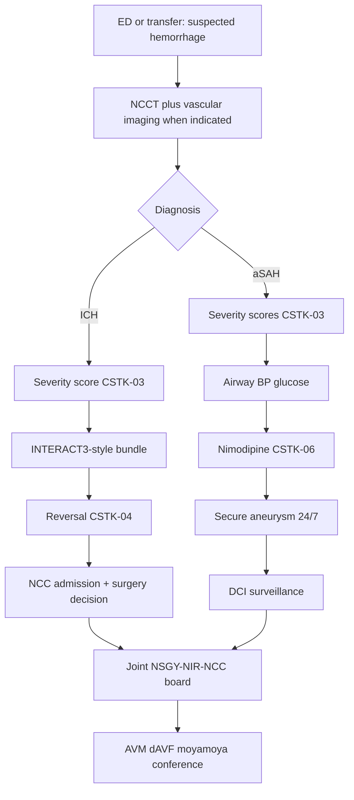
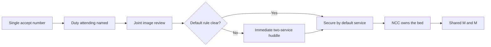

# Hemorrhagic Stroke and Complex Cerebrovascular Programs

## Opening

An academic Comprehensive Stroke Center is judged, internally and externally, on what it does with hemorrhage and with the lesions that cause it. Ischemic reperfusion is necessary. It is also increasingly distributed. What remains concentrated at the CSC is the 24/7 ability to reverse coagulopathy, run an ICH care bundle, secure a ruptured aneurysm, manage delayed cerebral ischemia, and treat the uncommon vascular lesions — arteriovenous malformation, dural arteriovenous fistula, moyamoya — that community hospitals will never staff.

The Medical Director does not have to be the operating neurosurgeon or the neurointerventionalist. The Medical Director does have to build shared governance between neurosurgery and neurointervention, a single hemorrhage pathway that the emergency department cannot freelance, and a quality system that treats CSTK-03 (severity measurement for SAH and ICH), CSTK-04 (procoagulant reversal for ICH), and CSTK-06 (nimodipine for aSAH) as operational clocks rather than abstractor chores.

Two documents set the clinical floor: the 2022 AHA/ASA ICH guideline and the 2023 AHA/ASA aSAH guideline. A third document, the 2024 AHA/ASA performance and quality measures for spontaneous ICH, converts the 2022 guideline into a measure set the CSC should adopt even where Joint Commission does not yet require every element. A fourth fact changes the certification conversation: the April 2, 2025 Joint Commission announcement reduced the annual aSAH volume criterion to 10 (announced with AHA/ASA; the official manual update followed in January 2026). That change lowers a historic barrier. It does not lower the obligation to secure aneurysms around the clock or to keep a hemorrhage service that is actually used.

## Why This Matters

ICH remains among the deadliest stroke types the CSC will admit this year. Outcome is determined in the first hours by hematoma expansion, airway, blood pressure, and coagulopathy — and then by days of neurocritical care, venous prophylaxis, swallow, and honest goals-of-care work. INTERACT3 showed that a goal-directed bundle (early systolic blood-pressure lowering, glucose control, temperature control, and rapid reversal of warfarin-related anticoagulation) can improve functional outcome. That is an operations trial as much as a physiology trial. A CSC that "knows the guideline" and cannot execute the bundle at 03:00 has not implemented INTERACT3.

Aneurysmal SAH is the original CSC differentiator. The 2023 guideline replaced the 2012 document and remains the operational source for nimodipine, early aneurysm securing, hydrocephalus, and delayed cerebral ischemia. CSTK-06 will reveal whether nimodipine is actually administered. CSTK-03 will reveal whether anyone scored the patient. Neither measure will reveal whether a night-time rupture waited until the morning elective board. That is a governance measure, and the Medical Director owns it.

The April 2, 2025 volume change will tempt two errors. The first is complacency: "we only need 10" as an excuse to let the aneurysm service thin out. The second is predatory marketing: declaring CSC readiness on the basis of the new floor without 24/7 securing, without neurocritical care, and without a reversal pathway. Use 10 as the certification floor. Use 24/7 securing, bundle reliability, and shared NSGY–NIR governance as the academic standard.

Complex cerebrovascular disease — AVM, dural fistula, moyamoya, cavernous malformation with repetitive hemorrhage, and the rare vasculopathies — is how an academic CSC remains a referral destination after ischemic thrombectomy has commoditized. These programs require a multidisciplinary conference, a prospective registry, and a call schedule that does not depend on one famous operator. They are not a side clinic. They are part of the CSC's reason to exist.

## Core Framework

### One hemorrhage door, two diseases, one command

Do not run separate, conflicting ED pathways for "stroke" and "neurosurgery bleed." The first hour is the same team. Ownership splits after the diagnosis is named, under a written rule.

### ICH: 2022 guideline into an operating bundle

The 2022 ICH guideline is the clinical source. The 2024 ICH performance and quality measure set (Ruff and colleagues) translates that guideline into 15 performance measures and 5 quality measures spanning prehospital through post-hospital care. Adopt the set as a local scorecard. Do not invent unofficial measure IDs. Map each operational step below to the current published measure name when the abstraction vendor is configured.

| Bundle element | Operational target | Source logic | Owner |
| --- | --- | --- | --- |
| Severity score | ICH score (or an equivalent the hospital standardizes) documented early | CSTK-03; 2024 ICH PM domain | ED APP + neurology |
| Airway and swallowing | Protect the airway; no PO until screen | 2022 guideline supportive care | ED + RN |
| Blood pressure | Time-stamped intensive lowering toward SBP <140 mm Hg when the presenting SBP is in the treatable range, with a floor that avoids overshoot (INTERACT3 used <140 with a 130 cessation threshold) | INTERACT2 / INTERACT3; 2022 guideline | ED + NCC |
| Glucose | Protocolized control; INTERACT3 used 6.1–7.8 mmol/L (110–140 mg/dL) without diabetes and 7.8–10.0 mmol/L (140–180 mg/dL) with diabetes | INTERACT3; do not import AIS intensive-insulin thinking | RN-driven protocol |
| Temperature | Treat to ≤37.5 °C and find the source | INTERACT3; 2022 guideline | RN-driven protocol |
| Reversal | Agent chosen by anticoagulant class; clock starts at diagnosis | CSTK-04; INTERACT3 INR <1.5 within 1 hour for warfarin | Pharmacy + ED |
| VTE | IPC immediately; pharmacologic prophylaxis when the hemorrhage is stable | 2022 guideline; STK-1 still applies | NCC / unit |
| Surgery / MIS | Written indications for cerebellar decompression and for consideration of minimally invasive evacuation | 2022 guideline; evolving trial evidence | NSGY |
| Goals of care | Full intensive care unless and until a structured conversation says otherwise; avoid early nihilism | 2022 guideline | Attending, not the night intern |

Write blood-pressure agents and reversal agents in the order-set. "Lower the BP" is not a bundle. Nicardipine, clevidipine, or the hospital's equivalent, with a start-time field, is a bundle.

### Reversal operations (CSTK-04)

CSTK-04 measures initiation of a procoagulant reversal agent for ICH. Build a class-specific pathway so initiation is fast and correct.

| Antithrombotic | First-line reversal (operational default) | Parallel actions | Do not |
| --- | --- | --- | --- |
| Vitamin K antagonist | Four-factor PCC plus intravenous vitamin K; INR target <1.5 | Hold warfarin; repeat INR | Lead with FFP if PCC is available |
| Dabigatran | Idarucizumab | Time of last dose; consider charcoal if hyperacute ingestion | Guess that PCC is equivalent |
| Factor Xa inhibitor | Andexanet where available and indicated, or PCC per the written local protocol | Time of last dose | Debate at the bedside without a default |
| Unfractionated heparin | Protamine | Stop the infusion | Partial-dose guesswork |
| LMWH | Protamine per dose-and-time table | Record last injection time | Treat like UFH |
| Antiplatelet only | Usually no routine platelet transfusion | Discuss only in the operating patient per guideline nuance | Transfuse platelets as a reflex |
| Unknown anticoagulant | PCC while the medication list is being confirmed | Call the pharmacy and the family | Wait an hour for a perfect history |

Stock the agents where ICH arrives, including the transfer dock. A reversal agent that lives only in the main pharmacy basement is not a CSTK-04 pathway.

### aSAH: 2023 guideline into a 24/7 service

| Element | Operational standard | Measure |
| --- | --- | --- |
| Diagnosis | NCCT; LP only when suspicion survives a negative CT and the story is still SAH | Door-to-imaging |
| Severity | Hunt and Hess or WFNS, plus a radiographic grade (modified Fisher) | CSTK-03 |
| Blood pressure | Written pre-securing parameters; avoid both extreme hypertension and casual hypotension | Local bundle |
| Nimodipine | Enteral nimodipine as standard; 60 mg every 4 hours is the historical and still-typical regimen, adjusted for hypotension; continue for the guideline course (classically 21 days) | CSTK-06 |
| Hydrocephalus | EVD indications written; do not delay for the daylight attending if the patient is declining | Time-to-EVD |
| Aneurysm securing | 24/7 capability by clip, coil, or both, with a named decision process | Decision-to-secure clock |
| DCI surveillance | Clinical plus a locally chosen tool (TCD, CTA, perfusion, or a combination) | Daily DCI huddle |
| Rescue | Induced hypertension for symptomatic DCI after the aneurysm is secure; endovascular rescue under the joint protocol | Rescue log |
| Sodium and volume | Avoid hypovolemia; treat hyponatremia as a monitored pathway | NCC protocol |

ULTRA and related work refined antifibrinolytic timing; they did not retire nimodipine. The 2023 aSAH guideline is the operational source. Do not run a local custom that quietly omits nimodipine because someone read a trial abstract on the antifibrinolytic question.

### Volume, 24/7 securing, and the April 2025 change

The April 2, 2025 Joint Commission announcement reduced the annual aSAH volume criterion to 10. Confirm the current E-App / CSC eligibility table in the active DSC manual at each reapplication. Do not quote older "20 aSAH" language as if it were still in force, and do not invent current numeric volume requirements for EVT or IVT.

Ten is a certification floor. It is not a staffing model. A CSC that sees 10 ruptures and cannot secure at 02:00 on a Sunday is not an academic hemorrhage program. Write the 24/7 rule:

- A neurointerventionalist **or** a cerebrovascular neurosurgeon is on call at all times.
- The two services share a single accept call, not two competing pagers.
- If the on-call operator cannot secure the aneurysm, a documented backup (second operator, partner hospital, or transfer-out under a written exception) exists. Transfer-out of a ruptured aneurysm from a CSC should be a reportable event.
- Diagnostic catheter angiography and operating-room / angiography-suite readiness are night-capable, including anesthesia and nursing.
- Unruptured aneurysm and elective AVM work does not consume the night team to the point that a rupture waits.

### AVM, dural fistula, and moyamoya as CSC differentiators

These programs are how the academic CSC remains irreplaceable.

| Program | What "a program" means | Minimum governance |
| --- | --- | --- |
| Brain AVM | Multidisciplinary conference (NSGY, NIR, radiation oncology, neurology); ruptured versus unruptured pathway; prospective registry | Every new AVM on the weekly conference before elective treatment |
| Dural AV fistula | Same conference; cortical-venous drainage treated as an emergency-adjacent lesion | Named NIR ± NSGY pair |
| Moyamoya | Direct and indirect revascularization capability; stroke neurology peri-operative ownership; blood-pressure and volume rules | Joint NSGY–neurology peri-op order-set |
| Cavernous malformation | Surgery criteria for repetitive hemorrhage or aggressive location; genetic counseling when indicated | Conference, not a single-surgeon list |
| Pediatric crossover | A written path to the pediatric hospital or service | Do not improvise on an adult table |

A quarterly brochure and an annual case do not make a moyamoya program. Staffing, conference minutes, and outcomes do.

### NSGY–NIR shared governance

This is the political core of the chapter. Unshared governance produces two accept calls, two consent videos, two follow-up clinics, and a patient who waits while the services negotiate.

| Decision | Shared rule |
| --- | --- |
| Who accepts the transfer | One number; a single documented attending of record within 10 minutes |
| Who secures the aneurysm | Anatomy-first rule written in advance (for example, wide-neck middle-cerebral aneurysms default to clip discussion; most posterior-circulation defaults to endovascular) with an immediate joint look when the default is unclear |
| Who owns the ICU | Neurocritical care, with both procedural services as consultants |
| Who presents at M&M | Both, on every secure and every rebleed |
| Who owns the elective conference | Rotating chair; equal case submission rights |
| Who hires | Search committees include the other service and the stroke Medical Director |
| Who speaks for the CSC | The Medical Director on system issues; the treating operator on the individual case |

!!! tip "Key Actions"
    Publish a single ICH bundle order-set that includes severity score, SBP target and agent, glucose, temperature, and class-specific reversal. Stock reversal agents at the point of arrival. Make nimodipine a hard-stop on every aSAH admission. Create one accept number for ruptured aneurysms with a 10-minute attending-of-record rule. Write the clip-versus-coil default table and the 24/7 backup rule. Put AVM, dAVF, and moyamoya on a standing multidisciplinary conference with minutes. Adopt the 2024 ICH performance-measure domains onto the local scorecard. Brief the executive team on the April 2, 2025 aSAH volume change without using it as an excuse to thin the service.

!!! abstract "Metrics Targets"
    CSTK-03 (severity score for ICH and aSAH): internal target **≥95%** documented within the locally defined early window. CSTK-04 (reversal initiation): internal target **≥90%**, with a process timer from CT diagnosis to first agent. CSTK-06 (nimodipine): internal target **≥95%** of eligible aSAH patients. INTERACT3-style bundle reliability: all applicable elements completed on **≥80%** of ICH arrivals as a build target, then raise it. Decision-to-secure for ruptured aneurysms: define a local clock (commonly inside 24 hours, faster when the patient is unstable or the anatomy is straightforward) and review every outlier. Transfer-out of a ruptured aneurysm from the CSC: target zero except under the written backup exception. Conference completion: **100%** of elective AVM, dAVF, and moyamoya cases before treatment.

!!! warning "Common Pitfalls"
    Separate ED pathways that delay reversal while "neurosurgery is on the way." PCC sitting in a locked central pharmacy. Declaring the ICH "nonsurvivable" before the bundle and a structured conversation. Dropping nimodipine for hypotension without a dose-adjustment protocol. Two pagers for one rupture. Elective aneurysm cases crowding the night team. Using the April 2025 reduction to 10 as a reason to stop recruiting cerebrovascular surgeons. Building an AVM clinic around one operator with no conference and no radiation-oncology partner. Ignoring the 2024 ICH measure set because "we already submit CSTK." Allowing antiplatelet-associated ICH to trigger automatic platelet transfusion.

!!! success "Implementation Tips"
    Launch the ICH bundle as a 90-day PDSA in the ED and NCC, not as a 40-page protocol. Pair pharmacy with the ED nurse manager on reversal-stock locations. Sit NSGY and NIR in the same M&M for six months before rewriting the service line — shared cases change politics faster than shared org charts. Use the weekly cerebrovascular conference as the moyamoya and AVM intake, not as a lecture. When CSTK-04 fails, walk the minutes from CT to drug, not the abstraction definition. Tell executives that 10 is the floor and 24/7 securing is the product.

## How to Do the Work

### Daily / weekly

Every ICH and aSAH admission appears on the morning board with bundle status: score done, BP trajectory, reversal given or not applicable, nimodipine given, securing plan, DCI watch list. The Medical Director or associate scans that board the way they scan the EVT list.

Daily, pharmacy confirms reversal-agent stock at the ED and the transfer dock. Daily, the aSAH list includes nimodipine administration times and any held doses.

Weekly, a joint NSGY–NIR–NCC huddle reviews every unsecured aneurysm, every rebleed, every EVD infection signal, and every ICH surgical decision. Weekly, the stroke coordinator reviews CSTK-03, CSTK-04, and CSTK-06 fallouts while the chart is still alive.

### Monthly / quarterly

Monthly, the hemorrhage scorecard goes to stroke operations and to the NSGY–NIR joint committee: CSTK-03/04/06, bundle reliability, diagnosis-to-reversal time, decision-to-secure time, rebleeds, DCI-related infarcts, EVD infections, and 90-day mRS for ICH and aSAH. Invite the ED director. Most reversal delays start in the first 20 minutes.

Quarterly, audit ten ICH charts against the 2024 ICH performance-measure domains, not only against CSTK. Quarterly, audit clip-versus-coil decisions against the written default table. Quarterly, review elective AVM / dAVF / moyamoya conference compliance and outcomes. Quarterly, tabletop a Sunday-night rupture with both operators "already in a case."

### Annual / multi-year

Annually, reapply using the current E-App table. State the April 2, 2025 aSAH volume change accurately and confirm the live number. Annually, reassess 24/7 depth: how often the backup operator was called, how often securing waited for daylight, how often a case left the CSC.

Multi-year, recruit so that aneurysm securing and complex cerebrovascular surgery do not depend on one person. Multi-year, decide which complex programs are real (staffed, conferenced, reported) and which are brochure language to retire. Multi-year, attach the hemorrhage service to StrokeNet and investigator-initiated ICH and aSAH trials so the academic CSC contributes evidence rather than only consuming it. Confirm any additional numeric volume expectations in the active DSC manual; historical figures used in older summaries are not current law.

## Ready-to-Adapt Tools

### Tool A — ICH first-hour checklist

- Time of last known well and time of CT diagnosis
- ICH score (or local equivalent) entered — CSTK-03
- Airway plan; head-of-bed; no PO
- SBP target and agent started; next BP in 5 minutes
- Glucose protocol activated
- Temperature recorded; treat if >37.5 °C
- Anticoagulant class named
- Reversal agent ordered and **started** — CSTK-04
- Repeat INR / specific labs timed
- NSGY notified; NCC bed requested
- Family located; early nihilism deferred
- Vascular imaging decision (CTA/CTV or catheter) documented

### Tool B — aSAH securing clock (SOP skeleton)

1. Diagnosis time (CT or LP).
2. Severity scores entered (CSTK-03).
3. Nimodipine ordered (CSTK-06) unless a documented contraindication.
4. Single accept attending named within 10 minutes.
5. Vascular imaging completed or scheduled immediately.
6. Clip-versus-coil default applied or huddle called.
7. Suite or OR hold placed.
8. Secure time recorded.
9. If not secured inside the local clock, the exception is written and reviewed the next weekday.
10. Post-secure DCI plan posted on the NCC board.

### Tool C — Reversal stock map

| Location | Agents | Check cadence | Owner |
| --- | --- | --- | --- |
| ED resus | PCC, vitamin K, idarucizumab, andexanet or documented alternative, protamine | Every shift | ED pharmacist |
| Transfer dock / helipad refrigerator | PCC, vitamin K | Daily | Transfer-center RN + pharmacy |
| NCC | Full set | Daily | NCC pharmacist |
| Main pharmacy backup | Full set plus extras | Per pharmacy policy | Pharmacy director |

A hole on this map is a CSTK-04 defect waiting to happen.

### Tool D — Weekly cerebrovascular conference agenda

1. Every new AVM, dAVF, moyamoya, and complex aneurysm (15–20 minutes)
2. Every ruptured aneurysm secured in the past week, with anatomy and choice (10)
3. Pending electives that lack a documented conference note — hard stop (5)
4. Radiation-oncology coordination (5)
5. Trial screening (5)
6. Decisions, owners, dates (5)

### Tool E — NSGY–NIR RACI

| Decision | Stroke Medical Director | Cerebrovascular NSGY lead | NIR lead | NCC lead | ED lead |
| --- | --- | --- | --- | --- | --- |
| ICH bundle content | A | C | I | R | R |
| Reversal stock | A | I | I | C | R |
| aSAH securing defaults | A | R | R | C | I |
| Night backup rule | A | R | R | C | I |
| Single accept number | A | R | R | C | C |
| Complex-lesion conference | A | R | R | C | I |
| CSTK-03/04/06 reliability | A | C | C | C | C |

Joint R on securing defaults is intentional. If only one service "owns" the table, the other service will ignore it.

### Tool F — Quarterly hemorrhage M&M packet

- All in-hospital rebleeds
- All CSTK-04 misses
- All nimodipine misses
- All securing-clock outliers
- All transfer-outs of ruptured aneurysms
- All ICH patients labeled comfort-care in the first 12 hours (review for nihilism)
- All EVD infections
- All elective complex cases treated without conference minutes

## Integration With Other Pillars

Hemorrhage care starts in [Prehospital Systems](10-prehospital-ems.md) and [Hyperacute Pathways](11-hyperacute-pathways.md) and lives in [Neurocritical Care Integration](15-neurocritical-care.md). Reversal and the ICH bundle must be identical in the ED, the unit, and the ICU. [Inpatient Stroke Unit Operations](16-inpatient-stroke-unit.md) and [Rehabilitation and Post-Acute Continuum](18-rehabilitation-continuum.md) must include ICH and aSAH rather than treating them as neurosurgery-only patients. [Telestroke Network Operations](19-telestroke-networks.md) and [Mobile Stroke Units](20-mobile-stroke-units.md) need the same reversal and destination rules.

CSTK measurement lives in [Core Metrics](../quality/23-core-metrics.md). Survey language lives in [Certification Readiness](../quality/25-certification-readiness.md). Shared service-line politics live in [Governance Architecture](../leadership/07-governance-architecture.md) and [Culture of Excellence](../leadership/09-culture-of-excellence.md). Complex-lesion research and device governance live in [Clinical Trials, Registries, and Research Operations](../research/29-trials-registries.md) and [Innovation, AI, and Decision-Support Governance](../research/31-innovation-ai.md). Volume strategy after the April 2025 change lives in [Strategy, Growth, Volume, and Complexity](../strategy/32-strategy-growth.md). Do not let marketing use the new floor of 10 to advertise a capability the night team cannot deliver.

## Sources

- Greenberg SM, et al. 2022 Guideline for the Management of Patients With Spontaneous Intracerebral Hemorrhage. *Stroke*. 2022. DOI 10.1161/STR.0000000000000407.
- Hoh BL, et al. 2023 Guideline for the Management of Patients With Aneurysmal Subarachnoid Hemorrhage. *Stroke*. 2023;54:e314–e370. DOI 10.1161/STR.0000000000000436. Replaces the 2012 aSAH guideline.
- Ruff IM, et al. 2024 AHA/ASA Performance and Quality Measures for Spontaneous Intracerebral Hemorrhage. *Stroke*. 2024;55:e199–e230. DOI 10.1161/STR.0000000000000464. Fifteen performance measures and five quality measures based on the 2022 ICH guideline.
- Ma L, et al. The third Intensive Care Bundle with Blood Pressure Reduction in Acute Cerebral Haemorrhage Trial (INTERACT3). *Lancet*. 2023. Bundle: SBP <140 mm Hg, glucose bands as above, temperature ≤37.5 °C, warfarin reversal to INR <1.5 within 1 hour.
- Anderson CS, et al. Rapid blood-pressure lowering in patients with acute intracerebral hemorrhage (INTERACT2). *N Engl J Med*. 2013;368:2355–2365.
- Specifications Manual for Joint Commission National Quality Measures, CSTK v2026B (posted 02/06/2026; 3Q–4Q 2026 discharges): CSTK-03 severity measurement for SAH and ICH; CSTK-04 procoagulant reversal for ICH; CSTK-06 nimodipine treatment. CSTK-07 is not in the current set.
- Joint Commission Online, April 2, 2025: annual aSAH volume criterion for CSC certification reduced from 20 to 10 (announced with AHA/ASA; official manual update January 2026). Confirm the live E-App / DSC table at each application.
- Joint Commission 2026 Stroke Certification Standards (SCS26) and the active DSC manual. Confirm current numeric volume requirements for other procedures; do not invent them.
- Alberts MJ, et al. Recommendations for comprehensive stroke centers. *Stroke*. 2005. Foundational CSC expectations for neurosurgery and interventional capability; not a substitute for current Joint Commission standards.
