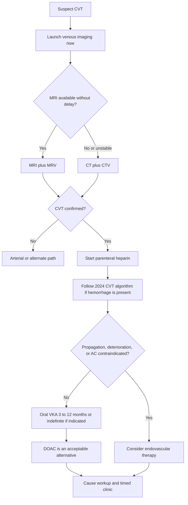
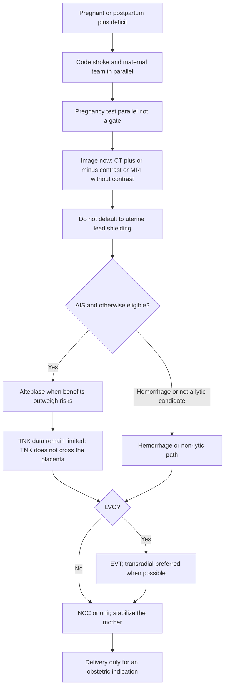
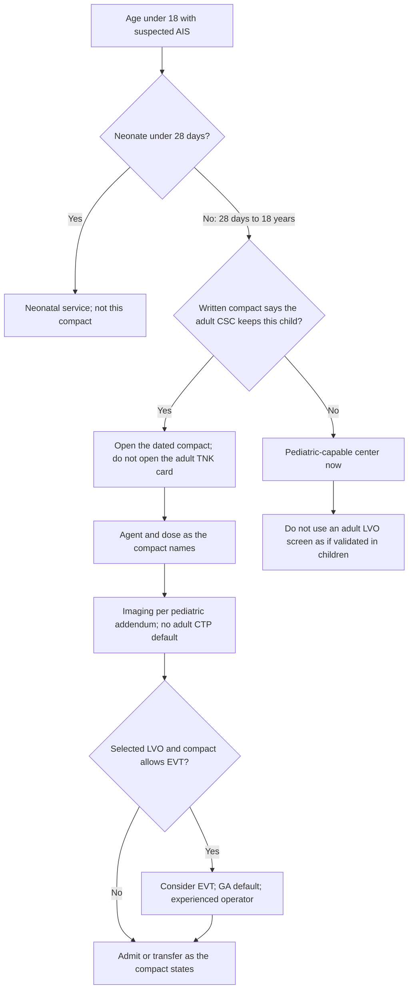

# Special Populations: CVT, Maternal Stroke, and Pediatric Receiving

## Opening

An academic Comprehensive Stroke Center is built for adult ischemic and hemorrhagic volume. That is not an excuse to improvise when the patient is a young adult with venous thrombosis, a pregnant or postpartum woman with a deficit, or a child who lands in an adult emergency department. These events are uncommon on any single night and common enough, across a year of regional intake, that the Medical Director must publish a product for each: a cerebral venous thrombosis (CVT) pathway, a maternal stroke compact, and a pediatric receiving compact. Folklore at 03:00 is not a product.

This chapter is operational, not a children's-hospital handbook and not an MFM textbook. Pregnancy does not convert the code-stroke clock into an obstetric conference. Age under 18 does not convert the adult ready-room into a pediatric protocol. CVT is not a forced GWTG ischemic or CSTK reperfusion row. Floor documents: the 2024 AHA CVT statement (Saposnik and colleagues), the 2026 AHA maternal-stroke statement (Miller and colleagues), and the 2026 AIS guideline's first pediatric recommendations — which, on an adult campus, become a receiving compact. LVAD/ECMO and sickle cell appear only as dated compact items. Do not invent exchange thresholds, TCD cutoffs, or a house rule that "MRI is forbidden on ECMO."

Write the three products so a night fellow, an emergency attending, and a transfer-center nurse can run them. Then audit whether they ran.

## Why This Matters

CVT is a small share of all strokes, concentrated in young adults and women of reproductive age. Delay is usually diagnostic: venous imaging is never ordered, anticoagulation is withheld because there is blood on the scan, or the case is parked on medicine until vision or consciousness changes. A CSC that treats CVT as "interesting, rare, call hematology tomorrow" will miss the first 24 hours.

Maternal stroke is a systems failure more often than a dosing failure. Pregnancy should not delay evidence-based treatments, and neuroimaging should never be withheld because of pregnancy. The opposite culture is still common: hold the CTA for a β-hCG, debate lead shielding, wait for MFM before NCCT, or treat stroke as an indication to deliver. Postpartum is a high-risk window — highest early; one cited study reported a 19-fold increase in the first six weeks. Do not write a national pager-until-week-X rule. Write a local compact with MFM that names the window, the clinic handoff, and who is still responsible.

Pediatric AIS on an adult campus is a destination problem. Age 28 days–18 years is the receiving-compact population; neonates are a different service. Do not treat an adult LVO screen as validated in children, auto-apply adult TNK 0.25 mg/kg, or run adult CTP defaults. Destination is a pediatric-capable center unless a written compact says the adult CSC will keep a defined child.

These populations sit on the equity ledger. Young women, pregnant patients, language-discordant families, and children at an adult door vanish on an unstratified DTN tile. Build the pathways here; stratify the misses in [Equity and Disparities Reduction](../quality/26-equity-disparities.md).

## Core Framework

### Three populations, three products

| Population | Product the Medical Director publishes | What it is not | Primary source |
| --- | --- | --- | --- |
| CVT | First-24-hour pathway: venous imaging, anticoagulation algorithm, EVT-escalation rule, cause workup, clinic duration | A GWTG ischemic row, a CSTK-01/STK-4 row, or a "heparin if you feel like it" habit | 2024 AHA CVT statement ([ER-CVT-2024-01](../evidence-register.md)) |
| Pregnant or postpartum stroke | One-page maternal stroke compact plus an activation checklist | An MFM textbook, a reason to withhold imaging, or an automatic delivery order | 2026 AHA maternal-stroke statement ([ER-MAT-2026-01](../evidence-register.md)) |
| Age 28 days–18 years | Pediatric AIS receiving compact / night card | A children's-hospital protocol, an adult TNK card, or an improvised stay | 2026 AIS guideline, first pediatric recommendations ([ER-AIS-2026-07](../evidence-register.md)) |
| LVAD / ECMO | Dated compact with MCS, NCC, and radiology | A stroke-only anticoagulation reversal card | Local device and radiology policy, dated |
| Sickle cell | Dated hematology protocol pointer | A stroke-invented exchange or TCD protocol | Local hematology protocol, dated |

Do not merge these into one order set. Keep one activation grammar (code stroke still launches) and three addenda.

### CVT: diagnose the vein, then anticoagulate on purpose

Suspect CVT when the syndrome is atypical for arterial stroke: progressive headache, seizure at onset, papilledema or visual change, bilateral or hemorrhagic infarcts that do not respect an arterial territory, or unexplained ICH in a young adult. Suspicion is enough to launch venous imaging.

Diagnosis is primarily MRI/MRV or CT/CTV. Choose the stack that can be completed now. CT/CTV is the correct night study when MRI would postpone the decision. Do not send a deteriorating patient to a 06:00 MRV slot to protect a preferred modality.

Mainstream initial treatment is parenteral heparin, then an oral vitamin K antagonist for three to twelve months depending on cause, or indefinitely if thrombophilia or recurrent VTE is the indication. Direct oral anticoagulants appear a safe and effective alternative to VKAs; name the local preferred oral agent so discharge is not a five-attending debate. Endovascular therapies are reserved for thrombus propagation, neurological deterioration despite medical therapy, or contraindications to anticoagulation — not because the MRV looks dramatic.

If there is hemorrhage on the scan, follow the 2024 CVT statement algorithm; do not withhold anticoagulation as folklore because there is blood on the scan. Do not invent an INR target, a heparin nomogram, or a house agent here. Bind the statement algorithm and the hospital heparin protocol into the order set and date-stamp the reconciliation. CVT is not a GWTG ischemic, CSTK-01, or STK-4 row; measure it locally and leave public IDs in [Core Metrics](../quality/23-core-metrics.md) and the [Evidence Register](../evidence-register.md).

Cause workup is a 24-hour start, not a 24-hour finish. Pregnancy and postpartum status, head-and-neck infection, malignancy, known thrombophilia, and provoked versus unprovoked classification belong on the first-day note. Hematology owns hematology questions. The consult is not a reason to delay the first dose of heparin.

### Maternal stroke: treat the mother on the adult clock

A pregnant or postpartum patient with an acute deficit is a code stroke with a parallel maternal team. Mobilize vascular neurology, emergency medicine, MFM/OB, OB anesthesia, and neonatology when needed. One number launches that list. "Call OB and see what they want to do" is a delay dressed as courtesy.

| Rule | Operational meaning | Common violation |
| --- | --- | --- |
| Pregnancy should not delay evidence-based treatments for acute stroke | IVT, EVT, blood-pressure treatment, and hemorrhage reversal run on the adult clocks | Waiting for MFM physical presence before NCCT or bolus |
| Neuroimaging should never be withheld because of pregnancy | CT with or without contrast and MRI without contrast are considered safe; use contrast when benefits outweigh risks | Holding CTA for a pregnancy test or a shielding debate |
| Lead shielding of the gravid uterus is not a CT default | Current guidelines do not recommend it; shielding may increase dose or reduce quality | Tech-driven apron over the uterus as a condition of scanning |
| Pregnancy test is parallel, not a gate | β-hCG is drawn on the way to CT; it does not return the stretcher to the bay | "We cannot inject until the hCG is back" — already forbidden in [Imaging Architecture](12-imaging-architecture.md) |
| Acute stroke alone is not an indication for immediate delivery | Stabilize the mother first; deliver for obstetric indications | "Crash section then we will treat the stroke" |
| Severe hypertension in pregnancy | Persistent SBP ≥160 or DBP ≥110, confirmed within 15 minutes | Treating pregnancy hypertension on an adult ischemic pocket card |
| Chronic hypertension target | <140/90 | Leaving 150s untreated because "she is postpartum" |

United States guidelines support intravenous alteplase in pregnancy when benefits outweigh risks (for example, uterine bleeding against the benefit of treating a disabling deficit). Tenecteplase does not cross the placenta; data on TNK in pregnancy remain limited. If the adult formulary has moved to TNK, write whether the compact uses alteplase in this population, who mixes it, and where that kit lives. Do not invent a pregnancy-specific TNK dose. Do not treat limited TNK data as a reason to withhold all reperfusion.

For EVT, a transradial approach is preferred when possible. That is an access plan for NIR, not a reason to decline a pregnant patient. Anesthesia, fetal monitoring, and positioning run in parallel with access; they do not reset the puncture clock.

Severe hypertension and the chronic target are in the table above — they are not the adult AIS pre-lytic table and not the ICH INTERACT3 table. Put the obstetric agents in the compact so the ED does not import the wrong number. Postpartum risk is highest early (one cited study: 19-fold in the first six weeks). Date a local compact for responsibility after obstetric discharge, clinic capture, and the ED script for postpartum headache. Do not publish a national "pager stays on until week X."

### Pediatric receiving: a compact, not a second CSC

This is an adult academic CSC. The pediatric product is a receiving compact and a night card. Destination is a pediatric-capable center. The adult CSC keeps a child only under a written compact that names age, agent, imaging, EVT posture, and the pediatric partner.

| Compact item | Adult CSC default | Forbidden improvisation |
| --- | --- | --- |
| Age | 28 days through 18 years | Treating a neonate on this card |
| Destination | Pediatric-capable center unless the written compact says stay | Keeping a child because the adult ICU has a bed |
| Field screen | Do not treat an adult LVO screen as validated in children | Routing a child solely on an adult LVO tool |
| IVT agent | Named in the compact. Alteplase 0.9 mg/kg, maximum 90 mg, is the usual *considered* regimen — confirm the compact. | Auto-applying adult TNK 0.25 mg/kg |
| TNK 0.4 mg/kg | Still forbidden | Cardiac-strength or NOR-TEST thinking on a child |
| Imaging | Pediatric addendum; do not apply adult CTP defaults | "We always run CTP" on a 7-year-old |
| EVT | Consider in selected LVO; general anesthesia default; experienced operator | Invented age floors; awake-adult defaults; the on-call operator who does not do children |
| Weight | Measured in kilograms on a stretcher or pediatric scale | Adult estimate cards |

Do not auto-apply adult tenecteplase 0.25 mg/kg. The compact names the agent and the dose. Alteplase 0.9 mg/kg, maximum 90 mg, is the usual regimen *considered* in this age band — confirm it with the pediatric partner and P&T. Tenecteplase 0.4 mg/kg remains forbidden. If the compact is silent, the child transfers. Silence is not permission to invent. EVT, imaging, and field-screen rules are in the table; do not invent an age floor.

EMS and the transfer center need the destination sentence on the regional card ([Systems of Care](../foundations/03-systems-of-care.md)). A child who arrives at the adult door because the card was silent is a network defect.

### LVAD, ECMO, and sickle cell — compact items only

**LVAD / ECMO.** Compact with MCS, NCC, hematology, and radiology. Name who may reverse anticoagulation, who may hold the device-related antithrombotic, and the local device/radiology policy for imaging a patient on support. Do not write "MRI is forbidden on ECMO" as a handbook rule. Local policy decides that, in writing, with a review date.

**Sickle cell.** Point at the local hematology protocol and date the pointer. Do not invent exchange-transfusion thresholds or TCD numbers. Launch code stroke, image without delay, call hematology on the single-call list, and refuse to substitute an adult atherosclerotic pathway.

!!! tip "Key Actions"
    Publish a CVT first-24-hour order set that launches MRI/MRV or CT/CTV, starts parenteral heparin, and points at the 2024 algorithm when hemorrhage is present. Write a one-page maternal compact that names the team, forbids imaging delay, keeps β-hCG parallel, prefers transradial EVT when possible, and states that stroke alone is not a delivery indication. Stock an alteplase path for pregnancy if the adult formulary is TNK. Sign a pediatric receiving compact; post the night card on the ready-room door. Date the LVAD/ECMO and sickle cell pointers. Drill one maternal case and one age-under-18 arrival each quarter.

!!! abstract "Metrics Targets"
    CVT is local, not a CSTK/GWTG row: suspicion-to-venous-imaging inside a locally defined short interval; anticoagulation per the 2024 algorithm, including when hemorrhage is present; EVT only for reserved indications; duration plan at discharge. Maternal: 100% parallel team activation; 0% of CTA or IVT decisions gated on β-hCG; imaging not withheld; door-to-image and door-to-needle compared with a matched adult cohort. Pediatric: 100% of arrivals aged <18 have a documented destination decision; zero adult TNK 0.25 or TNK 0.4 on a child; compact review date current. Public reperfusion IDs remain those in [Core Metrics](../quality/23-core-metrics.md) and the [Evidence Register](../evidence-register.md).

!!! warning "Common Pitfalls"
    Withholding heparin in CVT because the scan shows blood. Parking CVT overnight without venous imaging. Forcing CVT into STK-4 or CSTK-01. Holding CTA or bolus for a pregnancy test. Lead-shielding the gravid uterus as a condition of CT. Treating acute stroke as a reason to deliver. Applying adult TNK 0.25 to a child. Running adult CTP defaults on a pediatric brain. Using an adult LVO screen as if validated in children. Inventing TCD or exchange numbers for sickle cell. Declaring MRI forbidden on ECMO without a dated policy. Writing a pediatric "protocol" the children's hospital never signed.

!!! success "Implementation Tips"
    Build the maternal compact in one room with MFM, OB anesthesia, ED, NIR, and pharmacy — then laminate one page. Keep one alteplase kit locatable after TNK conversion for the pregnancy rule. Put the pediatric night card in the adult dose-card binder, different color, transfer number in 24-point type. Review every CVT on the weekly board for imaging choice and AC timing without pretending it is CSTK-04. Treat a postpartum headache bounce-back as a compact failure. Re-sign the pediatric compact when either hospital changes IVT agent.

## How to Do the Work

### Daily / weekly

Daily, the morning board lists any CVT, any pregnant or postpartum stroke, and any arrival under age 18, even if the child transferred out. The question is whether the compact ran. Pharmacy confirms the pregnancy alteplase path if the adult preferred agent is TNK.

Weekly, review every special-population case while the chart is alive: suspicion-to-venous-imaging and AC-algorithm adherence for CVT; whether β-hCG or shielding delayed a maternal scan or bolus; whether a child received an adult dose, an adult CTP default, or the wrong destination. Hematology and MFM get the list the same week.

### Monthly / quarterly

Monthly, bring the special-population log to monthly quality: counts, delays, compact deviations, and any EVT used for CVT. Invite MFM when there was a maternal case; invite the pediatric liaison and EMS when a child hit the adult door.

Quarterly, tabletop a pregnant LVO at 02:00 and a 10-year-old at adult triage. Audit whether pregnancy tests gated imaging and whether any child received adult TNK 0.25 or TNK 0.4. Re-read the CVT order set against the 2024 statement. Confirm the LVAD/ECMO and sickle cell pointers still match live service policies.

### Annual / multi-year

Annually, re-sign the pediatric receiving compact and refresh the EMS destination sentence. Re-decide the pregnancy IVT agent rule against the current maternal-stroke statement and the adult formulary. Review CVT duration-of-therapy documentation and clinic no-show among women of reproductive age ([Transitions, Secondary Prevention, and Clinic](17-transitions-prevention.md)).

Multi-year, decide whether the CSC will host a CVT clinic with hematology or hand durable anticoagulation to a named partner. Fund maternal-stroke simulation as a standing event. Do not grow a pediatric EVT brochure on a campus that cannot staff an experienced operator or a signed compact.

## Ready-to-Adapt Tools

### Tool A — First-24-hour CVT checklist

- Time suspicion was documented
- Venous imaging completed: MRI/MRV or CT/CTV (circle which; record why)
- Hemorrhage present? If yes, 2024 CVT statement algorithm opened — anticoagulation not withheld as folklore
- Parenteral heparin started, or a written contraindication
- Seizure, vision, and intracranial-pressure concerns named; NCC versus unit decided
- EVT considered only for propagation, deterioration despite medical therapy, or contraindication to anticoagulation
- Hematology notified when needed; heparin not delayed for the consult
- Pregnancy / postpartum, head-and-neck infection, malignancy, known thrombophilia: present / absent / pending
- Oral plan sketched: VKA 3–12 months, indefinite if thrombophilia or recurrent VTE, or DOAC as the compact names
- Clinic appointment and duration owner named
- Not added to STK-4 / CSTK-01 denominators solely because this was CVT

### Tool B — Maternal stroke compact (one page) and activation checklist

**Compact (adapt and sign)**

- **Scope.** Pregnant patients and postpartum patients as defined locally (write the local postpartum window; do not import a fake national week count).
- **Team.** Vascular neurology, emergency medicine, MFM/OB, OB anesthesia, neonatology when needed. One activation launches the list.
- **Clock.** Pregnancy does not delay evidence-based stroke treatment. Stabilize the mother first.
- **Imaging.** Never withhold neuroimaging because of pregnancy. CT with or without contrast and MRI without contrast are considered safe; use contrast when benefits outweigh risks. Do not default to lead shielding of the gravid uterus for CT.
- **Pregnancy test.** Parallel. Not a CTA gate. Not a bolus gate.
- **IVT.** Alteplase when benefits outweigh risks (including uterine-bleeding risk). TNK does not cross the placenta; data on TNK in pregnancy remain limited. Local preferred agent in pregnancy: ________. Alteplase kit location if different from the adult TNK ready-room: ________.
- **EVT.** Treat LVO as LVO. Transradial approach preferred when possible.
- **Delivery.** Acute stroke alone is not an indication for immediate delivery. Obstetric indications remain obstetric.
- **Hypertension.** Severe: persistent SBP ≥160 or DBP ≥110, confirmed within 15 minutes. Chronic target <140/90. Agents per the obstetric hypertension pathway, named here: ________.
- **Disposition.** NCC or unit as the stroke and obstetric services agree. Clinic handoff to vascular neurology plus MFM before discharge.
- **Review date.** ________. Owners: Stroke Medical Director and MFM lead.

**Activation checklist**

- Code stroke launched
- Maternal team launched on the same call
- Gestational age or postpartum day recorded
- Airway, glucose, and pregnancy hypertension clock started
- β-hCG drawn in parallel
- NCCT ± CTA (or MRI without contrast) launched — no shielding debate as a gate
- IVT eligibility assessed on adult indication plus the pregnancy rule above
- NIR alerted for LVO; radial-first preference stated
- Fetal monitoring decided by MFM without delaying the mother
- Delivery not ordered for stroke alone

### Tool C — Pediatric AIS receiving compact / night card

**Night card (post at adult triage, CT, and the ready-room)**

1. Age <28 days → neonatal service. Stop using this card.
2. Age 28 days–18 years → open the signed compact. Default destination is the pediatric-capable center: ________ (phone ________).
3. The adult CSC keeps the child only if the compact explicitly covers this age and this syndrome.
4. Do not apply an adult LVO screen as if it were validated in children.
5. Do not auto-apply adult TNK 0.25 mg/kg. Do not give TNK 0.4 mg/kg.
6. Agent and dose = the compact. Usual *considered* regimen is alteplase 0.9 mg/kg, maximum 90 mg — confirm the compact before mixing.
7. Weight in kilograms, measured.
8. Imaging = pediatric addendum. Do not apply adult CTP defaults.
9. Selected LVO: consider EVT only if the compact allows; general anesthesia default; experienced operator. No invented age floor.
10. If any item is unsigned or unknown → transfer to the pediatric-capable center and treat the gap as a next-weekday compact defect.

### Tool D — Stroke–NCC–hematology–NIR–MFM RACI

| Decision | Stroke Medical Director | NCC | Hematology | NIR | MFM / OB |
| --- | --- | --- | --- | --- | --- |
| CVT imaging default (MRV vs CTV) | A | C | I | C | I |
| CVT anticoagulation algorithm, including hemorrhage | A | R | C | I | C if pregnant |
| CVT EVT escalation | A | C | I | R | I |
| Maternal team activation list | A | C | I | C | R |
| Imaging and contrast in pregnancy | A | C | I | C | C |
| IVT agent rule in pregnancy | A | C | I | I | C |
| EVT access plan (radial preferred) | A | C | I | R | C |
| Delivery versus stabilize-the-mother | C | C | I | I | A |
| Pregnancy hypertension clock | C | C | I | I | A |
| Pediatric compact content and re-sign | A | C | I | C | I |
| Pediatric stay-versus-transfer at night | A | C | I | C | I |
| Who may reverse AC on LVAD/ECMO | A | R | R | I | I |
| Sickle cell protocol pointer | A | C | A | I | I |

A = accountable, R = responsible, C = consulted, I = informed. Joint A on sickle cell: hematology owns the protocol; the Medical Director owns the pointer.

## Integration With Other Pillars

Special-population operations use the same hyperacute grammar as every other code. [Hyperacute Pathways](11-hyperacute-pathways.md) still launches the team. [Imaging Architecture](12-imaging-architecture.md) already forbids using a pregnancy test as a CTA gate and already requires a pediatric imaging addendum. [Intravenous Thrombolysis](13-iv-thrombolysis.md) holds the adult TNK 0.25 / alteplase 0.9 formulary and the TNK 0.4 prohibition. [Endovascular Therapy](14-endovascular-therapy.md) owns puncture clocks and the transradial preference in pregnancy. [Neurocritical Care](15-neurocritical-care.md) owns the bed, the device-supported patient, and the deteriorating CVT. [Hemorrhagic Stroke and Complex Cerebrovascular Programs](21-hemorrhagic-complex.md) owns arterial hemorrhage bundles; CVT with blood on the scan still follows the 2024 CVT algorithm.

Regional destination lives in [Systems of Care and the Regional Hub](../foundations/03-systems-of-care.md). Clinic duration and postpartum capture live in [Transitions, Secondary Prevention, and Clinic](17-transitions-prevention.md). Public measure IDs stay in [Core Metrics](../quality/23-core-metrics.md). Sex, pregnancy, language, and age-at-the-wrong-door misses belong in [Equity and Disparities Reduction](../quality/26-equity-disparities.md). Re-verify numeric claims in the [Evidence Register](../evidence-register.md) before a compact rewrite.

## Sources

- Saposnik G, et al. Diagnosis and Management of Cerebral Venous Thrombosis: A Scientific Statement From the American Heart Association. *Stroke*. 2024;55(3):e77–e90. DOI 10.1161/STR.0000000000000456. See [ER-CVT-2024-01](../evidence-register.md).
- Miller EC, et al. Prevention and Treatment of Maternal Stroke in Pregnancy and Postpartum: A Scientific Statement From the American Heart Association. *Stroke*. 2026;57(4):e127–e145. DOI 10.1161/STR.0000000000000514. See [ER-MAT-2026-01](../evidence-register.md).
- 2026 Guideline for the Early Management of Patients With Acute Ischemic Stroke. *Stroke*. 2026;57(8):e316–e436. DOI 10.1161/STR.0000000000000513. Pediatric receiving: [ER-AIS-2026-07](../evidence-register.md), [ER-PED-2026-01](../evidence-register.md). Adult IVT formulary and TNK 0.4 prohibition: [ER-AIS-2026-02](../evidence-register.md), [ER-AIS-2026-02b](../evidence-register.md).
- Pregnancy testing is parallel, not a CTA or bolus gate: [Imaging Architecture](12-imaging-architecture.md). Public measure IDs: [Evidence Register](../evidence-register.md) and [Core Metrics](../quality/23-core-metrics.md). CVT is not a standard ischemic reperfusion row.
