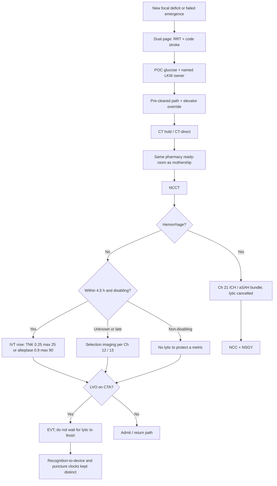

# In-Hospital and Perioperative Stroke

## Opening

Chapter 11 owns the hyperacute clock. This chapter owns the recognition system that either starts that clock or lets it die on a medical floor at 02:00. The Medical Director treats every stroke that begins after admission — floor, ICU, PACU, OR, cath lab, TAVR suite, CEA or CABG recovery, oncology, LVAD or ECMO unit — as a designed product, not as a neurology consult attached to a rapid response.

In-house stroke is not a slower cousin of the mothership code. The 2026 AHA/ASA AIS guideline does not grant extra minutes because the patient already has a wristband. Eligible disabling deficits are treated rapidly within 4.5 hours of last known well, regardless of NIHSS, without delaying for advanced imaging selection. Patients eligible for both intravenous thrombolysis and endovascular therapy receive both, without delaying thrombectomy. The formulary is the same as every other adult code: tenecteplase 0.25 mg/kg IV push, maximum 25 mg, or alteplase 0.9 mg/kg, maximum 90 mg ([ER-AIS-2026-02](../evidence-register.md)). Tenecteplase 0.4 mg/kg is not recommended (Class 3 – No Benefit) ([ER-AIS-2026-02b](../evidence-register.md)). A cardiac-strength card on the floor is a stop-the-line event.

What changes is the starting condition. There is no ambulance prenote and often no family in the bay. The primary service either owns last known well or forces the stroke fellow to reconstruct it. Rapid response either dual-pages code stroke or spends twelve minutes deciding whether this is "really a stroke." An elevator either has an override or becomes the longest corridor in the hospital. Write those rules. Drill them on the units that generate the cases. Review them as a distinct quality denominator.

Do not invent a third hemorrhage pathway because the bleed declared itself in the PACU. In-house ICH and aSAH use the [Chapter 21](21-hemorrhagic-complex.md) bundles. Do not invent LVAD or ECMO reversal doses. Those patients use the dated compact in [Special Populations](42-special-populations.md). This chapter is the recognition machine. [Hyperacute Pathways](11-hyperacute-pathways.md) remains the clock.

## Why This Matters

Academic CSCs miss Target: Stroke on in-house cases for a reason that has nothing to do with the gantry. Recognition is late. The floor nurse waits for the intern. Rapid response treats a hemiparesis as a hypotensive workup. Someone pages vascular neurology as a consult instead of launching the single-call list. Last known well becomes a range, glucose was never checked, and the scanner is two buildings away with no elevator override.

Perioperative stroke adds a second failure: a last-known-well problem created by general anesthesia. A patient who entered the OR neurologically intact and fails to move one arm in the PACU has two times that must both be written down — last seen well under anesthesia, and recognition time. Collapsing those into one "OR stroke time" poisons eligibility and the family conversation. The primary procedural service owns that documentation. The stroke fellow is not a chart archaeologist.

Silent deterioration is the third failure. Not every in-house stroke is a collapse. A slowly worsening NIHSS on a surgical floor, a "confused overnight" note on oncology, a failed swallow that is actually aphasia — these are recognition defects. The surveillance system and the rapid-response interface either catch them or they become next week's case review.

Public awards are not the design spec. Target: Stroke Honor Roll, Elite, Elite Plus, and Advanced Therapy are published **award criteria** ([Core Metrics](../quality/23-core-metrics.md)), not CSC certification floors. In-house DTN and DTD belong in a separate denominator so an ED-only Elite letter cannot hide a floor that cannot reach CT. Publish the local GWTG mapping. Recommend recognition time as the operational start for in-house DTN, write that into the SOP, and do not let the abstractor invent a third definition at month-end.

The biology is the same biology that made NINDS, ECASS III, and HERMES practice-changing. A patient who strokes already inside the building is not a less urgent patient.

## Core Framework

### Dual page from any unit

One suspicion launches two teams. Rapid response owns airway, glucose, blood pressure, and the decision to move the patient. Code stroke owns last known well, NIHSS, eligibility, CT hold, pharmacy ready-room, and the IR parallel page. Neither waits for the other to "finish." Any unit may fire both. No attending countersignature.

| Setting | Who may launch | What does not wait |
| --- | --- | --- |
| Floor | Any RN, APP, or physician | The intern finishing a note |
| ICU / step-down | Bedside RN or covering APP | The intensivist walking over before CT is held |
| PACU | PACU RN or anesthesiologist | Wound checks as a reason to delay the scanner |
| OR | Circulator, anesthesiologist, surgeon, or perfusionist | Closing a non-hemorrhagic field before the page |
| Cath lab / TAVR | Circulator, operator, or anesthesiologist | Skipping the stroke page because IR is already in the room |
| CEA / CABG recovery | Same as PACU or ICU; surgery remains LKW owner | "Wait for the fellow who knows this service" |
| Oncology / BMT | Any staff | A metastasis conference before NCCT |
| LVAD / ECMO | Any staff; open the Chapter 42 compact | A reversal debate at the bedside |

Every row is a dual page (RRT + code stroke). If two codes fire at once, use the written split rule in [Hyperacute Pathways](11-hyperacute-pathways.md). In-house does not automatically lose.

### Clocks, GWTG mapping, and a distinct denominator

Define four times on every in-house case. Do not let them collapse.

| Time | What it is | Who records it | What it is for |
| --- | --- | --- | --- |
| Last known well | Last moment the patient was at neurologic baseline | Named owner on the primary service | IVT 4.5-hour window; late-window logic if needed |
| Last seen well under GA | Last documented purposeful exam before or during anesthesia | Anesthesia + procedural attending | Perioperative eligibility and review — not a substitute for recognition time |
| Recognition time | First moment any staff appreciate a possible stroke | The person who launches the dual page | **Operational start for in-house DTN and in-house DTD** |
| Original hospital arrival | The admission door time | Registration / EHR | CSTK-09 and some vendor fields — often useless as a management clock for a day-3 floor stroke |

**Recommendation, written into the SOP:** in-house door-to-needle starts at recognition time and stops at the thrombolytic bolus. In-house door-to-device starts at recognition time and stops at first pass with the thrombectomy device. Publish that sentence. Train to it.

**Publish the local GWTG mapping.** Award vendors and CSTK will not accept a hallway definition. GWTG and CSTK-09 still speak the language of arrival. For a patient admitted two days earlier, original arrival is not a management clock. Publish which vendor field the abstractor uses for in-hospital onset, whether the GWTG DTN row includes in-house cases, and how recognition time and last known well are stored.

Keep the clocks honest ([ER-TS-AT-DEF](../evidence-register.md)): in-house DTN = recognition → bolus (own denominator); in-house door-to-device = recognition → first device pass (Advanced Therapy analogue, not a redefined award); CSTK-09 = hospital arrival → skin puncture (not the in-house management clock); CSTK-11 / CSTK-12 remain TICI ≥2B within 120 minutes of arrival and 60 minutes of puncture (arrival is still hospital arrival unless the current manual says otherwise).

Honor Roll (75% DTN ≤60 min), Elite / Phase III (85% DTN ≤60 min), Elite Plus (75% ≤45 and 50% ≤30), and Advanced Therapy (50% door-to-device ≤90 min direct / ≤60 min transfer) are **award criteria** (minimum 6 patients), not certification floors and not an excuse to fold in-house cases into the ED letter. Internal aims may be stricter and must be labeled `internal`. Public tables: [Core Metrics](../quality/23-core-metrics.md).

### Bedside essentials: glucose and a named last-known-well owner

Two tasks happen before the stretcher moves, in parallel with airway:

1. **Point-of-care glucose.** Treat hypoglycemia below 60 mg/dL. Do not cancel the code because the first reading is low — correct it and continue. Persistent hyperglycemia follows the 2026 AIS band (140–180 mg/dL remains reasonable; intensive 80–130 is not recommended). Treat marked hyperglycemia, commonly above 180 mg/dL. The glucometer is not a reason to skip CT.
2. **A named last-known-well owner.** The primary service — attending, APP, or unit charge — records last known well as a clock time, names the witness, and signs the field. The stroke fellow does not hunt the chart. If the service cannot produce a time in two minutes, it records the best bounded range and who is still calling the family. A blank LKW at the gantry is a primary-service defect.

NIHSS is obtained at the bedside or on the way to CT. CSTK-01 still requires NIHSS before recanalization (or within 12 hours if none). A floor code that reaches the suite without a score is a launch-process defect.

### Transport: pre-cleared path and elevator override

Design the physical path from every high-risk unit to the CT table the way Chapter 11 designs the ambulance-door path.

| Element | Rule | Common failure |
| --- | --- | --- |
| Path | One pre-cleared route per building; walked quarterly | "Whatever elevator the transporter likes" |
| Elevator | Named car, override key or command-center procedure, tested on nights | Override that only day supervisors know |
| Escort | Transporter **plus** a nurse; no waiting for "an RN who knows the floor" | Sent with a float who has never done a code stroke |
| CT hold | Same hold as a prenotified ED stroke | ED charge treating floor codes as optional |
| Destination | CT-direct if the airway is stable | A full ICU workup in the room first |

Write the conflict rule: if the held scanner is claimed by a simultaneous ED code, the ED attending and the Medical Director delegate apply the prewritten two-code split. Do not invent the split in the elevator.

### Same ready-room, same IVT / EVT rule, no night path

From the CT table onward the in-house code is the mothership code. [Intravenous Thrombolysis](13-iv-thrombolysis.md) owns the ready-room and consent. [Endovascular Therapy](14-endovascular-therapy.md) owns puncture, anesthesia, and TICI. This chapter forbids a second, slower version of either.

- Pharmacy stages the same preferred agent in the same ready-room. No floor-stock mix. No night tube-system path that adds ten minutes.
- Disabling deficit, eligible, last known well within 4.5 hours: treat without waiting for CTP or MRI. Non-disabling deficit is not lysed to protect a metric ([Transitions](17-transitions-prevention.md)).
- LVO: puncture without waiting for the lytic to finish. Anesthesia follows the signed Chapter 14 model — not re-debated because the patient just left an OR.
- Night and weekend teams run the same page list, ready-room, and IR parallel rule. A slower night path is a program defect.
- Weight is stretcher-scaled or estimated by a named person. Do not walk the patient to a clinic scale.

### Floor surveillance, RRT interface, silent deterioration

Most in-house ischemic strokes will declare on a floor or in an ICU, not in a hybrid room. Build a surveillance system that can see a deficit before it is a collapse.

| Surveillance element | Operational standard | Failure mode |
| --- | --- | --- |
| Neurocheck cadence | Written by unit and risk (post-CEA, TAVR, IVT/EVT, ICH); hard-stop missed checks | q4h checks that are "patient sleeping" |
| RRT trigger | New focal deficit, unexplained change in consciousness, or failed swallow that may be aphasia → dual page | Sepsis bundle first; neurology consult 20 minutes later |
| Silent deterioration | Night charge reviews every "confused" or "weak" note before dawn | Waiting for morning rounds to name a stroke |
| Language access | Interpreter now, including video | Missing aphasia on a language-discordant floor |
| Post-procedure watches | CEA, CAS, TAVR, CABG, IR: stroke-specific check, not Aldrete alone | Generic PACU score after carotid surgery |
| Oncology / BMT | Dual page first; metastasis and seizure stay on the differential after the scan | Tumor board before NCCT |

RRT competencies include point-of-care glucose, a two-minute LKW script, and the authority to launch code stroke without a physician in the room. If RRT cannot name those three things at 03:00, the interface is a poster, not a system.

### Perioperative and post-anesthesia stroke

Write the perioperative product as its own SOP with the same dual page. The difference is documentation and who may stop the case.

**Who owns last known well after general anesthesia.** Anesthesia and the procedural attending co-own last seen well under GA — the last documented purposeful exam, typically pre-induction. The PACU charge records recognition time when the deficit is first appreciated there. Vascular neurology confirms the pair; it does not invent them.

**Who may activate from the OR.** Circulating RN, anesthesiologist, surgeon, or perfusionist. Do not wait for the attending to finish an anastomosis unless leaving the table would create an uncontrolled airway or hemorrhage. Time-stamp any transport delay for hemostasis or an open chest and review it the same week.

**Recognition time versus last-seen-well-under-GA.** Both are documented. Last-seen-well-under-GA feeds the eligibility window. Recognition time starts the in-house DTN / DTD clocks. A PACU wake-up after a long anesthetic has a wide last-known-well and a precise recognition time. Treating them as one number either withholds a treatment imaging might still support or manufactures a 4.5-hour window that did not exist.

**Unit cards.** Post a one-page card in PACU, each OR control desk, the cath lab, the TAVR / hybrid room, CEA / CABG recovery, and **labor and delivery / postpartum** (tools section): who launches, who owns LKW, where the elevator override lives, same ready-room as the ED. Pregnancy and postpartum IVT follow [Special Populations](42-special-populations.md) and [IV Thrombolysis](13-iv-thrombolysis.md): alteplase may be used when benefits outweigh risks; TNK pregnancy data remain limited; if the house agent is TNK, use the labeled alteplase pregnancy kit. Do not withhold an otherwise-indicated code because the patient is postpartum.

Non-disabling in-house deficits in the 4.5-hour window follow the 2026 fork: **do not lyse**; load **DAPT** unless a documented surgical or bleeding reason forbids it, then write the reason ([Transitions](17-transitions-prevention.md), [TIA Clinic](45-tia-minor-stroke.md)).

Late-window imaging follows [Imaging Architecture](12-imaging-architecture.md). DAWN is 6–24 hours; DEFUSE 3 is 6–16 hours. Do not run a single "6–24 class." Do not delay a still-eligible 4.5-hour case for perfusion maps.

### In-house hemorrhage and device-supported patients

Blood on NCCT cancels the lytic and opens [Hemorrhagic Stroke and Complex Cerebrovascular Programs](21-hemorrhagic-complex.md). There is no PACU-specific ICH bundle and no floor-specific aSAH path.

- ICH: ICH Score (CSTK-03; document before surgery or within 6 hours of **hospital arrival** if no surgery), airway, **class-specific reversal SOP** (2022 ICH — idarucizumab / andexanet or PCC / protamine). **CSTK-04** is a different construct: INR ≥1.4 at arrival and PCC / FFP / rFVIIa only ([ER-CSTK-04D](../evidence-register.md)). Do not tell the abstractor that andexanet "is CSTK-04." Then intensive SBP lowering per the Chapter 21 INTERACT3-style bundle, glucose, temperature treated at >37.5 °C to ≤37.5 °C.
- aSAH: Hunt and Hess (CSTK-03), enteral nimodipine (CSTK-06; never IV), hydrocephalus and securing per Chapter 21. If the measure clock still says "arrival," give nimodipine now and flag the abstractor.
- CSTK-04 does not apply to post-IVT hemorrhagic transformation (CSTK-05).

LVAD, ECMO, and other mechanical circulatory support: dual page, image under the dated local device and radiology policy, and open the [Special Populations](42-special-populations.md) compact for who may hold or reverse a device-related antithrombotic. Do not invent reversal doses or a handbook rule that "MRI is forbidden on ECMO." Local policy, dated, decides imaging on support.

!!! tip "Key Actions"
    Write two SOP pages: floor in-house code and OR/PACU activation. Dual page (RRT + code stroke) from any unit, no attending countersignature. Name a last-known-well owner on the primary service. Glucometer in the RRT bag. Walk the CT path; test elevator override on nights. Same ready-room and same IVT/EVT parallel rule as the mothership — no night variant. Publish the GWTG mapping; recognition time starts in-house DTN in the SOP. Report in-house DTN and DTD as their own denominator. Post PACU, OR, cath-lab, TAVR, and CEA cards. Hemorrhage → Chapter 21. LVAD/ECMO → Chapter 42.

!!! abstract "Metrics Targets"
    Distinct quality denominator: in-house DTN and DTD, split further into floor/ICU vs OR/PACU/cath. Operational clock: recognition → bolus / first device pass; publish the GWTG map. Award criteria live in [Core Metrics](../quality/23-core-metrics.md) — do not recitate Honor Roll / Elite / Advanced Therapy here. Door-to-device ≠ CSTK-09 ([ER-TS-AT-DEF](../evidence-register.md)). CSTK-01 NIHSS before recanalization. Sample `internal` rules: review recognition-to-CT >15 min and in-house DTN >45 min same week; 100% named LKW owner and POC glucose; 100% of OR/PACU cases document both anesthesia times; zero night codes on a different pharmacy path.

!!! warning "Common Pitfalls"
    Paging vascular neurology as a consult instead of dual-paging. Letting the stroke fellow reconstruct last known well. Skipping point-of-care glucose. Waiting for an attending to approve the page. An elevator override no one can find at 03:00. Sending the patient to CT without a nurse. Mixing TNK from a cardiac drawer (0.4 is Class 3 – No Benefit). A slower night pharmacy path. Folding in-house DTN into the ED Elite letter. Using original hospital arrival as the management clock. Collapsing last-seen-well-under-GA into recognition time. Forbidding OR staff from activating. Inventing a PACU ICH bundle (use Chapter 21) or LVAD reversal doses (use Chapter 42).

!!! success "Implementation Tips"
    Build the floor SOP with RRT, a medical-floor charge, pharmacy, and CT — not in a stroke-only meeting. Film one unannounced floor code and one PACU wake-up per quarter. Laminate night role cards. Put the GWTG mapping on the same page as the SOP clock sentence. Walk the elevator path on a night shift and time it. Pre-assign the LKW field to the primary-service attending. When a fellow is first at the bedside, the attending still owns eligibility. If the EHR rapid-response order cannot also launch code stroke, fix the order set this quarter.

## How to Do the Work

### Daily / weekly

Daily huddle (weekday, 10 minutes, same rhythm as Chapter 11): every in-house recognition, dual-page failure, missing LKW owner, missing POC glucose, recognition-to-CT outlier, in-house DTN >45 minutes, door-to-device miss against the Advanced Therapy **award** cuts, and OR/PACU case that documented only one of the two anesthesia times. Confirm elevator override and ready-room stock after any night code.

Weekly operations: reconcile recognition times against EHR timestamps. Review mothership vs transfer vs floor/ICU in-house vs **OR/PACU/cath perioperative** as four denominators (Chapter 11 requires the perioperative split inside in-house). Walk one physical path (rotate units). Same-week review of any in-house case that used a different pharmacy path or waited for an attending to approve the page.

### Monthly / quarterly

Monthly quality: publish the in-house scorecard — recognition-to-CT, in-house DTN distribution (≤30 / ≤45 / ≤60 / >60), recognition-to-device and recognition-to-puncture, night vs day, unit of origin, LKW-owner / POC-glucose / dual-page compliance, CSTK-01 on treated in-house cases. Keep award-criterion percentages on a separate line from `internal` aims. Invite RRT, anesthesia, and the procedural services that generated cases.

Quarterly stroke executive: one announced and one unannounced in-house drill, including an OR/PACU activation and a night elevator override. Audit whether any in-house ICH used a homemade bundle instead of Chapter 21. Re-read the GWTG mapping. Confirm the LVAD/ECMO pointer still matches the Chapter 42 compact.

### Annual / multi-year

Re-map paths when a unit, scanner, or hybrid room moves. Reconfirm the dual-page list reaches a human at night, on holidays, and during mass-notification downtime. Re-sign the OR/PACU SOP with anesthesia and the procedural chiefs. Reset `internal` targets after a year of stable in-house performance; do not retire the huddle because an ED award letter arrived. Recheck Joint Commission CSC capability expectations and the active DSC manual; do not invent volume requirements. Include in-house recognition in fellow and faculty evaluation.

## Ready-to-Adapt Tools

Samples to adapt. Not institutional policy until locally approved.

### Sample SOP skeleton — floor in-house code

**Title:** In-hospital code stroke (floor / ICU / oncology)  
**Owner:** CSC Medical Director  
**Review:** Semiannual  

1. **Recognition.** Any staff: new focal deficit, unexplained change in consciousness, or a failed swallow that may be aphasia. Dual page. No attending pre-approval.
2. **Dual page.** Rapid response + code stroke. Single-call list as in [Hyperacute Pathways](11-hyperacute-pathways.md).
3. **Bedside (parallel).** Airway. POC glucose; treat <60 mg/dL and continue. Primary-service LKW owner names a clock time and a witness. NIHSS. Anticoagulant history. Two IVs if not present.
4. **Transport.** Pre-cleared CT path. Elevator override. Transporter + nurse. CT held. CT-direct if airway stable.
5. **From CT onward.** Identical to the mothership SOP. Same ready-room. IVT per [ER-AIS-2026-02](../evidence-register.md) / [ER-AIS-2026-02b](../evidence-register.md). EVT does not wait for the lytic to finish. Hemorrhage → Chapter 21. LVAD/ECMO → Chapter 42.
6. **Clocks.** Recognition time starts in-house DTN and DTD. LKW recorded separately. Publish the GWTG map. Do not use original hospital arrival as the management start.
7. **Timekeeper.** Named role; records recognition, CT start, bolus, puncture, first device pass.
8. **Quality.** In-house denominator. Same-week review if recognition-to-CT >15 min or DTN >45 min (`internal` samples).

### Sample SOP skeleton — OR / PACU activation

**Title:** Perioperative and post-anesthesia code stroke  
**Owner:** CSC Medical Director with Anesthesia and the procedural chiefs  
**Review:** Semiannual  

1. **Who may activate.** Circulating RN, anesthesiologist, surgeon, perfusionist, or PACU RN. Dual page immediately.
2. **Two times, both required.** Last seen well under GA (last documented purposeful exam). Recognition time (first appreciated deficit). Vascular neurology confirms; it does not invent.
3. **LKW owner.** Anesthesia + procedural attending. PACU charge records recognition time if the deficit is first seen there.
4. **Unsafe to move.** Uncontrolled airway or hemorrhage may delay transport. Time-stamp the delay. Do not delay the page.
5. **Transport.** Same pre-cleared path and elevator override. Anesthesia retains the airway until a documented handoff.
6. **From CT onward.** Same ready-room, same IVT/EVT rule, same night path as the floor SOP. A recent OR is not a reason to default to no-lytic folklore; eligibility follows Chapter 13.
7. **Imaging when last known well is induction.** If the 4.5-hour window is closed, use Chapter 12 / 13 selection imaging. DAWN 6–24 h; DEFUSE 3 6–16 h. Do not delay a still-open 4.5-hour window for perfusion.
8. **Hemorrhage.** Chapter 21. Device-supported patients: Chapter 42. No third bundle.

### Sample night role cards

| Role | Non-negotiables |
| --- | --- |
| House supervisor | Confirms dual page; does not re-triage. Holds the named elevator and CT. Protects a nurse escort. Declares the written two-code split. |
| RRT RN | Glucometer on arrival; treat <60; do not cancel. Two-minute LKW script; name the owner. Launch code stroke if the primary team has not. Stay through CT. |
| Vascular neurology attending | Owns treat / no-treat. Fellow may first-respond; attending closed loop. Refuses a cardiac-strength TNK card. Stays until bolus is in and IR has accepted or declined. |
| Pharmacist | Same ready-room as days. No tube-system-only path. Preferred agent staged; backup per Chapter 13. |
| CT technologist | Holds the scanner on an in-house page as for an ED prenote. No paper-order debate before NCCT. |
| OR circulating RN | Dual page on suspicion. Does not wait for the attending unless the unsafe-to-move rule applies. Records last exam time from anesthesia. |

### Sample unit cards — PACU / OR / cath lab / TAVR / CEA

Post one card. Fill the blanks locally.

| Card | Launch | LKW owner | Times | Path / ready-room |
| --- | --- | --- | --- | --- |
| PACU | PACU RN or anesthesiologist | PACU charge + anesthesia | Recognition + last-seen-well-under-GA | Elevator ______ override ______. ED/CT ready-room. No PACU mix. |
| OR | Circulator, anesthesia, surgeon, perfusion | Anesthesia + procedural attending | Same two times | Same path. Dual page before the field is closed unless unsafe-to-move. |
| Cath lab | Circulator, operator, anesthesia | Operator + anesthesia | Recognition + last neuro exam before sedation | Dual page even if IR is in the room. Stay-in-lab only if written. |
| TAVR / hybrid | Same as cath / OR | Structural attending + anesthesia | Same two times | Same ready-room. Hemorrhage → Ch 21. MCS → Ch 42. |
| CEA / CABG | PACU or ICU RN | Vascular or cardiac attending + anesthesia | Same; last exam before clamp / pump | Stroke-specific watch, not Aldrete alone. |

### Sample RACI — in-house recognition

| Task | Med Dir | Primary service | RRT | Stroke attending | Charge / house supervisor | Pharmacy | IR | Anesthesia |
| --- | --- | --- | --- | --- | --- | --- | --- | --- |
| Dual-page list content | A | C | C | C | R | C | C | C |
| Launch on suspicion | I | R | R | C | R | I | I | R in OR/PACU |
| LKW field | A | R | C | C | I | I | I | R after GA |
| Recognition-time stamp | A | C | R | C | C | I | I | C |
| Elevator / CT path | A | I | C | I | R | I | I | C |
| IVT decision | I | I | I | A/R | I | C | I | C |
| EVT launch | I | I | I | C | I | I | A/R | C |
| In-house denominator + GWTG map | A | I | I | C | I | I | C | I |

A = accountable, R = responsible, C = consulted, I = informed.

### Sample GWTG mapping worksheet (publish and date)

Publish one dated page mapping recognition time, last known well, last-seen-well-under-GA, original hospital arrival, bolus, skin puncture, and first device pass to the local EHR field, the GWTG / vendor field, and any CSTK field. Confirm current GWTG coding instructions. Keep door-to-device distinct from CSTK-09 ([ER-TS-AT-DEF](../evidence-register.md)).

## Integration With Other Pillars

This chapter is the recognition system. [Hyperacute Pathways](11-hyperacute-pathways.md) remains the clock and the two-code split. [Imaging Architecture](12-imaging-architecture.md) decides when CTP or MRI may consume time. [Intravenous Thrombolysis](13-iv-thrombolysis.md) is the ready-room and the 0.25/25 or 0.9/90 formulary (TNK 0.4 prohibited). [Endovascular Therapy](14-endovascular-therapy.md) is puncture and the device-pass clock. [Neurocritical Care](15-neurocritical-care.md) is the receiving bed. [Inpatient Stroke Unit](16-inpatient-stroke-unit.md) is where silent deterioration is caught or missed. [Hemorrhagic Stroke](21-hemorrhagic-complex.md) is the only ICH / aSAH bundle. [Special Populations](42-special-populations.md) is the only LVAD/ECMO compact.

Activation authority sits in [Governance Architecture](../leadership/07-governance-architecture.md) and [Medical Director Role](../leadership/05-medical-director-role.md). The in-house denominator and GWTG map belong on the monthly book in [Core Metrics](../quality/23-core-metrics.md). Floor vs ED and night vs day misses belong in [Equity and Disparities Reduction](../quality/26-equity-disparities.md). An ED award letter with an invisible floor denominator is not elite ([Elite Performance](../strategy/36-elite-performance.md)).

## Sources

- 2026 Guideline for the Early Management of Patients With Acute Ischemic Stroke. *Stroke*. 2026;57(8):e316–e436. DOI 10.1161/STR.0000000000000513. Formulary: [ER-AIS-2026-02](../evidence-register.md) (TNK 0.25 mg/kg max 25 mg **or** alteplase 0.9 mg/kg max 90 mg). TNK 0.4 mg/kg Class 3 – No Benefit: [ER-AIS-2026-02b](../evidence-register.md).
- Door-to-device = arrival (operational in-house start: recognition time) to **first pass with the thrombectomy device**. CSTK-09 = arrival to **skin puncture**. Do not collapse: [ER-TS-AT-DEF](../evidence-register.md).
- [Hyperacute Pathways](11-hyperacute-pathways.md): clock, single-call activation, and the in-house requirements this chapter extends.
- [Intravenous Thrombolysis](13-iv-thrombolysis.md); [Endovascular Therapy](14-endovascular-therapy.md) (DAWN 6–24 h; DEFUSE 3 6–16 h).
- [Hemorrhagic Stroke](21-hemorrhagic-complex.md): the only ICH / aSAH bundles. [Special Populations](42-special-populations.md): LVAD/ECMO compact; no invented reversal doses.
- Target: Stroke Honor Roll / Elite / Elite Plus / Advanced Therapy **award criteria**: [Core Metrics](../quality/23-core-metrics.md). Confirm current GWTG in-hospital coding instructions.
- CSTK v2026B: CSTK-01, CSTK-09, CSTK-11, CSTK-12. STK-4. Confirm current numeric volume tables in the active E-App / DSC manual. Do not invent in-house volume requirements.
- IHI Model for Improvement; high-reliability preoccupation with failure on floor recognition, night elevator override, and OR activation.
