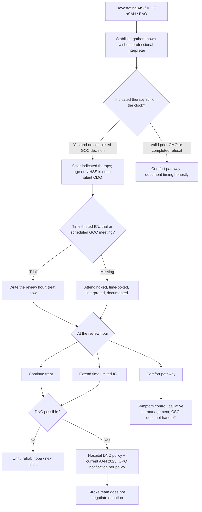

# Goals of Care, Palliative Pathways, and Death by Neurologic Criteria

## Opening

Chapter 15 treats goals of care as a neuro ICU procedure and then points at hospital policy. That is not enough. Large-core reperfusion, basilar-artery occlusion, severe ICH, and high-grade aSAH produce survival families did not picture at 02:00, and they produce death by neurologic criteria often enough that a CSC must own the conversation, the documentation, and the declaration pathway. "Follow hospital policy" is the last sentence of a protocol, not the protocol.

The Medical Director does not sit in every family meeting and does not freelance a brain-death examination. The Medical Director does own four products: a timed goals-of-care standard that cannot cook CSTK exclusions; an early-nihilism audit that puts indicated therapy on the table unless a real conversation has already occurred; a family-meeting and palliative co-management compact that keeps the patient inside the CSC; and a death-by-neurologic-criteria and OPO-notification pathway that implements hospital policy and the current AAN adult statement.

Comfort measures are clinical. They are also a Joint Commission data element. Premature comfort-measures language written on the day of arrival, or the day after, removes an ischemic patient from CSTK-01 and can remove a hemorrhagic patient from CSTK-04. That is a specification fact, not an abstractor trick, and it is not a reason to withhold honest comfort care. It is a reason to time the conversation, name the decision, and refuse age or NIHSS as a silent comfort-measures order.

Goals of care are not the opposite of aggressive care. They are how aggressive care stays honest, how comfort care stays equitable, and how death by neurologic criteria stays a hospital procedure rather than a hallway custom.

## Why This Matters

Devastating stroke is common on a CSC census and uncommon in any single family's life. The first night after a large-core EVT, a basilar occlusion, a high ICH score, or a poor-grade aSAH is a physiologic argument, not a prognosis conference. Hematoma expansion, edema, hydrocephalus, and recanalization change the picture. So does a time-limited ICU trial that the family can actually hear. If the triad does not lead that work, someone else will — usually the most junior person left at the bedside, usually without an interpreter, usually without a review hour.

The 2022 ICH guideline is explicit: a baseline severity score is not the sole basis for limiting life-sustaining treatment, and a do-not-resuscitate order is not the same act as limiting other interventions. The 2026 AIS guideline still expects indicated reperfusion for disabling deficits. Large-core and BAO trial clusters made those offers program rules. None of those documents authorize converting age, a high NIHSS, or a grim first scan into comfort measures without offering the therapy the program otherwise runs. A recipient CSC cannot decline an inbound large-core, BAO, or ICH transfer for nihilism or payor status if it has capacity and the specialized capability ([ER-EMTALA-01](../evidence-register.md)). Goals of care start after the patient is accepted, not as the reason to refuse the ambulance.

CSTK makes the timing visible. CSTK-01 excludes comfort measures documented on the day of or the day after arrival. CSTK-04 uses the same Comfort Measures Only data element; v2026B excluded-population language is CMO documented on the day of or after hospital arrival — confirm the live MIF. CSTK-03 and CSTK-06 share the element. A comfort-measures order written to keep a case out of the denominator is a clinical failure first. Build the exclusion as discrete logic in [Core Metrics](../quality/23-core-metrics.md). Do not teach physicians to write the order so the measure looks clean.

Equity is inside this product. Early comfort-measures designations cluster by language, race and ethnicity, and whether a professional interpreter was in the room ([Equity](../quality/26-equity-disparities.md)). A family used as the only interpreter is not a goals conversation. A treatable LVO with no prior wishes is not a comfort-measures protocol because of age. A completed conversation about known wishes is not "nihilism" because the abstractor wanted the case in CSTK-04.

[Rehabilitation](18-rehabilitation-continuum.md) is the other half of honesty: some patients who look unsalvageable on night one recover function a family can recognize. CSTK-10 will expose programs that withdraw before a time-limited trial and programs that offer false hope after one. Surveyors will ask who led the meeting, when CMO was documented, whether indicated therapy was offered, and what the hospital DNC policy says. Fellows will imitate 03:00. Silence is a policy.

## Core Framework

### Three pathways, one clock

Write three named destinations after a devastating injury. Do not invent a fourth called "we will see."

| Pathway | What it is | What it is not | Who may enter it |
| --- | --- | --- | --- |
| Treat | Indicated reperfusion, reversal, airway, surgery, and the ICU bundle run on the usual clocks | A promise of HERMES-like outcome | Default when therapy is indicated and no completed goals conversation says otherwise |
| Time-limited ICU trial | Treat now; name a review hour; reconvene | An unbounded stay that no one will revisit, or a hidden comfort plan | Large-core EVT, severe ICH, high-grade aSAH, BAO after offer — stated out loud |
| Comfort pathway | Symptom control, family support, no non-beneficial escalation | A DNR order, a bed-clearing PEG cancellation, or a CSTK workaround | After a structured conversation, or when valid prior wishes already refuse intensive care |

The first night default after severe AIS, ICH, or high-grade aSAH is stabilize and gather known wishes. Avoid irreversible non-beneficial procedures that only clear beds. Do not postpone indicated reversal, nimodipine, or reperfusion so that "the family can decide in the morning." Those clocks do not wait for a conference room.

### Timed goals of care versus premature comfort measures

Comfort Measures Only, in Joint Commission language, is medical treatment of a dying person in which the natural dying process is permitted while comfort is assured. It is **not** equivalent to a do-not-resuscitate order. A DNR can exist on a patient who is still receiving reversal, antibiotics, and a time-limited ICU trial. Writing "CMO" when the team meant "no chest compressions" is a documentation defect that changes measure membership and, worse, changes what the night nurse will do.

| Documentation event | CSTK consequence (v2026B; confirm live spec) | Clinical rule |
| --- | --- | --- |
| Physician / APN / PA comfort-measures documentation on day of arrival (Day 0) or day after (Day 1) | CSTK-01 exclusion. Same-day/next-day CMO is the ischemic exclusion the program must treat as clinical, not as an abstractor trick. | Do not write CMO to avoid an NIHSS. Do the NIHSS. Have the conversation. Time the order to the decision. |
| Comfort-measures documentation on day of or after arrival in ICH | CSTK-04 excluded-population language uses this element. Confirm the live MIF0289 processing of CMO values 1 versus 2. CSTK-03 / CSTK-06 share the element. | Do not skip indicated procoagulant reversal because the ICH score is high. Reverse unless a completed conversation has already chosen comfort. |
| DNR / DNAR / AND without comfort-measures language | Not automatically CMO. Abstractors follow inclusion terms in the live data element. | Name the actual limit. Do not let a code-status click become a comfort pathway. |
| Time-limited trial with a review hour, no CMO | Patient remains in the relevant denominators if otherwise eligible. | This is the honest middle path for large-core and severe ICH. |
| CMO on Day 2 or later after a completed trial | Later CMO does not rewrite Day-0 physiology. Still document the conversation. | A delayed honest decision is not a quality failure. A Day-0 CMO used to cook a denominator is. |

The operational test is simple. If the patient would have been offered EVT, reversal, or an ICU trial had they been 20 years younger or had they spoken English, the early comfort-measures order is a defect until a structured conversation proves otherwise. Audit it that way.

### Early nihilism: large-core, BAO, and ICH

Nihilism is not pessimism. Nihilism is using age, NIHSS, hematoma volume, or "they would not want this" as a silent comfort-measures order without offering the therapy the program otherwise runs and without a real goals conversation.

| Population | Offer rule the Medical Director publishes | Forbidden silent stop | Where the script lives |
| --- | --- | --- | --- |
| Large-core AIS | Follow the written large-core program rule. Counsel that this is not a HERMES small-core conversation. State a time-limited ICU trial with a review hour. | Age, "looks devastated," or a single operator veto | [Endovascular Therapy](14-endovascular-therapy.md) large-core script |
| Basilar-artery occlusion | EVT within 24 hours when NIHSS is ≥10 (ATTENTION / BAOCHE). Do not apply DAWN / DEFUSE 3 perfusion maps. Effectiveness is not well established for NIHSS 6–9; write the local rule. GA default. | High NIHSS as automatic comfort care | Same EVT inclusion page; do not invent a mandatory PC-ASPECTS cut here |
| ICH / anticoagulant ICH | Full intensive care, including the 2022 class-specific reversal SOP and the INTERACT-style bundle, unless and until a structured conversation says otherwise. CSTK-04 (INR ≥1.4 → PCC / FFP / rFVIIa) is the measure, not the whole SOP. | ICH score or age as the sole limit on life-sustaining treatment | [Hemorrhagic Stroke](21-hemorrhagic-complex.md); 2022 ICH guideline |
| High-grade aSAH | Score (CSTK-03), nimodipine (CSTK-06), securement plan, then a timed conversation — not the reverse | "Grade V, comfort" before hydrocephalus is treated | Hemorrhagic program + [Neurocritical Care](15-neurocritical-care.md) triad |
| Any of the above, language-discordant | Same offer, professional interpreter in the room before the decision | Family as the only interpreter and the only voice | [Equity](../quality/26-equity-disparities.md) |

The audit question is not "did the family choose comfort?" The audit question is "was indicated therapy offered, in a language the decision-maker could use, by an attending, before comfort measures were written?" If the answer is no, the case is an early-nihilism defect whether or not the abstractor excluded it.

### Family-meeting structure

A goals conversation is a procedure. It has a leader, an interpreter rule, a time box, and a note. Hallway updates are not the procedure.

| Element | Operational default | Failure mode |
| --- | --- | --- |
| Who leads | Stroke or NCC attending per the triad compact. Neurosurgery joins when surgery or an EVD is on the table. | Night intern or unsupervised fellow changing goals ([Fellowship](../education/27-fellowship-gme.md): never unsupervised) |
| Who must be in the room | Attending leader, bedside nurse, professional interpreter when language is not concordant, social work or case management if a decision is expected | Family used as interpreter; attending "available by phone" for a first conversation that will change the pathway |
| Who is invited, not required | Palliative medicine if already co-managing or if symptoms or conflict are predicted; chaplaincy per family request; the fellow as a supervised learner | Palliative invited as a way to leave the meeting |
| Time box | Schedule it. Write a local default (many programs use 30–45 minutes for the first formal meeting) and a hard stop that books the next review rather than improvising a second hour in the hallway. | Drive-by at shift change; unbounded meeting that produces no decision and no next hour |
| Content | Diagnosis in plain language; what has been done; what is still indicated; range of function the team actually sees in this anatomy; the three pathways; a recommendation; a question | Dumping trial names; asking the family to choose a TICI grade; leading with organ donation |
| Documentation | Attendees, language, interpreter identifier, information given, questions, decision or no-decision, next review time, and whether CMO or only code status changed | "Family updated" as the entire note |

Do not combine the first goals meeting with an organ-procurement approach. Do not use the ICH score, ASPECTS, or age as the only sentence in the room. Point at [Rehabilitation](18-rehabilitation-continuum.md) when a time-limited trial is the honest path — hope is a prognosis range, not a slogan.

### Palliative co-management is a parallel service

Palliative medicine is not a handoff out of the CSC. It is a parallel service for symptom control, family support, spiritual care, and meeting skill. The stroke or NCC attending remains the attending of record until a written transition says otherwise. Palliative does not write comfort measures as a favor to the ICU census. Stroke does not consult palliative in order to stop rounding.

Write the trigger list so the consult is early and specific: devastating injury with a planned time-limited trial; anticipated death by neurologic criteria; refractory symptoms; conflict that has survived one attending-to-attending attempt; request from the patient or surrogate. Early involvement is not a comfort-measures order. Late involvement, after the family has already been told "there is nothing more," is a missed procedure.

Ethics consultation sits on a published trigger: intractable triad conflict, surrogate conflict, or a request to limit indicated therapy that the attending believes is inconsistent with known wishes. Ethics is not the first call when the problem is an absent interpreter.

### Death by neurologic criteria

Death by neurologic criteria is a hospital procedure that implements current AAN adult guidance and state law. It is not a Medical Director signature product and it is not a fellow's unsupervised exam.

The current AAN adult statement is the 2023 Pediatric and Adult Brain Death / Death by Neurologic Criteria Consensus Guideline (Greer and colleagues, *Neurology* 2023). Cite it. Do **not** reprint the examination, the apnea test, waiting intervals, or ancillary-test menus in this handbook. Those numbers and steps live in the hospital policy that must be reconciled to that statement and to state law. Confirm hospital policy and state law. Do not invent a national waiting period, an apnea-test threshold, or a legal standard that varies by jurisdiction.

Operational rules the Medical Director does own:

1. The CSC uses the hospital DNC policy. The Medical Director does not freelance a local brain-death exam, a "stroke-center addendum," or a shortened night version.
2. Examiners are credentialed, trained, and competent under that policy and under the 2023 AAN qualifications language. Trainees are directly supervised for the entire evaluation. A fellow-only declaration is a compact violation.
3. Pediatric DNC is a different compact. Do not apply the adult unit's habits to a child. If the campus receives patients younger than 18, the pediatric receiving compact in [Special Populations](42-special-populations.md) must name which policy, which examiners, and which destination apply. Confirm hospital policy and state law.
4. Incomplete examinations, confounders, and posterior-fossa catastrophe are policy problems. Follow the hospital ancillary-testing rule; do not invent a house angiogram pathway here.
5. Examiners who determine DNC do not negotiate organ donation and do not serve the procurement team.

When DNC is possible, say so in the language the hospital policy supports. Do not use "brain death" as a casual synonym for a devastating examination that has not been completed.

### Organ donation

Notify the designated organ-procurement organization per hospital policy. CMS hospital conditions of participation require a working agreement with the OPO and timely notification of deaths and imminent deaths. Confirm the hospital's notification trigger and who places the call. Do not invent a national minute count or a CSC-specific waiting period.

The stroke team notifies. The OPO approaches the family about donation. The stroke team does not negotiate donation, does not preview "they might be a donor" as a goals argument, and does not delay a completed DNC declaration to improve procurement optics. If the family raises donation first, page the OPO and stop improvising.



!!! tip "Key Actions"
    Publish a one-page goals-of-care compact that names the three pathways, the attending who leads the first meeting, the interpreter rule, and the review-hour sentence for every large-core and severe-ICH admission. Build a CSTK comfort-measures documentation card that distinguishes CMO from DNR and captures Day 0 / Day 1 / Day 2+ timing. Audit 100% of comfort-measures orders written on the day of or day after arrival, and 100% of large-core, BAO, and ICH cases in which indicated therapy was not offered. Sign a palliative co-management agreement that keeps stroke or NCC as the attending service. Bind the hospital DNC policy and the 2023 AAN statement; forbid freelance exams. Put OPO notification on the DNC and imminent-death checklist as a hospital-policy step the stroke team does not negotiate.

!!! abstract "Metrics Targets"
    Public IDs remain those in [Core Metrics](../quality/23-core-metrics.md): CSTK-01, CSTK-04, CSTK-03, CSTK-06, CSTK-02 / CSTK-10. Do not create exclusions with premature CMO and do not skip ICH reversal to manufacture one. Internal sample posture: 100% of Day-0/Day-1 CMO charts reviewed the same week; 100% of large-core and BAO "judgment" or "family not here" declines reviewed; interpreter present before any language-discordant goals decision; time-limited-trial review hour written on admission for large-core and severe ICH; DNC and OPO steps 100% per hospital policy. Do not set a target that rewards fewer comfort-measures orders or faster DNC.

!!! warning "Common Pitfalls"
    Using CSTK-01 or CSTK-04 comfort-measures exclusions as a documentation trick. Writing CMO when the order meant DNR. Age or NIHSS as a silent comfort-measures order. Large-core or BAO nihilism without the Chapter 14 script. ICH score used as the sole limit on life-sustaining treatment. Goals meeting led by the most junior person because attendings left. Family as the only interpreter. Combining the first GOC meeting with an organ-donation approach. Consulting palliative in order to stop rounding. Medical Director freelancing a local brain-death exam. Applying the adult DNC habit to a child. Inventing waiting periods or apnea numbers that are not in the hospital policy. Stroke team negotiating donation. Pretending rehabilitation hope is naïve so the trial is never offered.

!!! success "Implementation Tips"
    Co-write the compact in one sitting with NCC, stroke, NSGY, palliative medicine, social work, and the OPO liaison — then laminate one page. Put the CMO card next to the ICH reversal card. Review every Day-0/Day-1 CMO on the weekly ops huddle while the chart is alive. Treat a missing interpreter as a compact failure. Re-sign the compact in the first two weeks after a chief turns over. Walk a night fellow through the hospital DNC policy before the first declaration month. Invite palliative to the triad board as a parallel voice, not as the exit ramp.

## How to Do the Work

### Daily / weekly

Daily, the triad board carries one goals sentence on every ICU stroke and hemorrhage: treat, time-limited trial with a named review hour, or comfort. Confirm indicated reversal, nimodipine, and reperfusion were not postponed for a meeting, and that interpreter need is written. Name any new CMO, any new DNR on a treat-pathway patient, and any possible DNC case at the morning huddle.

Weekly, review every Day-0 or Day-1 CMO chart, every large-core or BAO decline coded as "judgment" or "family not here," every ICH labeled comfort-care in the first 12 hours, and every DNC examination for policy fidelity. Weekly ops owns the list.

### Monthly / quarterly

Monthly quality sees the CMO timing distribution (Day 0 / Day 1 / Day 2+), the nihilism audit denominator (indicated therapy not offered), interpreter-before-decision compliance, time-limited-trial review hours kept versus missed, palliative co-management use, and DNC / OPO policy adherence. Stratify early CMO by language, race and ethnicity, and night versus day ([Equity](../quality/26-equity-disparities.md)).

Quarterly stroke executive hears only the defects that need a compact change, an FTE, or a hospital-policy repair. Quarterly, tabletop a language-discordant large-core arrival and a possible DNC at 03:00. Re-read the hospital DNC policy against the 2023 AAN statement when either document is revised.

### Annual / multi-year

Annually, re-sign the goals and palliative compact. Recheck CSTK CMO logic against the live manual (v2026B for 3Q–4Q 2026; v2027A for 1Q–2Q 2027). Recheck the hospital DNC policy against current AAN adult guidance and current state law. Do not maintain a stroke-authored exam. Renew the OPO agreement through the hospital channel.

Multi-year, decide whether the CSC funds dedicated palliative FTE in the neuro ICU or continues a consult model. Write the choice down. Treat recovery after a time-limited trial as a joint product with [Rehabilitation](18-rehabilitation-continuum.md).

## Ready-to-Adapt Tools

Samples to adapt with NCC, NSGY, palliative medicine, social work, chaplaincy, health-literacy, counsel, and the hospital DNC and OPO owners.

### Sample SOP skeleton — goals-of-care compact

**Title:** Devastating-stroke goals of care  
**Owner:** CSC Medical Director with NCC director  
**Review:** with each AIS / ICH guideline update and each CSTK manual window

1. **Three pathways.** Treat / time-limited ICU trial / comfort. No unnamed fourth path.
2. **Default.** Stabilize and gather known wishes. Offer indicated therapy unless a completed conversation or valid prior CMO already refuses it.
3. **Leader.** Stroke or NCC attending. Fellow may participate; attending is present for any meeting that can change the pathway.
4. **Interpreter.** Professional interpreter before the decision when language is not concordant. Family is not the interpreter.
5. **Time box.** First formal meeting scheduled; local default duration written here: ________. Next review hour booked before the meeting ends.
6. **Documentation.** Use the CMO card. Distinguish CMO from DNR.
7. **Palliative.** Parallel consult on the trigger list. Not a handoff.
8. **DNC / OPO.** Hospital policy. Stroke team notifies; does not negotiate.

### Sample family-meeting agenda (time-boxed)

```
FAMILY MEETING — DEVASTATING STROKE
Date / time ________    Room ________    Duration booked ________
Leader (attending) ________    Service: stroke / NCC / NSGY
Bedside RN ________    SW / CM ________    Palliative ________
Language ________    Interpreter name / ID ________    [ ] not needed
Decision-maker / relationship ________
Known prior wishes / AD / POLST reviewed?  [ ] yes  [ ] no  [ ] unknown

1. Names and roles (2 min)
2. What happened and what has already been done (5 min)
3. What is still indicated, and what a time-limited trial would look like (5 min)
4. Range of function the team actually sees in this anatomy — not a trial acronym (5 min)
5. Recommendation and the three pathways (5 min)
6. Questions (remainder)
7. Decision or no-decision; next review hour ________ (last 3 min)

Decision:  [ ] treat   [ ] time-limited ICU until ________
           [ ] comfort pathway   [ ] no decision; reconvene ________
CMO written?  [ ] no  [ ] yes, date/time ________
DNR / AND only?  [ ] no  [ ] yes — not CMO
Donation discussed by stroke team?  [ ] no (correct)  [ ] yes (defect)
```

### Sample CSTK comfort-measures documentation card

```
CSTK COMFORT-MEASURES DOCUMENTATION CARD
Live Comfort Measures Only data element (v2026B / current window). CMO ≠ DNR.

Patient ________    FIN ________    Arrival date/time ________
Type:  [ ] ischemic   [ ] ICH   [ ] aSAH
Indicated now:  [ ] IVT  [ ] EVT (early / late / large-core / BAO)
  [ ] ICH reversal (CSTK-04)  [ ] nimodipine  [ ] surgery / EVD
  Offered?  [ ] yes  [ ] no — why ________
  Completed GOC before any therapy withheld?  [ ] yes  [ ] no

Earliest physician / APN / PA CMO: date/time ________
  vs arrival:  [ ] Day 0  [ ] Day 1  [ ] Day 2+
  CSTK-01: Day 0 or Day 1 is an exclusion — clinical timing, not a coding goal.
  CSTK-04 / 03 / 06: confirm live MIF processing.

Words actually used in the note: ________
DNR / DNAR / AND also present?  [ ] yes  [ ] no
  If only code status changed, do not label the case CMO.
Leader ________    Interpreter ________
Prior AD / POLST?  [ ] yes  [ ] no  [ ] unknown
Time-limited trial first?  [ ] yes, review hour ________  [ ] no
Equity: language ________    night/weekend [ ]    "family not here" [ ]

Abstractor: do not infer CMO from DNR, a grim sentence, or a cancelled PEG.
```

### Sample early-nihilism audit (100% of listed events)

| Case | Type | Indicated therapy | Offered? | Attending led? | Interpreter? | CMO day | Defect? |
| --- | --- | --- | --- | --- | --- | --- | --- |
|  | Large-core / BAO / ICH / aSAH | EVT / reversal / securement / other | Y / N | Y / N | Y / N / n/a | 0 / 1 / 2+ / none | Y / N |

Review 100% of: Day-0/Day-1 CMO; ICH labeled comfort-care in the first 12 hours; large-core or BAO declines coded "judgment," "family not here," or "goals"; any case in which age or NIHSS is the only documented reason therapy was withheld.

### Sample role card — DNC and OPO

- **Stroke / NCC attending.** Recognizes a possible DNC examination; opens the hospital policy; does not freelance steps; is present for any declaration; leads or assigns the family explanation using hospital-approved language.
- **Examiner.** Credentialed under hospital policy and competent under 2023 AAN qualifications language. Not a member of the procurement team.
- **Fellow.** Supervised for the entire evaluation. Never the sole family meeting that changes goals or declares DNC.
- **CSC Medical Director.** Owns policy reconciliation and audit. Does not write a local exam.
- **Pediatric compact owner.** Different policy, different examiners, different destination. Confirm hospital policy and state law.
- **Hospital OPO liaison / bedside RN as policy names.** Places the notification call. Stroke team does not approach the family about donation.

### Sample RACI — devastating-injury conversation

| Task | Stroke attending | NCC attending | NSGY | Palliative | Med Dir | OPO |
| --- | --- | --- | --- | --- | --- | --- |
| Offer indicated therapy | A/R | C | C | I | C | — |
| Lead first GOC meeting | A or R | A or R | C | C | I | — |
| Write CMO vs DNR | A | R | C | C | I | — |
| Time-limited-trial review | A | R | C | C | I | — |
| DNC examination | C | R | C | I | A (policy) | I |
| OPO notification | C | C | I | I | A (policy) | R |
| Nihilism audit | C | C | I | I | A | — |

A = accountable, R = responsible, C = consulted, I = informed. Stroke versus NCC "A" follows the triad compact in [Neurocritical Care](15-neurocritical-care.md).

## Integration With Other Pillars

This chapter owns the conversation product that [Neurocritical Care](15-neurocritical-care.md) names on the triad board. [Endovascular Therapy](14-endovascular-therapy.md) owns the large-core counseling script and the written offer rule; this chapter owns the nihilism audit when that script is skipped. [Hemorrhagic Stroke](21-hemorrhagic-complex.md) owns the ICH bundle and the instruction to defer early nihilism; this chapter owns the meeting, the CMO card, and the CSTK timing. [Rehabilitation](18-rehabilitation-continuum.md) owns the hope that makes a time-limited trial honest.

[Hyperacute Pathways](11-hyperacute-pathways.md) stop on documented comfort measures, not on a grim first impression. [Inpatient Stroke Unit](16-inpatient-stroke-unit.md) inherits a CMO worklist rule; do not let that rule train the ICU to write CMO early. [Special Populations](42-special-populations.md) owns pediatric DNC as a different compact.

Quality: CMO as discrete logic ([Core Metrics](../quality/23-core-metrics.md); [Quality Data](../quality/22-quality-data-infrastructure.md)). Equity: interpreter-before-decision and stratified early CMO ([Equity](../quality/26-equity-disparities.md)). Education: attending presence for withdrawal and DNC ([Fellowship](../education/27-fellowship-gme.md)). Appropriate comfort care is not an LOS lever ([Financial Stewardship](../strategy/34-financial-stewardship.md)).

## Sources

- 2026 Guideline for the Early Management of Patients With Acute Ischemic Stroke. *Stroke*. 2026;57(8):e316–e436. DOI 10.1161/STR.0000000000000513. Indicated reperfusion for disabling deficits; supportive-care context for ICU trials.
- 2022 AHA/ASA Guideline for the Management of Patients With Spontaneous Intracerebral Hemorrhage. *Stroke*. DOI 10.1161/STR.0000000000000407. Severity scores are not the sole basis for limiting life-sustaining treatment; DNR is distinct from limiting other interventions; avoid early nihilism.
- 2024 AHA/ASA Performance and Quality Measures for Spontaneous ICH.
- 2023 AHA/ASA aSAH Guideline. *Stroke*. 2023;54:e314–e370. DOI 10.1161/STR.0000000000000436.
- Greer DM, Kirschen MP, Lewis A, et al. Pediatric and Adult Brain Death / Death by Neurologic Criteria Consensus Guideline: Report of the AAN Guidelines Subcommittee, AAP, CNS, and SCCM. *Neurology*. 2023;101(24):1112–1132. DOI 10.1212/WNL.0000000000207740. Current AAN adult DNC statement. Do not reprint the exam from this handbook; implement via hospital policy and state law.
- SELECT2, ANGEL-ASPECT, RESCUE-Japan LIMIT as large-core program-design inputs; ATTENTION / BAOCHE as BAO EVT inputs (NIHSS ≥10 within 24 hours). HERMES remains the small-core counseling contrast, not the expected large-core outcome.
- Specifications Manual for Joint Commission National Quality Measures, CSTK v2026B (posted 02/06/2026; 3Q–4Q 2026 discharges): Comfort Measures Only data element; CSTK-01 exclusion for CMO on the day of or day after arrival; CSTK-04 excluded-population language for CMO on day of or after arrival (confirm live MIF0289); CSTK-03 and CSTK-06 share the element. CSTK-07 is not in the current set. Confirm v2027A when that window is operational.
- CMS Hospital Conditions of Participation, organ, tissue, and eye procurement (42 CFR 482.45): hospital–OPO agreement and timely notification of deaths and imminent deaths. Confirm hospital policy for who calls and when. Stroke team does not negotiate donation.
- Winstein CJ, et al. Guidelines for Adult Stroke Rehabilitation and Recovery. *Stroke*. 2016;47:e98–e169. Recovery frame that makes a time-limited trial honest.
- IHI Model for Improvement and high-reliability organizing for nihilism, interpreter, and DNC-policy failures.
