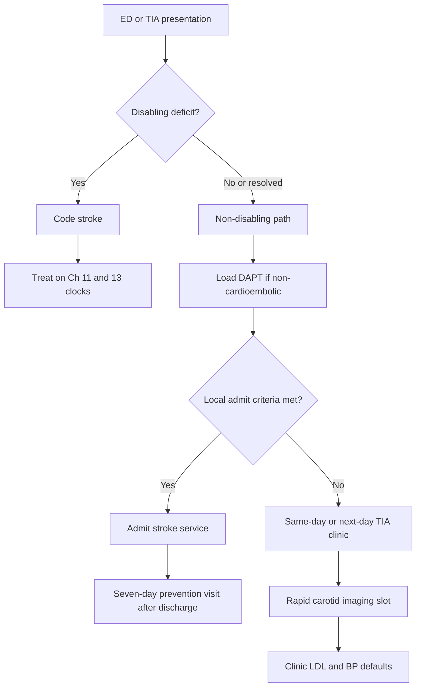

# TIA and Minor-Stroke Clinic

## Opening

A Comprehensive Stroke Center that can retrieve a large-vessel occlusion at 02:00 and cannot place a resolved, high-risk transient ischemic attack (TIA) into a same-day clinic the next afternoon has built a procedure service, not a prevention product. The seven-day vascular-prevention visit in [Transitions, Secondary Prevention, and Clinic](17-transitions-prevention.md) is the safety net after a completed stay. It is not the product for the patient still in the emergency department with a deficit that has already vanished. That patient needs a designed same-day or next-day TIA and minor-stroke clinic: held slots, a written high-risk card, a rapid carotid imaging hold, a dual-antiplatelet load with a stop date, and a weekend rule that does not park Friday-night events until Monday.

The Medical Director owns that product. Emergency medicine will treat-and-refer or admit. Radiology will hold the vessel slot. The clinic manager will inventory the chairs. Pharmacy will load the regimen. Vascular neurology will see the patient and name the mechanism. None of those groups will invent a coherent service if the Medical Director leaves TIA as "call the fellow and hope there is a cancellation." Publish the clinic as a service with hours, a roster, an imaging contract, and an admit-versus-refer card. Then audit whether it ran on Saturday.

This chapter does not own the four-clock episode, the seven-day post-discharge visit, the atrial fibrillation (AF) detection pathway, or 90-day modified Rankin Scale (mRS) capture. Those remain in Chapter 17. Do not move CSTK-02 into this file. This chapter owns the front door Chapter 17 never designed: the same-day and next-day clinic that keeps a non-disabling TIA or minor stroke from becoming tomorrow's disabling infarct.

The 2026 AHA/ASA acute ischemic stroke guideline changed the emergency-department fork that feeds this clinic. For non-disabling deficits inside the 4.5-hour window, dual antiplatelet therapy (DAPT) is preferred over intravenous thrombolysis. Eligible disabling deficits are still treated rapidly regardless of NIHSS; that decision lives in [Hyperacute Pathways and Code Stroke](11-hyperacute-pathways.md) and [Intravenous Thrombolysis Operations](13-iv-thrombolysis.md). The clinic receives the non-disabling and resolved patients the fork sends it, and returns anyone who is actually disabling to the code.

## Why This Matters

The highest short-term recurrence risk after TIA and minor stroke sits in the first hours and days, not in the fourth week. A program that offers "stroke clinic in two to three weeks" has chosen to be absent for the interval that matters. The seven-day visit is already late for crescendo events, an unimaged symptomatic carotid, new AF with a high burden, or blood pressure that is still climbing in the waiting room. Those problems cannot wait for the Chapter 17 clock. They need today's chair or today's bed.

Two products that share a scheduler will collapse into one. If the same template is used for a discharged thrombectomy patient and for this morning's resolved hemisensory TIA, the TIA will lose. The inpatient discharge has a case manager, a mandated slot, and a Joint Commission trail. The treat-and-refer TIA has a discharge instruction sheet and a hope. Separate the inventories. Hold same-day and next-day chairs that inpatient seven-day booking cannot consume.

The 2026 DAPT preference fails here if staff treat "mild NIHSS" as the entry criterion. Isolated aphasia, hemianopia, or a hand that cannot button is disabling even when the score is low — those patients belong in the code. The opposite error is the resolved TIA who receives neither thrombolysis nor a loaded DAPT regimen because "the deficit is gone." Write the functional statement. Load the regimen. Book the chair.

Weekend coverage is the usual silent failure. A Monday-through-Friday TIA clinic is a weekday courtesy, not a CSC product. Friday at 16:00 and Sunday at 11:00 generate the same biology. If the clinic cannot see those patients before Monday morning, the written alternative is admission or a staffed weekend session — not a voicemail and a next-available slot.

This is also an equity system. Language-discordant patients, uninsured walk-ins, and spoke transfers labeled "TIA, follow up at the hub" are the ones sent home without a chair. Stratify same-day access the same way Chapter 17 stratifies seven-day access.

## Core Framework

### Two clinic products, two clocks

| Product | Who it is for | Clock | What it must finish | What it is not |
| --- | --- | --- | --- | --- |
| Same-day / next-day TIA and minor-stroke clinic (this chapter) | ED treat-and-refer TIA; non-disabling minor stroke that will not be admitted; spoke TIA the hub agreed to keep in clinic | Same calendar day, or the next calendar day if the patient arrives after the last held slot | Mechanism hypothesis, DAPT load and stop date, rapid extracranial imaging, LDL and BP defaults started, admit-versus-home decision locked | The seven-day post-discharge visit; a research-only new-patient template; a Monday recovery session for weekend leftovers |
| Seven-day vascular-prevention visit (Chapter 17) | Ischemic stroke and TIA discharges after a completed stay | Within 7 calendar days of discharge | Regimen check, DAPT calendar, AF-monitor plan, statin intensity, handoff packet survival | The first evaluation of an untreated TIA still in the ED |

Do not double-book every treat-and-refer patient into both products. If the same-day clinic finished the workup, named the mechanism, started the regimen, and wrote the residual questions, skip a second seven-day chair. If the visit was imaging-incomplete or the patient was admitted, the seven-day clock starts at discharge and Chapter 17 owns it.

### The disabling fork feeds the clinic — it is not the clinic

Teach one sentence the night resident can repeat. Treat eligible **disabling** deficits rapidly inside 4.5 hours **regardless of NIHSS**, without delaying for advanced imaging selection — that is [Hyperacute Pathways](11-hyperacute-pathways.md) and [IV Thrombolysis](13-iv-thrombolysis.md). For **non-disabling** deficits inside 4.5 hours, DAPT is preferred over intravenous thrombolysis. "Mild NIHSS" is not "non-disabling." Ambulation and swallowing independence belong in the functional statement that opens the clinic note. A patient who cannot walk or swallow is not a clinic candidate.

CHANCE and POINT remain the default regimen grammar, as already used in Chapter 17. CHANCE used a 300 mg clopidogrel load and 21 days of DAPT. POINT used a 600 mg load and 90 days of DAPT, with benefit and hemorrhage risk front-loaded. The local protocol picks a load dose, a duration (commonly 21 days, with 90 days reserved for defined high-risk situations), a stop date on the after-visit summary, and a clinic check that DAPT actually stops. Unexplained lifelong DAPT is a preventable bleed. Load in the ED or at the first clinic chair — do not send a non-disabling patient home on aspirin alone "until clinic decides."

Cardioembolic events do not get DAPT as a substitute for anticoagulation. New AF on the ED strip follows the Chapter 17 start rules, not a same-day aspirin prescription.

### High-risk TIA is a local written card

Do not invent a national ABCD2 cutoff and do not treat any score threshold as a certification number. The 2021 AHA/ASA secondary-prevention guideline is the operational source. ABCD2 or an equivalent local tool may sit on the card as a structured prompt. The Medical Director writes the **local** high-risk definition and the **local** ED-versus-clinic split, dates the card, and posts it where the emergency attending actually stands.

The card has four jobs:

1. Name what "high-risk TIA" means in this house (motor or speech events, crescendo pattern, known ipsilateral stenosis, new AF, or the locally chosen ABCD2-or-equivalent band — fill the blanks; do not import a number from a slide).
2. Split ED treat-and-refer from admit.
3. Force a functional statement: resolved / non-disabling / disabling. Disabling leaves this card and enters the code.
4. Name the clinic clock: same calendar day, or next calendar day if the last held slot has already passed, including Saturday and Sunday.

A score without a split is decoration. A split without weekend hours is a weekday-only score.

### What cannot wait seven days versus what can

| Problem | Clock | Product | Forbidden delay |
| --- | --- | --- | --- |
| Crescendo TIA (repeated events in hours or a few days) | Now | Admit. Do not treat-and-refer into a next-week chair | "Watch overnight in ED then clinic Monday" |
| Symptomatic extracranial carotid stenosis, or vessels not yet imaged | Same day for imaging; revascularization **within 2 weeks** when indicated (Class 2a, [ER-SP-2021-CEA](../evidence-register.md)) | Rapid carotid slot plus this-stay or this-week conference (vascular surgery, neurointervention, vascular neurology). Do not invent a 48-hour national mandate | Booking CEA counseling at the seven-day visit because "clinic will sort the neck" |
| New AF with a high burden (sustained or highly recurrent on the ED monitor) | Same day for the anticoagulation plan | Chapter 17 start rules; clinic only if the plan can be executed safely from home | Aspirin "until the PCP starts a DOAC" |
| Unstable or untreated severe hypertension | Now, in the ED or the unit | Treat before discharge; do not use the clinic as a titration ward | Sending the patient home on their admission regimen with a "BP check next week" |
| Disabling or fluctuating deficit | Code-stroke clock | Chapters 11 and 13 | Relabeling it TIA to protect a clinic slot |
| Workup already complete, DAPT loaded, vessels imaged, BP treated, AF strategy written, residual questions named | Seven-day clock if the patient was admitted; no second clinic if same-day finished the job | Chapter 17 after discharge; this chapter if the work happened in clinic | Repeating the entire workup at day 7 because the templates are identical |

The seven-day visit can wait for residual ESUS questions already listed, the first outpatient monitor result when telemetry was clean and the plan is written, add-on lipid therapy after an intensive statin is started, and DAPT stop-date confirmation when the calendar card already exists. It cannot wait for the neck, anticoagulation that is due today, the next crescendo event, or a blood-pressure crisis.

### ED treat-and-refer versus admit — a local card, not a national rule

Publish one page. Fill the blanks with this faculty and this emergency department. The list below is a skeleton, not a certification table and not a volume claim.

**Treat-and-refer into the same-day / next-day clinic** when all of the following are true:

- Deficit is resolved or documented non-disabling; the functional statement is in the chart.
- Head imaging has excluded hemorrhage and a large completed infarct that belongs on the unit.
- DAPT is loaded (or anticoagulation is started or a contraindication is written).
- A same-day or next-calendar-day chair exists, including weekends, and the patient can reach it.
- Blood pressure is treated to a discharge-safe local target; the clinic inherits **<130/80** as the secondary-prevention default ([ER-SP-2021-BP](../evidence-register.md)), not as an ED discharge gate.
- A reliable contact method is recorded; language access is arranged for the clinic visit.
- No row in the "cannot wait" table applies.

**Admit** when any "cannot wait" row applies, the deficit is disabling or fluctuating, the clinic cannot see the patient before the next calendar day (including weekends and holidays), or the patient cannot return or be reached. Observation is a bed product, not a clinic substitute — write it as admit-equivalent so those patients are not counted as treat-and-refer successes.

### Rapid carotid imaging and the two-week revascularization clock

The clinic is worthless if the neck is an order for "outpatient carotid duplex in 10–14 days." Hold a same-day duplex or CTA slot that the ED and the TIA clinic can consume without competing with elective outpatient vascular surgery. Name the modality, the hours, and the backup (CTA if ultrasound is closed; ultrasound if contrast is contraindicated). [Imaging Architecture](12-imaging-architecture.md) owns the scanner rules; this chapter owns the hold.

When revascularization is indicated after TIA or nondisabling stroke, intervention **within 2 weeks** is Class 2a ([ER-SP-2021-CEA](../evidence-register.md)). CEA for ipsilateral 70–99% stenosis with periprocedural risk under 6% is Class 1. Prefer CEA over CAS if done within 1 week (Class 2a). Do not invent a 48-hour national mandate. Put the local timing rule on the imaging-hold card and put the conference on this stay or this week.

Elective carotid intervention remains a CSTK-01 exclusion. Peri-procedural stroke uses the in-house / perioperative code in [In-Hospital and Perioperative Stroke](43-in-hospital-stroke.md). The TIA clinic's job is to get the right patient to the conference while the 2-week clock is still open. Inbound spoke TIA is still an EMTALA event: accept if the CSC has capacity and the specialized capability; no payor screen; "keep them in our clinic next Tuesday" is not a decline ([ER-EMTALA-01](../evidence-register.md); [Telestroke](19-telestroke-networks.md)).

### AF detection is already written

Do not rebuild the AF pathway here. Use the Chapter 17 card. The same-day clinic's AF jobs are narrower: read the ED strip, start or withhold anticoagulation on purpose, order the extended monitor before the patient leaves the chair, and hand the residual rhythm question to Chapter 17 in one line.

STK-3 measures inpatient discharge anticoagulation, not treat-and-refer TIA. That is not permission to discharge documented AF on aspirin. Measure the clinic start locally. Confirm any public outpatient ID against live STK-OP ([ER-STK-OP](../evidence-register.md) is `confirm live`).

### Weekend coverage — the clinic is not Monday-only

Write hours that include Saturday and Sunday, or write the admission rule that replaces them. Acceptable designs: a staffed Saturday in-person session plus Sunday virtual with a locked Monday imaging slot; a weekend APP or fellow clinic with a named attending who can admit without a new ED workup; observation overnight into a Sunday chair when Saturday is full. Unacceptable: a Monday callback, a Friday-afternoon treat-and-refer onto a Tuesday template, a weekend voicemail, or an on-call fellow with no chair, nurse, or imaging hold. Holiday weeks use this rule. The Friday before a Monday holiday is a three-day gap unless a session is staffed or the patient is admitted.

### Clinic medical defaults

The same-day visit starts the prevention regimen. It does not wait for the seven-day template to "confirm lipids."

- **LDL-C <70 mg/dL** with high-intensity statin plus or minus ezetimibe is the Class 1 default for atherosclerotic ischemic stroke and TIA ([ER-SP-2021-LDL](../evidence-register.md)). Start the intensive agent in the ED or the clinic chair. Do not titrate from a moderate-intensity prescription because the point-of-care or admission LDL "was not that high."
- **BP <130/80** is the Class 1 clinic / secondary-prevention default unless an ICH, aSAH, or maternal table applies ([ER-SP-2021-BP](../evidence-register.md)). The ED discharge-safe number and the clinic target are different clocks; write both on the card so the emergency attending does not invent a third.
- Smoking-cessation offer belongs in the same-day note. Public achievement language lives in [Core Metrics](../quality/23-core-metrics.md).
- Glucose, if the patient is still in the acute window, follows the 2026 AIS numbers: treat hypoglycemia under 60 mg/dL; 140–180 mg/dL is reasonable for persistent hyperglycemia; intensive 80–130 is not recommended.

!!! tip "Key Actions"
    Publish the same-day / next-day TIA clinic as a product distinct from the Chapter 17 seven-day visit, with a separate slot inventory. Write the local high-risk definition and the ED-versus-clinic split on one card; point at 2021 secondary prevention and ABCD2-or-equivalent; do not post a national ABCD2 cutoff as a certification number. Write the 2026 fork into the ED script: disabling deficits go to Chapters 11 and 13 regardless of NIHSS; non-disabling deficits in the 4.5-hour window get DAPT rather than IVT. Hold a rapid carotid slot and a 2-week revascularization conference rule (Class 2a). Staff Saturday and Sunday or admit. Start LDL <70 and BP <130/80 in the chair. Leave CSTK-02 in Chapter 17.

!!! abstract "Metrics Targets"
    Offer a same-day or next-calendar-day chair to **100%** of ED treat-and-refer TIA and non-disabling minor-stroke patients (`internal`). Complete that visit on the offered clock for **≥80%**, stratified by weekend versus weekday and by language (`internal`). Document a functional statement and a DAPT load-plus-stop-date (or anticoagulation plan) on **100%** of clinic arrivals. Complete extracranial imaging on the clinic clock for **100%** of patients whose neck is not already imaged. Review **100%** of weekend TIA discharges not seen before Monday. Do not put CSTK-02 on this scorecard.

!!! warning "Common Pitfalls"
    Using the seven-day prevention template as the TIA product. Inventing a house ABCD2 cutoff and calling it a certification requirement. Treating NIHSS ≤5 as clinic-eligible and withholding thrombolysis from a patient who cannot walk or swallow. Sending a Friday 17:00 TIA home until Monday. Ordering "outpatient carotid duplex in two weeks" and calling the Class 2a window met. Loading DAPT without a stop date, or using DAPT in new AF. Starting a moderate-intensity statin because LDL was 88 mg/dL. Letting inpatient discharges consume held same-day chairs. Collecting 90-day mRS only from TIA-clinic attendees and calling it CSTK-02.

!!! success "Implementation Tips"
    Hold a daily 10-minute TIA access huddle separate from the Chapter 17 seven-day huddle; release unused same-day chairs at noon. Put the high-risk card in the ED track-board packet. Pair every held chair with a named duplex or CTA slot. Review the first twenty 2026-fork cases in person when the preference is new. Use weekend telemedicine for the exam-complete, imaging-complete patient; keep an in-person chair when the neck is still dark. Give pharmacy the same DAPT calendar card Chapter 17 uses after a stay. Sample ten treat-and-refer packets a month with the ED medical director and fix the card, not the relationship.

## How to Do the Work

### Daily / weekly

Each weekday morning, the clinic manager and the on-call vascular neurologist run a 10-minute TIA access huddle: overnight treat-and-refer patients who still need a chair today, unused same-day slots, the carotid-hold board, weekend coverage for the next 72 hours, and Friday-evening leftovers admitted because the clinic was dark. This huddle is not the Chapter 17 seven-day access huddle. Do not merge the lists.

On daily board rounds, name every TIA and minor-stroke arrival since yesterday and state the product: code stroke, admit, or same-day clinic. If the product is clinic and the chair does not exist, page the clinic manager during rounds.

Each weekday, the stroke coordinator reviews yesterday's ED dispositions against the high-risk card: functional statement, DAPT or anticoagulation, imaging completed or locked, chair kept or miss explained, weekend rule honored. Same-week defects are still repairable. Weekly, pull every case labeled non-disabling inside 4.5 hours and confirm the 2026 fork, including treat-and-refer patients who never hit the inpatient list. Sit the carotid-hold board next to the revascularization conference list. A duplex without a conference is a 2-week-clock failure in progress.

### Monthly / quarterly

Monthly, present a TIA-clinic scorecard at monthly quality: offer rate, completed same-day / next-day visit rate, weekend misses, DAPT load and stop-date errors, carotid imaging on the clinic clock, revascularization conference timing, new-AF anticoagulation start, and LDL / BP default starts. Stratify by language, insurance, race and ethnicity, and spoke versus mothership. Review every treat-and-refer patient who returned within seven days with a completed stroke.

Quarterly, re-sign the high-risk card with emergency medicine. Sit with vascular surgery and neurointervention to confirm the 2-week Class 2a rule is still a rule the surgeons honor. Reconcile the local DAPT protocol with Chapter 17. Take the weekend roster to stroke executive and retire any month that was Monday-only in practice. Do not add CSTK-02 capture rates to this scorecard.

### Annual / multi-year

Annually, match same-day chair capacity to ED TIA and minor-stroke outflow. Growing telestroke spokes without growing this clinic manufactures Friday-night admissions. Re-credential the weekend product: named clinicians, imaging holds, interpreter access, and the admission fail-safe.

Multi-year, decide whether the same-day clinic is a prevention-trial screening site; the academic mission leaks if only admitted patients are screened ([Clinical Trials, Registries, and Research Operations](../research/29-trials-registries.md)). Retire any local ABCD2 cutoff that has become folklore. Re-verify the 2021 citations and the 2026 fork in the [Evidence Register](../evidence-register.md) before reprinting the card. Confirm current certification volume tables in the active DSC manual before anyone uses TIA-clinic volume as a proxy for CSC eligibility. Do not invent an IVT or EVT number here.

## Ready-to-Adapt Tools

### Tool A — High-risk TIA card (local; date-stamp and post in ED)

**Header.** Product: same-day / next-day TIA and minor-stroke clinic. Owner: Medical Director. Review date: ________. Supersedes: ________.

**Functional statement (required).** Resolved / non-disabling / disabling. If disabling → leave this card → [code stroke](11-hyperacute-pathways.md). NIHSS is recorded; NIHSS is not the statement.

**Local high-risk definition (fill; do not import a national cutoff).** This house treats the following as high-risk TIA: ________. Structured prompt in use (ABCD2 or equivalent, optional): ________. Band that, locally, favors admit or same-day imaging: ________. This number is **not** a certification requirement.

**ED-versus-clinic split.** Treat-and-refer only if the "all of the following" list in the Core Framework is true and a chair exists today or next calendar day. Admit if any "cannot wait" row applies or if the clinic is dark.

**Regimen at the door.** Non-cardioembolic: load DAPT now. Local default (circle one and match Chapter 17): clopidogrel **300 mg** load then 21 days DAPT (CHANCE), or **600 mg** load then 90 days reserved for defined high-risk situations (POINT grammar). Stop date written: ________. Cardioembolic / new AF: Chapter 17 anticoagulation start rules. Do not substitute DAPT.

**Imaging.** Extracranial vessels today or next calendar day. Held slot type (duplex / CTA): ________. Hours: ________. Backup modality: ________.

**Clinic defaults started.** High-intensity statin toward **LDL-C <70**. BP regimen toward **<130/80** unless a disease-specific table applies. Smoking-cessation offer documented.

**Weekend / holiday.** Next staffed session: ________. If none before Monday 08:00 → admit or observation as written below. Do not issue a weekday callback.

**What this card does not own.** Seven-day post-discharge visit. 90-day mRS / CSTK-02. AF extended-monitor algorithm (pointer: Chapter 17).

### Tool B — Clinic slot RACI

| Decision | Medical Director | Clinic manager | Stroke coordinator | ED attending | On-call vascular neurology | Radiology / vascular lab | Pharmacy |
| --- | --- | --- | --- | --- | --- | --- | --- |
| Product definition and high-risk card | A | C | C | C | C | I | C |
| Same-day / next-day slot inventory | A | R | C | I | C | I | I |
| Weekend and holiday roster | A | R | C | I | R | C | I |
| Treat-and-refer versus admit on a given patient | A (card) | I | I | R | C | I | I |
| Rapid carotid hold and backup modality | A | I | C | C | C | R | I |
| Revascularization conference timing rule | A | I | C | I | R | I | I |
| DAPT protocol (CHANCE/POINT + 2026 fork) | A | I | C | R | R | I | R |
| AF start in clinic (pointer to Ch 17) | A | I | R | C | R | I | C |
| LDL <70 and BP <130/80 defaults | A | I | C | C | R | I | R |
| Scorecard and weekend-miss review | A | C | R | C | C | I | I |
| CSTK-02 / 90-day mRS | I (do not own) | I | See Ch 17 | I | I | I | I |

A = accountable, R = responsible, C = consulted, I = informed. The Medical Director remains accountable for the card even when the ED attending is responsible for the split on a given night.

### Tool C — Weekend coverage SOP skeleton

1. **Purpose.** Prevent Friday-to-Monday and holiday gaps for TIA and non-disabling minor stroke. The clinic is not a weekday-only service.
2. **Hours.** Saturday: ________ (in-person / virtual / both). Sunday: ________. Holiday rule: use this SOP, not the weekday template.
3. **Roster.** Named clinician each weekend day: ________. Named attending backup who can admit without a new ED workup: ________. Clinic nurse or MA: ________. Interpreter access: ________.
4. **Slot inventory.** Held weekend chairs: ________. These chairs cannot be consumed by routine new-patient backlog or by Chapter 17 seven-day overflow.
5. **Imaging.** Weekend duplex hours: ________. CTA backup when ultrasound is closed: ________. If neither exists, the patient is not a treat-and-refer candidate.
6. **Friday 14:00 huddle addendum.** List ED TIA and minor-stroke patients still in house; assign Saturday or Sunday chairs; convert anyone who will miss both into an admission before evening sign-out.
7. **Arrival after the last weekend chair.** Default is admit or written observation. Voicemail is not a disposition.
8. **Regimen.** Same DAPT or anticoagulation rules as weekday. Stop date on the after-visit summary. Pharmacy callback on the next business day is allowed; the load is not deferred to Monday.
9. **Fail-safe.** If the named clinician calls out, the attending backup either runs the session or the charge nurse converts remaining patients to admission. Do not cancel and reschedule to Tuesday.
10. **Review.** Every weekend miss (treat-and-refer patient not seen before Monday 08:00) is on the next weekly ops agenda. Three misses in a quarter re-opens this SOP at stroke executive.

## Integration With Other Pillars

The disabling fork is a hyperacute decision. [Hyperacute Pathways](11-hyperacute-pathways.md) and [IV Thrombolysis](13-iv-thrombolysis.md) treat disabling deficits regardless of NIHSS; this clinic receives the non-disabling remainder. [Imaging Architecture](12-imaging-architecture.md) holds the scanner and the duplex; this chapter holds the same-day reservation. [Inpatient Stroke Unit Operations](16-inpatient-stroke-unit.md) runs the patients this card admits. [Transitions, Secondary Prevention, and Clinic](17-transitions-prevention.md) owns the four-clock episode, the seven-day visit, the AF pathway, and 90-day mRS; this chapter does not steal CSTK-02. [Telestroke Network Operations](19-telestroke-networks.md) already forbids transferring an isolated, non-disabling, workup-complete TIA if the spoke can execute DAPT and this clinic pathway.

Public measure IDs stay in [Core Metrics](../quality/23-core-metrics.md). Equity strata for weekend access and language belong in [Equity and Disparities Reduction](../quality/26-equity-disparities.md). Fellowship decision logs live in [Vascular Neurology Fellowship and GME](../education/27-fellowship-gme.md). Prevention-trial screening at the same-day chair lives in [Clinical Trials, Registries, and Research Operations](../research/29-trials-registries.md). Re-verify numeric claims in the [Evidence Register](../evidence-register.md) before reprinting the high-risk card.

## Sources

- 2026 Guideline for the Early Management of Patients With Acute Ischemic Stroke. *Stroke*. 2026;57(8):e316–e436. DOI 10.1161/STR.0000000000000513. Non-disabling deficits in the 4.5-hour window: DAPT preferred over IVT. Disabling deficits treated rapidly regardless of NIHSS. [ER-AIS-2026-01](../evidence-register.md), [ER-AIS-2026-03](../evidence-register.md).
- Kleindorfer DO, et al. 2021 Guideline for the Prevention of Stroke in Patients With Stroke and Transient Ischemic Attack. *Stroke*. 2021;52:e364–e467. DOI 10.1161/STR.0000000000000375. Local high-risk definition and ED-versus-clinic split; no national ABCD2 certification cutoff. Two-week revascularization Class 2a ([ER-SP-2021-CEA](../evidence-register.md)). LDL-C <70 Class 1 ([ER-SP-2021-LDL](../evidence-register.md)). Clinic BP <130/80 Class 1 ([ER-SP-2021-BP](../evidence-register.md)).
- Wang Y, et al. Clopidogrel with aspirin in acute minor stroke or transient ischemic attack (CHANCE). *N Engl J Med*. 2013;369:11–19. 300 mg clopidogrel load; 21 days of DAPT.
- Johnston SC, et al. Clopidogrel and aspirin in acute ischemic stroke and high-risk TIA (POINT). *N Engl J Med*. 2018;379:215–225. 600 mg clopidogrel load; 90 days of DAPT. [ER-TR-DAPT](../evidence-register.md).
- Johnston SC, et al. Ticagrelor and aspirin or aspirin alone in acute ischemic stroke or TIA (THALES). *N Engl J Med*. 2020;383:207–217.
- Chen HS, et al. Dual antiplatelet therapy vs alteplase for patients with minor nondisabling acute ischemic stroke (ARAMIS). *JAMA*. 2023;329:2135–2144.
- Johnston SC, et al. Validation and refinement of scores to predict very early stroke risk after transient ischaemic attack (ABCD2). *Lancet*. 2007;369:283–292. Local structured prompt only; not a certification threshold.
- Specifications Manual for Joint Commission National Quality Measures, v2026B and successors. CSTK-02 remains a Chapter 17 product. STK-OP: confirm live ([ER-STK-OP](../evidence-register.md)).
- [Transitions, Secondary Prevention, and Clinic](17-transitions-prevention.md) for the four-clock episode, AF detection pathway, seven-day visit, and 90-day mRS.
