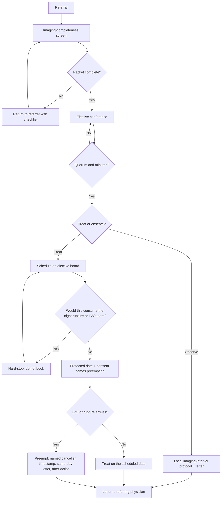

# Elective Cerebrovascular Program

## Opening

An academic Comprehensive Stroke Center sells two cerebrovascular products. One is the 24/7 ability to reverse coagulopathy, secure a ruptured aneurysm, and puncture an LVO at 02:00. The other is a scheduled program that takes a referred unruptured aneurysm, arteriovenous malformation (AVM), dural arteriovenous fistula (dAVF), cavernous malformation, or moyamoya patient from a complete imaging packet through a multidisciplinary conference to a documented treat-or-observe decision and a date that does not steal the night team. This chapter owns the second product. [Hemorrhagic Stroke and Complex Cerebrovascular Programs](21-hemorrhagic-complex.md) keeps acute hemorrhage, the ICH bundle, nimodipine, and around-the-clock securing.

The Medical Director does not have to clip, coil, embolize, or sew a bypass. The Medical Director does have to publish the conference, the quorum, the minutes rule, the outpatient pathway, the preemption SOP, and the hard-stop that elective cases do not consume the night rupture or LVO team. Without those documents the elective service is a private list in one operator's inbox.

Write the program so the two products share operators and do not share a clock. A single suite and a morning board of unruptured aneurysms that cannot move when a rupture or an LVO arrives is how a center quietly wrecks the emergency product. The April 2, 2025 Joint Commission announcement reduced the annual aSAH volume criterion to 10. That sentence is about ruptured aneurysms and the CSC eligibility table. It does not grade an elective program, authorize padding the board with unruptured clips, or convert elective clipping into a CSTK-06 case.

## Why This Matters

Community hospitals will send the lesion they cannot staff. They will not send it twice if the packet sits, if the family is handed a score and told to decide, or if the date dies in a hallway argument when an LVO hits the door. The letter back to the referring physician is part of the treatment.

The conference is the engine. Neurosurgery, neurointervention, and the stroke service in the same room — radiation oncology when radiosurgery is live, additional neurology when the lesion needs it — produce a plan a fellow can defend. A conference without minutes, quorum, and a named decision is a lecture. Chapter 21 already requires every new AVM, dAVF, and moyamoya case on the weekly conference before elective treatment. This chapter makes that requirement a scheduled product with an outpatient front door and an emergency back door.

Unruptured aneurysms are the volume that will tempt the center to skip the conference. PHASES, ISUIA, and UIATS are decision-support inputs, not a calculator the family is asked to operate, and not a millimeter-and-month table invented here. Treatment versus observation is a documented shared decision against a written local follow-up imaging protocol.

ARUBA is context for unruptured low-grade AVM — not a ban and not a mandate. The minutes name surgery, embolization, radiosurgery, or observe. If radiosurgery is offered, radiation oncology is a service-level agreement, not a courtesy invite. Moyamoya revascularization is a Chapter 21 differentiator and a weekday operation, not a 02:00 product.

Do not let quality swallow this program into the hemorrhagic CSTK cluster. Elective clipping of an unruptured aneurysm is not CSTK-06. Elective complication review is a separate file from the CSTK-03 / CSTK-04 / CSTK-06 hemorrhage scorecard. Mixing the two produces two lies: a hemorrhage service that looks busier than it is, and an elective service that never sees its own harm.

## Core Framework

### Two products, one operator pool, two clocks

| Product | Home chapter | Clock | What success looks like | What failure looks like |
| --- | --- | --- | --- | --- |
| Acute ICH / aSAH / ruptured aneurysm / emergency-adjacent dAVF | [Chapter 21](21-hemorrhagic-complex.md) | Night-capable; single accept number; decision-to-secure | Bundle, nimodipine, 24/7 securing | Rupture waits on the morning elective board |
| LVO / emergency EVT | [Endovascular Therapy](14-endovascular-therapy.md) | Door-to-puncture; CSTK-09 / 11 / 12 | Emergency path open when an elective case is on the table | Elective coil occupying the only suite |
| Elective unruptured aneurysm, AVM, dAVF, cavernoma, moyamoya | This chapter | Referral → complete imaging → conference → letter → scheduled date | Minutes, quorum, shared decision, night-team hard-stop | Private list; family operating PHASES; same-day cancel by personality |

Publish the split in one paragraph both services sign. Acute hemorrhage and LVO keep the night team. Elective work keeps the conference, the clinic letter, and a board that can be preempted without a fight.

### The elective conference

The conference is not optional continuing education. It is the only legal on-ramp to the elective board.

**Quorum.** Three services in the room or on a documented video link: cerebrovascular neurosurgery, neurointervention, and the stroke service. Radiation oncology is required when radiosurgery is a live option on that agenda. Additional neurology (epilepsy, cognitive, or the referring vascular neurologist) is required when the lesion or the peri-operative plan needs them. Quorum is recorded by name and role. A single-service "conference" is a clinic visit with witnesses.

**Minutes.** Every case produces a dated note: anatomy, decision-support inputs used, options presented, treat versus observe, modality if treat, owner, next imaging or procedure date, and the text of the letter to the referring physician. Attendance without a decision note is not a conference. Pending electives that lack minutes are a hard stop on the agenda, as Chapter 21 already requires.

**Chair.** Rotating chair; equal case-submission rights for neurosurgery and neurointervention. The stroke service may submit. The Medical Director does not have to chair; the Medical Director does have to read the minutes file.

**Hard-stop.** Elective cases do not consume the night rupture or LVO team. An elective that can be done only if the on-call operator, the on-call anesthesia team, or the only emergency suite is committed after hours is not scheduled. Move it, add a second room, or decline the date. This is a written rule, not a courtesy.

### Unruptured aneurysm

The 2015 AHA/ASA unruptured-aneurysm guideline remains the major practice reference unless a later AHA update is cited. ISUIA described natural history and treatment risk in a defined cohort. PHASES estimates five-year rupture risk from pooled observational data. UIATS structures a multidisciplinary treatment-versus-observation judgment. Name all three as inputs the conference uses. Do not project any of them on the wall and ask the family to pick a number.

Do not invent a national size cutoff in millimeters, a national follow-up interval in months, or a house score that pretends to replace the three instruments. Follow-up imaging intervals are a written local protocol: modality, interval by the categories the local protocol actually uses, who reads, who calls the patient, and when the case returns to conference. If growth, new symptoms, or a change in family preference appears, the case returns to conference. It does not jump to the board from a clinic inbox.

Treatment versus observation is a documented shared decision. The note names the options (observe on the local protocol; treat by clip; treat by endovascular means), the inputs used, the patient's priorities, and the residual risk either way. A consent form is not a shared-decision note. A PHASES printout in the after-visit summary is not a shared-decision note.

Unruptured aneurysm work that presents with thunderclap, new deficit, or imaging that may represent sentinel leak leaves this chapter and enters Chapter 21. Do not keep a symptomatic lesion on the elective list to protect a scheduled date.

### AVM

ARUBA compared medical management with interventional therapy for unruptured brain AVMs and is required context for unruptured low-grade lesions. It is not a ban on treatment, not a mandate to treat, and not a reason to skip the conference. The 2017 AHA/ASA scientific statement on brain AVM management is the practice-framework source. Spetzler–Martin grade is a language the minutes must speak; it is not a treatment order.

Every new AVM sits on the conference before elective treatment. The minutes name a plan, not a vibe: surgery, embolization, radiosurgery, a staged combination, or observation, with an owner for each stage. Ruptured AVM is a Chapter 21 problem first; once the hemorrhage is managed, residual-nidus decisions return here.

If radiosurgery is offered, write a radiation-oncology service-level agreement before the first elective is booked. The SLA names who contours, who plans, who consents, the scheduling clock from conference decision to first fraction, who owns follow-up imaging, and who returns incomplete responses to conference. Do not invent a dose, a prescription, or a platform. Do not name a device. A brochure that says "we offer radiosurgery" without an SLA is marketing.

### dAVF and cavernoma as conference products

dAVF is not an IR hobby. Cortical venous drainage is emergency-adjacent and follows the Chapter 21 rule: treat it as a lesion that can declare at night, not as a convenient add-on to Thursday's elective list. Low-risk fistulas without cortical drainage are conference products. Cognard or Borden grade is recorded in the minutes so the next fellow is not re-deriving the anatomy from a verbal. The plan names embolization, surgery, radiosurgery, or observe, and names the owner.

Cavernous malformation is not a single-surgeon list. Repetitive hemorrhage, aggressive location, epilepsy that may be lesion-related, and familial or multiple-lesion disease belong on the conference. Surgery criteria are written locally against published consensus (Akers and colleagues, 2017) and the center's actual operative experience. Genetic counseling is offered when the history or the imaging suggests it; the offer is documented. Observation is a plan with a local imaging-interval protocol, not a shrug.

Both lesions produce the same artifacts as aneurysms if they skip the conference: an operator-specific indication, no letter to the referrer, and no residual-risk conversation. Put them on the agenda by default.

### Moyamoya

Moyamoya is a Chapter 21 differentiator: direct and indirect revascularization capability, stroke-neurology peri-operative ownership, and written blood-pressure and volume rules. A quarterly brochure and an annual case do not make a program. Staffing, conference minutes, and outcomes do.

Elective revascularization is scheduled. It is not a 02:00 product. A patient who presents with acute infarction or hemorrhage is managed on the ischemic or hemorrhagic pathway first; the bypass is not improvised at night because an operator is already in the hospital. Peri-operative ownership stays with stroke neurology plus neurosurgery on a joint order-set. The conference records laterality, direct versus indirect versus combined, staging if bilateral, blood-pressure and volume targets, and the antiplatelet plan. Pediatric moyamoya follows the pediatric receiving compact in [Special Populations](42-special-populations.md); do not improvise an adult-table bypass on a child.

### Preemption SOP

LVO and ruptured aneurysm preempt the elective board. The rule is executable without a personality contest.

| Event | Who may cancel | What is timestamped | What happens next |
| --- | --- | --- | --- |
| Inbound LVO while an elective is on the table or next in room | Duty NIR or stroke attending; no second permission | Decision time, case identity, suite state, family notification time | Elective stopped or not started; LVO launched; after-action next weekday |
| Inbound ruptured aneurysm / emergency-adjacent dAVF | Duty NSGY or NIR attending on the single accept number | Same plus accept-attending name | Elective stopped or not started; rupture path per Chapter 21 |
| Second emergency while the first is occupying the only suite | Backup operator rule already written in Chapter 21 and Chapter 14 | Backup call time; transfer-out if the written exception is used | Transfer-out of a rupture from a CSC remains a reportable event |
| Elective that would require the night team | Scheduler plus Medical Director designee — the case is never booked | Attempted-booking time and the hard-stop citation | Rebook on a protected elective block |

Same-day cancel is a written rule, not a negotiation with the family in pre-op. The patient is told at consent that an inbound LVO or rupture will cancel the date. The referring physician is notified the same day. The case returns to the next conference or the next protected block; it does not jump a queue by outrage.

Every preemption is an after-action: Could a second room have absorbed it? Was the elective a case that should never have been on an emergency-only day? Did cancellation consume the night team anyway because the elective had already started and then overrun? The log is reviewed at monthly quality. A quarter with no log entries and a busy elective board is a documentation failure, not a safe month.

### Outpatient pathway

The pathway is the product the referring region actually experiences.

1. **Referral.** One intake, not two competing NSGY and NIR faxes. Stroke clinic, neurosurgery clinic, and IR clinic may all see the patient; they may not each open a private pathway to the board.
2. **Imaging completeness.** A checklist, not a radiologist's taste. Incomplete packets return to the referrer with the missing items named. Do not consume conference time on a single noncontrast study and a phone description.
3. **Conference.** Quorum, minutes, treat versus observe.
4. **Letter to the referring physician.** Same week as the conference. Anatomy, decision, rationale in plain language, next date, and who owns the patient. A copy goes to the patient.
5. **Scheduled date.** On a protected elective block that does not require the night team. Consent includes the preemption rule.
6. **Same-day cancel rule.** LVO and rupture preempt. Named canceller. Timestamp. Same-day notification. After-action. Rebook by rule, not by volume of complaint.

Patients who arrive as transfers for "elective" treatment without a conference note are held off the board until the next conference unless Chapter 21 or Chapter 14 has already claimed them as emergencies. A transfer that was sold as elective and is actually a sentinel leak is a Chapter 21 case and a referring-site education event.

### Quality: keep elective harm off the CSTK hemorrhage cluster

CSTK-03, CSTK-04, and CSTK-06 measure severity scoring, reversal, and nimodipine for ICH and aSAH. They are Chapter 21 clocks. Public measure IDs and award criteria live in [Core Metrics](../quality/23-core-metrics.md). This program does not borrow them.

Do not abstract an elective clip of an unruptured aneurysm as a CSTK-06 case. Do not put elective cavernoma resection into the hemorrhagic CSTK cluster to fatten a denominator. Do not use elective volume to argue that the April 2, 2025 reduction of the annual aSAH volume criterion to 10 is "already exceeded." That criterion is about ruptured aneurysms. Confirm the live E-App / DSC table at each application. Elective program quality is conference completion, letter reliability, preemption-log completeness, same-day cancel discipline, and a complication file that sits beside — not inside — the CSTK hemorrhage review.

Elective complications (intra-operative rupture, ischemic injury, access injury, wound or EVD infection after a scheduled case, unexpected ICU stay, 30-day readmission, 90-day functional outcome) go to a dedicated elective review. The operators may be the same people who present at hemorrhage M&M. The packet is not the same packet. Mixing them hides both signals.

!!! tip "Key Actions"
    Publish one intake and one conference with a written quorum: NSGY + NIR + stroke, plus radiation oncology when radiosurgery is live and additional neurology when the lesion needs it. Require minutes before any elective is booked. Write a local unruptured-aneurysm follow-up imaging protocol; do not hand families PHASES, ISUIA, or UIATS as a calculator. Treat ARUBA as context for unruptured low-grade AVM, not as a ban. Sign a radiation-oncology SLA before offering radiosurgery. Put dAVF and cavernoma on the conference by default. Schedule moyamoya; do not run bypass at 02:00. Write the preemption SOP so LVO and rupture cancel the elective board by rule. Send the referring physician a letter the same week. Keep elective complications off the CSTK-03 / 04 / 06 cluster. Do not use the April 2, 2025 aSAH volume change as an elective quality story.

!!! abstract "Metrics Targets"
    Conference completion before elective treatment: **100%** of AVM, dAVF, moyamoya, cavernoma, and unruptured-aneurysm cases that are treated. Quorum documented on **100%** of those conferences. Letter to the referring physician inside the locally defined week: **internal ≥95%**. Elective cases booked onto a block that would consume the night rupture or LVO team: **target zero**. Preemption log complete (canceller, timestamp, family notice, referrer notice, after-action) on **100%** of same-day cancels. Elective cases abstracted into CSTK-06 or the hemorrhagic CSTK cluster: **target zero**. Elective complication review held separately from the CSTK hemorrhage packet: **every month there is an eligible case**. These are `internal` program aims. They are not GWTG award criteria and not CSC certification floors.

!!! warning "Common Pitfalls"
    Two intakes, two boards, and a patient who waits while the services negotiate. Conference without minutes. Quorum of one service plus a fellow. Handing the family a PHASES printout and calling it shared decision. Inventing a millimeter-and-month follow-up table in clinic because no local protocol exists. Treating ARUBA as a prohibition, or ignoring it as if the trial did not happen. Offering radiosurgery with no radiation-oncology SLA. Leaving dAVF and cavernoma off the agenda as "straightforward." Scheduling moyamoya against the night call team. Letting an elective occupy the only suite when an LVO is inbound. Same-day cancel by whoever speaks loudest. Abstracting elective clips as CSTK-06. Using the April 2, 2025 reduction to 10 to advertise elective volume as certification strength. Building the program around one famous operator.

!!! success "Implementation Tips"
    Use the existing weekly cerebrovascular conference as the intake; add an elective block at the top rather than inventing a second meeting. Launch the imaging-completeness checklist as a 30-day PDSA with the scheduler, not as a 20-page policy. Sit radiation oncology in the AVM portion for six weeks before writing the SLA — the scheduling friction will write the SLA for you. Timestamp the first three preemptions in public at monthly quality so the rule becomes a fact. Give referring physicians a one-page "how to refer" that is the completeness checklist. Tell executives that elective volume on a single emergency suite is a strategy defect ([Strategy, Growth, Volume, and Complexity](../strategy/32-strategy-growth.md)), not a utilization win. Recruit so the conference and the night team do not depend on one person.

## How to Do the Work

### Daily / weekly

Daily huddle (the same rhythm as the rest of the CSC: daily huddle → weekly ops → monthly quality → quarterly stroke executive) includes the day's elective board against the emergency suite state. If the only room is committed to an elective and the night team is the backup, the case does not start. Pharmacy, anesthesia, and the transfer center do not need a second huddle; they need the board to be honest.

Weekly ops reviews every pending elective that lacks minutes — hard stop — and every preemption since the last meeting. Weekly, the coordinator confirms that conference decisions produced letters. Weekly, the AVM / dAVF / moyamoya / cavernoma / complex-aneurysm list is the first block of the cerebrovascular conference, as Chapter 21 already sketched. Radiation-oncology coordination sits on that agenda when radiosurgery is live.

Do not open a "stroke operations committee" or a "stroke governance committee" to own this. The conference is the clinical meeting. Weekly ops is the operations meeting. Monthly quality is the scorecard. Quarterly stroke executive is the resource meeting.

### Monthly / quarterly

Monthly quality carries the elective scorecard as its own page, not as a footnote on CSTK-03 / 04 / 06: conference completion, quorum, letters, hard-stop violations, preemption-log completeness, same-day cancels, unexpected ICU stays, and 30-day harm. Elective complications are presented in a separate packet from the hemorrhagic CSTK cluster. Invite the scheduler and the transfer-center lead; most booking defects start there.

Quarterly stroke executive reviews whether elective growth is crowding the emergency path (suite conflict log, CSTK-09 / 11 / 12 trend, night-team starts of cases that should have been elective). If the emergency path is red, freeze net new elective-complex marketing until a second room or a protected block is funded — the stop-light already written in Chapter 32. Quarterly, audit ten referred packets against the completeness checklist. Quarterly, audit treat-versus-observe notes for unruptured aneurysms to confirm PHASES / ISUIA / UIATS were used as inputs and that a local imaging protocol, not a one-off interval, governs observation. Quarterly, tabletop a Thursday-morning elective in the only suite with an inbound rupture and an inbound LVO.

### Annual / multi-year

Annually, re-sign the radiation-oncology SLA and the NSGY–NIR split with Chapter 21. State the April 2, 2025 aSAH volume change accurately on the E-App and do not import it into the elective quality story. Reassess operator depth: quorum failures, cases that waited on one person, electives that started only because the night team stayed.

Multi-year, decide which elective programs are real (staffed, conferenced, reported, SLA in force) and which are brochure language to retire. Attach the conference to trial screening. Recruit so the work does not depend on one operator. Confirm numeric volume expectations in the active DSC manual; historical figures are not current law, and elective counts are not a substitute.

## Ready-to-Adapt Tools

### Tool A — Elective conference agenda

Duration: 45–60 minutes. Chair rotates. Minutes are the product.

1. Quorum call: NSGY, NIR, stroke. Radiation oncology if radiosurgery is on the list. Additional neurology if listed. Record names. If quorum fails, no treat decisions. (2 minutes)
2. Hard-stop review: any pending elective that would consume the night rupture or LVO team — do not book. (3)
3. Pending electives that lack a documented conference note — hard stop. (5)
4. New unruptured aneurysms: anatomy, PHASES / ISUIA / UIATS as inputs, local imaging-protocol assignment or treat plan, shared-decision elements. (10–15)
5. New AVM, dAVF, cavernoma, moyamoya, and complex residuals. Multidisciplinary plan named. (15–20)
6. Radiation-oncology coordination against the SLA. (5)
7. Letters: assign author and send-by date for each decision. (5)
8. Trial screening. (3)
9. Decisions, owners, dates. Read back. (5)

### Tool B — Preemption SOP skeleton

1. Trigger: inbound LVO, inbound ruptured aneurysm, or emergency-adjacent dAVF while an elective is in pre-op, in room, or next on the board.
2. Authority: duty NIR or stroke attending (LVO); duty NSGY or NIR attending on the single accept number (rupture / emergency dAVF). No second permission.
3. Action: do not start the elective; if started, stop at the next safe point the operator names out loud.
4. Timestamp: trigger recognition, cancel decision, family notification, referring-physician notification, suite-free time.
5. Night-team rule: the cancelled elective is not rescheduled onto the night call team.
6. Rebook: next protected elective block, or return to conference if the plan may change.
7. After-action by the next weekday: suite-conflict classification, whether a second room would have absorbed it, whether the elective violated the hard-stop by being booked at all.
8. File: preemption log to monthly quality. Not to the CSTK hemorrhage packet.

Same-day cancel script (consent and pre-op): "If a large-vessel occlusion or a ruptured aneurysm arrives, this date will be cancelled. That decision is a hospital rule, not a negotiation. The scheduler will call the referring physician today and will give the next protected date."

### Tool C — Referral completeness checklist

Return incomplete packets. Do not consume conference time.

- Referring physician, service, and direct callback number
- Patient identifiers and a working phone the scheduler can actually use
- Clinical question: unruptured aneurysm / AVM / dAVF / cavernoma / moyamoya / other (name it)
- Symptom status: incidental versus headache versus deficit versus seizure versus hemorrhage history — hemorrhage or sentinel symptoms divert to Chapter 21
- Prior treatments and dates
- Cross-sectional imaging that actually shows the lesion (CTA, MRA, or MRI as the local protocol requires for that lesion class)
- Catheter angiogram if already performed; do not demand a new angiogram as a ticket to conference if existing imaging is sufficient to discuss
- Relevant medical history the conference will use (prior stroke or hemorrhage, anticoagulation, pregnancy, radiation history, known familial aneurysm or cavernoma syndrome)
- What the family has already been told
- What the referrer wants: opinion only, observation plan, or treatment if the conference agrees

Imaging intervals for observation are **not** on this checklist. They come from the written local protocol after conference, not from the referrer's requested "repeat CTA in X months."

### Tool D — Elective cerebrovascular RACI

| Decision | Stroke Medical Director | Cerebrovascular NSGY lead | NIR lead | Radiation oncology lead | Stroke / VN clinic lead | Scheduler / access |
| --- | --- | --- | --- | --- | --- | --- |
| Conference quorum and minutes rule | A | R | R | C | C | I |
| Unruptured-aneurysm local imaging protocol | A | R | R | I | R | I |
| Treat versus observe (case-level) | C | R | R | C if SRS | C | I |
| AVM / dAVF / cavernoma plan | A | R | R | R if SRS | C | I |
| Radiosurgery SLA | A | C | C | R | I | C |
| Moyamoya peri-op order-set | A | R | I | I | R | I |
| Night-team hard-stop / booking rule | A | R | R | I | C | R |
| Preemption SOP | A | R | R | I | C | R |
| Letter to referring physician | A | C | C | I | R | C |
| Elective complication review (separate from CSTK hemorrhage) | A | R | R | C | C | I |
| Elective cases kept out of CSTK-06 / hemorrhage cluster | A | C | C | I | C | I |

A = accountable, R = responsible, C = consulted, I = informed. Joint R on treat-versus-observe and on the hard-stop is intentional. If only one service owns the board, the other service will fill a private board.

## Integration With Other Pillars

This chapter is the scheduled twin of [Hemorrhagic Stroke and Complex Cerebrovascular Programs](21-hemorrhagic-complex.md). Acute hemorrhage, 24/7 securing, CSTK-03 / 04 / 06, and emergency-adjacent dAVF stay there. The conference, the letter, the protected date, and the night-team hard-stop live here. [Endovascular Therapy](14-endovascular-therapy.md) owns the LVO clock that preempts the board. [Neurocritical Care](15-neurocritical-care.md) receives unexpected ICU stays after elective treatment and does not relabel them as aSAH for nimodipine. Peri-operative stroke uses the in-house code in [Hyperacute Pathways](11-hyperacute-pathways.md) and [In-Hospital and Perioperative Stroke](43-in-hospital-stroke.md).

Clinic letters sit beside [Transitions, Secondary Prevention, and Clinic](17-transitions-prevention.md); do not mix this intake with the [TIA and Minor-Stroke Clinic](45-tia-minor-stroke.md). Pediatric moyamoya and AVM follow [Special Populations](42-special-populations.md). Local-study completeness is an [Imaging Architecture](12-imaging-architecture.md) problem.

Public measure IDs stay in [Core Metrics](../quality/23-core-metrics.md). Do not invent elective CSTK rows. Survey language lives in [Certification Readiness](../quality/25-certification-readiness.md). Service-line politics live in [Governance Architecture](../leadership/07-governance-architecture.md). A second room is an [Organizational Design](../leadership/08-organizational-design.md) and [Financial Stewardship](../strategy/34-financial-stewardship.md) problem. Elective growth that blocks the emergency path is a [Strategy, Growth, Volume, and Complexity](../strategy/32-strategy-growth.md) stop-light. Trials live in [Clinical Trials, Registries, and Research Operations](../research/29-trials-registries.md). Platform governance lives in [Innovation, AI, and Decision-Support Governance](../research/31-innovation-ai.md); still do not name a vendor as mandatory.

## Sources

- Thompson BG, et al. Guidelines for the Management of Patients With Unruptured Intracranial Aneurysms. *Stroke*. 2015;46:2368–2400. DOI 10.1161/STR.0000000000000070. Practice reference for unruptured aneurysms unless a later AHA update is cited.
- Wiebers DO, et al. Unruptured intracranial aneurysms: natural history, clinical outcome, and risks of surgical and endovascular treatment (ISUIA). *Lancet*. 2003;362:103–110. Decision-support input, not a family-facing calculator.
- Greving JP, et al. Development of the PHASES score for prediction of risk of rupture of intracranial aneurysms. *Lancet Neurol*. 2014;13:59–66. Decision-support input, not a family-facing calculator.
- Etminan N, et al. The unruptured intracranial aneurysm treatment score: a multidisciplinary consensus (UIATS). *Neurology*. 2015;85:881–889. DOI 10.1212/WNL.0000000000001891. Decision-support input, not a family-facing calculator.
- Mohr JP, et al. Medical management with or without interventional therapy for unruptured brain arteriovenous malformations (ARUBA). *Lancet*. 2014;383:614–621. Context for unruptured low-grade AVM; not a ban on treatment.
- Derdeyn CP, et al. Management of Brain Arteriovenous Malformations: A Scientific Statement for Healthcare Professionals From the American Heart Association/American Stroke Association. *Stroke*. 2017;48:e200–e224. DOI 10.1161/STR.0000000000000134.
- Reynolds MR, Lanzino G, Zipfel GJ. Intracranial Dural Arteriovenous Fistulae. *Stroke*. 2017;48:1424–1431. Conference-language source; cortical venous drainage remains emergency-adjacent per Chapter 21.
- Akers A, et al. Synopsis of Guidelines for the Clinical Management of Cerebral Cavernous Malformations. *Neurosurgery*. 2017;80:665–680.
- Gonzalez NR, et al. Adult Moyamoya Disease and Syndrome: Current Perspectives and Future Directions: A Scientific Statement From the American Heart Association. *Stroke*. 2023;54:e465–e479. DOI 10.1161/STR.0000000000000446. Elective revascularization is scheduled; the Chapter 21 differentiator is capability plus peri-operative ownership, not a night product.
- Hoh BL, et al. 2023 Guideline for the Management of Patients With Aneurysmal Subarachnoid Hemorrhage. *Stroke*. 2023;54:e314–e370. DOI 10.1161/STR.0000000000000436. Acute securing stays in Chapter 21. Elective clipping is not a CSTK-06 case.
- Specifications Manual for Joint Commission National Quality Measures, CSTK v2026B (posted 02/06/2026; 3Q–4Q 2026 discharges): CSTK-03, CSTK-04, and CSTK-06 are hemorrhage clocks. Do not import elective unruptured work into that cluster. CSTK-07 is not in the current set.
- Joint Commission Online, April 2, 2025: annual aSAH volume criterion for CSC certification reduced from 20 to 10 (announced with AHA/ASA; official manual update January 2026). Confirm the live E-App / DSC table at each application. That change does not define elective program quality.
- Joint Commission 2026 Stroke Certification Standards (SCS26) and the active DSC manual. Confirm current numeric volume requirements; do not invent them; do not substitute elective counts.
- Alberts MJ, et al. Recommendations for comprehensive stroke centers. *Stroke*. 2005. Foundational CSC expectations for neurosurgery and interventional capability; not a substitute for current Joint Commission standards.
