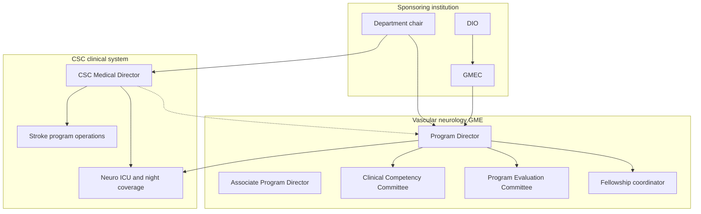

# Vascular Neurology Fellowship and GME

## Opening

An academic Comprehensive Stroke Center reproduces itself through its training programs. The vascular neurology fellowship is the highest-stakes of those programs: it is the source of future attendings, the night-time clinical engine, the most visible ACGME product, and the culture that residents and students absorb. If the fellowship is weak, the CSC will import faculty, over-rely on locums, and lose the academic identity that distinguishes it from a high-volume community center.

The Medical Director may also be the ACGME Program Director. Those two jobs overlap and conflict. Design the operating system for both cases: one person holding both titles, and two people who must share authority without leaving gaps. In either design, the Designated Institutional Official (DIO) and the Graduate Medical Education Committee (GMEC) are not ceremonial. They are the institutional owners of accreditation, and the CSC Medical Director must know how to work with them.

This chapter is an operating manual for fellowship excellence, residency stroke education, and the medical student clerkship as they sit inside a CSC. It is not a rewrite of the ACGME Program Requirements. Confirm the current Vascular Neurology Program Requirements and FAQs on the ACGME Neurology specialty page — the version effective 1 July 2026 and any later update — before asserting a numeric FTE, case-log, or duty-hour rule in a local policy.

Treat learners as part of the clinical system, not as visitors to it. The same night that tests door-to-needle performance tests whether a fellow can make a thrombolysis decision under supervision that is real, documented, and safe.

## Why This Matters

Fellowship quality is a clinical operations problem. Fellows staff nights, run codes, write the first note on transferred ICH, and teach the resident who will be alone with the next alert. A program that cannot graduate competent vascular neurologists will not sustain 24/7 coverage, trial screening, or the teaching culture a CSC surveyor expects to see.

Accreditation risk is organizational risk. An adverse ACGME action lands on the DIO, the chair, and the hospital, not only on the Program Director. Citations for supervision, duty hours, evaluation, or a collapsed board-pass record become visible in the same season as a Joint Commission CSC review. The two review systems ask different questions, but they inspect the same nights, the same ICU, and the same faculty.

The academic CSC is also a workforce strategy. Vascular neurology remains a short training pathway — one ACGME year, which ABPN requires as a continuous block of not less than one-half time — so the program cannot hide a weak curriculum behind a long apprenticeship. Case mix, night autonomy, procedure logs, and scholarly work have to be designed, not hoped for. Residents who rotate on stroke decide whether to apply. Students who see a functional team decide whether neurology is a career. Those decisions are the ten-year staffing plan.

Finally, the Medical Director–Program Director interface is a governance problem. When the titles sit on one person, service pressure will eat educational time unless the chair and DIO protect it. When the titles sit on two people, night coverage, recruitment, and remediation become contested unless a written compact assigns them. Design for both cases now. Do not wait for a site visit or a failed recruitment season to discover that nobody owned the problem.

## Core Framework

Hold three systems in one picture: ACGME accreditation, CSC clinical operations, and the institutional GME hierarchy. The Program Director reports to the DIO for accreditation. The Medical Director reports through hospital and departmental lines for the stroke program. Learners work in both systems every night.



### Dual-hat design: one person or two

Write the interface down. Verbal collegiality is not a control system.

| Function | Dual-hat (one person) | Split roles |
| --- | --- | --- |
| Night coverage | Associate PD or Associate MD countersigns any increase in fellow autonomy or load. | Medical Director owns the coverage product. Program Director owns whether it is an accredited learning experience. Neither changes the night model unilaterally. |
| Remediation | Use CCC process. Escalate to the DIO if the same person is service chief and evaluator. | Program Director owns CCC and due process. Medical Director may bring safety facts; may not dictate dismissal. |
| Case mix / rotations | Protect educational variety; document the rationale in the Annual Program Evaluation. | Joint block-diagram review twice a year. Medical Director supplies volume data. Program Director assigns rotations. |
| Recruitment | Use a second faculty interviewer and a fellow-only session. One person cannot be both future boss and advocate. | Program Director runs the rank list. Medical Director has structured input, not a veto, unless a documented safety concern. |
| Resources | One combined request to the chair that names both hats. | Joint request. Split requests invite the chair to fund neither. |
| DIO | State which hat is speaking. | Program Director is the primary contact. Medical Director attends for safety or coverage. |
| Site visit | One binder, two narratives. Rehearse the dual-hat conflict question. | Two people, one story. Rehearse the compact so the answers match. |

### Competencies, milestones, and the CSC as classroom

Map ACGME competency domains onto CSC work. Do not invent a parallel competency language. Use the current Vascular Neurology Milestones and Supplemental Guide, and assess with more than a global end-of-rotation form.

| Competency domain | CSC experiences that train it | Assessment that survives a site visit |
| --- | --- | --- |
| Patient care and procedural skills | Primary responsibility for AIS, TIA, ICH, aSAH; IVT decisions per the 2026 AIS Guideline (tenecteplase 0.25 mg/kg, max 25 mg, or alteplase 0.9 mg/kg, max 90 mg); EVT selection; ICH reversal; clinic. | Direct observation; mini-CEX; decision log; simulation. |
| Medical knowledge | Vascular and imaging conference; journal club on the 2022 ICH, 2023 aSAH, and 2021 secondary-prevention guidelines. | Structured case discussion; chart-stimulated recall; milestone narrative. |
| Systems-based practice | CSTK/STK/GWTG defect review; telestroke; transfer-center; equity review of reperfusion times. | Quality-project product; chart audit; nursing and transfer-center feedback. |
| Practice-based learning | Personal DTN and decision-log review; morbidity conference; PDSA. | Portfolio; APE contribution. |
| Interpersonal and communication skills | ICU family meetings; telestroke to a spoke ED; disclosure after hemorrhagic transformation. | Observed family meeting; spoke-site feedback; simulation debrief. |
| Professionalism | Fatigue management; handoff integrity; industry boundaries; resident supervision. | Multisource feedback; CCC file. |

Require primary patient-care responsibility. ACGME FAQs are explicit: a consultative service in which fellows only advise other services is not sufficient. Fellows must make orders, admissions, and discharges — including when they supervise residents. Build at least one rotation in which the fellow is the physician of record under attending supervision, not a visitor on someone else's list.

### Volume, case mix, and logs

Do not treat a locally remembered number as an ACGME minimum. Confirm any numeric case-log expectation in the active Program Requirements and the ACGME case-log system. Track a CSC-relevant mix whether or not a given item is a formal log requirement.

| Experience | Design rule |
| --- | --- |
| IV thrombolysis decisions | Log role (independent with oversight, shared, observer), agent, window, and whether advanced imaging was used. 2026 options: tenecteplase 0.25 mg/kg (max 25 mg) or alteplase 0.9 mg/kg (max 90 mg). |
| EVT participation | Log selection role, presence at puncture, and TICI awareness. Observation-only is not enough for every fellow every year. |
| ICH and aSAH | Log severity score (as used locally), reversal, and neurosurgical / neurointerventional interface. |
| Neurocritical care | Dedicated ICU block plus longitudinal nights. Do not count mere presence in the hospital. |
| Outpatient clinic | New and follow-up mix; fellow closes work-ups. Secondary prevention per the 2021 guideline and later updates adopted locally. |
| Neurosonology / vessel imaging | Supervised interpretation; confirm current ACGME expectations. |
| Telestroke | Logged supervised encounters with a faculty quality sample. |
| Scholarly product | One named product, mentor, and deadline. Extensive original research is not expected in one year. |

Review logs monthly. A June surprise that the fellow has seen almost no aSAH is a program-design failure, not a fellow failure. The April 2, 2025 Joint Commission announcement reduced the annual aSAH volume criterion to 10; even at that floor, a one-year fellow can miss the disease if rotations are AIS-heavy. Use transfer agreements and the neuro ICU to guarantee hemorrhagic exposure.

### Night autonomy versus supervision

Write a supervision policy that a night nurse can apply. ACGME supervision language — direct, indirect with direct immediately available, and oversight — must be translated into CSC verbs: who is in house, who is on home call, how fast the attending arrives, and which decisions a fellow may not make alone.

| Decision or action | Default supervision until competency is documented | After documented competency | Never unsupervised |
| --- | --- | --- | --- |
| Activate code stroke and obtain imaging | Indirect; attending aware. | Oversight. | — |
| Give IV thrombolysis | Direct or immediately available review of NIHSS, imaging, contraindications, and consent. | Immediately available review remains the CSC default for safety and CSTK integrity. | Comfort-measures-only conversion in the first hours; pediatric AIS (follow the 2026 pediatric recommendations with named attending involvement). |
| Accept or decline EVT | Attending and neurointervention jointly. | Fellow may present and recommend; attending and operator remain accountable. | Large-core or extended-window calls without attending concurrence. |
| ICH reversal order | Immediately available review of agent, dose, and blood-pressure target. | Same. Reversal is a time-critical safety act; do not use it as an autonomy trophy. | Novel or off-pathway reversal. |
| Transfer acceptance | Attending concurrence. | Fellow may accept on a written pathway with attending callback. | Diversion or capability-exceeding acceptance. |
| Death-by-neurologic-criteria or withdrawal | Attending present or immediately available. | Attending present. | Fellow-only family meeting that changes goals of care. |

Progressive autonomy is competency-based, not calendar-based. A fellow in month two who has been a practicing neurologist for years is not automatically safer at 03:00 than a fellow in month ten who trained in a low-volume center. The Clinical Competency Committee, not the night-float attending of the moment, grants step-ups. Record the grant in the file.

Protect the fellow from two opposite failures. The first is abandonment: home-call attendings who do not answer, or who answer after the drug is given. The second is infantilization: attendings who run every code so the fellow never owns a decision. Site visitors will ask fellows which failure they live with. Believe the answer that is already in the ACGME Resident/Fellow Survey.

### Scholarly requirement

ACGME requires scholarly activity. The Review Committee has said that extensive research is not expected in a one-year fellowship. Presentations at meetings, publications, grand rounds, and departmental conferences all count. Design a default pathway so the requirement does not depend on a fellow already having a dataset.

Assign a mentor and a product by August. Acceptable default products: a systematic case series from the CSC registry; a GWTG or CSTK defect analysis written to publication standard; a protocol or pathway with a methods paper; an abstract to the International Stroke Conference or an equivalent meeting with a manuscript timeline; a quality PDSA with a public poster. A slide deck given once to the department is the floor, not the design target.

Do not consume the entire scholarly requirement with unpaid chart review that only serves a faculty member's promotion. The product must be the fellow's in a way the fellow can describe in a CCC meeting.

### Recruitment, wellness, and site-visit readiness

Recruitment is a year-round system. Confirm the application and matching platform for the upcoming cycle. Publish the night model, case mix, and scholarly expectation honestly. A fellow who expected a research year and received a coverage year is a wellness and accreditation problem.

Wellness is an ACGME requirement and a CSC safety control. Build a backup call schedule that is actually used, a fatigue rule that allows a fellow to come off service without career punishment, and a confidential path to the DIO that does not run through the Medical Director when the Medical Director is the problem. Parental leave, medical leave, and part-time completion (12 months of required rotations over 24 months, ≥6 months per academic year, ABPN approval before a half-time appointment) must be written, not improvised.

Site-visit readiness is a living binder, not a week of theater. Keep current: block diagram and affiliation agreements; rotation goals; supervision and backup policy; CCC and PEC minutes; APE with action plans; fellow files (milestones, evaluations, logs); duty-hour data; ACGME survey action plans; faculty scholarly activity; ABPN take and pass tracking; and a one-page narrative of how CSC case mix supports the curriculum.

### Residency stroke curriculum and the clerkship

Neurology residents must leave the program competent to run a code stroke and to manage the first hours of ICH even if they never take a vascular fellowship. Write rotation goals that are not a copy of the fellowship goals. Residents need: NIHSS reliability; 2026 IVT eligibility including disabling deficits regardless of NIHSS in the 4.5-hour window; when to call intervention; dysphagia and glucose as updated in the 2026 guideline; a first-pass ICH bundle; and honest handoffs.

Do not use the fellow as the only teacher. Faculty must be present at a defined share of codes and at formal teaching. A program in which residents report that "the fellow runs everything and the attending is a signature" will fail both ACGME and CSC culture tests.

For students, define participation. Students may take a history, score an NIHSS under supervision, and present. They may not be the timekeeper of a code, the consenting party, or the person who "just puts in the orders." Offer a half-day of clinic and a structured debrief so the clerkship is not only the ED at 02:00. Career talks belong on the calendar, not only in the last week if someone remembers.

!!! tip "Key Actions"
    Write a one-page Medical Director–Program Director compact this month, even if one person holds both titles. Name who owns night coverage, recruitment, remediation, and the DIO relationship.

    Open the current ACGME Vascular Neurology Program Requirements, FAQs, and Milestones. Highlight every "must." Assign each "must" to a person and a file location.

    Pull the last twelve months of fellow case logs and night-call calendars. If hemorrhagic exposure, clinic, or supervised thrombolysis decisions are thin, change the next block diagram before changing the brochure.

    Sit in on one night of fellow call without announcing a teaching agenda. Measure answer times, attending involvement, and whether the fellow has primary responsibility or only commentary.

    Schedule a 30-minute meeting with the DIO. Bring the compact, the last APE, and the last ACGME survey. Ask what the GMEC already believes about the program.

!!! abstract "Metrics Targets"
    Certification and accreditation floors: maintain ACGME continued accreditation without warning; complete 12 months of required rotations (or the equivalent over 24 months per current ACGME/ABPN rules); document scholarly activity for every graduating fellow; track ABPN take and pass rates against the current ACGME standard.

    Internal CSC targets, labeled as internal: 100% of fellows have a named scholarly mentor and product by 31 August; monthly log review with a documented case-mix correction when a domain is below the program's own exposure standard; attending callback within the locally defined time on 100% of night thrombolysis and EVT-selection calls; duty-hour violations reviewed within seven days; ACGME Resident/Fellow Survey items on supervision, workload, and evaluation at or above the national mean, with a written action plan for any item below.

    Do not invent an ACGME numeric case minimum. Publish the program's own exposure standard and mark it as institutional, not as an ACGME floor.

    Board outcome: every eligible graduate sits for the ABPN vascular neurology examination at the first offering for which the graduate is eligible. Treat non-takes as a program result, not only as a personal choice.

!!! warning "Common Pitfalls"
    Using the fellow as cheap night coverage. If the attending is not truly available, the model is unsafe and unaccreditable. If the fellow never owns a decision, the model is not a fellowship.

    One person holding both Medical Director and Program Director titles without an Associate and without a written recusal path. Service always wins that fight unless the chair funds the educational hat.

    A consult-only fellowship. ACGME FAQs reject a model in which fellows only advise other services.

    Saving scholarly activity for the last quarter. A one-year program that starts the project in March will graduate a slide deck and a resentful fellow.

    Treating the ACGME survey as an attitude problem. The survey is often the only honest sensor for night supervision. Retaliation, even informal, is an institutional failure.

    Allowing residents to learn stroke only from fellows, and students only from residents. The attending line disappears, and so does the academic argument for the CSC.

    Publishing a recruitment pitch that describes a research year the program does not run. Mismatch is a wellness event.

    Waiting for the site-visit announcement to build the binder. ADS discrepancies and missing CCC minutes cannot be backfilled honestly.

!!! success "Implementation Tips"
    If the Medical Director is the Program Director, appoint an Associate Program Director with a written portfolio (evaluation, wellness, or recruitment) and put that person on the CCC. The Associate is the second hat when the incumbent is conflicted.

    If the roles are split, hold a 20-minute standing meeting every two weeks. Use a fixed agenda: nights, logs, a learner in difficulty, faculty behavior, upcoming surveys. End with one decision written down.

    Put thrombolysis and ICH-reversal simulation in the first month, before night autonomy expands. Pair it with a written supervision step-up.

    Use CSTK and GWTG defect review as the systems-based practice curriculum. The fellow who presents a CSTK-09 or CSTK-11 miss learns operations and quality in the same hour.

    Build the scholarly default as a menu, not a hunt. The coordinator keeps a list of registry questions, pathway evaluations, and faculty projects that are truly fellow-owned.

    Rehearse the DIO. Send a one-page program dashboard quarterly so the first conversation is not a citation.

    Invite a spoke-site emergency physician and an ICU nurse to one CCC or PEC meeting per year as guests. Their view of fellow communication is data the faculty do not have.

## How to Do the Work

### Daily / weekly

Review the overnight code-stroke list each weekday morning with the fellow. Ask what the fellow decided, who was called, and how long it took. Close the loop on any night in which the attending was late, the fellow was used as a messenger, or a resident ran a decision without a named supervisor.

Protect the weekly vascular conference. Require faculty presence. Rotate ownership: imaging, hemorrhage, systems cases, and journal club that cites current AHA/ASA guidelines rather than habit.

Check duty hours weekly. A single 80-hour week is a staffing problem to solve now. Confirm the current ACGME work-hour limits and apply them without local "this is a CSC" exceptions.

Hold a short coordinator huddle: evaluations due, upcoming CCC, credentialing issues, and any fellow who has gone quiet. Silence is a wellness signal.

On teaching services, the attending must see the patient and rewrite the plan when the fellow is wrong. Countersignature without contact trains the wrong lesson.

### Monthly / quarterly

Run the Clinical Competency Committee on a fixed cadence. Use milestones, logs, nursing feedback, and at least one direct observation per fellow per quarter. Record step-up or step-down of night autonomy as a CCC action.

Review case mix against the program's exposure standard. If aSAH, clinic, telestroke, or pediatric AIS exposure (the 2026 guideline's first pediatric recommendations belong in the curriculum even if volume is low) is thin, change the next block, arrange an away experience with an affiliation agreement, or add a structured simulation-plus-case module. Document the mitigation in the APE file.

Meet the DIO or the GME director quarterly when the program is stable, monthly when it is not. Bring survey items, duty hours, and any grievance. Do not surprise the DIO with a complaint that nursing has been making for a season.

With the Medical Director and Program Director (or the single incumbent and the Associate), review the night model against CSC metrics: DTN, door-to-device, CSTK-09, hemorrhagic reversal times. If educational design is harming reperfusion, fix the design. If reperfusion pressure is harming education, say so in the same meeting and resource the gap.

Quarterly, audit a sample of telestroke and transfer notes written by fellows. Communication to spoke sites is a CSC product and a fellowship competency.

### Annual / multi-year

Complete the Annual Program Evaluation with the Program Evaluation Committee. Include goals and objectives, resources at each participating site, board outcomes, ACGME survey results, faculty scholarly activity, and fellow comments. Write action plans with owners and dates. This document is the spine of the next site visit.

Recalculate faculty complement and Program Director FTE against the current ACGME minimum. Do not fund the PD role solely from leftover RVUs. If the Medical Director is the PD, show the chair the combined FTE in one number so the job is not two full roles paid as one.

Run recruitment as a project: confirm the platform, update the public description so it matches the night model, train interviewers, and include a fellow-only session. After Match or offer season, debrief yield and attrition.

Prepare the self-study and site-visit packet on the ACGME cycle, not on the announcement. Keep ADS aligned with reality — participating sites, faculty, and scholarly entries that can be defended.

Every two to three years, review whether the program should remain a one-year clinical fellowship or add an optional non-ACGME second year for research or neurointervention pathway planning. A second year is a resource decision, not a way to patch a weak first year. ABPN eligibility still rests on the accredited year.

Plan succession for the Program Director. A single-person program is one departure away from a GMEC emergency.

## Ready-to-Adapt Tools

### Medical Director–Program Director compact (one page)

```
Title: CSC Medical Director–Program Director operating compact
Review cycle: annual, or at any change of incumbent
Parties: [Medical Director], [Program Director], [Chair], copy to [DIO]

1. Night coverage
   Owner of the roster: ________
   Owner of supervision policy: ________
   Second signature required for any increase in fellow autonomy or load: ________

2. Learner in difficulty
   CCC chair: ________
   Safety facts may be brought by: ________
   Dismissal or non-renewal authority: Program Director via CCC and institutional policy
   Recusal rule if one person holds both titles: ________

3. Case mix and block diagram
   Joint review dates: ________
   Tie-break if service and education conflict: [Chair / DIO]

4. Recruitment
   Rank-list owner: ________
   Structured Medical Director input: [form / meeting]
   Public description owner: ________

5. DIO and GMEC
   Primary contact: Program Director
   Medical Director attends when: [safety, coverage, survey]

6. Time
   PD FTE recognized: ________
   MD FTE recognized: ________
   Combined incumbent FTE if dual-hat: ________
```

### Site-visit readiness checklist

- [ ] Current ACGME Program Requirements and FAQs printed or bookmarked; "must" items mapped to files
- [ ] Block diagram matches ADS participating sites
- [ ] Affiliation agreements current
- [ ] Rotation goals and objectives dated and used
- [ ] Supervision, backup, and fatigue policies signed and known to night staff
- [ ] CCC minutes for the accreditation cycle, with milestone decisions
- [ ] PEC minutes and APE with action-plan follow-up
- [ ] Fellow files: evaluations, logs, scholarly product, duty hours, leave
- [ ] Faculty files: scholarly activity, evaluations of faculty
- [ ] ACGME Resident/Fellow and Faculty Survey action plans
- [ ] ABPN take and pass tracking
- [ ] Sample duty-hour reports and responses
- [ ] Single-page narrative: how CSC volume and complexity support the curriculum
- [ ] Rehearsed answers for dual-hat conflict, night supervision, and consult-versus-primary responsibility

### Weekly vascular conference agenda (60 minutes)

| Minutes | Item | Owner |
| --- | --- | --- |
| 0–5 | Overnight codes and complications | Fellow on call |
| 5–20 | One reperfusion or hemorrhagic case with imaging | Assigned fellow |
| 20–35 | Systems case: CSTK/STK/GWTG defect or transfer failure | Fellow + quality lead |
| 35–50 | Guideline or trial teaching point | Faculty |
| 50–60 | Log and supervision issues that cannot wait for CCC | Program Director |

### Night-autonomy step-up form

```
Fellow: ________  Date: ________
Domain: [IVT decision / EVT selection / ICH reversal / transfer acceptance / telestroke]
Evidence reviewed: [direct observations], [log n= ], [simulation], [nursing feedback]
CCC decision: [remain at current level] [step up] [step down]
Attending response-time expectation: ________
Effective dates: ________ to next CCC
Notify: night attendings, nursing supervisors, transfer center
```

### RACI — GME inside the CSC

| Activity | Medical Director | Program Director | Coordinator | DIO / GMEC | Chair |
| --- | --- | --- | --- | --- | --- |
| Supervision policy | C | A/R | C | I | C |
| Night roster | A | C | R | I | C |
| CCC / milestones | C | A | R | I | I |
| APE / ADS | I | A | R | C | I |
| Recruitment rank list | C | A | R | I | I |
| Faculty teaching assignments | C | A | I | I | A |
| Dual-hat recusal | A/R | A/R | I | C | A |

R = responsible, A = accountable, C = consulted, I = informed. When one person is Medical Director and Program Director, the Associate Program Director takes the C or second A on supervision and remediation.

### Rotation goals skeleton (paste into every block)

```
Rotation: ________  Duration: ________  Site: ________
Primary patient-care responsibility: [yes / no — if no, this block cannot be the core inpatient experience]
Competencies emphasized: ________
Must-see diagnoses or decisions: ________
Procedures / interpretations: ________
Supervision level at start / at end: ________
Didactics tied to this block: ________
Evaluation instruments: ________
Duty-hour and backup rules: ________
Faculty of record: ________
```

## Integration With Other Pillars

Leadership and governance (Part II) supply the FTE and the decision rights this chapter consumes. If the Program Director FTE is fictional, the compact is fictional.

The clinical enterprise (Part III) is the classroom. Hyperacute pathways, imaging, ICH/aSAH, neurocritical care, telestroke, and the stroke unit must be safe enough and documented enough to train on. A fellowship cannot compensate for an ungoverned night pathway.

Quality, CSTK/STK/GWTG, and equity (Part IV) are the systems-based practice curriculum. Fellows should present defects, not only interesting scans. Equity gaps in reperfusion time belong in conference.

Interprofessional simulation (Chapter 28) is how night autonomy is earned before it is granted. Trials and registries (Chapter 29) and faculty development (Chapter 30) are how scholarly activity becomes a pipeline rather than a scavenger hunt. Innovation and decision-support tools (Chapter 31) must be taught as governed instruments, not as oracles fellows are left alone with at night.

Strategy and network chapters (Part VII) determine whether the fellow sees a regional system or only one hospital. Elite standing includes a fellowship that others try to copy, not only a DTN trophy.

## Sources

- ACGME. Program Requirements and FAQs for Vascular Neurology (version effective 1 July 2026 and successors). Confirm current "must" statements, Program Director FTE, and case-log rules.
- ACGME. Common Program Requirements (Fellowship), current version.
- ACGME. Vascular Neurology Milestones and Supplemental Guide.
- ACGME. Frequently Asked Questions: Vascular Neurology (including the 08/2020 set and any 2026 update): 12 months may span 24 months with ≥6 months per year; consult-only models are not sufficient; scholarly activity is required though extensive research is not expected; ABPN exam passage is an important outcome.
- American Board of Psychiatry and Neurology. Certification in Vascular Neurology. One ACGME year in a continuous block of not less than one-half time; ABPN approval before a half-time appointment.
- 2026 Guideline for the Early Management of Patients With Acute Ischemic Stroke. *Stroke*. 2026;57(8):e316–e436. DOI 10.1161/STR.0000000000000513.
- Greenberg SM, et al. 2022 ICH Guideline. *Stroke*. DOI 10.1161/STR.0000000000000407.
- 2023 aSAH Guideline. *Stroke*. 2023;54:e314–e370. DOI 10.1161/STR.0000000000000436.
- 2021 AHA/ASA secondary-prevention guideline, unless a later update has been locally adopted.
- Joint Commission DSC / CSC standards (SCS26 and active tables). The April 2, 2025 Joint Commission announcement reduced the annual aSAH volume criterion to 10.
- Alberts MJ, et al. BAC CSC consensus. *Stroke*. 2005. Foundational; not a substitute for current CSC standards.
- Specifications Manual v2026B (posted 02/06/2026; 3Q–4Q 2026 discharges), CSTK and STK sets.
- AHA GWTG-Stroke and Target: Stroke public criteria (AHA page last reviewed 9 September 2022 in the handbook evidence packet).
- Landmark trial families for curriculum: NINDS tPA; ECASS III; HERMES-era EVT; DAWN / DEFUSE 3; SELECT2 / ANGEL-ASPECT / RESCUE-Japan LIMIT; EXTEND-IA TNK; CHANCE / POINT; INTERACT2 / ENCHANTED2 / INTERACT3.
