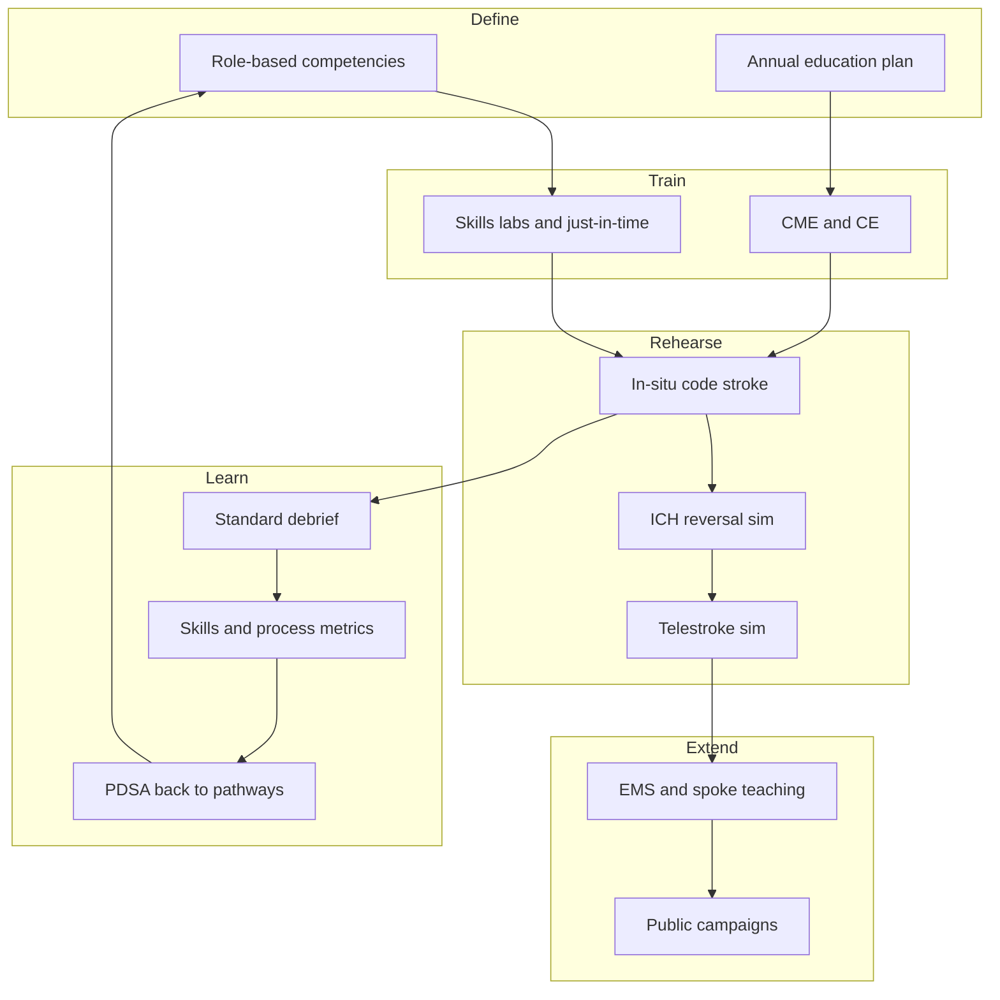

# Interprofessional Education, Simulation, and Community Teaching

## Opening

A Comprehensive Stroke Center that trains excellent fellows and leaves the rest of the team to learn by rumor will fail at 03:00. Reperfusion, ICH reversal, telestroke, and the first hours of aSAH are team sports. Nursing, advanced practice providers, radiology technologists, pharmacists, respiratory therapists, emergency physicians, neurosurgeons, neurointerventionalists, and EMS clinicians either share a mental model or they invent one under time pressure.

The Medical Director owns the education system even when someone else owns the calendar. That system has four layers: role-based competencies and annual skills; a simulation portfolio that includes in-situ code stroke, ICH reversal, and telestroke; EMS and spoke-site teaching that makes the regional hub real; and community campaigns that tell the public what to do without claiming outcome effects the evidence does not support.

Simulation is not a mannequin in a basement. It is a governed method with design, prebrief, facilitation, debrief, and evaluation standards. Community teaching is not a branding exercise. CME and CE are not a pile of certificates. Build them as one operating system, or the CSC will discover during a survey week that education hours were counted and competence was not.

## Why This Matters

Joint Commission CSC certification treats education as a requirement, not a courtesy. Confirm the current education-hour tables and role lists in the active DSC / CSC manual (SCS26 and successors). Historical summaries commonly cited eight hours of annual stroke-specific education for designated staff; treat that figure as historical until the live table is checked. Registry submission and a lecture series that nobody can apply at the bedside will not satisfy a reviewer who asks a night nurse to walk through ICH reversal.

Clinical performance is the other reason. Door-to-needle, door-to-device, CSTK-04 reversal initiation, CSTK-09 arrival-to-puncture, and CSTK-11/12 reperfusion-interval measures move when teams rehearse together. They do not move when only physicians attend grand rounds. INTERACT3 and related ICH bundle work showed that packaged, team-executed care changes outcomes; a slide about the bundle does not.

EMS and the public determine who arrives, and when. Prehospital education that is specific — last-known-well, anticoagulation, glucose, scene time, destination — is part of the CSC job. Public FAST-style campaigns can improve recognition and 9-1-1 use. They have not been shown, on their own, to reproduce HERMES-level outcome shifts. Say what the campaign is for. Do not imply that a billboard is a reperfusion strategy.

Liability and culture sit underneath. An in-situ simulation that is used to shame a unit will end simulation. A debrief that never names a systems cause will end improvement. Interprofessional education is how the CSC practices high reliability: preoccupation with failure, deference to expertise, and a reluctance to simplify what actually happens in a code.

## Core Framework

Treat education as a closed loop: define competence by role, train it, simulate it, measure it, and feed defects back into the next cycle.



### Role-based competencies and annual skills

Write competencies as observable actions, not as attendance. Align them to the work the person actually does on a code, in the ICU, or in clinic.

| Role | Demonstrate annually (not only lecture) | Defects to rehearse |
| --- | --- | --- |
| ED and stroke-unit RN | NIHSS inter-rater session; IVT mix for the formulary agent (tenecteplase 0.25 mg/kg, max 25 mg, or alteplase 0.9 mg/kg, max 90 mg); last-known-well, weight, glucose, dysphagia screen, BP targets. | Wrong last-known-well; delayed weight; BP overshoot after ICH. |
| Neuro ICU RN | Reversal-kit walk-through; ICH bundle; nimodipine timing (CSTK-06); EVD troubleshooting on the unit's actual equipment. | Agent in pharmacy but not at bedside; nimodipine held without a documented reason. |
| Advanced practice provider | Observed code second-chair; order-set integrity; family communication. | Order-set workarounds; undocumented exam. |
| ED physician / hospitalist | 2026 IVT rules including disabling deficits regardless of NIHSS in the 4.5-hour window; when not to delay EVT. | Waiting for a "complete" work-up; withholding IVT because NIHSS is "only" 3 in a disabling syndrome. |
| Radiology technologist | Timed door-to-images run; correct hyperacute protocol; LVO-alert communication. | Reconstruction delays; wrong protocol; alert not fired. |
| Pharmacist | Kit check; dose calculation under time pressure; investigational-drug awareness. | Infusion leftover errors; reversal dose by habit. |
| Neurointerventional team | Night or weekend room-open drill; TICI documentation awareness (CSTK-08, 11, 12). | Parallel-process failure with the ED. |
| Transfer-center / telestroke RN | Recorded dry run with a spoke; closed-loop last-known-well and callback. | Lost last-known-well; no callback number. |

Assign each role a competency owner (nursing education, APP director, medical director, pharmacy). The Medical Director does not teach every skill. The Medical Director does require that an owner, a method, and a record exist.

Separate annual demonstration from just-in-time refreshers. Annual NIHSS and reversal-kit skills belong on a calendar. A new formulary agent, a new imaging reconstruction path, or a new EHR alert needs a just-in-time burst within two weeks of go-live, not "at the next skills day in November."

### Simulation portfolio

Build a small number of high-fidelity scenarios and run them until they are boring. Novelty is the enemy of team memory.

| Scenario | Objective and frequency | Who and where | Linked measures |
| --- | --- | --- | --- |
| In-situ code stroke (IVT and EVT) | Parallel process; 2026 rule: do not delay EVT for IVT or IVT for EVT. Quarterly in the main ED; nights/weekends at least twice a year. | ED CT pathway with the real pager and order set. ED RN, physician, stroke clinician, CT tech, pharmacist. | DTN elements; door-to-imaging; time to intervention alert. |
| ICH reversal | CSTK-04 path, correct agent, BP target, neurosurgery call. Twice a year, including one night. | ED or ICU with the actual kit. RN, physician/APP, pharmacist. | Image-to-agent time; kit completeness. |
| Telestroke | Spoke presents; hub decides; transfer or treat-and-stay. Twice a year per high-volume spoke; annual for low-volume. | Real or mirrored platform. Hub clinician, spoke champion, telestroke RN. | Time to video; last-known-well completeness; decision concordance. |
| aSAH first hours | Recognition, BP, nimodipine plan, vascular imaging, capable bed. Annual, or after any miss. | ED to ICU. ED, stroke, ICU, neurosurgery. | Time to diagnosis; CSTK-03; CSTK-06 awareness. |
| Post-IVT hemorrhage or failed airway | Crisis resource management. Annual. | ED or ICU. Full code team plus stroke. | Role clarity; closed-loop communication. |
| Pediatric AIS awareness | 2026 guideline's first pediatric recommendations; named referral path. Annual tabletop. | ED leadership, stroke, pediatrics liaison. | Time to recognize this is not an adult pathway. |

In-situ beats center-based for pathway integrity. Center-based simulation is still useful for rare procedures, communication, and onboarding. Do not substitute a perfect lab run for an ED run that exposes a badge-reader that does not open at 02:00.

Unannounced in-situ drills have a place. Announce the first several until psychological safety exists. Then use a mix. Never film staff without a written rule. Never use a drill to generate punitive incident reports about individuals. Systems findings go to the stroke quality committee. Individual knowledge gaps go to the competency owner as coaching.

### Debrief standards

Adopt a published debriefing standard and train facilitators to it. The INACSL Healthcare Simulation Standards of Best Practice (2021 edition and any successor) name the debriefing process as a required element, alongside prebriefing, facilitation, professional integrity, outcomes and objectives, evaluation, operations, and simulation-enhanced interprofessional education. Local flavor is allowed. Skipping debrief is not.

| Debrief element | CSC practice |
| --- | --- |
| Prebrief | Purpose, fiction contract, confidentiality. State whether this is a drill or a real patient, and whether the EHR and kit are in play. |
| Time | 20–30 minutes after a 15–20 minute scenario. If the ED cannot stop, debrief within 24 hours; a missed debrief is a failed drill. |
| Method | One trained method (PEARLS, plus-delta, or advocacy-inquiry) so facilitators are interchangeable. Plus-delta for in-situ; advocacy-inquiry for a safety-critical decision. |
| Facilitation | The most senior physician is often the wrong debriefer. Train nursing education, simulation faculty, and at least two physicians. Rotate. |
| Content | Reactions, timeline, gaps, one systems action. If the only output is "the nurse should try harder," the debrief failed. |
| Record | Objectives, attendance by role, time stamps, actions. Close actions at the weekly ops. |
| Psychological safety | Rank is suspended. The Medical Director models being wrong. Using the debrief to perform expertise turns attendance into theater. |

### EMS education

EMS education is a partnership, not a lecture the CSC delivers at people. Agree with agency medical directors on a short list of behaviors: FAST or BE-FAST as the public and dispatch already use; last-known-well from a specific informant; anticoagulant and last-dose; glucose; scene-time discipline; destination aligned to the regional triage plan; prenotification content.

Teach in their settings: shift briefing, station visit, ride-along debrief, and recorded case review of a real call with identifiers removed. Give agencies their own data — prenotification rate, scene time, destination accuracy — rather than a generic slide deck. Do not claim that an EMS lecture series will produce a Target: Stroke Elite Plus result. It can produce better prenotification and fewer destination errors. Measure those.

Include mobile stroke unit crews, if the CSC operates or partners with an MSU, in the same competency system as ED staff. The 2026 AIS Guideline endorses mobile stroke units; endorsement is not a substitute for crew rehearsal.

### Community campaigns without overclaiming

Public campaigns belong in the CSC portfolio. They do not belong in the outcomes slide next to HERMES.

Allowable claims: the campaign teaches a recognition tool (FAST, BE-FAST, or the locally adopted public message); it tells people to call emergency services; it can be evaluated by call-volume, campaign reach, and knowledge surveys; it should be offered in the languages and media the catchment actually uses.

Disallowed implications in public or board materials: that the campaign alone will raise the CSC's mRS 0–2 rate; that a single awareness month is an equity strategy; that FAST is a diagnostic test. Pair community teaching with access work (transport, insurance navigation, clinic capacity) if equity is the stated goal, and say so.

Evaluate campaigns with process and reach metrics. If leadership wants an outcome claim, run it as research with a design, not as a press release.

### CME and CE strategy

Build one academic-year calendar that serves physicians, nurses, APPs, and pharmacists rather than four disconnected series.

| Element | Design rule |
| --- | --- |
| Accreditation | Use the institution's CME office and nursing CE provider. Do not invent certificates. |
| Content mix | At least one session each year on 2026 AIS reperfusion rules; ICH reversal and INTERACT-style bundles; aSAH first hours; CSTK/STK/GWTG measures; equity; and a morbidity or systems case. |
| Interprofessional credit | Design sessions so nursing CE and AMA PRA (or osteopathic equivalent) can be claimed from the same hour when the content supports it. |
| Attendance versus competence | CME hours meet a documentation need. They do not replace demonstrated skills. Record both. |
| Conflict of interest | Industry support, if any, follows ACCME standards. Product theaters are not the ICH-reversal curriculum. |
| Spoke and EMS access | Record and share. A hub-only live series is not a network education system. |
| Survey readiness | A single tracker: name, role, hours, skill demonstrations, simulation attendance. Confirm the current Joint Commission education-hour expectation and exceed it with competence evidence. |

!!! tip "Key Actions"
    Name a single education owner (often the stroke program manager plus a physician lead) and a simulation lead. Put both on the weekly ops agenda.

    Write a one-page competency-by-role matrix this quarter. If a role has hours but no demonstration method, it is not a competency.

    Schedule the next in-situ code-stroke simulation on a night or weekend. If the program has never run one after 17:00, that is the first gap.

    Inventory the ICH reversal kit in the ED and ICU during a walk-through, then run the reversal scenario with the real kit.

    Call the two highest-volume EMS agencies and one spoke ED. Offer them their data and a 20-minute case review, not a 60-minute lecture.

    Review every public-facing stroke message for outcome overclaim. Remove any sentence that implies a campaign reproduces trial results.

!!! abstract "Metrics Targets"
    Certification floor: meet the current Joint Commission CSC education-hour and role-list requirements in the active manual. Confirm the number; do not manage to a remembered historical eight-hour figure without checking.

    Internal targets, labeled as internal: 100% of designated RNs and APPs complete annual demonstrated NIHSS and reversal-kit skills; at least four in-situ code-stroke simulations per year including two off-shift; ICH reversal simulation twice yearly; telestroke simulation with each high-volume spoke at least twice yearly; 90% of simulation events have a completed debrief with one systems action; 100% of those actions have an owner and a due date.

    Process linkage, internal: after a quarter of in-situ simulation, review DTN element misses, CSTK-04 initiation, and prenotification completeness. Simulation is succeeding if those defects change, not if attendance is high.

    Community campaign, internal: languages covering the catchment's major groups; reach and knowledge-survey targets set locally; zero outcome-effect claims in public materials.

    CME/CE: a published annual calendar by 1 July; conflict-of-interest disclosures on file; spoke access to recordings within two weeks.

!!! warning "Common Pitfalls"
    Counting hours and skipping skills. A certificate that the night nurse sat through a webinar will not open a reversal kit.

    Running simulation only on Tuesday at 10:00 with a hand-picked team. The CSC fails on Saturday night with the people who were available.

    Using in-situ drills as a gotcha. Psychological safety dies once; it does not respawn for the next survey.

    Debriefing as a lecture from the Medical Director. If the senior physician talks for twenty minutes, the team has been taught that their view is decoration.

    EMS education as a one-way webinar with no agency data. Agencies already have webinars. They do not already have their prenotification rate discussed without blame.

    Community FAST campaigns in the outcomes section of the board deck. That is an overclaim and it trains executives to expect the wrong thing.

    Letting industry own the only ICH-reversal or LVO-triage teaching. ACCME rules exist. So does credibility.

    Building a pediatric-looking slide and no referral path. The 2026 pediatric AIS recommendations require a named behavior, even if the behavior is "recognize and transfer."

    Treating telestroke simulation as an IT test only. The failure mode is usually the spoken handoff, not the codec.

!!! success "Implementation Tips"
    Start with one scenario and one debrief method. Perfect the in-situ code-stroke run before adding aSAH theater.

    Pair every simulation with a pathway artifact: the order set, the kit, the pager group. If the artifact is wrong, fix the artifact before rerunning the people.

    Put nursing education in charge of the logistics and a trained facilitator in charge of the debrief. The Medical Director's job is to attend, be wrong in public, and resource the systems actions.

    Use CSTK-04, CSTK-09, and prenotification as the scoreboard for the education system. Education committees that only report hours will be ignored.

    Record a 12-minute telestroke model encounter and send it to spokes. Then schedule a live dry run. The recording is the prebrief.

    For community work, partner with existing public-health and EMS messaging rather than inventing a fourth logo. Consistency beats cleverness.

    When a real event matches a recent simulation, say so in the next huddle. That is how staff decide simulation is not theater.

## How to Do the Work

### Daily / weekly

In weekday huddles, name one teaching point from the last 24 hours — a last-known-well error, a kit delay, a telestroke audio failure. Teaching that is adjacent to a real case outperforms a scheduled lecture.

Confirm that new nurses and night-float residents have a named preceptor for the first codes, not only a packet.

If a simulation or skills session is on the week's calendar, protect it the way a case in the angiosuite is protected. Canceling education to "staff the floor" is a decision; record who made it.

Scan public and internal messages for campaign language that overclaims. Stop it before it is quoted.

### Monthly / quarterly

Review the education tracker: hours, skill demonstrations, simulation attendance by shift and by role. If nights are missing, the plan is missing.

Run the scheduled in-situ and reversal simulations. Close last month's debrief actions at the weekly ops. An open action older than 90 days is a governance failure.

Meet EMS agency educators quarterly with a one-page data sheet. Agree on one behavior to improve (prenotification content is the usual first target).

Hold one interprofessional morbidity-and-systems conference each month. CME/CE credit should attach to this hour. Fellows and residents present; nurses and APPs co-present.

Quarterly, audit NIHSS inter-rater agreement on a small paired sample. Education that does not change scoring reliability is not education.

### Annual / multi-year

Publish the academic-year CME/CE and simulation calendar before the year starts. Map it to the current Joint Commission education-hour table and to guideline updates (2026 AIS; 2022 ICH; 2023 aSAH; secondary prevention).

Renew facilitator training. INACSL standards expect professional development of simulationists, not only of learners. A facilitator who has not been observed in two years is a risk.

Re-evaluate community campaign language, languages offered, and partners. Retire campaigns that cannot describe their claim in one sentence.

Every two years, review whether the simulation portfolio still matches the defects the quality system actually sees. If hemorrhagic transformation after IVT is the problem, add that scenario. If the portfolio is unchanged while the defects changed, education is on autopilot.

Budget for kit replacement, telestroke test accounts, and facilitator time. Unfunded simulation becomes an annual skills day in a classroom.

## Ready-to-Adapt Tools

### In-situ code-stroke simulation SOP skeleton

```
Title: In-situ hyperacute code-stroke simulation
Owner: [simulation lead]  Medical sponsor: [Medical Director]
Frequency: [quarterly plus two off-shift runs per year]
Prebrief (5 min): purpose, confidentiality, fiction contract, whether drugs and EHR are live or simulated, stop word.
Scenario stem: [disabling deficit within 4.5 h / unknown onset / transfer EVT] — align details to the 2026 AIS Guideline pathway in use.
Must-run artifacts: pager group, weight, glucose, NIHSS, imaging protocol, IVT agent on formulary, intervention alert.
Do not: surprise a real unstable patient; film without consent policy; enter punitive reports on named staff.
Debrief (20–30 min): trained method; one systems action with owner and date.
Record: attendance by role and shift; time stamps; action; link to quality tracker.
After-action: report at next weekly ops.
```

### ICH reversal simulation checklist

- [ ] First image identified as ICH and time-stamped
- [ ] Severity score started (CSTK-03 pathway)
- [ ] Anticoagulant / antiplatelet history obtained
- [ ] Correct reversal agent and dose from the local protocol
- [ ] Kit at bedside or stated barrier
- [ ] Blood-pressure target named and first intervention given
- [ ] Neurosurgery (and hematology if in the protocol) called
- [ ] Family update assigned
- [ ] Debrief names a systems cause if the agent was late

### Facilitator debrief card

```
1. Reactions: "How did that feel?" (2 min)
2. Facts: reconstruct the timeline from the recorder, not from memory.
3. Plus: what the team wants to keep.
4. Delta: what the team wants to change.
5. Advocacy-inquiry on the critical decision:
   "I saw X, and I was concerned about Y. What was your thinking?"
6. Systems: equipment, staffing, order set, kit, pager, culture.
7. One action: owner, date, where it will be closed.
8. Thank people. End on time.
```

### Education tracker fields (minimum)

| Field | Purpose |
| --- | --- |
| Name, role, unit, shift | Find the night gap |
| Required hours this cycle | Certification table |
| Hours completed and source | CME/CE vs in-service |
| NIHSS demonstration date and rater | Skill, not seat time |
| Reversal-kit demonstration date | CSTK-04 readiness |
| Simulation events attended | Team rehearsal |
| Spoke / EMS sessions delivered | Network duty |
| Overdue flag | Operations agenda |

### RACI — education system

| Activity | Medical Director | Stroke program manager | Simulation lead | Nursing education | EMS liaison |
| --- | --- | --- | --- | --- | --- |
| Competency matrix | A | R | C | R | C |
| In-situ calendar | C | A | R | C | I |
| Debrief standard | A | C | R | C | I |
| CME/CE calendar | A | R | I | C | I |
| EMS curriculum | C | C | I | I | A/R |
| Community claims review | A | R | I | I | C |
| Survey education file | C | A/R | C | C | I |

### Community campaign claim card

```
Campaign name: ________
Recognition tool taught: [FAST / BE-FAST / other]
Call to action: [call emergency services]
Languages and channels: ________
Evaluation: [reach / knowledge survey / 9-1-1 call queries]
Sentence we will not say: "This campaign will improve functional outcomes / mRS / DTN."
Equity pairing (if any): [transport / clinic / insurance navigation] — named or omitted, never implied.
Approvers: Medical Director, public affairs, [community partner]
```

### Monthly interprofessional conference agenda (45 minutes)

| Minutes | Item |
| --- | --- |
| 0–5 | Process metric snapshot: DTN, CSTK-04, prenotification |
| 5–20 | Case or simulation replay with timeline |
| 20–30 | Nursing / pharmacy / EMS view |
| 30–40 | One systems change and owner |
| 40–45 | CME/CE evaluation and next drill date |

## Integration With Other Pillars

Fellowship and GME (Chapter 27) consume this system. Fellows should facilitate some debriefs after they have been trained; they should not be the only teachers. Night-autonomy step-up should require specified simulation, not only a date on the calendar.

Clinical pathways (Part III) are both the subject and the beneficiary. Hyperacute, ICH/aSAH, telestroke, MSU, and EMS chapters define what must be rehearsed. If a pathway changes — tenecteplase adoption, a new reversal agent, a new LVO algorithm — education and simulation are part of the go-live, not a sequel.

Quality and high reliability (Part IV) receive debrief actions and return defects. Equity work (Chapter 26) should shape community language and the languages in which simulation patients speak. A program that simulates only English-speaking patients will be surprised by its real catchment.

Research (Chapter 29) needs staff who can recognize a trial-eligible patient without freezing the clinical pathway. A short simulation on "code stroke plus screening" prevents research from feeling like an ambush.

Innovation and AI (Chapter 31) will drop alerts into the same ED. Train the override and the false-positive, not only the happy-path LVO flag.

Strategy, network, and finance (Part VII) decide whether spoke teaching and EMS data-sharing are funded. Unfunded network education is a press release.

## Sources

- 2026 Guideline for the Early Management of Patients With Acute Ischemic Stroke. *Stroke*. 2026;57(8):e316–e436. DOI 10.1161/STR.0000000000000513.
- Greenberg SM, et al. 2022 ICH Guideline. *Stroke*. DOI 10.1161/STR.0000000000000407.
- 2024 AHA/ASA Performance and Quality Measures for Spontaneous ICH.
- 2023 aSAH Guideline. *Stroke*. 2023;54:e314–e370. DOI 10.1161/STR.0000000000000436.
- Joint Commission DSC / CSC standards (SCS26 and active education tables). Historical summaries often cited eight hours of annual stroke education for designated staff — confirm the live table.
- Specifications Manual v2026B: CSTK-03, CSTK-04, CSTK-06, CSTK-09, CSTK-11, CSTK-12, STK-8.
- INACSL. Healthcare Simulation Standards of Best Practice (2021 revision and successors).
- IHI Model for Improvement / PDSA; AHRQ CUSP; High Reliability Organizing.
- INTERACT2, ENCHANTED2, INTERACT3 — ICH care as a bundle.
- AHA GWTG-Stroke and Target: Stroke public criteria (AHA page last reviewed 9 September 2022 in the handbook evidence packet). Recognition programs are not proof that a community campaign changed mRS.
- Alberts et al., BAC CSC consensus, *Stroke*, 2005.
- ACCME Standards for Integrity and Independence in Accredited Continuing Education, current version.
