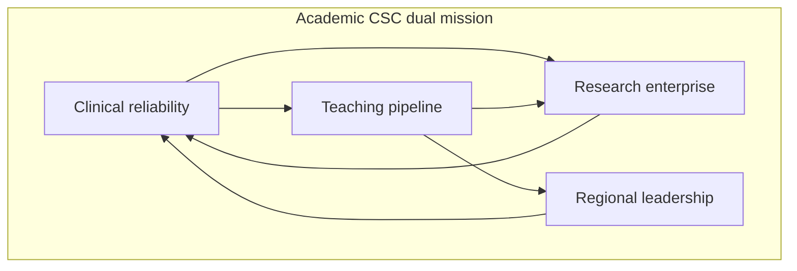

# What an Academic CSC Must Be

## Opening

A Comprehensive Stroke Center is not a plaque, a marketing claim, or a volume trophy. It is a continuously staffed regional capability that can receive, diagnose, treat, and recover the full spectrum of ischemic and hemorrhagic stroke, then send the patient back into a coordinated continuum with a plan that will actually be executed. Certification names that capability. It does not create it.

The Medical Director of an academic CSC holds a harder job than the title implies. The same program must deliver 24/7 reperfusion, open and endovascular treatment of aneurysm and hemorrhage, dedicated neurocritical care, advanced imaging, and reliable interfacility transfer — and must do so while training fellows, running trials, reporting performance measures, and serving as the hub that the region actually uses at 02:00 on a Sunday. Those are not adjacent hobbies. They are one operating system.

This chapter defines that system. It distinguishes CSC from Acute Stroke Ready Hospital, Primary Stroke Center, and Thrombectomy-Capable Stroke Center. It translates “comprehensive” from brochure language into operational requirements. It separates the certified floor from elite performance. And it frames the academic dual mission — clinical care, teaching, research, and regional leadership — as a single accountability, not a menu of optional extras.

Read it as a specification. The later parts of this handbook describe how to staff, govern, measure, and grow the specification. None of that work is coherent if the Medical Director and the executive sponsors disagree about what the program is required to be.

## Why This Matters

Patients do not present by certificate level. They present with large-vessel occlusion, intracerebral hemorrhage, aneurysmal subarachnoid hemorrhage, cerebral venous thrombosis, dissection, and stroke of uncommon cause. The region’s EMS agencies, referring hospitals, and families assume that a hospital calling itself comprehensive can manage all of those presentations without improvisation. When the assumption is wrong, the failure is clinical first and reputational second.

Certification bodies designed a ladder for a reason. An Acute Stroke Ready Hospital exists to recognize, stabilize, image, give intravenous thrombolysis when appropriate, and transfer. A Primary Stroke Center exists to run an organized stroke service with a dedicated unit, protocolized thrombolysis, and secondary-prevention reliability. A Thrombectomy-Capable Stroke Center exists to add mechanical thrombectomy and the post-procedure care that thrombectomy requires. A Comprehensive Stroke Center exists to add the hemorrhagic, complex, neurocritical, and academic functions that the rest of the ladder cannot carry. Collapsing those distinctions in public language, or in internal staffing, produces two predictable failures: over-triage into a program that cannot finish the case, or under-investment in the capabilities the region already believes it has.

Academic status raises the bar rather than lowering it. A university or teaching hospital that holds CSC certification is implicitly promising four things at once: clinical reliability at the highest rung of the ladder, a training environment that produces competent vascular neurologists and interprofessional teammates, a research enterprise that can enroll and complete trials, and a regional leadership posture that makes the surrounding hospitals better, not merely more dependent. Executives sometimes treat the last three as prestige. Surveyors, fellows, trial sponsors, and referring physicians treat them as operations.

The distinction between certified-floor and elite is not vanity. Floor performance keeps the certificate. Elite performance shortens disability, retains faculty, attracts trials, and justifies the capital that a true CSC consumes. The Medical Director who cannot explain that distinction in one page will lose budget arguments to whoever can.

## Core Framework

### The certification ladder is a capability ladder

Use the public Joint Commission architecture as the shared vocabulary, even if the hospital is certified by another body. Disease-Specific Care certification for stroke is offered at four advanced levels: Acute Stroke Ready Hospital (ASRH), Primary Stroke Center (PSC), Thrombectomy-Capable Stroke Center (TSC), and Comprehensive Stroke Center (CSC). CSC is the most demanding. The names describe what a patient can expect to receive on site, not how prestigious the campus is.

| Level | Core job | Typical on-site treatments | What it must still send out | Academic implication |
| --- | --- | --- | --- | --- |
| ASRH | Recognize, stabilize, image, treat or transfer | IV thrombolysis when eligible; basic stroke protocol | Most EVT, most hemorrhage requiring neurosurgery, complex etiologies | Rarely an academic hub; often a spoke the CSC must make reliable |
| PSC | Organized stroke service and unit-based care | IV thrombolysis; protocolized inpatient stroke care; secondary prevention | EVT if not TSC-capable; most aSAH and complex ICH | May host residents; usually not the regional research or fellowship home |
| TSC | Add mechanical thrombectomy and post-EVT care | PSC functions plus EVT and the ICU/step-down care EVT requires | Many aSAH cases, complex open vascular cases, some rare etiologies | May participate in EVT trials; still depends on a CSC for hemorrhage and complexity |
| CSC | Finish the full spectrum and lead the region | 24/7 reperfusion, ICH and aSAH, complex cerebrovascular care, dedicated neuro ICU, advanced imaging, transfers in | Selected ultra-rare or highly specialized referrals by plan, not by surprise | Must carry teaching, research, and regional leadership as operating duties |

Treat this table as a conversation tool with the chief nursing officer, the chair, and the transfer-center director. If any of those three people describe the hospital as comprehensive while the night-call roster cannot cover neurosurgery, neurointervention, and neurocritical care simultaneously, the program is misnamed.

### What “comprehensive” means at 02:00

Historical CSC capability expectations, still used operationally even as numeric volume tables move, include 24/7 vascular neurology, neurosurgery, neurointervention, and neuroradiology; a dedicated neuro ICU; advanced imaging; peer review; research participation; and performance-measure reporting. Translate those phrases into time-stamped operations before anyone argues about marketing.

| Capability | Operational meaning | Failure mode if treated as a slogan |
| --- | --- | --- |
| 24/7 reperfusion | Eligible patients receive IV thrombolysis and, when indicated, mechanical thrombectomy without waiting for weekday staff. Tenecteplase 0.25 mg/kg IV push, max 25 mg, or alteplase 0.9 mg/kg, max 90 mg, is available under a current pharmacy policy. Patients eligible for both IVT and EVT receive both rapidly. | “We do thrombectomy” meaning two operators who are not on a true call schedule |
| ICH and aSAH | Blood-pressure pathway, anticoagulant reversal, neurosurgical and endovascular aneurysm treatment, nimodipine for aSAH, and a documented severity score on arrival | Hemorrhage patients board in a medical ICU with no vascular plan until morning |
| Neurocritical care | A unit that can manage airway, ICP, EVD, vasospasm surveillance, and post-EVT physiology with nurses who do this work every day | “Neuro ICU” as a geographic label on a mixed unit with rotating generalists |
| Advanced imaging | Noncontrast CT, CTA, CTP, MRI/MRA, and catheter angiography available on a defined SLA, including nights and weekends | CTA available, perfusion “if the tech comes in,” MRI after 07:00 |
| Transfers | A published acceptance posture for EVT, ICH, aSAH, and complex stroke, with a single call point and a time standard from request to bed | Transfer-center scripts that say “call back after the intensivist rounds” |
| Peer review and measurement | Regular case review that includes reperfusion delays, hemorrhagic transformation, TICI grade, 90-day mRS, and transfer failures | Morbidity conference that only discusses deaths |
| Research participation | 24/7 screening, coordinator coverage, and a living trial list that the night team can actually use | A grant list on a slide and no weekend enrollment |

“Comprehensive” is therefore a coverage problem, a competency problem, and a data problem. It is not a case-mix problem. A program that cherry-picks weekday LVO and transfers out night aSAH is not comprehensive, regardless of annual volume.

### The academic dual mission is four missions that share one roster

An academic CSC is not a community CSC with a lecture series attached. It is a program that must produce four outputs from the same people, the same beds, and the same night.

- **Clinical reliability.** Every eligible disabling deficit in the 4.5-hour window is treated rapidly, regardless of NIHSS, without delaying for advanced imaging selection when imaging is not required. Extended-window IVT and late-window EVT follow current AHA/ASA criteria, not local folklore. ICH follows the 2022 guideline and the 2024 performance measures. aSAH follows the 2023 guideline. This is the floor under every other mission.
- **Teaching pipeline.** Vascular neurology fellows, residents, advanced-practice providers, nurses, pharmacists, and therapists must be able to practice the real pathway, not a weekday simulation of it. The Medical Director owns the educational contract with GME: supervision ratios, procedure logs, night autonomy rules, and a morbidity conference that teaches rather than humiliates.
- **Research enterprise.** NIH StrokeNet and other multicenter networks are strategic infrastructure, not a hobby of one faculty member. Site PI depth, coordinator FTE, 24/7 screening, and central-IRB fluency determine whether the center can enroll. A center that cannot enroll cannot claim to be changing practice.
- **Regional leadership.** The academic CSC is the hospital that writes destination protocols with EMS, that answers the transfer line, that repatriates when medically appropriate, and that builds spoke capability instead of hoarding every TIA. Leadership is measured by spoke door-to-needle times and failed-transfer rates, not by how many referring logos appear on a slide.

These four missions collide on Friday afternoon. A fellow needs a case. A trial needs an enrollment. A spoke needs a bed. A family needs a goals-of-care conversation. The Medical Director’s job is to pre-decide the collision rules so the night team is not inventing ethics at the bedside.

### Certified floor versus elite performance

Certification asks whether the program can demonstrate the required structures, guidelines, and measures. Elite performance asks whether the program is hard to equal. Manage both, and label them differently on every dashboard so executives cannot confuse them.

| Domain | Certified floor | Elite internal target |
| --- | --- | --- |
| Identity | Current CSC certificate in good standing | The region’s default destination for complexity, including nights |
| IVT speed | Compliance with STK-4 and GWTG achievement measure for timely thrombolysis | Target: Stroke Elite or Elite Plus door-to-needle distribution, not a single median |
| EVT speed | CSTK-09, CSTK-11, and CSTK-12 reported and reviewed | Target: Stroke Advanced Therapy door-to-device performance for both direct and transfer arrivals |
| Hemorrhage | CSTK-03, CSTK-04, CSTK-06 captured; aSAH volume at or above the current eligibility table | Bundle reliability for ICH and a documented vasospasm pathway with outcomes, not just process |
| Outcomes | CSTK-02 and CSTK-10 90-day mRS collected | 90-day follow-up complete enough to drive case review, not just a missing-data rate |
| Teaching | Fellows exist | Graduates are hired as attending-level operators of the pathway |
| Research | “Participation” can be described | Screened-to-enrolled ratio and coordinator coverage that survive weekends |
| Region | Transfer agreements on paper | Spoke coaching, telestroke quality, and repatriation that referring CMOs can describe |

GWTG-Stroke achievement awards require 85 percent on each of seven achievement measures. Bronze is 90 consecutive days, Silver is 12 months, Gold is 24 months. Target: Stroke Honor Roll is 75 percent door-to-needle at or under 60 minutes; Elite is 85 percent at or under 60 minutes; Elite Plus is 75 percent at or under 45 minutes and 50 percent at or under 30 minutes. Target: Stroke Advanced Therapy is 50 percent door-to-device at or under 90 minutes for direct arrivals and at or under 60 minutes for transfers. Treat those numbers as published award criteria, not as the only definition of excellence, and never as a substitute for hemorrhage, equity, or 90-day function.

### Volume is a responsibility, not a definition

Volume tables change. The April 2, 2025 Joint Commission announcement reduced the annual aSAH volume criterion to 10, with the official manual update following in January 2026. Older summaries commonly cited 25 intravenous thrombolysis cases as a CSC eligibility figure; treat that figure as historical and confirm the current E-App and CSC eligibility table in the active DSC manual before quoting any IVT or EVT number in a board packet. Do not let a volume argument replace a capability argument. Ten well-managed aSAH cases with a real on-call aneurysm team are more “comprehensive” than twenty cases concentrated in two operators who are not backed up at night.

The Medical Director should keep a one-page capability statement that executives can read. It lists what the hospital can finish on site at 02:00, what it will accept in transfer, what it will repatriate, and which current eligibility numbers have been confirmed in the live E-App. Update it when the E-App table changes, not when marketing needs a new adjective.

!!! tip "Key Actions"
    Write a one-page CSC specification that names 24/7 reperfusion, ICH/aSAH, neurocritical care, imaging SLAs, transfer posture, peer review, and research screening as operations, not aspirations. Walk that page with the CNO, the chairs of neurology, neurosurgery, and radiology, and the transfer-center director until each person can describe the night coverage model. Label every dashboard row as certified-floor or elite-internal so budget conversations cannot blur them. Confirm the current CSC eligibility table in the live E-App before any external volume claim is made.

!!! abstract "Metrics Targets"
    Floor: current CSC certificate; STK and CSTK measures submitted; GWTG-Stroke achievement measures at or above 85 percent if the hospital pursues awards; aSAH volume at or above the current eligibility criterion of 10 per the April 2, 2025 announcement, reconfirmed in the active manual. Elite-internal: Target: Stroke Elite or Elite Plus door-to-needle distribution; Advanced Therapy door-to-device performance; CSTK-11 TICI 2B or better within 120 minutes of arrival and CSTK-12 within 60 minutes of puncture as reviewed, not merely reported; 90-day mRS completeness high enough for case review; 24/7 trial screening documented. Do not publish an IVT or EVT volume target as a certification number unless it matches the live E-App table.

!!! warning "Common Pitfalls"
    Calling the hospital comprehensive because it has a biplane room. Staffing EVT without a hemorrhage call team and calling the gap a “transfer relationship.” Treating research as a weekday coordinator and teaching as a noon conference. Using GWTG awards as a proxy for CSC readiness. Quoting historical volume numbers from memory in a board slide. Allowing marketing to outrun the night roster. Confusing TSC performance with CSC performance. Measuring only ischemic reperfusion and ignoring ICH reversal, aSAH nimodipine, and 90-day function.

!!! success "Implementation Tips"
    Start with the night. If the 02:00 coverage map cannot support IVT, EVT, aneurysm treatment, and a neuro ICU nurse who knows the pathway, stop the branding conversation. Build the specification as a joint document with nursing and transfer-center leadership so it survives the next Medical Director. Put the certified-floor versus elite distinction in the same slide deck that requests capital. Use the AHA/ASA 2026 AIS guideline, the 2022 ICH guideline, and the 2023 aSAH guideline as the clinical constitution; use the current DSC manual as the certification constitution. Revisit the specification after every survey, every major guideline update, and every loss of a call-panel member.

## How to Do the Work

### Daily / weekly

Walk the pathway, not the office. Once a week, at an unannounced hour that includes at least one night or weekend sample each month, the Medical Director or designee should be able to answer four questions from the current roster: who is giving thrombolysis, who is puncturing for EVT, who is taking an aneurysm to the room, and who is managing the neuro ICU. If any answer is a name that is not actually on call, the specification is already false.

Review the last seven days of reperfusion and hemorrhage cases in a short huddle with the stroke coordinator and the quality abstractor. Look at door-to-needle, door-to-puncture, TICI grade, reversal start time, nimodipine start, NIHSS documentation, and any transfer that was declined or delayed. This is weekly ops, not monthly quality. It is a preoccupation with failure. Escalate a coverage hole the day it appears; do not wait for quarterly stroke executive.

Hold a 15-minute standing conversation with the transfer-center lead. The academic CSC is defined as much by what it accepts as by what it treats. A week of silent declines is a capability event.

Protect one teaching touchpoint that is about the live pathway: a brief case at morning report, a night-float debrief, or a bedside review of why imaging was or was not obtained. Academic identity dies when the only teaching is a scheduled lecture that never sees the code-stroke pager.

### Monthly / quarterly

Run a capability audit against the specification, not against last month’s volume. Confirm that the on-call panels for vascular neurology, neurosurgery, neurointervention, neuroradiology, and neurocritical care were fully staffed. Confirm imaging SLA exceptions. Confirm pharmacy availability of tenecteplase and alteplase and that the current dosing policy matches the 2026 AIS guideline. Confirm that the trial list the night team uses is the same list the research office claims.

Take the certified-floor versus elite scorecard to **monthly quality**; escalate charter and FTE fights to **quarterly stroke executive**. Do not invent a third “stroke operations committee.” CSTK, STK, and GWTG numbers belong on that scorecard, with published award criteria and `internal` aims labeled. So do fellow staffing, coordinator FTE, declined transfers, and repatriation delays. If monthly quality only discusses door-to-needle, it is managing a PSC with a CSC certificate.

Once a quarter, meet the EMS medical directors and the referring-hospital CMOs or stroke leads. Ask them what they believe the academic CSC can finish at night. If their belief exceeds the roster, correct the belief in writing and fix the roster. Regional leadership begins with honest destination language.

Reconfirm the live E-App eligibility table whenever a board, donor, or public-relations request asks for “our volumes versus requirements.” The April 2, 2025 aSAH change is a reminder that memory is not a standards manual.

### Annual / multi-year

Rewrite the one-page specification after the annual review of guidelines, after the survey cycle, and after any material change in faculty, beds, or imaging. Use that rewrite to reset the capital plan: biplane redundancy, ICU beds, coordinator FTE, telestroke connectivity, and mobile stroke unit decisions are specification decisions, not departmental wish lists.

Set a three-year academic plan that names fellowship complement, StrokeNet or equivalent trial posture, and the spoke-development agenda. An academic CSC that cannot say which spokes it will make more capable this year is a hospital with a catchment area, not a system of care.

Decide, in writing, what the program will never claim. Examples: do not claim 24/7 aneurysm coverage if backup is a courtesy call; do not claim research leadership if weekend screening is unpaid goodwill; do not claim elite door-to-needle performance on the basis of a single median. The discipline of refusal is part of the definition.

## Ready-to-Adapt Tools

### Tool 1. One-page CSC specification

Copy this into a single slide or a single sheet. Fill every cell with a name, a time standard, or “not available.” Empty cells are the work.

| Domain | Night owner | Time standard | Backup if primary fails | Current status |
| --- | --- | --- | --- | --- |
| IV thrombolysis | | Door to needle target, elite and floor | | |
| Mechanical thrombectomy | | Door to puncture, direct and transfer | | |
| ICH reversal and BP pathway | | Time to reversal agent | | |
| aSAH securement | | Time from acceptance to treatment plan | | |
| Neuro ICU bed | | Time from request to bed | | |
| CTA / CTP / MRI | | SLA minutes from order | | |
| Transfer acceptance | | Time from first call to yes or no | | |
| 24/7 trial screen | | Who is paged | | |
| Fellow supervision | | Attending response standard | | |

### Tool 2. Night-coverage walk-through agenda (30 minutes)

Use this with the CNO and the transfer-center director.

1. Pull tonight’s actual call roster for vascular neurology, NSGY, IR, NCC, neuroradiology, pharmacy, and the biplane team.
2. Walk one LVO, one ICH on anticoagulation, and one aSAH from EMS notification to disposition.
3. Identify the first step that requires a person who is not on the roster.
4. Identify the first step that requires a bed that is not controlled by the stroke program.
5. Assign a 14-day fix or a public-language change. Do not leave with a “we usually manage.”

### Tool 3. Certified-floor versus elite scorecard skeleton

| Row | Floor definition | This month | Elite definition | This month | Owner |
| --- | --- | --- | --- | --- | --- |
| Certificate status | Current CSC, no open RFI that blocks recertification | | Surveyors can trace any case to a living SOP | | Program director |
| GWTG achievement | 85 percent on each of 7 measures | | Gold plus Target: Stroke Elite or better | | Quality lead |
| Door to needle | Award-eligible distribution | | Elite Plus split: 75 percent at or under 45 min and 50 percent at or under 30 min | | Hyperacute lead |
| Door to device (first pass) | Advanced Therapy award cut reviewed | | 50 percent at or under 90 min direct and 60 min transfer | | IR / stroke lead |
| Puncture / reperfusion clocks | CSTK-09 / 11 / 12 reviewed | | Same-week review of every miss | | IR / stroke lead |
| Hemorrhage process | CSTK-03, 04, 06 submitted | | Bundle reliability with case review | | NCC lead |
| 90-day mRS | CSTK-02 collected | | Completeness adequate for outcome review | | Coordinator |
| Teaching | Fellows on service | | Night pathway run with defined autonomy | | Fellowship director |
| Research | Listed trials | | Weekend enrollments possible | | Research lead |
| Region | Agreements exist | | Spoke DTN and decline rate improving | | Network lead |

### Tool 4. Dual-mission collision rules (SOP skeleton)

Publish these as a one-page SOP. Edit the brackets.

- If a bed, an operator, and a trial enrollment compete for the same patient, clinical eligibility and time-critical reperfusion win.
- If a fellow’s educational need and a time-critical procedure compete, the attending performs or directly supervises; the teaching debrief is mandatory within 24 hours.
- If a spoke transfer and a direct-arrival LVO compete for the same room, the patient with the better expected time-to-reperfusion given current location wins; the loser gets a timestamped recovery plan.
- If research screening would delay IVT or EVT, screening waits.
- If repatriation would place a patient in a hospital that cannot manage the current complication, repatriation waits.
- Exceptions are written, dated, and reviewed at weekly ops (same-week collisions) or monthly quality (measure and policy collisions) by function.

### Tool 5. Capability language audit

Once a quarter, collect the public website, the transfer-center script, the EMS destination card, and the fellowship brochure. Highlight every sentence that implies 24/7 comprehensive care. Match each sentence to a named person on the current night roster. Any unmatched sentence is either rewritten or the roster is fixed within one call-cycle.

## Integration With Other Pillars

This chapter is the specification that the rest of the handbook implements. Leadership and governance convert the specification into decision rights, FTE, and succession. The clinical enterprise chapters turn each row of the capability table into a pathway: EMS, code stroke, imaging, IVT, EVT, neurocritical care, the stroke unit, telestroke, mobile stroke units, and hemorrhagic programs. Quality and safety chapters install the measurement system that can tell certified-floor from elite. Education chapters make the teaching mission real. Research chapters make screening and enrollment a night function. Strategy chapters decide how large the hub should be and what the region owes it. The day-one briefing that follows this part tells a new Medical Director which artifacts prove that the specification exists.

Do not let later chapters become a collection of departmental manuals. If a clinical SOP, a GME policy, and a research SOP describe three different night programs, the academic CSC has already failed its definition.

See also: [Certification Landscape](02-certification-landscape.md) · [Systems of Care](03-systems-of-care.md) · [Day One](04-day-one-briefing.md) · [Medical Director Role](../leadership/05-medical-director-role.md) · [Governance](../leadership/07-governance-architecture.md) · [Core Metrics](../quality/23-core-metrics.md) · [Special Populations](../clinical/42-special-populations.md)

## Sources

- Alberts MJ, et al. Recommendations for comprehensive stroke centers: a consensus statement from the Brain Attack Coalition. *Stroke*. 2005. Foundational CSC concept; not a substitute for current certification standards.
- Alberts MJ, et al. Recommendations for the establishment of primary stroke centers. *JAMA*. 2000. Foundational PSC concept.
- 2026 Guideline for the Early Management of Patients With Acute Ischemic Stroke. *Stroke*. 2026;57(8):e316–e436. DOI 10.1161/STR.0000000000000513. Published online 26 January 2026. IVT dosing, dual IVT/EVT, systems notes.
- Guideline for the Management of Patients With Spontaneous Intracerebral Hemorrhage. *Stroke*. 2022. DOI 10.1161/STR.0000000000000407.
- 2023 Guideline for the Management of Patients With Aneurysmal Subarachnoid Hemorrhage. *Stroke*. 2023;54:e314–e370. DOI 10.1161/STR.0000000000000436.
- 2024 AHA/ASA Performance and Quality Measures for Spontaneous ICH.
- Joint Commission Disease-Specific Care Certification: standards, clinical practice guidelines, and performance measurement. Advanced stroke programs: ASRH, PSC, TSC, CSC. 2026 Stroke Certification Standards (SCS26). Confirm current eligibility tables in the live E-App and active DSC manual.
- The April 2, 2025 Joint Commission announcement reduced the annual aSAH volume criterion to 10. Official manual update January 2026.
- Specifications Manual for Joint Commission National Quality Measures, CSTK v2026B (posted 02/06/2026; 3Q–4Q 2026 discharges).
- STK inpatient stroke measure set; STK-OP v2026B. Confirm current CMS OQR composition rather than assuming historical OP-23 remains mandatory.
- AHA Get With The Guidelines–Stroke achievement and quality awards; Target: Stroke and Target: Type 2 Diabetes public criteria (AHA page last reviewed September 9, 2022, still the public criteria at last verification).
- NIH StrokeNet program documentation: national multicenter trial infrastructure for acute, prevention, and recovery studies.
- Goyal M, et al. HERMES collaboration. *Lancet*. 2016. Pooled EVT effect: mRS 0–2 46.0% versus 26.5%; NNT 2.6 for at least a 1-point mRS shift. Use for operational urgency, not as a local outcome promise.
