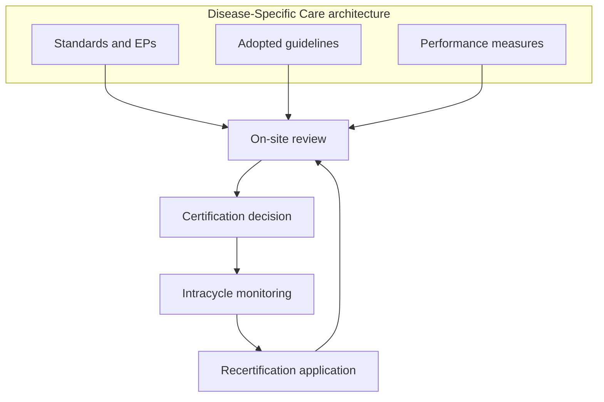

# Certification Landscape and Standards

## Opening

Certification is a public claim that a defined program can be inspected. For an academic Comprehensive Stroke Center, the claim is inspected against a Disease-Specific Care architecture: standards, adopted clinical practice guidelines, and performance measurement. The Medical Director who treats certification as a survey week, or as a nursing-owned binder, will discover during the review that every gap is a leadership gap.

This chapter is a field guide to that architecture. It locates CSC on the ASRH–PSC–TSC–CSC ladder. It explains how The Joint Commission’s Disease-Specific Care model is built, how the 2026 Stroke Certification Standards book sits next to the core DSC manual, and how CSTK, STK, and Get With The Guidelines–Stroke relate without being the same thing. It notes that DNV and HFAP exist as alternate certifiers, without endorsing a vendor. And it tells the Medical Director how to read a standards manual, how a survey cycle actually runs, and what must be confirmed in the live E-App rather than remembered from a slide.

Do not use this chapter as a substitute for the current manuals. Standards move. Volume tables move. The April 2, 2025 Joint Commission announcement that reduced the annual aSAH volume criterion to 10 is the reminder. The job is to know which document is authoritative this month and to keep the program inside it.

## Why This Matters

Surveyors do not grade aspiration. They grade whether the program that exists on the call schedule, in the EHR, and in the last twelve months of measures matches the program described in the application. Academic centers fail that match in characteristic ways: a fellowship brochure that implies 24/7 coverage the roster cannot support, a research slide that substitutes for enrollment operations, a GWTG award used as proof of CSC readiness, or a volume number quoted from an outdated eligibility table.

Certification also allocates capital. Boards fund biplane rooms, ICU beds, and coordinator FTE because a certificate is at risk or because a higher certificate is being pursued. If the Medical Director cannot explain the difference between a DSC standard, an element of performance, a clinical practice guideline the hospital has adopted, and a CSTK measure, the funding conversation will be captured by whoever has a simpler story.

Finally, certification is how the region is allowed to trust destination protocols. EMS agencies and referring hospitals use certificate level as a proxy for what can be finished on site. A CSC that is TSC-capable on weekdays and ASRH-capable at night is not a documentation problem. It is a triage-safety problem. The standards exist to prevent that gap from being papered over.

## Core Framework

### The DSC architecture has three parts, not one binder

When a hospital seeks Joint Commission certification, it must meet the core requirements in the Disease-Specific Care Certification Standards Manual. Those requirements have three components: standards, clinical practice guidelines, and performance measurement. Advanced stroke certification adds clinically specific requirements on top of that core. The 2026 Stroke Certification Standards book (SCS26) collects the stroke-specific expectations across ASRH, PSC, TSC, and CSC. The 2026 Comprehensive Certification Manual for Disease-Specific Care remains the home of the core DSC chapters that apply to every certified program.

Read the three components as a control system:

| Component | What it actually is | What the Medical Director must be able to show |
| --- | --- | --- |
| Standards | Mandatory organizational requirements, each with elements of performance | Policies, committee minutes, privileging files, on-call schedules, and observed practice that match the EPs |
| Clinical practice guidelines | National, evidence-based guidelines the program has formally adopted and operationalized | A dated adoption record, a local protocol that traces to the guideline, and a process for updating when the guideline changes |
| Performance measurement | Specified measures submitted on the required cadence | Complete CSTK and STK abstraction, data-quality review, and a committee that uses the numbers |

“You choose your own measures” is true for core DSC programs that are not in an advanced stroke track. It is not true for CSC. Advanced stroke certification specifies the measure sets. Do not tell a quality director to invent a substitute for CSTK-09.

### The four advanced stroke programs

Joint Commission offers a basic stroke certification in stroke rehabilitation and four advanced stroke certifications: Acute Stroke Ready Hospital, Primary Stroke Center, Thrombectomy-Capable Stroke Center, and Comprehensive Stroke Center. CSC is the most demanding and is designed for hospitals that can receive and treat complex stroke. Use the names precisely in internal documents. Calling a TSC a “comprehensive thrombectomy center” in EMS materials is how destination errors start.

| Program | Designed for | Additional expectation beyond the rung below | Measures the Medical Director should expect to live in |
| --- | --- | --- | --- |
| ASRH | Hospitals or emergency centers with a dedicated stroke-focused program | Rapid recognition, imaging, IVT or transfer | A focused ASRH set; confirm the current table |
| PSC | Hospitals that can run organized stroke care through a dedicated program and unit | Inpatient pathway, secondary prevention, rehabilitation assessment | STK; GWTG if used |
| TSC | Hospitals that perform endovascular procedures and post-procedural care | Mechanical thrombectomy capability and the ICU care it requires | STK plus the CSTK measures required of TSC; confirm the current list |
| CSC | Hospitals that treat the full complex spectrum and function as regional hubs | Hemorrhage, aneurysm, neurocritical care, advanced imaging, peer review, research participation | STK plus the full CSC CSTK set |

Eligibility numbers are not folklore. Confirm every numeric volume criterion in the current DSC manual and the live E-App before it is repeated to a board, a donor, or a journalist. The April 2, 2025 Joint Commission announcement, developed with AHA/ASA, reduced the annual aSAH volume criterion from 20 to 10; the official manual update followed in January 2026. Phrase that change exactly that way. Older summaries commonly cited 25 intravenous thrombolysis cases as a CSC figure; treat that as historical and reconfirm. Do not invent a current EVT or aneurysm-coiling number from memory. If a comparison chart on a consultant slide lists additional counts, verify each cell against the active eligibility table.

Historical CSC capability expectations still used operationally — 24/7 vascular neurology, neurosurgery, neurointervention, and neuroradiology; dedicated neuro ICU; advanced imaging; peer review; research participation; performance-measure reporting — remain the right operational reading even when a specific count changes.

### Alternate certifiers exist; do not outsource judgment to a logo

DNV and HFAP (now operating within ACHC stroke programs) certify stroke centers at multiple levels, including comprehensive designations. Some states recognize more than one certifying body for designation. This handbook does not endorse a vendor. The Medical Director’s duties are the same regardless of logo: know the current standards of the body that will be in the building, know how those standards map to AHA/ASA guidelines, and do not assume that a measure or volume table from one body is valid for another.

If the hospital is considering a change of certifier, treat it as a multi-year operating decision, not a survey-week tactic. Mapping standards, retraining abstractors, rebuilding the quality calendar, and re-explaining destination language to EMS will consume a year of leadership attention. Do that work only for a documented reason.

### CSTK, STK, and GWTG are related and are not interchangeable

Three measurement languages will appear in the same meeting. Keep them separate.

**STK** is the longstanding inpatient stroke core set. Manage these as the process backbone for almost every certified stroke program:

- STK-1 VTE prophylaxis
- STK-2 Discharged on antithrombotic
- STK-3 Anticoagulation for AF/flutter
- STK-4 Thrombolytic therapy
- STK-5 Antithrombotic by end of hospital day 2
- STK-6 Discharged on statin
- STK-8 Stroke education
- STK-10 Assessed for rehabilitation

STK-OP exists for outpatient and emergency-department stroke in v2026B. CMS OP-23 historically tracked head CT/MRI results for stroke; confirm the current OQR set rather than asserting that OP-23 is still mandatory.

**CSTK** is the comprehensive set in Specifications Manual v2026B (posted 02/06/2026; 3Q–4Q 2026 discharges). The population includes ischemic stroke without reperfusion, ischemic stroke with IV/IA/MER, and hemorrhagic stroke. The current measures are:

| Measure | What it captures | Operational owner |
| --- | --- | --- |
| CSTK-01 | NIHSS performed for ischemic stroke before recanalization, or within 12 hours if no recanalization | Vascular neurology / ED |
| CSTK-02 | mRS at 90 days | Coordinator / clinic / follow-up system |
| CSTK-03 | Severity measurement for SAH and ICH | NCC / neurosurgery / ED |
| CSTK-04 | Procoagulant reversal agent initiation for ICH | Pharmacy / NCC / ED |
| CSTK-05 | Hemorrhagic transformation | Stroke / IR / quality |
| CSTK-06 | Nimodipine treatment administered | Pharmacy / NCC / NSGY |
| CSTK-08 | TICI post-treatment reperfusion grade | IR |
| CSTK-09 | Arrival time to skin puncture | IR / hyperacute |
| CSTK-10 | mRS at 90 days: favorable outcome | Follow-up system |
| CSTK-11 | Rapid effective reperfusion from hospital arrival: TICI 2B or better within 120 minutes of arrival | IR / hyperacute |
| CSTK-12 | Rapid effective reperfusion from skin puncture: TICI 2B or better within 60 minutes of puncture | IR |

CSTK-07 is not in the current set. Do not list it as active. CSTK-01 excludes age under 18, length of stay over 120 days, comfort measures on the day of or the day after arrival, elective carotid intervention, and non-recanalization patients discharged within 12 hours. Teach abstractors those exclusions so physicians are not “failing” a measure they were never in.

**GWTG-Stroke** is the AHA quality-improvement registry and recognition program. Achievement awards require 85 percent on each of seven achievement measures: IV thrombolysis in patients who arrive by 3.5 hours and are treated by 4.5 hours; early antithrombotics; VTE prophylaxis; antithrombotics at discharge; anticoagulation for AF/flutter; smoking cessation; and intensive statin at discharge. Bronze is 90 consecutive days, Silver 12 months, Gold 24 months. Quality-measure compliance is added for higher recognition. Target: Stroke (minimum 6 patients) uses door-to-needle distributions: Honor Roll 75 percent at or under 60 minutes; Elite 85 percent at or under 60 minutes; Elite Plus 75 percent at or under 45 minutes and 50 percent at or under 30 minutes. Advanced Therapy is 50 percent door-to-device at or under 90 minutes for direct arrivals and at or under 60 minutes for transfers. Target: Type 2 Diabetes requires a composite of at least 80 percent for 12 months. Target: Stroke Phase III national goals match the Elite and Advanced Therapy primary goals.

GWTG can be the abstraction platform that feeds STK and CSTK. It is not a waiver of either set. A Gold award with incomplete CSTK-02 follow-up is a CSC problem, not a reason for congratulations.

### How to read a standards manual

Open the current SCS26 and the core DSC manual the way an operator reads a procedure, not the way a student highlights a textbook.

1. **Identify the edition and effective date.** Write them on the first page of the program’s working copy. A 2024 printout in a 2026 survey is a finding waiting to happen.
2. **Separate core DSC chapters from stroke-specific chapters.** Core chapters cover program management, delivering or facilitating clinical care, clinical information management, and performance improvement. Stroke-specific chapters add the CSC capabilities.
3. **Read every standard as a sentence that must be true in the building.** Then read every element of performance as a test of that sentence. EPs are what surveyors score.
4. **Read the notes.** Notes often carry the operational definition, the applicable setting, or the exclusion. Skipping notes is how programs overbuild or underbuild.
5. **Map each adopted guideline to a local protocol.** The 2026 AIS guideline, the 2022 ICH guideline, the 2023 aSAH guideline, and the 2021 secondary-prevention guideline are the usual clinical constitution. The adoption record should name the edition and the local SOP that implements it.
6. **Map each measure to a data source, an abstractor, a validation method, and a committee that sees misses within a defined lag.** A measure without an owner is a future RFI.
7. **Build a crosswalk, not a binder.** One row per EP or per measure: evidence location, owner, last review date, last observed gap. Surveyors follow the patient. The crosswalk should let the Medical Director do the same in fifteen minutes.

Scoring language and decision rules change. Confirm the current decision process — including how Requirements for Improvement are issued and how Evidence of Standards Compliance is submitted — in the active certification process guide, not in a colleague’s memory of a prior cycle.

### The survey cycle and the live E-App

Disease-Specific Care certification typically runs on a two-year cycle with an announced or scheduled on-site review, intracycle monitoring, and a recertification application. Confirm the current interval, notice period, and submission deadlines in the active process guide. Organizations due for recertification should expect a Certification Measure Information Process submission in advance of the anniversary; a commonly cited deadline is 60 days prior. Verify the date that applies to this program in the E-App and the current instructions.

The Electronic Application is not clerical. It is a sworn description of the program. Inaccurate service lists, volumes, sites, or measure selections create the wrong survey length, the wrong tracer population, and, if intentional, a credibility problem that outlasts the visit. The hospital must notify the certifier of material changes — ownership, control, location, capacity, services — on the timetable the current APR-equivalent requirements specify.

What to confirm in the live E-App before any leadership meeting that will quote certification facts:

| E-App item | Why it matters | Who confirms |
| --- | --- | --- |
| Program type and sites | A second campus silently added to stroke care can be an unsurveyed site | Program director + accreditation lead |
| Current eligibility volumes | aSAH, IVT, EVT, and aneurysm counts are edition-specific | Medical Director + quality |
| Measure selections | CSTK and STK lists must match what abstractors are running | Quality manager |
| Intracycle / CMIP due dates | Missed submissions become participation findings | Accreditation specialist |
| Contact and leadership names | Surveyors will ask for the people listed | Medical Director |
| Clinical practice guidelines listed | Must match the adoption record and the protocols in use | Medical Director + pharmacy + nursing |
| Transfer and telestroke relationships | Surveyors will test whether they are real | Network / transfer-center lead |

Do not let an administrative coordinator be the only person who has logged in this quarter.

!!! tip "Key Actions"
    Obtain the current SCS26, the current core DSC manual, the CSTK and STK specifications manuals at v2026B or successor, and a live E-App screenshot of eligibility and measure tables. Build a one-page crosswalk from CSC EPs and CSTK measures to owners and evidence locations. Brief the chairs and the CNO on the April 2, 2025 aSAH volume change and on the rule that no other volume number is spoken until it is confirmed in the E-App. Schedule a monthly standards huddle that reviews one chapter and last month’s measure failures together.

!!! abstract "Metrics Targets"
    Floor: all required STK and CSTK measures submitted on cadence; CMIP or equivalent intracycle artifacts on time; zero expired guideline-adoption dates; E-App volumes reconcilable to the registry. Elite-internal: abstract-to-committee lag short enough that a miss is still actionable; data-validation disagreement rate reviewed; GWTG achievement at 85 percent on each of the seven measures if awards are pursued; Target: Stroke and Advanced Therapy distributions used as internal stretch, labeled as such. Confirm any numeric volume criterion against the live eligibility table before it is used as a target.

!!! warning "Common Pitfalls"
    Managing GWTG awards as if they were the CSC measure set. Quoting the historical 25 IVT figure or the pre-2025 aSAH figure of 20 as if they were current law. Listing CSTK-07 as active. Treating DNV or HFAP standards as interchangeable with Joint Commission EPs. Leaving the E-App to a coordinator who cannot answer a clinical question. Updating protocols after a guideline change but not the adoption record, or the reverse. Preparing a binder for surveyors instead of a crosswalk that follows a patient. Using “we follow AHA guidelines” without naming the edition.

!!! success "Implementation Tips"
    Teach the three-component DSC model to every new coordinator, fellow, and vice president in fifteen minutes. Put the current edition date in the footer of every stroke SOP. When the 2026 AIS guideline replaced the 2018 guideline and 2019 update, that footer should have changed. Run one mock tracer each quarter that starts in the E-App description and ends at the bedside. Invite IR, neurosurgery, pharmacy, and GME to the standards huddle at least twice a year so certification is not a neurology-and-nursing private language. If the hospital uses GWTG as the data platform, document the mapping to STK and CSTK so a vendor change cannot erase institutional knowledge.

## How to Do the Work

### Daily / weekly

Know which edition is in force. If a protocol, order set, or fellow lecture still cites the 2018 AIS guideline as current, that is a standards defect, not a style issue. The 2026 guideline is the clinical constitution for AIS until it is replaced.

Once a week, review new CSTK and STK fallouts with the abstractor. Ask two questions only: is the fallout real, and is the cause a documentation failure or a care failure? Assign a 7-day fix for documentation and a PDSA for care. Do not store fallouts for the quarterly committee if the next patient will meet the same failure.

Log into the E-App or require a weekly status from the person who does. Overdue CMIP items and unanswered clarification requests are Medical Director problems.

### Monthly / quarterly

Hold a 45-minute standards and measures huddle. Agenda: one DSC or SCS26 chapter, last month’s CSTK/STK dashboard, one mock EP, and any E-App change. Minutes should name owners and dates, not “continue to monitor.”

Reconcile registry volumes to the eligibility table that will be used at the next recertification. After April 2, 2025, aSAH is a different number than many faculty still recite. Use the reconciliation to teach the faculty, not to surprise them in survey week.

Once a quarter, test guideline adoption. Pull the written adoption record for AIS, ICH, aSAH, and secondary prevention. Confirm that the order sets, pharmacy policies for tenecteplase 0.25 mg/kg max 25 mg or alteplase 0.9 mg/kg max 90 mg, ICH reversal, and nimodipine match those editions. Confirm that extended-window IVT and late-window EVT criteria are written, not verbal.

Once a quarter, walk a surveyor path: ED door, imaging, pharmacy, biplane, ICU, stroke unit, and a follow-up clinic chart that should contain a 90-day mRS. Take notes as if the visit were tomorrow.

### Annual / multi-year

Buy or download the new year’s manuals the week they are released. SCS26 exists for a reason; do not enter a 2026 review with a 2024 working copy. Rebuild the EP-to-evidence crosswalk annually. Reset the mock-survey calendar to the recertification anniversary.

Decide the award strategy separately from the certification strategy. GWTG Gold and Target: Stroke Elite Plus are optional public recognitions with published criteria. CSC certification is the public credential that lets the hospital function as the regional hub. Fund both if the hospital wants both, but never let an award campaign cannibalize CSTK-02 follow-up or hemorrhage reliability.

If a change of certifier is proposed, commission a written gap analysis against both sets of standards, a data-platform plan, an EMS communication plan, and a two-year cost of switching. Bring that package to governance. Do not switch logos to escape a hard finding.

## Ready-to-Adapt Tools

### Tool 1. Manual-reading worksheet

| Field | Entry |
| --- | --- |
| Manual title and edition | |
| Effective date | |
| Chapter / standard / EP | |
| What must be true in the building | |
| Evidence location | |
| Owner | |
| Last observed | |
| Gap | |
| Fix date | |
| Related CPG edition | |
| Related CSTK or STK measure | |

### Tool 2. E-App confirmation checklist

Complete before any external statement about certification.

- [ ] Program type listed matches the certificate on the wall
- [ ] All sites that give stroke care are listed
- [ ] aSAH count uses the current criterion of 10 as announced April 2, 2025, and matches the registry
- [ ] IVT and EVT counts are taken from the live eligibility table, not from memory
- [ ] CSTK and STK measure selections match the abstractor’s current list
- [ ] CSTK-07 is not listed
- [ ] Adopted guidelines name 2026 AIS, 2022 ICH, 2023 aSAH, and the current secondary-prevention edition
- [ ] Leadership contacts can be reached at the numbers listed
- [ ] Intracycle / CMIP due date is on the Medical Director’s calendar
- [ ] Transfer and telestroke relationships listed are active

### Tool 3. Standards-and-measures huddle agenda (45 minutes)

1. Edition check: are we on the current manuals? (2 minutes)
2. One standard, one EP, one piece of evidence. Does the evidence actually prove the EP? (12 minutes)
3. Last month’s CSTK and STK fallouts, split into documentation versus care (15 minutes)
4. One patient tracer from door to 90-day mRS (10 minutes)
5. E-App or intracycle actions due this month (5 minutes)
6. Assignments with dates (1 minute)

### Tool 4. Measure-language translator

Use this in any meeting where someone says “we missed our stroke measure.”

| If they said | Ask | Then manage |
| --- | --- | --- |
| STK-4 | Was the patient in the thrombolytic denominator? | Pathway speed and eligibility documentation |
| CSTK-01 | Was a NIHSS done before recanalization, and do exclusions apply? | ED / neurology exam discipline |
| CSTK-09 / 11 / 12 | Arrival to puncture, and TICI 2B timing from arrival and from puncture | EVT system, not “the IR guy” |
| CSTK-04 | Was a reversal agent indicated and started? | Pharmacy and ICH bundle |
| CSTK-06 | Was nimodipine given for aSAH? | ICU and pharmacy reliability |
| CSTK-02 / 10 | Do we have a 90-day mRS? | Follow-up operations |
| GWTG Gold | Which of the seven achievement measures, and for which months? | Award campaign, not CSC status |
| Elite Plus | Door-to-needle distribution, not a median | Hyperacute system |
| Advanced Therapy | Direct versus transfer door-to-device | Network plus IR |

### Tool 5. Certifier-change RACI

Use only if a change of body is formally under consideration.

| Task | Medical Director | CNO / program director | Quality | Accreditation | Executive sponsor |
| --- | --- | --- | --- | --- | --- |
| Commission gap analysis | A | R | C | R | I |
| Compare measure sets | A | C | R | C | I |
| EMS and public-language plan | A | C | I | C | R |
| Data-platform migration | A | C | R | C | I |
| Go / no-go recommendation | R | C | C | C | A |

R = responsible, A = accountable, C = consulted, I = informed.

## Integration With Other Pillars

Certification is the floor under every other pillar, not a parallel project. Leadership chapters must assign EP owners and protect coordinator FTE. Clinical chapters must produce protocols that can be traced to adopted guidelines. Quality chapters must run STK, CSTK, and GWTG as a single data system with three outputs. Education chapters must teach fellows the current measure definitions so documentation is part of clinical work. Research chapters must not create pathways that conflict with the adopted CPG. Strategy chapters must treat recertification risk as a capital risk. The opening chapter of this part defined what a CSC must be; this chapter defined how that definition is inspected. The next chapter places the certified hub inside a regional system of care.

## Sources

- Joint Commission Disease-Specific Care Certification: three components — standards, clinical practice guidelines, performance measurement. Advanced stroke certifications: ASRH, PSC, TSC, CSC. Stroke rehabilitation as a basic certification.
- 2026 Stroke Certification Standards (SCS26). 2026 Comprehensive Certification Manual for Disease-Specific Care.
- Joint Commission stroke certification program descriptions: CSC is the most demanding advanced stroke certification.
- Joint Commission Online, April 2, 2025: annual aSAH volume criterion reduced from 20 to 10, announced with AHA/ASA; official manual update January 2026. Confirm all other volume criteria in the live E-App and active DSC eligibility table.
- Specifications Manual for Joint Commission National Quality Measures, CSTK v2026B, posted 08/08/2025. CSTK-07 not in the current set. CSTK-01 exclusions as specified.
- STK inpatient stroke measure set; STK-OP v2026B. Confirm current CMS OQR composition; do not assume historical OP-23 remains mandatory.
- AHA Get With The Guidelines–Stroke achievement awards (85 percent on each of 7 measures; Bronze 90 days, Silver 12 months, Gold 24 months) and Target: Stroke / Target: Type 2 Diabetes public criteria (AHA page last reviewed September 9, 2022).
- DNV Healthcare stroke certification programs and ACHC/HFAP stroke certification programs exist as alternate certifiers. No endorsement implied.
- 2026 Guideline for the Early Management of Patients With Acute Ischemic Stroke. *Stroke*. 2026;57(8):e316–e436. DOI 10.1161/STR.0000000000000513.
- 2022 ICH Guideline, *Stroke*, DOI 10.1161/STR.0000000000000407. 2023 aSAH Guideline, *Stroke*. 2023;54:e314–e370. DOI 10.1161/STR.0000000000000436. 2024 AHA/ASA ICH performance measures. 2021 secondary-prevention guideline unless a later AHA update is cited.
- Alberts MJ, et al. Brain Attack Coalition CSC consensus, *Stroke*, 2005; PSC recommendations, *JAMA*, 2000. Foundational, not current certification text.
