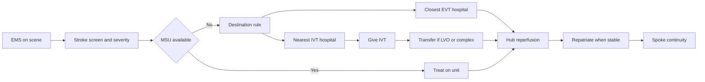

# Systems of Care and the Regional Hub

## Opening

An academic Comprehensive Stroke Center that only optimizes its own door-to-needle time is running a hospital, not a system. Most patients who need the CSC never start there. They start in a living room, an ambulance, a critical-access ED, or a Primary Stroke Center that can give tenecteplase but cannot puncture. The Medical Director’s job includes those first hours, even when the first hours happen on someone else’s floor.

This chapter describes the regional system the academic hub is required to lead: mothership, drip-and-ship, and drip-and-drive models; EMS triage and destination protocols; interfacility transfer; telestroke as a system tool rather than a video consult; and the 2026 AHA/ASA systems notes, including endorsement of mobile stroke units and refined EMS triage. It then names the hub duties that certification language under-specifies: repatriation, spoke capability-building, honest destination language, and the refusal to hoard every low-complexity case.

No health system is named here. The geography will differ. The physics will not. Time to reperfusion and time to aneurysm securement are properties of the whole map, not of the hub’s atrium.

## Why This Matters

The 2026 Guideline for the Early Management of Patients With Acute Ischemic Stroke replaced the 2018 guideline and the 2019 update and made systems of care a first-order clinical issue. Mobile stroke units are now endorsed on the basis of safety and benefit where they exist. EMS triage is refined. Previous guidance that defaulted to the nearest thrombolytic-capable facility is qualified: the local system’s transfer performance and the option of direct transport to the closest EVT-capable hospital must be considered. Patients eligible for both IVT and EVT should receive both rapidly, without delaying thrombectomy. Those sentences are operational instructions to the hub Medical Director, not commentary for a journal club.

A region that improvises destination rules produces two predictable harms. The first is a mothership that is clogged with patients who never needed it, so the patient who did need it waits for a CT scanner or an ICU bed. The second is a drip-and-ship pathway whose transfer clock is a fiction, so a large-vessel occlusion arrives after the window in which the hub’s skill still matters. Both harms are described locally as “EMS issues” or “spoke issues.” Both are hub-design failures.

Academic status intensifies the duty. The university hospital is usually the only institution that can finish aSAH, large ICH, and complex EVT at night. It is also the only institution with the fellows, coordinators, and faculty to teach the spokes. If the hub treats referring hospitals as a feeder and not as a network, the region’s outcomes will plateau at the hub’s door-to-device time and rot everywhere else.

## Core Framework

### Three transport logics, one clock

Name the model before arguing about a single case. Most regions run a hybrid. The Medical Director must know which model is intended for which patient, at which hour, and what happens when the intended model fails.

| Model | What moves | When it is the right default | What breaks it |
| --- | --- | --- | --- |
| Mothership | The patient goes directly to the EVT-capable or comprehensive center | High likelihood of LVO, short additional transport time, or a transfer system that is not actually fast | Hub overcrowding; long bypass of a thrombolysis-ready hospital when IVT would have been much earlier |
| Drip-and-ship | IVT at the first hospital, then transfer for EVT or complex care | First hospital can give IVT quickly and the transfer machine is real | Slow drip, slow door-in-door-out, or a hub that cannot accept |
| Drip-and-drive | IVT at the spoke; the endovascular team travels to the patient | Geography makes patient transfer slower than team travel, and the spoke can host a safe puncture | No privileged visiting team, no biplane-ready spoke, or a legal/credentialing fog |

A fourth pattern appears in the 2026 guideline discussion of mobile intervention teams: the team travels so that EVT treatment starts sooner than it would after interhospital transfer. Compared with alternatives, mobile-team models have shown faster EVT treatment and, in some studies, better outcomes. Treat that as a design option to evaluate, not as a mandate. Most academic CSCs will remain mothership-plus-drip-and-ship hubs. They should still know why drip-and-drive was rejected, in writing.

### EMS triage is a protocol, not a courtesy

Identification of the right destination remains hard. The 2026 guideline says so. That sentence is not permission to leave destination to individual paramedic judgment. It is a requirement to write a regional rule that EMS can execute under stress.

A usable destination protocol has five parts:

1. **A recognition tool.** Cincinnati, FAST, or an equivalent screen that every agency in the region actually uses.
2. **A severity tool if the region routes by LVO likelihood.** LAMS, RACE, FAST-ED, or a locally validated alternative. Pick one for the region. Do not let each agency invent a cut-point.
3. **A destination hierarchy.** Who goes to ASRH, who goes to PSC, who bypasses to TSC or CSC, and who meets an MSU. Include hemorrhagic suspicion: a thunderclap headache with coma is not a “thrombolysis-first” patient.
4. **A time and distance rule.** Bypass is justified only if the additional transport time is defined and if the hub can accept. A bypass rule that ignores hub diversion status is theater.
5. **A closed-loop notification.** Prehospital stroke alerts must land on a single recorded number that starts CT, pharmacy, and the EVT team. Voicemail is not a system.

The 2026 refinement matters: previous guidance emphasized the nearest thrombolytic-capable facility. Current guidance endorses considering the local system of care and direct transport to the closest EVT-capable hospital when interhospital transfer is not reliably fast. The Medical Director must therefore know the region’s actual door-in-door-out and transfer-to-puncture times, not the times in last year’s EMS lecture. If drip-and-ship routinely loses an hour that mothership would not have lost, the destination card should change.

Mobile stroke units, where available, are now recommended over conventional EMS for thrombolytic-eligible patients on the basis of safety and benefit. An academic hub that operates or partners with an MSU must write the unit into the destination protocol, the billing and staffing model, and the quality dashboard. An MSU that is a press-release vehicle and not a dispatched clinical asset is not a 2026-compliant system tool.

### Interfacility transfer is a clinical procedure

Treat transfer like intubation: named indications, named contraindications, a time standard, a fail-forward if the first attempt fails, and a note that another professional can reconstruct.

| Transfer class | Indication | Hub obligation | Spoke obligation | Time standard to define locally |
| --- | --- | --- | --- | --- |
| Hyperacute EVT | LVO after IVT or ineligible for IVT | Immediate yes or no; reserved imaging and room logic | Door-in-door-out discipline; image sharing; airway and BP control | First call to acceptance; acceptance to departure; departure to puncture |
| ICH | Anticoagulated ICH, hydrocephalus, surgical candidate, unstable BP | Reversal advice before the wheels move; ICU bed | Start reversal; treat BP to the current ICH pathway | Call to reversal start; call to ICU bed |
| aSAH | Suspected or confirmed aneurysmal bleed | Accept; protect airway; nimodipine plan on arrival | BP, airway, no unplanned lumbar puncture | Call to acceptance; arrival to securement plan |
| Complex / uncommon | CVT, dissection with hemodynamic lesion, pregnancy, pediatric AIS | Named receiving service, including pediatrics if relevant | Do not delay transfer for complete workup | Call to service identification |
| Repatriation | Stable for a lower-capability hospital | A packet the receiving team can use | A bed and a named accepting physician | Ready-to-place to departure |

The academic hub must publish a single call point. A referring ED physician who is told to “page NSGY, then IR, then the intensivist” will stop calling, or will call late. The transfer center is a clinical instrument. Staff it with scripts that include last-known-well, NIHSS or a severity score, anticoagulant, airway, and the image-share link. Measure declined transfers by reason: no bed, no operator, no indication, or no one answered.

Image sharing is part of the procedure. A second complete CTA at the hub because the disc did not load is a system defect. So is a policy that refuses to accept without a completed MRI at a hospital that does not have one at night.

### Telestroke is a system tool

Telestroke is not a virtual consult service that happens to see stroke. It is how the hub extends a vascular neurologist into a spoke that must decide IVT, start a transfer, or keep a TIA. Build it as infrastructure.

- **Coverage that matches the destination protocol.** If spokes are told they are “telestroke supported 24/7,” the roster must be 24/7, with a failover.
- **A documented time standard.** Door-to-camera, camera-to-decision, decision-to-needle, decision-to-transfer.
- **Privileging and documentation that survive a survey and a lawsuit.** The note must live in the spoke record and be retrievable at the hub.
- **A quality loop.** Telestroke cases are CSTK and STK cases for someone. Review missed IVT, late transfer, and camera downtime with the spoke, not only internally.
- **A teaching function.** The same camera that decides thrombolysis can teach a spoke nurse how to run the next one. If the hub never uses it that way, it is leaving capability on the table.

Telestroke can also support drip-and-drive and MSU models. A physician on camera is part of many MSU crews. Write that into the credentialing plan before the vehicle is wrapped.

### What the 2026 systems notes require the hub to decide

Translate the guideline into local decisions. Do not leave them implicit.

| 2026 systems note | Local decision the Medical Director must record |
| --- | --- |
| MSU endorsed where available | Operate, partner, or document why not, with a review date |
| EMS triage refined; consider direct-to-EVT when transfer is not fast | Publish a destination card that uses real transfer times |
| IVT with TNK 0.25 mg/kg max 25 mg or alteplase 0.9 mg/kg max 90 mg | Same agent and dose across the network if at all possible |
| Treat disabling deficits in 4.5 hours regardless of NIHSS | Teach spokes not to withhold IVT for a “low NIHSS” that is disabling |
| Do not delay EVT for advanced imaging when the patient is otherwise eligible in window | Stop spoke protocols that demand perfusion before transfer of a clear 2-hour LVO |
| Dual IVT and EVT, neither delayed for the other | Drip-and-ship remains default when it is faster to start IVT at the spoke |
| First pediatric AIS recommendations | A written pediatric receiving plan, even if the CSC is an adult hospital |
| Glucose and dysphagia updates | Align spoke and hub order sets so transfer does not reset basics |

HERMES and the subsequent late-window and large-core trials (DAWN, DEFUSE 3, SELECT2, ANGEL-ASPECT, RESCUE-Japan LIMIT) changed who should move. The hub that still writes destination rules as if only a small-core, 6-hour LVO is worth transferring is using a 2015 map.

### Academic hub duties the certificate does not itemize

Certification asks whether the hospital can receive complex patients. Regional leadership asks whether the surrounding hospitals become more capable because the CSC exists.

**Honest destination language.** Public and EMS materials must match night capability. If aneurysm coverage is not truly 24/7, the destination card cannot say that it is.

**Acceptance posture.** A hub that is “on diversion” for stroke every other night is teaching EMS to ignore the card. Diversion rules for stroke should be tighter than general ED diversion and should be reviewed as a quality event.

**Spoke capability-building.** The academic CSC should maintain a living inventory of each spoke: certificate level, IVT agent, door-to-needle distribution, image-share method, telestroke reliability, and the last time a hub faculty member taught on site. The annual plan should name which spokes will move a specific capability this year — a better door-in-door-out, a switch to tenecteplase, a night CT tech, a mock transfer.

**Repatriation.** Keeping every stable post-IVT patient at the hub is how ICU beds disappear for the next aSAH. Write repatriation criteria, a packet, and a time standard. Measure boarded patients who met criteria and did not move.

**Equity of access.** Rural, uninsured, and non-English-speaking patients lose the most when destination rules are informal. Stratify transfer-acceptance and door-in-door-out by geography and payer in the quality system. Informal “we know that ED” pathways are an equity defect.

**Pediatric and uncommon pathways.** The 2026 guideline includes the first pediatric AIS recommendations. An adult academic CSC still needs a written agreement with a pediatric receiving center and a script for EMS.

**Research as a network function.** StrokeNet screening should include telestroke and transfer patients when eligibility allows. A hub that only enrolls weekday direct arrivals is not using the system it claims to lead.

!!! tip "Key Actions"
    Write or rewrite the regional destination card with EMS medical directors using last quarter’s real transfer times, not last year’s lecture. Establish a single recorded call point for EVT, ICH, and aSAH with a yes-or-no standard. Inventory every spoke for certificate level, IVT agent, image share, and door-in-door-out. Put MSU, mothership, and drip-and-ship rules on one page. Schedule repatriation as a standing operations metric, not as a case-management courtesy.

!!! abstract "Metrics Targets"
    Floor: a current destination protocol signed by EMS and the hub; a single transfer call point; telestroke coverage that matches public claims; CSTK-09 / 11 / 12 reviewed for transfer as well as direct arrivals; aSAH and ICH transfers logged. Elite-internal: Target: Stroke Advanced Therapy door-to-device at or under 90 minutes for 50 percent of direct arrivals and at or under 60 minutes for 50 percent of transfers; spoke door-in-door-out improved on a named cohort; decline rate reviewed by reason; repatriation lag for eligible patients tracked; telestroke door-to-decision on a defined standard. Do not set a numeric EMS volume quota as a vanity target.

!!! warning "Common Pitfalls"
    Writing a mothership-for-everyone card that fills the hub with TIAs and starves the LVO of a scanner. Running drip-and-ship without measuring door-in-door-out. Announcing 24/7 telestroke with a weekday roster. Using an MSU as a branding asset. Refusing transfers for “no ICU bed” while boarding stable repatriation candidates. Teaching each spoke a different IVT agent and dose. Demanding perfusion imaging before transfer of an in-window disabling LVO. Hoarding cases that a PSC can finish, then declaring a bed crisis. Leaving pediatric AIS without a written receiving plan.

!!! success "Implementation Tips"
    Start with data the spokes already have: last twenty transfers, last twenty telestroke IVT decisions, last twenty declined calls. Design the destination card in a room that includes EMS, a spoke ED medical director, the transfer-center lead, IR, and neurosurgery. Pilot one change — a bypass rule, a tenecteplase conversion, a door-in-door-out bundle — on two spokes before rewriting the region. Align the network’s IVT agent with the 2026 guideline so the hub pharmacy is not managing two dosing cultures at 03:00. Review every night diversion as a coverage event. Put spoke faculty development on the academic CV template so teaching the region counts as academic work.

## How to Do the Work

### Daily / weekly

Read the transfer log the way the hyperacute log is read. Every weekday, a designated person should list overnight acceptances, declines, door-in-door-out times for arrivals, and any telestroke downtime. The Medical Director reviews exceptions, not every row.

When a transfer goes badly, call the referring physician the same day. The academic hub teaches in that call or it teaches the opposite lesson: that the hub is unreachable.

Once a week, sample one mothership case, one drip-and-ship case, and one telestroke-only case. Ask whether the destination rule, as written, would still have sent that patient to the same place.

Protect EMS feedback. A 10-minute weekly note to agency medical directors about a well-run alert or a broken notification path is worth more than an annual dinner.

### Monthly / quarterly

Publish a one-page network dashboard: transfer volume by indication, median and outlier door-in-door-out, hub arrival-to-puncture for transfers, decline reasons, telestroke decision times, MSU treatment counts if applicable, and repatriation lag. Review it with operations and with at least one spoke lead.

Hold a quarterly regional operations call. Agenda: destination-card exceptions, one shared PDSA, one imaging-share failure, one pediatric or uncommon-case drill, and any guideline update that changes spoke behavior. Minutes go back to every EMS agency and spoke stroke coordinator.

Recompute whether the current mix of mothership and drip-and-ship is justified by measured transfer times. If drip-and-ship is not beating mothership on time-to-puncture for LVO, the card must change or the transfer machine must be rebuilt. That is a quarterly question, not a five-year philosophy.

Quarterly, walk one spoke. See the CT, the thrombolytic locker, the camera, and the ambulance bay. Academic leadership that never leaves the hub is commentary.

### Annual / multi-year

Reset the destination protocol after each major guideline update and after any material change in hub capability — loss of night aneurysm coverage, addition of an MSU, opening of a TSC in the region. Issue a dated card. Retire the previous card in writing.

Build a three-year spoke plan. Name which hospitals should be coached toward more reliable IVT, which should be supported toward TSC-level thrombectomy if that is the regional design, and which should remain high-quality ASRHs. Not every hospital should become a CSC. The hub’s job is a coherent ladder, not a clone army.

Decide the MSU question with a service-area analysis, not a donor opportunity. The 2026 endorsement is real. So are staffing, dispatch integration, and equity of deployment. If the unit will only run weekday business hours in an affluent zip code, it is not a systems-of-care project.

Revisit drip-and-drive only if geography and spoke infrastructure make it faster than transfer. If pursued, treat credentialing, equipment, and quality as a second campus of the EVT program.

## Ready-to-Adapt Tools

### Tool 1. Destination-card skeleton

| If the prehospital picture is | And additional time to CSC or TSC is | Then destinate to | Notify |
| --- | --- | --- | --- |
| Positive screen, low severity, last-known-well under 4.5 hours | Any | Nearest IVT-capable hospital | That hospital’s stroke alert |
| Positive severity tool or suspected LVO | Under the locally defined bypass threshold | Closest EVT-capable hospital | Hub hyperacute team |
| Positive severity tool | Over the bypass threshold | Nearest IVT hospital, then drip-and-ship | Spoke plus hub transfer line |
| Thunderclap coma or suspected aSAH | Any | CSC, not a PSC without NSGY | Hub transfer line, NSGY |
| Anticoagulated with suspected ICH | Any | CSC or nearest hospital that can reverse and transfer | Hub transfer line |
| Pediatric suspected AIS | Any | Written pediatric receiver | Pediatric stroke pager |
| MSU first on scene | — | Treat on unit; destinate per post-treatment rule | Hub and receiving ED |

Fill the time threshold from measured data. Print the date. Destroy prior versions.

### Tool 2. Transfer-acceptance script

The receiving clinician captures, in order:

1. Name of caller, hospital, callback number
2. Last-known-well and onset type, including unknown onset
3. NIHSS or ICH/SAH severity score
4. Airway, BP, glucose
5. Anticoagulant and last dose
6. Imaging done and how it will be shared
7. IVT given, agent, dose, time
8. What is being requested: EVT, ICU, OR, advice only
9. Yes or no, time of decision, destination bed
10. If no: reason, alternative destination, and who will call them

### Tool 3. Spoke capability inventory

| Spoke | Certificate | Night IVT | Agent and dose | Image share | Telestroke | Median DIDO last 20 EVT transfers | Last on-site teaching | This year’s capability goal |
| --- | --- | --- | --- | --- | --- | --- | --- | --- |
| | ASRH / PSC / TSC | Yes or no | TNK 0.25 mg/kg max 25 mg or alteplase 0.9 mg/kg max 90 mg | | | | | |

### Tool 4. Regional operations-call agenda (60 minutes)

1. Safety story from a transfer or telestroke case (5 minutes)
2. Dashboard: DIDO, decline reasons, transfer door-to-device, telestroke downtime (15 minutes)
3. One PDSA report from a named spoke (10 minutes)
4. Destination-card exception review (10 minutes)
5. Guideline or order-set change that spokes must implement (10 minutes)
6. Upcoming drills, MSU or pediatric pathway updates (5 minutes)
7. Assignments (5 minutes)

### Tool 5. Repatriation criteria skeleton

Eligible when all are true:

- No active EVT, surgical, or vasospasm intervention planned in the next 24 hours
- Airway stable or a receiving hospital that can manage the current airway
- Secondary-prevention plan written
- Images and discharge-ready medication list transferred
- Receiving physician named
- Family informed of the reason for return

Not eligible when any is true: unrepaired aneurysm with high rerupture risk, untreated hydrocephalus, unstable ICH, pending 24-hour post-IVT imaging that will change location of care, or no receiving bed.

### Tool 6. Network RACI

| Function | Hub Medical Director | Transfer center | EMS medical director | Spoke stroke lead | IR / NSGY |
| --- | --- | --- | --- | --- | --- |
| Destination card | A | C | R | C | C |
| Acceptance standard | A | R | I | I | C |
| Telestroke coverage | A | I | I | C | I |
| DIDO improvement | A | C | C | R | I |
| Repatriation | A | R | I | C | I |
| MSU deployment rule | A | C | R | I | I |

## Integration With Other Pillars

Systems of care sit on top of the CSC specification and the certification ladder. A hub that is not actually comprehensive at night cannot write an honest destination card. Leadership chapters must give the Medical Director authority over transfer policy, not merely over neurology clinic. Clinical chapters on EMS, hyperacute pathways, telestroke, mobile stroke units, and hemorrhagic programs are the detailed manuals for the rows in this chapter’s tables. Quality chapters must display network measures beside CSTK and GWTG, or the hub will optimize itself and starve the region. Education chapters should send fellows to spokes and bring spoke nurses into hub simulation. Research chapters should screen the transferred population. Strategy chapters decide how large a network the academic center can honestly lead. The next chapter tells a new Medical Director how to learn this map in the first week, before changing it.

See also: [What an Academic CSC Must Be](01-what-academic-csc-must-be.md) · [Certification Landscape](02-certification-landscape.md) · [Prehospital](../clinical/10-prehospital-ems.md) · [Telestroke](../clinical/19-telestroke-networks.md) · [Special Populations](../clinical/42-special-populations.md) · [Network Leadership](../strategy/33-network-leadership.md)

## Sources

- 2026 Guideline for the Early Management of Patients With Acute Ischemic Stroke. *Stroke*. 2026;57(8):e316–e436. DOI 10.1161/STR.0000000000000513. MSU endorsement; refined EMS triage; consideration of direct transport to the closest EVT-capable hospital when transfer is not reliably fast; dual IVT and EVT; first pediatric AIS recommendations.
- 2022 ICH Guideline, *Stroke*, DOI 10.1161/STR.0000000000000407. 2023 aSAH Guideline, *Stroke*. 2023;54:e314–e370. DOI 10.1161/STR.0000000000000436.
- Goyal M, et al. HERMES collaboration. *Lancet*. 2016. EVT benefit used to justify system urgency, not local promises.
- Nogueira RG, et al. DAWN. *N Engl J Med*. 2018. Albers GW, et al. DEFUSE 3. *N Engl J Med*. 2018. Late-window EVT.
- SELECT2, ANGEL-ASPECT, RESCUE-Japan LIMIT: large-core EVT evidence informing who should transfer.
- EXTEND-IA TNK: tenecteplase 0.25 mg/kg versus alteplase before EVT.
- Joint Commission advanced stroke programs (ASRH, PSC, TSC, CSC) as the public language of destination ladders. Confirm current eligibility tables in the live E-App.
- AHA Get With The Guidelines–Stroke Target: Stroke Advanced Therapy criteria: 50 percent door-to-device at or under 90 minutes direct and at or under 60 minutes transfer.
- Specifications Manual, CSTK v2026B: CSTK-09, CSTK-11, CSTK-12 as the hub’s transfer-relevant reperfusion measures.
