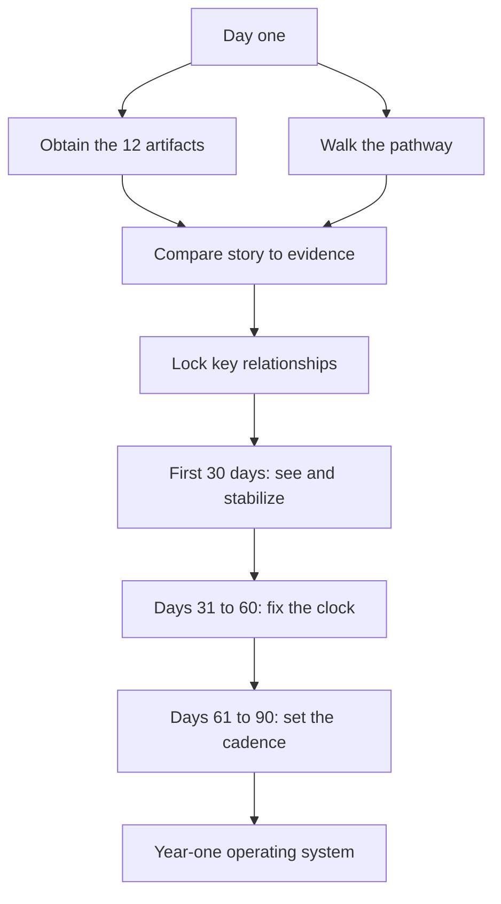

# What Medical Directors Must Know on Day One

## Opening

The first day is not a listening tour. The first day is the start of a listening tour that must be finished before the Medical Director changes a protocol, a call schedule, or a public claim. Academic Comprehensive Stroke Centers punish premature certainty. They also punish a new leader who remains ceremonial for a quarter. The work is to see the real program — the one that runs at 02:00 — fast enough to hold it, and slowly enough not to break it.

This chapter is the brief that should have been in the desk drawer. It names the first-week tour, the twelve artifacts that prove whether a CSC exists, the relationships that can stop or save a pathway, a 30/60/90-day priority map, and a personal operating cadence that will still work after the honeymoon. It assumes the reader has already absorbed what a CSC must be, how certification is inspected, and how the regional hub is supposed to function. If those chapters have not been read, read them before rearranging anyone’s night.

Do not perform a vision speech in week one. Perform curiosity with a deadline.

## Why This Matters

New Medical Directors inherit a story. The story is usually better than the night roster and worse than the people who do the work. Executives will describe a destination center. Fellows will describe a coverage gap. The coordinator will describe a measure that has been red for nine months. Interventional radiology will describe a neurology delay. Neurology will describe an access delay. All of those descriptions can be true at once. The artifacts and the tour are how the Medical Director stops choosing a tribe.

The first ninety days also set the authority the rest of the handbook assumes. If decision rights over transfer policy, order sets, and quality fallout remain informal, later chapters on governance and FTE will be literature. If the Medical Director becomes the person who is called when a transfer is declined, a door-to-needle outlier occurs, or a surveyor asks for an owner, authority has begun. If those calls still go only to a program manager, the title is decorative.

Finally, academic CSCs have a long memory for early unforced errors: a tenecteplase conversion announced before pharmacy and EMS are ready; a fellowship complaint handled as a personality issue; a public “we are Elite” claim that the door-to-needle distribution cannot defend. The 30/60/90 map exists to sequence courage.

## Core Framework

### The first-week listening tour

Tour the pathway in the order a patient meets it, then tour the people who can close it down. Do both in the first five working days, including one evening and, if possible, one weekend hour. Take notes that can be read aloud later. Do not take a reform agenda on a clipboard.

| Day | Where to stand | Who must be heard | What to leave knowing |
| --- | --- | --- | --- |
| 1 | ED door, CT, pharmacy pyxis or thrombolytic locker | ED medical director, charge RN, pharmacist | How a code stroke is actually activated after hours |
| 1 | Transfer center | Transfer-center lead, night coordinator | How a yes or no is produced, and how often the answer is no |
| 2 | Biplane and IR ready room | IR lead, radiology nursing, technologist | Who punctures at night and what delays them |
| 2 | Neuro ICU and stroke unit | NCC lead, unit nurse manager, night charge | What “dedicated neuro ICU” means on this campus |
| 3 | NSGY and the OR board | Neurosurgery lead, OR desk | aSAH and ICH coverage, not the brochure version |
| 3 | Quality and the abstractor’s desk | Quality director, stroke coordinator, abstractor | Which measures are late, which are theater |
| 4 | GME and the fellow room | Fellowship director, current fellows, chief resident | Supervision, autonomy, and the last unsafe night |
| 4 | Research coordinators | Research lead, night-screen plan owner | Whether enrollment is a weekday hobby |
| 5 | EMS and one spoke by phone if not in person | EMS medical director, one referring ED lead | What the region believes this CSC can finish |
| 5 | CNO and executive sponsor | CNO, sponsoring VP or chair | Whether the specification is shared or contested |

Ask the same four questions in every room: what breaks at night; what the last survey or the last serious event actually changed; what the speaker wishes the last Medical Director had stopped doing; and what must not be touched in the first month. Write the answers down. Patterns appear by Friday.

### The twelve artifacts

Request these on the morning of day one, in writing, with a 72-hour due date. A program that cannot produce them is telling the Medical Director what the first quarter is for.

| # | Artifact | What it proves | What a hole means |
| --- | --- | --- | --- |
| 1 | Medical staff bylaws and stroke-program charter | Whether the Medical Director has authority or only a title | Every later fight will be informal |
| 2 | Privileging criteria for vascular neurology, IR, NSGY, NCC | Whether people on call are actually privileged for the work | A coverage fiction |
| 3 | Current on-call schedules for those services, 90 days back | Whether 24/7 is a roster or a hope | The specification is already false at night |
| 4 | Live quality dashboards | Whether anyone can see CSTK, STK, and GWTG without a scavenger hunt | Quality is a quarterly slideshow |
| 5 | Last certification survey report and any open RFIs | What surveyors already know | Repeating a known finding is a leadership choice |
| 6 | Last 12 months of CSTK and GWTG performance | The real ischemic, hemorrhagic, and follow-up record | Awards and anecdotes will otherwise set the agenda |
| 7 | FTE list for coordinators, APPs, abstractors, research staff | Whether the program is staffed or volunteered | Burnout and missing 90-day mRS |
| 8 | Active trial list with night-screening instructions | Whether research is a capability | A slide deck without enrollment |
| 9 | Transfer agreements and the live acceptance script | Whether the hub function exists | Destination language the night cannot honor |
| 10 | Pharmacy policy for tenecteplase and alteplase | Whether dosing matches the 2026 AIS guideline | A dual-agent muddle or an outdated alteplase-only SOP |
| 11 | Imaging SLAs for NCCT, CTA, CTP, MRI/MRA, DSA | Whether advanced imaging is a night service | “We have perfusion” meaning weekday only |
| 12 | Morbidity, mortality, and peer-review minutes, last 12 months | Whether the program can see its own harm | A conference that only discusses deaths, or no conference |

Read the artifacts in a defined order. Bylaws and privileging first — they define what the Medical Director is allowed to do. On-call and FTE second — they define what the building can do. Survey report and twelve-month CSTK/GWTG third — they define what is already known. Pharmacy, imaging, transfer, and trial list fourth — they define the hyperacute and academic truth. Morbidity minutes last, because they only make sense once the other eleven have shown what the program thinks it is.

On the dashboards and the twelve-month file, require the current CSTK set (CSTK-01 through CSTK-06, CSTK-08 through CSTK-12; not CSTK-07), the STK core set, and GWTG achievement plus Target: Stroke distributions. Ask for completeness of 90-day mRS, not only the favorable-outcome rate. Ask for transfer and direct arrival door-to-device separately. Ask for ICH reversal and aSAH nimodipine, not only door-to-needle.

### Relationships that can stop or save the pathway

Titles differ. Functions do not. Secure a working alliance with each of the following in the first two weeks. A 30-minute meeting with a purpose beats a welcome lunch.

| Partner | Why the relationship is load-bearing | First conversation |
| --- | --- | --- |
| Chief nursing officer | Nurses own the clock, the unit, and most of the survey evidence | Night staffing of ED, ICU, and stroke unit; coordinator reporting line |
| Quality director | CSTK, STK, GWTG, and survey live or die here | Abstractor FTE, data lag, last RFI |
| EMS medical director | Destination cards are written with this person or they are fiction | Last quarter’s bypass and notification failures |
| Interventional radiology / neurointervention | EVT is a service line, not a consult | Night backup, CSTK-09 / 11 / 12, room competition with other emergents |
| Neurosurgery | ICH and aSAH are how CSC differs from TSC | Call panel, EVD, aneurysm securement, ICU partnership |
| Neurocritical care | The unit is the product | Bed control, vasospasm pathway, who writes the hemorrhage orders |
| Radiology / neuroradiology | Imaging SLA is a clinical outcome | Night CTA/CTP, who reads LVO, MRI after hours |
| Pharmacy | Tenecteplase and reversal agents are either present or they are not | Current TNK/alteplase policy; reversal stock; nimodipine |
| GME / fellowship director | Fellows can make the night safer or more dangerous | Supervision, duty hours, the last unsafe handoff |
| Transfer-center director | Acceptance posture is a public clinical act | Decline reasons, single call point, scripts |
| Executive sponsor / chair | Capital, conflict, and cover | What “comprehensive” is allowed to cost |
| Research lead | StrokeNet is infrastructure | Night screening, coordinator backup, competing trials |

Do not outsource these alliances to the stroke coordinator. The coordinator should attend many of them. The Medical Director should own them.

### 30 / 60 / 90

The map is a discipline against doing everything and a discipline against doing nothing.

**Days 1–30 — See and stabilize.** Finish the tour and the twelve artifacts. Identify any coverage hole that makes a public CSC claim false and close it or change the claim. Freeze non-urgent protocol rewrites. Stand in the existing huddles rather than inventing new ones. Meet the load-bearing relationships above. Deliver a two-page findings note to the CNO and the sponsor: what is true at night, what the measures say, what will not be changed this month, and the two or three risks that cannot wait.

**Days 31–60 — Fix the clock.** Pick one hyperacute clock and one hemorrhage clock. Typical pair: door-to-needle distribution and time-to-reversal, or transfer door-to-puncture and nimodipine reliability. Use IHI Model for Improvement and a written PDSA, not a memo. Confirm that pharmacy policy matches tenecteplase 0.25 mg/kg max 25 mg or alteplase 0.9 mg/kg max 90 mg. Confirm the live E-App eligibility table, including the aSAH criterion of 10 as announced April 2, 2025. Start attending EMS and spoke conversations with data, not introductions.

**Days 61–90 — Set the cadence.** Install the operating rhythm that will still exist in month eighteen: weekly exception review, monthly operations committee, quarterly regional call, quarterly mock tracer. Publish the certified-floor versus elite scorecard. Name EP owners for the current SCS26 crosswalk. Agree with GME on night supervision rules. Agree with research on weekend screening. Present a 12-month plan that a sponsor can fund.

Do not attempt a tenecteplase conversion, an MSU launch, a certifier change, or a fellowship expansion in the first 90 days unless the artifact review shows that delay itself is unsafe. Sequence those into year one.

### Personal operating cadence

The Medical Director needs a calendar that makes preoccupation with failure automatic.

| Horizon | Cadence | Duration | Non-negotiable content |
| --- | --- | --- | --- |
| Daily | Exception page and transfer-decline review | 15 minutes | Overnight reperfusion, hemorrhage, declines |
| Weekly | Pathway huddle with coordinator and abstractor | 30 minutes | Fallouts, coverage holes, one teaching case |
| Weekly | Visible presence on the unit or in ED | 30–60 minutes | Night or weekend sample at least monthly |
| Monthly | Stroke operations committee | 60 minutes | CSTK / STK / GWTG, FTE, transfers, PDSA |
| Monthly | One-to-one with CNO or program director | 30 minutes | Staffing and authority |
| Monthly | One-to-one with IR and with NSGY | 20 minutes each | Clock and call panel |
| Quarterly | Regional EMS / spoke call | 60 minutes | Destination card and DIDO |
| Quarterly | Mock tracer and morbidity conference | 90 minutes | A live case from door to 90-day mRS |
| Quarterly | Research and GME review | 45 minutes | Screening, supervision, fellow safety |
| Annual | Specification rewrite and E-App confirmation | Half day | What the CSC will claim next year |

Protect the cadence in the appointment letter if possible. A Medical Director who is 0.1 FTE and fully clinically booked will run a ceremonial program. If the FTE does not match the cadence, say so in the 30-day findings note.

!!! tip "Key Actions"
    Send the twelve-artifact request on the morning of day one with a 72-hour clock. Walk the pathway including one night or weekend sample in week one. Meet CNO, quality, EMS, IR, NSGY, NCC, radiology, pharmacy, and GME before changing an order set. Write a two-page findings note by day 30. Pick one ischemic clock and one hemorrhage clock for days 31–60. Install the weekly, monthly, and quarterly cadence by day 90. Confirm the live E-App before repeating any volume number.

!!! abstract "Metrics Targets"
    Floor by day 30: all twelve artifacts in hand or a named gap; current on-call panels without silent holes; last survey RFIs listed with owners. Floor by day 90: STK and CSTK submission on cadence; GWTG achievement measures visible; pharmacy policy aligned to the 2026 IVT doses; aSAH volume reconcilable to the current criterion of 10. Elite-internal, labeled as such: Target: Stroke Elite or Elite Plus door-to-needle distribution; Advanced Therapy door-to-device for direct and transfer; CSTK-11 and CSTK-12 reviewed; 90-day mRS completeness adequate for case review. Do not announce award targets until the twelve-month file has been read.

!!! warning "Common Pitfalls"
    Delivering a vision speech before walking the night. Choosing neurology’s story or IR’s story instead of the artifacts. Rewriting the thrombolysis SOP in week two. Ignoring bylaws and then discovering there is no authority to appoint an associate or to remove a call-panel member. Treating the coordinator as the entire quality system. Missing GME and research until a fellow or a sponsor complains. Quoting historical IVT volume figures from memory. Declaring a culture of excellence while skipping morbidity minutes. Filling the first ninety days with meetings that produce no two-page note and no cadence.

!!! success "Implementation Tips"
    Put the twelve artifacts in a shared folder that the sponsor can see. Use the same four questions on every stop of the tour so Friday’s synthesis is possible. Take a fellow or the coordinator on parts of the tour; they will hear what the new director is not yet allowed to hear. When a coverage hole is found, fix the roster or the public language within one call cycle. Borrow the existing huddle rather than inventing a competing one. Write the 30-day findings note as operations, not as a critique of the prior director. Schedule the next four quarterly regional calls before day 90 so the network sees a calendar, not a personality.

## How to Do the Work

### Daily / weekly

For the first month, end each day with a six-line log: what was seen, who was heard, which artifact arrived, which hole is now known, what was promised, and what will not be decided yet. The log becomes the 30-day note.

Take overnight exception review from the first Monday. If no one currently compiles overnight reperfusion and transfer declines, that is the first process the Medical Director should ask the coordinator to stand up. Do not wait for the perfect dashboard.

Hold the weekly 30-minute huddle even if the official committee is monthly. The huddle is how the director learns the abstractor’s name and the measure language the surveyor will use.

Protect one unscheduled hour on the floor. New directors who live in conference rooms inherit conference-room programs.

### Monthly / quarterly

Use the first operations committee the Medical Director chairs to reset the agenda, not to add a slide. Required standing items: coverage exceptions, CSTK/STK/GWTG, one PDSA, transfer declines, pharmacy and imaging SLA breaches, fellow safety, trial screening. Time-box announcements.

By the first quarterly date, run a mock tracer that starts at the E-App description and ends at a 90-day mRS. Invite the sponsor. A sponsor who has walked the tracer funds differently.

By the first quarterly regional call, bring measured door-in-door-out and decline reasons. Do not use the first call as a meet-and-greet only.

Reconfirm FTE against the cadence. If the coordinator is abstracting, running GWTG, teaching EMS, and covering research screens, the 90-day plan must include a staffing request or a deliberate reduction in scope.

### Annual / multi-year

The first year is for installing an operating system that outlasts the director. By month twelve the program should have a living specification, a current EP crosswalk, a regional destination card with a date, a funded coordinator and research-screen plan, an associate or successor in view, and a quality calendar that does not depend on survey panic.

Do not measure the first year by a single award. GWTG Gold and Target: Stroke Elite Plus are useful if the underlying distributions are real. They are a poor substitute for closed RFIs, a functioning night panel, and 90-day follow-up.

Write the year-two plan only after the first survey cycle or the first full annual measure year under the new cadence, whichever comes first. Until then, resist strategic expansion that assumes the floor is solid.

## Ready-to-Adapt Tools

### Tool 1. Day-one artifact request

Copy into an email to the program director, quality director, medical-staff office, pharmacy, radiology, transfer center, GME, and research lead.

Please provide the following within 72 hours, as current versions:

1. Medical staff bylaws sections that govern the stroke program, plus the program charter or medical-director position description
2. Privileging criteria and current privilege lists for vascular neurology, neurointervention, neurosurgery, and neurocritical care
3. On-call schedules for those services for the past 90 days and the next 30 days
4. Access to the live stroke dashboards and the name of the person who maintains them
5. The most recent certification survey report, RFIs, and evidence-of-compliance submissions
6. Twelve-month CSTK, STK, and GWTG reports, including Target: Stroke distributions and 90-day mRS completeness
7. FTE list for coordinators, APPs, abstractors, and research coordinators, with reporting lines
8. Active trial list and the night-screening SOP
9. Transfer agreements, the live acceptance script, and last quarter’s decline log
10. Pharmacy policies for tenecteplase, alteplase, ICH reversal, and nimodipine
11. Imaging SLAs and last quarter’s exceptions for NCCT, CTA, CTP, MRI/MRA, and DSA
12. Morbidity, mortality, and peer-review minutes for the past 12 months

### Tool 2. Listening-tour question card

Ask at every stop:

1. What breaks at night or on the weekend?
2. What did the last survey or the last serious event actually change?
3. What should be stopped in the next 90 days?
4. What should not be touched in the next 30 days?
5. If one FTE or one piece of equipment could be added, what would it be?
6. Who else should be heard this week?

### Tool 3. 30-day findings note template

- **Night truth.** Coverage map for IVT, EVT, aneurysm, NCC, imaging.
- **Measure truth.** CSTK, STK, GWTG, 90-day mRS completeness, transfer door-to-device.
- **Authority truth.** What the bylaws actually give this role.
- **Network truth.** What EMS and one spoke believe versus what the roster can finish.
- **Academic truth.** Fellow safety and weekend trial screening.
- **Will not change this month.** List.
- **Cannot wait.** Two or three items with owners and dates.
- **FTE versus cadence.** Whether 0.X Medical Director time can run the calendar.
- **E-App confirmation.** aSAH and other eligibility numbers as they stand in the live table.

### Tool 4. 30 / 60 / 90 checklist

**By day 30**

- [ ] Twelve artifacts received or gaps named
- [ ] Pathway walked, including one off-hours sample
- [ ] Load-bearing relationships opened
- [ ] Two-page findings note delivered
- [ ] Silent night-coverage hole closed or public language changed
- [ ] Existing huddles attended; no competing meeting invented

**By day 60**

- [ ] One ischemic clock PDSA running
- [ ] One hemorrhage clock PDSA running
- [ ] Pharmacy policy matched to 2026 IVT dosing
- [ ] E-App eligibility table confirmed
- [ ] EMS and one spoke meeting held with data
- [ ] Abstractor-to-director weekly huddle stable

**By day 90**

- [ ] Operations committee agenda reset
- [ ] Certified-floor versus elite scorecard published
- [ ] Weekly / monthly / quarterly cadence on calendars
- [ ] EP owners named for the current manual
- [ ] GME night-supervision rules written
- [ ] Research weekend-screening plan written
- [ ] Next four regional calls scheduled
- [ ] Twelve-month plan presented to the sponsor

### Tool 5. First operations-committee agenda (60 minutes)

1. Coverage exceptions since the last meeting (10 minutes)
2. CSTK / STK / GWTG and 90-day mRS completeness (15 minutes)
3. Active PDSA: ischemic clock (5 minutes)
4. Active PDSA: hemorrhage clock (5 minutes)
5. Transfer declines and DIDO (10 minutes)
6. Pharmacy, imaging SLA, trial screening (5 minutes)
7. Fellow or staff safety item (5 minutes)
8. Assignments and dates (5 minutes)

### Tool 6. Relationship tracker

| Partner | Date of first meeting | Commitment made | Follow-up date | Open conflict |
| --- | --- | --- | --- | --- |
| CNO | | | | |
| Quality | | | | |
| EMS | | | | |
| IR | | | | |
| NSGY | | | | |
| NCC | | | | |
| Radiology | | | | |
| Pharmacy | | | | |
| GME | | | | |
| Transfer center | | | | |
| Sponsor | | | | |
| Research | | | | |

## Integration With Other Pillars

This briefing is the on-ramp to the rest of the handbook. The specification of what an academic CSC must be is the standard against which the twelve artifacts are judged. The certification chapter tells the new director how to read the survey report and the E-App that should be in the artifact folder. The systems-of-care chapter tells the director what to ask EMS and the transfer center. Leadership chapters convert the authority question in the bylaws into a durable governance model and an associate who can inherit the pager. Clinical chapters supply the protocols that days 31–60 will tighten. Quality chapters supply the dashboards that day one must obtain. Education and research chapters explain why GME and the trial list are artifacts rather than courtesy visits. Strategy chapters can wait until the 90-day cadence exists. Playbooks will repeat this map in more tactical form; they should not contradict it.

If the first ninety days produce only relationships and no cadence, the later pillars will have nowhere to land.

## Sources

- 2026 Guideline for the Early Management of Patients With Acute Ischemic Stroke. *Stroke*. 2026;57(8):e316–e436. DOI 10.1161/STR.0000000000000513. IVT dosing and systems decisions a new director must verify in local policy.
- 2022 ICH Guideline, *Stroke*, DOI 10.1161/STR.0000000000000407. 2023 aSAH Guideline, *Stroke*. 2023;54:e314–e370. DOI 10.1161/STR.0000000000000436. 2024 AHA/ASA ICH performance measures.
- Joint Commission DSC architecture; 2026 Stroke Certification Standards (SCS26). Confirm eligibility tables, including the April 2, 2025 aSAH volume change to 10, in the live E-App.
- Specifications Manual, CSTK v2026B (posted 02/06/2026; 3Q–4Q 2026 discharges). STK core set. GWTG-Stroke achievement and Target: Stroke public criteria (AHA page last reviewed September 9, 2022).
- IHI Model for Improvement and PDSA as the default improvement method for the 31–60 day clocks. High-reliability organizing principles: preoccupation with failure, reluctance to simplify, sensitivity to operations, commitment to resilience, deference to expertise.
- NIH StrokeNet: treat site participation, coordinator FTE, and 24/7 screening as first-quarter infrastructure questions.
- Alberts MJ, et al. Brain Attack Coalition CSC consensus, *Stroke*, 2005. Historical capability list used to interrogate the night roster, not as current certification text.
