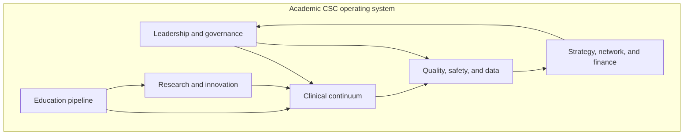

U.S. academic Comprehensive Stroke Center handbook

# Comprehensive Stroke Center Management

A practical operating system for Medical Directors and Associate Medical Directors who must build, run, improve, grow, and elevate an academic CSC to sustained national and international standing.

[Start with Day One](foundations/04-day-one-briefing.md)
<a class="secondary" href="how-to-use.html">How to use this handbook</a>
<a class="secondary" href="#choose-a-route">Choose by role</a>

Eight parts · operational playbooks · evidence register · living monthly update protocol

## Opening

An academic Comprehensive Stroke Center is not a certificate on a wall. It is a 24/7 regional capability: hyperacute reperfusion, hemorrhagic and complex cerebrovascular care, neurocritical care, a dedicated stroke unit, a telestroke and transfer network, a quality system that can see itself in near real time, a training pipeline, and a research enterprise that changes practice. The Medical Director is the person who must hold those pieces as one system.

This handbook is written for that job. It treats certification as a floor, not a destination. It treats volume as a responsibility, not a trophy. It treats academic productivity as part of the clinical mission, not a weekend hobby. Every chapter is designed to be used in a meeting, a huddle, a survey week, a budget cycle, or a 90-day turnaround.

## Choose a route

<a href="foundations/04-day-one-briefing.html">New in role<strong>Take command in 90 days</strong>Authority, cadence, first metrics, first relationships, and the survey-ready operating rhythm.</a>
<a href="clinical/11-hyperacute-pathways.html">Clinical operations<strong>Tighten the acute chain</strong>EMS through reperfusion, imaging, NCC, the stroke unit, and the post-acute continuum.</a>
<a href="quality/23-core-metrics.html">Quality & certification<strong>Run the scorecard</strong>GWTG-Stroke, STK, CSTK, high-reliability methods, and survey readiness.</a>
<a href="strategy/36-elite-performance.html">Elite status<strong>Become hard to equal</strong>Benchmarking, network leadership, academic presence, and sustained excellence.</a>

## The eight-pillar operating system

### Clinical continuum

Prehospital through post-acute care, including EVT, ICH/aSAH, NCC, telestroke, and mobile stroke units.

### Quality system

Registries, CSTK/STK/GWTG scorecards, PDSA, high reliability, equity, and survey readiness.

### Academic mission

Fellowship excellence, interprofessional education, trials infrastructure, and scholarly output.

### Elite trajectory

Network leadership, financial stewardship, surge readiness, and multi-year strategy.

## What elite academic CSCs consistently do

| Domain | Floor | Elite practice |
| --- | --- | --- |
| Reperfusion speed | Meet Target: Stroke Honor Roll thresholds | Treat DTN and door-to-device as a daily management system, not an annual award |
| Hemorrhagic care | Reverse coagulopathy and secure aneurysms | Time-stamped ICH and aSAH bundles with 24/7 neurosurgery and neurointervention |
| Quality | Submit required CSTK/STK and GWTG data | Real-time dashboards, weekly defect review, equity stratification |
| People | Cover the roster | Dyad/triad leadership, FTE model, succession, psychological safety |
| Academic mission | Host learners | ACGME-strong fellowship, trial enrollment as a clinical pathway, grant strategy |
| Network | Accept transfers | Design the regional system: triage, telestroke, repatriation, and capability-building |

## Contents

<ul class="chapter-list">
<li class="part">I · Foundations of the academic CSC</li>
<li><a href="foundations/01-what-academic-csc-must-be.html">01What an Academic CSC Must Be</a></li>
<li><a href="foundations/02-certification-landscape.html">02Certification Landscape and Standards</a></li>
<li><a href="foundations/03-systems-of-care.html">03Systems of Care and the Regional Hub</a></li>
<li><a href="foundations/04-day-one-briefing.html">04What Medical Directors Must Know on Day One</a></li>
<li class="part">II · Leadership, governance, and architecture</li>
<li><a href="leadership/05-medical-director-role.html">05Medical Director Role and Authority</a></li>
<li><a href="leadership/06-associate-medical-director.html">06Associate Medical Director Role and Succession</a></li>
<li><a href="leadership/07-governance-architecture.html">07Governance Architecture and Decision Rights</a></li>
<li><a href="leadership/08-organizational-design.html">08Organizational Design and FTE Architecture</a></li>
<li><a href="leadership/09-culture-of-excellence.html">09Culture of Excellence and Psychological Safety</a></li>
<li class="part">III · Clinical enterprise</li>
<li><a href="clinical/10-prehospital-ems.html">10Prehospital Systems and EMS Partnership</a></li>
<li><a href="clinical/11-hyperacute-pathways.html">11Hyperacute Pathways and Code Stroke</a></li>
<li><a href="clinical/12-imaging-architecture.html">12Imaging Architecture</a></li>
<li><a href="clinical/13-iv-thrombolysis.html">13Intravenous Thrombolysis Operations</a></li>
<li><a href="clinical/14-endovascular-therapy.html">14Endovascular Therapy Program</a></li>
<li><a href="clinical/15-neurocritical-care.html">15Neurocritical Care Integration</a></li>
<li><a href="clinical/16-inpatient-stroke-unit.html">16Inpatient Stroke Unit Operations</a></li>
<li><a href="clinical/17-transitions-prevention.html">17Transitions, Secondary Prevention, and Clinic</a></li>
<li><a href="clinical/18-rehabilitation-continuum.html">18Rehabilitation and Post-Acute Continuum</a></li>
<li><a href="clinical/19-telestroke-networks.html">19Telestroke Network Operations</a></li>
<li><a href="clinical/20-mobile-stroke-units.html">20Mobile Stroke Units</a></li>
<li><a href="clinical/21-hemorrhagic-complex.html">21Hemorrhagic Stroke and Complex Cerebrovascular Programs</a></li>
<li class="part">IV · Quality, safety, and data</li>
<li><a href="quality/22-quality-data-infrastructure.html">22Quality System and Data Infrastructure</a></li>
<li><a href="quality/23-core-metrics.html">23Core Metrics: GWTG, STK, and CSTK</a></li>
<li><a href="quality/24-improvement-high-reliability.html">24Continuous Improvement and High Reliability</a></li>
<li><a href="quality/25-certification-readiness.html">25Certification Readiness and Survey</a></li>
<li><a href="quality/26-equity-disparities.html">26Equity and Disparities Reduction</a></li>
<li class="part">V · Education</li>
<li><a href="education/27-fellowship-gme.html">27Vascular Neurology Fellowship and GME</a></li>
<li><a href="education/28-interprofessional-simulation.html">28Interprofessional Education, Simulation, and Community Teaching</a></li>
<li class="part">VI · Research and innovation</li>
<li><a href="research/29-trials-registries.html">29Clinical Trials, Registries, and Research Operations</a></li>
<li><a href="research/30-faculty-grants.html">30Faculty Development, Grants, and Scholarly Productivity</a></li>
<li><a href="research/31-innovation-ai.html">31Innovation, AI, and Decision-Support Governance</a></li>
<li class="part">VII · Strategy and elite performance</li>
<li><a href="strategy/32-strategy-growth.html">32Strategy, Growth, Volume, and Complexity</a></li>
<li><a href="strategy/33-network-leadership.html">33Network Leadership and Regional Integration</a></li>
<li><a href="strategy/34-financial-stewardship.html">34Financial Stewardship and Resource Allocation</a></li>
<li><a href="strategy/35-disaster-surge.html">35Disaster, Surge, and Continuity Planning</a></li>
<li><a href="strategy/36-elite-performance.html">36Becoming and Remaining Elite</a></li>
<li class="part">VIII · Playbooks and toolkits</li>
<li><a href="playbooks/37-integrating-pillars.html">37Integrating the Pillars</a></li>
<li><a href="playbooks/38-ninety-days-year-one.html">38First 90 Days and Year One</a></li>
<li><a href="playbooks/39-checklists-agendas.html">39Checklists, Agendas, and Cadence</a></li>
<li><a href="playbooks/40-kpis-dashboards-sops.html">40KPIs, Dashboards, FTE, and SOP Templates</a></li>
<li><a href="playbooks/41-audits-pdsa-roadmaps.html">41Audits, PDSA, Roadmaps, and Workflows</a></li>
<li class="part">Reference</li>
<li><a href="evidence-register.html">→Evidence Register</a></li>
<li><a href="glossary.html">→Glossary</a></li>
<li><a href="living-document.html">→Living Document Protocol</a></li>
<li><a href="changelog.html">→Changelog</a></li>
</ul>
