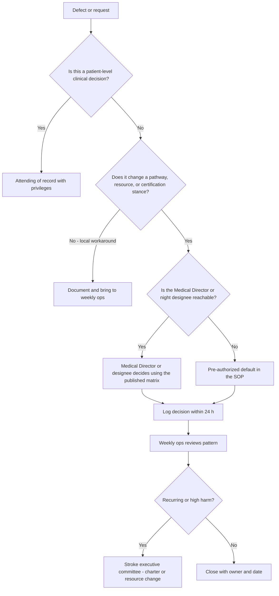

# Medical Director Role and Authority

## Opening

The Medical Director of an academic Comprehensive Stroke Center holds a job that looks like a title and behaves like a system. The appointment is a formal act of medical staff and hospital authority. The work is the daily conversion of that appointment into pathway control, outcome accountability, certification integrity, educational standards, and a research interface that does not collapse when the census is high. The role fails when the title is granted and the decision rights are left implicit.

Treat the role as a designed office, not a courtesy. A designed office has a written appointment, a defined reporting line, a protected FTE, a published decision-rights matrix, and a named deputy. An undesigned office has a name on the certification application, a pager that rings at 02:00, and no authority over the IR backup list, the transfer desk, or the pharmacy protocol that actually governs tenecteplase. Certification surveyors, department chairs, and night-shift nurses can all tell the difference within a week.

The Medical Director is accountable for the CSC as a clinical program. That is not the same thing as being the attending of record for every stroke, the chair of neurology, the chief of neurointervention, or the hospital’s sole quality officer. Clinical privilege authorizes what a physician may do to a patient. Program authority authorizes what a system may do when two services disagree at 03:00 about whether a large-vessel occlusion transfer is accepted, whether the angio suite opens, and whether the pathway is changed after a defect. Privilege without program authority produces excellent individual care and mediocre systems. Program authority without privilege produces memos that no one follows at the bedside.

This chapter gives the Medical Director a role card, a decision-rights matrix, a method for diagnosing “accountable but not in control,” and a time-allocation model that can be defended in a chair’s office and a budget hearing. Use it to convert an appointment letter into an operating system.

## Why This Matters

Joint Commission DSC certification for CSC status examines whether the organization has designated medical leadership with the competence and authority to direct the program. The 2005 Brain Attack Coalition consensus statement on CSCs (Alberts et al., *Stroke*) already treated physician leadership as a structural requirement, not a decorative one. Current CSC operations still rest on 24/7 vascular neurology, neurosurgery, neurointervention, and neuroradiology; a dedicated neuro ICU; advanced imaging; peer review; research participation; and performance-measure reporting. None of those capabilities self-coordinate. Someone has to own the interfaces.

Accountability is now measurable in public and survey-visible terms. GWTG-Stroke achievement awards require 85% compliance on each of seven achievement measures. Target: Stroke Honor Roll requires 75% door-to-needle (DTN) ≤60 minutes; Elite requires 85% DTN ≤60 minutes; Elite Plus requires 75% DTN ≤45 minutes and 50% DTN ≤30 minutes; Advanced Therapy requires 50% door-to-device ≤90 minutes for direct arrivals and ≤60 minutes for transfers. CSTK measures convert process into certification-grade data: NIHSS before recanalization (CSTK-01), 90-day mRS (CSTK-02 and CSTK-10), hemorrhagic severity (CSTK-03), ICH reversal (CSTK-04), hemorrhagic transformation (CSTK-05), nimodipine (CSTK-06), TICI grade (CSTK-08), arrival-to-puncture (CSTK-09), and rapid effective reperfusion (CSTK-11 and CSTK-12). A Medical Director who cannot change the pathway that produces those numbers is being asked to sign a scorecard they do not run.

The academic mission multiplies the stakes. Fellowship education, StrokeNet screening, investigator-initiated work, and interprofessional simulation all compete with the same attendings, APPs, coordinators, and angio time. If the Medical Director has no formal interface with the program director, the research enterprise, and the quality office, education and trials become weekend hobbies and then disappear during survey year. The 2026 AHA/ASA AIS Guideline (*Stroke*. 2026;57:e316–e436) raised the operational bar again: either tenecteplase 0.25 mg/kg (max 25 mg) or alteplase 0.9 mg/kg (max 90 mg) in the 4.5-hour window; treat eligible disabling deficits rapidly regardless of NIHSS; do not delay EVT for patients who also qualify for IVT. Those are not journal-club points. They are pathway-change decisions that require pharmacy, nursing, radiology, and medical-staff alignment.

Finally, the failure mode is personal and organizational at once. A Medical Director who is accountable for outcomes, certification, and reputation but cannot decide diversion, IR backup, transfer acceptance, or protocol revision will burn out, lose the night staff, and produce a program that looks certified on paper and unreliable after 18:00. Fix the authority design before trying to fix the metrics.

## Core Framework

### Three layers of authority that must not be confused

| Layer | What it authorizes | Where it lives | What it does **not** authorize |
| --- | --- | --- | --- |
| Clinical privilege | Procedures and patient-care acts the individual may perform | Medical staff credentials file; privilege delineation | Changing a hospital pathway, opening an OR, accepting a transfer against capacity policy |
| Medical staff authority | Peer review, credentials recommendations, professional-practice evaluation | Bylaws, rules and regulations, medical executive committee | Hiring coordinators, buying a CT scanner, setting hospital diversion policy |
| Hospital / program authority | Operations, FTE, capital, diversion, transfer, pharmacy formulary implementation, certification application | Medical Director appointment letter, hospital policy, CSC governance charter | Independent privileging of a physician the credentials committee has not acted on |

The Medical Director needs a documented piece of all three. Privilege without a program appointment makes the director just another attending. A hospital appointment without medical-staff standing makes the director a manager whom physicians can ignore. Medical-staff standing without hospital operational authority produces elegant peer-review letters and unchanged door-to-device times.

### Formal appointment: minimum contents

The appointment letter is the legal and political foundation. Require it in writing, countersigned by the department chair (or equivalent) and the hospital executive who owns the CSC (typically the CMO, chief of service line, or hospital president). The letter is not a congratulatory note. It is a control document.

Minimum elements:

1. Title: Medical Director, Comprehensive Stroke Center (or equivalent local title that matches the certification application).
2. Reporting line: to whom the Medical Director reports for program performance, and who reports to the Medical Director for stroke operations.
3. Scope: ischemic, hemorrhagic, and complex cerebrovascular care; telestroke and transfer; quality and certification; education interface; research interface.
4. Authority: enumerated decision rights (see matrix below), including the right to halt an unsafe pathway pending executive review.
5. Protected time: stated FTE, clinic/call relief, and the budget line that pays it.
6. Term and review: typically two to three years, with annual performance review against a written scorecard.
7. Deputy: named Associate Medical Director or an explicit deadline to appoint one.
8. Removal: process that cannot be informal and cannot be used to punish a director for reporting defects.

If the current letter is a paragraph in an offer letter, rewrite it. Surveyors ask who is in charge. Night staff ask who is in charge. The written answer must match the lived answer.

### Clinical privilege versus program authority

A vascular neurologist may be privileged for IV thrombolysis decision-making, NIHSS, and stroke-unit attending work. An endovascular physician may be privileged for mechanical thrombectomy. A neurosurgeon may be privileged for aneurysm securing. None of those privileges, by themselves, lets that person change the code-stroke pager algorithm, require a second IR operator on the weekend backup list, or refuse a transfer that the hospital’s transfer center has already accepted.

Program authority is the right, granted by hospital policy and the CSC charter, to:

- Approve and revise stroke clinical pathways and order sets after the designated governance vote.
- Define the code-stroke activation criteria and the roles on the response team.
- Set internal time goals that are at least as stringent as current AHA Target: Stroke and CSTK specifications.
- Decide, or designate the decision-maker for, transfer acceptance when capability exists and the question is judgment rather than raw bed count.
- Escalate IR, OR, or ICU backup failures in real time and require a next-day written recovery plan.
- Stop a process that is producing preventable harm pending review (for example, a tenecteplase mixing practice that repeatedly delays bolus).
- Represent the CSC to certification bodies and sign, or refuse to sign, the attestation that the program meets current standards.

Write these as rights, not hopes. Then map each right to a backup person for nights and weekends.

### Accountability domains

Hold the Medical Director accountable for four domains, and write the scorecard so that “accountable” cannot be confused with “personally performed.”

| Domain | What the Medical Director owns | What the Medical Director does **not** personally own | Typical evidence |
| --- | --- | --- | --- |
| Outcomes and process | CSTK, STK, GWTG, internal time goals, equity-stratified defects | Every bedside decision; every IR technical result | Monthly scorecard; weekly defect log; 90-day mRS capture rate |
| Certification | Continuous readiness, standard interpretation, survey conduct, action-plan closure | Writing every policy; abstracting every chart | SCS/DSC manual currency log; mock survey; open RFI tracker |
| Education interface | Fellowship and GME access to cases, supervision standards on the stroke service, interprofessional drills | ACGME citations as program director unless dual-appointed | Conference attendance, simulation calendar, fellow case-mix |
| Research interface | 24/7 screening reliability, coordinator access, protocol–pathway conflicts | Grant accounting; IRB chair duties | Screen-to-enroll funnel; missed-eligible log; StrokeNet readiness |

The education and research interfaces are where academic CSCs quietly fail. The Medical Director does not have to be the fellowship program director or the site PI. The Medical Director does have to guarantee that the clinical pathway does not make training and trials impossible. If code-stroke documentation is designed only for billing and CSTK, fellows will not learn a research-grade neurologic exam and coordinators will miss windows. Design the pathway once for care, measurement, teaching, and screening.

### Time allocation and protected FTE

Unprotected Medical Director time is not a leadership model. It is a plan to steal nights from clinic, research, and sleep. State FTE in the appointment letter and defend it with a work-content model, not a national urban myth. Volume, network complexity, research intensity, and the number of hospitals in the certification application all move the number. A single-campus CSC with modest transfer volume is not the same job as a multi-hospital academic hub with telestroke, a mobile stroke unit, and a StrokeNet portfolio.

Use the following as a **planning frame**, not a universal staffing rule. Confirm local medical-staff and hospital policy before treating any cell as a mandate.

| Program complexity | Illustrative protected FTE for Medical Director | What that time is for |
| --- | --- | --- |
| Single campus, limited telestroke, certification maintenance | 0.20–0.30 | Governance, scorecard, survey, pathway maintenance |
| Regional hub, active transfer and telestroke, fellowship | 0.30–0.50 | Above plus network, education interface, weekly ops |
| Multi-hospital academic CSC, trials, MSU or equivalent, high hemorrhagic complexity | 0.50–0.80 | Above plus research interface, dyad/triad, external representation |

Protected FTE is useless if it is scheduled as “whenever clinic cancels.” Put Medical Director work on the template: a standing operations block, a quality block, and a reserved emergency block for survey, RCA, or pathway crisis. Publish the template to the chair and the program manager so the time cannot be silently refilled with RVU work.

### What “accountable but not in control” looks like — and how to fix it

Diagnose the condition with behaviors, not feelings.

| Signal | What is actually missing | Repair |
| --- | --- | --- |
| The director is copied on GWTG failures but cannot change the order set | Hospital informatics and P&T authority sit outside the CSC charter | Charter amendment: stroke order sets require Medical Director (or designee) sign-off |
| Transfers are accepted by a house supervisor who does not know EVT capability | Transfer policy is a bed policy, not a capability policy | Written transfer algorithm with a named stroke decision-maker 24/7 |
| IR backup is “whoever is on call” and second-call is informal | No program authority over the call matrix | Joint call-governance with neurointervention; published backup; escalation tree |
| Diversion is declared by ED leadership without stroke notification | Diversion is treated as an ED event | Dual-control diversion: ED plus CSC Medical Director or night designee |
| Pharmacy substitutes a lytic or reversal agent after a shortage without a stroke huddle | Shortage response is departmental, not programmatic | Shortage playbook with a 2-hour CSC huddle trigger |
| Fellowship and trials are “supported” but have no standing on the executive agenda | Academic mission is rhetorical | Education and research as voting items on the quarterly executive agenda |
| The director discovers a CSTK-09 or CSTK-11 failure in a quarterly report | No daily or weekly time-metric review | Daily huddle plus weekly defect review with named owners |
| Night and weekend defects never appear in minutes | Governance meets only on weekday mornings | Night-shift representation, 07:00 huddles, and a written weekend review |

The repair sequence is always the same: name the decision, name the owner, write it into the charter, train the night designee, and audit compliance for 90 days. Do not attempt culture work as a substitute for missing decision rights.

### Decision-rights matrix

Publish this matrix in the CSC charter. Adapt the names of committees to local bylaws. Do not leave a cell blank; “shared” without a final decider is how 03:00 conflicts stay unresolved.

| Decision | Recommends | Decides | Informed | Escalate if stuck |
| --- | --- | --- | --- | --- |
| Code-stroke activation criteria | Ops huddle / pathway workgroup | Medical Director with nursing dyad partner | ED, EMS liaison, house supervisors | Stroke executive committee |
| IVT agent, dose, and mixing SOP (tenecteplase 0.25 mg/kg max 25 mg or alteplase 0.9 mg/kg max 90 mg) | Stroke pharmacy workgroup | P&T after Medical Director endorsement | ED, ICU, nursing education | CMO + P&T chair |
| EVT inclusion pathway and imaging algorithm | Vascular neurology + neurointervention | Medical Director and IR medical lead jointly | Radiology, ED, transfer center | Service-line executive |
| Change to door-to-device internal goal | Quality triad | Medical Director | IR, ED, anesthesia | Stroke executive committee |
| Hospital stroke diversion | ED charge + house supervisor | Dual control: ED leader **and** Medical Director or night designee | Transfer center, EMS, receiving partners | CMO / administrator on call |
| IR second-call / backup activation | On-call IR | IR medical lead per published backup tree; Medical Director if delay exceeds internal limit | OR, anesthesia, NCC | Department chair of IR / CMO |
| Transfer acceptance when capability exists | Transfer center + on-call stroke | Named stroke decision-maker (attending or AMD); Medical Director for contested or high-profile cases | Bed management, NCC, IR | Medical Director → CMO |
| Transfer decline for true capacity or capability | Bed management + NCC | Hospital policy owner; stroke documents the capability fact | Referring site, EMS | Administrator on call |
| ICH reversal pathway (CSTK-04) | Hematology + pharmacy + NCC | P&T after Medical Director and NCC endorsement | ED, ICU | Stroke executive + P&T |
| aSAH securing pathway and nimodipine SOP (CSTK-06) | NSGY + NCC + pharmacy | Joint NSGY / Medical Director; P&T for drug SOP | IR, ICU, transfer center | Surgical chair + CMO |
| Peer-review referral of a case | Any team member | Stroke peer-review chair per bylaws | Involved departments | Medical staff PPPE process |
| Certification application and attestation | Program manager + quality | Medical Director (signature) and hospital executive | Department chairs | Hospital board quality committee |
| Research protocol that alters acute pathway | Site PI + research committee | Medical Director for pathway impact; IRB for human-subjects | Pharmacy, nursing, fellows | Research dean / CMO |
| Adding or pausing a telestroke spoke | Network workgroup | Medical Director + hospital network executive | Legal, credentialing, EMS | Hospital strategy committee |

!!! tip "Key Actions"
    Rewrite the appointment letter this quarter if it lacks FTE, a deputy, and enumerated decision rights. Publish the decision-rights matrix to ED, IR, NSGY, NCC, transfer center, and house supervisors. Name a night-and-weekend designee with the same matrix, not a “call me if you need me” verbal arrangement. Put Medical Director time on the clinic template so protected FTE is visible. Open a 90-day audit of the four highest-conflict decisions: diversion, IR backup, transfer acceptance, and pathway changes.

!!! abstract "Metrics Targets"
    **Floors (certification and public programs):** maintain current CSC eligibility per the active DSC manual and E-App table; do not treat historical volume figures as current without confirmation. Report the active CSTK set (CSTK-01 through CSTK-06 and CSTK-08 through CSTK-12). Hold GWTG achievement measures at or above 85%. Treat Target: Stroke Honor Roll (75% DTN ≤60 min) as a floor for an academic CSC, not a celebration. Capture 90-day mRS (CSTK-02) as a managed process, not a mail-back hope. **Internal leadership targets:** 100% of the decisions in the matrix have a named owner and a night designee; appointment letter current within 12 months; Medical Director protected time delivered ≥80% of scheduled blocks; time from defect to logged decision ≤24 hours; contested transfer or diversion events reviewed within 7 days; zero surveys in which staff cannot name who directs the stroke program after hours.

!!! warning "Common Pitfalls"
    Accepting the title without the letter. Confusing being the busiest attending with being the Medical Director. Allowing “shared governance” to mean no final decider at 03:00. Signing GWTG and CSTK reports while informatics, pharmacy, and IR remain outside the charter. Using historical volume numbers (including older IV thrombolysis counts still circulating in secondary summaries) as if they were the current Joint Commission table. Treating the April 2, 2025 reduction of the annual aSAH volume criterion to 10 as permission to thin neurosurgical coverage. Allowing the chair to refill protected time with RVUs. Appointing an Associate Medical Director on paper and leaving them as unpaid extra night attending. Writing a beautiful matrix and storing it in a shared drive no house supervisor can find.

!!! success "Implementation Tips"
    Socialize the matrix as a conflict-reduction tool, not a power grab: ED and IR usually want a named decider more than they want another committee. Bring a 90-day log of contested transfers and delayed backups to the first charter meeting; anecdotes lose to a simple count. Align the role card with medical-staff bylaws so peer review and credentials language does not collide with program language. If the hospital uses a dyad, put the program manager’s authority in the same letter, not in a side email. When a guideline update arrives (for example, the 2026 AIS lytic options), run a single time-boxed pathway project with pharmacy, nursing, and informatics rather than issuing a faculty memo. Practice the night designee role in simulation before the first vacation.

## How to Do the Work

### Daily / weekly

Run a short weekday operations huddle. Fifteen minutes is enough if the agenda is fixed: overnight activations, time outliers (DTN, door-to-device, ICH reversal, puncture-to-reperfusion), transfer declines, IR or OR delays, safety events, and any decision that used a default because the designee was unreachable. The Medical Director or Associate Medical Director attends; the program manager owns the list; quality brings the timestamps.

Review every DTN >45 minutes and every door-to-device miss against the Advanced Therapy thresholds (90 minutes direct, 60 minutes transfer) as a case, not a rate. Rates hide the mechanism. Assign one owner and a due date. Do not wait for the monthly CSTK extract.

Be available, or make the designee available, for contested transfers and diversion. If the Medical Director cannot take those calls during a clinic session, the clinic template is wrong or the designee is not real.

Once a week, walk one interface in person: CT, angio, neuro ICU, ED triage, or the transfer desk. Sensitivity to operations is a high-reliability practice, not a courtesy tour (Weick and Sutcliffe; Joint Commission high-reliability framing). Ask the night charge nurse what the last workaround was.

### Monthly / quarterly

Chair or co-chair the monthly quality meeting with the full CSTK, STK, and GWTG package, equity-stratified where numbers allow. Require a written action for every measure below the internal target. Close or escalate every action older than 90 days.

Hold a monthly 1:1 with the chair (or equivalent) on FTE delivery, conflict with other services, and upcoming certification or research risks. Hold a monthly 1:1 with the program manager on coordinator capacity, abstraction lag, and policy currency.

Quarterly, convene the stroke executive committee. Bring the decision-rights exceptions log: every time the matrix was bypassed, every time the night default was used, every time two services disagreed. Amend the matrix if the same cell fails twice.

Quarterly, review the education and research interfaces: fellow case access, missed trial eligibles, coordinator vacancies, and any protocol that is colliding with the clinical pathway.

### Annual / multi-year

Renew or rewrite the appointment letter. Reconfirm FTE against actual work content. Re-credential the role card against the current DSC manual, the current AHA/ASA guidelines, and the current CSTK specifications (v2026B at the time of this handbook’s evidence lock). Confirm current CSC volume criteria in the active E-App / eligibility table rather than recycling historical figures.

Run one annual tabletop: simultaneous LVO, ICH reversal, and aSAH securing at night, with a telestroke spoke calling in. Score whether the decision-rights matrix was used.

Set a succession checkpoint: if there is no Associate Medical Director with a portfolio and a development plan, that is an annual failure, not a recruiting inconvenience.

Every two to three years, renegotiate program authority after major organizational change (merger, new IR group, new EHR, new hospital in the certification application). Authority decays after reorganizations unless it is rewritten.

## Ready-to-Adapt Tools

### Sample role card (adapt and place in the appointment packet)

| Field | Content to complete locally |
| --- | --- |
| Role | Medical Director, Comprehensive Stroke Center |
| Appointed by | [Chair / CMO / hospital president — list all signatories] |
| Reports to | [Named executive] for program performance; [Chair] for academic appointment |
| Direct reports / matrix | Program manager (dyad); Associate Medical Director; dotted line to stroke APPs, coordinators, data abstractors as specified in the org chart |
| Privileges required | Vascular neurology or equivalent core privileges; additional procedure privileges as individually held — privilege is necessary but not sufficient |
| Decision rights | See attached matrix; includes pathway approval, night designee designation, dual-control diversion, contested transfer, certification signature |
| Protected time | [0.xx FTE], scheduled as [blocks], funded by [cost center] |
| Scorecard | CSTK / STK / GWTG package; internal time goals; 90-day mRS capture; open RCA actions; survey RFIs; education and research interface metrics |
| Term | [24–36 months], renewable after review |
| Deputy | [Name, role] with identical night matrix |
| Non-duties | Not automatically the fellowship PD, site PI, ICU medical director, or service chief unless separately appointed |

### Ninety-day authority diagnostic

- [ ] Appointment letter exists, dated, and signed by chair and hospital executive.
- [ ] Letter states FTE, term, deputy, and removal process.
- [ ] Decision-rights matrix is posted where the transfer center and house supervisor can see it.
- [ ] Night designee can recite the four conflict decisions: diversion, IR backup, transfer acceptance, pathway freeze.
- [ ] Order-set changes require Medical Director (or designee) sign-off.
- [ ] Certification application names the same person staff name on the floor.
- [ ] Last three contested transfers have a written decision note within 24 hours.
- [ ] Protected-time calendar for the last 30 days shows ≥80% delivery.
- [ ] Education and research appear on the next quarterly executive agenda.
- [ ] “Accountable but not in control” signals (table above) have named repairs with dates.

### Diversion and transfer micro-SOP skeleton

1. **Trigger.** ED or house supervisor anticipates diversion, or a referring site requests transfer for EVT, ICH, or aSAH.
2. **Capability check.** On-call stroke clinician confirms current imaging, IR, OR, and NCC capability — not merely a bed count.
3. **Decision.** Apply the matrix. Dual control for diversion. Named stroke decision-maker for acceptance when capability exists.
4. **Communication.** Referring site, EMS, receiving units, and the public diversion feed (if any) receive the same fact pattern.
5. **Documentation.** Time, decision-maker, reason code (capability, capacity, imaging down, IR delay, other), and expected revisit time.
6. **Review.** All diversions and all declines reviewed at the next weekday huddle; patterns to monthly quality.

## Integration With Other Pillars

This chapter is the authority spine for the rest of the handbook. [Associate Medical Director Role and Succession](06-associate-medical-director.md) is how the office survives vacation, nights, and departure. [Governance Architecture and Decision Rights](07-governance-architecture.md) is how the matrix is exercised in committees rather than in side conversations. [Organizational Design and FTE Architecture](08-organizational-design.md) is how protected time and coordinator capacity make the role real. [Culture of Excellence and Psychological Safety](09-culture-of-excellence.md) is how staff use the escalation tree without retaliation.

Clinically, the role card is useless if hyperacute pathways, imaging, EVT, ICH/aSAH bundles, and telestroke do not have owners who report into this matrix. On the quality side, CSTK, STK, GWTG, and survey readiness are the Medical Director’s public scorecard; they are not the quality department’s private hobby. Education and research remain academic ornaments until they have standing on the executive agenda and a guaranteed interface with the clinical pathway. Strategy, finance, and network chapters later in the handbook assume that someone can actually decide.

## Sources

- Joint Commission. *Disease-Specific Care Certification* program; *2026 Stroke Certification Standards* (SCS26). Confirm current CSC eligibility and volume tables in the active manual and E-App; do not rely on secondary summaries for numeric volume criteria.
- Joint Commission / AHA/ASA announcement, April 2, 2025: annual aSAH volume criterion reduced to 10 (manual update January 2026).
- Specifications Manual for Joint Commission National Quality Measures, Stroke (CSTK) v2026B (posted 02/06/2026; 3Q–4Q 2026 discharges): CSTK-01 through CSTK-06 and CSTK-08 through CSTK-12.
- STK inpatient stroke measure set (longstanding core): STK-1, STK-2, STK-3, STK-4, STK-5, STK-6, STK-8, STK-10; STK-OP per v2026B.
- AHA/ASA. 2026 Guideline for the Early Management of Patients With Acute Ischemic Stroke. *Stroke*. 2026;57(8):e316–e436. DOI 10.1161/STR.0000000000000513.
- Greenberg SM, et al. 2022 Guideline for the Management of Patients With Spontaneous Intracerebral Hemorrhage. *Stroke*. DOI 10.1161/STR.0000000000000407.
- Hoh BL, et al. 2023 Guideline for the Management of Patients With Aneurysmal Subarachnoid Hemorrhage. *Stroke*. 2023;54:e314–e370. DOI 10.1161/STR.0000000000000436.
- AHA/ASA. 2024 Performance and Quality Measures for Spontaneous ICH.
- AHA Get With The Guidelines–Stroke achievement and Target: Stroke recognition criteria (public criteria last reviewed on the AHA page September 9, 2022, and still the published thresholds cited in this handbook).
- Alberts MJ, et al. Recommendations for comprehensive stroke centers: a consensus statement from the Brain Attack Coalition. *Stroke*. 2005. Foundational leadership and capability language; not a substitute for current TJC CSC standards.
- Weick KE, Sutcliffe KM. *Managing the Unexpected*. High-reliability organizing principles.
- Reason J. Human error and just culture framing used in later safety literature.
- AHRQ Comprehensive Unit-based Safety Program (CUSP); IHI Model for Improvement.
- NIH StrokeNet. National infrastructure for multicenter stroke trials; treat participation as a strategic capability of an academic CSC.
