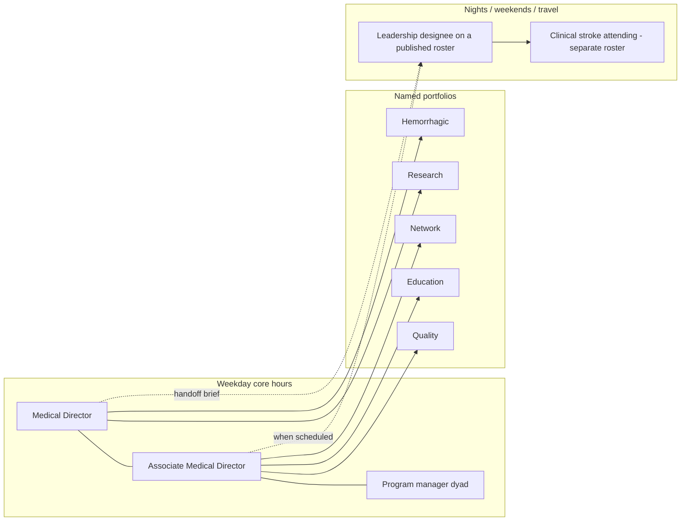

# Associate Medical Director Role and Succession

## Opening

An academic CSC that has a Medical Director and no Associate Medical Director has a single point of failure wearing a pager. Elite programs treat the Associate Medical Director (AMD) as a designed office with a portfolio, protected time, night-and-weekend leadership authority, and a written path to succession. They do not treat the AMD as a slightly more anxious attending who covers the director’s inbox.

The AMD exists for three reasons that are easy to confuse and fatal to merge. First, span of control: quality, education, research, network, hemorrhagic care, and telestroke cannot be one person’s evening hobby once transfer volume, CSTK reporting, and fellowship demands are real. Second, continuity: certification, IR backup disputes, and contested transfers do not pause for national meetings, illness, or sabbatical. Third, succession: the next Medical Director should be formed in public, with a scorecard, not discovered in a crisis search after a resignation.

This chapter tells the Medical Director how to build the AMD role so that it is neither a vanity title nor an unpaid extra night shift. It specifies portfolios, a development plan, coverage rules for nights and weekends of leadership (not merely clinical call), and the triggers for a second AMD. Use it when the program is still a single-hero system, when the current AMD is drowning, or when the succession plan is a name written on a napkin.

## Why This Matters

Certification and public measurement assume continuity of medical leadership. Joint Commission DSC surveyors ask who directs the program and who directs it when that person is away. Staff on Saturday night ask the same question with more urgency. If the only answer is the Medical Director’s mobile number, the program does not have an AMD. It has a hope.

The operational load is no longer a single ischemic pathway. The 2026 AHA/ASA AIS Guideline requires rapid IVT for eligible disabling deficits in the 4.5-hour window with either tenecteplase 0.25 mg/kg (max 25 mg) or alteplase 0.9 mg/kg (max 90 mg), without delaying EVT. Hemorrhagic care is a parallel enterprise under the 2022 ICH and 2023 aSAH guidelines, with CSTK-03, CSTK-04, and CSTK-06 making severity scoring, reversal, and nimodipine visible. Telestroke and transfer networks move decisions off campus. StrokeNet and other trial portfolios require 24/7 screening. Fellowship education requires case access and supervision that do not collapse when the Medical Director is in a budget meeting. One person cannot hold that set at a high-functioning academic hub.

Succession is a safety issue, not a courtesy to the incumbent. High-reliability organizing treats deference to expertise and commitment to resilience as daily practices (Weick and Sutcliffe). A program that cannot name its next Medical Director, or that would lose CSTK-09 and CSTK-11 ownership if one faculty member left, is brittle. Brittleness shows up first as delayed pathway updates, then as night-time decision vacuums, then as a survey finding that “leadership is identified” but cannot be located.

There is a second, quieter failure: the AMD as unpaid extra attending. Academic departments are skilled at converting leadership titles into additional clinical labor. The AMD who still carries a full RVU target, a full call slate, and a “help with quality” side job will either leave or become a second exhausted hero. That pattern destroys the succession pipeline and teaches junior faculty that leadership is uncompensated risk. Fix the job design before recruiting a name.

## Core Framework

### Why elite CSCs have at least one AMD

The AMD is not a luxury of large brands. It is the minimum redundancy for a 24/7 regional capability. Create the role when any two of the following are true:

- The Medical Director’s protected FTE is ≥0.30 and still insufficient for weekly ops, monthly quality, network calls, and survey work.
- The certification application covers more than one site, or telestroke spokes generate regular transfer and documentation load.
- There is a vascular neurology fellowship or a material GME footprint on the stroke service.
- Hemorrhagic and ischemic enterprises are both active (neurosurgery + neurointervention + NCC), so one director cannot attend every interface.
- Research screening is expected 24/7.
- The Medical Director will be away more than four weeks in a year (meetings, vacation, grant, parental leave).

Do not wait for a resignation. An AMD appointed during a crisis inherits a mess and no legitimacy.

### Portfolios: one AMD, several possible shapes

Give the AMD a named portfolio. “Help with everything” is how the role becomes unpaid extra attending work. The Medical Director retains the role card in [Medical Director Role and Authority](05-medical-director-role.md): certification signature, contested authority, and the final cell in the decision-rights matrix. The AMD owns a slice deeply enough to change it.

| Portfolio | Typical AMD work | Decision rights the AMD should hold | Scorecard fragments |
| --- | --- | --- | --- |
| Quality and safety | Weekly defect review, CSTK/STK/GWTG package, RCA liaison, equity stratification | Approve PDSA charters; freeze an unsafe process pending Medical Director review | Open defects >90 days; CSTK-01, -09, -11, -12; GWTG achievement; 90-day mRS capture |
| Education | Fellowship–service interface, simulation calendar, nursing/EMS teaching standards | Set conference and drill cadence; escalate supervision gaps | Drill completion; fellow case-mix; interprofessional attendance |
| Research | Screen-to-enroll reliability, coordinator access, protocol–pathway conflicts | Pause a conflicting protocol’s bedside workflow pending Medical Director + IRB path | Missed-eligible count; after-hours screens; coordinator vacancy days |
| Network and telestroke | Spoke performance, transfer algorithm fidelity, repatriation | Accept/decline algorithm exceptions; recommend spoke pause | Transfer door-in-door-out; inappropriate declines; spoke DTN |
| Hemorrhagic / complex | ICH bundle, aSAH securing pathway, CSTK-03/04/06 | Joint pathway changes with NSGY/NCC; shortage huddles for reversal agents | CSTK-03, -04, -06; time-to-reversal; time-to-securing |
| Endovascular / time metrics | Door-to-device system, TICI documentation, anesthesia interface | Internal time-goal changes with Medical Director; backup-delay escalation | CSTK-08, -09, -11, -12; Advanced Therapy thresholds |
| Night and weekend leadership | On-call leadership (not extra stroke attending), designee for the matrix | Same night matrix as Medical Director when scheduled | Designee reachability; default-SOP use rate; next-day logs |

A first AMD in a mid-sized academic CSC often pairs **quality + night leadership**, or **quality + education**. Do not assign research, network, and hemorrhagic portfolios to one person unless that person has ≥0.40 protected FTE and a coordinator. Portfolios can rotate every two years as a development device if the handoff is written.

### Leadership coverage versus clinical call

Separate three rosters. Mixing them is the usual way an AMD becomes unpaid labor.

| Roster | Purpose | Who may serve | What it is not |
| --- | --- | --- | --- |
| Clinical stroke call | Patient-level decisions, IVT/EVT eligibility, unit attending | Privileged attendings, including MD and AMD | Program authority |
| Procedural call (IR, NSGY, NCC) | Technical and ICU resource decisions | Those services’ call matrices | Stroke program leadership |
| Leadership designee | Matrix decisions: diversion, contested transfer, pathway freeze, IR backup delay, shortage huddle | Medical Director or AMD (or a trained third designee) | An extra clinical shift |

When the AMD is the leadership designee, they are not automatically the stroke attending. If the department needs both on a given night, that is two jobs and must be scheduled and paid as two jobs. Write this into the AMD appointment letter. House supervisors must know which roster they are calling.

### Succession planning as a managed process

Succession is a pipeline, not a coronation. Maintain three named states at all times:

1. **Incumbent Medical Director** with a term end date.
2. **Ready-now AMD** who has run the night matrix, chaired quality, and signed a mock survey.
3. **Ready-in-2–3-years** faculty member with a development plan (this may be a second AMD or a portfolio lead).

Review the pipeline annually with the chair and the CMO. If the ready-now person would not be accepted by IR, NSGY, nursing, and the ED, the development plan is incomplete. Political acceptance is part of the job, not a personality contest.

Minimum succession artifacts:

- Written AMD appointment letter (same structural elements as the Medical Director letter, with a defined portfolio).
- Development plan with quarterly milestones.
- Observed leadership shifts (nights/weekends) with a debrief, not a silent dump.
- A 12-month record of the AMD chairing at least four quality meetings and two executive meetings.
- A documented external presence plan (regional EMS, stroke-coordinator networks, guideline implementation work) so the successor is not invisible.

Do not promise the Medical Director job. Promise a fair, criteria-based process and a real development investment. Unpromised succession still requires a ready-now person.

### How to avoid the AMD as unpaid extra attending

Use a structural test. If three or more items fail, the role is decorative.

| Test | Pass | Fail |
| --- | --- | --- |
| Protected FTE | Stated in the letter and visible on the template | “Administrative time when clinic is light” |
| RVU or cFTE adjustment | Explicit reduction or a stipend that matches work | Full clinical target plus leadership |
| Clinical call | Not increased because of the title | Extra weekend because “you are leadership” |
| Leadership roster | Separate, scheduled, and backed up | “Just keep your phone on” |
| Scope | One or two portfolios | Every committee the Medical Director dislikes |
| Staff | Named coordinator or analyst time attached to the portfolio | AMD does their own abstraction |
| Authority | Night matrix and committee vote | Advice only |
| Review | Quarterly with chair and Medical Director | No scorecard |

Repair failures in the appointment letter, the compensation plan, and the clinic template in the same month. A title change without those three documents will not hold.

### Development plan for the AMD

Build a 24-month plan. Year one is competence in the current portfolio and the night matrix. Year two is stretch into the Medical Director’s residual domains (certification signature practice, capital and FTE negotiation, external network).

**Year-one milestones (illustrative):**

- Month 1–3: Co-sign the decision-rights matrix; complete a structured orientation to CSTK v2026B, STK, GWTG achievement and Target: Stroke thresholds, and the current DSC manual sections that govern medical leadership.
- Month 4–6: Chair weekly ops (and rotate the daily huddle chair separately) for a month; own one PDSA through two cycles (IHI Model for Improvement).
- Month 7–9: Serve as leadership designee for a defined block of nights/weekends with next-day debrief; present the defect log to executive committee.
- Month 10–12: Lead one guideline-implementation project (for example, a tenecteplase or ICH-reversal update) across pharmacy, nursing, and informatics.

**Year-two milestones (illustrative):**

- Lead a mock survey interview as if signing the attestation.
- Negotiate one FTE or capital item with the chair and finance, with the Medical Director in the room and then not in the room.
- Own a cross-service conflict (IR backup, transfer algorithm, or diversion dual-control) to a written charter amendment.
- Represent the CSC at a regional EMS or spoke review without the Medical Director present.

Assess with a brief written evaluation twice a year. Include upward feedback from the program manager, the night charge nurses, and at least one collaborating service chief. Psychological safety applies here: if the AMD cannot tell the Medical Director that the portfolio is too large, the culture chapter is not theoretical.

### When to add a second AMD

Add a second AMD when the first AMD’s portfolio test starts to fail and the Medical Director’s FTE is already at the top of the planning frame in the role chapter. Concrete triggers:

- Two or more hospitals on the certification application, each with a material stroke volume.
- Distinct ischemic and hemorrhagic enterprises that each need weekly medical leadership (for example, a high-complexity aSAH program after the April 2, 2025 volume-criterion change, which reduced the annual aSAH threshold to 10 but did **not** reduce the need for 24/7 neurosurgical and neurointerventional reliability).
- A telestroke network large enough that spoke review is a standing weekly job.
- A StrokeNet-heavy or multi-trial portfolio that needs a physician who can be at the 07:00 screen huddle.
- Fellowship expansion or a second training program (for example, an ENLS-heavy NCC interface plus vascular neurology).
- A planned Medical Director transition inside 18 months — the second AMD may be the ready-in-2–3-years person being accelerated.

Two AMDs require written seams. Typical split: AMD-Quality/Time-metrics and AMD-Network/Hemorrhagic; or AMD-Clinical operations and AMD-Academic mission (education + research). One of them remains the primary night-leadership scheduler so the house supervisor still has a single algorithm.

!!! tip "Key Actions"
    Appoint or rewrite the AMD this budget cycle with a letter that states portfolio, FTE, leadership-roster duties, and non-duties. Split clinical call from leadership designee duty on the published calendars. Put the AMD on a 24-month development plan with dates, not adjectives. Run a tabletop in which the Medical Director is unreachable and score whether diversion, IR backup, and transfer acceptance still work. If the current AMD is abstracting charts or taking extra weekends because of the title, stop and repair compensation and staff support before adding work.

!!! abstract "Metrics Targets"
    **Floors:** a named medical leader is identifiable to surveyors and to night staff; CSTK, STK, and GWTG reporting continue without interruption during Medical Director absence; leadership designee reachability ≥95% of after-hours matrix events. **Internal targets:** ≥1.0 designed AMD FTE-equivalent across one or two people once the Medical Director exceeds 0.40 and the program is a regional hub; protected-time delivery ≥80% for the AMD; zero months in which the AMD’s clinical wRVU target is unadjusted; 100% of weekend leadership shifts have a next-day decision log; succession file contains a ready-now name and a ready-in-2–3-years name; AMD chairs ≥4 quality meetings per year; missed-eligible trial screens and CSTK time outliers do not spike during Medical Director travel. Treat Target: Stroke Elite (85% DTN ≤60 min) and Advanced Therapy door-to-device thresholds as system metrics the AMD-Quality portfolio may own operationally.

!!! warning "Common Pitfalls"
    Announcing an AMD in a faculty meeting and never writing the letter. Using the AMD as the person who does the slides. Increasing the AMD’s call as a “leadership example.” Giving the AMD quality without giving them order-set or PDSA authority. Rotating the title yearly as a badge of honor so no one ever owns a measure. Promising the Medical Director job in a corridor. Appointing a second AMD to resolve a political fight between services rather than to cover a real portfolio. Allowing the AMD to be the only person who understands the CSTK dictionary. Treating the April 2, 2025 aSAH criterion change as a reason to drop hemorrhagic leadership from the AMD map.

!!! success "Implementation Tips"
    Recruit the AMD for coalition skill as much as for CV: they must be acceptable to nursing, ED, IR, and NSGY at 03:00. Start the first AMD on quality plus night leadership; those two portfolios teach the whole system fastest. Pair the AMD with the program manager for the first 90 days of huddles so physician authority and operational memory travel together. When adding a second AMD, publish a one-page seam document before the start date. Use observed night shifts as training, then as evaluation, never as free coverage. If the chair will not adjust cFTE, do not fill the role — reopen the Medical Director’s own authority negotiation instead of exporting the problem.

## How to Do the Work

### Daily / weekly

The AMD on the quality or operations portfolio attends the weekday huddle and, on a scheduled rotation, runs it. The Medical Director should not run every huddle; succession requires reps. The AMD reviews overnight time outliers and any use of the default SOP because a designee was late.

When scheduled as leadership designee, the AMD is reachable for matrix decisions only. They do not take over the clinical attending’s patient list unless they are also on clinical call that night — and that double-booking should be rare and visible.

Weekly, the AMD spends one block inside their portfolio: a spoke call, a coordinator huddle, a simulation planning meeting, a reversal-agent shortage drill, or a CSTK abstraction query session. Portfolio work that never leaves email is not portfolio work.

### Monthly / quarterly

Monthly, the AMD presents their portfolio scorecard in the quality meeting. The Medical Director asks questions and does not re-present the same slides. Monthly, a 30-minute AMD–Medical Director supervision meeting reviews the development plan, political friction, and workload test (the unpaid-attending table).

Quarterly, the AMD chairs or co-chairs a portion of the executive committee. Quarterly, review leadership-roster performance: reachability, time-to-decision, default-SOP use, and any instance in which staff bypassed the AMD to “wait for the real director.” That bypass is a culture defect and a role-design defect.

Quarterly, update the succession file. If the ready-now person is the AMD, document what would still be missing if the Medical Director left in 30 days (credentials, relationships, budget literacy, survey ownership).

### Annual / multi-year

Rewrite the AMD letter at the same time as the Medical Director letter. Rebalance portfolios after guideline updates, mergers, or trial-portfolio changes. Reconfirm that FTE matches work.

Annually, the AMD leads at least one external-facing review (EMS, spokes, or a mock survey) and one internal cross-service negotiation. Annually, the chair and CMO hear a succession briefing that includes the risk of simultaneous departure (Medical Director and AMD recruited together — a real academic failure mode). If that coupled risk exists, accelerate the ready-in-2–3-years person or add a third portfolio lead who is not a title.

Every two years, decide whether a second AMD is now cheaper than a failed Medical Director search. Budget the role before the search, not after the resignation.

## Ready-to-Adapt Tools

### AMD appointment letter skeleton

| Clause | Language to adapt |
| --- | --- |
| Title | Associate Medical Director, Comprehensive Stroke Center — portfolio: [Quality / Education / Research / Network / Hemorrhagic / other] |
| Appointing authorities | Same signatories as the Medical Director letter |
| Reports to | Medical Director for program work; [Chair] for academic appointment |
| Authority | Night-and-weekend leadership designee when scheduled; portfolio decision rights listed in Attachment A; may freeze an unsafe process pending Medical Director review |
| Non-authority | Does not sign the certification attestation unless acting Medical Director; does not alter another service’s privilege list |
| Time | [0.xx] FTE protected; leadership-roster nights scheduled separately from clinical call |
| Compensation | cFTE/RVU adjustment or stipend specified; extra clinical call is not implied |
| Staff | [0.x] coordinator/analyst time attached to the portfolio |
| Term | [24 months], aligned to development-plan review |
| Evaluation | Twice yearly; includes night-staff and dyad feedback |
| Succession | Participation in the ready-now process is expected; appointment is not a promise of the Medical Director role |

### Twenty-four-month development plan (one page)

| Quarter | Competence | Observed practice | Artifact |
| --- | --- | --- | --- |
| Q1 | Matrix, CSTK/STK/GWTG literacy, huddle mechanics | Shadow Medical Director on 4 huddles + 1 executive | Orientation checklist signed |
| Q2 | PDSA and defect ownership | Chair 4 weekly huddles | One closed PDSA with data |
| Q3 | Night matrix | 4–6 leadership-designee shifts with debrief | Decision log sample |
| Q4 | Pathway implementation | Lead one cross-department update | Order-set / SOP revision |
| Q5 | Survey and attestation practice | Lead mock tracer | Mock RFI responses |
| Q6 | Finance and FTE | Co-negotiate one resource | Written request + outcome |
| Q7 | Cross-service conflict | Own one charter amendment | Revised matrix cell |
| Q8 | External representation | Solo EMS or spoke review | Brief to executive committee |

### Unpaid-attending rescue checklist

- [ ] Pull last 90 days of AMD calendar: clinical sessions, call, leadership roster, meetings.
- [ ] Compare to the appointment letter FTE.
- [ ] Count extra weekends assigned after the title change.
- [ ] Count hours spent abstracting, slide-making, or doing coordinator work.
- [ ] Meet with chair and program manager in the same room.
- [ ] Restore FTE or cut portfolio within 30 days.
- [ ] Recheck night-staff understanding of who is leadership designee.

### Decision log for leadership-designee nights

| Time | Event type (diversion / transfer / IR delay / shortage / freeze) | Decider | Decision | Default SOP used? | Next-day owner |
| --- | --- | --- | --- | --- | --- |
| | | | | Y/N | |

Review this log every Monday. Patterns belong in the monthly quality minutes.

## Integration With Other Pillars

The AMD role is how [Medical Director Role and Authority](05-medical-director-role.md) becomes a durable office rather than a personality. [Governance Architecture and Decision Rights](07-governance-architecture.md) is where the AMD chairs, votes, and leaves minutes that survive a survey. [Organizational Design and FTE Architecture](08-organizational-design.md) is how the AMD’s 0.xx FTE and attached coordinator time are modeled instead of improvised. [Culture of Excellence and Psychological Safety](09-culture-of-excellence.md) determines whether staff will call the AMD at 03:00 or wait for the “real” director.

On the clinical side, hemorrhagic, telestroke, and EVT chapters need a physician owner who is not always the Medical Director. On the quality side, CSTK time measures and GWTG achievement are the natural first AMD portfolio because they teach systems thinking. Education and research chapters later in the handbook should assume an AMD or a portfolio lead sits on the interface so fellowship and StrokeNet do not depend on one person’s residual energy. Strategy and elite-performance chapters assume a succession file exists.

## Sources

- Joint Commission DSC / *2026 Stroke Certification Standards* (SCS26). Medical leadership and continuity expectations; confirm current eligibility tables in the active manual.
- Joint Commission / AHA/ASA, April 2, 2025: annual aSAH volume criterion reduced to 10.
- CSTK Specifications Manual v2026B (posted 02/06/2026; 3Q–4Q 2026 discharges).
- AHA/ASA 2026 AIS Guideline. *Stroke*. 2026;57:e316–e436. DOI 10.1161/STR.0000000000000513.
- Greenberg et al., 2022 ICH Guideline. *Stroke*. DOI 10.1161/STR.0000000000000407.
- 2023 aSAH Guideline. *Stroke*. 2023;54:e314–e370. DOI 10.1161/STR.0000000000000436.
- AHA GWTG-Stroke and Target: Stroke public recognition criteria (Honor Roll / Elite / Elite Plus / Advanced Therapy thresholds as published).
- Alberts et al., BAC CSC consensus, *Stroke*, 2005. Foundational leadership structure; not a substitute for current TJC standards.
- Weick KE, Sutcliffe KM. High-reliability organizing: commitment to resilience, deference to expertise.
- IHI Model for Improvement (PDSA).
- AHRQ CUSP. Team-based safety leadership and learning from defects.
- NIH StrokeNet. Site PI and coordinator continuity as an academic CSC capability.
