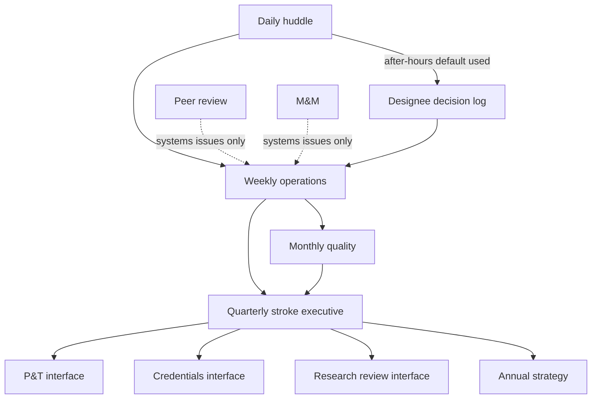

# Governance Architecture and Decision Rights

## Opening

Governance is how an academic CSC makes decisions that survive the people in the room. Committees that do not decide, huddles that do not record, and minutes that cannot be found in survey week are not governance. They are calendar ornaments. The Medical Director’s job is to design a small number of forums with clear decision rights, a published cadence, an escalation path, and a written record that a night nurse, a department chair, and a Joint Commission reviewer can all interpret the same way.

Do not copy a generic hospital committee tree onto stroke and hope. Stroke crosses ED, neurology, neurosurgery, neurointervention, neurocritical care, radiology, pharmacy, laboratory, rehabilitation, transfer operations, and the quality office. Each of those services already has a meeting. The CSC needs the few additional forums that integrate them, plus explicit interfaces to Pharmacy and Therapeutics, credentials, peer review, and research review. Everything else is attendance theater.

This chapter specifies the core forums (stroke executive committee, operations huddle, peer review, M&M, and the standing interfaces), the cadence from daily huddle to annual strategy, a RACI that matches the decision-rights matrix in the Medical Director chapter, an escalation ladder, minute-taking that survives a survey, and the dyad/triad operating model. Build this architecture once. Then run it until it is boring.

## Why This Matters

Certification is a governance test disguised as a clinical visit. DSC programs are examined on standards, clinical practice guidelines, and performance measurement. Surveyors ask who approved the pathway, who reviewed the last CSTK-09 or CSTK-11 outlier, who peer-reviewed the hemorrhagic transformation (CSTK-05), and whether nimodipine and ICH reversal (CSTK-06, CSTK-04) are pharmacy-approved protocols or hallway customs. If the answers live in three inboxes and an unofficial slide deck, the program will look improvised even when the medicine is good.

Measurement has a clock. GWTG achievement at 85%, Target: Stroke Elite at 85% DTN ≤60 minutes, Elite Plus at 75% DTN ≤45 and 50% DTN ≤30, and Advanced Therapy door-to-device thresholds will not move because a quarterly committee “discussed” them. They move when a weekly operations forum assigns an owner and a daily huddle checks yesterday’s timestamps. The 2026 AHA/ASA AIS Guideline’s lytic and EVT sequencing rules, the 2022 ICH bundle logic, and the 2023 aSAH pathway all require cross-department approval. That is P&T plus stroke executive plus informatics, not a faculty email.

High-reliability organizing depends on sensitivity to operations and reluctance to simplify (Weick and Sutcliffe; Joint Commission patient-safety framing). Governance is the formal version of those habits. A daily huddle is sensitivity to operations. A peer-review process that separates blame from systems learning is just culture in bylaws form (Reason; AHRQ CUSP). Minutes that record the decision, the dissent, and the follow-up date are how the organization remembers after the people change.

Finally, academic CSCs die of meeting inflation. Fellows, coordinators, IR, NSGY, and quality cannot attend twelve stroke-related committees. Design five forums that matter, interface to the hospital committees that already hold formulary and credentials power, and cancel the rest.

## Core Framework

### The forum map

Keep the CSC-owned forums few. Borrow hospital forums rather than duplicating them.

| Forum | Owner | Purpose | Decides | Does not decide |
| --- | --- | --- | --- | --- |
| Daily operations huddle | Program manager + MD or AMD | Yesterday’s activations, time outliers, safety, transfers | Immediate workarounds; assignments for the week | Permanent pathway or privilege changes |
| Weekly operations | Medical Director or AMD | Defect themes, staffing, equipment, spoke issues | PDSA charters; temporary pathway holds | Formulary; credentials; capital |
| Monthly quality | Quality triad (MD + program manager + quality) | CSTK, STK, GWTG, equity, action closure | Measure owners; internal target exceptions | Peer-review judgments about individuals |
| Stroke executive committee | Medical Director (dyad with program director/RN leader) | Charter, resources, cross-service conflicts, certification stance | Pathway approvals; matrix amendments; FTE asks to take upstairs | Medical-staff discipline |
| Peer review / PPPE | Peer-review chair per bylaws | Individual professional practice | Referrals and recommendations under bylaws | System pathway redesign (hand to quality/ops) |
| M&M (stroke or joint neuro) | Designated faculty | Shared learning across services | Educational actions; system referrals | Employment actions |
| P&T interface | Stroke pharmacy liaison + MD | Lytics, reversal, nimodipine, seizure, BP agents | Formulary and order-set language (P&T votes) | IR technique; transfer policy |
| Credentials interface | Service chiefs + MD input | Privilege lists relevant to stroke (IVT decision, EVT, aneurysm securing) | Recommendations to credentials committee | Day-to-day backup lists (ops + IR lead) |
| Research review interface | AMD-Research or site PI + MD | Protocol vs pathway conflicts; screening reliability | Whether a protocol may alter the acute pathway | IRB approval itself |

If a topic does not fit a row, it is either a 1:1 or it does not need a standing meeting.

### Cadence

Publish the cadence on one page. Protect it the way OR block time is protected.

| Horizon | Forum | Length | Standing agenda spine |
| --- | --- | --- | --- |
| Daily (weekdays) | Operations huddle | 15 min | Activations; DTN / door-to-device / reversal / puncture-to-reperfusion outliers; transfer declines; IR/OR/ICU delays; safety; designee defaults |
| Daily (nights, lightweight) | Charge-nurse + on-call stroke check | 5 min | Open codes; imaging or IR constraints; who is leadership designee |
| Weekly | Operations | 45–60 min | Defect themes; PDSA status; equipment; spoke/EMS; weekend review; staffing |
| Monthly | Quality | 60–90 min | Full CSTK/STK/GWTG package; equity slice; 90-day mRS capture; action aging; one deep-dive measure |
| Monthly | Peer review (as volume requires) | Per bylaws | Screened cases; OPPE signals; referral decisions |
| Monthly or every other | M&M | 45–60 min | 1–2 cases; systems learning; handoff to ops/quality |
| Quarterly | Stroke executive | 90 min | Scorecard; charter/matrix exceptions; FTE and capital; certification; education; research; network |
| Quarterly | P&T stroke docket | As scheduled | Agent shortages, new lytic or reversal pathway, order-set revisions |
| Annual | Strategy retreat | Half day | Multi-year aims; volume/complexity; network; research portfolio; succession |
| Annual | Credentials review input | Per cycle | Privilege criteria aligned to current guidelines and local SOP |

Weekend and holiday coverage of governance is not another committee. It is the leadership-designee roster plus a Monday review of the decision log (see the AMD chapter).



### Dyad and triad

Run the program as a **dyad**: Medical Director + stroke program manager (or RN program director). Add a **triad** seat for quality when abstraction, registry, and survey work exceed what the program manager can hold.

| Model | Members | Use when | Failure mode |
| --- | --- | --- | --- |
| Hero | Medical Director alone | Never, except a 30-day vacancy | Burnout; night vacuum; survey theater |
| Dyad | MD + program manager/RN director | Default for any CSC | MD treats the partner as an assistant; or RN owns everything and MD only signs |
| Triad | Dyad + quality lead (abstractor supervisor or QI specialist) | High volume, multi-site, or survey year every year | Three people attending every meeting without split work |
| Extended triad | Triad + AMD | Regional hub with portfolios | AMD duplicates the quality lead |

Write dyad authority into both appointment letters. The program manager typically owns policy control, coordinator deployment, survey logistics, and the huddle list. The Medical Director owns medical decision rights and cross-service negotiation. The quality lead owns measure definitions, abstraction integrity, and the aging action log. None of the three should be the only person who can find last quarter’s CSTK file.

### RACI for recurring decisions

R = Responsible (does the work). A = Accountable (the single stop). C = Consulted. I = Informed. One A per row.

| Decision or product | MD | AMD | Program manager | Quality lead | IR lead | NSGY lead | NCC lead | Pharmacy | ED lead |
| --- | --- | --- | --- | --- | --- | --- | --- | --- | --- |
| Daily huddle run | C | C/A rotating | R/A rotating | C | I | I | I | I | C |
| Weekly defect assignment | A | R | R | C | C | C | C | C | C |
| CSTK/STK/GWTG monthly package | A | C | C | R | I | I | I | I | I |
| Pathway / order-set revision | A | C | R | C | C | C | C | C | C |
| P&T submission for lytic or reversal | A | C | C | I | I | C | C | R | C |
| Diversion dual-control policy | A | C | R | I | I | I | C | I | A joint |
| IR backup tree | C | I | I | I | A | I | I | I | I |
| Transfer acceptance algorithm | A | R | C | I | C | C | C | I | C |
| Peer-review case screen | I | C | I | C | C | C | C | I | I |
| Mock survey / tracer | A | R | R | R | C | C | C | C | C |
| Research protocol pathway impact | A | R | C | I | C | C | C | C | I |
| Minutes and action log | A | C | R | R | I | I | I | I | I |
| Annual strategy packet | A | R | R | C | C | C | C | I | C |

“A joint” for diversion means dual control as specified in the Medical Director decision-rights matrix: ED and stroke leadership must both act. Document that exception so the RACI does not look like a broken rule.

### Escalation

Escalation that skips a level teaches staff to start at the top. Escalation that dies at a level teaches staff to work around.

| Level | Time expectation | Examples | Who |
| --- | --- | --- | --- |
| 1 — Bedside / huddle | Minutes | Single time outlier; missing NIHSS (CSTK-01); delayed mix | Attending + charge + coordinator |
| 2 — Leadership designee | Same shift | Contested transfer; IR not answering; diversion threat; reversal agent unavailable | MD or AMD on the leadership roster |
| 3 — Weekly ops | This week | Repeat delay mechanism; spoke pattern; documentation defect | AMD + program manager |
| 4 — Monthly quality | This month | Measure below internal target; aging action; equity gap | Triad |
| 5 — Stroke executive | This quarter or emergency session | Charter conflict; FTE; cross-service stalemate; certification risk | MD + chairs as needed |
| 6 — CMO / medical executive / board quality | Specified in hospital policy | Diversion policy deadlock; privilege or safety event requiring medical-staff action | MD + chair + CMO |

Safety events that meet hospital sentinel or reportable criteria enter the hospital process **in parallel**, not after weekly ops or monthly quality. Write that sentence into the charter.

### Minutes that survive a survey

Minutes are an operational database, not a narrative of who was witty. A survey-survivable packet for each forum includes:

1. **Header.** Forum, date, time, chair, recorder, quorum yes/no, attendance by name and role (include night-shift or EMS guests when present).
2. **Scorecard fragment.** The measures that forum owns, with numerator, denominator, and period. Do not paste the entire GWTG export into a huddle note.
3. **Decisions.** Numbered. Each decision has an owner, a due date, and the authority cited (charter cell, P&T, bylaws).
4. **Dissent or unresolved.** One line. Surveyors and future directors need to see that conflict was visible.
5. **Actions.** Aging list: new, open, closed, overdue. Overdue actions carry a reason, not a silent reset.
6. **Case identifiers.** Use the hospital’s quality numbering, not PHI, in minutes that will be stored in a shared drive.
7. **Guideline or standard currency.** When a pathway is approved, cite the source (for example, 2026 AIS Guideline lytic dosing; CSTK-04 reversal timing) and the review date.
8. **Distribution.** Posted where the triad, house supervisors, and collaborating chiefs can retrieve it without asking a person who is on vacation.

Retain according to hospital policy for quality and medical-staff records. The program manager owns retrieval drills: twice a year, someone who did not write the minutes must produce last quarter’s executive packet in ten minutes.

!!! tip "Key Actions"
    Publish a one-page forum map and cadence this month. Cancel any stroke meeting that cannot name a decision it alone is allowed to make. Stand up the weekday 15-minute huddle if it does not exist; put the AMD in the chair on a rotation. Convert last quarter’s “discussion” minutes into the eight-part template on the next cycle. Write the dyad (and triad, if needed) into appointment letters. Take the RACI to IR, NSGY, NCC, ED, and pharmacy for a one-hour reconciliation, then freeze it for 90 days.

!!! abstract "Metrics Targets"
    **Floors:** CSTK, STK, and GWTG data reviewed at a frequency that can still change behavior — monthly at minimum, weekly for time metrics. Peer review conducted under medical-staff bylaws. Pathways that implement 2026 AIS, 2022 ICH, and 2023 aSAH recommendations have a documented approval date. **Internal governance targets:** huddle held ≥90% of weekdays; weekly ops with quorum ≥80%; executive committee four times per year; 100% of executive decisions have an owner and date; actions older than 90 days <10% of the open list; retrieval drill success 2/2 annually; night-shift or EMS voice present at least quarterly in ops or executive; P&T stroke docket reviewed at least twice yearly and after every shortage or guideline change; zero surveys in which staff cannot find the current pathway or name the huddle.

!!! warning "Common Pitfalls"
    Building a “stroke council” that meets quarterly and tries to do huddle work. Keeping peer review and quality in the same room so systems issues become hidden individual blame, or individual issues become endless process talk. Minutes that list attendees and “rich discussion.” Quorum defined as whoever happened to join the call. The Medical Director as the recorder. Quality reports that show only rates, never cases. M&M as entertainment. P&T finding out about a tenecteplase switch after implementation. Credentials criteria that still describe alteplase-only practice after the 2026 guideline. Executive committees that never invite the transfer-center supervisor. Dyads in which the RN program director has all the work and none of the signature authority.

!!! success "Implementation Tips"
    Run all four tiers: daily huddle, weekly ops, monthly quality, and quarterly stroke executive. Do not treat weekly ops as optional or as a later add-on when the huddle list overflows. Use a single action log across huddle, weekly, and monthly so items do not reset when they change rooms. Put the RACI on the back of the cadence page and tape it in the transfer-center and ED charge station — not only in a governance binder. Schedule executive meetings a year ahead against IR and NSGY block time. If a service never attends, escalate that as a charter problem at the next executive, not as a personality complaint. Train two minute-takers. Practice a 10-minute retrieval drill before every mock survey.

## How to Do the Work

### Daily / weekly

Run the huddle standing up, same time, same agenda spine, camera on if multi-site. The recorder enters outliers into the shared log before the meeting ends. The chair assigns, not “someone should.” If the Medical Director is away, the AMD chairs; if both are away, the program manager chairs and uses the default SOP for any matrix decision that cannot wait.

Weekly ops reviews the log as cases first, rates second. Close what huddle solved. Charter a PDSA only when a mechanism repeats. Review the weekend designee log. Invite one rotating guest each month (CT tech, angio tech, EMS, night charge) — this is how equity of voice is scheduled rather than hoped for.

### Monthly / quarterly

Monthly quality is a management meeting. Walk CSTK-01 through CSTK-06 and CSTK-08 through CSTK-12, the STK core set, and GWTG achievement and quality measures. Stratify time metrics by night/weekend and by transfer versus direct when n allows. Age every action. Refer individual practice questions to peer review; do not litigate them in quality.

Monthly or per bylaws, peer review screens using predefined triggers (for example, sICH, failed reperfusion with process delay, missed IVT in an eligible disabling deficit, delayed ICH reversal, delayed aneurysm securing). M&M takes de-identified systems stories and must end with a written handoff to ops or quality if a pathway change is needed.

Quarterly executive is the only place charter, FTE, certification stance, education, research, and network compete for airtime. Distribute the packet 5 days prior. Do not allow executive to become a second quality meeting. Vote. Record dissent. Escalate deadlocks on the published ladder the same week, not the next quarter.

Hold the P&T and credentials interfaces on their calendars, with a stroke docket prepared by pharmacy and the program manager. After a national guideline update, book extraordinary sessions rather than waiting for the annual cycle.

### Annual / multi-year

Run the half-day strategy session off the weekly agenda. Inputs: 12-month scorecard, equity report, network performance, research enrollment, fellowship health, FTE worksheet, capital, and the succession file. Outputs: three to five aims with owners, not a vision statement.

Annually, refresh the charter, RACI, and minute template against the current DSC manual and CSTK specifications. Confirm aSAH and other volume criteria in the active E-App table; remember that the April 2, 2025 announcement reduced the annual aSAH criterion to 10 and that this is a certification floor, not an operations design target.

Every two to three years, or after a merger, rebuild the forum map. Retired committees should be formally closed so they cannot zombie back to life in survey year.

## Ready-to-Adapt Tools

### Huddle agenda (15 minutes)

1. Overnight activations and open patients (2 min).
2. Time outliers: DTN, door-to-device, ICH reversal, puncture-to-reperfusion (5 min).
3. Transfer declines and diversions (2 min).
4. Safety or equipment (2 min).
5. Assignments: owner, verb, date (3 min).
6. Who is leadership designee tonight (1 min).

### Executive committee agenda (90 minutes)

1. Quorum and prior-decision review (10).
2. Scorecard exceptions only (15).
3. Matrix or charter exceptions log (15).
4. Resource items (FTE, capital, informatics) (15).
5. Certification / standard currency (10).
6. Education and research interface (10).
7. Network / EMS / spokes (10).
8. Votes, dissent, adjourn (5).

### Minute header and decision block

```
Forum:
Date / time:
Chair / recorder:
Quorum: Y/N
Attendance (name, role):
Decisions:
  D-YYYY-##  Decision text. Authority: [charter cell / P&T / bylaws].
  Owner:     Due:     Vote: [unanimous / split — dissent noted]
Actions carried:
  A-###  Status: new/open/closed/overdue  Age:  Reason if overdue:
Unresolved:
Next meeting:
```

### Escalation card (badge-sized)

- Bedside issue → charge + attending now.
- Matrix decision (diversion, contested transfer, IR delay, shortage, pathway freeze) → leadership designee; log within 24 h.
- Repeat mechanism → weekly ops.
- Measure or aging action → monthly quality.
- Charter, FTE, stalemate → executive or emergency executive.
- Reportable safety → hospital event pathway **and** stroke log.

## Integration With Other Pillars

Governance is the operating system for [Medical Director Role and Authority](05-medical-director-role.md) and [Associate Medical Director Role and Succession](06-associate-medical-director.md). Without forums and minutes, decision rights are folklore. [Organizational Design and FTE Architecture](08-organizational-design.md) funds the people who staff the huddle and keep the action log. [Culture of Excellence and Psychological Safety](09-culture-of-excellence.md) determines whether M&M and peer review produce learning or silence.

Clinical chapters depend on this cadence to change pathways after a guideline or a defect. Quality chapters depend on it to keep CSTK, STK, and GWTG from becoming a registry ghetto. Education and research need a standing executive slot or they will be postponed forever. Strategy, finance, and network work belong in the quarterly and annual forums, not in a parallel shadow committee.

## Sources

- Joint Commission. DSC certification components: standards, clinical practice guidelines, performance measurement. *2026 Stroke Certification Standards* (SCS26).
- Joint Commission / AHA/ASA, April 2, 2025: annual aSAH volume criterion reduced to 10.
- CSTK Specifications Manual v2026B; STK core set; STK-OP v2026B.
- AHA/ASA 2026 AIS Guideline. *Stroke*. 2026;57:e316–e436. DOI 10.1161/STR.0000000000000513.
- 2022 ICH Guideline; 2024 AHA/ASA ICH performance and quality measures; 2023 aSAH Guideline.
- AHA GWTG-Stroke achievement (85% on seven measures) and Target: Stroke recognition criteria.
- Alberts et al., BAC CSC consensus, *Stroke*, 2005.
- Weick KE, Sutcliffe KM. High-reliability organizing.
- Reason J. Just culture / human error framing.
- AHRQ CUSP; IHI Model for Improvement.
- Joint Commission patient-safety and high-reliability framing for governance and learning systems.
