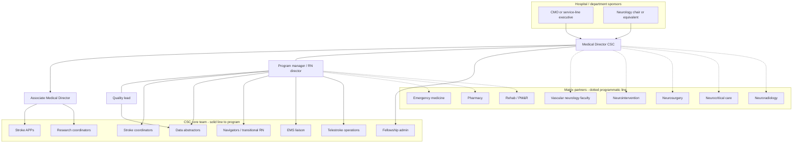

# Organizational Design and FTE Architecture

## Opening

An academic CSC is a matrix organization pretending, on some days, to be a simple neurology service. Vascular neurology, neurosurgery, neurointervention, neurocritical care, radiology, emergency medicine, pharmacy, and rehabilitation all touch the same patient. Coordinators, abstractors, APPs, navigators, research staff, fellowship administration, telestroke operators, and an EMS liaison make the system visible to itself. If those roles are unnamed, unfunded, or borrowed from whoever is least able to refuse, the Medical Director will attempt to run a regional capability with a pager and a spreadsheet.

Organizational design is the work of drawing the real org chart — including dotted lines — and then funding it with an FTE model that scales by volume and complexity without pretending that one hospital’s roster is a national standard. Protected physician time was specified in the Medical Director and AMD chapters. This chapter specifies the rest of the machine: core roles, modeling principles, weekend and night coverage, matrix reporting, and a worksheet the dyad can take to a budget hearing.

Do not staff by slogan (“every CSC needs a navigator”) and do not staff by last year’s leftovers. Staff by work content: activations, abstractions, 90-day calls, trial screens, spoke nights, fellowship files, and the hours when patients actually arrive. Then write the chart so a night-shift tech can see who to call and a surveyor can see who owns the measure.

## Why This Matters

Performance measurement is labor. CSTK-01 through CSTK-06 and CSTK-08 through CSTK-12, the STK core set, GWTG achievement and quality measures, and 90-day mRS (CSTK-02, CSTK-10) do not abstract themselves. Target: Stroke Elite and Elite Plus times are produced at 02:00 by people who must exist on the roster: ED nurses, CT techs, pharmacists, APPs or residents, IR teams, and a coordinator who can reconstruct the timeline the next morning. Under-abstracted programs look worse than they are, then look better than they are, then fail a survey on data integrity.

Capability is also labor. Historical CSC descriptions (Alberts et al., 2005 BAC consensus) and current operational expectations still require 24/7 vascular neurology, neurosurgery, neurointervention, neuroradiology, a dedicated neuro ICU, advanced imaging, peer review, research participation, and performance reporting. Confirm current numeric volume criteria in the active DSC manual and E-App; do not staff to a rumor of “25 IVs” or any other retired figure. The April 2, 2025 reduction of the annual aSAH criterion to 10 is a certification floor. It is not permission to run aneurysm care without night coverage.

The academic mission adds roles that community dashboards omit: fellowship administration, research coordinators, 24/7 trial screening, and interprofessional education support. NIH StrokeNet participation is a strategic capability that dies without coordinator FTE and a physician who can be interrupted. If those FTEs are “borrowed from the clinical coordinator,” both certification and trials will be late.

Finally, matrix reporting is where academic CSCs leak authority. A stroke APP who reports only to a neurology chair will not be available to NCC. A data abstractor who reports only to a hospital quality director may not understand CSTK-11. A research coordinator who reports only to a PI may not answer the 03:00 page. Draw the solid and dotted lines on purpose.

## Core Framework

### Generic org chart

This chart is a pattern, not a mandate. Local titles differ. The structure should remain readable: a dyad/triad at the top, an AMD with portfolios, a small set of core operational roles, and explicit matrix partners.

Solid lines mean hiring, scheduling, and evaluation input. Dotted lines mean the CSC can set standards, demand huddle attendance, and escalate, but cannot unilaterally fire or privilege the person.

### Core roles

Describe work content first. Headcount follows.

| Role | Work content | Typical skills | Usual reporting |
| --- | --- | --- | --- |
| Stroke APP | Hyperacute response, unit coverage, clinic follow-up, some night/weekend continuity | Vascular neurology procedures as privileged; NIHSS; family communication | Solid to neurology or CSC; matrix to NCC/ED |
| Stroke coordinator (RN) | Pathway integrity, education of unit staff, survey readiness, case review, EMS outreach | Stroke certification literacy; adult education | Solid to program manager |
| Data abstractor | GWTG, STK, CSTK, core-measure integrity, 90-day mRS chase | Specifications-manual literacy; EHR hunting | Solid to quality lead; matrix to program manager |
| Navigator / transitional RN | Discharge education (STK-8), rehab handoff (STK-10), follow-up, risk-factor closure | Teach-back; community resources | Solid to program manager |
| Research coordinator | Screening, consent, visit windows, StrokeNet packets | GCP; after-hours availability | Solid to research office or PI; matrix to AMD |
| Fellowship administrator | ACGME files, schedules, evaluations, onboarding | GME rules | Solid to PD; matrix to Medical Director |
| Telestroke operations | Platform uptime, spoke credentialing logistics, documentation, on-call tech support | Vendor + clinical workflow | Solid to program manager or network office |
| EMS liaison | Feedback loops, triage education, destination compliance, MSU interface if present | Prehospital culture; data sharing agreements | Solid or matrix to program manager |
| Pharmacy stroke liaison | Lytic and reversal pathways, shortage playbooks, BCMA/scan issues | P&T process | Solid to pharmacy; matrix to MD |
| Imaging / angio super-users | Protocol selection, time stamps, TICI documentation support (CSTK-08) | Modality expertise | Solid to radiology/IR; matrix to CSC |

One person may hold two roles only when the work-content hours fit and the night coverage does not collide. Combining abstractor and research coordinator is a common way to fail both CSTK-02 follow-up and trial windows.

### FTE modeling principles by volume and complexity

There is no universal CSC roster. Do not copy another institution’s headcount into a budget request and call it a benchmark. Model from drivers, then sanity-check against peer ranges the hospital already uses for other high-acuity programs.

**Drivers to count (12-month trailing, plus expected network growth):**

1. Code-stroke activations (not just discharges).
2. Ischemic discharges, ICH discharges, aSAH discharges.
3. IVT cases and EVT cases (confirm any certification volume expectations in the current E-App; use local counts for staffing regardless).
4. Transfer-in volume and telestroke consult volume.
5. 90-day mRS attempts required (CSTK-02 population).
6. Active interventional trials and expected screens.
7. Fellowship complement and other GME rotators.
8. Number of certified sites and spokes.
9. Night/weekend fraction of arrivals (often half or more).
10. Language-access and social-complexity load (navigation time).

**Principles:**

- **Abstraction is linear; improvement is not.** Chart abstraction hours scale with case count and measure complexity (CSTK is heavier than STK). Improvement work (PDSA, huddles, education) scales with defect variety and number of units, not just volume.
- **Follow-up is a production system.** 90-day mRS is a call center plus clinic plus EMS/SNF outreach. Staff it as production, not as leftover coordinator time.
- **After-hours work is a separate FTE, not a personality trait.** If 50% of EVT arrives at night, 50% of coordinator reconstruction and research screening must be designed for night, via shift, stipend, or next-morning dedicated block with recorded timestamps.
- **Complexity multipliers.** Multi-site certification, telestroke, MSU, a large hemorrhagic program, and a StrokeNet portfolio each add coordination overhead. Apply a multiplier to program-management and coordinator FTE, not to abstractors only.
- **Do not staff to the certification floor.** The aSAH criterion of 10 is not an FTE model. A program that barely clears a floor still needs 24/7 call teams; the coordinator increment may be small, the physician and ICU increment is not.
- **Protect non-substitutable roles.** One abstractor and one coordinator is a single point of failure. Cross-train before the second FTE appears if volume cannot yet justify two, and write the backup.
- **Physician FTE is not interchangeable with coordinator FTE.** Buying 0.10 more Medical Director time will not close an abstraction lag.

**Illustrative planning bands** (starting points for a worksheet, not norms to cite as requirements):

| Setting (illustrative) | Coordinators + navigators | Abstractors | Stroke APPs | Research coordinators | Notes |
| --- | --- | --- | --- | --- | --- |
| Single-campus academic CSC, modest transfers, maintenance research | 1.0–2.0 | 0.8–1.5 | 1.0–2.0 | 0.5–1.0 | Fragile if anyone is out |
| Regional hub, active telestroke, fellowship, regular EVT nights | 2.0–4.0 | 1.5–3.0 | 2.0–5.0 | 1.0–2.0 | Split night reconstruction |
| Multi-site application, MSU or equivalent, StrokeNet-heavy, high ICH/aSAH complexity | 4.0–7.0 | 3.0–5.0 | 4.0–8.0 | 2.0–4.0 | Dedicated telestroke + EMS roles |

Recompute after any step-change: new spoke cluster, guideline-driven documentation load (for example, 2026 AIS extended-window selection), or a registry vendor change.

### Weekend and night coverage

Draw four coverage maps and refuse to merge them.

| Map | Must be explicit | Common failure |
| --- | --- | --- |
| Clinical stroke | Attending ± APP ± resident; NIHSS and IVT/EVT decisions | Fellow used as unsupervised attending |
| Procedural / ICU | IR, NSGY, NCC, anesthesia, IR nursing, CT | “Second call” that is a rumor |
| Program operations | Who reconstructs the timeline at 07:00; who the house supervisor calls for matrix decisions | Coordinator weekday-only |
| Research screening | Who is paged for inclusion windows | PI’s personal cell, unanswered |

Staff nights with the same role types that produce CSTK-09, CSTK-11, CSTK-12, and CSTK-04, or accept that night performance will lag. If APP coverage is weekday-only, night DTN and documentation will depend entirely on residents and ED nurses — design training and order sets accordingly, and do not pretend the APP FTE has solved after-hours care.

Build a next-morning reconstruction block (even 0.2 FTE shared) so weekend cases enter the defect log before Monday huddle. Delayed abstraction is how weekly ops becomes archaeology.

### Matrix reporting

Write a three-column compact for every shared role: administrative employer, programmatic standards, conflict resolver.

| Role | Employer / solid line | CSC programmatic hold | Conflict resolver |
| --- | --- | --- | --- |
| Vascular neurology faculty | Neurology | Pathway adherence; huddle; call quality | Chair + Medical Director |
| Stroke APPs | Neurology or APP service | Code response standards; documentation | APP director + MD |
| IR physicians / staff | Radiology or surgery | Backup tree; time goals; TICI documentation | IR chief + MD |
| NSGY | Surgery | aSAH securing pathway; availability | Surgical chair + MD |
| NCC | Medicine or anesthesia or neurology | ICH/aSAH bundles; ICU bed algorithm | NCC director + MD |
| Neuroradiology | Radiology | Protocol selection; read times | Radiology chair + MD |
| Abstractors | Hospital quality | CSTK/STK/GWTG definitions; deadlines | Quality director + program manager |
| Research coordinators | CRI / PI | 24/7 screen; pathway non-conflict | Research dean + AMD |
| Telestroke ops | Network office or CSC | Platform SLA; spoke documentation | Network exec + MD |
| Pharmacy liaison | Pharmacy | Lytic/reversal SOP | P&T chair + MD |

If the conflict resolver is “we’ll work it out,” the matrix will fail the first time RVUs and CSTK collide.

!!! tip "Key Actions"
    Draw the live org chart with solid and dotted lines and put it in the charter packet. Build the FTE worksheet from the ten drivers, not from last year’s leftover salaries. Separate the four night maps. Cross-train abstractor and coordinator backups this quarter. Attach coordinator or analyst time to the AMD portfolio so leadership FTE is not consumed by data pulls. Take one matrix conflict (usually IR backup or abstractor priorities) to a named resolver with a written rule.

!!! abstract "Metrics Targets"
    **Floors:** roles required to sustain 24/7 capability and current CSC reporting exist on a roster, including after-hours clinical and procedural coverage. Abstraction lag does not threaten timely CSTK/STK/GWTG submission. 90-day mRS capture is staffed as a process. **Internal design targets:** abstraction complete within 30 days of discharge for ≥90% of cases; 90-day mRS attempts started by day 75; coordinator backup named for every core role; vacancy days for coordinator/abstractor <30 per year without a trained backup in seat; night/weekend cases appear in the Monday defect log ≥95%; research missed-eligibles reviewed weekly; APP or equivalent coverage plan documented for nights if APPs are a daytime-only resource; FTE worksheet refreshed annually and after any step-change in volume or sites.

!!! warning "Common Pitfalls"
    Citing another hospital’s FTE as if it were a Joint Commission requirement. Using historical IVT volume figures as a staffing formula. Combining research and abstraction in one person and then wondering why CSTK-02 and enrollment both slip. Hiring navigators to fix DTN. Leaving telestroke operations inside a vendor relationship with no internal owner. Solid-line managers who forbid huddle attendance. A single coordinator who is also the EMS liaison, the survey lead, and the fellowship coordinator. Modeling only weekday hours. Treating the aSAH criterion of 10 as a reason to thin NSGY call. Physician FTE announced without clinic-template changes. Org charts that omit techs and transfer-center staff — the people who actually start CSTK-09.

!!! success "Implementation Tips"
    Bring hours, not headcount, to finance: “X activations × Y minutes of reconstruction” is harder to wave away than “we need another coordinator.” Pilot a 07:00 reconstruction block before asking for a night coordinator. If quality owns abstractors, write a service-level agreement for stroke (definitions, lag, 90-day calls) so matrix reporting has teeth. Use fellowship admin as a distinct 0.3–1.0 rather than a coordinator add-on once there is an accredited program. When adding a spoke cluster, fund telestroke ops and credentialing logistics in the same request as physician stipends. Revisit APP deployment against the actual arrival curve; many academic CSCs are over-APP’d at 11:00 and uncovered at 19:00.

## How to Do the Work

### Daily / weekly

Look at yesterday’s roster as an operations problem: which of the four coverage maps had a hole, a double-book, or a workaround. If a tech, pharmacist, or transfer nurse improvised, log it — that is an FTE or training signal.

Weekly, the program manager reviews vacancy, orientation load, and abstraction WIP (work in process). WIP older than 14 days is a leading indicator. Weekly, match APP and coordinator schedules to the predicted arrival curve if the ED can provide one.

### Monthly / quarterly

Monthly, the triad reviews role-level reliability: who actually attended huddles, who completed 90-day calls, who screened trials after hours. Monthly, review matrix conflicts that reached a resolver.

Quarterly, update the driver counts (activations, IVT, EVT, ICH, aSAH, transfers, consults, screens). Do not wait for the annual budget if a step-change has already occurred. Quarterly, walk one off-shift unit and ask which role they cannot find.

### Annual / multi-year

Annually, complete the FTE worksheet with finance and the chair. Reconcile protected physician time, APP cFTE, and coordinator/abstractor labor. Annually, test backup plans with a planned absence (the coordinator on a two-week vacation should not stop GWTG).

Multi-year, tie FTE to strategy: a new spoke cluster, an MSU, a second hospital on the application, or a StrokeNet increase is an organizational-design project, not a press release. Sequence hiring ahead of go-live by enough weeks to privilege, train, and put the person on the night map.

## Ready-to-Adapt Tools

### Sample FTE worksheet (complete locally)

| Driver (trailing 12 mo) | Count | Hours per unit (local time study) | Annual hours | FTE at 1,800 productive h |
| --- | --- | --- | --- | --- |
| Code activations — coordinator reconstruction |  |  |  |  |
| CSTK/STK/GWTG abstraction |  |  |  |  |
| 90-day mRS attempts |  |  |  |  |
| Staff education / drills |  |  |  |  |
| EMS / spoke reviews |  |  |  |  |
| Survey / policy / order-set |  |  |  |  |
| Trial screens + enrollments |  |  |  |  |
| Fellowship admin |  |  |  |  |
| Telestroke ops / credentialing |  |  |  |  |
| Huddle + committee labor (all roles) |  |  |  |  |
| **Subtotal operational FTE** |  |  |  |  |
| Complexity multiplier (multi-site / MSU / language access) |  |  |  | × [1.0–1.4] |
| **Requested operational FTE** |  |  |  |  |
| Medical Director protected FTE |  |  |  | [from appointment] |
| AMD protected FTE |  |  |  | [from appointment] |
| Stroke APP cFTE (map to arrival curve) |  |  |  |  |

Time-study the “hours per unit” on 20 consecutive cases rather than inventing them in a meeting. Recalculate after EHR or measure-spec changes.

### Night-map one-pager

| Function | Weeknight | Weekend day | Weekend night | Backup if primary down |
| --- | --- | --- | --- | --- |
| Stroke attending |  |  |  |  |
| APP / resident |  |  |  |  |
| IR + IR nursing |  |  |  |  |
| NSGY |  |  |  |  |
| NCC |  |  |  |  |
| CT / MR |  |  |  |  |
| Pharmacy lytic/reversal |  |  |  |  |
| Leadership designee |  |  |  |  |
| Research screen |  |  |  |  |
| Timeline reconstruction |  |  |  |  |

### Hiring sequence checklist

- [ ] Driver worksheet completed and dated.
- [ ] Role card written (work content, nights, solid/dotted lines, resolver).
- [ ] Budget line and cost center identified.
- [ ] Privilege or access (EHR, registry, vendor) listed with lead times.
- [ ] Orientation includes huddle, CSTK dictionary, and night walk-through.
- [ ] Backup person identified before the new hire’s first vacation.
- [ ] Org chart updated the week they start.

## Integration With Other Pillars

This chapter funds the offices designed in [Medical Director Role and Authority](05-medical-director-role.md) and [Associate Medical Director Role and Succession](06-associate-medical-director.md) and the forums in [Governance Architecture and Decision Rights](07-governance-architecture.md). [Culture of Excellence and Psychological Safety](09-culture-of-excellence.md) will not survive chronic under-rostering; burnout is often an FTE problem wearing a wellness poster.

Clinical pathways need APPs, techs, and night maps more than they need another lecture. Quality needs abstractors and 90-day infrastructure. Education needs fellowship admin that is not stolen from the coordinator. Research needs coordinators who can be paged. Strategy and finance chapters later in the handbook should reuse this worksheet rather than inventing a second staffing story.

## Sources

- Joint Commission DSC / SCS26; confirm current CSC eligibility and volume tables in the active E-App. Do not treat secondary or historical volume figures as current requirements.
- Joint Commission / AHA/ASA, April 2, 2025: annual aSAH volume criterion reduced to 10.
- CSTK v2026B; STK core set; GWTG-Stroke and Target: Stroke public criteria.
- AHA/ASA 2026 AIS Guideline. *Stroke*. 2026;57:e316–e436.
- 2022 ICH Guideline; 2023 aSAH Guideline; 2024 ICH performance measures.
- Alberts et al., BAC CSC consensus, *Stroke*, 2005. Capability expectations used operationally; not a staffing formula.
- NIH StrokeNet. Coordinator and site-PI labor as infrastructure.
- IHI Model for Improvement — demand and capacity thinking for improvement hours versus abstraction hours.
- AHRQ CUSP — unit-based roles and the cost of workarounds as design signals.
