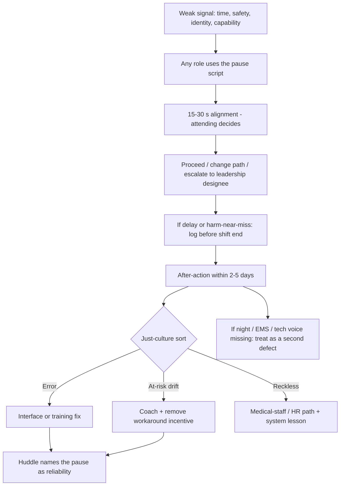

# Culture of Excellence and Psychological Safety

## Opening

A Comprehensive Stroke Center can own the right pathways, the right FTE, and the right committees and still fail at 03:00 if the CT tech will not stop a wrong protocol, the night nurse will not challenge a missed last-known-well, or the fellow will not admit that the groin site is not ready. Culture is not a poster in the angio suite. It is the predictable pattern of who speaks, who is heard, what is rewarded, and what happens after a defect. The Medical Director is the steward of that pattern.

High reliability in stroke is a clinical requirement. Door-to-needle and door-to-device times, ICH reversal, nimodipine, TICI documentation, and 90-day follow-up are produced by teams that notice weak signals early and recover without waiting for a hero. Psychological safety is the condition that makes those signals audible. Just culture is the fairness rule that keeps people reporting. After-action review is the learning ritual that replaces humiliation. Equity of voice is how nursing, techs, EMS, and night staff become part of the same system the weekday executive committee thinks it is running.

This chapter links those cultural practices to the defects that actually move CSTK and GWTG numbers. It also treats burnout and unsustainable call as design failures, not character failures. Celebrate process reliability. Stop celebrating the save that required three workarounds and a personal cell-phone tree.

## Why This Matters

Stroke care is a high-tempo, high-consequence, multi-authority environment — the exact setting in which hierarchical silence kills. The 2026 AHA/ASA AIS Guideline asks teams to treat eligible disabling deficits rapidly within 4.5 hours regardless of NIHSS, to choose tenecteplase 0.25 mg/kg (max 25 mg) or alteplase 0.9 mg/kg (max 90 mg), and to give IVT without delaying EVT. Those steps fail when a nurse sees a blood-pressure gap and does not speak, when a tech sees a delayed page and does not escalate, or when a resident is afraid to activate because the last “false alarm” was mocked.

Public and certification measures make cultural failures visible as process defects. CSTK-01 (NIHSS before recanalization) falls when night documentation is unsafe to complete honestly. CSTK-04 (ICH reversal) falls when pharmacy or nursing cannot challenge a slow order. CSTK-05 (hemorrhagic transformation) is mislearned when peer review is a tribunal. CSTK-06 (nimodipine) fails when the ICU workaround is to “catch it in the morning.” CSTK-09, CSTK-11, and CSTK-12 move only when someone is allowed to say the suite is not ready. GWTG achievement at 85% and Target: Stroke Elite or Elite Plus times are distributions of hundreds of small speaking-up events. A culture that only performs on weekday mornings will have a night-and-weekend tail that no dashboard can massage away.

High-reliability organizing names the habits: preoccupation with failure, reluctance to simplify, sensitivity to operations, commitment to resilience, and deference to expertise (Weick and Sutcliffe). Joint Commission patient-safety framing and AHRQ CUSP translate those habits into unit practice. James Reason’s just-culture distinction — human error, at-risk behavior, reckless behavior — is the only fair way to run stroke peer review without teaching the organization to hide. IHI’s Model for Improvement only works if the people closest to the work will tell the truth in a PDSA.

Burnout is a quality metric. Unsustainable call produces delayed backups, irritable hierarchies, and attrition of the exact people who hold night reliability. A program that runs on heroics will meet a survey and then lose its coordinator, its APP, or its IR partner. Culture work that ignores staffing and call is sentiment.

## Core Framework

### High-reliability principles, translated into stroke

| HRO principle | What it looks like on a code stroke | What the Medical Director must build |
| --- | --- | --- |
| Preoccupation with failure | Every DTN >45 min and every door-to-device miss is a case, not a shrug | Daily huddle; visible defect log; no “good enough for Honor Roll” |
| Reluctance to simplify | “ED was busy” is not a root cause | Mechanism language: page tree, CT queue, mixing location, consent script |
| Sensitivity to operations | Leaders know the night workarounds | Off-shift walks; night guests at ops; real-time constraint board |
| Commitment to resilience | A down CT or late IR still produces a practiced recovery | Backup algorithms; shortage huddles; default SOPs |
| Deference to expertise | The angio tech can stop the clock; EMS can correct last-known-well | Explicit stop-the-line authority; after-action praise for stops |

Do not laminate these as values. Audit them as behaviors. If the last ten after-actions never include a tech or paramedic speaking first, deference to expertise is a slogan.

### Just culture on the stroke service

Apply a consistent algorithm before any conversation that could be heard as punishment.

| Behavior type (Reason / just-culture practice) | Stroke examples | Response |
| --- | --- | --- |
| Human error | Transposed minutes on last-known-well under load; missed checkbox on NIHSS | Console; fix the interface; share the mechanism |
| At-risk behavior | Routine workaround (calling IR on a personal phone because the operator path fails); skipping a pause | Coach; remove the incentive to drift; change the tool |
| Reckless behavior | Conscious disregard of a known safe practice (for example, proceeding without a required pregnancy screen or anticoagulation check when the information is available) | Remediate through medical-staff or HR process; still harvest the system lesson |

Peer review and M&M must use this algorithm in the minutes. If every case is treated as reckless, reporting dies. If nothing is ever reckless, staff conclude leaders will not protect patients. The Medical Director’s job is to keep the middle from collapsing.

CUSP-style learning from defects asks four questions after a stroke defect: what happened, why did it happen (system), what did we do to reduce risk, and how will we know it worked. Those questions belong in weekly ops, not only in a formal RCA.

### Speaking up in code stroke

Speaking up is a designed behavior. Train it, script it, and reward it in the same week a delay occurs.

**Hard rules to publish:**

1. Anyone on the team may call a **pause** for safety (wrong patient identifiers, uncertain last-known-well, BP out of range, incomplete lytic check, no airway plan, wrong imaging protocol, IR not actually in house).
2. A pause is not a veto of treatment. It is a 15–30 second alignment. The attending still decides.
3. Mocking a pause is an at-risk behavior by a leader and is coached publicly enough that others see the repair.
4. EMS, techs, and students have the same pause right as fellows.
5. After a pause that prevented harm or waste, the huddle names it as reliability, not as drama.

**A usable pause script:**

“Pause — I need a 20-second check. Last-known-well is inconsistent / BP is 192 / this is a transfer with unknown lytic status / CT is the wrong protocol. Confirm before we push or puncture.”

Rehearse the script in simulation with mixed hierarchy. If the only people who pause in sim are attendings, the sim is flattering the org chart.

### After-action reviews without humiliation

An after-action review (AAR) is a short, structured conversation close to the event. It is not M&M, not peer review, and not a performance evaluation. Mixing those forums is how people learn to send a delegate or say nothing.

**AAR rules:**

- Time-box to 20–30 minutes within 2–5 days (next weekday for night events).
- Include at least one person from the sharp end who is not a physician (nurse, tech, pharmacist, EMS).
- Start with the timeline from clocks, not from memory contests.
- The most senior physician speaks last on “what I saw.”
- No personal adjectives. Mechanism language only.
- End with at most two actions, owners, and dates.
- The Medical Director or AMD thanks specific speaking-up, on the record.

Humiliation is easy to spot: sarcasm about “soft activations,” laughter when a junior mis-states a TICI grade, or an AAR that becomes a lecture. Stop it in the room. If the leader cannot stop it, they should not chair.

### Equity of voice

Weekday executive committees systematically over-sample physicians who work 08:00–17:00. Night staff, techs, EMS, and environmental or transport staff hold the missing half of CSTK-09. Schedule their voice or do not claim to know the process.

| Group | Why their voice changes measures | How to hear them |
| --- | --- | --- |
| Night/weekend RN | DTN, NIHSS timing, dysphagia, VTE (STK-1), nocturnal BP | 07:00 huddle; paid AAR attendance; quarterly night forum |
| CT / MR / angio techs | Protocol choice, time stamps, CSTK-08/09/11/12 | Super-user on weekly ops monthly; pause rights in sim |
| Pharmacists | Lytic mix, reversal (CSTK-04), nimodipine (CSTK-06) | Shortage huddles; P&T docket review with bedside pharmacists |
| EMS / MSU | Last-known-well, prenotification, destination | Feedback letters that listen, not only score; EMS at quarterly ops |
| Transfer-center staff | Inappropriate declines, dual-control diversion | Decision-log review with them present |
| Learners | See workarounds leaders have normalized | Protected speaking channel; never used as unpaid labor in AARs |
| Patients / families (selected) | 90-day mRS capture, education (STK-8), trust | Structured follow-up questions, not only a score |

Equity of voice is also demographic and linguistic. If interpretation is treated as a delay rather than as care, both ethics and GWTG stroke-education reliability will suffer. Night language-access failures belong in the same defect log as late TNK.

### Burnout and sustainable call

Treat fatigue as a systems hazard. Unsustainable patterns include: the Medical Director as default night decider every night; IR without a real second call; coordinators on 24/7 informal text threads; APPs used to plug every hole; research coordinators screened out of weekends so missed-eligibles spike.

| Hazard | Early signal | Design response |
| --- | --- | --- |
| Leadership heroics | All matrix calls go to one mobile | AMD roster; default SOPs |
| Procedural exhaustion | Rising puncture-to-reperfusion, rising irritability in AARs | Backup tree; load-leveling; recovery time after multi-case nights |
| Coordinator always-on | Slack/texts at 23:00 as unofficial policy | Morning reconstruction block; on-call stipend if truly needed |
| Academic leftover work | Grants and lectures done only after 20:00 | Protected FTE that is actually delivered |
| Moral injury | Staff describing “we knew and no one listened” | Close the loop in huddle; show the fix |

Sustainable call is a culture intervention because exhausted teams stop speaking up and start simplifying. Pair this chapter with the FTE worksheet; do not run a resilience seminar over an empty night map.

### Celebrate process reliability, not heroics

What gets praised gets repeated. If the newsletter features the dramatic late save and never features the Tuesday night when CT, pharmacy, and IR hit internal targets without a single personal call, the organization will invest in drama.

**Praise these in public:**

- A pause that caught a wrong last-known-well.
- A night team that met Elite Plus DTN thresholds without a faculty cameo.
- A complete 90-day mRS week.
- A spoke that improved door-in-door-out after feedback.
- A closed PDSA with a held gain at 60 days.
- Cross-training that made a vacation invisible to CSTK submission.

**Stop praising these as if they were the model:**

- “I just drove in and did it myself.”
- Informal IR activation by favorite cell number.
- Staying 18 hours “because that is what it takes.”
- Bypassing the fellow or the APP “to go faster.”

Heroics are data. Each one is a defect in the designed system, to be logged like any other.

### Linking culture to CSTK / GWTG defects

Do not run culture as a parallel campaign. Attach a cultural mechanism to each stubborn measure.

| Measure or award | Cultural failure that produces the defect | Cultural repair |
| --- | --- | --- |
| CSTK-01 NIHSS | Night fear of “delaying the CT”; incomplete honest scoring | Pause right for documentation; praise complete NIHSS before puncture |
| CSTK-02 / -10 90-day mRS | Follow-up treated as clerks’ work; families blamed for “not answering” | Navigation respect; multilingual outreach; celebrate capture rate |
| CSTK-03 severity scores | ICH/aSAH scores skipped when the team is rushing to OR | Bundle pause; NSGY/NCC voice in AAR |
| CSTK-04 reversal | Pharmacy or RN hesitant to escalate a slow order | Scripted escalation; just-culture if they escalate “unnecessarily” |
| CSTK-05 HT | Punitive review of sICH drives under-reporting and silence | Just-culture sort; mechanism-focused M&M |
| CSTK-06 nimodipine | Night ICU drift; “we’ll give it at 06:00” | Night forum; coach at-risk drift |
| CSTK-08 TICI | Junior operator afraid to record a true 2A | Deference to angio-team documentation; no shaming of grade |
| CSTK-09 / -11 / -12 times | No one will say the suite or the clock is wrong | Tech pause; off-shift AAR; stop hero activation paths |
| GWTG 85% achievement | Weekday-only reliability; discharge measures dumped on one NP | Shared discharge ownership; night/weekend audit |
| Target: Stroke Elite / Elite Plus | Mockery of “soft” activations suppresses early calls | Public thanks for early activation even when not treated |
| STK-8 education | Rushed weekday discharge; interpreter skipped | Teach-back as reliability; language access as a defect type |

!!! tip "Key Actions"
    Publish the pause script and the just-culture sort this month. Put a non-physician sharp-end voice on every AAR. Change the praise system: one public recognition per week for a reliable process or a pause, zero uncritical hero features. Walk a night shift twice this month and ask what people are afraid to say. Attach a cultural repair to every CSTK or GWTG measure that has been red for two months. Pair the AMD leadership roster and the FTE night map to the burnout table so culture work is not a lecture over an empty roster.

!!! abstract "Metrics Targets"
    **Floors:** event reporting and peer review exist under hospital policy; CSTK/STK/GWTG continue to be reviewed as cases, not only rates. **Internal culture targets:** ≥80% of AARs include a non-physician speaker; pause events logged and thanked ≥4 per month in a busy CSC (absence of pauses is a lagging danger signal, not a success); night/weekend representation at ops or executive at least quarterly; staff pulse item “I can speak up about a stroke delay without punishment” ≥80% favorable, stratified by role and shift; hero-workaround log reviewed monthly and trending down; coordinator after-hours unofficial texts trending down; sICH and time-outlier reporting stable or rising when a new just-culture process launches (suppression is the fear); GWTG achievement and Target: Stroke times do not diverge by >10–15 absolute points between weekday and night/weekend once n allows.

!!! warning "Common Pitfalls"
    A wellness lecture instead of a second-call IR. M&M as sport. AARs attended only by people who were not there. “False alarm” mockery that trains people not to activate. Just culture posted on a slide and abandoned the first time a powerful service is involved. Collecting pulse-survey scores and arguing with the night nurses about their feelings. Celebrating Gold Plus status while night DTN is in another percentile. Using learners as the only people who will tell the truth, then grading them for “professionalism” when they do. Language-access treated as optional. Assuming psychological safety means the absence of standards — it means the presence of fair standards.

!!! success "Implementation Tips"
    Start with one unit (ED or angio) and one script (the pause). Film a simulation in which a tech stops an attending and the attending thanks them; show it at orientation. Have the Medical Director speak last in AARs for 90 days to reset hierarchy. When a powerful physician violates the AAR rules, repair in the same week or the culture project is over. Feed culture metrics into the same monthly quality packet as CSTK so they cannot be exiled to a “people committee.” Close the loop: if a night nurse reports a defect, they hear the fix at huddle within two weeks. Hire and evaluate the AMD for their behavior in the 03:00 pause, not only for their CV.

## How to Do the Work

### Daily / weekly

Huddle names pauses and reliable nights the same way it names time outliers. The chair thanks a specific person. Weekly ops reviews the hero-workaround log: personal cell activations, unofficial texts to the coordinator, attending-does-it-himself events. Each is an action, not a legend.

The Medical Director or AMD attends at least one off-shift window most weeks — not a tour, a working huddle or a case reconstruction. Sensitivity to operations expires quickly.

### Monthly / quarterly

Monthly quality includes the culture slice: weekday versus night performance on DTN and door-to-device, pause counts, AAR completeness, reporting volume. If sICH review volume drops after a punitive meeting, treat that as a safety event.

Monthly, the dyad reviews burnout signals: vacancy, after-hours message volume, call swaps, APP sick calls. Quarterly, run a 30-minute night forum (paid or scheduled into the shift) with a single question: “What did you not say during a code this quarter?” Take two items to executive.

Quarterly executive hears one culture defect with the same gravity as a capital request. If the only culture item is an award, the committee is not doing this chapter.

### Annual / multi-year

Annually, refresh just-culture and pause training in interprofessional sim, including EMS if possible. Annually, audit a sample of peer-review minutes for algorithm fidelity (error vs at-risk vs reckless). Annually, retire one hero pathway (a favorite informal activation method) and replace it with a designed one.

Multi-year, watch attrition of night talent and of people who spoke up. If they leave, exit interviews belong to the Medical Director, not only to HR. Multi-year elite status is a cultural outcome: Target: Stroke and CSTK gains that hold across shifts and across leadership transitions.

## Ready-to-Adapt Tools

### Pause card (badge)

- Say: “Pause — 20-second check.”
- State the signal: identity / last-known-well / BP / lytic status / protocol / airway / capability.
- Attending decides; clock owner restates the plan.
- Mocking a pause is reported as an at-risk leadership behavior.
- Log pauses that change the plan.

### AAR script (20–30 minutes)

1. Purpose: learning, not judgment (1 min).
2. Clock timeline (5).
3. Each role, junior and non-physician first: “What did you see?” (8).
4. Just-culture sort if individual action is in view (3).
5. Two actions, owners, dates (5).
6. Thanks for specific speaking-up (2).
7. Who is missing from this room, and how we will hear them (2).

### Just-culture sort card

| Question | If yes |
| --- | --- |
| Did the person intend harm? | HR / criminal path (vanishingly rare); still learn the system |
| Did they know the rule and consciously disregard it? | Reckless — medical-staff / HR + system lesson |
| Is this a common workaround others use? | At-risk — coach the person, fix the incentive |
| Would a comparably trained peer likely do the same under that load? | Human error — console, fix the tool |

### Hero-workaround log

| Date | Workaround (cell tree, stayed 18 h, bypassed role) | Measure at risk | Designed replacement | Owner | Due |
| --- | --- | --- | --- | --- | --- |
| | | | | | |

Review monthly. A rising log during a “culture campaign” means the campaign is speeches.

### Night-forum prompt sheet

- What pause did you almost make and did not?
- Whom would you not page?
- Which unofficial text thread is now “how we actually do it”?
- Which measure looks fine at 10:00 and false at 02:00?
- What should leadership stop celebrating?

## Integration With Other Pillars

Culture is how the authority in [Medical Director Role and Authority](05-medical-director-role.md) is experienced at the bedside. It is how the AMD in [Associate Medical Director Role and Succession](06-associate-medical-director.md) becomes someone people will actually call. It is how [Governance Architecture and Decision Rights](07-governance-architecture.md) avoids becoming a weekday theater. It is how [Organizational Design and FTE Architecture](08-organizational-design.md) either sustains people or grinds them.

Clinical chapters depend on speaking-up during hyperacute, imaging, EVT, ICH, and telestroke work. Quality chapters depend on honest CSTK and GWTG data and on AARs that feed PDSA. Education chapters should treat psychological safety as a fellowship competency, not an optional climate survey. Research screening at 03:00 is a culture test. Strategy and elite-performance chapters that ignore night voice will produce awards that do not survive contact with the weekend.

## Sources

- Weick KE, Sutcliffe KM. *Managing the Unexpected*. High-reliability organizing principles used throughout this chapter.
- Reason J. Human error; just-culture distinctions among error, at-risk, and reckless behavior as used in subsequent patient-safety practice.
- Agency for Healthcare Research and Quality. Comprehensive Unit-based Safety Program (CUSP); Learning from Defects tool.
- Institute for Healthcare Improvement. Model for Improvement; psychological safety as a condition for honest PDSA.
- Joint Commission. Patient-safety and high-reliability framing; DSC survey interest in staff ability to describe how safety concerns are raised.
- Edmondson AC. Psychological safety literature (team speaking-up). Use as conceptual support; local practice must still follow hospital HR and medical-staff bylaws.
- AHA/ASA 2026 AIS Guideline. *Stroke*. 2026;57:e316–e436. DOI 10.1161/STR.0000000000000513.
- 2022 ICH Guideline; 2023 aSAH Guideline; 2024 ICH performance measures.
- CSTK Specifications Manual v2026B; STK core set; AHA GWTG-Stroke and Target: Stroke recognition criteria.
- Alberts et al., BAC CSC consensus, *Stroke*, 2005.
