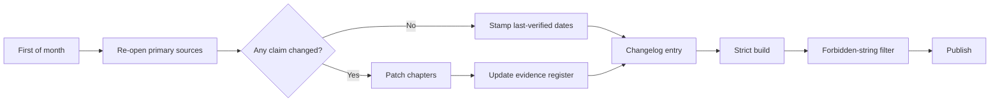

# Living Document and Monthly Update Protocol

## Opening

Standards, measures, and trial evidence move. A handbook that does not have a maintenance system becomes a liability. This protocol is the operating procedure for keeping Comprehensive Stroke Center Management current without rewriting it from scratch each month.

The unit of work is a **currency drop**: a dated, scoped set of source checks, chapter patches, evidence-register updates, and a changelog entry. The unit of time is the first week of each month. The unit of quality is `mkdocs build --strict` plus a hard filter for forbidden strings.

## Why This Matters

Medical Directors will use these pages in survey week, in a 90-day plan, and in a board packet. A stale CSTK ID, an obsolete aSAH volume criterion, or a pre-2026 thrombolytic recommendation is worse than a missing paragraph. Currency is part of the product.

## Core Framework

| Cadence | Work | Owner |
| --- | --- | --- |
| Monthly (1st) | Source re-verification and dated register stamps | Handbook maintainer / automated reminder issue |
| Same week | Chapter patches only where claims moved | Maintainer |
| Same week | Changelog `YYYY.MM` entry | Maintainer |
| Ad hoc | Mid-month correction if a major guideline or measure set drops | Maintainer |
| Annual | Full TOC and toolkit review | Maintainer |

!!! tip "Key Actions"
    On the first business day of the month, open the GitHub Actions `evidence-currency` issue, walk the source list below, and do not close the issue until the register dates and changelog are updated.

!!! abstract "Metrics Targets"
    100% of high-consequence rows in the Evidence Register have a last-verified date no older than 45 days. Zero unresolved “needs confirmation” rows on doses, time targets, or active measure IDs.

!!! warning "Common Pitfalls"
    Rewriting chapters that did not change. Updating a table but not the surrounding prose. Leaving a historical volume number unmarked. Shipping a currency drop that fails `--strict` because a renamed file broke navigation.

!!! success "Implementation Tips"
    Prefer a surgical patch of the sentence and the register row over a stylistic rewrite. If a source is paywalled or the live manual is version-gated, record that fact and keep the prior extraction labeled “confirm current.”

## Sources to re-open every month

1. **Joint Commission**
   - Stroke certification landing page and CSC eligibility notes
   - Specifications Manual for National Quality Measures — CSTK and STK / STK-OP (current version code, e.g. v2026B)
   - Disease-Specific Care / Stroke Certification Standards book year (SCS26 and successors)
   - E-App / CSC eligibility table (dated screenshot). Confirm the aSAH volume criterion against the live table; the April 2, 2025 announcement reduced it to 10
   - Any Joint Commission Online announcement on volume criteria
2. **AHA/ASA**
   - 2026 AIS guideline page and any subsequent correction
   - 2022 ICH guideline and 2024 ICH performance measures
   - 2023 aSAH guideline
   - Secondary prevention and systems-of-care statements
3. **GWTG-Stroke**
   - Recognition criteria page (achievement measures; Target: Stroke tiers; Target: Type 2 Diabetes)
4. **CMS**
   - Hospital IQR / OQR measure lists that mention stroke
5. **NIH StrokeNet**
   - Network structure and any operational changes that affect site readiness
6. **Landmark trial results** published since the last drop that change pathway design (EVT windows, ICH bundles, thrombolytic choice)

## How to patch a chapter

1. Identify the claim and its evidence-register ID.
2. Open the primary source. Extract population, intervention, comparator, endpoint, and number.
3. Change the smallest block of prose and the matching table cell.
4. If a measure is retired, remove it from active tables and add a one-line historical note.
5. If a new measure appears, add it to [Core Metrics](quality/23-core-metrics.md) and the [Evidence Register](evidence-register.md).
6. Do not introduce personal names of handbook creators or individual affiliations while editing. Run the repository-root `AGENTS.md` hard-filter before merge.

## How to add an evidence-register row

Use the live register columns (do not invent a second schema):

| ID | Claim | Chapter | Primary source | Verified extraction | Last verified | Status |
| --- | --- | --- | --- | --- | --- | --- |
| ER-DOMAIN-## | One-sentence operational claim | Chapter slugs | Full citation + DOI or URL | Exact number or wording extracted | YYYY-MM-DD | active / confirm live / historical / retired |

Promote a row to **active** only when the extraction has been re-read from the primary source. Use **confirm live** when the public page is incomplete or the live manual is version-gated (E-App volume tables, CMS OQR). Never recycle a retired ID.

## Versioning

- Monthly currency drop: `YYYY.MM` (example: `2026.08`)
- Same-month correction: `YYYY.MM.N` (example: `2026.08.1`)
- Record every drop in [Changelog](changelog.md)

## Ready-to-Adapt Tools

### First-of-month checklist

- [ ] Open or refresh the `evidence-currency` GitHub issue
- [ ] Re-open the six source classes above
- [ ] Diff each high-consequence register row against the live source
- [ ] Patch affected chapters
- [ ] Update last-verified dates
- [ ] Write the changelog entry
- [ ] Run `mkdocs build --strict`
- [ ] Run the hard-filter listed in repository-root `AGENTS.md`
- [ ] Merge and confirm Pages deploy

### Prompt library

Ready-to-run prompts live in the repository-root file `AGENTS.md` (not a published handbook page). Copy the **Monthly evidence-refresh prompt** into a new session on the first of the month. Use the targeted re-swarm prompts in that same file when only one pillar moved (clinical operations; quality and certification; education and research; strategy; visual and template polish).

## How to Do the Work

### Daily / weekly

No standing weekly currency work unless a guideline or measure set is released mid-cycle. If one is released, open an ad hoc issue the same day.

### Monthly / quarterly

Execute the first-of-month checklist. Once per quarter, read Part VIII templates to ensure sample SOPs still match current doses and measure IDs.

### Annual / multi-year

Re-evaluate the table of contents. Retire chapters that no longer earn their place. Add chapters only when a durable new CSC capability appears (for example, a new certification tier or a practice-changing care model).

## Integration With Other Pillars

Currency is not a back-matter hobby. A changed thrombolytic recommendation must land in [IV thrombolysis](clinical/13-iv-thrombolysis.md), [hyperacute pathways](clinical/11-hyperacute-pathways.md), [core metrics](quality/23-core-metrics.md), and the SOP skeletons in [KPI and SOP templates](playbooks/40-kpis-dashboards-sops.md) in the same drop.

## Sources

- Joint Commission Specifications Manual for National Quality Measures, Comprehensive Stroke (CSTK) v2026B, posted 2026-02-06 (3Q–4Q 2026 discharges); confirm v2027A before 2027 discharges
- 2026 AHA/ASA Guideline for the Early Management of Patients With Acute Ischemic Stroke. *Stroke*. 2026;57:e316–e436. DOI 10.1161/STR.0000000000000513
- AHA Get With The Guidelines–Stroke recognition criteria (public page; last reviewed 2022-09-09 at last check)
- Joint Commission Online, 2025-04-02, aSAH volume criterion announcement
- This handbook’s [Evidence Register](evidence-register.md) and repository `AGENTS.md`
