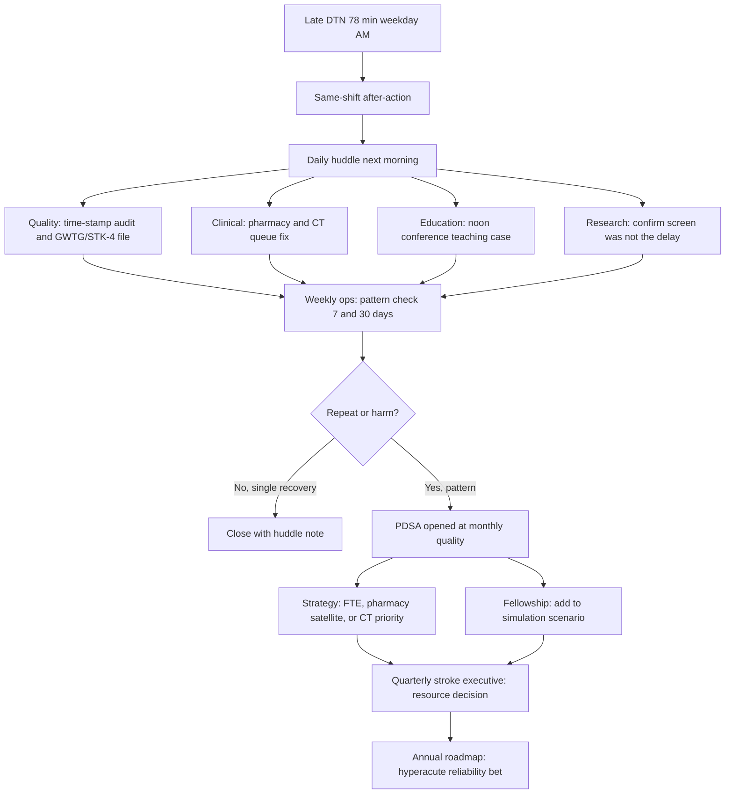
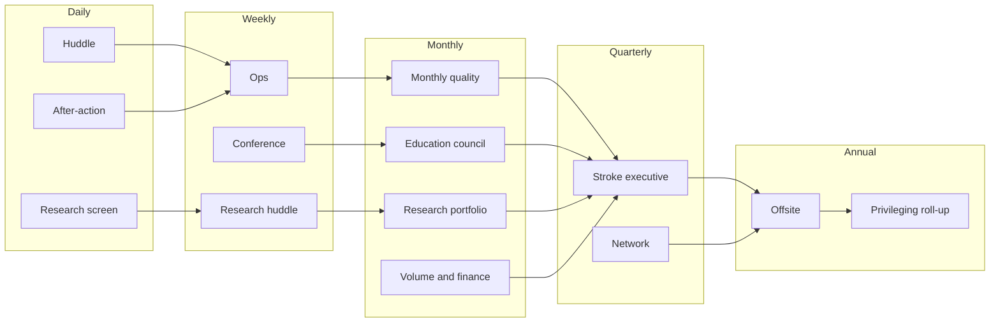

# Integrating the Pillars

## Opening

An academic Comprehensive Stroke Center fails in pieces and succeeds as a system. Clinical pathways, quality measurement, fellowship education, trial infrastructure, and regional strategy each have their own meetings, owners, and scorecards. The Medical Director is the only role that is accountable for the joints. If those joints are left to chance, the program produces late door-to-needle times that never become curriculum, trial screens that never become operations, and strategy decks that never change Tuesday night coverage.

This chapter is the one-page operating system that ties the five working pillars — clinical, quality, education, research, and strategy — to a single cadence. It is not a theory of alignment. It is a calendar, a defect-routing rule, and a set of decision rights that keep the same problem from being solved five times in five rooms.

Treat the operating system as a product the Medical Director owns. Version it. Put it on the first page of the stroke program binder and on the first slide of the quarterly stroke executive review. When a new Associate Medical Director, program manager, fellowship director, or quality analyst arrives, this chapter is the onboarding document.

The test of integration is simple. Pick one defect — a 78-minute door-to-needle time on a weekday morning — and ask whether the same week produces a clinical after-action, a quality measure update, a teaching point, a protocol or trial implication, and a resource or network decision if the pattern holds. If any of those five loops is missing, the pillars are adjacent, not integrated.

## Why This Matters

Certification, awards, and academic reputation all measure fragments. Joint Commission DSC certification inspects standards, clinical practice guidelines, and performance measurement. GWTG-Stroke achievement and Target: Stroke tiers measure process reliability. Fellowship accreditation measures a training environment. StrokeNet and industry trials measure screening and enrollment. Strategy measures volume, complexity, access, and financial stewardship. None of those systems will notice that the same late DTN case is also a missed teaching moment, a missed screen, and a signal that night radiology coverage is underbuilt.

Fragmentation has a clinical cost. Patients eligible for both intravenous thrombolysis and endovascular therapy should receive both rapidly, without delaying thrombectomy. That single 2026 AIS-guideline rule requires EMS, ED, pharmacy, CT, vascular neurology, and the angio suite to move as one team. It also requires a quality system that can see DTN and door-to-device on the same case, a fellowship that can teach the dual-eligible pathway, a research team that does not interrupt the clock, and a strategy that funds the FTE and equipment the clock depends on.

Fragmentation has a survey cost. Surveyors follow tracers, not org charts. A late DTN, an incomplete NIHSS, a missed nimodipine dose, or a 90-day mRS that was never collected will be asked about in the same room as privileging, peer review, and data validation. If the Medical Director cannot show how one defect travels from huddle to PDSA to governance, the program looks ungoverned even when each pillar is locally busy.

Fragmentation has an academic cost. Fellows who never see the quality file become attendings who cannot run a CSC. Coordinators who never hear the clinical huddle enroll the wrong patients. Strategy that never sees CSTK-11 and CSTK-12 performance will fund the wrong growth.

## Core Framework

### The five working pillars and the sixth that holds them

Leadership and governance is not a sixth clinical service. It is the operating layer that assigns owners, cadence, and stop-the-line authority. The five working pillars sit under that layer.

| Pillar | Primary job | Standing owner | Cadence that cannot slip | Core artifacts |
| --- | --- | --- | --- | --- |
| Clinical | Deliver the continuum from EMS to 90-day outcome | Medical Director with service-line partners (ED, NCC, NIR, NSGY, radiology, pharmacy) | Daily huddle; weekly ops; real-time code-stroke after-action | Pathway maps, activation criteria, privilege lists, coverage grids |
| Quality | See the system, close defects, stay survey-ready | Stroke program director / quality lead with Medical Director | Weekly measure review; monthly quality; quarterly stroke executive | GWTG, STK, CSTK files; audit tools; PDSA log; survey binder |
| Education | Produce competent vascular neurologists and a competent interprofessional team | Fellowship director with Medical Director | Weekly conference; monthly simulation; annual curriculum review | Conference calendar, procedure logs, simulation scenarios, competency matrices |
| Research | Screen, enroll, and generate knowledge without harming the clock | Stroke research director / site PI with Medical Director | Daily screen; weekly coordinator huddle; monthly portfolio review | Screening log, 24/7 pager tree, central-IRB tracker, publication pipeline |
| Strategy | Grow the right volume, fund the system, lead the region | Medical Director with chair, CMO, and network lead | Monthly finance/volume; quarterly network; annual offsite | Volume/complexity dashboard, transfer map, FTE model, 3-year roadmap |

### One-page operating system

Use the table below as the one-page OS. Print it. Do not let any standing meeting exist unless it maps to a row.

| Horizon | Meeting or ritual | Duration | Required inputs | Decision the meeting is allowed to make | Escalation if stuck |
| --- | --- | --- | --- | --- | --- |
| Daily | 08:00 stroke huddle | 12 min | Overnight codes, boarding, coverage holes, open safety events, trial screens | Immediate ops fixes; assign a same-day owner | On-call Medical Director / house supervisor |
| Daily | Code-stroke after-action (same shift if DTN >45 min or DTD outlier) | 10–15 min | Time stamps, imaging queue, pharmacy, consent, puncture | Local recovery; flag for weekly ops | Weekly ops if pattern or harm |
| Weekly | Weekly ops | 45 min | 7-day time metrics, transfer friction, equipment, staffing, open PDSAs | Process changes that do not require new policy or FTE | Monthly quality |
| Weekly | Case conference / M+M | 60 min | 2–4 selected cases; imaging; complication list | Teaching points; peer-review referral | Peer review / professionalism committee |
| Weekly | Research coordinator huddle | 20 min | Screens, consents, protocol deviations, weekend coverage | Enrollment tactics; hold a protocol if unsafe | Research director + Medical Director |
| Monthly | Monthly quality | 60–90 min | Full STK/CSTK/GWTG packet; equity slice; audit results | Approve PDSAs; close or escalate defects | Quarterly stroke executive / executive sponsor |
| Monthly | Education council | 45 min | Duty hours, procedure numbers, evals, simulation attendance | Curriculum adjustments; remediation plans | GME / DIO |
| Monthly | Research portfolio | 45 min | Enrollment vs target, coordinator FTE, IRB status | Open/close studies; protect clinical clock | Clinical trials office |
| Monthly | Volume, finance, and access | 45 min | Transfers, diversions, contribution margin principles, unfunded FTE asks | Prioritize resource requests | Chair / CMO |
| Quarterly | Quarterly stroke executive | 90 min | Scorecard, survey risks, network, capital, awards trajectory | Policy, FTE, capital, external commitments | Hospital executive committee |
| Quarterly | Network / EMS / spoke review | 60 min | DIDO, transfer outcomes, telestroke quality, MSU if present | Pathway and triage adjustments | Regional system-of-care forum |
| Annual | Strategy offsite | Half day | 3-year roadmap, SWOT, workforce, research, survey cycle | Choose 3–5 bets; kill zombie projects | Board / dean as required |
| Annual | Privileging and peer-review roll-up | Per medical staff calendar | Case volumes, complications, OPPE/FPPE | Privilege recommendations | Credentials committee |
| Multi-year | Certification and award cycle | Per DSC and GWTG calendars | Standards book, measure manuals, E-App tables | Recertification posture; award targets | Executive sponsor |

### How a single defect travels: late door-to-needle

A weekday 08:40 arrival, NIHSS 9, last known well 07:55, CT/CTA complete at 08:58, tenecteplase given at 09:58 (DTN 78 minutes). Eligible, disabling, inside 4.5 hours. No advanced-imaging delay was required. This is the canonical integrated defect.



Route the same case across pillars with a fixed script:

| Pillar | Question that must be answered within 7 days | Acceptable product |
| --- | --- | --- |
| Clinical | Which interval failed (door-to-CT, CT-to-decision, decision-to-needle) and is the pathway still safe tonight? | Interval-level time stamps; same-day workaround; owner |
| Quality | Is the case in the GWTG and STK-4 denominators correctly, and is this a first, third, or tenth event this month? | Abstraction note; run-chart point; trigger for PDSA if threshold met |
| Education | What should a PGY-2, a fellow, an ED nurse, and a pharmacist each take from this case? | One teaching slide or 5-minute huddle script |
| Research | Did a screen, consent, or coordinator presence add time? If yes, stop that practice the same day. | Deviation note or all-clear |
| Strategy | If this interval fails again next month, what resource or policy is actually required? | Parked decision for monthly finance or quarterly stroke executive |

Do not wait for the monthly committee to protect the next patient. Daily and weekly loops exist to recover. Monthly and quarterly loops exist to change the system.

### Decision rights that keep pillars from colliding

| Decision | Clinical may act alone | Quality may act alone | Requires Medical Director | Requires quarterly stroke executive |
| --- | --- | --- | --- | --- |
| Hold a code-stroke pathway overnight for safety | Yes, with notification | No | Notification same night | Only if hold lasts >72 h |
| Change a time-metric definition | No | No | Yes, after analyst review | If it affects external reporting |
| Open a PDSA | Yes | Yes | Informed at weekly ops | Only if capital or policy |
| Pause a trial for clock interference | Yes, same day | Flag | Yes, within 24 h | If multi-site or sponsor dispute |
| Add a standing meeting | No | No | Yes | If executive time is required |
| Commit to an award or volume target | No | No | Draft | Yes |
| External spoke or EMS pathway change | No | Advise | Draft with network lead | Yes |

### Operating rhythm picture



!!! tip "Key Actions"

    Publish a one-page operating-system card this week: meetings, owners, inputs, and the two decisions each meeting is allowed to make. Kill any standing meeting that cannot name its decision. Install a same-shift after-action trigger for DTN greater than 45 minutes, door-to-device outliers, missed ICH reversal, missed nimodipine, and any research-related clock delay. Require every monthly quality packet to include one education product and one research-safety line. Put a single defect story — not a dashboard — on the first slide of the next quarterly stroke executive meeting so sponsors see how the pillars actually connect.

!!! abstract "Metrics Targets"

    Integration is working when the program can show: (1) 100% of code-stroke cases with DTN greater than 45 minutes have a same-shift or next-huddle after-action note; (2) weekly ops reviews a 7-day DTN and door-to-device bundle, not a monthly dump; (3) GWTG and Target: Stroke published award criteria (Chapter 23) are tracked honestly, with Elite labeled as the internal DTN aim and Elite Plus as stretch — awards are not CSC certification floors; (4) CSTK-11 and CSTK-12 are reviewed in the same meeting as DTN so dual-eligible care is not split; (5) zero research screens that add documented minutes to needle or puncture; (6) every PDSA names a clinical owner, a quality owner, and a date it will be taught. Certification floors are floors. Internal aims are labeled internal.

!!! warning "Common Pitfalls"

    Running five excellent committees that never share a case. Using the monthly quality meeting as the first time anyone hears about a 90-minute DTN. Allowing research coordinators to own the hallway during a code. Building a fellowship conference series that never touches the live measure file. Sending strategy a volume slide without CSTK-09, CSTK-11, or transfer DIDO attached. Creating a “integration committee” instead of forcing existing meetings to route defects. Measuring attendance rather than decisions. Letting the program manager be the only person who can find the operating calendar.

!!! success "Implementation Tips"

    Start with the late-DTN routing rule and one shared packet, not a governance redesign. Put the same one-page OS in the fellowship orientation, the coordinator onboarding, and the executive pre-read. Time-box the daily huddle at 12 minutes or it will die. Use a single defect ID that follows the case from after-action to PDSA to conference so people can see the loop close. If the Medical Director cannot attend weekly ops, the Associate Medical Director chairs it — the meeting does not become a report to an empty seat. Rehearse the 78-minute DTN story until every pillar lead can tell it the same way.

## How to Do the Work

### Daily / weekly

Stand the 08:00 huddle every day the hospital is open to stroke, including weekends, with a 12-minute script: overnight codes and times, boarding and ICU capacity, coverage holes for the next 24 hours, open safety events, and active trial screens that could touch the ED. The Medical Director or Associate Medical Director is present on weekdays; the weekend on-call vascular neurologist owns Saturday and Sunday and files a three-line note.

Trigger a same-shift after-action when DTN exceeds 45 minutes, when a dual-eligible patient has any delay to puncture, when ICH reversal is not started on the CSTK-04 clock the program has defined locally from the measure specifications, when nimodipine is missed, or when a research process is in the time stamps. The after-action is not a blame session. It is interval recovery: door-to-CT, CT-to-decision, decision-to-needle, door-to-puncture.

Weekly ops is the spine. Forty-five minutes. Bring the 7-day run of DTN, door-to-device, DIDO for inbound transfers, missed swallow screens, and open PDSAs. Decide something. If the only output is “continue to monitor,” the meeting failed.

Weekly conference takes one live case from the ops list and one planned teaching case. The quality analyst sits in the back and captures whether the teaching point matches the measure definition. Weekly research huddle confirms that no protocol is borrowing the code-stroke nurse.

Protect one hour on the Medical Director calendar as “pillar join-up.” Use it to walk a single case through all five owners. Do this every week for the first quarter of any new role, then twice a month.

### Monthly / quarterly

Monthly quality is the only meeting allowed to open or close a PDSA that will be reported to executives. It reviews the full STK and CSTK packet, GWTG achievement and quality measures, Target: Stroke and Advanced Therapy published award-criteria trajectories (Chapter 23), an equity slice (sex, race/ethnicity, transfer vs direct, night vs day, weekend vs weekday), and a research-safety line. It does not re-litigate individual time stamps that weekly ops already closed.

Education council and research portfolio sit the same week as quality so the Medical Director can carry one narrative across all three. Volume/finance sits after quality so resource asks are attached to defects, not to ambition.

Quarterly stroke executive gets a 10-slide packet: scorecard, three defect stories, open PDSAs, survey risks, network, FTE/capital asks, award trajectory, and the 3-year roadmap status. The Medical Director presents. The program manager does not present in place of the Medical Director.

Quarterly network review includes EMS, transfer center, and at least one spoke clinical lead. Bring DIDO, telestroke door-to-recommendation, transfer outcomes, and any mothership diversion. Strategy without the spokes is a campus conversation.

### Annual / multi-year

Run a half-day offsite after the fiscal-year quality roll-up and before budget lock. Use the SWOT and 3-year roadmap templates in the audits playbook. Choose no more than five bets. Kill at least one project.

Align the annual privileging roll-up with the same case file monthly quality already trusts. Do not build a parallel volume system for credentials.

On the certification cycle, treat the active DSC manual, the SCS26 standards book, and the current E-App / CSC eligibility table as the source of volume and capability requirements. The April 2, 2025 Joint Commission announcement reduced the annual aSAH volume criterion to 10; confirm the live table before any external statement. Historical figures such as 25 IV thrombolysis cases in older summaries are historical — confirm current. Build the year so that peer review, research participation, 24/7 coverage, dedicated neuro ICU, and performance-measure reporting are visible without a scramble.

Re-read the operating-system card every August against the evidence-register currency check. If a measure ID, award threshold, or guideline dose changed, patch the card the same week.

## Ready-to-Adapt Tools

### Tool 1 — One-page CSC operating-system card

```
CSC OPERATING SYSTEM CARD
Program: [name]                    Medical Director: [name]
Version: [YYYY.MM]                 Review date: [ ]

PILLAR OWNERS
Clinical: _____________   Quality: _____________
Education: _____________  Research: _____________
Strategy / network: _____________
Executive sponsor: _____________

STANDING CADENCE (do not add a meeting that is not on this card)
Daily 08:00 huddle — 12 min — MD or AMD / weekend on-call
Same-shift after-action — trigger list on reverse
Weekly ops — [day/time] — 45 min — AMD chairs if MD absent
Weekly conference — [day/time]
Weekly research huddle — [day/time]
Monthly quality — [week/day]
Monthly education / research / finance — [week]
Quarterly stroke executive — [month 1 week]
Quarterly network — [month 2 week]
Annual offsite — [month]

DEFECT ROUTING RULE
Any DTN >45 min, DTD outlier, missed ICH reversal, missed nimodipine,
missed NIHSS, missed 90-day mRS attempt, or research-related delay:
  1. Same-shift after-action
  2. Next huddle
  3. Weekly ops pattern check
  4. Monthly quality PDSA if repeat or harm
  5. Quarterly stroke executive if resource required

STOP-THE-LINE AUTHORITY
On-call vascular neurology may pause a pathway, a trial screen, or
a non-urgent transfer for safety. Notify Medical Director same shift.

THIS MONTH'S THREE BETS
1.
2.
3.
```

### Tool 2 — Integrated weekly / monthly / annual calendar

```
INTEGRATED CSC CALENDAR — [Month YYYY]

MONDAY
07:45  Quality analyst pulls overnight times
08:00  Stroke huddle (12 min)
12:00  Optional: 10-min DTN teaching burst if a case fired
15:00  Research coordinator desk-side screen review

TUESDAY
08:00  Huddle
[ ]    Weekly ops (45 min)
       Agenda: 7-day metrics, transfers, PDSAs, coverage
[ ]    After-ops: 15 min MD + program manager decision memo

WEDNESDAY
08:00  Huddle
[ ]    Fellowship / GME conference (case from ops list)
[ ]    Simulation slot (monthly; book on first Wednesday)

THURSDAY
08:00  Huddle
[ ]    Research coordinator huddle (20 min)
[ ]    Telestroke / transfer-center check-in (biweekly)

FRIDAY
08:00  Huddle
[ ]    Peer-review intake (if cases queued)
[ ]    MD office hour for fellows and coordinators (30 min)

WEEKEND
08:15  On-call three-line huddle note to program inbox
Same-shift after-action still required on triggers

MONTHLY INSERTS (place on the calendar the first of the month)
Week 1: Monthly quality (60–90 min)
Week 2: Education council + research portfolio
Week 3: Volume / finance / access
Week 4: Catch-up audits; survey-binder 15-min walk

QUARTERLY INSERTS
Month 1 of quarter: Quarterly stroke executive
Month 2 of quarter: Network / EMS / spokes
Month 3 of quarter: Award and certification posture check

ANNUAL INSERTS
[Q1] Privileging data freeze aligned to quality file
[Q2] Offsite pre-read and SWOT
[Q3] Strategy offsite and budget asks
[Q4] Curriculum rewrite; research portfolio prune; evidence-register review
```

### Tool 3 — Late-DTN five-pillar worksheet

```
DEFECT ID: DTN-[YYYYMMDD]-[MRN suffix]
Date/time of arrival: ________  LKW: ________  NIHSS: ________
Agent: [ ] TNK 0.25 mg/kg max 25 mg   [ ] Alteplase 0.9 mg/kg max 90 mg
[ ] TNK 0.4 / cardiac-card refused (Class 3 – No Benefit)
DTN minutes: ________   Dual-eligible for EVT? [ ] Y [ ] N
Night / weekend / transfer / MSU? ________

INTERVALS (minutes)
Door to CT: ____   CT to decision: ____   Decision to needle: ____
If EVT: door to puncture: ____   puncture to TICI ≥2B: ____

CLINICAL
Failed interval: ________
Same-night workaround: ________
Owner / due: ________

QUALITY
In GWTG denominator? [ ] Y [ ] N
STK-4 applicable? [ ] Y [ ] N
First / 3rd / 10th this month? ________
Run-chart updated? [ ] Y   Analyst: ________

EDUCATION
Audience for teaching point: [ ] ED [ ] fellow [ ] RN [ ] pharmacy
Product: [ ] huddle script [ ] slide [ ] simulation add
Date taught: ________

RESEARCH
Screen open at time of code? [ ] Y [ ] N
Did research add time? [ ] Y [ ] N   Minutes: ____
Action: [ ] none [ ] pause protocol [ ] retrain coordinator

STRATEGY / RESOURCE
If this repeats, we need: [ ] pharmacy presence [ ] CT priority
[ ] APP coverage [ ] EHR order [ ] spoke education [ ] other: ____
Park for: [ ] monthly finance [ ] quarterly stroke executive [ ] none

CLOSE CRITERIA
[ ] After-action complete    [ ] Huddle notified
[ ] Weekly ops reviewed      [ ] Teaching product done
[ ] PDSA opened if threshold met
Closed by: ________  Date: ________
```

### Tool 4 — Pillar RACI for the hyperacute clock

| Activity | MD | AMD | Program mgr | ED lead | Pharmacy | NIR | Fellowship dir | Research dir | Quality analyst |
| --- | --- | --- | --- | --- | --- | --- | --- | --- | --- |
| Code-stroke activation criteria | A | R | C | R | C | C | I | I | I |
| TNK / alteplase order set | A | C | C | C | R | I | I | I | C |
| Same-shift after-action | A | R | R | C | C | C | I | C | R |
| GWTG / STK / CSTK abstraction | A | C | C | I | I | I | I | I | R |
| Weekly ops agenda | A | R | R | C | I | C | I | I | R |
| Conference case selection | C | I | I | I | I | I | A/R | I | C |
| Trial screen during code | A | C | I | C | I | I | I | R | I |
| Award target setting | R | C | C | I | I | C | I | I | C |
| FTE / capital ask | R | C | R | C | C | C | C | C | I |
| Survey tracer on a late DTN | A | R | R | C | C | C | C | C | R |

R = responsible, A = accountable, C = consulted, I = informed. The Medical Director remains accountable for the clock even when others are responsible for a row.

### Tool 5 — Shared monthly packet cover sheet

```
CSC MONTHLY PACKET  [Month YYYY]
Prepared: [date]   Prepared by: [program manager + analyst]
Medical Director sign-off: ________

1. THREE NUMBERS THE SPONSOR MUST SEE
   DTN median / % ≤60 / % ≤45: ____ / ____ / ____
   Door-to-device (direct / transfer): ____ / ____
   Open harm or never-event style safety items: ____

2. AWARD AND CERTIFICATION POSTURE
   GWTG achievement (7 measures at ≥85%?): [ ] Y [ ] N  weakest: ____
   Target: Stroke published award criteria currently met: [ ] none [ ] Honor Roll [ ] Elite [ ] Elite Plus
   Advanced Therapy (published: 50% DTD ≤90 direct / ≤60 transfer; DTD ≠ puncture): [ ] Y [ ] N
   aSAH volume this rolling 12 months: ____  (confirm live E-App table; criterion announced 10 on 2025-04-02)
   Survey window / next DSC activity: ________

3. ONE DEFECT STORY (five-pillar routing attached)
   ID: ________

4. PDSA BOARD
   Open: ____   Due this month: ____   Overdue: ____

5. EDUCATION PRODUCT THIS MONTH
   ________

6. RESEARCH SAFETY
   Screens that touched a code: ____   Clock interference events: ____

7. DECISIONS REQUESTED
   ________
```

### Tool 6 — Huddle script (12 minutes)

```
CSC DAILY HUDDLE SCRIPT  —  start on time, stand up, 12 minutes

1. OVERNIGHT CODES (3 min)
   Count, fastest DTN, slowest DTN, any EVT, any ICH reversal, any aSAH.
   Name the single case that needs after-action if not already done.

2. CAPACITY AND COVERAGE (3 min)
   NCC beds, stroke-unit beds, IR room, CT hold, transfer holds.
   Named coverage holes for the next 24 hours and the workaround.

3. SAFETY AND QUALITY (3 min)
   Open events, missing NIHSS, missing swallow, missing 90-day calls.
   Any equity flag (interpreter, night, transfer) that cannot wait.

4. RESEARCH AND TEACHING (2 min)
   Active screens in ED/NCC. Any protocol to keep out of the hallway.
   Today's teaching burst if a case is being used at noon.

5. DECISIONS AND OWNERS (1 min)
   No more than three same-day actions. Names and times, not teams.
```

### Tool 7 — Quarterly stroke executive one-slide OS

```
SLIDE TITLE: CSC operating rhythm — [Quarter YYYY]

Left column: Daily / weekly rituals and whether they happened
  Huddle compliance: __%
  After-actions on trigger cases: __%
  Weekly ops held: 13/13 or exception

Center: Scorecard sparkline (DTN, DTD, CSTK-11, CSTK-12, CSTK-04, CSTK-06, 90-day mRS)

Right: Three bets and the resource decision needed

Footer: "One defect, five pillars" — 40-word story
```

### Tool 8 — Integration health checklist (use every 90 days)

- [ ] Every standing meeting is on the OS card
- [ ] A visitor can find the current OS card in under two minutes
- [ ] Last late-DTN case has a complete five-pillar worksheet
- [ ] Research has not added time to needle or puncture in 90 days
- [ ] Fellowship conference used at least four live quality cases
- [ ] Quarterly packet includes equity slice and network DIDO
- [ ] No orphan PDSA older than 90 days without a kill-or-extend decision
- [ ] Award targets and certification volumes were confirmed against live sources this quarter
- [ ] Associate Medical Director chaired at least two weekly ops meetings
- [ ] Executive sponsor can tell the late-DTN story without notes

## Integration With Other Pillars

This chapter is the index to the rest of the handbook. Clinical chapters supply the pathways the huddle and after-action inspect. Quality chapters supply the measure definitions the monthly packet must not invent. Education chapters supply the conference and simulation slots the defect-routing rule fills. Research chapters supply the screen-and-protect rules that keep trials off the clock. Strategy chapters supply the FTE, network, and surge decisions that weekly ops cannot make alone.

Use [First 90 Days and Year One](38-ninety-days-year-one.md) to install this operating system when the Medical Director is new. Use [Checklists, Agendas, and Cadence](39-checklists-agendas.md) to paste the actual agendas. Use [KPIs, Dashboards, FTE, and SOP Templates](40-kpis-dashboards-sops.md) to populate the packet. Use [Audits, PDSA, Roadmaps, and Workflows](41-audits-pdsa-roadmaps.md) when the late-DTN worksheet becomes a formal improvement cycle. Keep the [Evidence Register](../evidence-register.md) open whenever a number on the OS card is challenged.

## Sources

- 2026 Guideline for the Early Management of Patients With Acute Ischemic Stroke. *Stroke*. 2026;57(8):e316–e436. DOI 10.1161/STR.0000000000000513. Dual-eligible IVT plus EVT without delaying thrombectomy; treat disabling deficits rapidly within 4.5 hours regardless of NIHSS.
- Specifications Manual for Joint Commission National Quality Measures (v2026B), Comprehensive Stroke (CSTK) set. Posted 02/06/2026 (3Q–4Q 2026 discharges). Measure IDs CSTK-01 through CSTK-06 and CSTK-08 through CSTK-12; CSTK-07 is not in the current set.
- Joint Commission DSC certification framework: standards, clinical practice guidelines, and performance measurement. 2026 Stroke Certification Standards (SCS26). Confirm current E-App / CSC eligibility tables for volume criteria. The April 2, 2025 Joint Commission announcement reduced the annual aSAH volume criterion to 10.
- Get With The Guidelines–Stroke recognition criteria (AHA public page, last reviewed 9 September 2022): 85% on each of seven achievement measures; Target: Stroke Honor Roll / Elite / Elite Plus / Advanced Therapy as **published award criteria** (Chapter 23), not CSC certification floors.
- IHI Model for Improvement and PDSA; AHRQ CUSP; high-reliability organizing principles (preoccupation with failure, reluctance to simplify, sensitivity to operations, commitment to resilience, deference to expertise).
- NIH StrokeNet as national multicenter trial infrastructure — treat participation as a strategic capability, not an optional academic extra.
