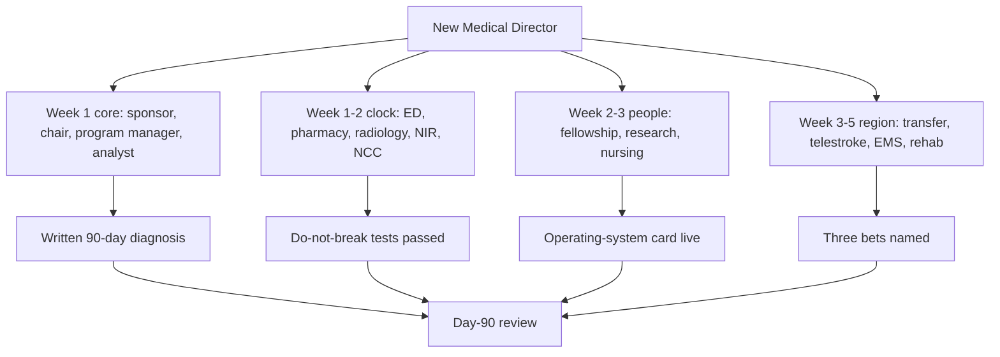

# First 90 Days and Year One

## Opening

The first 90 days determine whether the Medical Director inherits a program or actually commands one. Authority on the appointment letter is not authority in the CT scanner at 02:00. The job in quarter one is to take the clock, the committee, the data file, and the people who can stop a pathway, and make them answer to a single operating rhythm.

This chapter is a week-by-week plan for a new Medical Director, then a quarter-by-quarter plan for the rest of year one. It distinguishes a first survey year from a build year. It names what must not break while the new leader is still learning names. It ends with a first-year scorecard the executive sponsor can read without translation.

Do not customize the first two weeks. Those days are for orientation to reality, not for announcing a vision. Vision without a trusted denominator is theater. After day 14, choose three bets and starve everything else.

If the program is 90 days from a DSC survey, this chapter is subordinate to survey readiness. Stabilize tracers, data, and coverage first. Build later. If the program is 18 months from survey, use the 90 days to install the operating system in [Integrating the Pillars](37-integrating-pillars.md) and to put year-one bets on the roadmap.

## Why This Matters

A new Medical Director is a high-reliability risk. Coverage grids loosen while people wait to see what the new leader wants. Quality analysts pause PDSAs. Fellows test boundaries. Research coordinators escalate every protocol question. Spokes delay transfers “until we meet the new director.” None of that is malice. It is a system looking for the new center of gravity.

Patients do not pause for onboarding. Eligible disabling ischemic stroke still needs intravenous thrombolysis within 4.5 hours, with tenecteplase 0.25 mg/kg IV push (max 25 mg) or alteplase 0.9 mg/kg (max 90 mg), and dual-eligible patients still need both IVT and EVT without delay. ICH still needs procoagulant reversal on the CSTK-04 pathway. aSAH still needs nimodipine on the CSTK-06 pathway. The 90-day plan is worthless if those clocks slip while the Medical Director is in welcome meetings.

The first year also sets the external story. GWTG and Target: Stroke published award criteria (Chapter 23), plus rolling aSAH volume against the live E-App table, will be the numbers the chair and CMO remember. A first survey year that scrapes by without a working cadence produces a second year of hidden defects. A build year that chases awards before the huddle exists produces the same result with better slides.

## Core Framework

### Survey year versus build year

Diagnose the year before writing the calendar.

| Feature | First survey year | Build year |
| --- | --- | --- |
| Time to next DSC activity | ≤9 months | >9 months |
| Primary 90-day job | Tracer-proof the existing system | Install operating rhythm and choose bets |
| Data posture | Freeze definitions; validate the file | Repair abstraction and dashboards |
| Change appetite | Only safety and measure-critical changes | Pathway redesign allowed after week 6 |
| Fellowship / research | Protect, do not redesign | Curriculum and portfolio decisions in Q2–Q3 |
| External commitments | No new spokes or award stretch goals | Network and award trajectory in Q2 |
| Communication | “We will not break the clock or the binder” | “Three bets, named owners, dated” |
| Success at day 90 | Survey binder walkable; no coverage holes; after-actions running | OS card live; three bets funded or killed; first-year scorecard agreed |

If the diagnosis is mixed — survey in 10 months and a broken clock — treat it as a survey year until DTN and door-to-device are stable for 30 consecutive days.

### Do-not-break list

Publish this list on day 3. It is the contract with the night team.

| Do not break | Why | Day-3 test |
| --- | --- | --- |
| 24/7 vascular neurology response to code stroke | Clock starts whether the new MD is on campus | Page test from ED; time to answer |
| TNK / alteplase order set and pharmacy presence | Dose and mixing errors are not a “later” problem | Walk one mock order from EHR to administration |
| IR activation and backup room plan | Dual-eligible care cannot wait for a meeting | Night activation drill or last-case review |
| ICH reversal pathway | CSTK-04 is a time-critical safety measure | Locate agents; name the approving physician path |
| Nimodipine on aSAH admission | CSTK-06 is binary and visible | Last five aSAH charts |
| Dedicated neuro ICU admission rules | CSC capability expectation | Boarding log for last 14 days |
| Swallow screen before oral intake | Harm is immediate | Last 20 ischemic/hemorrhagic admits |
| On-call escalation card | New leaders create silent hesitancy | Every fellow and ED charge nurse has the current card |
| Research stay-out-of-the-hallway rule | Screens must not add minutes | Coordinator written rule posted |
| Peer-review confidentiality and referral path | Culture breaks faster than metrics | One test referral with the existing chair |

### Stakeholder map

| Stakeholder | What they need from the Medical Director in 90 days | What the Medical Director needs from them | First meeting week |
| --- | --- | --- | --- |
| Executive sponsor / CMO | One-page diagnosis; no surprise survey risk | Air cover for three bets; meeting time discipline | Week 1 |
| Department chair | Coverage integrity; professionalism path | Protected admin time; recruitment stance | Week 1 |
| Stroke program director / manager | Decision rights; calendar lock | The real binder, the real data, the real gossip | Day 1–2 |
| Quality analyst / abstractor | Frozen definitions or a dated change | Honest denominator problems | Week 1 |
| ED medical and nursing leads | Visible presence at 08:00 and at 02:00 once | Honest interval data; joint after-actions | Week 1–2 |
| Neurointervention lead | Shared dual-eligible rule; backup plan | On-call reliability; CSTK-09/11/12 partnership | Week 2 |
| Neurosurgery / NCC leads | ICH/aSAH bundle ownership | Beds, reversal, nimodipine, EVD, clipping/coiling path | Week 2 |
| Pharmacy | Dose, mixing, reversal stock | 24/7 presence or a timed workaround | Week 2 |
| Radiology / neuroradiology | CT priority and read times | Protocol cards; CTA/CTP night coverage | Week 2 |
| Fellowship director / DIO | Do-not-break teaching time | Duty-hour truth; evals; procedure logs | Week 2–3 |
| Research director / coordinators | Clock-protection rule | Screening log; weekend coverage | Week 3 |
| Transfer center / telestroke | Accepting-physician reliability | DIDO, decline reasons, spoke list | Week 3 |
| EMS / regional system | A named liaison | Destination and prenotification data | Week 4–5 |
| Rehab / clinic / 90-day callers | That 90-day mRS is a clinical product | CSTK-02/10 workflow | Week 4 |
| Unit nursing (ED, NCC, stroke unit) | Psychological safety to stop the line | The defects they have been carrying | Weeks 1–4, walk rounds |



### First-year scorecard (agree in week 4, score in week 52)

| Domain | Award (published criteria) | Internal | Owner |
| --- | --- | --- | --- |
| DTN | Honor Roll 75% ≤60 min; Elite 85% ≤60 min | Elite as labeled internal aim; Elite Plus stretch | MD + ED |
| Door-to-device | Advanced Therapy 50% ≤90 min direct / ≤60 min transfer (first device pass; ≠ CSTK-09 puncture) | Local stretch; report CSTK-09/11/12 | MD + NIR |
| GWTG achievement | 85% on each of 7 measures | Plus-award quality measures in range | Quality lead |
| CSTK-01 NIHSS | Specification-compliant | ≥95% internal | Analyst + ED/VN |
| CSTK-03 severity SAH/ICH | Specification-compliant (Hunt-Hess SAH; ICH Score ICH) | ≥95% internal (100% stretch) | NCC + NSGY |
| CSTK-04 ICH reversal | Specification-compliant | ≥90% initiation (100% eligible tracked is a different metric) | NCC + pharmacy |
| CSTK-06 nimodipine | Specification-compliant | ≥95% eligible | NCC + NSGY |
| CSTK-02 / CSTK-10 90-day mRS | Process in place | ≥80% contact attempt; favorable-outcome cohort complete | Clinic / caller |
| Swallow before oral intake | No unscreened oral intake events | 100% | Unit nursing |
| After-action on trigger cases | Started | 100% | AMD |
| Research clock interference | Zero tolerated | Zero | Research dir |
| Huddle held | Weekdays | 7 days / week including weekend note | MD / on-call |
| Survey binder | Walkable by day 60 in a survey year | Currency check monthly | Program mgr |
| aSAH rolling volume | Confirm live E-App table | Track vs criterion of 10 announced 2025-04-02 | Analyst |
| Three bets | Named by day 45 | Two of three complete or on-pace | MD |

!!! tip "Key Actions"

    In week 1, walk the clock yourself at least twice — once daytime, once after 22:00. Run the do-not-break tests and write a two-page diagnosis for the sponsor: what is safe, what is fragile, whether this is a survey year or a build year. In week 2, lock the huddle and the after-action trigger. In week 4, publish the OS card, the stakeholder map, and the first-year scorecard. By day 45, name three bets only. By day 90, hold a 60-minute review that scores the scorecard and either confirms or replaces the bets. Do not launch a new spoke, a new trial, or a new award stretch before day 45 unless safety requires it.

!!! abstract "Metrics Targets"

    Day-90 success is process integrity, not an award. Targets: huddle documented ≥90% of days; after-action on 100% of DTN >45 min cases from week 3 onward; no unfilled 24/7 vascular neurology slot; GWTG achievement measures each at or above the 85% published award cut or a dated recovery plan for any measure below; Target: Stroke published award tier known and honest (Chapter 23); CSTK-03 ≥95%, CSTK-04 ≥90% initiation, and CSTK-06 ≥95% each have an owner; 90-day mRS workflow assigned; research clock-interference events = 0; three bets written with owners and dates. Elite Plus and Advanced Therapy published award criteria are year-one stretch only if the labeled internal Elite aim is already met. Volume criteria are confirmed against the current E-App / CSC eligibility table, not memory.

!!! warning "Common Pitfalls"

    Announcing a vision in week 1 before the denominator is trusted. Changing the TNK/alteplase order set in month 1 without pharmacy and a mock. Holding listening sessions that never become a written diagnosis. Trying to chair every meeting instead of installing the AMD and the weekly ops spine. Ignoring the night and weekend because the welcome calendar is full. Treating the fellowship as a later problem while duty-hour and supervision gaps sit open. Promising a spoke medical director a new pathway the campus cannot staff. Using last year's Gold award as evidence that the clock is healthy. Building a personal dashboard that the analyst cannot maintain.

!!! success "Implementation Tips"

    Borrow the program manager's calendar for two weeks rather than inventing a new one. Write the two-page diagnosis in operational language the CMO can forward. Do one night ride-along with the charge nurse, not a town hall. Use existing measure IDs; do not rename DTN. If the culture is fearful, spend week 2 on after-actions that end without punishment. If the culture is complacent, spend week 2 on a public run chart. Hand the weekend huddle note template to the on-call pool on Friday of week 1. Schedule the day-90 review on day 10 so it cannot be postponed.

## How to Do the Work

### Daily / weekly — the 90-day plan

**Week 0 (before start date, if access exists)**

Request: last 12 months of GWTG, STK, CSTK; on-call schedules; last survey report and RFIs; current OS card if any; open PDSAs; privilege lists; research portfolio; transfer decline log. Read them. Do not send a critique.

**Week 1 — Take the clock and the binder**

- Day 1: Meet program manager and analyst. Walk the physical path from ambulance bay to CT to pharmacy to IR to NCC. Locate reversal agents and TNK/alteplase.
- Day 2: Sit in huddle even if it is informal. Page-test vascular neurology. Read the last 10 code-stroke records.
- Day 3: Publish the do-not-break list. Meet sponsor and chair. State that no structural change lands this week.
- Day 4–5: ED, pharmacy, radiology. Ask each group to name the last time the clock broke and what they did.
- Weekend: Take or shadow call once in the first 21 days.

**Week 2 — Install cadence**

- Lock 08:00 huddle and the after-action trigger list.
- Meet NIR, NCC, neurosurgery. Walk CSTK-09/11/12 and ICH/aSAH bundles.
- Meet fellowship director. Read the supervision policy. Confirm the escalation card.
- Write the two-page diagnosis: survey year vs build year; top three risks; top three assets.

**Week 3 — Data trust and research protection**

- Sit with the abstractor on five charts (one IVT, one EVT, one ICH, one aSAH, one transfer).
- Freeze measure definitions unless a specification error is found.
- Issue the research stay-out-of-the-hallway rule in writing.
- Start the late-DTN five-pillar worksheet on every trigger case.

**Week 4 — Publish the system**

- Release the OS card, stakeholder map, and first-year scorecard draft.
- Meet transfer center, telestroke, rehab/90-day callers.
- Hold a 30-minute all-hands: do-not-break list, huddle, after-action, no vision speech.
- Schedule day-90 review.

**Weeks 5–6 — Choose three bets**

- Build year: pick three from clock reliability, CSTK-04/06 reliability, 90-day mRS, night coverage, transfer DIDO, or data infrastructure.
- Survey year: pick three from tracer scripts, data validation, coverage documentation, privilege files, and a single visible safety defect.
- Name owners and 30/60/90-day products. Kill or park every other initiative.

**Weeks 7–8 — Prove the loop**

- Require that one defect has traveled the full five-pillar route.
- AMD chairs weekly ops at least once.
- Mock a 20-minute tracer with the program manager.
- EMS or spoke visit if the region is a bet; otherwise do not travel.

**Weeks 9–10 — Mid-course**

- Score the scorecard honestly. Replace a bet that is theater.
- Nursing walk-rounds on ED, NCC, and stroke unit.
- Confirm rolling aSAH volume and IVT/EVT volumes against the live eligibility table.

**Weeks 11–12 — Day-90 review**

- 60 minutes with sponsor, chair, program manager, AMD, quality lead.
- Packet: diagnosis then vs now; scorecard; three bets; survey posture; asks.
- Leave with written decisions, not encouragement.

### Monthly / quarterly — quarters 2 through 4

**Quarter 2 — Make the rhythm boring**

Weekly ops should feel repetitive. That is the point. Expand after-actions to ICH reversal and nimodipine misses if not already included. Start the monthly packet cover sheet. In a build year, launch the first PDSA that requires a pathway change. In a survey year, run two mock tracers and close documentation gaps. Fellowship: one simulation on the dual-eligible pathway. Research: weekend screening coverage named. Network: one spoke site visit or one EMS case review, not both unless staffed.

**Quarter 3 — Depth and honesty**

Add the equity slice to the monthly packet (night, weekend, transfer, sex, race/ethnicity, language). Re-validate CSTK-02/10 90-day contact rates. Privileging data freeze aligned to the quality file. Mid-year scorecard with the sponsor. If Target: Stroke Elite is already met, decide explicitly whether Elite Plus is a year-one goal or a year-two goal. Prune the research portfolio of studies that consume coordinator FTE without scientific or operational value. Begin the 3-year roadmap draft for the annual offsite.

**Quarter 4 — Lock the year and write the next one**

Annual offsite. Choose next year's three bets before January. Complete the first-year scorecard. Currency-check every number against the evidence register and live manuals. If a DSC survey is now inside nine months, convert the next 90 days to survey-year rules even if year one was a build year. Publish the year-two OS card version. Hand the AMD a written succession snapshot: who chairs which meeting, who covers which outage.

### Annual / multi-year

Year one is for command and rhythm. Year two is for elite process reliability and network. Year three is for academic differentiation that does not tax the clock. Do not reverse that order because a chair wants a center-of-excellence announcement.

Re-run the week-1 clock walk every anniversary. New Medical Directors are not the only people who lose the floor.

Protect the following year-one sequencing even when a recruiter, a dean, or a vendor offers a faster story:

| Window | Allowed growth | Forbidden growth |
| --- | --- | --- |
| Days 1–45 | Safety fixes; cadence; data trust | New spokes, new award stretch, new trial that touches the hallway |
| Days 46–90 | One PDSA on the weakest clock interval | Order-set rewrite without a mock; privilege redesign |
| Q2 | Pathway change if the 30-day clock is stable; one regional touch | Two regional projects at once |
| Q3 | Equity slice; 90-day mRS reliability; portfolio prune | Announcing “center of excellence” language |
| Q4 | Next-year bets; survey conversion if the window is now ≤9 months | Carrying zombie projects into January |

If a DSC survey lands inside year one, freeze this table at the survey-year column from [the diagnosis](#survey-year-versus-build-year) and do not resume build-year growth until the survey week checklist is closed and the clock has been stable for 30 days.

## Ready-to-Adapt Tools

### Tool 1 — Week-by-week 90-day calendar

```
NEW MEDICAL DIRECTOR — 90-DAY CALENDAR
Name: ________    Start date: ________    Survey year? [ ] Y [ ] N

WEEK 1  Take the clock
[ ] Physical path walk (bay–CT–pharmacy–IR–NCC)
[ ] Page test VN; locate TNK/alteplase and reversal agents
[ ] Last 10 code charts
[ ] Do-not-break list published
[ ] Sponsor + chair meetings
[ ] Shadow or take call scheduled within 21 days

WEEK 2  Install cadence
[ ] Huddle locked 08:00
[ ] After-action triggers posted
[ ] NIR / NCC / NSGY / pharmacy / radiology meetings
[ ] Fellowship supervision policy read
[ ] Two-page diagnosis written

WEEK 3  Data and research
[ ] Five-chart abstraction sit-with
[ ] Definitions frozen or dated change log started
[ ] Research hallway rule issued
[ ] Five-pillar worksheet in use

WEEK 4  Publish
[ ] OS card v0.1
[ ] Stakeholder map
[ ] Scorecard draft
[ ] Transfer / telestroke / 90-day meetings
[ ] 30-min all-hands
[ ] Day-90 review on calendar

WEEKS 5–6  Three bets
Bet 1: ________  Owner: ________  Day-90 product: ________
Bet 2: ________  Owner: ________  Day-90 product: ________
Bet 3: ________  Owner: ________  Day-90 product: ________
[ ] All other initiatives parked in writing

WEEKS 7–8  Prove the loop
[ ] One defect fully routed
[ ] AMD chairs ops
[ ] 20-min mock tracer
[ ] Optional: one regional touch

WEEKS 9–10  Mid-course
[ ] Honest scorecard
[ ] Nursing walk-rounds
[ ] Volume vs live E-App table
[ ] Replace theater bets

WEEKS 11–12  Review
[ ] 60-min day-90 packet
[ ] Written decisions
[ ] OS card v1.0
```

### Tool 2 — Two-page diagnosis memo

```
TO: Executive sponsor, department chair
FROM: Medical Director, Comprehensive Stroke Center
DATE: [Week 2]
RE: 90-day diagnosis — survey year / build year

1. VERDICT
   This is a [survey / build] year because [one sentence].

2. WHAT IS SAFE TODAY
   - Clock: [DTN median, % ≤60, last 30 days]
   - Hemorrhage bundles: [CSTK-04, CSTK-06 last 30/90 days]
   - Coverage: [holes in last 30 days]
   - Survey binder: [walkable / not walkable]

3. WHAT IS FRAGILE
   Risk 1:
   Risk 2:
   Risk 3:

4. ASSETS ALREADY IN PLACE
   -

5. DO-NOT-BREAK LIST STATUS
   Passed:          Failed / workaround:

6. THREE BETS (draft; final day 45)
   1.
   2.
   3.

7. ASKS
   Time: [protected admin; AMD support]
   Air cover: [meeting discipline; no new spokes until day 45]
   Resources: [only if safety]

8. DAY-90 REVIEW
   Date: ________
```

### Tool 3 — Stakeholder first-meeting script (20 minutes)

```
PURPOSE: Exchange needs; do not tour the CV.
1. What breaks on your service when stroke goes well? When it goes badly?
2. What have you already tried?
3. What must not change in the next 45 days?
4. What single defect should the Medical Director inspect in person this week?
5. How should 02:00 escalation reach the Medical Director?
CLOSE: Repeat back one commitment and a date. Send a four-line recap.
```

### Tool 4 — Do-not-break test sheet

```
TEST                         DATE    PASS?    NOTE / OWNER
VN page 24/7 answer <10 min
TNK/alteplase mock order
IR night activation path
ICH reversal agents located
Last 5 aSAH got nimodipine
NCC admission rule followed
Swallow before PO last 20
Escalation card current
Research hallway rule posted
Peer-review path tested
```

### Tool 5 — Day-90 review agenda (60 minutes)

```
0–5    Sponsor opens: decisions we will make today
5–15   Diagnosis then vs now (MD)
15–25  Scorecard (quality lead) — published award cuts first, then internal
25–35  Three bets: product, not narrative
35–45  Survey posture and volume vs live tables
45–55  Asks and decisions (sponsor + chair)
55–60  Write decisions in the room; assign dates
```

### Tool 6 — First-year quarterly review card

```
Q2 REVIEW  [date]
Rhythm boring? [ ] Y [ ] N
After-action compliance: ____
First PDSA product: ________
Mock tracers done: ____
Equity slice started? [ ] Y [ ] N

Q3 REVIEW  [date]
90-day mRS contact rate: ____
Privileging freeze done? [ ] Y [ ] N
Elite vs Elite Plus decision: ________
Research portfolio pruned? [ ] Y [ ] N
Roadmap draft started? [ ] Y [ ] N

Q4 REVIEW  [date]
Year-one scorecard final:
Next-year three bets:
Survey conversion needed? [ ] Y [ ] N
AMD succession snapshot filed? [ ] Y [ ] N
```

### Tool 7 — “Listening without theater” log

```
Use this so listening tours produce a file, not a vibe.

Date: ____  Unit/role: ________
Defect they named:
Already tried:
Do-not-break implication:
Belongs to which pillar:
Follow-up date / owner:
Converted to after-action or PDSA? [ ] Y [ ] N  ID: ____
```

### Tool 8 — First-year scorecard worksheet

```
METRIC                    BASELINE (day 14)   DAY 90   Q2   Q3   Q4   AWARD   INTERNAL
DTN % ≤60
DTN % ≤45
DTN % ≤30
DTD % ≤90 direct
DTD % ≤60 transfer
GWTG 7 at ≥85% (Y/N + weakest)
CSTK-01
CSTK-03
CSTK-04
CSTK-06
CSTK-09 median
CSTK-11
CSTK-12
CSTK-02 contact %
After-action %
Huddle %
Research clock events
aSAH rolling 12 mo
Open PDSAs / overdue
```

### Tool 9 — Build-year versus survey-year decision tree (text)

```
Is DSC activity ≤9 months away?
  YES → Survey year.
        May we change a pathway?
          Only if it is unsafe or the measure definition is wrong.
        May we add a spoke?
          No, unless the spoke already sends patients and the issue is safety.
        What are the three bets?
          Binder, data validation, coverage documentation, or one safety defect.
  NO  → Is the clock unstable (DTN or DTD missing the labeled internal aim for 30 days)?
          YES → Act as survey year until 30 stable days, then convert.
          NO  → Build year. Three bets may include redesign, network, awards.
```

### Tool 10 — Onboarding packet index for the incoming MD

```
TAB A  OS card, do-not-break list, escalation card
TAB B  Last 12 months GWTG / STK / CSTK
TAB C  Last survey report, RFIs, evidence of action
TAB D  Coverage grids 90 days back and 90 days forward
TAB E  Privilege and peer-review path
TAB F  Open PDSAs and safety events
TAB G  Research portfolio and hallway rule
TAB H  Transfer / telestroke / EMS one-pagers
TAB I  Fellowship supervision and duty-hour report
TAB J  Current E-App eligibility screenshot dated
```

## Integration With Other Pillars

The 90-day plan installs the operating system in the integrating-pillars chapter. It uses the agendas in the checklists chapter rather than inventing a personal meeting style. It populates the KPI scorecard from the KPI library and refuses vanity metrics. It opens PDSAs with the audit tools, not with slogans. Clinical partners are met in the order the clock requires, not the order of academic rank. Education and research are protected early and redesigned late. Strategy waits for day 45 unless safety or survey forces an earlier ask.

Hand this chapter to the incoming Associate Medical Director as well. The AMD who can run weeks 7–12 is the succession plan.

## Sources

- 2026 Guideline for the Early Management of Patients With Acute Ischemic Stroke. *Stroke*. 2026;57(8):e316–e436. DOI 10.1161/STR.0000000000000513.
- 2022 Guideline for the Management of Patients With Spontaneous Intracerebral Hemorrhage. *Stroke*. DOI 10.1161/STR.0000000000000407.
- 2023 Guideline for the Management of Patients With Aneurysmal Subarachnoid Hemorrhage. *Stroke*. 2023;54:e314–e370. DOI 10.1161/STR.0000000000000436.
- Joint Commission DSC / CSC standards and SCS26; CSTK Specifications Manual v2026B (posted 02/06/2026; 3Q–4Q 2026 discharges). The April 2, 2025 Joint Commission announcement reduced the annual aSAH volume criterion to 10. Confirm live E-App tables for other volumes.
- GWTG-Stroke recognition criteria (AHA, last reviewed 9 September 2022): 85% achievement-measure award cut; Target: Stroke Honor Roll / Elite / Elite Plus / Advanced Therapy as **published award criteria** (Chapter 23), not CSC certification floors.
- High-reliability organizing and IHI Model for Improvement — used here as onboarding discipline, not as slogans.
