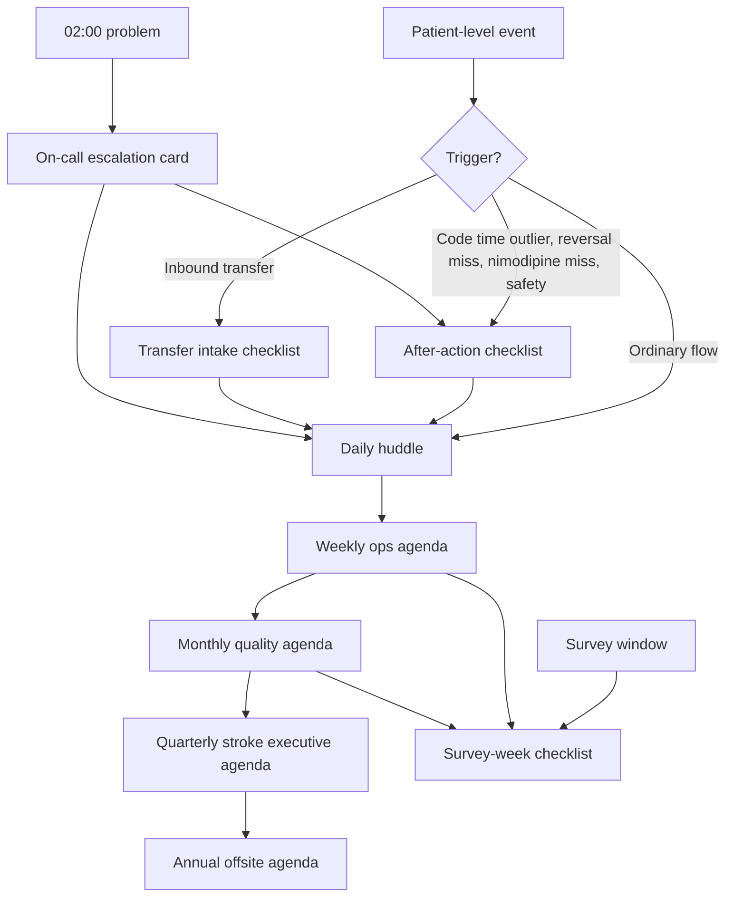

# Checklists, Agendas, and Cadence

## Opening

Meetings fail programs more quietly than complications. A Comprehensive Stroke Center that cannot run a 12-minute huddle will not run a 90-minute executive review. Cadence is not hospitality. It is how the Medical Director converts defects into decisions before the next eligible patient arrives.

This chapter is a paste-ready kit: daily huddle, weekly ops, monthly quality, quarterly stroke executive, annual strategy offsite, code-stroke after-action, transfer intake, survey week, and the on-call escalation card. Every template is a sample to adapt through local medical staff rules, nursing policy, and legal review. None is a hospital policy until monthly quality and medical staff say it is.

Use the templates as written for the first 30 days. Then shorten. A good agenda loses lines. A bad program adds them.

Do not create a new meeting to use a template. Map each template onto the operating-system card in [Integrating the Pillars](37-integrating-pillars.md). If a template has no owner and no decision right, it is clutter.

## Why This Matters

Surveyors, fellows, night nurses, and executive sponsors all experience the program as a series of conversations. If those conversations have no script, the same case is described five ways and no one owns the interval that failed. If they have a script that no one follows, the program is performing quality rather than practicing it.

Time metrics make the cost visible. Target: Stroke Honor Roll / Elite / Elite Plus / Advanced Therapy are **published award criteria**, not CSC certification floors (Chapter 23). Those cuts are not met in a monthly meeting. They are met in the huddle, the after-action, and the transfer intake that happened last night.

Hemorrhagic clocks are just as unforgiving. CSTK-04 (procoagulant reversal initiation for ICH) and CSTK-06 (nimodipine for aSAH) are binary in front of a surveyor. The after-action checklist is how a miss becomes a system change instead of a chart note. CSTK-02 and CSTK-10 (90-day mRS) fail in silence if no weekly agenda line asks whether the caller queue is alive.

Cadence also protects culture. An escalation card that is current at 02:00 is psychological safety in pocket-card form. A survey-week checklist that starts 21 days out prevents the last-minute binder performance that staff correctly read as fear.

## Core Framework

### Cadence rules

| Rule | Practice |
| --- | --- |
| One purpose | Every meeting names the decision it is allowed to make |
| One owner | Named chair; deputy named; meeting dies if both absent unless pre-delegated |
| One packet | Pre-read 24 hours prior except the daily huddle |
| Time box | End on time; parking lot is a written list, not a second meeting |
| Trigger override | After-actions and stop-the-line huddles jump the queue |
| No spectator chairs | If a role has no line on the agenda, they receive the note, not a seat |
| Decision log | Three bullets leave every meeting: decided, owner, date |
| Currency | Agendas cite measure IDs, not nicknames |

### Morning clock (do not add a fourth meeting)

| Clock | Meeting | Duration | Owner |
| --- | --- | --- | --- |
| 07:00 | Unit charge (swallow / SCD / STK-5 / 36-h discharges) | 7 min | Charge RN |
| 08:00 | CSC OS huddle (codes, beds, reversal, nimodipine, research) — this is also the hyperacute review | 12 min | MD / AMD |
| Same shift | After-action (trigger list) | 10–15 min | Case team |

The 08:00 row is the existing daily huddle (Tool 1). Do not create a fourth morning meeting.

### Meeting-to-artifact map

| Template in this chapter | Horizon | Required artifact produced |
| --- | --- | --- |
| Daily huddle agenda | Daily | Same-day owner list; weekend three-line note |
| Code-stroke after-action | Same shift | Interval times; recovery action |
| Transfer intake checklist | Per transfer | Accept/deny with clinical reason and clock start |
| Weekly ops agenda | Weekly | Pattern call; PDSA referrals |
| Monthly quality agenda | Monthly | Packet decisions; PDSA open/close |
| Quarterly stroke executive agenda | Quarterly | Resource and policy decisions |
| Annual offsite agenda | Annual | 3–5 bets; killed projects |
| Survey-week checklist | Per survey | Tracer-ready binder and staffing |
| On-call escalation card | Always | Who is called, in what order, for what |



### Time boxes and quorums

| Meeting | Time box | Quorum to make a decision | Note allowed if inquorate |
| --- | --- | --- | --- |
| Daily huddle | 12 min | Charge RN + covering VN or APP | Yes — still run |
| After-action | 10–15 min | Anyone on the case + one recorder | Yes |
| Weekly ops | 45 min | MD or AMD + program manager | No decision; information only |
| Monthly quality | 60–90 min | MD + quality lead + one physician partner | No PDSA close |
| Quarterly stroke executive | 90 min | Sponsor + MD | No capital or FTE decision |
| Annual offsite | 4 hours | MD + sponsor + chair + pillar leads | Do not hold |

!!! tip "Key Actions"

    Paste the daily huddle script into the standing 08:00 slot this week and enforce the 12-minute box for 14 consecutive days. Issue the escalation card to every fellow, APP, ED charge nurse, and transfer-center agent; collect a read-back. Put the after-action checklist in the code-stroke packet, not in a quality shared drive. Schedule the next monthly quality and quarterly stroke executive with the agendas in the invite, not “TBD.” Assign a survey-week owner even if the window is months away.

!!! abstract "Metrics Targets"

    Process targets for cadence itself: huddle start on time ≥90%; huddle duration ≤15 min on ≥80% of days; after-action completed same shift or next huddle for 100% of trigger cases; weekly ops held 46/52 weeks; monthly packet out 24 hours in advance ≥10/12 months; quarterly stroke executive produces at least one written decision each quarter; escalation card version date ≤180 days old; survey-week checklist opened 21 days before any on-site. Clinical award cuts remain the GWTG 85% achievement measures (Chapter 23); label Elite as the internal DTN aim; report CSTK to specification.

!!! warning "Common Pitfalls"

    Huddles that become sign-out theater and run 28 minutes. After-actions scheduled for next Tuesday. Transfer intake done in chat threads with no clock start. Monthly quality used as a lecture. Executive meetings that review a dashboard and decide nothing. Escalation cards with names that left six months ago. Survey checklists that begin the Sunday night before the surveyor arrives. Agendas that list “discussion” as an outcome. Inviting everyone who might be interested.

!!! success "Implementation Tips"

    Print after-action and transfer intake on one page each, both sides if needed, and keep them where the work happens. Use a standing Zoom or room that does not change. Put the decision log at the top of the next agenda so drift is visible. Color-mark any item older than 14 days. If weekly ops cannot finish, cut the education announcements, not the 7-day metrics. Rehearse the escalation card with a 02:00 page test twice a year.

## How to Do the Work

### Daily / weekly

Run the huddle standing, on time, with the script in Tool 1. The weekend on-call writes the three-line note even if nothing happened. Complete after-actions on the same shift when DTN >45 minutes, door-to-device is an outlier against the program's internal rule, ICH reversal is missed or late against the local CSTK-04 operationalization, nimodipine is missed, NIHSS is missing, or research enters the time stamps.

Use the transfer intake checklist for every inbound acute ischemic, ICH, and aSAH transfer, including those that start as telestroke. The clock the CSC will be judged on often starts at the first hospital. DIDO lives or dies in this conversation.

Weekly ops follows Tool 3. Pre-read is a one-page 7-day metric strip plus open after-actions. The chair ends by writing three decisions in the invite thread.

### Monthly / quarterly

Monthly quality follows Tool 4 and consumes the packet cover sheet from the integrating-pillars chapter. It is the only meeting that opens or closes a reported PDSA. Quarterly stroke executive follows Tool 5. The Medical Director presents. The sponsor is asked for decisions in writing.

### Annual / multi-year

Annual offsite follows Tool 6. Half-day. Pre-read one week prior. Output is a dated list of bets and kills, not a consensus mural. Every other year, tabletop a survey week using Tool 8 even if no survey is scheduled.

Review every template's version date in August during the evidence-register currency check. If a measure ID retired — CSTK-07 is not in the current set — remove it from agendas the same week.

## Ready-to-Adapt Tools

All tools below are samples to adapt. Replace bracketed fields. Route through monthly quality and medical-staff approval before production use.

### Tool 1 — Daily huddle agenda (12 minutes)

```
CSC DAILY HUDDLE — [date]  08:00–08:12  Chair: [MD / AMD / weekend on-call]
Scribe: [program coordinator or charge]

1. OVERNIGHT CODES (3 min)
   # codes: __   IVT: __   EVT: __   ICH reversal: __   aSAH: __
   Fastest DTN: __   Slowest DTN: __   Dual-eligible delay? [ ] Y [ ] N
   After-action still owed on: ________

2. CAPACITY (3 min)
   NCC open: __   Stroke-unit open: __   IR room: [ ] free [ ] delayed
   CT delay: [ ] none [ ] yes ____   Transfer holds: __
   Coverage hole next 24 h: ________   Workaround: ________

3. SAFETY / QUALITY (3 min)
   Missing NIHSS: __   Missing swallow: __   Missing 90-day calls: __
   Open safety event: ________
   Equity / interpreter / night flag that cannot wait: ________

4. RESEARCH AND TEACHING (2 min)
   Active screens in ED/NCC: __   Keep out of hallway: [ ] named protocol
   Noon teaching burst? [ ] N [ ] Y topic: ________

5. SAME-DAY OWNERS (1 min) — max three
   1. ________  Owner: ____  By: ____
   2. ________  Owner: ____  By: ____
   3. ________  Owner: ____  By: ____

WEEKEND THREE-LINE NOTE (if Saturday/Sunday)
Codes/times: ________
Holes/holds: ________
Need weekday follow-up: ________
Sent to: stroke-program inbox  Time: ____
```

### Tool 2 — Code-stroke after-action checklist

```
CODE-STROKE AFTER-ACTION  (sample to adapt)    ID: CS-[YYYYMMDD]-[seq]
Complete same shift if any trigger below is met. 10–15 minutes. Stand-up.

TRIGGERS (check all that apply)
[ ] DTN >45 min
[ ] Dual-eligible patient with any delay to puncture
[ ] Door-to-device outlier vs internal rule
[ ] ICH reversal not initiated as expected (CSTK-04 pathway)
[ ] Nimodipine miss (CSTK-06)
[ ] NIHSS not performed as required (CSTK-01)
[ ] Research process in the time stamps
[ ] Harm, near miss, or stop-the-line
[ ] Other: ________

IDENTIFIERS (no full identifiers on emailed copies)
Date/time in: ________   Source: [ ] EMS [ ] private [ ] transfer [ ] MSU [ ] telestroke
LKW / discovery: ________   NIHSS: ____   Disabling? [ ] Y [ ] N
Pathway: [ ] IVT only [ ] EVT only [ ] IVT+EVT [ ] ICH [ ] aSAH [ ] mimic / other

INTERVALS (minutes) — write “NA” rather than leaving blank
Door–CT: ____   CT–decision: ____   Decision–needle: ____   DTN: ____
Door–puncture: ____   Puncture–TICI ≥2B: ____
First hospital DIDO (if transfer): ____

AGENT / PROCEDURE
[ ] TNK 0.25 mg/kg max 25 mg   dose given: ____
[ ] Alteplase 0.9 mg/kg max 90 mg (10% bolus / 60 min)   dose given: ____
[ ] TNK 0.4 / cardiac-card refused (Class 3 – No Benefit)
[ ] No IVT  reason: ________
[ ] EVT  TICI: ____   CSTK-08 documented? [ ] Y [ ] N

WHAT FAILED (choose one primary interval)
[ ] Prenotification / registration   [ ] Door–CT   [ ] Imaging protocol
[ ] Read / decision   [ ] Consent   [ ] Pharmacy mix / delivery
[ ] Access / room   [ ] Staffing   [ ] Competing trauma / STEMI
[ ] Transfer communication   [ ] Research interference   [ ] Other: ____

RECOVERY TODAY
Action: ________
Owner: ________   Done by (time): ________
Is tonight still safe? [ ] Y [ ] N  If no, stop-the-line notified: ________

ROUTING
[ ] Next huddle   [ ] Weekly ops   [ ] Peer review   [ ] PDSA candidate
[ ] Teaching product   [ ] Research deviation form
Recorder: ________   Attendees: ________
```

### Tool 3 — Weekly operations agenda (45 minutes)

```
CSC WEEKLY OPERATIONS  [date]  Chair: [MD or AMD]  Scribe: [program manager]
Pre-read due 24 h prior: 7-day metric strip + open after-actions

0. DECISIONS FROM LAST WEEK (3 min) — done / late / killed
1. 7-DAY CLOCK (12 min)
   n IVT: __  DTN median: __  %≤60: __  %≤45: __  %≤30: __
   n EVT: __  DTD median direct/transfer: __ / __
   CSTK-11 / CSTK-12 events this week: ________
   After-actions open: __   Oldest: ________
   Pattern? [ ] no [ ] yes  description: ________

2. TRANSFERS AND NETWORK (8 min)
   Inbound acute: __   Declines: __   Reasons: ________
   DIDO outliers: ________
   Telestroke door-to-recommendation outliers: ________

3. HEMORRHAGE AND UNIT SAFETY (7 min)
   ICH reversals due / done: __ / __
   aSAH nimodipine due / done: __ / __
   Swallow misses: __   Boarding >4 h: __
   NCC / IR capacity events: ________

4. PEOPLE AND COVERAGE (5 min)
   Holes next 14 days: ________
   Escalation-card current? [ ] Y [ ] N
   Fellowship / APP issues that affect the clock: ________

5. RESEARCH SAFETY (3 min)
   Screens touching codes: __   Clock interference: __
   Weekend coordinator coverage: [ ] named [ ] gap

6. PDSA AND SURVEY (4 min)
   Open PDSAs: __   Overdue: __
   Binder item this week: ________

7. DECISIONS (3 min) — write in the room
   D1: ________  Owner: ____  Date: ____
   D2: ________  Owner: ____  Date: ____
   D3: ________  Owner: ____  Date: ____
```

### Tool 4 — Monthly quality agenda (60–90 minutes)

```
CSC MONTHLY QUALITY  [month YYYY]
Chair: Medical Director     Quorum: MD + quality lead + one physician partner
Packet out 24 hours prior. No slide-only items.

1. ATTENDANCE AND CONFLICTS (2 min)
2. PRIOR DECISIONS AND PDSA BOARD (8 min)
   Open / due / overdue: __ / __ / __
   Vote: close / extend / kill  IDs: ________

3. GWTG-STROKE (10 min)
   Seven achievement measures vs 85% published award cut — list any below:
   ________
   P-29b GWTG #7 intensive statin (not the same as STK-6): ________
   Quality measures of concern: ________
   Award posture (published criteria, not floors): Bronze / Silver / Gold trajectory: ________
   Target: Stroke published award criteria currently met: [ ] none [ ] HR [ ] Elite [ ] Elite Plus
   Advanced Therapy (50% DTD ≤90 direct / ≤60 transfer; DTD ≠ puncture): [ ] Y [ ] N
   Target: Type 2 Diabetes composite (if applicable) ≥80% for 12 mo: [ ] Y [ ] N [ ] NA

4. STK SET (8 min)
   STK-1 VTE   STK-2 DC antithrombotic   STK-3 AF anticoagulation
   STK-4 thrombolytic   STK-5 antithrombotic HD2   STK-6 statin (not P-29b)
   STK-8 education   STK-10 rehab
   STK-OP / CMS OQR items: confirm current set, do not assume OP-23 is mandatory
   Outliers and abstraction questions: ________

5. CSTK SET v2026B (12 min)
   Review only active IDs: 01, 02, 03, 04, 05, 06, 08, 09, 10, 11, 12
   Do not display CSTK-07 (not in current set)
   Deep-dive this month: [ ] 04 [ ] 06 [ ] 09/11/12 [ ] 02/10 [ ] other ____
   Findings: ________

6. EQUITY SLICE (7 min)
   Night vs day DTN; weekend; transfer vs direct; language; sex; race/ethnicity
   Action: ________

7. SAFETY EVENTS AND PEER REVIEW INTAKE (6 min)
8. EDUCATION PRODUCT THIS MONTH (3 min)
9. RESEARCH SAFETY LINE (3 min)
10. SURVEY / MANUAL CURRENCY (4 min)
    SCS26 / E-App table last confirmed: [date]
    aSAH rolling 12-month volume: ____  (criterion announced 10 on 2025-04-02; confirm live table)
11. VOTES AND DECISIONS (5 min)
12. NEXT PACKET OWNER AND DEEP-DIVE (2 min)
```

### Tool 5 — Quarterly stroke executive agenda (90 minutes)

```
CSC QUARTERLY STROKE EXECUTIVE  [Q# YYYY]
Chair: Executive sponsor     Presenter: Medical Director
Pre-read: 10-slide cap + scorecard appendix

00–05  Sponsor: decisions on the table today (read them aloud)
05–20  Scorecard
       Clock (DTN, DTD, CSTK-11/12)
       Hemorrhage (CSTK-04/06)
       Outcomes process (CSTK-02/10)
       GWTG / Target: Stroke / Advanced Therapy published award posture (Ch 23)
20–35  Three defect stories (one must be a late DTN or dual-eligible delay)
35–45  PDSA board and what closed
45–55  Survey risk and volume vs live E-App tables
55–65  Network / EMS / spoke
65–75  FTE, capital, and unfunded asks (principles, no invented dollars)
75–85  DECISIONS — write in the room
       Policy / FTE / capital / external commitment / none
85–90  Communication: what the units will hear this week
```

### Tool 6 — Annual strategy offsite agenda (4 hours)

```
CSC ANNUAL STRATEGY OFFSITE  [date]  Half-day
Required: MD, AMD, sponsor, chair, program manager, quality lead,
fellowship dir, research dir, NIR lead, NCC lead, ED lead, network lead
Pre-read (7 days prior): SWOT, 3-year roadmap draft, year scorecard,
workforce, research portfolio, survey cycle, evidence-register changes

HOUR 0–0.5  Facts only — last 12 months, no strategy talk
HOUR 0.5–1.25  SWOT in silence then one round (use audits-playbook SWOT)
HOUR 1.25–2.0  What to kill (mandatory: at least one project)
HOUR 2.0–2.25  Break
HOUR 2.25–3.25  Choose 3–5 bets for the next 12–36 months
               Each bet: owner, 12-month product, resource implication, harm if ignored
HOUR 3.25–3.75  Year-one vs year-two vs year-three sequence
               Clock first, network second, academic differentiation third
HOUR 3.75–4.0  Write bets and kills on one page; schedule Q1 stroke executive to ratify

OUT-OF-BOUNDS
No vendor demos. No award-chasing without a floor. No new meeting created.
```

### Tool 7 — Transfer intake checklist

```
CSC TRANSFER INTAKE  (sample to adapt)   ID: XFER-[YYYYMMDD]-[seq]
Use for every inbound AIS, ICH, aSAH, and salvage request.

A. CLOCK
   First-hospital arrival: ________   Their LKW: ________
   First-hospital NIHSS / ICH score / WFNS or HH: ________
   Imaging done: [ ] NCT [ ] CTA [ ] CTP [ ] MRI/MRA [ ] none
   Images available now? [ ] Y [ ] N   Method: ________
   IVT given there? [ ] TNK [ ] alteplase [ ] no  time: ________
   DIDO so far: ____ min   Their barrier: ________

B. CLINICAL SCREEN
   Pathway request: [ ] EVT [ ] ICH reversal / NCC [ ] aSAH [ ] other
   Dual-eligible still in window? [ ] Y [ ] N [ ] unknown
   Airway / BP / anticoagulation / last dose: ________
   Contraindications / goals of care known? ________

C. CAPACITY
   IR available? [ ] Y [ ] N  workaround: ________
   NCC bed? [ ] Y [ ] N  workaround: ________
   Accepting attending named: ________  time accepted: ________

D. DECISION
   [ ] Accept mothership / EVT
   [ ] Accept NCC / hemorrhage
   [ ] Redirect to another capable center (reason): ________
   [ ] Decline (reason; never “no bed” without named next step): ________
   Family / sending team told: [ ] Y  time: ________

E. HANDOFF TO LOCAL CLOCK
   ETA: ________   Prenotification to ED/IR/NCC: [ ] Y
   Registration as code on arrival? [ ] Y
   Research screen allowed only after pathway stable: [ ] acknowledged

F. QUALITY TAGS
   Night / weekend / language / uninsured / long-distance: ________
   After-action needed on DIDO? [ ] Y [ ] N
   Recorder: ________
```

### Tool 8 — Survey-week checklist

```
CSC SURVEY-WEEK CHECKLIST  (sample to adapt)
Open 21 days before on-site or virtual survey activity.

T-21 TO T-14
[ ] Current SCS26 / DSC standards printed or bookmarked
[ ] CSTK v2026B and STK specs bookmarked; CSTK-07 removed from any poster
[ ] E-App / eligibility table screenshot dated
[ ] aSAH rolling 12-month count confirmed
[ ] Privilege lists vs actual call schedules reconciled
[ ] Peer-review process one-pager current
[ ] GWTG, STK, CSTK packets for last 4 quarters printed
[ ] Open PDSA binder current
[ ] Research list and IRB letters
[ ] Fellowship supervision policy
[ ] Escalation card and OS card posted
[ ] Night-shift briefing scheduled

T-13 TO T-8
[ ] Tracer scripts: IVT, EVT transfer, ICH reversal, aSAH nimodipine, 90-day mRS
[ ] Unit posters show current doses (TNK 0.25 mg/kg max 25; alteplase 0.9/90)
[ ] Posters show TNK 0.4 / cardiac-card refuse (Class 3 – No Benefit)
[ ] Order sets match posters
[ ] Two mock tracers, one after 17:00
[ ] Staff list of who speaks to surveyors (and who pages the MD)
[ ] Quiet room, escort plan, badge access

T-7 TO T-1
[ ] Coverage locked; no first-time float in ED/NCC/IR without a buddy
[ ] Huddle continues every day including survey days
[ ] After-action process does not pause
[ ] Known fragile charts pulled and reviewed
[ ] Vendor and construction notices
[ ] Sponsor and chair briefed on residual risks (honest)

SURVEY DAYS
[ ] MD or AMD in house; phone with a human, not voicemail
[ ] Scribe assigned to every interview
[ ] Data questions answered only from the validated file
[ ] Parking lot for unknown answers; same-day close
[ ] End-of-day debrief 20 min; no hallway editorials

T+1 TO T+14
[ ] RFI log
[ ] Thank-you that does not include performance claims
[ ] Defects found during survey entered as after-actions or PDSAs
[ ] OS card updated if a real gap appeared
```

### Tool 9 — On-call escalation card

```
CSC ON-CALL ESCALATION CARD  v[YYYY.MM]  (sample to adapt)
Post in ED, IR, NCC, stroke unit, transfer center. Replace every 180 days or at any name change.

FOR ANY CODE STROKE / EVT / ICH REVERSAL / aSAH
1. Activate code-stroke pathway (do not call the MD first)
2. Covering vascular neurology: [pager/phone]
3. If no answer in 5 minutes: repeat once, then AMD: [phone]
4. If no AMD: Medical Director: [phone]
5. House supervisor: [phone] for beds, diversion, security

FOR IR ACTIVATION
Primary NIR: [ ]
Backup NIR: [ ]
OR / hybrid backup: [ ]
If both NIR unreachable at 10 minutes: MD + house supervisor

FOR ICH REVERSAL
Order set: [name]
Pharmacy STAT: [phone]
NCC attending: [ ]
If agent unavailable: house supervisor + MD (stop-the-line)

FOR INBOUND TRANSFER DECLINE PRESSURE
Accepting VN cannot be pressured off clinical grounds by bed status.
If “no bed”: house supervisor finds a path or the MD is called.
Never leave a sending team without a next step.

FOR RESEARCH REQUESTS DURING A CODE
No. Pathway first. Coordinator may observe after the clock is stable.
If conflict: covering VN decides; MD notified same shift.

FOR PROFESSIONALISM / SAFETY STOP-THE-LINE
Any clinician may halt a non-safe step.
Notify covering VN and house supervisor immediately.
MD notified same shift. No retaliation path is the MD's job.

CARD OWNER: program manager     NEXT REVIEW: [date]
```

### Tool 10 — Decision-log stamp (paste at the top of every weekly/monthly note)

```
DECISIONS LAST MEETING
ID     Decision                         Owner    Due     Status
D-     ____________________________     ____     ____    done/late/killed
D-     ____________________________     ____     ____    done/late/killed
D-     ____________________________     ____     ____    done/late/killed
```

### Tool 11 — 7-day metric strip (weekly ops pre-read)

```
WEEK OF [date]   n AIS codes: __   n IVT: __   n EVT: __   n ICH: __   n aSAH: __
DTN median / %≤60 / %≤45 / %≤30: ____ / ____ / ____ / ____
DTD median direct / transfer: ____ / ____
CSTK-11 events (TICI ≥2B ≤120 from arrival): due __ done __
CSTK-12 events (TICI ≥2B ≤60 from puncture): due __ done __
CSTK-04 due/done: __ / __    CSTK-06 due/done: __ / __
NIHSS misses: __   swallow misses: __   90-day calls overdue: __
After-actions open: __   Research clock events: __
```

### Tool 12 — Agenda hygiene audit (quarterly, 15 minutes)

```
[ ] Every standing meeting is on the OS card
[ ] Every invite contains the agenda, not “TBD”
[ ] Packet 24 h prior rate last quarter: ____
[ ] Mean huddle duration: ____
[ ] After-action same-shift rate: ____
[ ] Escalation card version ≤180 days
[ ] CSTK-07 absent from all agendas and posters
[ ] At least one meeting was cancelled rather than held without quorum
[ ] Decision-log stamp in use
```

## Integration With Other Pillars

These agendas are how clinical operations, quality, education, research, and strategy share a clock. The huddle and after-action are clinical instruments with quality outputs. Monthly quality is a quality instrument with education and research lines that cannot be optional. Quarterly stroke executive is a strategy instrument that must hear defect stories, not only volume. The escalation card is a culture instrument. The survey-week checklist is a certification instrument that should feel identical to an ordinary week if the cadence is real.

Pair this chapter with the KPI library and SOP skeletons when a meeting needs a definition or a procedure, and with the audit/PDSA chapter when a recurring agenda line becomes a formal cycle.

## Sources

- 2026 Guideline for the Early Management of Patients With Acute Ischemic Stroke. *Stroke*. 2026;57(8):e316–e436. DOI 10.1161/STR.0000000000000513.
- Specifications Manual for Joint Commission National Quality Measures (v2026B), CSTK and STK / STK-OP. Posted 02/06/2026 (3Q–4Q 2026 discharges).
- GWTG-Stroke recognition criteria and Target: Stroke Honor Roll / Elite / Elite Plus / Advanced Therapy as **published award criteria** (AHA public criteria, last reviewed 9 September 2022; Chapter 23).
- Joint Commission DSC survey practice: standards, clinical practice guidelines, performance measurement; SCS26. Confirm live E-App tables. The April 2, 2025 announcement reduced the annual aSAH volume criterion to 10.
- IHI Model for Improvement; high-reliability organizing (sensitivity to operations; deference to expertise).
