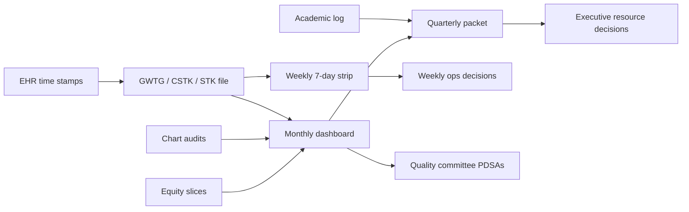

# KPIs, Dashboards, FTE, and SOP Templates

## Opening

A Comprehensive Stroke Center that cannot name its measures will be named by someone else's. The Medical Director needs a KPI library that distinguishes certification floors from internal elite targets, a dashboard that fits on one screen, an FTE worksheet that can survive a budget meeting, and SOP skeletons that staff can adapt without inventing a pathway in the hallway.

This chapter is a sample kit. Every threshold that is a published GWTG or Target: Stroke criterion is labeled as such. Every other number is an internal management target or a local operationalization and must be ratified by stroke governance. SOP text is original and generic. It is not a substitute for pharmacy, nursing, radiology, medical-staff, or legal approval.

Do not build a second measurement system. GWTG-Stroke, STK, and CSTK already define the external file. The library below adds balancing, equity, and academic measures so the program does not optimize DTN by harming something unseen.

Refuse vanity metrics. If a number cannot change a Tuesday decision, it does not belong on the dashboard.

## Why This Matters

Measure chaos is how academic CSCs drift. One committee watches GWTG achievement at 85% on each of seven measures. Another watches CSTK-11 (TICI ≥2B within 120 minutes of arrival) and CSTK-12 (TICI ≥2B within 60 minutes of puncture). A chair asks for “volume.” A dean asks for papers. EMS asks for DIDO. None of those requests is wrong. Unprioritized, they produce three dashboards and no action.

The 2026 AIS guideline makes the clinical stakes explicit: treat eligible disabling deficits rapidly within 4.5 hours regardless of NIHSS; use tenecteplase 0.25 mg/kg IV push (max 25 mg) or alteplase 0.9 mg/kg (max 90 mg); do not delay thrombectomy in dual-eligible patients. Those rules only become operations when the dashboard shows DTN and door-to-device on the same row and the SOP tells the night team what to do.

FTE is the hidden KPI. Abstractors, coordinators, 90-day callers, and an Associate Medical Director are how CSTK-02, trial screening, and weekly ops exist. A program that funds IR capacity but not a caller will fail CSTK-02 and CSTK-10 in public while celebrating reperfusion in private.

SOPs are how new fellows, locums, and night pharmacists avoid improvisation. A skeleton that names the dose, the stop-the-line rule, and the documentation fields prevents the “we usually…” conversation that surveyors can hear from the doorway.

## Core Framework

### KPI classes

| Class | Question it answers | Example | Where it lives |
| --- | --- | --- | --- |
| Process | Did the right action happen on time? | DTN, CSTK-09, STK-5 | Weekly ops, GWTG/STK/CSTK |
| Outcome | Did the patient do better? | CSTK-10 favorable 90-day mRS; symptomatic HT (CSTK-05) | Monthly quality |
| Balancing | Did we break something else to win the process? | Door-to-CT for non-stroke; futile transfers; pharmacy error | Monthly quality |
| Equity | Is reliability the same across groups? | Night vs day DTN; language; transfer vs direct | Monthly quality, quarterly executive |
| Academic | Are we building capability, not only volume? | StrokeNet screens, fellow procedure logs, peer-reviewed output | Quarterly, annual |
| Structural | Can the system still run Tuesday night? | Unfilled call; reversal-agent stock-outs; abstractor backlog | Daily huddle, weekly ops |

### Full KPI library (sample — adapt)

**Process — hyperacute**

| ID | KPI | Numerator / denominator (management level) | Floor | Internal target | Source family |
| --- | --- | --- | --- | --- | --- |
| P-01 | DTN ≤60 min | Applicable IVT cases ≤60 / applicable IVT | 75% Honor Roll | 85% Elite | Target: Stroke |
| P-02 | DTN ≤45 min | Applicable ≤45 / applicable | — | 75% Elite Plus | Target: Stroke |
| P-03 | DTN ≤30 min | Applicable ≤30 / applicable | — | 50% Elite Plus | Target: Stroke |
| P-04 | Arrive by 3.5 h / treat by 4.5 h | GWTG achievement measure 1 | 85% | ≥90% | GWTG achievement |
| P-05 | Door-to-device ≤90 direct | Applicable direct EVT | — | 50% Advanced Therapy | Target: Stroke |
| P-06 | Door-to-device ≤60 transfer | Applicable transfer EVT | — | 50% Advanced Therapy | Target: Stroke |
| P-07 | CSTK-09 arrival to skin puncture | Per v2026B spec | Spec | Monthly review of median + outliers | CSTK |
| P-08 | CSTK-11 TICI ≥2B ≤120 from arrival | Per v2026B spec | Spec | Internal stretch set locally | CSTK |
| P-09 | CSTK-12 TICI ≥2B ≤60 from puncture | Per v2026B spec | Spec | Internal stretch set locally | CSTK |
| P-10 | CSTK-08 TICI documented | Per v2026B spec | Spec | 100% of MER cases | CSTK |
| P-11 | CSTK-01 NIHSS | Per v2026B spec and exclusions | Spec | ≥95% internal | CSTK |
| P-12 | Prenotification captured | Codes with EMS prenote / EMS arrivals | Local | ≥80% | Ops |
| P-13 | Door-to-CT ≤20 min | Management operationalization | Local | Set locally; do not invent a national floor | Ops |

**Process — hemorrhage, unit, prevention**

| ID | KPI | Notes | Floor | Internal target | Source family |
| --- | --- | --- | --- | --- | --- |
| P-20 | CSTK-03 severity score SAH/ICH | Hunt-Hess, WFNS, ICH score, or local allowed tool as specified | Spec | 100% eligible | CSTK |
| P-21 | CSTK-04 procoagulant reversal initiation | Follow v2026B exactly | Spec | 100% eligible tracked | CSTK |
| P-22 | CSTK-06 nimodipine administered | Follow v2026B exactly | Spec | 100% eligible | CSTK |
| P-23 | Swallow screen before oral intake | Local safety measure | Zero unscreened PO events | 100% | Safety |
| P-24 | STK-1 VTE prophylaxis | Longstanding STK | 85% if used as GWTG-aligned | ≥95% | STK / GWTG |
| P-25 | STK-2 discharge antithrombotic | | 85% GWTG-aligned | ≥95% | STK / GWTG |
| P-26 | STK-3 anticoagulation AF/flutter | | 85% GWTG-aligned | ≥95% | STK / GWTG |
| P-27 | STK-4 thrombolytic therapy | Inpatient STK construct; do not confuse with DTN | Spec | Monthly review | STK |
| P-28 | STK-5 antithrombotic by end of HD2 | GWTG achievement #2 | 85% | ≥95% | STK / GWTG |
| P-29 | STK-6 intensive statin at discharge | GWTG achievement #7 uses intensive statin | 85% | ≥95% | STK / GWTG |
| P-30 | STK-8 stroke education | | Spec | ≥95% | STK |
| P-31 | STK-10 rehab assessment | | Spec | ≥95% | STK |
| P-32 | Smoking cessation | GWTG achievement #6 | 85% | ≥95% | GWTG |
| P-33 | Target: Type 2 Diabetes composite | If program pursues the award | 80% for 12 months | ≥80% | GWTG |
| P-34 | 90-day mRS contact attempt | Process under CSTK-02 / CSTK-10 | Spec | ≥80% attempts; complete favorable-outcome cohort | CSTK |
| P-35 | DIDO at referring sites (network) | Transfers in | Local | Review outliers every week | Network |

**Outcome**

| ID | KPI | Notes | Floor | Internal target |
| --- | --- | --- | --- | --- |
| O-01 | CSTK-05 hemorrhagic transformation | Overall as specified | Spec; review all sICH | Case review 100% |
| O-02 | CSTK-10 favorable 90-day mRS | Favorable-outcome construct | Spec | Trend; do not punish small n |
| O-03 | In-hospital mortality AIS / ICH / aSAH | Risk-unadjusted — label as such | No raw target | Review outliers |
| O-04 | Discharge mRS documented | Local | Local | ≥90% |
| O-05 | Unplanned return to IR / OR | Local safety | Local | 100% reviewed |

**Balancing**

| ID | KPI | Why it exists |
| --- | --- | --- |
| B-01 | Stroke-alert overtriage / mimic rate | Protects ED and CT from a DTN-only culture |
| B-02 | Pharmacy mixing errors / near misses | Speed cannot tax dose safety (TNK 0.25/25; alteplase 0.9/90) |
| B-03 | Futile long-distance transfer without imaging | Protects spokes and aircraft |
| B-04 | Fellow duty-hour violations tied to code volume | Education balancing |
| B-05 | Research protocol deviations that touched a code | Clock protection |
| B-06 | Boarding hours for admitted stroke in ED | Sensitivity to operations |

**Equity**

| ID | Slice | Compare |
| --- | --- | --- |
| E-01 | DTN and DTD | Night vs day; weekend vs weekday |
| E-02 | DTN and DTD | Transfer vs direct; MSU vs walk-in |
| E-03 | STK-3 AF anticoagulation | Sex; race/ethnicity; language; payor |
| E-04 | CSTK-04 / CSTK-06 | Same slices |
| E-05 | 90-day contact | Language; disposition; rural origin |
| E-06 | Comfort-measures timing | Ensure exclusions are clinical, not biased |

**Academic**

| ID | KPI | Cadence |
| --- | --- | --- |
| A-01 | StrokeNet or multicenter screens / enrollments | Monthly |
| A-02 | 24/7 screening coverage hours staffed | Monthly |
| A-03 | Fellow NIHSS / procedure / continuity numbers | Quarterly |
| A-04 | Interprofessional simulation completions | Quarterly |
| A-05 | Peer-reviewed stroke papers / abstracts | Annual |
| A-06 | Coordinator FTE per actively enrolling study | Quarterly |

**Structural / volume (confirm live tables)**

| ID | KPI | Rule |
| --- | --- | --- |
| S-01 | Rolling 12-month aSAH volume | The April 2, 2025 Joint Commission announcement reduced the annual aSAH volume criterion to 10. Confirm the live E-App / CSC eligibility table before any external statement. |
| S-02 | IVT volume | Historical summaries often cited 25 IV thrombolysis cases. Treat as historical / confirm current. |
| S-03 | EVT volume | Confirm current E-App / CSC eligibility table. Do not invent a number. |
| S-04 | Unfilled VN / NIR / NCC call nights | Weekly |
| S-05 | Abstractor backlog (charts >14 days) | Weekly |
| S-06 | Reversal-agent stock-out minutes | Real time |

### Dashboard wireframe

One screen. Monthly packet may go deeper. Weekly ops uses the 7-day strip, not this full wireframe.

| | This week | Last 30 d | Last 90 d | Floor | Internal | Status |
| --- | ---: | ---: | ---: | ---: | ---: | --- |
| **CLOCK** | | | | | | |
| n IVT | | | | | | |
| DTN median (min) | | | | — | local | |
| % DTN ≤60 | | | | 75% HR | 85% Elite | |
| % DTN ≤45 | | | | — | 75% EP | |
| % DTN ≤30 | | | | — | 50% EP | |
| n EVT (direct / xfer) | | | | | | |
| % DTD ≤90 direct | | | | — | 50% AT | |
| % DTD ≤60 transfer | | | | — | 50% AT | |
| CSTK-11 | | | | spec | local | |
| CSTK-12 | | | | spec | local | |
| **HEMORRHAGE / UNIT** | | | | | | |
| CSTK-04 | | | | spec | 100% tracked | |
| CSTK-06 | | | | spec | 100% | |
| Swallow before PO | | | | 100% | 100% | |
| **PREVENTION / GWTG** | | | | | | |
| 7 achievement ≥85% (Y/N + weakest) | | | | 85% each | all ≥90% | |
| **OUTCOME PROCESS** | | | | | | |
| 90-day mRS attempt % | | | | spec | ≥80% | |
| CSTK-05 events reviewed | | | | 100% | 100% | |
| **BALANCING / EQUITY** | | | | | | |
| Night–day DTN gap (min) | | | | — | shrinking | |
| Research clock events | | | | 0 | 0 | |
| **STRUCTURAL** | | | | | | |
| Unfilled call nights | | | | 0 | 0 | |
| Abstractor backlog | | | | 0 >14 d | 0 | |
| aSAH rolling 12 mo | | | | confirm table | confirm table | |



!!! tip "Key Actions"

    Adopt the library IDs (P-01, O-01, B-01, E-01, A-01, S-01) so every meeting cites the same code. Build the one-screen dashboard before any visual redesign. Label every cell as floor, internal, or specification-defined. Complete the FTE worksheet with the program manager before the next budget cycle. Place the six SOP skeletons on the governance agenda as samples — not as policy — and assign a clinical owner to each. Remove CSTK-07 from every scorecard if it is still hanging around.

!!! abstract "Metrics Targets"

    External floors: GWTG 85% on each of seven achievement measures; Bronze 90 consecutive days, Silver 12 months, Gold 24 months; Target: Stroke Honor Roll 75% DTN ≤60, Elite 85% DTN ≤60, Elite Plus 75% DTN ≤45 and 50% DTN ≤30 (minimum 6 patients); Advanced Therapy 50% door-to-device ≤90 direct / ≤60 transfer; Target: Type 2 Diabetes composite ≥80% for 12 months. CSTK/STK: report to current specifications (v2026B). Internal management: after-action 100% on triggers; research clock events 0; abstractor backlog 0 charts older than 14 days; 90-day contact attempts ≥80%. Volume: confirm live E-App tables; aSAH criterion announced as 10 on 2 April 2025.

!!! warning "Common Pitfalls"

    Displaying 40 KPIs and managing none. Setting an internal DTN target looser than Honor Roll. Mixing STK-4 with Target: Stroke DTN. Publishing risk-unadjusted mortality as if it were a league table. Hiding night and transfer slices because they look bad. Counting research enrollments without a clock-interference measure. Writing SOPs that copy guideline prose instead of local roles and time stamps. Staffing FTE by historical habit rather than by CSTK-02 caller workload and 24/7 screen coverage. Inventing an EVT volume requirement from memory.

!!! success "Implementation Tips"

    Freeze the library for 90 days after adoption. Give the analyst a written calculation note for every internal target. Put doses on the TNK SOP and the wall in the same numbers. Pair each SOP with the audit tool that will test it. In budget meetings, present FTE as measure-critical (caller, abstractor, coordinator) versus growth (new spoke). Review the dashboard on paper once a quarter — if a cell cannot be explained aloud, delete it.

## How to Do the Work

### Daily / weekly

Update time stamps every morning before huddle. Weekly ops sees P-01 through P-09, P-21, P-22, P-23, B-05, S-04, S-05. Do not present the full library weekly.

### Monthly / quarterly

Monthly quality sees the full process and outcome set, the equity slice, and balancing measures. Quarterly executive sees the wireframe plus S-01–S-03 confirmed against live tables, A-01–A-06, and any FTE ask tied to a red cell.

### Annual / multi-year

Retire KPIs that never changed a decision. Re-verify every published threshold during the August currency check. Rebuild the FTE worksheet before budget lock. Re-approve SOPs on a 24-month cycle or at any guideline or measure-manual change.

## Ready-to-Adapt Tools

All tools in this section are samples to adapt. They are not institutional policy until locally approved.

### Tool 1 — KPI calculation note (one per internal target)

```
KPI ID: P-__     Name: ________
Owner: ________  Analyst: ________
Definition source: [ ] GWTG [ ] STK [ ] CSTK v2026B [ ] local
Numerator:
Denominator:
Exclusions:
Floor (published): ________
Internal target: ________  Approved by quality committee: [date]
Night/weekend/transfer slices required? [ ] Y [ ] N
Review cadence: [ ] weekly [ ] monthly
Retirement rule: delete if no decision in 12 months
```

### Tool 2 — Generic FTE worksheet

```
CSC FTE WORKSHEET  (sample to adapt)   FY: ____   Prepared: ____

ROLE                         CURRENT  NEEDED  GAP   DRIVER (measure or clock)
Medical Director             ____     ____    ____  Governance + call + survey
Associate Medical Director   ____     ____    ____  Weekly ops + nights + succession
Stroke program manager       ____     ____    ____  Cadence, binder, network
Quality analyst / abstractor ____     ____    ____  GWTG/STK/CSTK + audits (backlog S-05)
Stroke coordinator RN        ____     ____    ____  Pathways, education, tracers
90-day mRS caller            ____     ____    ____  CSTK-02 / CSTK-10 (P-34)
Data / EHR analyst           ____     ____    ____  Dashboard, time stamps
Research coordinator         ____     ____    ____  A-01/A-02; 24/7 screen
Research RN / backup         ____     ____    ____  Weekend coverage
APP (hyperacute / unit)      ____     ____    ____  Clock; fellow balancing B-04
Fellowship coordinator       ____     ____    ____  A-03/A-04
Telestroke coordinator       ____     ____    ____  Network P-35
MSU coordinator (if any)     ____     ____    ____  2026 AIS MSU operations
Admin support                ____     ____    ____  Meetings, privileging file

RULES
- Do not invent dollar figures on this sheet.
- Mark each gap as SAFETY / MEASURE / GROWTH.
- Pair every GROWTH FTE with a bet on the 3-year roadmap.
- Pair every MEASURE FTE with a red KPI ID.
- Review after any new trial, new spoke, or survey RFI.

SIGN-OFF: MD ____  Program manager ____  Sponsor (if gap >0) ____
```

### Tool 3 — SOP skeleton: code stroke (sample to adapt)

```
TITLE: Code Stroke Activation and First-Hour Pathway
ID: SOP-CSC-CS-001     Version: YYYY.MM     Owner: Medical Director
Status: SAMPLE TO ADAPT — not in force until governance, nursing, ED, pharmacy, radiology, and medical staff approval

1. PURPOSE
   Deliver rapid evaluation and treatment for suspected acute stroke
   consistent with the 2026 AHA/ASA AIS guideline and local privileging.

2. SCOPE
   ED, MSU (if any), inpatient codes, telestroke-activated arrivals.

3. ACTIVATION
   Who may activate: any clinician or EMS prenotification.
   How: [pager / EHR / overhead — local].
   Who responds: VN or privileged APP, ED MD, ED RN, CT tech, pharmacist,
   NIR on standby if LVO suspected.

4. CLOCK RULES
   LKW documented in EHR required field.
   Do not delay IVT in the 4.5-hour window for advanced imaging selection
   when the deficit is disabling and the patient is otherwise eligible.
   Dual-eligible patients receive IVT and EVT; do not delay puncture for IVT
   completion.

5. FIRST-HOUR SEQUENCE
   Registration as emergency → NCT ± CTA/CTP per local protocol →
   glucose and brief swallow precaution → NIHSS (CSTK-01) →
   treatment decision → IVT if eligible → IR activation if LVO / EVT eligible.

6. DOCUMENTATION
   Time stamps: door, prenote, CT start, read, decision, needle, puncture.
   NIHSS with time and examiner.
   After-action if DTN >45 min or other trigger list.

7. STOP-THE-LINE
   Uncertain last known well that would push the patient outside a safe
   construct; unsafe BP or airway; dose confusion; research interference.

8. RELATED
   SOP-CSC-TNK-001, SOP-CSC-EVT-001, after-action checklist.
```

### Tool 4 — SOP skeleton: tenecteplase administration (sample to adapt)

```
TITLE: Intravenous Tenecteplase for Acute Ischemic Stroke
ID: SOP-CSC-TNK-001     Version: YYYY.MM     Owner: Pharmacy + Medical Director
Status: SAMPLE TO ADAPT — requires P&T, nursing, ED, and medical staff approval

1. INDICATION (management level)
   Eligible patients with disabling AIS within 4.5 hours of LKW, or
   extended-window selected patients per local protocol aligned to
   2026 AIS guideline (DWI-FLAIR or perfusion mismatch as applicable).
   NIHSS number alone does not exclude a disabling deficit.

2. DOSE
   Tenecteplase 0.25 mg/kg actual body weight, intravenous push,
   maximum 25 mg. Single bolus. Do not use a coronary-dose card.

3. ALTERNATIVE
   If TNK is not the local agent or is unavailable: alteplase 0.9 mg/kg,
   maximum 90 mg, 10% bolus, remainder over 60 minutes (separate SOP).

4. SEQUENCE
   Confirm eligibility and BP parameters per local order set.
   Confirm weight. Independent double-check of dose calculation.
   Mix per pharmacy standard. Push per nursing standard.
   Document needle time (first push).
   Do not delay EVT if the patient is dual-eligible.

5. POST-DOSE
   Neuro check cadence per order set.
   Bleed precautions. Swallow screen before oral intake.
   Transfer to NCC or stroke unit per local rule.

6. DOCUMENTATION FOR MEASURES
   STK-4 / GWTG thrombolysis fields; DTN time stamps; reason if no treatment.

7. STOP-THE-LINE
   Dose card mismatch, weight unknown, agent unlabeled, patient no longer
   eligible, or any request to “just give the cardiac dose.”

8. AFTER-ACTION
   Mandatory if DTN >45 min or any mixing / dosing near miss (B-02).
```

### Tool 5 — SOP skeleton: ICH reversal (sample to adapt)

```
TITLE: Procoagulant Reversal Initiation for Intracerebral Hemorrhage
ID: SOP-CSC-ICH-001     Version: YYYY.MM     Owner: NCC + Pharmacy + Medical Director
Status: SAMPLE TO ADAPT — align to 2022 AHA/ASA ICH guideline, 2024 ICH
performance measures, CSTK-04 v2026B specifications, and P&T.

1. PURPOSE
   Initiate indicated reversal without delay for patients with spontaneous
   ICH and a relevant anticoagulant or coagulopathy.

2. SCOPE
   ED, NCC, inbound transfers. CSTK-04 abstraction will follow v2026B,
   not this skeleton.

3. RECOGNITION
   NCT demonstrates ICH. Medication history: warfarin, DOAC, heparin,
   antiplatelet context as locally defined. Severity score (CSTK-03) done.

4. ACTIVATION
   Order set [name]. Pharmacy STAT page. NCC / VN / NSGY notified.

5. AGENTS (local formulary table — fill locally; do not invent doses here)
   Agent          Indication (local)    Location     Mix / give
   ________       ________              ________     ________
   ________       ________              ________     ________

6. CLOCK
   Document time of diagnosis, order, and administration start.
   After-action if initiation misses the local operationalization of CSTK-04.

7. CONCURRENT CARE
   BP pathway per 2022 ICH guideline local order set.
   Airway, glucose, dysphagia, VTE plan, goals of care.
   Do not delay reversal for non-urgent imaging.

8. DOCUMENTATION
   CSTK-03, CSTK-04 fields; agent, dose, time; reason if not given.

9. STOP-THE-LINE
   Agent stock-out: house supervisor + MD. Comfort-measures decision
   must be explicit before excluding reversal.
```

### Tool 6 — SOP skeleton: EVT activation (sample to adapt)

```
TITLE: Endovascular Therapy Activation
ID: SOP-CSC-EVT-001     Version: YYYY.MM     Owner: NIR lead + Medical Director
Status: SAMPLE TO ADAPT

1. PURPOSE
   Activate IR for EVT-eligible LVO (and locally defined large-core or
   late-window patients) without delaying concurrent IVT.

2. TRIGGERS
   LVO on CTA/MRA; high clinical suspicion with delayed imaging;
   inbound transfer accepted for EVT; MSU prenotification of LVO.

3. WHO IS PAGED
   NIR attending, IR charge, anesthesia or sedation per local model,
   VN, ED, pharmacy if IVT still pending, NCC bed control.

4. CLOCK
   Document door, imaging, decision, team notification, room ready,
   puncture, first pass, final TICI (CSTK-08).
   Manage to CSTK-09, CSTK-11 (TICI ≥2B ≤120 from arrival),
   CSTK-12 (TICI ≥2B ≤60 from puncture).
   Advanced Therapy internal watch: DTD ≤90 direct / ≤60 transfer.

5. DUAL-ELIGIBLE RULE
   Give indicated IVT. Do not hold the table for infusion completion
   when TNK has been given as a push. Do not delay puncture to “see
   if they improve” unless a documented clinical reason exists.

6. TRANSFER-IN
   Use transfer intake checklist. Images up before wheels. Prenotify IR.

7. DOCUMENTATION
   TICI required. After-action on DTD outliers and failed CSTK-11/12.

8. STOP-THE-LINE
   No backup NIR path; contrast / device stock-out; unsafe airway.
```

### Tool 7 — SOP skeleton: 90-day follow-up (sample to adapt)

```
TITLE: 90-Day Modified Rankin Scale Follow-Up
ID: SOP-CSC-mRS-001     Version: YYYY.MM     Owner: Clinic lead + Medical Director
Status: SAMPLE TO ADAPT — must match CSTK-02 and CSTK-10 v2026B

1. PURPOSE
   Obtain a valid 90-day mRS for the specified population and support
   secondary-prevention follow-up.

2. COHORT
   Per CSTK-02 / CSTK-10 specifications. Do not invent inclusions.

3. WORKFLOW
   Day 0: registrar adds patient to caller worklist at discharge.
   Day 60: first contact attempt (phone, video, clinic, validated proxy).
   Day 75: second attempt. Day 90 window: complete per spec.
   Failed contact: document attempts; do not fabricate a score.

4. WHO MAY SCORE
   Trained caller or clinician using a structured mRS script.
   Language access required (E-05).

5. DOCUMENTATION
   Score, date, method, respondent. Feed GWTG and CSTK file weekly.

6. CLINICAL SAFETY
   New deficit or unreadmission: warm handoff to VN clinic / ED.
   Secondary-prevention gaps: route to clinic (2021 secondary-prevention
   guideline remains the major reference unless a later AHA update applies).

7. KPI
   P-34 attempt rate; O-02 favorable outcome; E-05 equity of contact.
```

### Tool 8 — SOP skeleton: telestroke intake (sample to adapt)

```
TITLE: Telestroke Intake and Recommendation
ID: SOP-CSC-TS-001     Version: YYYY.MM     Owner: Telestroke MD + Medical Director
Status: SAMPLE TO ADAPT

1. PURPOSE
   Provide time-critical recommendations to spoke sites and convert
   appropriate patients to transfer without adding minutes.

2. ACTIVATION
   Spoke launches [platform]. CSC answers within local SLA
   (recommended internal: answer ≤10 min — local ratification required).

3. INTAKE
   LKW, NIHSS, glucose, anticoagulants, CT result, CTA if done,
   disabling deficit yes/no, weight, BP, airway.

4. RECOMMENDATION OPTIONS
   IVT at spoke (TNK 0.25 mg/kg max 25 or alteplase 0.9 mg/kg max 90
   per spoke formulary) / no IVT with reason / transfer for EVT or NCC /
   stay and start secondary prevention.

5. DOCUMENTATION
   Door-to-camera, door-to-recommendation, recommendation text,
   accept/deny if transfer, images received.

6. HANDOFF
   If transfer: complete transfer intake checklist. If stay: spoke
   education point if a defect occurred.

7. RESEARCH
   No trial consent at the spoke via telestroke unless a governed
   protocol exists. Clock first.

8. QUALITY
   Weekly review of answer times and recommendation-to-arrival delays.
```

### Tool 9 — Dashboard data-dictionary footer

```
HR = Target: Stroke Honor Roll; Elite / Elite Plus / AT = Advanced Therapy.
Spec = current Joint Commission measure specification, not a local invention.
Internal targets are not certification requirements.
CSTK-07 is not in the v2026B set.
Last currency check: [date]  Evidence-register IDs: [list]
```

### Tool 10 — SOP approval grid

```
SOP ID     Pharmacy  Nursing  ED  NIR  NCC  NSGY  Radiology  Legal  Quality  MD
CS-001
TNK-001
ICH-001
EVT-001
mRS-001
TS-001
```

## Integration With Other Pillars

The KPI library is the quality pillar’s dictionary and the strategy pillar’s budget language. SOPs are the clinical pillar’s memory. FTE is how education (fellowship coordinator), research (24/7 screen), and quality (abstractor, 90-day caller) remain solvent. Dashboards without equity slices fail the quality mission. Dashboards without academic measures fail the CSC mission.

Use agendas in the checklists chapter to review these KPIs, and audit tools in the next chapter to validate them.

## Sources

- 2026 Guideline for the Early Management of Patients With Acute Ischemic Stroke. *Stroke*. 2026;57(8):e316–e436. DOI 10.1161/STR.0000000000000513.
- 2022 ICH Guideline, *Stroke*, DOI 10.1161/STR.0000000000000407; 2024 AHA/ASA Performance and Quality Measures for Spontaneous ICH.
- 2023 aSAH Guideline, *Stroke*. 2023;54:e314–e370. DOI 10.1161/STR.0000000000000436.
- 2021 AHA/ASA secondary-prevention guideline (major reference unless a later update is cited).
- CSTK and STK Specifications Manual v2026B (posted 02/06/2026; 3Q–4Q 2026 discharges); STK-OP exists — confirm current CMS OQR rather than asserting OP-23 is mandatory.
- GWTG-Stroke recognition criteria (AHA, last reviewed 9 September 2022) including Target: Stroke and Target: Type 2 Diabetes thresholds.
- Joint Commission DSC / SCS26; April 2, 2025 aSAH volume announcement (20 to 10). Confirm live E-App tables for other volumes.
