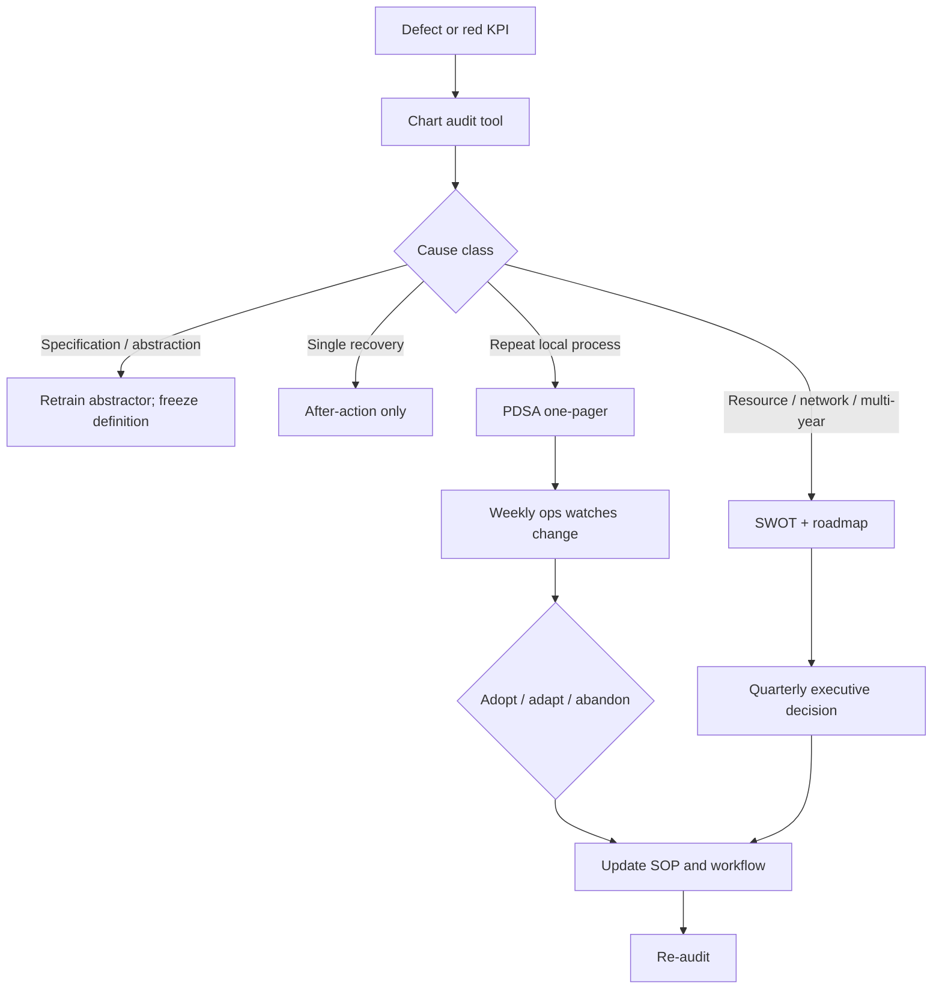
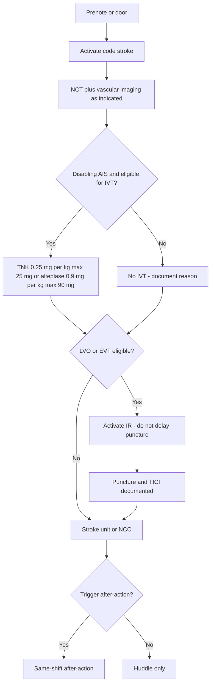
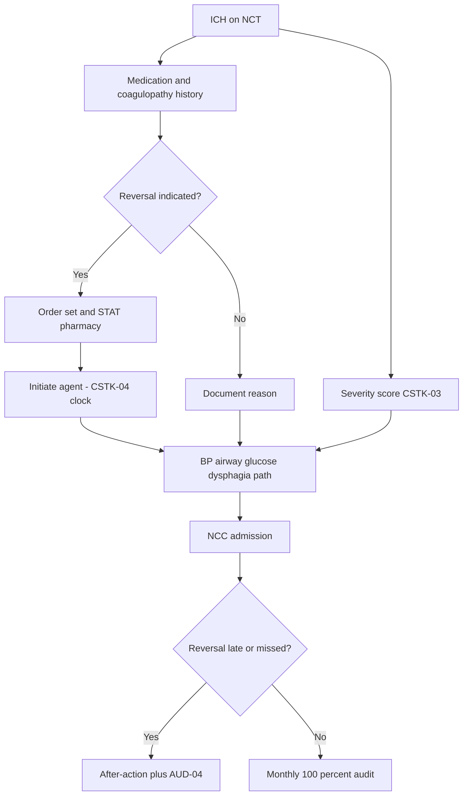
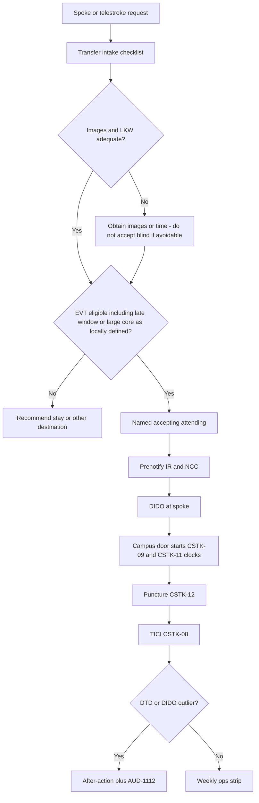
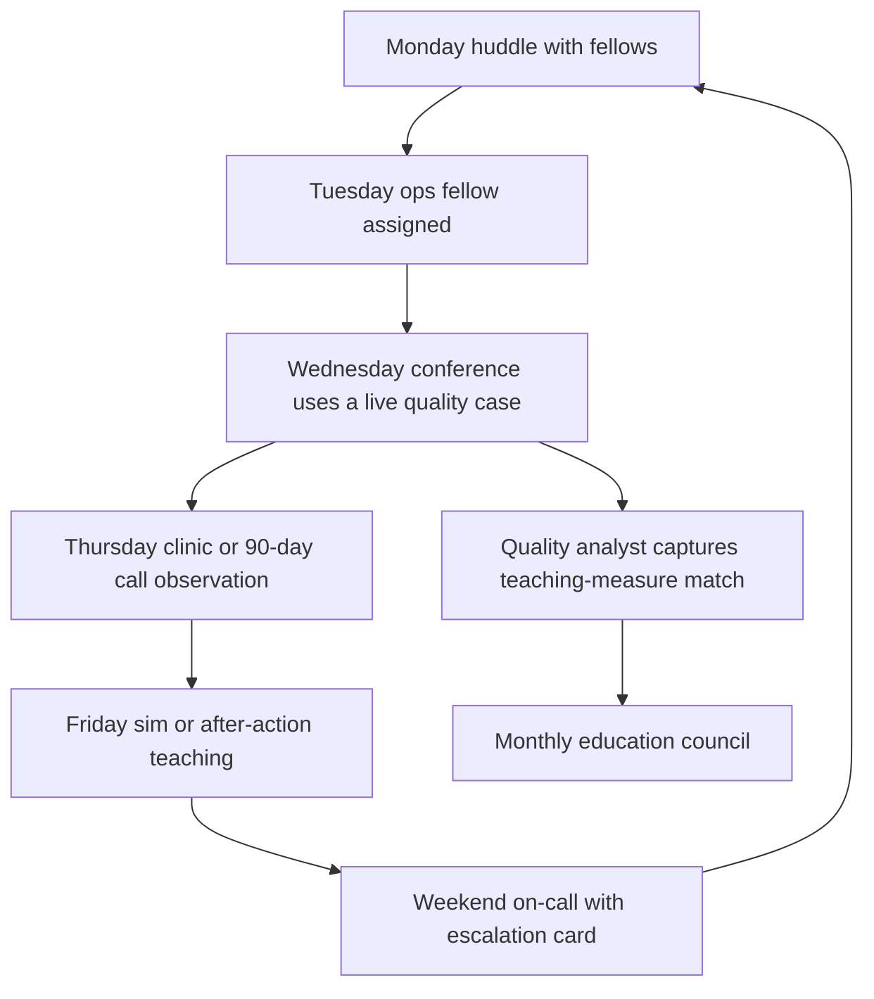

# Audits, PDSA, Roadmaps, and Workflows

## Opening

Dashboards tell the Medical Director that a measure moved. Audits tell the Medical Director why. PDSA is how the program changes a Tuesday process without waiting for the next strategic plan. Roadmaps keep those changes from becoming a pile of unfinished pilots. Workflows are the pictures staff can follow at 02:00.

This chapter is a working kit: chart-audit tools for door-to-needle, CSTK-04, CSTK-06, CSTK-11/12, swallow screening, and atrial-fibrillation anticoagulation; a one-page PDSA; a SWOT; a three-year roadmap; and a mermaid workflow library for code stroke, the ICH bundle, transfer EVT, and the fellowship week.

Every audit tool is a sample to adapt to current specifications. Abstract to the live CSTK and STK manuals, not to memory. CSTK-07 is not in the current set — do not audit it as active. Volume and eligibility numbers come from the live E-App / CSC table, not from historical lore.

## Why This Matters

A late DTN that is never interval-audited will be explained as “a hard case” forever. An ICH reversal miss that is never chart-audited against CSTK-04 will be argued from recollection in front of a surveyor. An aSAH chart without nimodipine will fail CSTK-06 in public. A TICI ≥2B that occurs at 140 minutes from arrival will fail CSTK-11 whether or not the room felt busy. A swallow miss is a pneumonia. An AF discharge without anticoagulation or a documented reason is STK-3 and GWTG achievement measure 5.

Improvement methods only work if they are written small enough to finish. IHI Model for Improvement and PDSA, Lean, DMAIC, CUSP, and high-reliability organizing are compatible. They are not a committee. The one-page PDSA in this chapter is the unit of work. The roadmap is the unit of choice. The workflow is the unit of teaching.

Academic CSCs fail improvement by scaling too early: a system-wide “DTN initiative” with no audit of the last ten cases, or a three-year plan that lists twelve priorities. High reliability starts with preoccupation with failure on a single interval.

## Core Framework

### When to audit versus when to PDSA versus when to roadmap

| Signal | First move | Then |
| --- | --- | --- |
| Single outlier, first in 30 days | After-action + 1-chart audit | Weekly ops watches for a second |
| Three similar defects in 30 days | 10-chart audit | PDSA if the cause is local and changeable |
| Measure below a published floor | 20-chart audit + equity slice | PDSA plus monthly executive visibility |
| Specification confusion | Audit the abstraction, not the clinicians | Retrain; do not PDSA a wrong definition |
| Resource or network required | Do not PDSA a staffing hole | Roadmap / quarterly executive |
| Multi-year capability (MSU, new spoke, StrokeNet) | SWOT | 3-year roadmap bet |

### Audit sampling rules (sample)

| Tool | Minimum sample | Pull rule | Stop rule |
| --- | --- | --- | --- |
| DTN interval audit | All IVT with DTN >45 min + 5 random ≤45 | Weekly | If a new interval appears, expand 10 more |
| CSTK-04 | All eligible ICH in the month | Monthly | 100% until 3 consecutive clean months, then 10/month |
| CSTK-06 | All eligible aSAH | Monthly | 100% — n is small |
| CSTK-11/12 | All MER cases in the month | Monthly | Add imaging-to-puncture if failures cluster |
| Swallow | 20 consecutive stroke admits | Weekly until 100%, then 10/week | Any unscreened PO = full week pull |
| AF anticoagulation | All STK-3 denominators | Monthly | 100% of fails + 5 passes |



!!! tip "Key Actions"

    Put the six audit tools in the analyst's folder this week and run last month's ICH, aSAH, and EVT cases at 100%. Open one PDSA only — the interval that failed most often on the DTN tool. Complete the SWOT with the pillar leads before the next offsite, not during it. Draft the 3-year roadmap with no more than five bets and an explicit kill list. Post the four workflow diagrams where the work happens (ED, NCC, transfer center, fellow room), with a version date.

!!! abstract "Metrics Targets"

    Audit completion: 100% of CSTK-04 and CSTK-06 eligible cases each month; 100% of MER cases scored for CSTK-08/09/11/12; DTN interval audit on every case >45 min; swallow weekly sample until 100%; STK-3 fails audited 100%. PDSA: no more than three open PDSAs per program; each closed or killed by day 90. Roadmap: 3–5 bets; at least one project killed annually. Workflows: version date ≤12 months or since the last guideline/manual change. External floors remain GWTG 85% achievement, Target: Stroke Elite as internal DTN floor, specification-compliant CSTK. aSAH volume tracked against the live table after the 2 April 2025 announcement reduced the criterion to 10.

!!! warning "Common Pitfalls"

    Auditing opinions instead of time stamps. Running a PDSA without a numeric prediction. Opening six PDSAs and finishing none. Using SWOT as a venting session with no bets. Drawing workflows that do not match the SOP or the order set. Teaching fellows a diagram that still shows CSTK-07. Treating HERMES-level outcome expectations as a monthly KPI. Copying a DMAIC charter that no bedside nurse will read. Roadmapping an MSU or new spoke before the clock is reliable.

!!! success "Implementation Tips"

    Print audit tools as one-page forms. Pair each PDSA with a named SOP and a mermaid workflow so the change has a home. Review PDSA results in weekly ops, not only monthly quality. When an audit finds an abstraction error, celebrate the catch — that is preoccupation with failure. Keep roadmap bets in the same IDs as KPI library codes. Re-draw a workflow the same week a guideline dose or measure ID changes.

## How to Do the Work

### Daily / weekly

After-actions feed the DTN and swallow audits. Weekly ops reviews open audit findings older than seven days. A PDSA in cycle is a standing 4-minute ops line: what was predicted, what happened, what changes tomorrow.

### Monthly / quarterly

Monthly quality closes the CSTK-04, CSTK-06, CSTK-11/12, and STK-3 audits. Quarterly executive hears only PDSAs that need resource or that died. Quarterly, re-audit a previously closed PDSA to test hold.

### Annual / multi-year

Annual offsite uses the SWOT and roadmap templates. Year one of a new Medical Director favors clock and hemorrhage-bundle bets. Year two favors network and equity. Year three favors academic differentiation that does not tax the clock. Re-verify every workflow against the 2026 AIS guideline, 2022 ICH guideline, 2023 aSAH guideline, and v2026B manuals at the August currency check.

Run a 30-day audit stand-up the first time these tools are installed:

1. **Days 1–3.** Analyst and Medical Director sit together on two IVT charts, one ICH reversal, one aSAH, one MER, one swallow miss, and one STK-3 fail. Agree what “fail” means in the local EHR, not in the abstract.
2. **Days 4–10.** Complete last month at 100% for CSTK-04, CSTK-06, and CSTK-11/12. Interval-audit every DTN >45 min in the last 14 days.
3. **Days 11–20.** Open one PDSA only. Write the prediction before changing anything. Assign the matching SOP and mermaid workflow as the adoption home.
4. **Days 21–30.** Bring the first completed audit month and the PDSA one-pager to monthly quality. Decide adopt / adapt / abandon in the room. If the cause was abstraction, retrain and do not call it a clinical PDSA.

Do not skip step 1. Most “the measure is wrong” arguments die when the Medical Director and the abstractor read the same time stamps aloud.

## Ready-to-Adapt Tools

All tools are samples to adapt. Abstract to live specifications.

### Tool 1 — DTN interval audit

```
DTN INTERVAL AUDIT  (sample)   ID: AUD-DTN-[YYYYMM]
Case date: ____   DTN min: ____   Agent: [ ] TNK 0.25 mg/kg max 25  [ ] alteplase 0.9/90
Disabling deficit? [ ] Y [ ] N   NIHSS: ____   Dual-eligible? [ ] Y [ ] N
Night / weekend / transfer / MSU / language: ________

INTERVAL MINUTES          TARGET (local watch)     ACTUAL     FAIL?
EMS prenote to door       local                    ____       [ ]
Door to CT start          local                    ____       [ ]
CT start to first read    local                    ____       [ ]
Read to decision          local                    ____       [ ]
Decision to pharmacy      local                    ____       [ ]
Pharmacy to needle        local                    ____       [ ]
DTN total                 floors: 60 / 45 / 30     ____       [ ]

ELIGIBILITY / GUIDELINE CHECK
Treated within 4.5 h for disabling deficit regardless of NIHSS? [ ] Y [ ] N [ ] NA
Advanced imaging delayed IVT unnecessarily? [ ] Y [ ] N
EVT delayed for IVT? [ ] Y [ ] N [ ] NA
Research added minutes? [ ] Y [ ] N

ROOT INTERVAL (pick one): ________
ABSTRACTION MATCHES GWTG/STK-4? [ ] Y [ ] N
TEACHING POINT: ________
PDSA CANDIDATE? [ ] Y  ID: ____
Auditor: ________  Date: ________
```

### Tool 2 — CSTK-04 ICH reversal audit

```
CSTK-04 AUDIT  (sample — follow v2026B, not this form, for official abstraction)
ID: AUD-04-[YYYYMM]   Case: ____   Arrival: ____   ICH on imaging: ____
Severity score done (CSTK-03)? [ ] Y tool: ________
Anticoagulant / coagulopathy relevant per spec? [ ] Y [ ] N  agent: ________
Comfort measures day of / after arrival? [ ] Y [ ] N
Other spec exclusions: ________

REVERSAL INDICATED PER SPEC? [ ] Y [ ] N
Order time: ____   Administration start: ____
Agent / dose: ________   Location obtained: ________
If not given: documented reason matches spec? [ ] Y [ ] N
Stock-out? [ ] Y   After-action ID: ________

ABSTRACTION: numerator credit? [ ] Y [ ] N
EQUITY TAGS: night / transfer / language: ________
SYSTEM FIX: [ ] none [ ] stock [ ] order set [ ] education [ ] PDSA ____
Auditor: ________
```

### Tool 3 — CSTK-06 nimodipine audit

```
CSTK-06 AUDIT  (sample — follow v2026B)
ID: AUD-06-[YYYYMM]   aSAH case: ____
Diagnosis time: ____   Nimodipine first dose: ____
Route / dose as ordered: ________
If not given: reason (NPO with alternate route? comfort measures? allergy?): ________
Nimodipine remains standard per 2023 aSAH guideline — do not drop for fashion.

SPEC NUMERATOR MET? [ ] Y [ ] N
RELATED: CSTK-03 severity documented? [ ] Y
AFTER-ACTION? [ ] Y  ID: ____
Auditor: ________
```

### Tool 4 — CSTK-11 / CSTK-12 reperfusion audit

```
CSTK-11/12 AUDIT  (sample — follow v2026B)
ID: AUD-1112-[YYYYMM]   MER case: ____   Direct / transfer: ________
Door (campus): ____   Puncture: ____   Final TICI: ____  (CSTK-08 documented? [ ] Y)
TICI ≥2B achieved? [ ] Y [ ] N   Time TICI ≥2B: ____

CSTK-11: TICI ≥2B within 120 min of arrival? [ ] Y [ ] N [ ] NA
CSTK-12: TICI ≥2B within 60 min of puncture? [ ] Y [ ] N [ ] NA
CSTK-09 arrival-to-puncture minutes: ____

INTERVALS
Door–image: ____   Image–decision: ____   Decision–room: ____
Room–puncture: ____   Puncture–TICI≥2B: ____
Transfer DIDO (if any): ____

DUAL-ELIGIBLE
IVT given? [ ] TNK [ ] alteplase [ ] no
Puncture delayed for IVT? [ ] Y [ ] N

FAIL PRIMARY INTERVAL: ________
PDSA? [ ] Y  ID: ____   Auditor: ________
```

### Tool 5 — Swallow-screen audit

```
SWALLOW AUDIT  (sample)
ID: AUD-SW-[YYYYMMDD]   Unit: [ ] ED [ ] NCC [ ] stroke unit [ ] other
n charts: 20 consecutive stroke admits from: ________

Case  Admit dt   Stroke type   Screen before any PO?   Who   Fail action   Unscreened PO?
1     ____       AIS/ICH/SAH   Y/N                     ____  Y/N/NA        Y/N
...
20    ____       ____          ____                    ____  ____          ____

UNSCREENED PO EVENTS (harm pathway): list case IDs ________
NIGHT vs DAY fail rate: ____ / ____
2026 AIS guideline updated glucose and dysphagia management — confirm local
order set still matches current recommendation language.
ALL FAILS: after-action + teaching same week.
Auditor: ________
```

### Tool 6 — AF anticoagulation (STK-3 / GWTG) audit

```
AF ANTICOAGULATION AUDIT  (sample)
ID: AUD-AF-[YYYYMM]
Denominator per STK-3 / GWTG achievement measure 5. Do not invent exclusions.

Case  AF/flutter documented  Anticoag at DC  Reason if no  Reason valid?  Follow-up plan
1     Y/N                    Y/N             ________      Y/N            Y/N
...

FAIL THEMES: [ ] bleed fear undocumented  [ ] “fall risk” only
[ ] pending outpatient start without plan  [ ] comfort measures
[ ] abstraction error
EQUITY: sex / race-ethnicity / language / payor among fails: ________
PDSA? [ ] Y  ID: ____   Auditor: ________
```

### Tool 7 — PDSA one-pager

```
PDSA ONE-PAGER  (sample)   ID: PDSA-[YYYY]-[##]
Title: ________
Linked KPI IDs: ________     Linked SOP: ________
Owner (clinical): ________   Owner (quality): ________
Date opened: ________        Kill/close-by: ________ (max 90 days)

WHAT ARE WE TRYING TO ACCOMPLISH? (one sentence)

HOW WILL WE KNOW? (numeric prediction)
Baseline (n, window): ________
Predicted result by date: ________
Balancing measure: ________

WHAT CHANGE? (one change, not five)

PLAN
Who / what / where / when / data collector:
Safety check (does this touch TNK dose, reversal, or airway?): ________

DO  (dates): ________
What actually happened:

STUDY
Prediction met? [ ] Y [ ] N
Unexpected effects (equity, education, research clock): ________

ACT
[ ] Adopt — write into SOP/workflow/order set by date ____
[ ] Adapt — next cycle changes: ________  cycle # ____
[ ] Abandon — reason: ________
Taught at (conference / sim / huddle): ________  date: ________
Executive needed? [ ] N [ ] Y ask: ________
```

### Tool 8 — SWOT worksheet

```
CSC SWOT  (sample)   Date: ____   Facilitator: MD   Silent write 10 min, then one round

STRENGTHS (evidence, not pride)
- Clock: ________
- People: ________
- Academic: ________
- Network: ________

WEAKNESSES (audits and red KPIs only)
- ________
- ________

OPPORTUNITIES (external, time-limited)
- Guideline or measure change: ________
- Regional spoke need: ________
- StrokeNet / trial: ________

THREATS
- Coverage / FTE: ________
- Survey window: ________
- Volume vs live E-App table (aSAH announced 10 on 2025-04-02): ________
- Complacency after an award: ________

TRANSLATION RULE
Each weakness or threat that will be addressed becomes a roadmap bet or a PDSA.
Each item that will not be addressed is parked with a date to revisit.
No more than five bets leave this room.
```

### Tool 9 — Three-year strategic roadmap

```
CSC 3-YEAR ROADMAP  (sample)   Version: YYYY.MM

SEQUENCE RULE
Y1 clock and hemorrhage reliability → Y2 network and equity → Y3 academic
differentiation that does not tax the clock.

BET 1  Name: ________
   KPI IDs: ________   Owner: ________
   Y1 product: ________
   Y2 product: ________
   Y3 product: ________
   Resource implication (no dollar invention): ________
   Kill criteria: ________

BET 2  ...
BET 3  ...
BET 4  (optional)
BET 5  (optional)

KILL LIST (projects we will stop this year)
1. ________  Why: ________
2. ________  Why: ________

PARKING LOT (revisit date)
- ________  [date]

CERTIFICATION / AWARD POSTURE
Survey window: ________
GWTG / Target: Stroke / Advanced Therapy aim by year:
   Y1: ________   Y2: ________   Y3: ________
Volume: confirm live E-App each August.

RATIFIED: steering date ____   Next rewrite: annual offsite
```

### Tool 10 — Workflow library (mermaid)

#### 10A — Code stroke



#### 10B — ICH bundle



#### 10C — Transfer EVT



#### 10D — Fellowship weekly



### Tool 11 — Audit calendar (post in the analyst office)

```
WEEKLY: DTN >45 min (all); swallow sample; after-action file complete
MONTHLY: CSTK-04 all; CSTK-06 all; CSTK-11/12 all MER; STK-3 fails + 5 passes
          CSTK-01 misses; 90-day attempt failures
QUARTERLY: re-audit one closed PDSA; equity slice on DTN and STK-3
ANNUAL: SOP-workflow match review; kill unused audit forms
```

### Tool 12 — Worked PDSA example (late weekday DTN)

```
PDSA-2026-01  Title: Cut CT-to-decision delay on weekday 07:00–09:00 codes
KPI: P-01 / P-02     SOP: SOP-CSC-CS-001     Owners: ED lead + AMD
Opened: [date]       Close-by: +60 days

AIM: Reduce weekday-AM DTN >45 min events caused by CT-to-decision delay.
BASELINE (30 d): 6 of 11 weekday-AM IVT cases had CT-to-decision >15 min;
   4 of those 6 had DTN >45. Median DTN weekday AM: 52 min.
PREDICTION (by day 45): weekday-AM median DTN ≤40; CT-to-decision >15 in
   ≤2 of next 11 weekday-AM IVT cases. Balancing: mimic CT volume and
   research-clock events remain 0.

CHANGE (one only): Vascular neurology at CT gantry for all weekday-AM
   codes (no read-from-office). Pharmacy already present — do not change
   two things.

PLAN: ED charge pages VN “CT now” at patient-on-table. AMD audits next
   11 weekday-AM IVT charts with AUD-DTN. Safety: dose cards unchanged
   (TNK 0.25 mg/kg max 25; alteplase 0.9/90).

DO: [dates]
STUDY: [fill] Prediction met?  Unexpected night-coverage spillover?
ACT: Adopt into SOP-CSC-CS-001 section 5 if met; adapt gantry rule to
   include first 60 min after 09:00 if the delay simply shifted later.
Teach at Wednesday conference with the live cases. No executive ask.
```

### Tool 13 — PDSA board (whiteboard or tracker)

```
ID     Title          KPI    Cycle  Pred.  Result  Act     Close-by  Status
PDSA-  ________       P-01   1      ____   ____    adapt   ____      open
PDSA-  ________       P-21   2      ____   ____    adopt   ____      closing
PDSA-  ________       P-26   1      ____   ____    —       ____      overdue
Rule: if three rows are open, do not add a fourth.
```

## Integration With Other Pillars

Audits are how quality tells the truth to clinical operations. PDSA is how clinical operations changes without waiting for strategy. SWOT and the roadmap are how strategy chooses, and how education and research get sequenced after the clock. Workflows are the teaching tools fellowship and interprofessional simulation should use instead of generic slide decks. Research protocols that cannot be drawn next to the code-stroke workflow do not belong in the hallway.

Link every adopted PDSA back to an SOP in the KPI/SOP chapter and to an agenda line in the cadence chapter. Currency-check every audit definition against the evidence register.

## Sources

- 2026 Guideline for the Early Management of Patients With Acute Ischemic Stroke. *Stroke*. 2026;57(8):e316–e436. DOI 10.1161/STR.0000000000000513.
- 2022 ICH Guideline, *Stroke*, DOI 10.1161/STR.0000000000000407; 2024 ICH performance measures.
- 2023 aSAH Guideline, *Stroke*. 2023;54:e314–e370. DOI 10.1161/STR.0000000000000436. Nimodipine remains standard.
- CSTK / STK Specifications Manual v2026B (posted 02/06/2026; 3Q–4Q 2026 discharges). CSTK-07 is not in the current set.
- GWTG-Stroke achievement measure 5 (anticoagulation for AF/flutter) and Target: Stroke DTN tiers (AHA, last reviewed 9 September 2022).
- HERMES 2016 (mRS 0–2 46.0% vs 26.5%; NNT 2.6 for ≥1-point mRS shift) — use for education and strategy, not as a monthly audit threshold.
- IHI Model for Improvement / PDSA; Lean; Six Sigma DMAIC; AHRQ CUSP; high-reliability organizing.
- Joint Commission DSC / SCS26; April 2, 2025 aSAH volume announcement. Confirm live E-App tables.
- NIH StrokeNet — roadmap as strategic capability (site PI pipeline, coordinator FTE, 24/7 screening, central IRB).
