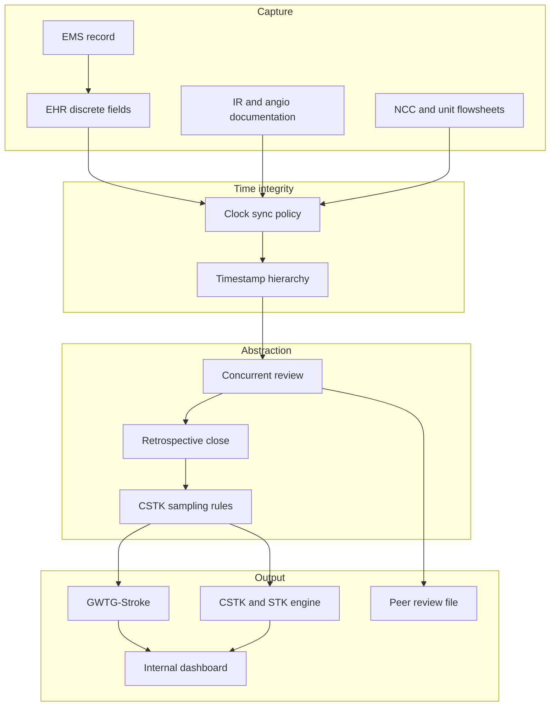
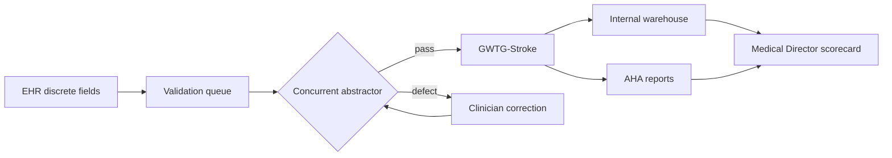

# Quality System and Data Infrastructure

## Opening

A Comprehensive Stroke Center cannot manage what it cannot see. The quality system is the instrument panel: timestamps that survive audit, discrete fields that feed measures without re-abstraction, a registry that matches the chart, and a dashboard that a Medical Director can use in a Monday meeting without waiting for a quarterly vendor extract. Certification, Get With The Guidelines (GWTG) recognition, CSTK and STK reporting, peer review, equity work, and research screening all rest on the same data spine.

The Medical Director does not need to write SQL. The Medical Director does need to own data integrity, abstractor capacity, timestamp discipline, and the decision of what is concurrent versus retrospective. When those choices are left to a vendor contract or a single coordinator, the scorecard becomes a lagging story rather than an operating tool.

Build the quality system as infrastructure, not as a survey week project. Abstractors, the EHR build, the GWTG feed, the CSTK sampling logic, and the governance of who may change a field are as operational as the angio suite call schedule. Treat them that way.

This chapter sets the architecture: people, fields, time, flow, sampling, dashboards, and governance. Chapters 23–26 convert that architecture into the scorecard, improvement, survey evidence, and equity strata.

## Why This Matters

CSTK, STK, and GWTG measures are only as good as the clock, the denominator, and the abstractor. A door time that is a registration click rather than the first documented arrival will systematically inflate door-to-needle (DTN) and door-to-puncture performance. A NIHSS documented after recanalization will fail CSTK-01 even when the examination was performed. A 90-day modified Rankin Scale (mRS) captured in clinic but never abstracted will fail CSTK-02 and collapse CSTK-10. These are data defects with clinical consequences: they hide real delays, invent false ones, and waste monthly quality time. Weekend and holiday data lag is a designed defect unless weekend abstractor coverage exists.

Joint Commission Disease-Specific Care (DSC) certification has three components: standards, clinical practice guidelines, and performance measurement. The 2026 Stroke Certification Standards book (SCS26) is the current standards source. Performance measurement for a CSC includes the CSTK set in Specifications Manual v2026B (posted 02/06/2026; 3Q–4Q 2026 discharges) and the longstanding STK inpatient set. GWTG-Stroke is the national registry and recognition program that most academic CSCs use both to submit data and to benchmark. None of those systems will correct a local timestamp that is wrong.

Academic volume makes the problem larger, not smaller. High EVT and ICH/aSAH volume, transfers, telestroke, and research screening multiply records. Concurrent abstraction is the only way a Medical Director can intervene on this week's DTN failures before the month closes. Retrospective abstraction six weeks later is a compliance activity. Both have a role. Confusing them is how programs discover a CSTK-11 collapse at the quarterly report rather than at Wednesday huddle.

Data infrastructure is also a safety system. Time-stamp integrity is how the program reconstructs a code stroke. Discrete fields are how the EHR prevents a missed last-known-well or an undocumented TICI grade. Governance is how the program prevents a well-meaning analyst from changing a door-time definition the week before survey. The Medical Director who treats data as "quality's job" will inherit a registry that cannot be defended.

## Core Framework

The quality system has five layers. Each layer has an owner, a source of truth, and a failure mode. Design them together.

| Layer | Source of truth | Primary owner | Failure mode if neglected |
| --- | --- | --- | --- |
| Capture | EHR discrete fields, device clocks, EMS record | Informatics + clinical leads | Free-text only; unusable for measures |
| Time | Synchronized clocks; documented arrival, imaging, bolus, puncture, recanalization | Medical Director + ED/IR/NCC | Systematic DTN/DTP bias |
| Abstraction | Concurrent review + targeted retrospective close | Stroke program / abstractor team | Lag, missing CSTK-02, sampling error |
| Registry and submission | GWTG-Stroke; CSTK/STK vendor or core-measure engine | Quality + program director | Dual entry, definition drift |
| Display and action | Internal dashboard + monthly scorecard | Medical Director | Vanity metrics; no owner for defects |

### Abstractor FTE as a designed capacity

Do not inherit abstractor FTE from "whatever quality assigned." Calculate it from volume, measure complexity, concurrent coverage, and 90-day follow-up. A CSC abstracts ischemic cases without reperfusion, ischemic cases with IV thrombolysis / IA / mechanical endovascular reperfusion (MER), and hemorrhagic cases. CSTK-02 and CSTK-10 require a 90-day contact operation, not a chart pull. Concurrent review of every code stroke and every reperfusion case is a different workload from quarterly sampling.

Build the FTE model from tasks, not from a national ratio that does not exist in the public manuals:

| Workstream | What drives hours | Typical cadence |
| --- | --- | --- |
| Concurrent code-stroke review | Arrivals, transfers, telestroke, nights/weekends | Daily, including weekend coverage plan |
| Reperfusion and TICI close | IVT, EVT, CSTK-08/09/11/12 fields | Same day or next business day |
| Hemorrhagic bundle | ICH reversal, aSAH nimodipine, severity scores | Same admission |
| STK core measures | VTE, antithrombotics, statin, education, rehab | During stay and at discharge |
| 90-day mRS | Eligible ischemic cohort | Outbound campaign starting before day 90 |
| GWTG coding and submission | Full achievement and quality elements | Concurrent with close of record |
| Audit and inter-rater reliability | 5–10% dual abstraction locally defined | Monthly |
| Survey file and peer-review packets | Tracers, outliers, sICH | As needed |

State FTE as a calculated need with a named method: hours per case type × annual volume × concurrent premium × follow-up load, divided by productive hours. Present the calculation to the sponsor. If the hospital funds only retrospective abstractors, say so in writing and accept that the monthly scorecard will lag. Do not promise same-week CSTK-11 visibility without same-week abstraction.

Coverage matters as much as headcount. Design at least two people who can abstract the CSC set. A single abstractor who is also the coordinator will drop concurrent review during vacation, survey prep, and July onboarding.

### Concurrent versus retrospective abstraction

Use both. Do not pretend they are interchangeable.

**Concurrent abstraction** means the record is reviewed while the patient is still in house or within a few days of discharge, while clinicians can still correct missing discrete fields, missing NIHSS timestamps, missing TICI documentation, and missing last-known-well. The purpose is operational: feed the weekly huddle, trigger peer review, and prevent a measure failure that is actually a documentation failure.

**Retrospective abstraction** means the record is closed after the stay, often from a vendor work queue or a monthly discharge list. The purpose is completeness, sampling, coding reconciliation, and submission. It cannot change the care that already happened. It can still correct an abstractor error or a missed exclusion.

| Attribute | Concurrent | Retrospective |
| --- | --- | --- |
| Primary use | Operations, huddle, defect detection | Submission, sampling, coding close |
| Latency | Hours to a few days | Weeks |
| Clinician correction possible | Yes, for documentation | Rarely |
| Best case types | Code stroke, IVT, EVT, sICH, aSAH | STK discharge measures, GWTG completeness |
| Risk if used alone | Incomplete coding, missed late exclusions | Invisible in-month failures |
| Medical Director action | Same-week intervention | Trend and system redesign |

A practical rule: concurrent for every case that can hit CSTK-01, CSTK-04, CSTK-05, CSTK-06, CSTK-08, CSTK-09, CSTK-11, or CSTK-12, plus every DTN/DTP outlier. Retrospective for STK discharge measures, GWTG quality elements that mature at coding, and the final lock before quarterly submission. CSTK-02/10 sit in a third bucket: a scheduled follow-up operation, not a chart abstraction.

### EHR discrete fields

If a data element lives only in a note, it does not exist for the measure. Build discrete, required, or hard-stopped fields for the elements that define denominators, numerators, and exclusions. The Medical Director signs the field list with informatics; do not leave it to a vendor mapping document that no clinician has read.

Minimum discrete set for a CSC quality spine:

| Domain | Discrete elements | Why they must be discrete |
| --- | --- | --- |
| Identity and population | Stroke type, hemorrhagic vs ischemic, transfer vs direct, comfort-measures date | Denominator and exclusion logic |
| Time | Arrival, last known well, symptom discovery, CT/CTA/MRA start, IVT bolus, arterial puncture, first pass, final recanalization | DTN, DTP, CSTK-09/11/12 |
| Severity | NIHSS with time and examiner role; Hunt and Hess (SAH); ICH Score (ICH); mRS baseline if used | CSTK-01, CSTK-03; WFNS is a clinical adjunct, not the CSTK-03 instrument |
| Treatment | Agent and dose for IVT; reversal agent and time; nimodipine first dose; TICI grade | STK-4, CSTK-04/06/08 |
| Safety | Symptomatic ICH definition fields; sICH imaging and clinical change | CSTK-05 |
| Disposition and follow-up | Rehab assessment, education completion, 90-day mRS with method and date | STK-8/10, CSTK-02/10 |
| Equity | Race, ethnicity, language, interpreter used, sex, insurance, ZIP, arrival mode | Chapter 26 stratification |

Require a documented last-known-well that is separate from "time of discovery" in wake-up and unwitnessed stroke. Require NIHSS time stamps that can prove the exam occurred before recanalization, or within 12 hours if no recanalization — the CSTK-01 logic. Require TICI as a structured grade entered by the operator or a designated neuroradiologist, not as prose in an operative note.

Do not over-build. Every required field that is not used in a measure, a huddle, or a research screen will be gamed or skipped. Review the field inventory annually against the active CSTK/STK specifications and the current GWTG data dictionary.

### Time-stamp integrity

Time is the most litigated and most survey-tested data element in stroke. Write a timestamp hierarchy and a clock policy.

**Clock policy.** ED tracking boards, CT consoles, angio suite clocks, EHR workstations, and EMS ePCR clocks must be synchronized to a stated source and checked on a stated cadence. Assign the check to a named role (biomed, radiology engineering, or IR tech lead). Log the check. A three-minute drift between the CT console and the EHR will create phantom DTN failures and phantom "too good to be true" times.

**Timestamp hierarchy.** Define, in a one-page SOP, which stamp wins when sources disagree:

1. EMS arrival on scene and hospital arrival from the ePCR when complete.
2. Hospital arrival: first documented presence in the facility (ED triage, registration, or ambulance-bay note — pick one and defend it).
3. Imaging: console start time, not the time the report was signed.
4. IVT: bolus administration time from the eMAR or the code-stroke record, not the order time.
5. Puncture: arterial access time documented by the operator, not "in-room" time.
6. Recanalization: time of the run that established the final TICI grade used for CSTK-08/11/12.

Publish the hierarchy. Train fellows and APPs to document to it. When a case is abstracted, the abstractor follows the hierarchy rather than inventing a compromise time. When sources still conflict, the case goes to the Medical Director or designee before it is locked.

**Transfer and telestroke times.** First-hospital arrival and CSC arrival are different clocks. Door-to-device for transfers uses a different Target: Stroke Advanced Therapy threshold than direct arrivals. Build both clocks as discrete fields. Do not let a transfer "door" silently become CSC registration time in the GWTG map.

### GWTG data flow

Most academic CSCs use GWTG-Stroke as the national registry. The local design choice is how data get there: direct entry, EHR extract plus validation, or a third-party quality vendor. All three can work. All three fail if no one owns the map between local fields and the GWTG dictionary.

Rules for the flow: one source of truth per element; validation before submission; a monthly lock date with logged amendments after lock; monthly reconciliation between GWTG and the CSTK/STK engine (they overlap but are not identical); research may read the spine but must not write measure fields. NLP and other AI follow the same rule: no write without a gold-standard dual-abstract sample, disagreement rate, human lock, and version control (ER-FDA-CDS-2026). GWTG reports are necessary and not sufficient for weekly ops.

### CSTK sampling rules at high level

CSTK-01, CSTK-03, and CSTK-09 have Sampling: Yes in v2026B. Do not write that only CSTK-01 may be sampled. Confirm the current sampling table for every measure before treating any row as population-only. Do not invent sample sizes, quarters, or minimum denominators from memory.

Operating rules for the Medical Director:

- Confirm the current sampling table in the active CSTK specifications manual before the next submission cycle. If CSTK-01, CSTK-03, or CSTK-09 is sampled, document the method, the frame, and who draws the sample.
- Do not sample away a safety signal. Even if a measure is sampled for submission, concurrent NIHSS, severity-score, and puncture-time review should remain a population activity.
- CSTK-01 exclusions in v2026B include age under 18, length of stay over 120 days, comfort measures on the day of or the day after arrival, elective carotid intervention, and non-recanalization patients discharged within 12 hours. Build those exclusions as discrete logic, not as abstractor folklore.
- CSTK-07 is not in the current set. Do not build a local measure numbered CSTK-07 or tell staff it is required.
- When volume is high, sampling temptation rises. Resist expanding sampling beyond what the current manual allows. Internal dashboards should remain unsampled for reperfusion and sICH.

If a vendor or a core-measure contractor proposes a sample size, require them to cite the current manual page. If they cannot, reject the proposal.

### Dashboards

Build two displays: an operational dashboard and a monthly scorecard. They are not the same product.

**Operational dashboard (daily/weekly).** Unsampled. Case-level. Shows open code strokes, untreated eligible patients, DTN and door-to-puncture running median and percent at target, missing NIHSS, missing TICI, open sICH reviews, and 90-day mRS worklist. Audience: Medical Director, program director, charge APP, IR lead. Refresh: next business day at worst; same day for reperfusion cases if concurrent abstraction is funded.

**Monthly scorecard.** Measure-level. GWTG achievement, Target: Stroke indicators, STK, CSTK-01 through 12 except 07, `internal` targets, equity strata (Chapter 26), and open PDSA status. Audience: monthly quality, department leadership, hospital quality. Refresh: locked monthly with a stated lag. Charter fights go to quarterly stroke executive.

Dashboard design rules:

- Every tile has a definition, a source, an owner, and a target. A tile without an owner is decoration.
- Show numerator, denominator, and percent. A lone percentage hides small samples.
- Separate published award criteria from `internal` targets (Chapter 23).
- Do not put research enrollment or RVUs on the quality scorecard.
- Keep a "data quality" row: percent of reperfusion cases concurrently abstracted within 2 business days; percent of timestamps with source conflict; inter-rater agreement.

Vendor platforms can host the monthly scorecard. They rarely host a usable operational dashboard. Budget internal analytics for the latter.

### Data governance

Write a one-page data-governance charter and put it under quarterly stroke executive (Chapter 7), with operational lock rules owned by monthly quality. The charter answers five questions:

1. Who may change a measure definition or a timestamp hierarchy?
2. Who may lock and unlock a GWTG or CSTK record?
3. Who adjudicates sICH and TICI when the abstractor and the operator disagree?
4. How are vendor maps, EHR builds, and report logic version-controlled?
5. How are equity fields protected and how is small-cell suppression handled?

Minimum control set:

| Control | Cadence | Evidence |
| --- | --- | --- |
| Definition control board (Medical Director + quality + informatics) | Monthly, ad hoc for spec updates | Minutes and version log |
| Inter-rater reliability on a locally defined sample | Monthly | Kappa or percent agreement file |
| Clock-sync attestation | Monthly | Biomed / radiology log |
| Vendor map review against current manuals | At each spec release and annually | Marked-up data dictionary |
| Amendment log for locked records | Continuous | Reason-coded list |
| Access audit for the registry | Quarterly | User list and role review |

When Specifications Manual v2026B is replaced, or when GWTG updates a data element, the definition control board meets before abstractors "just start coding the new way." Uncontrolled definition change is a common source of false special-cause variation.

NLP or other AI must not write CSTK, STK, or GWTG fields unless a gold-standard dual-abstract sample, a published disagreement rate, a human lock, and version control are in place. FDA CDS clearance is not local validation (ER-FDA-CDS-2026). An ungoverned model that fills NIHSS time, TICI, or door time is a data-integrity event, not an efficiency win.

### Vendor versus internal analytics

Vendors are good at submission mechanics, national benchmarking, and staying current with GWTG dictionaries. Internal analytics are good at case-level operations, equity joins, research screening, and custom defect taxonomies. Most CSCs need both. The failure mode is paying for both and governing neither.

| Function | Prefer vendor | Prefer internal | Joint |
| --- | --- | --- | --- |
| GWTG submission | Yes | No | Vendor writes; internal validates |
| CSTK/STK engine | Often | If hospital already runs core measures well | Reconcile monthly |
| Weekly DTN/DTP list | No | Yes | |
| 90-day mRS campaign list | No | Yes | |
| Equity stratification | Rarely sufficient | Yes | |
| Peer-review packet | No | Yes | |
| National achievement tracking | Yes | Secondary | |
| Spec-update interpretation | Input | Decision sits with Medical Director | Board reviews both |

Contract language to insist on: data-export rights in a usable format; documented field maps; a named spec-update process; no exclusive ownership of local clinical data; service levels for mapping errors discovered inside a submission window. Do not sign a contract that makes the hospital unable to leave the vendor without losing history.

!!! tip "Key Actions"
    Name a single Medical Director–accountable owner for timestamp hierarchy, abstractor capacity, and definition control. Fund concurrent abstraction for every reperfusion and hemorrhagic bundle case. Inventory discrete EHR fields against CSTK v2026B, STK, and the current GWTG dictionary, and close gaps before the next submission. Stand up a next-business-day operational list and a locked monthly scorecard as two products. Confirm CSTK-01, CSTK-03, and CSTK-09 sampling rules in the current manual rather than inheriting last year's vendor recipe. Do not let NLP write measure fields without a gold-standard dual-abstract sample, disagreement rate, human lock, and version control.

!!! abstract "Metrics Targets"
    Published award criteria live in Chapter 23 (GWTG 85% achievement; Target: Stroke Honor Roll / Elite / Elite Plus / Advanced Therapy). CSTK and STK are certification measures. Infrastructure targets are `internal` and should be explicit: concurrent abstraction of reperfusion cases within 2 business days; 90-day mRS contact attempt on 100% of CSTK-02-eligible patients with a locally set capture-rate target; monthly inter-rater check; zero unexplained dual door times between EHR and GWTG at monthly lock; clock-sync attestation completed each month. Label each `internal`. Do not report infrastructure process metrics to surveyors as if they were CSTK measures.

!!! warning "Common Pitfalls"
    Treating GWTG as the operational dashboard. Writing that only CSTK-01 may be sampled. Letting the abstractor invent a compromise timestamp when sources conflict. Building thirty required EHR fields that clinicians then bypass with "unknown." Funding 0.5 retrospective FTE and expecting same-week CSTK-11 visibility. Allowing a vendor to change a map mid-quarter without a version log. Using research coordinators as untrained abstractors. Ignoring transfer clocks. Discovering CSTK-07 still listed on an old local scorecard. Letting NLP write CSTK fields without a human lock. Treating weekday-only abstraction as concurrent and then wondering why Monday's book is a weekend story.

!!! success "Implementation Tips"
    Sequence the build: timestamp hierarchy and clock policy first, discrete fields second, concurrent abstractor coverage third, operational list fourth, vendor reconciliation fifth. Pair each abstractor with a physician adjudicator for TICI and sICH. Put a 15-minute data-quality stand-up on the week of month-end lock. When a field is missing, fix the EHR or the workflow before retraining the same people. Use the first 90 days of a new Medical Director term to reconstruct the data lineage of DTN, DTP, NIHSS, TICI, and 90-day mRS — those five lineages explain most scorecard arguments.

## How to Do the Work

### Daily / weekly

- Review the operational list: untreated eligible patients, DTN and door-to-puncture outliers, missing NIHSS before recanalization, missing TICI, new sICH, open hemorrhagic-bundle defects.
- Confirm weekend and holiday concurrent coverage before Friday sign-out. Weekend and holiday data lag is a designed defect unless weekend abstractor coverage exists; do not call a Monday lock "concurrent."
- Adjudicate timestamp conflicts the same week they appear. Do not batch them to month-end.
- Walk one code-stroke record from EMS ePCR through EHR to the abstractor worksheet. Spot-check the hierarchy.
- Protect 90-day mRS outbound work as a daily queue, not a quarterly scramble.
- If a discrete field is being bypassed, open a ticket the same week and assign an owner.

Weekly, the Medical Director or Associate Medical Director chairs a short data-and-defects huddle. The agenda is cases and data quality, not slides. Send unresolved definition questions to the monthly control board rather than inventing an on-the-spot rule.

### Monthly / quarterly

- Lock the monthly scorecard on a published date. After lock, amendments are logged.
- Reconcile GWTG, CSTK/STK, and the internal warehouse. Investigate any measure that differs by more than a locally set tolerance.
- Run inter-rater reliability on a locally defined sample of records. Feed disagreements into training or into a definition fix.
- Review abstractor FTE actual hours versus the capacity model. If concurrent review is slipping, reduce scope publicly or add FTE; do not silently become retrospective.
- Review the vendor map if a specification update landed in the quarter. Specifications Manual v2026B is the current CSTK reference as of this handbook’s evidence lock; treat any successor the same way.
- Bring data-quality and definition issues to monthly quality. Escalate charter, FTE, and vendor-contract fights to quarterly stroke executive. Bring clinical defects to the improvement forum (Chapter 24).
- Quarterly, test one tracer as if a surveyor pulled the record: can a staff member show arrival, NIHSS time, bolus or puncture, and the abstractor trail without a coordinator in the room?

### Annual / multi-year

- Recalculate abstractor FTE from volume, measure set, 90-day load, and survey-year surge.
- Re-inventory discrete fields against the active manuals and the GWTG dictionary.
- Re-justify the vendor contract on export rights and map quality.
- Audit ED, CT, and angio clocks against the sync policy.
- Train new fellows, APPs, and IR operators on the timestamp hierarchy at onboarding.
- Fund a warehouse so equity, research screening, and longitudinal mRS do not depend on one vendor login.
- Treat EHR migration or a program merger as a CSC-sponsored data project.

## Ready-to-Adapt Tools

### Tool A — Abstractor capacity calculator (planning skeleton)

Use this in the budget cycle. Replace bracketed items. Do not treat the hours-per-case figures as national standards; set them from local time-motion or two weeks of logs.

| Case type | Annual volume | Hours per case concurrent | Hours per case retrospective close | 90-day hours | Annual hours |
| --- | --- | --- | --- | --- | --- |
| IVT and/or EVT | [n] | [ ] | [ ] | [ ] | [ ] |
| Ischemic, no reperfusion | [n] | [ ] | [ ] | [ ] | [ ] |
| ICH | [n] | [ ] | [ ] | — | [ ] |
| aSAH | [n] | [ ] | [ ] | — | [ ] |
| Dual abstraction / audit | — | — | — | — | [ ] |
| Survey and special projects | — | — | — | — | [ ] |
| **Total hours** | | | | | **[ ]** |
| **FTE at [1,760] productive hours** | | | | | **[ ]** |

Add a weekend/holiday premium. State the concurrent coverage model (7-day versus weekday-only) in the same paper. If coverage is weekday-only, write the weekend/holiday lag as a designed defect, not as a surprise.

### Tool B — Timestamp hierarchy SOP skeleton

**Purpose.** Establish a single hierarchy when sources disagree.

**Scope.** All code-stroke, transfer, IVT, EVT, and hemorrhagic-bundle cases.

**Policy.**

1. Clocks in ED, CT, MRI, and angio are synchronized to [source] and attested [cadence] by [role].
2. Hospital arrival is [operational definition]. Transfer clock 1 is first-hospital arrival; clock 2 is CSC arrival.
3. Imaging time is console start.
4. IVT time is eMAR bolus or designated code-stroke bolus field.
5. Puncture time is arterial access documented by the operator.
6. Recanalization time is the run that established the final TICI used for CSTK-08/11/12.
7. Conflicts are escalated to [designee] before lock.
8. Abstractors do not average times.

**Related records.** Clock-sync log; amendment log; monthly lock procedure.

### Tool C — Discrete field inventory checklist

- [ ] Stroke type and population flags match CSTK populations.
- [ ] Comfort-measures date is discrete.
- [ ] Last known well and discovery time are separate.
- [ ] NIHSS value, time, and examiner role are discrete; time can prove pre-recanalization or the 12-hour rule.
- [ ] Hunt and Hess (SAH) and ICH Score (ICH) are discrete (CSTK-03); WFNS is not the measure.
- [ ] Reversal agent, dose, and time are discrete (CSTK-04).
- [ ] Nimodipine first-dose time is discrete (CSTK-06).
- [ ] TICI grade and time are discrete (CSTK-08/11/12).
- [ ] Puncture time is discrete (CSTK-09/11/12).
- [ ] sICH fields match the CSTK-05 definition in the current manual.
- [ ] 90-day mRS value, date, and method are discrete (CSTK-02/10).
- [ ] Equity fields listed in Chapter 26 are complete and governed.
- [ ] GWTG map cites the current dictionary version.
- [ ] A named owner exists for each field.

### Tool D — Monthly data lock agenda (30 minutes)

1. Unlocked records and why (5 min).
2. Timestamp conflicts adjudicated and remaining (5 min).
3. GWTG versus CSTK/STK reconciliation exceptions (5 min).
4. CSTK-01 / 03 / 09 sample draw status if sampling is used — method cited to current manual (5 min).
5. 90-day mRS worklist health (5 min).
6. Amendments since last lock (3 min).
7. Decisions for definition control board (2 min).

### Tool E — Vendor versus internal RACI

| Decision | Medical Director | Program director | Quality | Informatics | Vendor |
| --- | --- | --- | --- | --- | --- |
| Timestamp definition | A | C | C | R | I |
| CSTK sampling method | A | R | C | I | C |
| Field build | A | C | C | R | I |
| GWTG submission | A | R | R | I | R |
| Operational dashboard | A | R | C | R | I |
| Contract and export rights | C | C | C | C | I |
| Spec-update adoption | A | R | C | C | C |

A = accountable, R = responsible, C = consulted, I = informed.

## Integration With Other Pillars

Leadership (Chapters 5–8) supplies the authority to fund abstractors, bind the timestamp hierarchy, and stop a vendor map change. Clinical chapters (10–21) are the capture layer — design documentation with the pathway. Education (27–28) puts the hierarchy into onboarding, not into a memo after a failed CSTK-01 month. Research (29–31) may read the spine; it must not overwrite measure fields; StrokeNet coordinator FTE is not abstractor FTE. Strategy (32–36) that adds EVT volume without concurrent abstraction will lose CSTK-11/12 visibility while advertising Advanced Therapy. Playbooks reuse the lock agenda and RACI. Chapter 25 will pull these files. Chapter 26 fails if race, language, and insurance are not discrete.

## Sources

- 2026 Guideline for the Early Management of Patients With Acute Ischemic Stroke. *Stroke*. 2026;57(8):e316–e436. DOI 10.1161/STR.0000000000000513.
- Greenberg SM, et al. 2022 Guideline for the Management of Patients With Spontaneous Intracerebral Hemorrhage. *Stroke*. DOI 10.1161/STR.0000000000000407.
- 2023 Guideline for the Management of Patients With Aneurysmal Subarachnoid Hemorrhage. *Stroke*. 2023;54:e314–e370. DOI 10.1161/STR.0000000000000436.
- 2024 AHA/ASA Performance and Quality Measures for Spontaneous Intracerebral Hemorrhage.
- The Joint Commission. 2026 Stroke Certification Standards (SCS26); Disease-Specific Care certification framework (standards, clinical practice guidelines, performance measurement).
- Specifications Manual for Joint Commission National Quality Measures, CSTK v2026B (posted 02/06/2026; 3Q–4Q 2026 discharges), including CSTK-01 exclusions and Sampling: Yes for CSTK-01, CSTK-03, and CSTK-09. Confirm current sampling tables in the active manual.
- FDA, *Clinical Decision Support Software: Guidance for Industry and FDA Staff*, January 2026 (ER-FDA-CDS-2026): clearance is not local validation; NLP/AI must not write CSTK/STK/GWTG fields without a gold-standard dual-abstract sample, disagreement rate, human lock, and version control.
- STK inpatient stroke measure set (STK-1, 2, 3, 4, 5, 6, 8, 10); STK-OP v2026B as the outpatient/ED companion set.
- American Heart Association. Get With The Guidelines–Stroke recognition criteria (public criteria last reviewed on the AHA page September 9, 2022, and still the public achievement and Target: Stroke thresholds used in Chapter 23).
- Alberts MJ, et al. Recommendations for comprehensive stroke centers. *Stroke*. 2005. Foundational capability statement; not a substitute for current TJC CSC standards.
