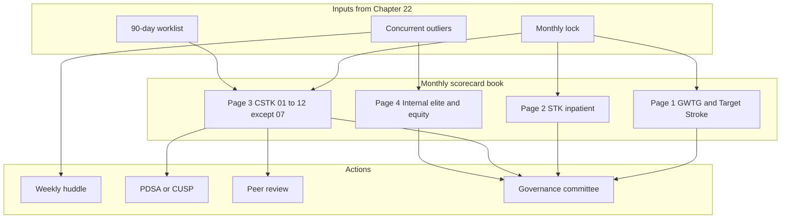
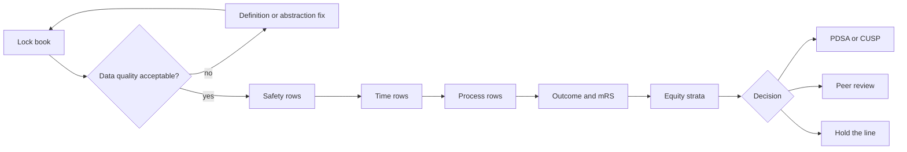

# Core Metrics: GWTG, STK, and CSTK

## Opening

The Medical Director runs three related but non-identical measurement systems: Get With The Guidelines–Stroke (GWTG) recognition, the STK inpatient core set, and the CSTK comprehensive set. They share patients and often share fields. They do not share definitions, denominators, or submission paths. Treating them as one spreadsheet is how a program celebrates Gold while CSTK-11 is failing and 90-day mRS is unmeasured.

This chapter is the scorecard manual. It lists the GWTG achievement measures and Target: Stroke thresholds as published, the STK inpatient set, and CSTK-01 through CSTK-12 with CSTK-07 omitted because it is not in the current set. It then describes how to run a monthly scorecard, how to set internal elite targets above external floors, and how to operate 90-day mRS capture as a production process.

Do not manage to last year's award. Manage to this month's denominators, this month's exclusions, and this month's missing data. Recognition is a lagging trophy. The scorecard is the job.

Use Chapter 22 to keep the data true. Use Chapter 24 to improve the defects the scorecard reveals. Use Chapter 25 to show surveyors the same numbers without a second set of books. Use Chapter 26 to stratify every measure on this scorecard.

## Why This Matters

Joint Commission DSC certification requires performance measurement. For a CSC, that means CSTK (Specifications Manual v2026B, posted 02/06/2026; 3Q–4Q 2026 discharges) and the longstanding STK set. GWTG-Stroke is the national registry and the public recognition program most academic CSCs use to benchmark and to structure hospital-facing awards. The 2026 AHA/ASA AIS Guideline is the clinical source that makes several of these measures clinically coherent: treat eligible disabling deficits rapidly within 4.5 hours regardless of NIHSS; give IVT and EVT together when both are indicated, without delaying thrombectomy; use tenecteplase 0.25 mg/kg IV push (max 25 mg) or alteplase 0.9 mg/kg (max 90 mg) in the 4.5-hour window.

External floors are not elite performance. GWTG achievement awards require 85% on each of seven achievement measures. Target: Stroke Honor Roll requires 75% DTN ≤60 minutes (minimum 6 patients). Those are public floors. An academic CSC that treats 85% and 75% as aspirations will be average on a good month and invisible on a bad one. Set internal targets higher, label them as internal, and never let a committee confuse the two.

90-day mRS is the measure that most reliably exposes a hollow quality system. CSTK-02 asks whether the score was obtained. CSTK-10 asks whether the outcome was favorable. Both fail if the program cannot find the patient. Capture is an operations problem: a worklist, a script, a proxy rule, a clinic path, and a Medical Director who reviews the aging report. It is not a coordinator's side task in month three.

Finally, the scorecard is how the Medical Director allocates attention. A month with intact STK-2 and collapsing CSTK-12 is an IR-cycle problem. A month with intact DTN and missing CSTK-01 is a documentation-before-recanalization problem. A month with intact process measures and missing 90-day mRS is a follow-up problem. Without a structured scorecard, every meeting becomes a tour of anecdotes.

## Core Framework

Run one monthly book with four pages: GWTG achievement and Target: Stroke; STK; CSTK; internal elite and equity. Every row has a definition owner, a numerator, a denominator, an external floor if one exists, an internal target, and a color that means something.

### GWTG-Stroke achievement awards

Public criteria last reviewed on the AHA page September 9, 2022, and still the public criteria used here. Achievement awards require **85%** on **each** of the seven achievement measures. Duration determines metal: Bronze for 90 consecutive days; Silver for 12 months; Gold for 24 months. Plus awards add quality-measure compliance; do not treat Plus as a substitute for the seven.

| # | Achievement measure | External floor | What the Medical Director actually manages |
| --- | --- | --- | --- |
| 1 | IV thrombolysis: arrive by 3.5 h / treat by 4.5 h | 85% | Eligibility, door-in, bolus discipline, 4.5-hour window operations |
| 2 | Early antithrombotics by end of hospital day 2 | 85% | Day-2 hard stop; hemorrhagic exclusions; hold reasons |
| 3 | VTE prophylaxis | 85% | Mechanical vs pharmacologic; documented contraindication |
| 4 | Antithrombotics at discharge | 85% | Discharge reconciliation; comfort-care exclusions |
| 5 | Anticoagulation for AF/flutter | 85% | Detection of AF; documented reason if not prescribed |
| 6 | Smoking cessation | 85% | Counseling as a discrete field, not a pamphlet in a drawer |
| 7 | Intensive statin at discharge | 85% | Intensity, not merely "a statin" |

Target: Type 2 Diabetes composite ≥80% for 12 months is a separate public recognition track. Track it if the hospital pursues it. Do not let it crowd reperfusion and sICH off the first page.

### Target: Stroke Honor Roll, Elite, Elite Plus, Advanced Therapy

Minimum 6 patients for Target: Stroke time-based recognition. Phase III national goals match Elite / Advanced Therapy primary goals.

| Recognition | Public threshold | Internal elite posture |
| --- | --- | --- |
| Honor Roll | **75% DTN ≤60 min** | Treat as a floor, not a goal |
| Elite | **85% DTN ≤60 min** | Minimum internal target for an academic CSC |
| Elite Plus | **75% DTN ≤45 min AND 50% DTN ≤30 min** | The operating target for direct-arrival IVT |
| Advanced Therapy | **50% door-to-device ≤90 min direct / ≤60 min transfer** | Pair with CSTK-09/11/12; do not stop at 50% |

Report DTN and door-to-device with numerator, denominator, median, and the percent at each public cut. A program can be Elite on percent ≤60 minutes and still have a long tail that CSTK-11 will punish. Always show the tail.

### STK inpatient set

Treat STK as the longstanding core inpatient set. STK-OP exists for outpatient/ED stroke (v2026B). CMS OP-23 historically tracked head CT/MRI results for stroke; confirm the current OQR set rather than asserting it is still mandatory.

| Measure | Short name | Operational definition for the scorecard |
| --- | --- | --- |
| STK-1 | VTE prophylaxis | Prophylaxis by the specified hospital-day rule, or a documented contraindication, in the STK population |
| STK-2 | Discharged on antithrombotic | Antithrombotic prescribed at discharge unless excluded |
| STK-3 | Anticoagulation for AF/flutter | Anticoagulation at discharge for documented AF/flutter unless excluded |
| STK-4 | Thrombolytic therapy | IV thrombolysis given to eligible patients in the specified window; align local protocol with the 2026 AIS Guideline agents and doses |
| STK-5 | Antithrombotic by end of hospital day 2 | Administration, not merely an order, by the day-2 rule |
| STK-6 | Discharged on statin | Statin at discharge per the measure specification |
| STK-8 | Stroke education | Required education elements completed and documented |
| STK-10 | Assessed for rehabilitation | Rehabilitation assessment documented |

There is no STK-7 or STK-9 in this handbook's working set. Do not invent them. STK-4 will move when local IVT agent choice moves (tenecteplase 0.25 mg/kg max 25 mg or alteplase 0.9 mg/kg max 90 mg). The measure cares about eligible treatment; the guideline cares about agent, dose, and not delaying EVT. Manage both.

### CSTK-01 through CSTK-12 (CSTK-07 omitted)

Population frames in v2026B: ischemic without reperfusion; ischemic with IV/IA/MER; hemorrhagic. Confirm current technical specifications, allowable values, and any sampling tables in the active manual before each submission cycle. Operational definitions below are for running the center, not a substitute for the manual.

| Measure | Name | Operational definition | Population focus |
| --- | --- | --- | --- |
| CSTK-01 | NIHSS performed for ischemic stroke | NIHSS documented before recanalization, or within 12 hours of arrival if no recanalization | Ischemic; sampling exists — confirm current manual for sample size and method |
| CSTK-02 | mRS at 90 days | A 90-day mRS is obtained on eligible patients | Ischemic follow-up operation |
| CSTK-03 | Severity measurement for SAH and ICH | A standard severity score is completed (ICH score; Hunt-Hess or WFNS as locally specified and allowed) | Hemorrhagic |
| CSTK-04 | Procoagulant reversal agent initiation for ICH | Reversal initiated for eligible ICH on anticoagulants per specification | ICH |
| CSTK-05 | Hemorrhagic transformation | Rate of hemorrhagic transformation in the applicable ischemic/reperfusion population; use the manual's sICH / HT definition | Ischemic with reperfusion safety |
| CSTK-06 | Nimodipine treatment administered | Nimodipine given to eligible aSAH patients | aSAH |
| CSTK-08 | TICI post-treatment reperfusion grade | A post-treatment TICI grade is documented | MER |
| CSTK-09 | Arrival time to skin puncture | Time from arrival to arterial puncture; overall measure | EVT |
| CSTK-10 | mRS at 90 days: favorable outcome | Among those with a 90-day mRS, the proportion with a favorable score as specified | Outcome, not just capture |
| CSTK-11 | Rapid effective reperfusion from hospital arrival | TICI ≥2B within 120 minutes of arrival | EVT effectiveness + speed |
| CSTK-12 | Rapid effective reperfusion from skin puncture | TICI ≥2B within 60 minutes of puncture | In-lab effectiveness + speed |

CSTK-07 is not in the current set. Remove it from local scorecards, vendor tiles, and fellowship teaching slides.

CSTK-01 exclusions in v2026B include age <18, length of stay >120 days, comfort measures on the day of or the day after arrival, elective carotid intervention, and non-recanalization patients discharged within 12 hours. Build these as discrete logic (Chapter 22). Do not rely on abstractor memory.

**How to read the reperfusion cluster.** CSTK-08 asks whether a grade exists. CSTK-09 asks how long to puncture. CSTK-11 asks whether effective reperfusion (TICI ≥2B) happened within 120 minutes of arrival. CSTK-12 asks whether it happened within 60 minutes of puncture. A center can pass CSTK-08 and fail CSTK-11 (grade documented, too late from the door). A center can pass CSTK-11 and fail CSTK-12 (fast from the door because of a short pre-lab interval, slow once in the lab). A center can pass CSTK-12 and fail CSTK-11 (efficient lab, late door-to-puncture). Manage all four. Pair them with Target: Stroke Advanced Therapy (50% door-to-device ≤90 min direct / ≤60 min transfer) without pretending the definitions are identical.

**How to read the safety and hemorrhagic cluster.** CSTK-05 is a safety outcome. Do not "improve" it by under-ascertaining sICH or by reclassifying clinical decline. Pair every CSTK-05 case with peer review and with the defect taxonomy in Chapter 24. CSTK-03, CSTK-04, and CSTK-06 are process measures that implement the 2022 ICH Guideline, the 2024 AHA/ASA ICH performance measures, and the 2023 aSAH Guideline (nimodipine remains standard). The April 2, 2025 Joint Commission announcement reduced the annual aSAH volume criterion to 10; volume is not a substitute for CSTK-06 reliability.

**How to read the outcome cluster.** CSTK-02 is capture. CSTK-10 is outcome among the captured. A high CSTK-10 with a low CSTK-02 is not a good outcome program; it is a biased sample of people who answered the phone. Always present them as a pair, with the capture rate in the denominator of the conversation even when it is not in the denominator of CSTK-10.

### Internal elite targets versus external floors

Write the distinction into the scorecard header so a new committee member cannot miss it.

| Domain | External floor (public / certification) | Internal elite target (example posture) |
| --- | --- | --- |
| GWTG achievement (each of 7) | 85% | 95%, with case-level review of every miss |
| DTN ≤60 min | Honor Roll 75%; Elite 85% | ≥90% ≤60 min |
| DTN ≤45 / ≤30 min | Elite Plus 75% / 50% | Meet Elite Plus every rolling 6 months, not as a one-month spike |
| Door-to-device | Advanced Therapy 50% at 90/60 | A locally set percent above 50%, plus CSTK-11/12 reliability |
| CSTK-01 | As specified; sampling if used | Unsampled internal compliance near 100% before recanalization |
| CSTK-02 | As specified | Contact attempted on 100% eligible; capture target set locally and reviewed monthly |
| CSTK-05 | As specified | Every sICH reviewed; no target that incentivizes under-reporting |
| CSTK-11 / 12 | TICI ≥2B within 120 / 60 min | Rolling performance with special-cause rules, not a single monthly percent |

Internal targets are hospital policy. They are not Joint Commission requirements and not AHA award criteria unless they happen to match. Never present an internal target to a surveyor as if it were a standard.

### How the Medical Director runs a monthly scorecard

The scorecard meeting is a decision meeting. It is not a slide tour.

**Before the meeting.** Quality locks the book (Chapter 22). The Medical Director reads exceptions, not the green rows. Each red or yellow row has a one-line cause hypothesis and a named owner. Concurrent outliers from the month already have huddle notes attached.

**In the meeting (45–60 minutes).**

1. Data-quality row first: lock completeness, timestamp conflicts, inter-rater result, 90-day worklist health. If the data are not trustworthy, stop and fix data before interpreting clinical performance.
2. Safety: CSTK-05 cases, any death or deterioration review tied to reperfusion or reversal delay.
3. Time: DTN (Honor Roll / Elite / Elite Plus cuts), door-to-device (Advanced Therapy cuts), CSTK-09/11/12.
4. Process reliability: GWTG 7, STK, CSTK-01/03/04/06/08.
5. Outcomes and follow-up: CSTK-02/10, disposition, rehab assessment.
6. Equity one-pager (Chapter 26): the same time and access measures stratified.
7. Decisions: new PDSA, retire a PDSA (Chapter 24), peer-review referral, resource ask, or definition change to the control board.

**After the meeting.** Publish a one-page decision log to the governance list. Update the operational dashboard owners. Do not wait for the next monthly to start a time-critical PDSA.

### 90-day mRS capture operations

Treat 90-day mRS as a production line with a worklist, a script, a method hierarchy, and an aging report.

**Eligibility.** Start from the CSTK-02 population in the current manual. Confirm inclusions, exclusions, and the allowable contact window in v2026B or its successor. Do not invent a local window that is looser than the specification and then call it CSTK-02.

**Method hierarchy (local policy; document it).**

1. Structured clinic visit in the allowable window, score entered as a discrete field by a trained examiner.
2. Scheduled telephone mRS by a trained nurse, coordinator, or APP using a scripted instrument.
3. Structured video visit.
4. Validated proxy history when the patient cannot respond, with the proxy relationship recorded.
5. Documented unsuccessful contact attempts — date, method, result — so CSTK-02 failure is explained rather than mysterious.

Do not accept a clinic note that says "doing well" as an mRS. Do not accept an unstructured "independent" as a 0–2. Train examiners. Dual-review a locally defined sample each month.

**Worklist mechanics.**

- Add the patient to the 90-day list at discharge, not at day 80.
- Schedule the preferred contact before discharge when a clinic slot exists.
- Begin outbound attempts early enough to finish inside the specification window after no-answers and bad numbers.
- Use at least two modalities (phone and portal/mail) before closing as unable to contact, unless the manual specifies otherwise.
- Capture language need at discharge so the day-90 call has an interpreter (Chapter 26).
- Feed research 90-day visits into the same discrete field when the visit meets the measure rules; do not create a parallel research-only score that never reaches CSTK.

**Medical Director review.** Monthly, review capture rate, method mix, proxy rate, unable-to-contact reasons, and CSTK-10 among the captured. If capture falls, do not interpret CSTK-10. If one language group or one discharge disposition dominates the unable-to-contact list, that is an equity defect, not a "hard-to-reach" shrug.

!!! tip "Key Actions"
    Publish a one-page scorecard dictionary that maps each GWTG, STK, and CSTK row to a source report and a human owner. Remove CSTK-07 from every local artifact. Pair CSTK-02 with CSTK-10 on every slide. Pair CSTK-08, 09, 11, and 12 on every reperfusion discussion. Set internal targets above 85% achievement, above Honor Roll, and above Advanced Therapy 50%, and label them internal. Stand up the 90-day worklist as a daily queue with an aging report.

!!! abstract "Metrics Targets"
    GWTG achievement: 85% on each of the seven measures; Bronze 90 days, Silver 12 months, Gold 24 months. Target: Stroke (min 6 patients): Honor Roll 75% DTN ≤60 min; Elite 85% DTN ≤60 min; Elite Plus 75% DTN ≤45 min AND 50% DTN ≤30 min; Advanced Therapy 50% door-to-device ≤90 min direct / ≤60 min transfer. Target: Type 2 Diabetes composite ≥80% for 12 months. CSTK-11: TICI ≥2B within 120 min of arrival. CSTK-12: TICI ≥2B within 60 min of puncture. STK-1 through 6, 8, and 10 as specified. Internal elite targets sit above these floors and are local policy. Confirm CSTK-01 sampling sizes in the current manual.

!!! warning "Common Pitfalls"
    Managing to Gold while ignoring CSTK-11/12. Reporting CSTK-10 without CSTK-02. Sampling measures the current manual does not allow to be sampled. Using Honor Roll 75% as the internal DTN goal. Letting a vendor tile still display CSTK-07. Treating STK-4 as agent-agnostic folklore after the 2026 AIS Guideline. Celebrating a short median DTN that hides a long tail. Interpreting a month with n=4 as Elite Plus. Allowing "doing well" to pass as a 90-day mRS. Setting an sICH "improvement target" that punishes reporting.

!!! success "Implementation Tips"
    Read exceptions, not green ink. Put data quality as item 1 so the committee cannot skip it. Attach huddle notes to in-month outliers so the monthly meeting is adjudication, not discovery. Teach fellows the difference between CSTK-11 and CSTK-12 with two real cases. When a measure moves after a specification update, annotate the chart rather than launching a PDSA on a definition change. Keep a rolling 12-month view next to the single month so small denominators do not drive theater.

## How to Do the Work

### Daily / weekly

- Scan the operational list for DTN >60 minutes, DTN misses against the 45- and 30-minute cuts, door-to-puncture misses against 90/60, missing pre-recanalization NIHSS, missing TICI, new CSTK-05 flags, and ICH reversal or nimodipine delays.
- Assign each new outlier a same-week owner. Do not wait for the monthly book.
- Work the 90-day queue every weekday. Review the aging report weekly.
- If STK-5 or STK-1 is about to fail on a current inpatient, intervene before discharge rather than abstracting a miss.
- Reconcile any case that looks like a measure success in GWTG and a failure in CSTK, or the reverse.

Weekly huddle uses the concurrent list. Monthly committee uses the locked book. Do not confuse the two meetings.

### Monthly / quarterly

- Lock and run the four-page scorecard as specified above.
- Recalculate Target: Stroke status on a rolling basis (Honor Roll / Elite / Elite Plus / Advanced Therapy) with explicit denominators.
- Review every GWTG achievement measure below 85% and every internal-target miss, case by case.
- Review every CSTK-05 case and every CSTK-11/12 miss for peer review versus system PDSA (Chapter 24).
- Confirm CSTK-01 sampling (if used) still matches the current manual.
- Quarterly, present rolling 12-month performance to departmental and hospital quality leadership, with floors and internal targets labeled.
- Quarterly, audit a locally defined sample of 90-day mRS instruments against the discrete field.

### Annual / multi-year

- Decide which GWTG metal and which Target: Stroke tier the hospital is formally pursuing this year. Publish the decision so the team is not chasing every badge.
- Re-align STK-4 and local IVT protocol with the 2026 AIS Guideline (tenecteplase or alteplase as above; no delay of EVT).
- Re-read CSTK and STK specifications at each manual release. Version the scorecard dictionary.
- Recalibrate internal targets against the last 12 months of denominator size. A target that is never missed is not elite; it is slack. A target missed every month is not elite; it is decorative.
- Report 90-day capture operations in the budget: FTE, interpreter need, clinic slots, and failed-contact cost.
- Keep a multi-year annotated chart of CSTK-11/12, DTN cuts, CSTK-05, and CSTK-02 so leadership can see definition changes, pathway changes, and true improvement.

## Ready-to-Adapt Tools

### Tool A — Monthly scorecard shell

| Row | n | Num | Den | % | External floor | Internal target | Status | Owner | Action |
| --- | --- | --- | --- | --- | --- | --- | --- | --- | --- |
| Data quality: concurrent close ≤2 business days | | | | | — | [local] | | | |
| GWTG-1 IVT 3.5/4.5 | | | | | 85% | [local] | | | |
| GWTG-2 early antithrombotic | | | | | 85% | [local] | | | |
| GWTG-3 VTE | | | | | 85% | [local] | | | |
| GWTG-4 DC antithrombotic | | | | | 85% | [local] | | | |
| GWTG-5 AC for AF | | | | | 85% | [local] | | | |
| GWTG-6 smoking cessation | | | | | 85% | [local] | | | |
| GWTG-7 intensive statin | | | | | 85% | [local] | | | |
| DTN ≤60 / ≤45 / ≤30 | | | | | 75/85 ; 75 ; 50 | [local] | | | |
| Door-to-device direct ≤90 / transfer ≤60 | | | | | 50% | [local] | | | |
| STK-1,2,3,4,5,6,8,10 | | | | | spec | [local] | | | |
| CSTK-01 … 06, 08 … 12 | | | | | spec | [local] | | | |
| CSTK-02 capture / CSTK-10 favorable | | | | | spec | [local] | | | |

Add a rolling 12-month column beside the single month. Add an equity breakout on page 4.

### Tool B — Scorecard meeting agenda (55 minutes)

1. Data quality and lock exceptions (5).
2. CSTK-05 and other safety (10).
3. DTN and door-to-device versus Honor Roll / Elite / Elite Plus / Advanced Therapy (10).
4. CSTK-09/11/12 and CSTK-08 documentation (8).
5. GWTG seven and STK misses (7).
6. CSTK-02/10 worklist (5).
7. Hemorrhagic process: CSTK-03/04/06 (5).
8. Decisions and owners (5).

Circulate the book 48 hours prior. No new tables in the room.

### Tool C — 90-day mRS SOP skeleton

**Purpose.** Obtain a specification-compliant 90-day mRS on the CSTK-02 population.

**Roles.** Worklist owner [coordinator]; examiners [trained RN/APP/physician]; language access [interpreter services]; adjudicator [Medical Director or designee]; research liaison [does not overwrite fields].

**Procedure.**

1. Enroll on the worklist at discharge.
2. Confirm eligibility against the current CSTK-02 specification.
3. Book the preferred method before discharge when possible.
4. Execute the method hierarchy.
5. Enter mRS, date, method, and examiner as discrete fields.
6. Record unsuccessful attempts.
7. Close inside the allowable window or document why not.
8. Monthly audit of a locally defined sample.

**Do not.** Accept prose outcomes. Invent a window. Exclude a language group from outbound attempts.

### Tool D — Reperfusion four-measure review card

Use one card per CSTK-11 or CSTK-12 miss.

- Door time and source
- Imaging times
- IVT given? Agent and bolus time (TNK 0.25 mg/kg max 25 mg or alteplase 0.9 mg/kg max 90 mg)
- Puncture time
- First-pass time and final TICI time
- Final TICI
- Minutes door-to-TICI≥2B (CSTK-11 cut: 120)
- Minutes puncture-to-TICI≥2B (CSTK-12 cut: 60)
- Transfer vs direct (Advanced Therapy cuts: 90 / 60)
- Defect codes (Chapter 24)
- Peer review vs PDSA

### Tool E — Internal versus external target charter (excerpt)

"External floors are GWTG 85% achievement, Target: Stroke published cuts, and CSTK/STK specifications. Internal targets are set by the stroke governance committee, labeled 'internal,' and may be stricter. No staff member shall present an internal target as a certification requirement. No sICH rate target shall be written in a way that discourages complete CSTK-05 ascertainment."

### Tool F — Fellow one-pager: which system is in play?

| Question | System |
| --- | --- |
| Eligible IVT given in the window? | STK-4 and GWTG-1 |
| DTN ≤60 / 45 / 30? | Target: Stroke |
| NIHSS timed correctly? | CSTK-01 |
| TICI documented? | CSTK-08 |
| Puncture on time? | CSTK-09 and Advanced Therapy |
| TICI ≥2B on time from door / from puncture? | CSTK-11 / CSTK-12 |
| 90-day contact completed? | CSTK-02 |
| 90-day outcome favorable? | CSTK-10 |
| ICH coagulopathy reversed / nimodipine given? | CSTK-04 / CSTK-06 |
| Hemorrhagic transformation present? | CSTK-05 |

## Integration With Other Pillars

Chapter 22 is the spine that makes every number in this chapter defensible. If timestamps or abstractor FTE are wrong, stop here and fix infrastructure.

Chapter 24 turns CSTK-05 and CSTK-11/12 misses into CUSP, PDSA, or RCA. Chapter 25 is how surveyors will test whether staff can explain these measures without a script. Chapter 26 requires every time and outcome row to be stratified.

Clinical chapters supply the processes: EMS and code stroke drive DTN; imaging and EVT drive CSTK-09/11/12; NCC and hemorrhagic programs drive CSTK-03/04/05/06; the stroke unit and clinic drive STK discharge measures and 90-day mRS. Leadership chapters supply the authority to set internal targets and to fund follow-up FTE. Research chapters supply 90-day visits that can feed CSTK-02 if governed. Strategy chapters should not advertise Advanced Therapy or Elite Plus unless the locked book supports the claim.

## Sources

- 2026 Guideline for the Early Management of Patients With Acute Ischemic Stroke. *Stroke*. 2026;57(8):e316–e436. DOI 10.1161/STR.0000000000000513. IVT agents and doses; treat disabling deficits within 4.5 h regardless of NIHSS; do not delay EVT for patients eligible for both.
- Specifications Manual for Joint Commission National Quality Measures, CSTK v2026B (posted 02/06/2026; 3Q–4Q 2026 discharges): CSTK-01 through 06 and 08 through 12; CSTK-07 not in the current set; CSTK-01 exclusions and sampling (confirm current sample sizes in the active manual).
- STK inpatient measure set (STK-1, 2, 3, 4, 5, 6, 8, 10); STK-OP v2026B. Confirm current CMS OQR status of historical OP-23 rather than asserting it is mandatory.
- American Heart Association. Get With The Guidelines–Stroke recognition criteria (public page last reviewed September 9, 2022): 85% on each of seven achievement measures; Bronze 90 days / Silver 12 months / Gold 24 months; Target: Stroke Honor Roll / Elite / Elite Plus / Advanced Therapy thresholds as tabulated; Target: Type 2 Diabetes composite ≥80% for 12 months; Phase III national goals align with Elite / Advanced Therapy primary goals.
- The Joint Commission. 2026 Stroke Certification Standards (SCS26). April 2, 2025 announcement reducing the annual aSAH volume criterion to 10.
- Greenberg SM, et al. 2022 ICH Guideline. *Stroke*. DOI 10.1161/STR.0000000000000407. 2024 AHA/ASA Performance and Quality Measures for Spontaneous ICH.
- 2023 aSAH Guideline. *Stroke*. 2023;54:e314–e370. DOI 10.1161/STR.0000000000000436.
- HERMES collaborators, 2016, and subsequent late-window and large-core EVT trials (DAWN, DEFUSE 3, SELECT2, ANGEL-ASPECT, RESCUE-Japan LIMIT) as outcome context for CSTK-10, not as measure specifications.
