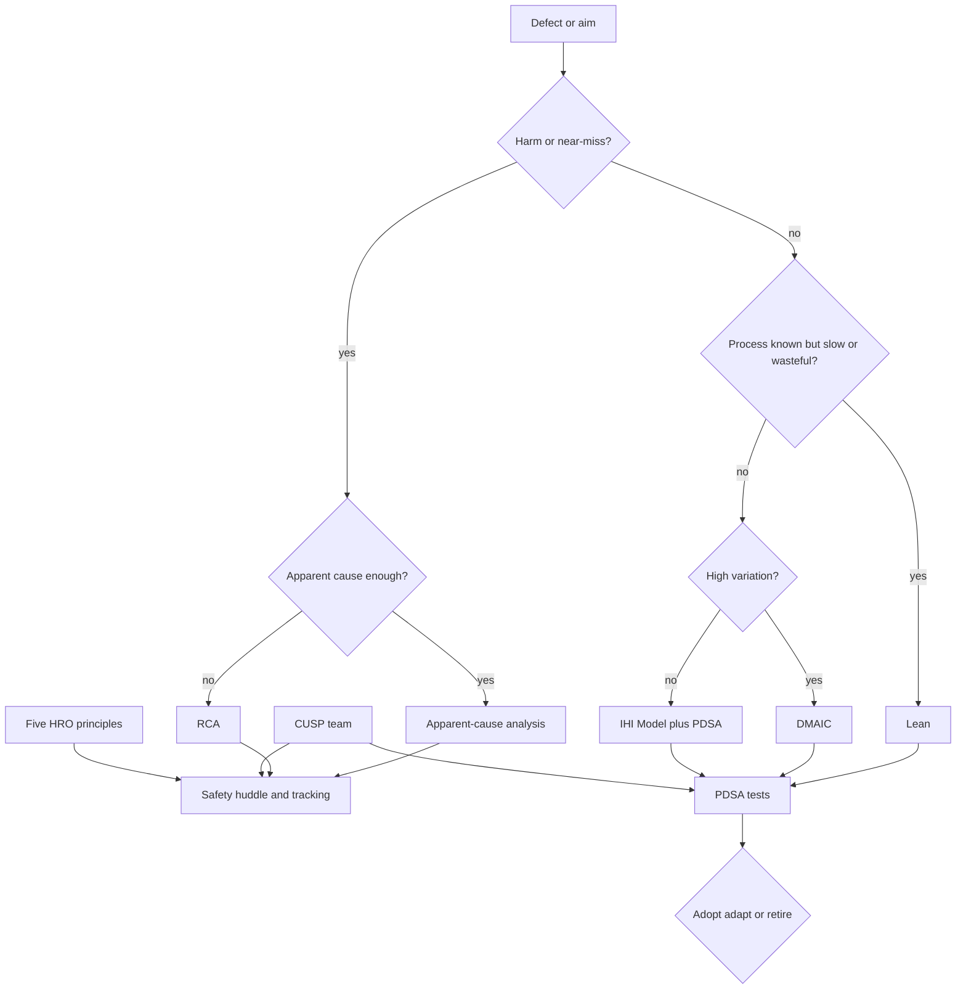
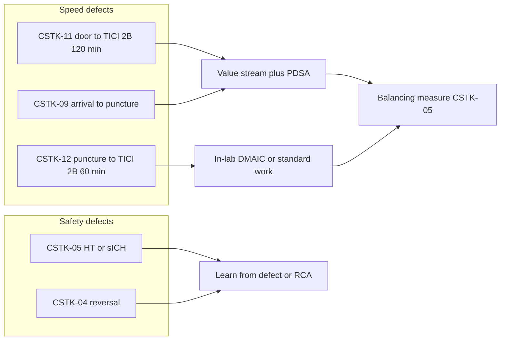

# Continuous Improvement and High Reliability

## Opening

A scorecard without a method is a complaint session. The Medical Director needs a small, named set of improvement tools and a safety operating system that still works at 02:00 when the fellow, the IR attending, and the CT tech are the only people in the chain. This chapter is that operating system: the IHI Model for Improvement and PDSA, Lean, Six Sigma DMAIC, AHRQ CUSP, and the five high-reliability organizing (HRO) principles. It then gives a defect taxonomy for code stroke, a rule for apparent-cause analysis versus root-cause analysis (RCA), a huddle design, and a way to retire a failed PDSA without theater.

Two CSTK families should sit on the improvement agenda every month: CSTK-05 hemorrhagic transformation, and the reperfusion-speed pair CSTK-11 (TICI ≥2B within 120 minutes of arrival) and CSTK-12 (TICI ≥2B within 60 minutes of puncture). They are not "quality projects." They are how the program sees harm and delay.

High reliability is not a poster. It is preoccupation with the last near-miss, reluctance to call a delay "just a sick night," sensitivity to what the night board actually looks like, commitment to recover when the suite is down, and deference to the person who knows the failure mode — often the tech, the charge nurse, or the EMS clinician, not the person with the title.

## Why This Matters

The 2026 AIS Guideline compresses time and removes excuses: treat eligible disabling deficits in the 4.5-hour window regardless of NIHSS; give IVT and EVT together when both apply, without delaying thrombectomy; use tenecteplase 0.25 mg/kg (max 25 mg) or alteplase 0.9 mg/kg (max 90 mg). HERMES-level EVT benefit (mRS 0–2 46.0% versus 26.5%; NNT 2.6 for a ≥1-point mRS shift) is the clinical reason CSTK-11 and CSTK-12 exist. Late-window and large-core trials (DAWN, DEFUSE 3, SELECT2, ANGEL-ASPECT, RESCUE-Japan LIMIT) expanded who can benefit; they did not relax in-hospital clocks.

CSTK-05 is the safety counterweight. Faster reperfusion that buys symptomatic ICH through uncontrolled blood pressure, protocol-violating lysis, or unreviewed device passes is not improvement. The 2022 ICH Guideline, the 2024 ICH performance measures, and CSTK-04/05 are how hemorrhagic harm is made visible. A program that only PDSAs DTN will eventually be surprised by sICH.

Joint Commission patient-safety and high-reliability framing is appropriate for a CSC. Surveyors will ask how the last sICH was reviewed, how a failed door-to-puncture experiment was stopped, and whether staff can describe a defect without waiting for the coordinator. Academic CSCs add a further risk: every fellow class resets local knowledge. Improvement methods have to survive July.

Finally, improvement theater is expensive. An open PDSA that no one can retire, a Lean event that produces a poster and no standard work, an RCA that ends with "re-educate staff," and a huddle that recites yesterday's census without naming a defect — these consume the same FTE that should be fixing puncture-to-recanalization delay. The Medical Director's job is to keep the portfolio small, honest, and lethal to the defect.

## Core Framework

Pick methods by the shape of the problem, not by which workshop someone attended last year.

| Problem shape | Method | Output that counts |
| --- | --- | --- |
| Aim, measure, and a change idea exist | IHI Model + PDSA | Sequential tests with a retire/adopt decision |
| Waste, waits, extra motion in a known pathway | Lean | Standard work, visual management, removed steps |
| Unexplained variation in a stable process | Six Sigma DMAIC | Specified process, reduced variation, control plan |
| Unit-level safety culture and a hazard | AHRQ CUSP | Team, science of safety, learn-from-defect, partnership |
| Harm, near-miss, or special-cause failure | Apparent cause vs RCA | Cause statement, actions that change the system |
| Everyday operations under load | HRO principles + huddles | Surface weak signals; defer to expertise |

### IHI Model for Improvement

Three IHI questions, then PDSA:

1. What is the aim? (time-bounded, population-specific)
2. How will a change be known as an improvement? (measure, including a balancing measure)
3. What change can be tested? (one idea, not a committee wish list)

Example aims that belong on a CSC board:

- Increase the percent of direct-arrival IVT with DTN ≤45 minutes to the Elite Plus public cut (75%) and hold it for six months, without increasing CSTK-05.
- Increase CSTK-12 (TICI ≥2B within 60 minutes of puncture) by removing a specified in-lab wait, without increasing puncture-without-device or sICH.
- Increase CSTK-04 reversal initiation reliability for eligible ICH to a locally set internal target.

Write the aim so a fellow can understand it. If the aim is "become elite," it is not an aim.

### PDSA

**Plan.** Name the change, the who, the when, the data, and the predict-the-result statement. Predicts are mandatory; otherwise every result looks like success.

**Do.** Run the smallest test that can falsify the prediction. One shift, one team, one room is a test. A house-wide policy is not a test.

**Study.** Compare prediction to result. Include the balancing measure (CSTK-05 when speeding reperfusion; missed eligible patients when tightening eligibility documentation).

**Act.** Adopt, adapt, or retire. Write the decision in the log. "Continue to monitor" is not an act.

Rules: one change per test when possible; annotate the run chart with the test date; do not stack five PDSAs on the same DTN line and then claim causality. Link each PDSA to a scorecard row from Chapter 23.

### Lean

Use Lean when the pathway is known and the waste is visible: duplicate NIHSS entry, porter waits, consent hunting, room turnover, supply hunting in the suite, extra patient movement between CT and CTA. Map the value stream for code stroke and for the IR path on a real last-case, not a workshop abstraction.

Standard work is the product. A future-state map without a named owner, a visual cue, and a weekly audit is a drawing. The Medical Director does not need to be the Lean facilitator. The Medical Director does need to forbid solutions that add a form without removing a step.

### Six Sigma DMAIC

Use DMAIC when the process is specified and the problem is variation: some nights hit CSTK-12 and some nights do not, and the mean looks acceptable. Define the defect (for example, puncture-to-TICI≥2B >60 minutes). Measure with the Chapter 22 timestamp hierarchy. Analyze with a short set of factors (anesthesia mode, first-pass failure, device-ready status, fellow vs attending first puncture, transfer vs direct). Improve one factor at a time. Control with a dashboard rule and an owner.

Do not DMAIC a process that is not yet standard. Standardize first (Lean / standard work), then reduce variation.

### AHRQ CUSP

CUSP is the unit-level safety method: assemble a team, teach the science of safety, identify defects, partner with a senior executive, learn from defects, and implement tools (briefings, checklists, shadowing). Use it on the neuro ICU, the stroke unit, and the IR/anesthesia interface — the places where CSTK-05, reversal, nimodipine, and post-EVT monitoring actually live.

A CUSP team is not a second stroke committee. It reports hazards into governance and takes back standard-work changes. The Learn from a Defect tool is the right first response to a CSTK-05 case that is not automatically an RCA.

### Five HRO principles

Apply Weick and Sutcliffe's five principles as operating rules, consistent with Joint Commission high-reliability framing.

| Principle | CSC translation | What the Medical Director listens for |
| --- | --- | --- |
| Preoccupation with failure | Near-misses, almost-lyses, almost-punctures, almost-wrong-side | Staff who volunteer weak signals in huddle |
| Reluctance to simplify | "Busy night" is not a cause | Insistence on a specific mechanism |
| Sensitivity to operations | The real board: two codes, one scanner, one suite, one fellow | Night and weekend presence; not only Monday metrics |
| Commitment to resilience | Downtime pathways, backup IR, backup CT, backup pharmacist | Recovery time after a suite or EHR outage |
| Deference to expertise | The person who knows the failure speaks first | Tech, charge RN, EMS, or fellow can stop a briefing |

If the only voice in M&M is the attending who was not there, the program is not deferring to expertise.

### Defect taxonomy for code stroke

Code every DTN miss, CSTK-11 miss, CSTK-12 miss, untreated eligible patient, and CSTK-05 case with one primary and optional secondary codes. The taxonomy is for learning, not for blame. Keep it short enough that the night APP will use it.

| Code family | Examples | Typical measure link |
| --- | --- | --- |
| Prehospital / arrival | Wrong destination, incomplete last-known-well, no prenotification, door time undefined | DTN, CSTK-09/11 |
| Recognition | Stroke not activated; TIA label on a disabling deficit; NIHSS delayed | CSTK-01, STK-4, GWTG-1 |
| Imaging | Scanner occupied, protocol wrong, contrast delay, reconstruction delay, read delay | DTN, CSTK-09/11 |
| Treatment decision | Eligibility confusion; waiting for advanced imaging when 4.5-hour disabling stroke does not require it; delaying EVT for IVT completion | STK-4, CSTK-11 |
| Drug / pharmacy | Agent choice, mixing, pump, wrong weight, tenecteplase vs alteplase process error | DTN, CSTK-05 |
| Consent / capacity | Family not reached; no emergency exception pathway | DTN, CSTK-09 |
| Transport / bed | ED to CT, CT to IR, ICU bed block | CSTK-09/11 |
| IR / lab | Team not called in parallel; anesthesia delay; device not ready; access difficulty; first-pass failure | CSTK-09/11/12, CSTK-08 |
| Documentation / data | NIHSS after recanalization; missing TICI; clock conflict | CSTK-01/08; false time failures |
| Hemorrhagic safety | BP excursion, protocol deviation, reversal delay, unrecognized coagulopathy | CSTK-05, CSTK-04 |
| Follow-up | No 90-day attempt, language barrier, wrong number | CSTK-02/10 |
| Equity / access | Interpreter not used; insurance or transfer bias in eligibility | Chapter 26 strata |

A miss may have two codes (imaging delay + documentation). It may not have zero codes and a shrug. Present the Pareto of codes monthly next to CSTK-11/12 and DTN.

### Apparent-cause analysis versus RCA

Not every defect deserves a 30-day RCA. Overusing RCA trains staff to wait for a report. Underusing RCA leaves harm unexplained.

| Use apparent-cause analysis | Use RCA (or the hospital's equivalent full review) |
| --- | --- |
| Single DTN or DTP miss with a clear mechanism | Death, severe harm, or sICH with unclear mechanism |
| Documentation-only CSTK-01 or CSTK-08 miss | Recurrent same defect after a completed PDSA |
| First occurrence of a known, already-coded delay | Equipment, credentialing, or hierarchy problem |
| Balancing measure movement within prediction | Sentinel-level event per hospital policy |
| Near-miss fully caught by existing barrier | Barrier failed or did not exist |

Apparent-cause: same week, one page, defect code, local fix or PDSA, Medical Director or Associate sign-off. RCA: formal team, timeline, why-tree or equivalent, stronger-than-training actions, tracking to closure. "Re-educate the fellow" is not an acceptable sole action in either format.

### Safety huddles

Run three huddles that do not duplicate the monthly scorecard.

**Daily (or next-morning) code-stroke huddle — 10 minutes.** Yesterday's activations, today's risks (suite down, CT down, two transfers inbound, new fellow on nights). Name defects, not census. Defer to the nurse or tech who ran the last case.

**Weekly safety huddle — 20 minutes.** Open apparent-cause items, open CSTK-05 reviews, in-lab delays, medication events, interpreter misses. Assign owners. This is the CUSP feed.

**Post-event huddle — 5 minutes, same shift when possible.** After sICH, after a CSTK-11/12 miss that felt chaotic, after a wrong-protocol scan. Capture facts while clocks and memories agree. Formal review can wait; fact capture cannot.

Huddles fail when they become announcements. Ban slides. Ban "great job team" as the only content. Require one weak signal per huddle.

### How to retire a failed PDSA

A PDSA that does not match its prediction is information. Keeping it open is vanity.

Retire when any of the following is true:

- Two sequential tests fail the prediction and the change idea has no remaining plausible adaptation.
- The balancing measure (especially CSTK-05) moves in the wrong direction beyond a pre-set stop rule.
- The change requires FTE or capital the sponsor has formally declined.
- The defect code analysis shows the change targeted the wrong family (for example, a pharmacy PDSA when the Pareto is IR call-in).
- Staff workaround around the change is safer than the change.

Retirement procedure:

1. Write "retire" and the date on the PDSA log.
2. Record what was learned in one paragraph.
3. Remove any temporary standard work the test inserted.
4. Restore or replace the previous standard, explicitly.
5. Choose the next method (different change idea, Lean remap, DMAIC, or stop the aim).
6. Report the retirement in the monthly scorecard meeting so the committee sees honesty modeled.

Do not silently abandon a PDSA. Silence is how five zombie projects accumulate.

### Linking methods to CSTK-05, CSTK-11, and CSTK-12

**CSTK-11 (TICI ≥2B within 120 minutes of arrival).** Usually a system-time problem: prenotification, parallel IR call, imaging protocol, transport, consent, suite access. Start with Lean value-stream on a recent miss, code the defect, then PDSA one removed wait. Use Target: Stroke Advanced Therapy cuts (50% door-to-device ≤90 min direct / ≤60 min transfer) as a related but non-identical external floor.

**CSTK-12 (TICI ≥2B within 60 minutes of puncture).** Usually an in-lab problem: anesthesia ready, device open, access, first-pass strategy, attending presence, room setup. DMAIC if variation is high across operators or shifts. Peer review if an individual pattern exists; system PDSA if the pattern is the room.

**CSTK-05 (hemorrhagic transformation).** Every case gets at least Learn from a Defect or apparent-cause. Escalate to RCA when harm is severe or the mechanism is unclear. Balancing measure for every speed PDSA. Pair with CSTK-04 when the patient is ICH rather than ischemic transformation. Never write an "sICH reduction target" that can be met by under-coding.

!!! tip "Key Actions"
    Publish a one-page method-selection rule (table above) so every defect is not auto-assigned to "do a PDSA." Install the code-stroke defect taxonomy this month and require a code on every time or safety miss. Put CSTK-05, CSTK-11, and CSTK-12 on the weekly huddle, not only the monthly book. Write stop rules and a retirement ritual for PDSAs. Replace "re-educate staff" as a sole RCA action.

!!! abstract "Metrics Targets"
    Improvement portfolio: a locally set maximum number of open PDSAs (keep it small). Percent of DTN, CSTK-11, CSTK-12, and CSTK-05 events with a defect code within 7 days: internal target 100%. Apparent-cause completed same week; RCA on the hospital's clock. Balancing: no speed PDSA remains open if CSTK-05 ascertainment falls or if a pre-set sICH stop rule is crossed. External floors remain those in Chapter 23 (Elite Plus DTN cuts; Advanced Therapy 50% door-to-device; CSTK-11 120 min; CSTK-12 60 min). Huddle reliability: daily huddle held, one weak signal recorded.

!!! warning "Common Pitfalls"
    Five stacked PDSAs on DTN with no defect codes. RCA for every 61-minute needle time. No RCA after a devastating sICH. A Lean event that adds a checklist and a second NIHSS form. DMAIC on a process that is not standard. CUSP team that never includes night staff or IR techs. Huddles that are announcements. Zombie PDSAs. Using CSTK-05 as a pay-for-performance rate. Simplifying a miss to "the fellow was new" — a July problem is a system problem. Ignoring transfer clocks when working CSTK-11.

!!! success "Implementation Tips"
    Start with taxonomy plus huddles; methods fail without a feed of coded defects. Coach one apparent-cause write-up in front of the fellow class. Pair every speed test with a named CSTK-05 watcher. When retiring a PDSA, say "this failed" in the committee without punishment. Invite EMS and the CT tech to the value-stream map. Use the Associate Medical Director to run weekly huddles so the method survives the Medical Director's travel. Annotate run charts with guideline or spec changes so 2026 AIS agent changes are not misread as improvement.

## How to Do the Work

### Daily / weekly

- Hold the 10-minute huddle. Capture one weak signal. Code yesterday's misses the same day when possible.
- After any sICH or chaotic reperfusion, run a same-shift fact huddle.
- Walk the board once on a night or weekend each week. Sensitivity to operations is not a daytime hobby.
- Review open PDSA tests that are in their "Do" window. Kill scope creep.
- Confirm IR, CT, and pharmacy downtime paths are current if any system is degraded.

### Monthly / quarterly

- Present the defect-code Pareto beside CSTK-05/11/12 and DTN.
- Decide adopt / adapt / retire on every open PDSA. No third month of "continue to monitor."
- Select at most one new formal project (Lean, DMAIC, or CUSP workstream) per quarter unless harm forces more.
- Review RCA action strength: preference for physical, architectural, and constraint changes over training and policy memos.
- Quarterly, have an executive sponsor walk a night code with the CUSP team.
- Reconcile improvement claims with the locked Chapter 23 book. If the scorecard did not move, the project did not work.

### Annual / multi-year

- Retrain incoming fellows and new IR/NCC faculty on the taxonomy, huddle etiquette, and how to write an apparent-cause page.
- Refresh CUSP membership so it is not a standing cast of day-shift volunteers.
- Audit a year's retired PDSAs for learning that should become standard work or should be taught.
- Reassess whether the portfolio still matches the actual Pareto (do not run a VTE PDSA when the Pareto is CSTK-12).
- Build resilience: backup suite, backup interpreter path, backup weight source, downtime documentation that still supports timestamps.
- Report to the chair and hospital quality in HRO language: what weak signals were heard, what was retired, what harm was reviewed, what standard changed.

## Ready-to-Adapt Tools

### Tool A — Method selection card (pocket)

1. Harm / near-miss with unclear mechanism or failed barrier → RCA.
2. Harm / near-miss with clear mechanism → apparent cause + Learn from a Defect.
3. Known pathway, visible waits → Lean, then PDSA.
4. Specified pathway, high variation → DMAIC.
5. Unit culture + hazard list → CUSP.
6. Otherwise → IHI three questions + PDSA.
7. Always → defect code, balancing measure, retire/adopt date.

### Tool B — PDSA one-pager

- Aim (population, number, date):
- Link to scorecard row (CSTK-11 / 12 / 05 / DTN / other):
- Prediction:
- Change idea (single):
- Balancing measure (default CSTK-05 for speed tests):
- Stop rule:
- Plan / Do dates and owner:
- Study result versus prediction:
- Act: adopt / adapt / retire (circle one) and date:
- Standard work updated? Y/N
- Next method if retired:

### Tool C — Apparent-cause one-page

- Case ID and measure (DTN, CSTK-11, CSTK-12, CSTK-05, other)
- Timeline using the Chapter 22 timestamp hierarchy
- Primary defect code / secondary code
- What barrier existed and what it did
- Local fix already made
- PDSA vs RCA vs standard-work tweak
- Sign-off (Medical Director or Associate) and date

### Tool D — Code-stroke defect log (weekly extract)

Date · Case · Measure missed · Primary code · Secondary code · Apparent cause vs RCA · PDSA ID · Owner · Due · Status.

Sort monthly as a Pareto. Do not collect unused codes.

### Tool E — Huddle scripts

**Daily (10 min).** Activations yesterday. Defects yesterday. Today's constraints (people, rooms, scanners, language). One weak signal. One assignment.

**Weekly safety (20 min).** Open CSTK-05. Open time misses without codes. Open PDSA stop-rule checks. Interpreter or equity flags. Items to escalate to RCA or governance.

**Post-event (5 min).** What was the clock? What was believed at the time? What almost happened? Who else must be told before morning?

### Tool F — RCA action-strength filter

Reject a closure package that contains only:

- Educate / remind / email / add to orientation
- "Be more careful"
- A policy no one can find at 02:00

Require at least one stronger action when the event is CSTK-05 harm or recurrent CSTK-11/12 failure: constraint in the EHR, parallel IR activation hardwired, device cart standard, clock sync, staffing rule, or physical layout change.

### Tool G — Failed-PDSA retirement checklist

- [ ] Prediction and result documented
- [ ] Balancing measure reviewed (CSTK-05 if relevant)
- [ ] Temporary steps removed
- [ ] Prior standard restored or replaced
- [ ] Learning paragraph written
- [ ] Committee informed
- [ ] Next method chosen or aim closed
- [ ] Run chart annotated "retired"

## Integration With Other Pillars

Chapter 22 supplies trustworthy timestamps; do not improve a clock artifact. Chapter 23 supplies the rows that aims must name. Chapter 25 will ask staff how the last sICH and the last retired PDSA were handled. Chapter 26 requires equity codes (interpreter, eligibility bias) in the same taxonomy.

Clinical pathways (Chapters 10–21) are the value streams. Education (Chapters 27–28) must teach huddle behavior and apparent-cause writing, not only NIHSS technique. Research (Chapter 29) can generate protocol-related defects; they belong in the same taxonomy. Leadership and culture (Chapters 7 and 9) determine whether deference to expertise is real. Strategy (Chapter 36) that claims elite status without a living PDSA log is advertising.

## Sources

- Institute for Healthcare Improvement. Model for Improvement and PDSA (Langley et al., *The Improvement Guide*).
- Lean and Six Sigma DMAIC as standard industrial improvement methods applied to clinical operations.
- AHRQ Comprehensive Unit-based Safety Program (CUSP) and Learn from a Defect tool.
- Weick KE, Sutcliffe KM. High-reliability organizing: preoccupation with failure, reluctance to simplify, sensitivity to operations, commitment to resilience, deference to expertise. Joint Commission high-reliability / patient-safety framing.
- 2026 Guideline for the Early Management of Patients With Acute Ischemic Stroke. *Stroke*. 2026;57(8):e316–e436. DOI 10.1161/STR.0000000000000513.
- CSTK v2026B: CSTK-05, CSTK-09, CSTK-11 (TICI ≥2B within 120 min of arrival), CSTK-12 (TICI ≥2B within 60 min of puncture). CSTK-07 not in the current set.
- GWTG Target: Stroke Elite Plus and Advanced Therapy public cuts (Chapter 23).
- HERMES 2016; DAWN; DEFUSE 3; SELECT2; ANGEL-ASPECT; RESCUE-Japan LIMIT; EXTEND-IA TNK — outcome and operational context for reperfusion speed, not as license to ignore CSTK-05.
- Greenberg et al., 2022 ICH Guideline; 2024 AHA/ASA ICH performance measures; 2023 aSAH Guideline.
