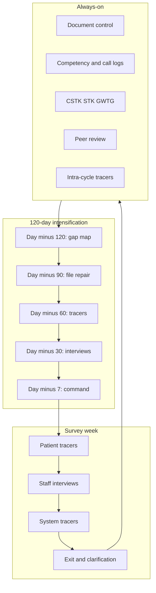

# Certification Readiness and Survey

## Opening

Survey week is not the quality program. It is a test of whether the quality program, the clinical pathways, and the personnel files exist when a stranger walks the unit. The Medical Director's job is to keep the CSC continuously survey-ready and to run a focused 120-day intensification before a window, not to construct a parallel hospital that exists only for tracers.

The Joint Commission advanced stroke programs are ASRH, PSC, TSC, and CSC. CSC is the most demanding. Disease-Specific Care certification has three components: standards, clinical practice guidelines, and performance measurement. The 2026 Stroke Certification Standards book (SCS26) is the current standards source. Performance measurement for the CSC is the CSTK set (Specifications Manual v2026B) plus the STK inpatient set. The April 2, 2025 Joint Commission announcement reduced the annual aSAH volume criterion to 10; confirm all other volume and eligibility numbers in the current E-App / CSC eligibility table rather than reciting historical figures.

This chapter covers tracer methodology, document control, staff interview prep that is not a script of convenient answers, competency files, on-call logs, peer-review evidence, measure submission, intra-cycle monitoring, what surveyors typically test in a CSC, and a 120-day readiness plan. Use Chapters 22–24 as the living system the surveyor is walking through.

## Why This Matters

A CSC survey tests capability, not hospitality. Surveyors follow a patient through EMS arrival, imaging, IVT or EVT, neurocritical care, hemorrhage pathways, and discharge. They ask the person at the bedside how to activate IR at 02:00, where nimodipine lives, who reverses anticoagulation in ICH, and how a 90-day mRS is obtained. If the only person who can answer is the stroke coordinator walking two steps ahead, the program has a readiness problem, not a communication problem.

Intra-cycle monitoring is how programs fail between certificates. Measures drift, on-call logs develop gaps, a neurointerventionalist leaves and the coverage matrix is not updated, research participation becomes a poster in a closet, and peer review becomes a lunch that produces no file. The certificate on the wall is a lagging indicator. The monthly evidence pack is the leading one.

Document control sounds clerical until a surveyor is handed two conflicting ICH reversal pathways, one of them dated 2019. Staff interviews sound soft until a night nurse describes a different code-stroke number than the policy. Competency files sound like human resources until a traveler who gave tenecteplase has no documented dose competency for 0.25 mg/kg, max 25 mg. These are operational controls with certification consequences.

Academic CSCs have extra exposure: fellows who rotate, multiple IR groups, a research enterprise, and a transfer network. Surveyors know this. They will test whether the pathway is the same for a 03:00 transfer as for a 10:00 direct arrival, and whether the research coordinator can describe screening without implying that a trial delayed EVT. Prepare for those questions with real operations, not with a weekend of laminated cards.

## Core Framework

Readiness has two clocks: always-on controls, and a 120-day intensification before an announced or expected window.

| Always-on control | What "ready" looks like | Typical survey test |
| --- | --- | --- |
| Standards alignment | SCS26 requirements mapped to an owner | Ask who owns IR availability |
| Clinical practice guidelines | Local pathways cite 2026 AIS, 2022 ICH, 2023 aSAH | Tracer on a real ICH or aSAH |
| Performance measurement | CSTK/STK submitted; GWTG current | Pull a measure and the source case |
| Document control | One active version of each pathway | Find a second version at the bedside |
| Competency and privileging | Files match who actually took call | Name last night's IR and NCC |
| On-call logs | Complete, retrievable, matching the board | "Show me last Saturday at 02:00" |
| Peer review | Cases, attendance, actions, loop closure | Last sICH and last delay |
| Research participation | Screening log, not a brochure | How a trial patient still gets EVT now |
| Intra-cycle | Quarterly self-tracer and measure watch | What changed since last survey |

### Tracer methodology

A tracer follows one patient (or one system) across locations and time. Prepare to run tracers the way surveyors run them.

**Individual patient tracer.** Start with a current or recent CSC-typical case: direct-arrival IVT, transfer EVT, ICH on an anticoagulant, aSAH, or a comfort-measures ischemic stroke that tests exclusions. Walk EMS record → door time → imaging → NIHSS time → bolus or puncture → NCC → unit → education and rehab assessment → 90-day plan. At each stop, the person who actually works there speaks. The coordinator does not translate.

**System tracer.** Follow a process rather than a patient: IR activation, massive-transfusion or reversal, imaging downtime, telestroke inbound, research screening, data abstraction to CSTK. System tracers expose on-call and document-control failures faster than patient tracers.

**Program-specific tracers surveyors typically run in a CSC.**

| Tracer | What they are testing | Evidence to have warm |
| --- | --- | --- |
| Hyperacute pathway | Parallel activation, 4.5-hour disabling stroke without waiting for advanced imaging selection, IVT+EVT without delay | Live pathway, last 10 DTN/DTP cases |
| IR availability | 24/7 neurointervention, call tree, backup, transfer-out rule if down | On-call logs, downtime SOP, actual last downtime |
| Neurocritical care | Dedicated neuro ICU capability, post-EVT and ICH/aSAH monitoring | Staffing model, competencies, sICH response |
| Hemorrhagic | ICH reversal (CSTK-04), severity score (CSTK-03), aSAH nimodipine (CSTK-06), volume criterion context | Pathway, cases, pharmacy readiness |
| Research | Participation is real; trials do not delay standard reperfusion | Screening log, last enrolled, fallback to standard care |
| Data and measures | Abstraction integrity, CSTK-01 sampling if used, 90-day mRS | Chapter 22 files, locked scorecard |
| Peer review | Complications and delays are reviewed with actions | Minutes, CSTK-05 reviews, loop closure |

Do not invent a "perfect" tracer patient. Use real records, including imperfect ones, and show the review that followed the imperfection. Surveyors read coaching.

### Document control

One active version. One owner. One retrieval path.

Minimum controlled set for a CSC:

- Code-stroke / hyperacute pathway (2026 AIS-aligned: tenecteplase 0.25 mg/kg max 25 mg or alteplase 0.9 mg/kg max 90 mg; no delay of EVT)
- EVT pathway, including transfer and late-window selection
- ICH pathway including reversal and blood-pressure targets per the 2022 ICH Guideline and 2024 ICH performance measures
- aSAH pathway including nimodipine per the 2023 aSAH Guideline
- Imaging protocols and downtime
- Telestroke and transfer acceptance
- Neuro ICU admission and post-reperfusion monitoring
- Stroke education and rehab assessment
- 90-day mRS SOP
- Timestamp hierarchy and abstraction SOP (Chapter 22)
- Peer-review SOP
- Research screening SOP
- Equity / interpreter SOP (Chapter 26)

Control rules:

- Version, date, owner, and next review date on page 1.
- Retired versions marked and removed from clinical areas.
- Bedside job aids match the controlled version; laminated orphans are a finding.
- Order sets and EHR smart-sets match the pathway; if they diverge, the EHR is the de facto (and wrong) document.
- A change log that a surveyor can read in five minutes.

The Medical Director or designee signs clinical pathways. Quality may manage the library. Quality may not own the clinical content.

### Staff interview prep — not scripting lies

Prep is orientation to how to answer, not a script of what to say.

Teach staff to:

- Answer the question that was asked.
- Speak to their own role and the pathway they use.
- Say "I would look it up here" and then look it up — policies should be findable.
- Escalate when they do not know: "I would call the stroke pager / IR / NCC attending."
- Describe the last real case they personally saw, not a mythical ideal case.
- Never guess a dose, a time target, or a measure definition.

Forbid:

- Coaching people to hide a known defect.
- A single "right" narrative that contradicts the chart.
- Silencing fellows, travelers, or night staff.
- Memorized speeches about Gold awards that do not match this month's book.

Hold interview practice as short simulations: "How do you activate IR at 02:00?" "Where is the ICH reversal pathway?" "What do you do if the CT is down?" "How is NIHSS timed if the patient is going straight to the suite?" Score findability, not poetry.

The Medical Director should be the worst person to interview if the goal is theater, and the best person if the goal is truth: know the gaps, know the mitigation, and do not oversell.

### Competency files

Surveyors will match names on the board to files. Build a matrix, not a pile.

| Role | Competencies that must be current | Typical failure |
| --- | --- | --- |
| ED and unit RNs | Code activation, NIHSS if they perform it, dysphagia screen, IVT monitoring, ICH recognition | Traveler with expired NIHSS |
| Pharmacists | Tenecteplase 0.25 mg/kg max 25 mg and alteplase 0.9 mg/kg max 90 mg; reversal agents | Weekend coverage without stroke competency |
| IR techs and nurses | Room setup, device cart, radiation, documentation of puncture and TICI support | Call team from another campus, different cart |
| Fellows / APPs | NIHSS, mRS, pathway navigation, consent, research vs standard care | July start without documented orientation |
| Attendings | Privileges match what they do (vascular neurology, NCC, ENLS-type content as locally required, endovascular) | Privilege list lags actual call |
| EMS / telestroke partners | Not hospital employees, but interface competencies and education logs | No file at all |

Cross-walk the call schedule to privileging. If a name took IR call, the file must show current privilege and any locally required volume or proctoring. Do not invent numeric volume requirements here; confirm the current E-App / CSC eligibility table and medical-staff policy. Historical figures such as 25 IV thrombolysis cases appear in older public summaries — treat them as historical and confirm current.

### On-call logs

Logs must prove 24/7 vascular neurology, neurosurgery, neurointervention, neuroradiology, and dedicated neuro ICU coverage as the program claims them. Operational CSC expectations still include those capabilities, peer review, research participation, advanced imaging, and performance-measure reporting.

A usable log:

- Who was on, for which role, for which interval
- Backup and escalation
- Actual response for activations (not only the roster)
- Downtime or inability-to-cover events and what was done (hold, backup campus, transfer)
- Retention long enough for survey and for RCA

Reconcile the log monthly against the published schedule and against activation records. A beautiful roster that does not match who came in is a finding.

### Peer-review evidence

Peer review is a file, not a vibe. For certification it must show that the program reviews complications, delays, and selected mortalities, and that actions close.

Minimum packet for the last cycle:

- Written SOP and committee membership
- List of cases reviewed (CSTK-05, major CSTK-11/12 delays, untreated eligible, hemorrhagic deaths as locally defined, random audits)
- Attendance
- Confidentiality practice consistent with medical-staff bylaws
- Actions, owners, due dates, and loop closure
- How a review feeds PDSA or RCA (Chapter 24) without becoming a second unstructured meeting

Do not produce a peer-review binder that contains only complimentary letters. Surveyors look for the sICH.

### Measure submission and intra-cycle monitoring

Submission is a calendar. Intra-cycle is a habit.

- Know the CSTK and STK submission windows and who clicks send.
- Reconcile GWTG, CSTK, and STK before submission (Chapter 22–23).
- If CSTK-01 is sampled, keep the sample-draw method cited to the current manual in the survey file.
- After submission, watch for vendor or vendor-adjacent resubmission requests and treat them as definition-control events.
- Quarterly, run one full patient tracer and one system tracer with written findings, even in non-survey years.
- After any major change — new IVT agent, new IR group, EHR go-live, loss of a coverage line — run an unscheduled tracer within 30 days.
- Confirm aSAH volume against the current criterion (annual criterion reduced to 10 as of the April 2, 2025 announcement) and confirm all other eligibility volumes in the active manual.

Intra-cycle findings go on the same decision log as the monthly scorecard. A tracer that produces no action is rehearsal without learning.

### What surveyors typically test in a CSC

Expect depth on five clinical systems and two support systems.

**Pathways.** Is the written 2026-aligned pathway the one people use? Does a disabling 4.5-hour stroke get treated without a perfusion delay? Do IVT-eligible EVT candidates get both without waiting?

**IR availability.** Can staff activate the team at night? Is there a backup? What happened the last time the suite was down? Do transfer EVT clocks exist?

**Neurocritical care.** Who owns post-EVT monitoring and ICH/aSAH? Can a nurse describe sICH recognition and escalation? Is the ICU actually a neuro ICU in staffing and competency, not only in name?

**Hemorrhagic programs.** Reversal agents present and timed (CSTK-04). Severity scores done (CSTK-03). Nimodipine given (CSTK-06). aSAH coverage and volume narrative consistent with the current criterion. Neurosurgery and IR roles clear.

**Research.** Is participation operational (screening, coordinator, IRB path, 24/7 awareness)? Does anyone believe a trial delays standard reperfusion? StrokeNet-ready programs should be able to describe screening without implying that research replaces CSTK obligations.

**Data and people.** Timestamp hierarchy, abstractor process, 90-day mRS, competency files, call logs, peer review.

Prepare those seven as if they were the only seven. Most other questions are branches of them.

### 120-day readiness plan

Use this as an intensification, not as the first time the program looks at files.

| When | Medical Director actions | Product |
| --- | --- | --- |
| Day −120 | Commission a gap map against SCS26, CSTK v2026B / current STK, and the E-App eligibility table. Confirm aSAH volume criterion context. Freeze new nonessential pathway edits. | Written gap list with owners |
| Day −90 | Repair files: privileges, competencies, call-log holes, document orphans, measure resubmissions. Fund any short-term abstractor or coordinator surge. | Closed-loop file list |
| Day −60 | Run two patient tracers and two system tracers (IR activation, hemorrhagic reversal). Include nights. | Tracer reports and fixes |
| Day −30 | Interview practice for ED, IR, ICU, unit, pharmacy, fellows, operators. No scripts of answers. Test findability of policies. | Interview notes; remaining coaching |
| Day −14 | Command structure for survey week; escort rules; how to surface a real-time defect to the Medical Director. | One-page command card |
| Day −7 | Quiet confirmation: on-call this week, devices, reversal agents, nimodipine, downtime plans, 90-day worklist not abandoned. | Green/yellow board |
| Survey week | Tell the truth. Produce the real record. Clarify factual errors at daily briefings. Do not argue opinions. | Issue log |
| Day +14 | Debrief, map RFIs or findings to owners, restart always-on cadence. | 90-day closeout plan |

Do not paint units, reprint binders, or invent committees at day −14. If it is not true at day −120, it will not be true in the tracer.

!!! tip "Key Actions"
    Map SCS26, CSTK/STK, and the current E-App eligibility table to named owners this quarter, whether or not a survey window is open. Destroy orphan pathways. Reconcile last month's call log to who actually arrived. Put the last CSTK-05 review in a file that a surveyor can be handed. Schedule one night tracer. Brief staff on how to answer and how to look things up — not on what the "correct story" is.

!!! abstract "Metrics Targets"
    Certification floors are the DSC triad and the CSTK/STK specifications, not GWTG metal. aSAH annual volume criterion: 10 (April 2, 2025 announcement); confirm other volumes in the current eligibility table. Intra-cycle: at least one patient tracer and one system tracer per quarter. Document control: zero unversioned bedside pathways at random audit. Call-log completeness: 100% of days with named coverage for each required service. Peer review: every CSTK-05 case and every locally defined major delay has a closed or actively open review. Competency: 100% of staff who administer IVT have a current agent-and-dose competency. Interview practice: findability of IR activation and ICH reversal by night staff.

!!! warning "Common Pitfalls"
    Building a survey-only binder that staff have never seen. Scripting answers that contradict the chart. Letting the coordinator speak for every bedside nurse. Two ICH pathways. A call schedule that is a wish. Peer review without the sICH. Claiming research excellence with no screening log. Reciting historical IVT or EVT volume numbers that are not in the current E-App. Ignoring intra-cycle for two years and then sprinting 30 days. Arguing with a surveyor about a missing timestamp instead of producing the hierarchy SOP. Forgetting telestroke and transfer cases in tracers.

!!! success "Implementation Tips"
    Use real imperfect cases as practice tracers and show the review that followed. Make night and weekend staff the primary interview pool. Keep a single "survey shelf" that is just the always-on files, not a new product. Assign an Associate Medical Director as survey operations lead so the Medical Director can listen. When a surveyor finds something true, thank them and put it on the issue log the same day. After survey, kill the intensification meetings and return to the quarterly tracer cadence or the program will only be ready in survey years.

## How to Do the Work

### Daily / weekly

- In survey years and in ordinary years, the daily huddle is still the safety huddle (Chapter 24), not a survey briefing.
- Weekly, glance at tomorrow's call names against known privilege or competency expirations.
- When a pathway is edited, remove the old copy from every clinical area the same week.
- If a traveler or rotating fellow starts, check the competency matrix before the first code, not after.

During the 120-day window, add a weekly 20-minute readiness stand-up on the gap list only. Do not relitigate the scorecard there.

### Monthly / quarterly

- Monthly: call-log reconciliation; document-control audit of one pathway; peer-review loop-closure review; measure-submission status.
- Quarterly: one patient tracer, one system tracer, written findings, owners.
- Quarterly: confirm research screening is alive and that no trial is delaying standard IVT/EVT.
- Quarterly: confirm aSAH and other eligibility volumes against the current table.
- After any leadership change in IR, NCC, or neurosurgery, repeat the coverage matrix immediately.

### Annual / multi-year

- Re-walk SCS26 and the current CSTK/STK manuals when they update. Version the gap map.
- Recredential and reprivilege on the medical-staff cycle; do not wait for survey.
- Budget coordinator and abstractor surge for the 120-day window without stealing all concurrent abstraction (Chapter 22).
- Keep a multi-year finding log so the same document-control miss does not recur.
- Treat a new campus, a new EHR, or a merger as a de facto mid-cycle survey and run the 120-day plan even if Joint Commission is not due.

## Ready-to-Adapt Tools

### Tool A — 120-day readiness Gantt (skeleton)

| Workstream | −120 | −90 | −60 | −30 | −7 | Survey | +14 |
| --- | --- | --- | --- | --- | --- | --- | --- |
| SCS26 / E-App gap map | R | C | | | | | |
| Document control sweep | R | R | C | C | C | | |
| Competency / privilege matrix | R | R | C | C | | | |
| On-call log repair | R | R | C | | C | | |
| Measure reconciliation | C | R | R | C | | | |
| Peer-review packet | C | R | C | C | | | |
| Tracers (include night) | | | R | R | | | |
| Interview practice | | | | R | C | | |
| Command card | | | | R | C | R | |
| Finding closeout | | | | | | C | R |

R = run, C = check.

### Tool B — Tracer worksheet

Case / FIN · Type (IVT, EVT transfer, ICH, aSAH, comfort measures) · Stops walked · Person who spoke at each stop · Pathway version seen · Clock sources seen · Measure impact (CSTK/STK/GWTG) · Defect found · Immediate fix · Owner · Follow-up date.

Run it in the physical path. Sit in the chair the nurse sits in when they look up the policy.

### Tool C — Interview practice prompts (use as prompts, not as an answer key)

- How do you activate a code stroke at 02:00?
- How do you activate IR? Who is backup if they do not answer?
- What agent and dose do we use for IVT, and where do you look it up?
- A patient has a disabling deficit at 3 hours and a low NIHSS. What does the pathway say?
- This patient is getting TNK and going to EVT. Do we wait for the infusion?
- Where is the ICH reversal pathway and the first agent?
- When is nimodipine started for aSAH?
- How is NIHSS timed if we go straight to the suite?
- How would you find last Saturday's IR on-call name?
- What do you do if CT is down?
- How does a research screen work, and what is never delayed for a trial?
- How does this patient get a 90-day mRS?

Stop the session if answers become recitations. Reset to "show me."

### Tool D — Competency–call crosswalk

Date · Role · Name on call · Privilege current Y/N · Stroke-specific competency current Y/N · Gap · Action · Owner.

Run monthly. Escalate any "N" before the shift, not after.

### Tool E — Document control front sheet

Document title · Version · Effective date · Owner (Medical Director or clinical lead) · Next review · Supersedes · EHR order-set version that must match · Bedside job-aid version that must match · Retirement location for old copies.

### Tool F — Survey-week command card

- Medical Director: clinical truth, clarification of factual errors, no argument about opinions.
- Associate / operations lead: escorts, room control, retrieval of files.
- Program director: measure and document library.
- Scribe: issue log in real time.
- Rule: bedside staff answer first.
- Rule: if you do not know, look it up or escalate.
- Rule: no new policies during survey week.
- End-of-day 15 minutes: issues, tomorrow's likely tracers, staff support.

### Tool G — Intra-cycle quarterly pack (table of contents)

1. Locked scorecard (Chapter 23) with floors labeled
2. One patient tracer, one system tracer
3. Call-log exception list
4. Document-control audit
5. Peer-review loop closure
6. Measure submission confirmation
7. Research screening attestation
8. Volume / eligibility confirmation against current E-App table, including aSAH criterion context
9. Open PDSA / RCA list (Chapter 24)
10. Equity flags (Chapter 26)

## Integration With Other Pillars

Chapters 22–24 are the substance of performance measurement and safety. This chapter is how they become visible to a stranger. Chapter 26 will be tested when a surveyor asks about interpreters or notices that every tracer patient speaks English.

Leadership chapters define who may sign a pathway and who may speak for the program. Clinical chapters are the tracers. Education chapters produce the fellows who will be interviewed in July. Research chapters must supply a real screening operation. Strategy chapters that pursue additional sites or volume without rerunning coverage and document control will manufacture the next survey finding.

Playbooks should reuse the tracer worksheet and the 120-day Gantt rather than inventing a second readiness process.

## Sources

- The Joint Commission. 2026 Stroke Certification Standards (SCS26). DSC framework: standards, clinical practice guidelines, performance measurement. Advanced programs: ASRH, PSC, TSC, CSC.
- April 2, 2025 Joint Commission announcement (with AHA/ASA) reducing the annual aSAH volume criterion to 10; official manual update January 2026. Confirm all other volume requirements in the current E-App / CSC eligibility table. Historical figures (for example, 25 IV thrombolysis cases in older summaries) are historical — confirm current.
- Specifications Manual, CSTK v2026B (posted 02/06/2026; 3Q–4Q 2026 discharges) and STK inpatient set; CSTK-07 not current.
- 2026 AIS Guideline. *Stroke*. 2026;57(8):e316–e436. DOI 10.1161/STR.0000000000000513.
- 2022 ICH Guideline. DOI 10.1161/STR.0000000000000407. 2024 AHA/ASA ICH performance measures. 2023 aSAH Guideline. *Stroke*. 2023;54:e314–e370.
- Alberts et al., 2005 CSC consensus, *Stroke* — foundational capability expectations (24/7 vascular neurology, neurosurgery, neurointervention, neuroradiology; dedicated neuro ICU; advanced imaging; peer review; research; measures). Not a substitute for SCS26.
- GWTG-Stroke public recognition criteria (Chapter 23) as hospital-facing awards, not as TJC CSC standards.
