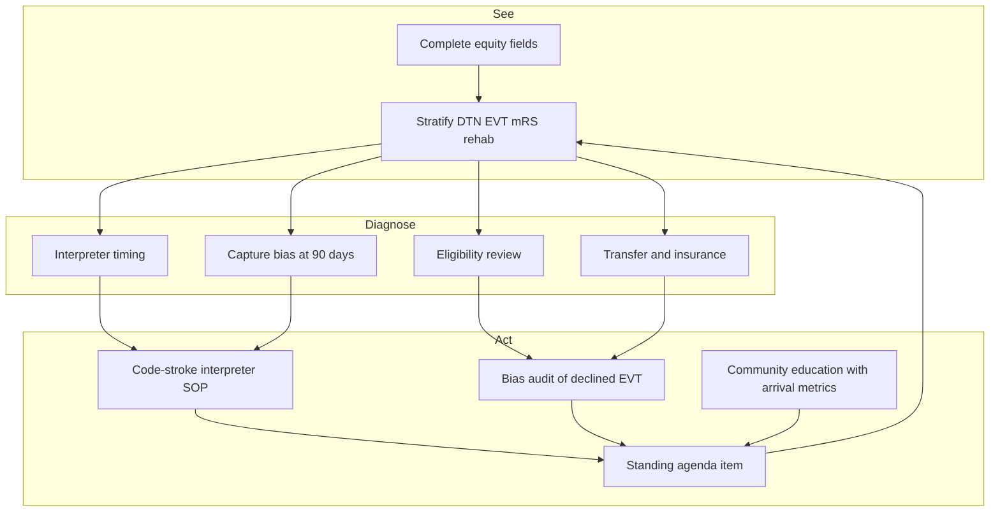

# Equity and Disparities Reduction

## Opening

A CSC that posts Elite Plus DTN and Advanced Therapy door-to-device while one language group waits twice as long for a needle has not met its mission. Equity is not a community-affairs appendix. It is a property of the same clocks, the same eligibility decisions, the same 90-day calls, and the same rehab dispositions that Chapters 22–25 already measure. If those measures are not stratified, the program is averaging away harm.

The Medical Director owns stratification, interpreter access in code stroke, review of eligibility bias, community education that changes arrival behavior rather than decorating a lobby, and a standing equity item on the governance agenda. AHA and ASA disparity statements at the field level are consistent on the direction: race, ethnicity, sex, language, insurance, and geography shape stroke incidence, treatment, and outcome. This chapter does not re-litigate that literature. It tells the Medical Director how to see local gaps and close them with the same rigor used on CSTK-11.

Do not outsource this work to a single "diversity champion" without data rights, without interpreter authority in the first 15 minutes of a code, and without a seat at the scorecard. Performative education — a yearly lecture, a poster in the wrong language, a health-fair booth with no EMS partnership — will not move DTN, EVT access, or 90-day mRS.

## Why This Matters

Time-based reperfusion is the most inequity-sensitive process in the hospital. A missing interpreter, a dismissed "low NIHSS" in a patient whose disability is language-masked, a transfer declined because of insurance, or a 90-day call placed only in English will move GWTG, STK-4, CSTK-01, CSTK-02/10, CSTK-09/11/12, and rehab disposition without ever appearing on an unstratified tile. The 2026 AIS Guideline's instruction to treat eligible disabling deficits within 4.5 hours regardless of NIHSS is, among other things, an equity instruction: NIHSS under-calls disability when language, education, or hemispheric dominance hide the deficit.

EVT access is the second sensitive process. Eligibility for late-window and large-core thrombectomy (DAWN, DEFUSE 3, SELECT2, ANGEL-ASPECT, RESCUE-Japan LIMIT) expanded who can benefit. Expansion increases the room for discretionary "not a candidate" decisions. Those decisions cluster by transfer site, insurance, age-sex stereotypes, and how a night fellow presents the scan. Unreviewed discretion is a disparity engine.

90-day mRS and rehab disposition are where outcome inequity becomes visible — or is hidden. CSTK-10 among a captured, English-speaking, privately insured clinic population is not the CSC's outcome. It is a convenience sample. Chapter 23 already forbids reading CSTK-10 without CSTK-02. This chapter forbids reading either without strata.

Certification and recognition do not replace this work. SCS26 and GWTG will not hand the Medical Director a finished equity dashboard. Build it from the Chapter 22 spine. Put it on the same monthly book as Elite Plus. If it is a separate annual report to a community board, it will be ignored when IR staffing is discussed.

## Core Framework

Stratify first. Then fix the mechanism. Then re-measure. Do not start with a campaign.

| Stratum | Why it moves stroke metrics | Minimum fields (Chapter 22) |
| --- | --- | --- |
| Race and ethnicity | Incidence, delay to recognition, treatment rates, outcome | Discrete, patient-identified when possible |
| Preferred language | Consent, NIHSS validity, education (STK-8), 90-day capture | Language + interpreter used (yes/no/method/time) |
| Sex | Presentation, eligibility assumptions, rehab referral | Sex as documented; do not collapse atypical values silently |
| Insurance | Transfer acceptance, post-acute placement, clinic access | Primary payer category |
| Rurality / geography | EMS time, transfer delay, CSTK-11 | ZIP or first-hospital ID; rural/urban flag |
| Arrival mode | Prenotification, DTN, bypass | EMS / private / transfer / in-house / MSU / unknown |

Core metrics to stratify, every month or on a rolling 6- or 12-month window when monthly n is small:

| Metric | Inequity pattern to look for | Linked measures |
| --- | --- | --- |
| DTN ≤60 / ≤45 / ≤30 | Language, arrival mode, night × language | Target: Stroke; STK-4; GWTG-1 |
| EVT offered / performed among eligibles | Insurance, transfer site, sex, race/ethnicity | CSTK-09/11/12; Advanced Therapy |
| NIHSS completed before recanalization | Language, arrival mode | CSTK-01 |
| 90-day mRS captured | Language, payer, disposition, rurality | CSTK-02 |
| 90-day favorable mRS | All strata, only after capture is balanced | CSTK-10 |
| Rehab assessment and disposition | Payer, language, rurality, sex | STK-10 |
| sICH / CSTK-05 | Do not under-ascertain in any stratum | CSTK-05 |
| Interpreter in time for decision | Language ≠ English | Local process measure |

### How to stratify without lying with small numbers

Academic CSCs still have small cells: a month may contain four Spanish-preferring EVT candidates. Rules:

- Always show numerator and denominator, never a lone percentage on n<10.
- Use rolling 6- or 12-month windows for rare strata; keep the monthly unstratified scorecard as is.
- Pre-specify the strata and the window so a bad month does not cause a fishing expedition.
- Suppress or aggregate cells that would identify a patient, per hospital policy.
- Do not "adjust away" a disparity in the operational meeting. Risk adjustment belongs in research. Operations need the crude gap and the mechanism.
- Compare within arrival mode (EMS vs transfer vs walk-in) before declaring a race effect that is actually a transfer-clock effect.

The Medical Director's question is not "is this statistically significant?" It is "is this gap large enough and stable enough that a patient in this group would refuse our average?"

### Interpreter access in code stroke

Language access is a time intervention. If the interpreter arrives after the bolus or after the puncture decision, it was not access.

Build a code-stroke interpreter standard:

1. Preferred language is a discrete field at first contact, including EMS prenotification when known.
2. Activation of professional interpretation is parallel to CT, not sequential after the attending arrives.
3. Method hierarchy: qualified in-person or video first for examination and consent; telephone if video fails; bilingual staff only if they are qualified interpreters, not "the tech who speaks some."
4. Time stamps: interpreter requested, interpreter present, first interpreted exchange. These are quality data, not amenities.
5. NIHSS and consent conducted with the interpreter; document that the NIHSS was interpreted.
6. Family interpretation is not the standard for eligibility or consent. Emergency exception pathways remain available and must be written.
7. After hours is the real test. Video carts in ED, CT, and IR. A backup number that night staff will actually dial.
8. STK-8 education and 90-day mRS use the same language field. A program that interprets the bolus and then mails English education has not finished.

Track a local process measure: percent of non-English-preferring code strokes with professional interpretation in place before the treatment decision. Put misses in the Chapter 24 taxonomy under equity/access.

### Eligibility bias

Discretion hides in phrases: "too good," "too bad," "family not here," "unclear onset," "not a great candidate," "they would not want this," "transfer later if they worsen." Some of those phrases are clinical. Some are bias. The only defense is structured review.

**IVT eligibility.** The 2026 AIS Guideline: treat eligible disabling deficits within 4.5 hours regardless of NIHSS; do not delay for advanced imaging selection in that window. Audit "NIHSS too low" non-treatments for documented disabling function (hand, gait, vision, language, dominant vs non-dominant). Language barriers can fake a low NIHSS or fake a high one. Sex and age stereotypes cluster in "too good" and "too frail."

**EVT eligibility.** Audit every large-vessel occlusion that did not go to puncture. Use a structured reason list: no LVO, completed infarct beyond local protocol, patient/proxy decline, medical instability, suite downtime, "judgment." Review 100% of "judgment" and "family not here" cases in peer review. Stratify declines by race/ethnicity, language, sex, insurance, and referring site. Late-window and large-core protocols should be written so a night fellow is not inventing a narrower protocol for a Medicaid transfer.

**Transfer acceptance.** Track turndowns and delays by payer and by site. If the acceptance desk asks for insurance before it asks for last-known-well, fix the script. CSC capability is a regional public function; payer sorting at the door is an equity defect and an EMS-relationship defect.

**Comfort measures.** Early comfort-measures designations change CSTK exclusions. Review early comfort measures stratified by language, race/ethnicity, and whether an interpreter was present for the goals discussion. This is not an instruction to withhold comfort care. It is an instruction not to deliver an inequitable version of it.

### Community education that is not performative

STK-8 is inpatient education. Community education is how patients arrive by EMS, recognize stroke, and reach a CSC in window. Performative programs optimize brochures. Operational programs optimize 9-1-1 use, prenotification, and time-to-door in named communities.

Design rules:

- Pick one or two communities defined by language, geography, or EMS catchment, not "the public."
- Pair education with EMS and primary-care or faith/community sites that already have trust.
- Teach stroke signs in the languages people speak, delivered by people they will listen to, at the hours they are present.
- Measure what should change: EMS arrival share, prenotification rate, onset-to-door, and DTN/EVT access in that community — not attendance at a fair.
- Run the effort long enough to see a rolling 12-month change. A single May event is not a program.
- Do not use survivors only as decoration. Pay and prepare community educators. Put them in the planning meeting.
- Align messages with current treatment: IVT in 4.5 hours for disabling stroke, EVT windows that are protocol-specific, ICH emergency, need for EMS not a private car when possible.
- Mobile stroke units, where they exist (Chapter 20), should have an explicit equity deployment logic, not only a downtown marketing loop.

If the hospital needs a ribbon-cutting, schedule it after the first stratified report shows movement.

### AHA disparity statements at high level

AHA/ASA guideline and quality documents have repeatedly identified disparities in stroke awareness, EMS use, IVT and EVT treatment rates, rehabilitation access, and outcomes by race, ethnicity, sex, and socioeconomic status. The 2021 secondary-prevention guideline remains the major secondary-prevention reference unless a later AHA update is cited; secondary prevention and clinic access are where insurance and language disparities continue after the admission. The 2026 AIS, 2022 ICH, and 2023 aSAH guidelines are clinical sources; they do not replace a local stratified dashboard.

Use national statements to justify the work and to keep leadership from treating equity as optional. Do not use them as a substitute for local numerators. A national disparity that is not visible in the CSC's own rolling 12-month file is either absent, hidden by missing fields, or hidden by capture bias. Find out which.

GWTG quality measures and Plus awards may include elements that touch smoking, diabetes (Target: Type 2 Diabetes composite ≥80% for 12 months), and other risk factors that are themselves unequally distributed. Stratify those too if the hospital pursues them, without letting them crowd EVT access off the equity page.

### Equity as a standing agenda item

If equity appears once a year, it is ceremonial. Put it on the monthly scorecard meeting (Chapter 23) as a short, structured item and on the quarterly governance agenda as a decision item.

**Monthly (10 minutes).** One page: DTN and EVT access by language and by arrival mode; interpreter-before-decision rate; 90-day capture by language and payer; any "judgment" EVT decline this month. No slide tour of national statistics.

**Quarterly (20–30 minutes).** Rolling 6- or 12-month strata for race/ethnicity, sex, insurance, rurality. Eligibility-bias audit results. Community-education process and outcome metrics. Resource asks (video carts, interpreter FTE at night, clinic slots, navigator). One adopt/adapt/retire decision on an equity PDSA.

**Never.** A standing item that is only a demographic table with no mechanism and no owner.

Assign a named owner (often the Associate Medical Director plus the program director) who can change the interpreter SOP and can bring a transfer-acceptance script to the CMO. A committee that can only "raise awareness" is not an owner.

!!! tip "Key Actions"
    Make race/ethnicity, language, interpreter used and time, sex, insurance, rurality, and arrival mode mandatory discrete fields this quarter. Add an interpreter-before-decision process measure to the operational list. Review 100% of EVT "judgment" declines and early comfort-measures cases with language or missing-interpreter flags. Put a 10-minute equity page on the monthly scorecard. Pick one community and one arrival metric for non-performative education. Stop reading CSTK-10 without capture rates by language and payer.

!!! abstract "Metrics Targets"
    External floors remain Chapter 23 (GWTG 85% achievement; Honor Roll / Elite / Elite Plus DTN cuts; Advanced Therapy 50% door-to-device; CSTK-11 120 min; CSTK-12 60 min). Equity targets are internal and labeled as such: complete equity-field capture near 100%; professional interpretation in place before treatment decision for non-English-preferring codes, with a locally set high target; 90-day contact attempts in the preferred language on 100% of CSTK-02-eligible patients; no unreviewed EVT "judgment" decline. Do not set a CSTK-05 "improvement" target by stratum. Report stratified DTN and EVT access on rolling windows when monthly n is small.

!!! warning "Common Pitfalls"
    Unstratified averages used as proof of fairness. Percentages on n=3. Adjusting a disparity away in the operations meeting. Family as the default interpreter. Interpreter after the bolus. Eligibility folklore that contradicts "disabling deficit regardless of NIHSS." Insurance questions before last-known-well on transfer calls. 90-day calls only in English, then declaring a racial outcome gap. Community fairs without EMS or arrival metrics. A yearly equity lecture in place of a standing agenda item. Using comfort-measures exclusions as an unreviewed off-ramp. Night video-interpreter carts that live in a locked office.

!!! success "Implementation Tips"
    Fix language access first; it is the fastest mechanism with a clock. Pair every stratified gap with a defect code and a method from Chapter 24. Invite EMS, interpreter services, and a post-acute partner to the quarterly equity item. Have a night nurse, not the coordinator, demonstrate the video-interpreter path during a tracer (Chapter 25). When a community effort starts, pre-register the arrival metrics so no one can later substitute headcount. Publish the equity page in the same packet as Elite Plus so leadership cannot praise one and skip the other.

## How to Do the Work

### Daily / weekly

- On the operational list, flag codes where preferred language is not English and show interpreter request and presence times.
- Same-week apparent-cause for any treatment decision made without a professional interpreter when one was needed.
- Same-week review of any EVT decline coded "judgment," "family not here," or "too good / too bad" without a protocol citation.
- 90-day worklist: outbound attempts in the preferred language, with interpreter scheduled, not as an afterthought.
- Transfer desk: script starts with last-known-well, deficit, and imaging, not payer.

### Monthly / quarterly

- Monthly equity page on the scorecard (language, arrival mode, interpreter measure, capture).
- Monthly Pareto of equity/access defect codes (Chapter 24).
- Quarterly rolling strata for race/ethnicity, sex, insurance, rurality on DTN, EVT access, CSTK-02/10, STK-10 / disposition.
- Quarterly eligibility-bias audit: sample or 100% of non-treated LVO and "low NIHSS / disabling" IVT misses.
- Quarterly community-education review against the pre-registered arrival metrics.
- Quarterly resource decision: night interpreter, navigator FTE, clinic slots, EMS partnership.

### Annual / multi-year

- Reassess whether fields are complete enough to trust multi-year trends.
- Rebuild community priorities from the last 12 months of arrival and outcome strata, not from last year's fair.
- Align secondary-prevention clinic access (2021 secondary-prevention guideline as the major reference unless a later AHA update is cited) with the same strata: who never reaches clinic, who never starts anticoagulation for AF (STK-3 / GWTG-5).
- Include equity in fellowship and interprofessional education so July does not reset bias-prone folklore.
- When adding a site, an MSU, or a telestroke spoke, write the equity effect into the go-live, including language access at the new front door.
- Report to hospital governance as operations: gaps, mechanisms, standard-work changes — not as a values statement.

## Ready-to-Adapt Tools

### Tool A — Monthly equity one-pager

| Row | Overall | Language ≠ English | EMS | Transfer | Payer A / B | Rolling 12-mo race/ethnicity |
| --- | --- | --- | --- | --- | --- | --- |
| n | | | | | | |
| DTN ≤60 / ≤45 / ≤30 | | | | | | |
| Interpreter before decision | — | | | | | |
| EVT among LVO eligibles | | | | | | |
| CSTK-11 / 12 | | | | | | |
| CSTK-02 capture | | | | | | |
| CSTK-10 among captured | | | | | | |
| STK-10 / home vs facility | | | | | | |

Blank a cell rather than print a percent on a tiny n. Footnote the window.

### Tool B — Code-stroke interpreter SOP skeleton

**Aim.** Professional interpretation in place before IVT/EVT/ICH decision for patients with a preferred language other than English.

**Activation.** Parallel to code stroke when language is known; immediately when discovered.

**Hierarchy.** Qualified video or in-person → telephone → qualified bilingual staff. Family is not the standard.

**Documentation.** Language, method, request time, present time, interpreter ID, NIHSS interpreted Y/N.

**Locations.** ED, CT, IR, ICU — devices not locked away at night.

**Failure.** Defect code; same-week review.

**Downstream.** Same language field drives STK-8 and CSTK-02 contacts.

### Tool C — EVT / IVT decline audit form

- Case, arrival mode, language, interpreter present before decision Y/N
- Race/ethnicity, sex, payer, referring site
- NIHSS, documented disabling function, LKW, imaging
- Protocol-eligible Y/N (cite 2026 AIS window rules and local EVT protocol)
- Reason code: no target / completed infarct / decline by patient or proxy / instability / downtime / judgment
- If judgment or proxy decline: who discussed, in what language, what was offered
- Peer-review outcome: appropriate / biased or incomplete / system defect
- Action

### Tool D — Transfer-acceptance script (opening)

1. Identify CSC stroke desk and record time.
2. Last known well / discovery time.
3. Deficit and whether disabling.
4. Imaging done and whether LVO suspected.
5. Airway, BP, anticoagulants.
6. Accept / route.
7. Payer and bed status after the clinical accept, per hospital policy, never as the first filter.

### Tool E — Non-performative community-education charter

- Community defined by [language / ZIP / EMS agency]
- Partner organizations
- Message (current IVT/EVT/ICH facts; call 9-1-1)
- Duration (minimum 12 months)
- Process metrics (events are not enough: EMS trainings, repeat contacts)
- Outcome metrics registered in advance: EMS share, prenotification, onset-to-door, DTN, EVT access in that community
- Owner and budget
- Stop rule if only attendance is being measured

### Tool F — Standing agenda item (monthly 10 min / quarterly 30 min)

**Monthly.** Interpreter measure. Language-stratified DTN. This month's judgment declines. 90-day capture by language/payer. One owner update.

**Quarterly.** Rolling strata table. Audit results. Community metrics. Resource decision. PDSA adopt/adapt/retire. What will change in standard work.

### Tool G — Equity RACI

| Decision | Medical Director | Associate MD | Program director | Interpreter services | EMS liaison | Transfer center |
| --- | --- | --- | --- | --- | --- | --- |
| Stratification definitions | A | R | C | I | I | I |
| Interpreter SOP | A | C | R | R | C | I |
| EVT decline audit | A | R | C | I | I | C |
| Transfer script | A | C | C | I | C | R |
| Community charter | A | C | R | C | R | I |
| Agenda time protected | A | R | C | I | I | I |

## Integration With Other Pillars

Chapter 22 must produce complete equity fields or this chapter is rhetoric. Chapter 23 must print the strata beside Elite Plus. Chapter 24 must accept equity/access as a defect family and allow PDSAs that target interpreter time rather than generic "education." Chapter 25 surveyors will ask about interpretation and will notice a binder that only contains English pathways.

Clinical chapters (EMS, hyperacute, EVT, ICH/aSAH, telestroke, MSU, rehab, clinic) are where disparities are created or prevented. Education chapters must teach interpreted NIHSS and decline-audit habits to fellows. Research chapters must not recruit only the patients who are easy to consent in English and then call the sample the CSC population. Leadership and culture chapters determine whether a night nurse can stop a consent until the interpreter is present. Strategy and network chapters determine whether new spokes inherit the interpreter SOP or inherit the disparity.

## Sources

- 2026 Guideline for the Early Management of Patients With Acute Ischemic Stroke. *Stroke*. 2026;57(8):e316–e436. DOI 10.1161/STR.0000000000000513. Treat eligible disabling deficits within 4.5 h regardless of NIHSS; do not delay EVT; IVT agent/dose as specified.
- 2021 AHA/ASA Guideline for the Prevention of Stroke in Patients With Stroke and Transient Ischemic Attack — major secondary-prevention reference unless a later AHA update is cited.
- 2022 ICH Guideline. DOI 10.1161/STR.0000000000000407. 2023 aSAH Guideline. *Stroke*. 2023;54:e314–e370. 2024 AHA/ASA ICH performance measures.
- AHA/ASA public statements and scientific writing on stroke disparities (awareness, EMS use, IVT/EVT treatment, rehabilitation, outcomes) — use at high level to justify local measurement; do not substitute for local numerators.
- CSTK v2026B (CSTK-01, 02, 05, 09, 10, 11, 12) and STK-4, STK-8, STK-10 as the measures most sensitive to language, eligibility, and disposition inequity. CSTK-07 not current.
- GWTG-Stroke achievement and Target: Stroke public cuts (Chapter 23); Target: Type 2 Diabetes composite ≥80% for 12 months when that track is pursued.
- Landmark EVT trials (HERMES 2016; DAWN; DEFUSE 3; SELECT2; ANGEL-ASPECT; RESCUE-Japan LIMIT) as context for expanded eligibility and therefore expanded discretion.
- The Joint Commission 2026 Stroke Certification Standards (SCS26) and DSC performance-measurement requirement — equity work supports, and is not replaced by, certification.
