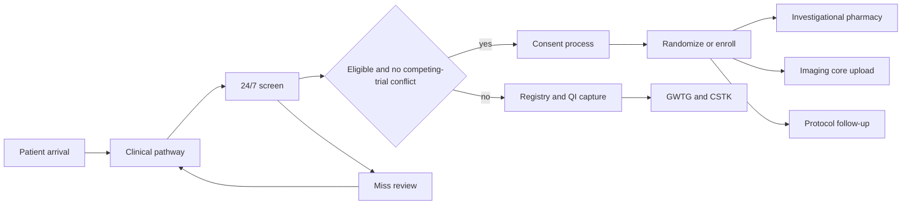

# Clinical Trials, Registries, and Research Operations

## Opening

An academic Comprehensive Stroke Center that cannot randomize a patient at 02:00 is not a complete CSC. Joint Commission CSC standards expect participation in patient-centered clinical research. Registry-only activity, laboratory-only work, or a single device trial does not meet that expectation — confirm the current language in the active DSC manual, which has already stated that audit-registry participation and humanitarian-device research alone are not sufficient. Research is therefore an eligibility system, a regional service, and an academic identity.

Treat 24/7 screening as a clinical pathway. The eligible patient arrives on the same clock as the thrombolysis candidate. If screening depends on a coordinator who works weekdays, the trial portfolio is a brochure. Build coordinator FTE, pharmacy and investigational-drug capability, imaging workflows, and a competing-trials rule the same way the CSC built door-to-needle: named owners, time stamps, and a huddle that notices misses.

NIH StrokeNet is strategic infrastructure, not "a trial we happen to be in." Other networks matter at a generic level — recovery, prevention, device, and industry alliances — but StrokeNet is the national academic backbone for multicenter stroke trials. GWTG-Stroke is both a quality system and a research substrate. Keep those uses distinct, consented, and contractual. Enrollment must be equitable, or the CSC will generate evidence that does not apply to the people it treats.

## Why This Matters

Certification, academic standing, and patient access converge here. A CSC surveyor can ask which patient-centered studies are open, who screens at night, and how consent is obtained from a patient with aphasia. A department chair can ask why the center enrolls in everyone else's trial and leads none. A family can ask why a neighbor received a trial agent last month and their parent was never approached.

Operations are the constraint. Acute stroke trials fail locally from missed screens, late pharmacy, unreadable imaging uploads, and attendings who view coordinators as optional. Those are pathway problems. They yield to the same methods as DTN: parallel process, night coverage, and defect review.

Equity is a scientific problem. If enrollment is richer, whiter, more English-speaking, or more weekday than the CSC catchment, the trial does not describe the catchment. NIH, PCORI, and increasingly sponsors will ask. The Medical Director should ask first.

Competing trials without governance produce two failures: double-approaching a family, and silent physician preference that starves one study. Write a rule before the second acute trial opens. Do not invent the rule at the bedside.

GWTG and local registries are tempting research shortcuts. They are legitimate substrates when data-use agreements, IRB pathways, and QI-versus-research boundaries are clean. They are a compliance event when someone exports a file "for a paper" without those controls.

## Core Framework

Build a research operating system with five layers: portfolio and network strategy; a 24/7 screening pathway; enabling cores (coordinator, pharmacy, imaging, laboratory/biobank); registry dual-use; and governance (competing trials, equity, QI/research firewall).



### 24/7 screening as a clinical pathway

Write screening into the code-stroke and ICH pathways. The question "is this patient on a trial?" belongs next to "is this patient a thrombolysis candidate?" — not after the admission note.

| Pathway element | Design rule | Owner |
| --- | --- | --- |
| Trigger | Every AIS, ICH, and aSAH alert; every transfer accepted for reperfusion or hemorrhage; selected TIA and prevention-clinic new visits for prevention trials. | Medical Director with operations |
| Who screens at night | A named clinician (fellow, APP, or attending) uses a one-page inclusion card; a coordinator is on backup call for consent and randomization, or an equivalent night model is funded. | Research medical director / site PI group |
| Tools | Pocket or EHR-embedded inclusion cards; a single "open trials" status board that is accurate tonight; interpreter access equal to clinical care. | Coordinator lead |
| Time | Screening must not delay IVT or EVT. The 2026 AIS Guideline is explicit that eligible patients receive both rapidly. Trial procedures that delay reperfusion are a protocol and an ethics failure. | Attending of record |
| Consent | Use the IRB-approved process for acute stroke, including legally authorized representatives and remote consent if approved. Aphasia is expected, not exceptional. | Site PI |
| Documentation | Screen, decline, miss, and ineligibility reason in a log that quality and research both can see. | Coordinator |
| Feedback | Every miss reviewed within two business days; night misses reviewed with the night team, not only with weekday staff. | Research operations huddle |

Do not require the coordinator to be physically present for every screen if a trained clinician can complete the inclusion card and hold the randomization until the coordinator or PI joins. Do require that randomization, investigational dosing, and protocol-critical imaging never depend on an unanswered pager.

### Coordinator FTE and the site team

Do not invent a universal patients-per-coordinator ratio. Build FTE from the portfolio: number of open studies, visit intensity, night and weekend coverage, regulatory burden, and whether the site is a StrokeNet Regional Coordinating Center (RCC), a satellite, or an independent enroller.

StrokeNet's public architecture is a National Coordinating Center (NCC), a National Data Management Center (NDMC), and a network of regional coordinating centers (27 RCCs in current public descriptions, involving on the order of 500 U.S. hospitals). RCC awards have expected a full-time manager at the RCC site and mentorship of satellite coordinators. Confirm the current notice of award and operations manual for any FTE the institution has promised.

| Function | What "enough" looks like | Failure mode if under-resourced |
| --- | --- | --- |
| Screening and enrollment | Coverage model for nights, weekends, and simultaneous codes. | Weekday-only portfolio; equity skew. |
| Regulatory and IRB | Central IRB fluency (StrokeNet and many industry trials use a single IRB). Local context review that does not add months. | Studies stall in local IRB theater. |
| Visit and outcome completion | 90-day mRS and protocol visits closed on time. | CSTK-02 discipline and trial data quality both decay. |
| Training | Protocol, pharmacy, NIHSS/mRS certification, imaging upload, Human Subjects, Good Clinical Practice. | A trained weekday team and an untrained night attending. |
| Satellite support (if RCC) | A named person who answers spokes. | Paper network. |

Cross-train at least two people on every acute protocol. A single coordinator with a unique password is a single point of failure. Career-develop coordinators; StrokeNet has built education for managers and coordinators for this reason. Turnover is a trial-conduct risk.

### Pharmacy, investigational drug, and imaging

Investigational Drug Service (IDS) is part of the hyperacute clock. If the trial agent is a thrombolytic, neuroprotectant, or reversal-adjacent drug, pharmacy must be in the 24/7 plan: kit location, compounding or ready-to-use status, temperature log, and a night pharmacist who has trained on the protocol.

Write a rule: standard-of-care tenecteplase 0.25 mg/kg (max 25 mg) or alteplase 0.9 mg/kg (max 90 mg) is never delayed because a trial kit is being found. If the trial is a comparison that replaces standard IVT, the kit must be as available as the formulary agent. If it is not, close night enrollment until it is.

Imaging core requirements — de-identification, upload, specific sequences, perfusion thresholds — fail more sites than inclusion criteria. Name a radiology research contact. Build the export path before the first patient, and test it on a phantom or a consented QI case. LVO-detection software, if used clinically, is not a substitute for protocol imaging. Keep the research sequence and the clinical sequence from colliding in the scanner.

Laboratory and biobanking follow the same logic. A freezer and a wish are not a biobank.

| Biobanking principle | Practice |
| --- | --- |
| Purpose | Written: future genetics, biomarkers, or both. No "collect everything." |
| Consent | Specific, understandable, with withdrawal that is operational (samples actually discarded or anonymized as promised). |
| Governance | Access committee; no informal aliquots to a colleague. |
| Identifiability | Honest about coded versus anonymous. Most stroke banks are coded. |
| Equity | Ask whether the bank will over-represent those who can read a long consent at 08:00 on a weekday. |
| Operations | Staffed draw, processing times, freezer alarms, backup power, material-transfer agreements. |
| Return of results | Decide in advance. Do not improvise a genetic result at a follow-up visit. |

### NIH StrokeNet and other networks

Treat StrokeNet participation as a multi-year capability: site PI pipeline, coordinator FTE, 24/7 screening, central IRB familiarity, and a relationship with an RCC if the institution is not one. Use the network's education core for coordinators and early investigators. Propose trials into the network when the center can lead, not only when it can enroll.

Other networks — recovery consortia, prevention networks, device collaboratives, industry site alliances, pediatric partners for the 2026 pediatric AIS recommendations — should be chosen with a portfolio rule, not accumulated. Each network consumes regulatory time. A CSC does not need every logo.

### GWTG as QI and as research substrate

Get With The Guidelines–Stroke is the CSC's quality spine and a legitimate research data source. It is not automatically both.

| Use | What is required | What is forbidden |
| --- | --- | --- |
| QI and certification | Current data-use agreement with the program; abstraction that supports STK, CSTK, and GWTG achievement and quality measures; internal dashboards. | Using "it's GWTG" as an excuse not to validate abstraction. |
| Operations management | Near-real-time review of DTN, Target: Stroke elements, CSTK-09/11/12, CSTK-04. | Publishing identifiable patient stories from the registry. |
| Research | IRB determination (often exempt or expedited, sometimes not); data request through the official research path; analysis plan; authorship rules. | A fellow exporting a local file for a paper without IRB and without the data vendor/AHA path. |
| Hybrid | QI project that later becomes research: stop and obtain the research determination before generalizable publication. | Retrofitting consent language after the abstract is accepted. |

Achievement awards (85% on each of the seven achievement measures; Bronze 90 consecutive days, Silver 12 months, Gold 24 months) and Target: Stroke tiers (Honor Roll 75% DTN ≤60 min; Elite 85% DTN ≤60 min; Elite Plus 75% DTN ≤45 min and 50% DTN ≤30 min; Advanced Therapy 50% door-to-device ≤90 min direct / ≤60 min transfer) are quality recognitions. They are not research results. Do not present award status as evidence that a trial site is high quality without the underlying process data.

### Enrollment equity and competing trials

Stratify screens, approaches, consents, and randomizations by night versus day, language, sex, race and ethnicity as locally and legally appropriate, transfer versus direct, and insurance. The first question is whether the screen happened. The second is whether the approach happened. Many "equity" gaps are missed night screens.

| Competing-trials rule | Application |
| --- | --- |
| One acute interventional trial per patient | Default. Prevention or recovery studies may layer later if protocols allow. |
| Priority order published | Written before a conflict: for example, multicenter NIH/StrokeNet acute trials before local investigator-initiated, before industry, unless a specific scientific reason is documented. |
| Physician preference is not a rule | Individual attendings may not quietly steer to their own study. |
| Family burden | One research conversation in the hyperacute window unless the family asks. |
| Documentation | The log states which trial was offered and why the other was not. |
| Review | Portfolio committee adjudicates new studies for collision before IRB submission, not after. |

Industry trials are not second-class if they answer a question the patients have and if contract, publication, and safety terms are acceptable. They are second-class if they consume night coordinator time that a public-priority acute trial needs, or if they restrict publication. The Medical Director should see those terms.

!!! tip "Key Actions"
    Write 24/7 screening into the code-stroke and ICH order of operations this month. Assign the night screener role by name, not by "the coordinator will try to come in."

    Inventory open studies. For each, record night-enrollment capability (yes/no), pharmacy readiness, imaging-upload owner, and a second trained coordinator. Close night enrollment on any study that fails that inventory.

    Confirm with the certification lead that current research activity meets the Joint Commission CSC patient-centered research expectation. If the only activity is GWTG abstraction or a single device protocol, open a qualifying study or join a StrokeNet satellite relationship.

    Stand up a 30-minute weekly research operations huddle: screens, misses, upcoming visits, pharmacy issues, competing-trial collisions.

    Pull 90 days of screens and enrollments by time of day and language. If nights and non-English encounters are missing, the pathway is inequitable regardless of intent.

    Locate the GWTG data-use agreement and the official research-request path. Tell faculty that informal exports stop.

!!! abstract "Metrics Targets"
    Certification floor: active participation in patient-centered clinical research that meets the current Joint Commission CSC definition. Confirm the live manual. Registry-only or device-only portfolios have been described as insufficient.

    Internal operational targets, labeled as internal: 100% of code-stroke and spontaneous ICH arrivals have a documented screen or a documented reason for no screen; night-screen completion rate within 15 percentage points of day-screen rate; consent encounters with professional interpretation when the patient or LAR is not English-proficient; investigational-dose time that does not worsen DTN for standard-of-care eligible patients (DTN still managed to Target: Stroke internal goals).

    Portfolio: at least one open acute treatment study, one prevention or recovery study, and a written StrokeNet affiliation (RCC, satellite, or documented path to join). These are internal academic targets, not Joint Commission numbers.

    Data quality: protocol visit and 90-day outcome completion at the level the sponsor and CSTK-02 both require; query aging reviewed weekly.

    Equity: quarterly report of screen and enrollment rates by night/day, language, and transfer status, with one action when a stratum lags.

!!! warning "Common Pitfalls"
    A coordinator-only screening model that sleeps. The trial then enrolls employed, English-speaking, weekday patients and calls itself generalizable.

    Delaying tenecteplase or alteplase to "see if they qualify." That violates the 2026 AIS Guideline and the premise of most acute protocols.

    Opening every offered industry study. Coordinator FTE is finite. A cluttered portfolio lowers enrollment in the studies that matter.

    Treating StrokeNet as a logo on the website without RCC or satellite operations, central-IRB fluency, or a PI who attends network meetings.

    Using GWTG as a personal database. The data-use agreement and IRB exist. So does the institutional reputation.

    No competing-trials rule until two PIs argue in an ED bay. The family hears the argument.

    Biobanking without withdrawal operations or freezer alarms. That is a consent lie waiting for a power failure.

    Celebrating first-patient-in and ignoring 90-day follow-up. CSTK-02 and trial integrity fail in the same way.

    Assuming pharmacy is "on board" because someone emailed IDS. Night kits are a walk-through problem.

!!! success "Implementation Tips"
    Put the open-trial card on the same clipboard or EHR sidebar as the NIHSS. If screening requires a separate login the night fellow does not have, it will not happen.

    Use the fellow and the night APP as screeners; use the coordinator as the randomizer and regulator. Train both. Count this as GME scholarly exposure (Chapter 27) and as operations.

    Start the StrokeNet relationship with coordinator training and central-IRB practice even before a trial is assigned. Infrastructure first, logo second.

    Review misses next to DTN misses. The same parallel-process failures appear in both. One PDSA can serve quality and research.

    When adding a trial, require a go-live simulation: page, kit, consent packet, imaging upload. Do not learn on the first eligible patient.

    Give spoke sites a simple rule: call the hub and say "possible trial." Do not expect spokes to keep inclusion cards current.

    Publish the competing-trials priority list where attendings can see it. Ambiguity is how preference creeps back.

## How to Do the Work

### Daily / weekly

Weekday mornings, review overnight arrivals against the screen log. A code without a screen is a defect. Assign follow-up the same day if the patient is still eligible for a non-acute study.

Keep the open-trial board accurate. A closed study left on the board produces illegal approaches. An open study missing from the board produces misses.

Weekly research operations huddle (30 minutes): screens and misses, randomizations, upcoming protocol visits, pharmacy temperature or kit issues, imaging-upload failures, staffing holes for the coming weekend. End with owners.

Walk through IDS and the ED kit location after any protocol amendment that changes the agent or the dose.

### Monthly / quarterly

Portfolio committee: new studies, competing-trial collisions, enrollment versus target, coordinator workload, and whether any study should close to enrollment because it cannot be staffed safely.

Equity report: screen and enrollment strata. Pair with the quality equity review (Chapter 26) so research and clinical disparities are not discussed as unrelated weather.

Meet radiology and IDS quarterly even if "nothing is wrong." Quiet cores are where the next first-patient failure is hiding.

Audit a sample of GWTG-to-research uses. Confirm IRB determinations exist for any abstract that left the building.

Quarterly, report research operations to the stroke governance committee in the same session as CSTK and GWTG, not in a separate academic meeting that operations leaders skip.

### Annual / multi-year

Reaffirm or pursue StrokeNet RCC or satellite status as a strategic choice. Budget the manager FTE the network expects. Build a site-PI bench so the center is not one sabbatical away from inactivity.

Review the portfolio mix: acute, prevention, recovery; NIH/StrokeNet, PCORI, foundation, industry; investigator-initiated versus followership. Set a three-year aim (for example, lead one multicenter proposal; maintain night enrollment on at least one acute study).

Renew data-use agreements, IRB reliance agreements, and material-transfer agreements before they expire. Expired paperwork is a silent enrollment stop.

Inspect biobank freezers, alarm tests, and consent-version control annually.

Use the Joint Commission research expectation as a yearly gap analysis, not as a scramble the month before survey.

## Ready-to-Adapt Tools

### Night screening card (one page)

```
Time of arrival: ________  Last-known-well: ________
Syndrome: [AIS / ICH / aSAH / TIA]
Standard care started without delay: [IVT / EVT / reversal / BP]  times: ________
Open-trial board checked at: ________
Trial A inclusion: [Y/N/unsure]  if unsure, page: ________
Trial B inclusion: [Y/N/unsure]
Competing-trial rule applied: [priority name]
Interpreter needed: [Y/N]  used: [Y/N]
LAR identity: ________
Screen result: [enrolled / declined / ineligible / deferred / missed]
Ineligible reason (coded): ________
Screener: ________  Coordinator notified: ________
```

### Research operations huddle agenda (30 minutes)

| Minutes | Item |
| --- | --- |
| 0–5 | Overnight screens and misses |
| 5–12 | Open randomizations and pharmacy/imaging issues |
| 12–18 | Visits due in 14 days; 90-day outcomes |
| 18–24 | Staffing for nights/weekend; training expirations |
| 24–30 | Competing-trial or equity flag; one PDSA |

### Competing-trials SOP skeleton

```
Title: Concurrent stroke trial priority and bedside conduct
Applies to: all AIS, ICH, aSAH interventional studies
Default: one hyperacute interventional enrollment per patient
Priority (edit locally):
  1. StrokeNet / NIH multicenter acute trial
  2. Other multicenter public-funder trial
  3. Investigator-initiated local trial
  4. Industry acute trial
Exception authority: [research medical director] in writing, not at the bedside
Bedside conduct: one research conversation in the first hours; script available
Logging: offered / not offered / reason
Review: portfolio committee at each new-study intake
```

### Coordinator FTE planning worksheet

| Input | Count | Notes |
| --- | --- | --- |
| Open acute 24/7 studies |  | Each requires a night model |
| Open non-acute studies |  | Visit intensity |
| Expected annual screens |  | From last year's arrivals |
| RCC or satellite duties |  | Network-promised FTE |
| Regulatory / IRB load |  | Central vs local |
| Coverage model |  | Weekday only / backup call / shift |
| Cross-trained people per acute protocol |  | Minimum 2 |
| Resulting FTE request |  | Narrative, not a fake ratio |

### GWTG dual-use checklist

- [ ] Current program agreement on file
- [ ] Local abstraction validation plan
- [ ] QI use described in the quality plan
- [ ] Any research use has an IRB determination
- [ ] Data request used the official path
- [ ] No identifiable export to personal drives
- [ ] Award language not used as a research result
- [ ] Fellow projects routed through this checklist

### RACI — research operations

| Activity | Medical Director | Research MD / site PI | Coordinator lead | IDS | Imaging | Certification lead |
| --- | --- | --- | --- | --- | --- | --- |
| 24/7 screening pathway | A | R | R | C | C | I |
| Portfolio and competing trials | A | R | C | I | I | I |
| Night enrollment go-live | C | A | R | R | R | I |
| GWTG research extract | C | A | R | I | I | C |
| StrokeNet relationship | A | R | C | I | I | I |
| Survey research narrative | C | C | C | I | I | A |
| Enrollment equity report | A | R | R | I | I | C |

## Integration With Other Pillars

Hyperacute, ICH, imaging, pharmacy, and telestroke operations (Part III) are the rails screening runs on. A slow CTA or an empty reversal kit will also fail a trial. Do not build a research workaround; fix the clinical pathway.

Quality infrastructure (Part IV) shares abstractors, time stamps, 90-day follow-up, and equity methods with research. CSTK-02 (mRS at 90 days) and trial outcomes should not be two uncoordinated hunts for the same patient.

Fellowship (Chapter 27) supplies night screeners and scholarly products. Simulation (Chapter 28) is how a new protocol goes live. Faculty development and grants (Chapter 30) turn enrollment sites into leading sites. Innovation governance (Chapter 31) keeps imaging algorithms and EHR alerts from contaminating protocol eligibility unmeasured.

Finance and strategy (Part VII) must see coordinator FTE and IDS night coverage as CSC core costs, not as soft academic extras to cut first. Network leadership (Chapter 33) is how spokes feed screens instead of leaking them.

## Sources

- Joint Commission DSC / CSC standards (SCS26 and active manual). CSCs are expected to participate in patient-centered clinical research. Official communications have stated that audit-registry, laboratory-only, or humanitarian-device activity alone does not meet the requirement, and that device trials cannot be the only research. Confirm current wording.
- NIH StrokeNet: NCC, NDMC, and regional coordinating centers (current public figures: 27 RCCs, on the order of 500 U.S. hospitals). See nihstrokenet.org and current RCC / trial announcements (including RFA-NS-23-010 and successors) for promised manager FTE.
- Broderick JP, et al. The NIH StrokeNet: A User's Guide. 2016 and subsequent network updates.
- 2026 Guideline for the Early Management of Patients With Acute Ischemic Stroke. *Stroke*. 2026;57(8):e316–e436. DOI 10.1161/STR.0000000000000513. Screening must not delay IVT or EVT.
- Greenberg et al., 2022 ICH Guideline; 2023 aSAH Guideline.
- Specifications Manual v2026B (posted 02/06/2026; 3Q–4Q 2026 discharges): CSTK-02 and CSTK-10 (90-day mRS).
- AHA GWTG-Stroke public award criteria (AHA page last reviewed 9 September 2022 in the handbook evidence packet): 85% on seven achievement measures; Target: Stroke Honor Roll / Elite / Elite Plus / Advanced Therapy thresholds as in the briefing.
- ICH E6 Good Clinical Practice (current revision); Common Rule (45 CFR 46).
- Landmark trial operations as design references: NINDS tPA; HERMES-era EVT; DAWN / DEFUSE 3; large-core EVT trials; EXTEND-IA TNK; CHANCE / POINT; INTERACT3.
- Alberts et al., BAC CSC consensus, *Stroke*, 2005.
