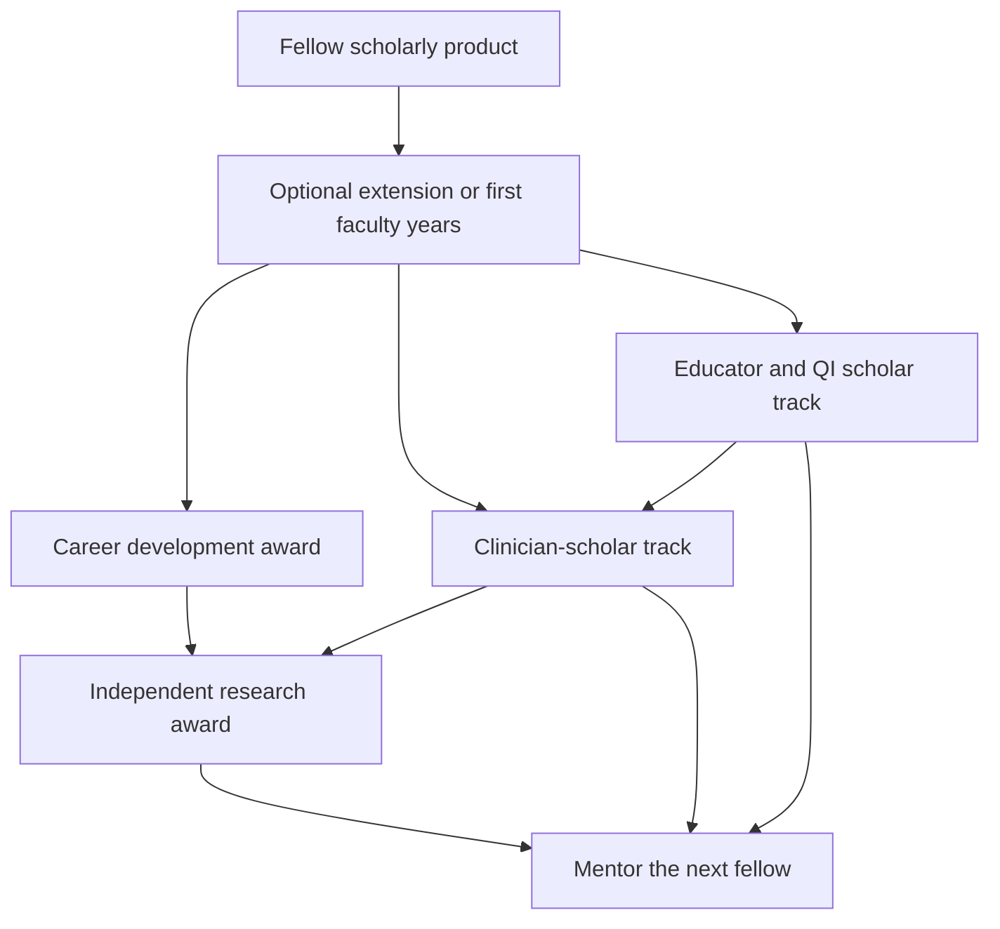

# Faculty Development, Grants, and Scholarly Productivity

## Opening

A Comprehensive Stroke Center that can treat but cannot develop investigators will remain a high-volume affiliate of someone else's science. Academic standing is not a pile of abstracts. It is a pipeline: fellows who leave with a question and a mentor; junior faculty who can survive the years between first appointment and first independent award; mid-career faculty who can lead multicenter work; and clinicians whose scholarly work is valued without being forced into a counterfeit R01 story.

The Medical Director does not award K or R grants. The Medical Director does design the local conditions those grants require: protected time that is real, mentorship that is mapped, publication operations that turn meeting abstracts into papers, a grant strategy that matches the person to the mechanism, and promotion criteria that recognize CSC work — trials enrollment, pathway science, quality methods, education, and equity — as scholarship rather than as a hobby that clinicians perform after the RVU day.

This chapter stays at the level of principles. NIH, PCORI, foundation, and industry mechanisms change. Confirm current program announcements before a faculty member writes to a remembered FOA. Do not punish clinicians with publication quotas copied from a basic-science division. Do not treat industry consulting as a career plan. Build a system in which more than one kind of excellent academic stroke physician can be promoted.

## Why This Matters

The fellowship year is too short to produce an independent investigator. ACGME requires scholarly activity; it does not require a K-award trajectory. If the CSC wants investigators, it must extend the runway: a structured second year, a faculty appointment with protected time, or a named mentor and dataset that survive the fellow's departure. Without that, the center will hire finished investigators from elsewhere — until those people notice that the local system cannot keep them.

Promotion committees still read papers, grants, and letters. They do not automatically understand CSTK improvement, telestroke network design, or 24/7 trial screening as intellectual work. The Medical Director's job is to translate CSC products into the language of the school's promotion document, and to change that document when it cannot describe the people the CSC must retain.

Money follows a portfolio, not a wish. A single unfunded champion writing nights and weekends is not a grant strategy. NIH career-development awards typically expect a large fraction of effort — historically on the order of 75% for many K mechanisms; confirm the current announcement — which a CSC cannot fake with "protected Tuesday morning." Industry funds can support trials and devices; they cannot be the only story in a promotion file if the school values independence. PCORI and foundations fund questions NIH may not. Match the question to the payer.

Culture is the remaining stake. If clinicians are scored only on RVUs and researchers only on R01s, the CSC splits into two castes. High reliability, equity, and pathway science live in the middle. Promotion criteria that ignore the middle will empty it.

## Core Framework

Hold a single pipeline picture, then resource each stage honestly.



### Investigator pipeline: fellow to K to R

Name the stages, the local product at each stage, and the decision to continue or to choose a clinician-scholar path without stigma.

| Stage | Local product | What the CSC must name |
| --- | --- | --- |
| ACGME fellowship year | One completed scholarly product. Mentor by August. | Time inside the accredited year. ACGME does not expect extensive original research. Continuing investigation and excelling as a clinician-educator are both successes. |
| Extension or first 1–2 faculty years | First-author paper; pilot data; trial-conduct skills; StrokeNet or equivalent exposure. | Salary support and a written clinical load. Then: apply for career development or remain on a clinician-scholar plan. |
| Career-development award (K or equivalent) | Specific aims; mentor team; coursework if required. | Effort at the level the announcement requires (confirm current K08/K23/K99 and foundation equivalents). Actually remove clinical time. |
| Independent award (R or equivalent) | Independence; resource sharing (coordinators, GWTG, imaging). | A schedule that does not punish success. Mentor others; do not hoard the registry. |
| Clinician-scholar (no K) | Recurring pathway science, site-PI work, or national committee roles. | Modest recurring protected time and a promotion file that counts this work. |

K-to-R is not the only respectable path. It is the path that must exist for people who want it. A CSC that tells every fellow they will be a K awardee will create avoidable failure. A CSC that tells every clinician that grants are "for researchers" will create avoidable stagnation.

### Protected time

Protected time is a schedule and a billing reality, not a sentence in an offer letter. Write it as sessions removed, not as a percentage that evaporates when a colleague is out.

| Principle | Practice |
| --- | --- |
| Name the sessions | "No inpatient weeks in months X–Y" and "two clinic sessions removed" are auditable. "20% protected" is not, unless a template proves it. |
| Match the mechanism | Career-development awards that require majority effort cannot sit on a full night-call slate. Confirm the current effort rule and the institution's cost-share. |
| Protect clinicians too | A clinician-scholar without any recurring time will not finish manuscripts. A small, reliable block beats a mythical sabbatical. |
| Do not raid it | Coverage gaps are a staffing problem. The first draw cannot be the junior person's research day. |
| Review quarterly | The Medical Director and chair compare the template to what actually happened. Drift is the default. |
| Dual-hat honesty | If the person is also Program Director or Medical Director, add the administrative FTE; do not hide it inside "research time." |

Fund protection from a mix: departmental mission support, hospital CSC support (justified by trials, quality, and reputation), grants, and philanthropy. A single source is brittle.

### Mentorship maps

One mentor is a friendship. A map is a system.

| Mentor role | Function | Who it usually is |
| --- | --- | --- |
| Career mentor | Promotion clock, saying no, track choice. | Senior faculty not competing for the same niche. |
| Scientific mentor | Aims, methods, grant craft. | Person with a relevant funding history. May be outside the division. |
| CSC operations mentor | How to use the registry, pathways, and trial machinery without violating QI/research rules. | Medical Director or research medical director. |
| Near-peer | The last person who submitted the same mechanism. | Recent K or first R awardee. |
| Sponsor | Says the candidate's name in rooms the candidate cannot enter. | Chair, institute director, or external letter-writer in training. |

Write the map at onboarding and at each promotion or grant stage. Require at least twice-yearly documented meetings for anyone on a career-development path. If the scientific mentor is external, fund the relationship (travel, co-appointment, or a formal affiliation). StrokeNet education and other network mentoring programs are adjuncts, not substitutes for a local map.

Do not assign as mentor a person who needs the junior faculty member's unpaid labor to finish their own papers. That arrangement is common and corrosive. The Medical Director should ask the junior person, privately, whether the map is extractive.

### Publication expectations that do not punish clinicians

Set expectations by track and by clinical load. Count CSC products that meet a scholarly standard.

| Track | Reasonable expectation (institutional, not a national rule) | What counts | What does not count as the whole file |
| --- | --- | --- | --- |
| Investigator (K/R path) | Recurring first- or senior-author papers; grants submitted on a named cadence. | Original research; methods; trial papers. | Abstracts that never become manuscripts. |
| Clinician-scholar | A sustainable cadence of papers, chapters, or pathway evaluations consistent with actual clinical FTE. | First-author clinical series, quality science with methods, guideline or consensus work, invited reviews that are not padding. | RVU totals presented as scholarship. |
| Educator | Curriculum, simulation science, GME outcomes. | Peer-reviewed education papers; adopted curricula with evaluation. | Hours taught, without a product. |
| All tracks | Honest authorship. | ICMJE-level contribution. | Gift authorship on GWTG papers the person cannot explain. |

Do not impose a single annual paper quota on a 0.9 clinical FTE and a 0.5 research FTE alike. Do require that abstracts from the CSC have a manuscript owner and a date. An abstract graveyard is a systems failure, not a personal quirk.

Quality and operations work becomes scholarship when it has a question, a method, data, and a public product. A PDSA that stops at the committee minutes is operations. A PDSA that is written to a methods standard is academic CSC work. Teach the difference.

### Abstract-to-manuscript operations

Run publications like a trial portfolio.

| Step | Owner | Rule |
| --- | --- | --- |
| Conference calendar | Coordinator or admin | ISC and other target meetings have abstract deadlines on the CSC calendar 16 weeks out. |
| Idea intake | Faculty meeting or research huddle | No stealth abstracts using GWTG or local data without the dual-use checklist (Chapter 29). |
| Author list | First author proposes; senior author confirms | Before analysis, not after acceptance. |
| Analysis | Named analyst | Reproducible code or a documented spreadsheet. |
| Draft | First author | Time-boxed. If the draft is late, the group reassigns or withdraws. |
| Internal review | Second reader who is not an author if possible | Especially for equity and outcome claims. |
| Submission and resubmission | First and senior author | A rejected paper has a 30-day plan. |
| Deposit and data | Senior author | Follow funder and journal rules. |

The Medical Director's lever is the calendar and the data-access gate, not ghostwriting.

### Grant strategy at principle level

Match the question, the person, and the mechanism. Confirm every deadline and effort rule on the live announcement.

| Source | What it is good for | Local conditions required | Risks |
| --- | --- | --- | --- |
| NIH (K, R, U, and StrokeNet trial mechanisms) | Career development; independent aims; multicenter trials through StrokeNet. | Protected effort; mentor team; preliminary data; human-subjects readiness. | Writing to a dead FOA; underestimating the clinical-effort conflict. |
| PCORI | Comparative effectiveness, stakeholder-engaged, patient-centered questions the CSC actually faces. | Patient and community partners who are real; equity design. | Treating PCORI as "easier NIH." It is a different logic. |
| Foundations (including AHA and others) | Pilots, fellow support, targeted clinical questions. | Alignment with the foundation's cycle and topic. | Building a career only on small pilots. |
| Institutional / CTSA / seed | First data, biostatistics help, release time. | A plan for the next external application. | Seed funding that becomes a lifestyle. |
| Industry | Trials, devices, investigator-initiated studies with a contract. | Publication rights, data access, conflict-of-interest management. | A file that looks purchased; delayed manuscripts; effort that crowds out public-priority trials. |

Portfolio rule for the division: more than one funder type across the faculty, not necessarily inside every person. A clinician-scholar may never hold an R01 and may still be doing the CSC's most important writing.

For industry, the Medical Director should see contracts that restrict publication, own data, or pay effort that collides with a StrokeNet acute trial. Those are governance issues, not personal opportunities.

### Promotion criteria aligned with the CSC mission

Sit down with the chair and the promotions committee with the school's written criteria and a translation table.

| CSC activity | How to present it as scholarship | Evidence to keep |
| --- | --- | --- |
| Pathway design (tenecteplase operations, ICH bundle, telestroke) | Methods, implementation outcomes, generalizable lessons. | Protocol versions, data, paper or citable report. |
| Trial site leadership | Team science; enrollment equity; protocol contributions. | Role letters; enrollment tables; named protocol work. |
| GWTG / CSTK science | If IRB-cleared and methodologically written. | Papers, not award plaques. |
| Education and simulation | Curriculum with evaluation (Chapter 28). | Adoption elsewhere; fellow outcomes; peer-reviewed education work. |
| Equity interventions | Designed, measured, published. | Stratified data and community partnership. |
| Network leadership | Regional system science. | Spoke outcomes, triage changes, invitations. |
| Clinical excellence | Required, not sufficient, on academic tracks. | Do not let RVUs substitute for a file. |

If the written criteria cannot recognize these products, the Medical Director and chair should propose language. Waiting for a denied promotion to discover the gap is how the CSC loses people.

!!! tip "Key Actions"
    List every fellow and every faculty member in the stroke group. Write their stage, track, mentor map, protected sessions, and next scholarly product. If a cell is blank, that is the work.

    Audit last year's abstracts. How many became manuscripts? Assign owners and dates to the ones that should have.

    Read the school's promotion criteria with a highlighter. Mark every CSC product that currently has no home. Take that page to the chair.

    For anyone on a K-like path, compare the clinical template to the effort the announcement requires. If they do not match, stop pretending and change the template or the path.

    Identify one external scientific mentor for each junior investigator whose local niche is crowded.

    Put abstract deadlines and internal draft deadlines on the same calendar as CSTK review.

!!! abstract "Metrics Targets"
    No national numeric promotion quota exists. The following are internal management targets, labeled as such.

    Fellowship: 100% of graduating fellows have a named product and a mentor letter describing their contribution (aligns with ACGME scholarly activity; extensive research is not expected).

    Abstract-to-manuscript: at least 70% of CSC-originated scientific abstracts have a submitted manuscript within 12 months, or a written decision to retire the project.

    Protected time: quarterly audit shows that written protected sessions occurred as scheduled at least 80% of the time for people on career-development paths.

    Pipeline: at least one person on a career-development or equivalent foundation path, and a named bench behind them. If the group is too small for that to be continuous, document the affiliate-mentor plan.

    Promotion: zero surprise denials caused by a file that was never translated into the school's criteria. Mid-cycle reviews on time for every academic-track faculty member.

    Portfolio: grant submissions diversified across at least two funder types over a three-year window at the division level.

!!! warning "Common Pitfalls"
    Promising 50% protection and staffing the person at 90%. The grant reviewer will notice. So will the faculty member, just before they leave.

    A single mentor who is also the Medical Director, the service chief, and the data owner. Conflicts will be silent until they are not.

    Counting GWTG award status as a publication. Plaques are not papers.

    Imposing a laboratory-style paper quota on full-time clinicians, then calling them un-academic when they fail.

    The opposite error: exempting clinicians from any scholarly product while using their patients as everyone else's dataset.

    Letting industry consulting and advisory boards become the only external validation in a file.

    Starting K-aim writing in the last three months of eligibility. Career-development applications are a year of work.

    Using fellows as unpaid analysts for faculty promotion papers without a product the fellow owns (Chapter 27).

    Treating a declined K as a personal verdict rather than as a revision cycle. Many funded investigators were declined first. The system must assume that.

!!! success "Implementation Tips"
    Create a 90-minute monthly "paper and aims" working session. Laptops open. No grand-rounds performance. The Medical Director attends and writes too, or does not bother to schedule it.

    Give clinician-scholars a default product: a methods-level pathway paper or a CSTK defect series with an equity cut. Make data access easy when the dual-use checklist is complete.

    Pair every new faculty hire with a 12-month scholarly plan in the offer letter: track, sessions protected, mentor map, first paper, first grant or committee target.

    Use StrokeNet and similar network education for grant craft, then force a local aims review. External webinars do not replace a person who will read the specific aims page.

    When a faculty member is drowning clinically, reduce service before adding a writing coach. Coaching cannot compensate for a full night-call slate.

    Keep a shared folder of successful specific aims (redacted) from people who consent. Imitation of structure is how junior faculty learn.

    Celebrate accepted papers and funded grants in the same forum as Target: Stroke results. What is celebrated is what the culture thinks is real.

## How to Do the Work

### Daily / weekly

Protect the protected day. If the junior faculty member is pulled to service, log it. Patterns are the quarterly audit.

In the weekly research huddle (Chapter 29), include one scholarly-operations item: abstract deadline, manuscript stuck, or mentor meeting overdue.

When a clinical case would make a teaching or QI paper, assign the owner that week, not after the meeting season.

### Monthly / quarterly

Hold the paper-and-aims session. Review the abstract-to-manuscript board.

Meet each person on a career-development path at least quarterly: effort versus template, mentor map, aims timeline, clinical load, wellness.

With the chair, review upcoming promotion clocks. A file that needs external letters is a six-to-twelve-month project.

Quarterly, look at industry relationships and conflict-of-interest disclosures next to the trial portfolio. Realign if a consulting relationship is steering enrollment or crowding a public trial.

### Annual / multi-year

Onboard new faculty with the 12-month scholarly plan. Revisit tracks honestly: some people should move from a K path to a clinician-scholar path without language of failure.

Update the promotion translation table when the school revises criteria or when the CSC invents a new product (for example, simulation science or AI governance papers — Chapter 31).

Plan philanthropy and hospital support for protected time as a multi-year budget item, not as a one-off "start-up."

Every two to three years, review whether the division should host a training grant, a StrokeNet education role, or an institutional K-equivalent. Those are infrastructure, and they require a mentor bench that already exists.

Succession: identify who will be the next research medical director and the next scientific mentor. A single funded investigator is a fragile system.

## Ready-to-Adapt Tools

### Faculty scholarly plan (offer-letter appendix)

```
Name: ________  Start date: ________
Track: [investigator / clinician-scholar / educator]
Clinical template: [inpatient weeks] [clinic sessions] [nights]
Protected sessions (named): ________
Mentor map:
  Career: ________
  Scientific: ________
  CSC operations: ________
  Near-peer: ________
  Sponsor: ________
12-month products: ________
Grant or committee target: ________
Data access and dual-use plan: ________
Quarterly review dates: ________
Signatures: faculty, Medical Director, chair
```

### Mentor-map one-pager

| Role | Name | Cadence | What they will not do |
| --- | --- | --- | --- |
| Career |  |  | Assign unpaid analysis |
| Scientific |  |  | Serve as sole letter-writer |
| CSC operations |  |  | Bypass IRB / GWTG rules |
| Near-peer |  |  | Replace the scientific mentor |
| Sponsor |  |  | Remain invisible to the candidate |

### Abstract-to-manuscript board columns

| Abstract | Meeting | First author | Senior | Data source cleared | Draft due | Submitted | Decision | Resubmit-by |

Retire rows that the group agrees are dead. Do not let them sit as guilt.

### Aims-review agenda (60 minutes)

| Minutes | Item |
| --- | --- |
| 0–5 | Mechanism, deadline, effort required |
| 5–20 | Specific aims page read aloud |
| 20–35 | Feasibility: data, patients, coordinators, mentors |
| 35–50 | Alignment with CSC mission and competing trials |
| 50–60 | Go / revise / stop; next reader and date |

### Promotion evidence inventory

- [ ] CV in the school's format
- [ ] Personal statement that translates CSC work into the criteria language
- [ ] Teaching and education products
- [ ] Quality and implementation products with methods
- [ ] Trial roles with letters
- [ ] Grant list: submitted, scored, funded
- [ ] Industry relationships disclosed
- [ ] Equity work with data
- [ ] Referee list that includes people who have seen the work, not only famous names
- [ ] Mid-cycle committee feedback, if any

### RACI — faculty development

| Activity | Medical Director | Chair | Scientific mentor | Faculty member | Research admin |
| --- | --- | --- | --- | --- | --- |
| Protected-time template | A | A | C | C | I |
| Mentor map | A | C | R | R | I |
| Abstract-manuscript board | A | I | C | R | R |
| Grant mechanism choice | C | C | A | R | C |
| Promotion file translation | R | A | C | R | I |
| Industry contract review | A | C | I | R | C |

## Integration With Other Pillars

Leadership and FTE architecture (Part II) determine whether protected time is real. A Medical Director without hiring and scheduling authority cannot run this chapter.

Clinical volume and complexity (Part III) are the dataset and the laboratory. They are also the force that steals the research day. Balance is a governance act.

Quality and equity (Part IV) are the most reliable source of clinician-scholar papers if dual-use rules are followed. Do not strip the quality team of credit when a paper appears.

Fellowship (Chapter 27) is the intake of the pipeline. Simulation and education (Chapter 28) are a promotion path for educator-scholars. Trials operations (Chapter 29) are how site-PI work becomes credible. Innovation governance (Chapter 31) will generate a new scholarly domain — validation, drift, equity audit — that promotion criteria must learn to read.

Strategy and finance (Part VII) either fund the runway or import talent forever. Elite standing (Chapter 36) includes a faculty bench, not only a DTN trophy.

## Sources

- ACGME Vascular Neurology Program Requirements and FAQs: scholarly activity is required; extensive original research is not expected in the one-year fellowship.
- NIH Grants Policy and current K (K08, K23, K99/R00 and successors) and R announcements. Confirm effort rules on the live FOA. Do not manage to a remembered 75% without checking.
- NIH StrokeNet education core, site-PI pathway, and trial mechanisms (current StrokeNet and NINDS announcements).
- PCORI funding announcements and methodology standards.
- ICMJE Recommendations for the Conduct, Reporting, Editing, and Publication of Scholarly Work in Medical Journals.
- AHA and other foundation research programs — confirm current cycles.
- 2026 AHA/ASA AIS Guideline; 2022 ICH Guideline; 2023 aSAH Guideline; 2021 secondary-prevention guideline.
- GWTG-Stroke public criteria and official research-request pathways.
- Joint Commission CSC expectation of patient-centered research.
- IHI Model for Improvement; SQUIRE (or equivalent) reporting standards.
