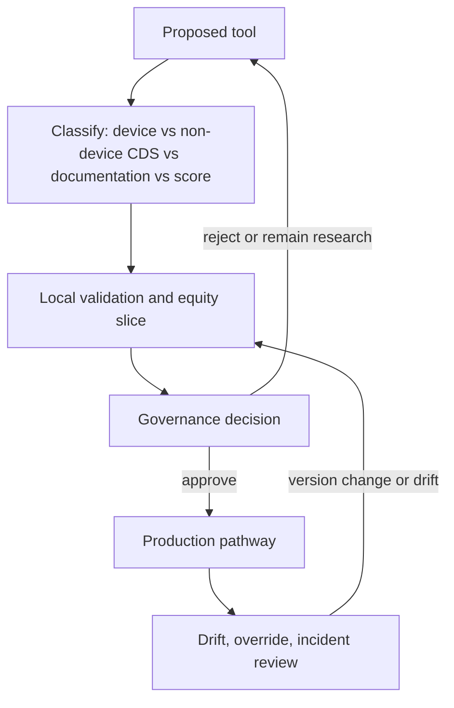

# Innovation, AI, and Decision-Support Governance

## Opening

Imaging algorithms that flag large-vessel occlusion, electronic-health-record alerts that fire on suspected stroke, ambient documentation tools that draft the note, and triage scores that rank transfer urgency are now part of CSC operations. They are not optional decorations, and they are not colleagues. They are tools. Tools require owners, validation, drift monitoring, equity audit, and a human who can override them without being punished.

The Medical Director's job is to govern these tools, not to collect them. No vendor is required to run a CSC. A center can meet Joint Commission CSC expectations, the 2026 AHA/ASA AIS Guideline, and CSTK measure reporting without a particular algorithm brand. Procurement is a choice with a safety case. Treat "the algorithm said so" as an unacceptable sentence in a morbidity conference.

This chapter stays at principle level. FDA device regulation and non-device clinical decision support (CDS) rules are in active guidance — including a January 2026 update to the FDA CDS guidance that supersedes the 2022 version. Confirm the current FDA text and the institution's digital-health policy before writing a local rule that depends on a regulatory category. Do not let a research pilot quietly become the night pathway. Keep a firewall between investigation and operations until governance says the tool is in production.

## Why This Matters

Hyperacute stroke is a high-severity, short-cycle environment. A false-negative LVO flag can delay puncture (CSTK-09, CSTK-11). A false-positive can steal an angiosuite from a real patient. An EHR alert that cries wolf will be ignored on the night it is right. An ambient scribe that invents a last-known-well will corrupt every downstream measure and every trial screen. A triage score that was trained on one demographic will mis-order transfers from another.

Regulation is not theoretical. Software that acquires, processes, or analyzes medical images is, under the 21st Century Cures Act framework as FDA interprets it, generally a device — not "non-device CDS." Many LVO-detection products are cleared as software as a medical device. Software that only presents guideline text from charted data to a clinician who can inspect the basis may fall outside the device definition if all statutory criteria are met. Mis-categorizing a tool does not make the safety problem disappear; it only makes the procurement file look naive.

Equity and drift are operational. Models change when scanners change, when the catchment changes, when a software version ships, and when the night tech uses a different reconstruction. If nobody is watching subgroup performance, the CSC will learn about bias from a missed patient, not from a dashboard.

Culture is the last reason. Staff will either treat the tool as an oracle or as noise. Governance is how the organization teaches a third stance: use it, check it, override it, and report when it is wrong.

## Core Framework

Classify every tool, place it in a lifecycle, and do not skip stages.



### Tool classes the CSC actually meets

| Class | Examples in stroke care | Typical regulatory posture (confirm current FDA guidance) | Primary CSC risk |
| --- | --- | --- | --- |
| Imaging analysis / LVO or hemorrhage detection | Software that reads CT, CTA, or perfusion and marks suspected LVO, ICH, or mismatch. | Generally a device (SaMD). Image analysis fails the first non-device CDS criterion. Clearance (often 510(k)) is not local validation. | Missed LVO; over-call; perfusion numbers treated as DEFUSE-equivalent without a protocol; scanner-specific drift. |
| EHR interruptive alerts | "Possible stroke," "possible tPA candidate," sepsis-style banners reused on NIHSS. | May be non-device CDS if it does not analyze images/signals, is for clinicians, and the basis is inspectable — or may be a device if it crosses those lines. Category does not decide whether the alert is wise. | Alert fatigue; delay while staff clear boxes; false eligibility. |
| Ambient documentation | Microphones that draft notes, discharge instructions, or family-meeting summaries. | Often not a stroke-specific device; still a medical-record and privacy system. Hallucinated facts become the legal chart. | Invented last-known-well, NIHSS items, or consent. |
| Triage and severity scores | Clinical scores, transfer-priority scores, early-outcome predictors. | A static published score used by a clinician is not new software. An automated predictor that outputs risk from EHR data may be CDS or a device depending on inputs and opacity. | Inequitable transfer ranking; self-fulfilling prophecy. |
| Workflow routers | Auto-paging, image-share, "stop the clock" timers. | Usually infrastructure. Failures look like pathway failures. | Silent pager-group errors; clock starts that do not match CSTK definitions. |

No class is required. A CSC must have a pathway that finds LVO and treats it quickly. That pathway can be a competent clinician reading a CTA. Software may help a stretched night service. It does not replace neuroradiology, and it does not replace the 2026 rule that eligible patients receive IVT and EVT without delaying one for the other.

### Validation, drift, and equity audit

Local validation is not optional for tools that change who is paged or who goes to the scanner. Vendor ROC curves were built on someone else's mix.

| Question | What to measure locally | Cadence |
| --- | --- | --- |
| Does it find what we care about? | Sensitivity and positive predictive value for the operational target (for example, intracranial LVO that the local service treats), against a defined reference (neuroradiology or operator). | Before go-live; after each major software or scanner change. |
| What does it miss? | False negatives reviewed as pathway defects, same as a missed CTA. | Every case, or a complete capture period at go-live. |
| What does it over-call? | False positives as a capacity cost (needless activation). | Weekly at go-live; then monthly. |
| Does performance differ by group? | Age, sex, race and ethnicity as locally appropriate, language, transfer versus walk-in, scanner, time of day, posterior-circulation versus anterior. | Before go-live and quarterly. |
| Did it drift? | Same metrics after a version update, a new CT platform, or a change in reconstruction. | Triggered, plus quarterly. |
| Does it change equity of care? | DTN, door-to-device, and transfer-accept times stratified by whether the tool fired and by subgroup. | Quarterly, with the equity committee (Chapter 26). |

Set a priori thresholds for "good enough to page intervention" versus "interesting but not a pager." If the tool's positive predictive value is too low for auto-page, use it as a second look, not as an activation.

Do not validate only on weekday cases with complete perfusion. Night and transfer scans are the operating environment.

### Human override

Write override as a duty, not as insubordination.

| Rule | Why |
| --- | --- |
| A clinician who sees a disabling deficit and a CTA that looks like LVO proceeds even if the software is silent. | The 2026 guideline treats disabling deficits and EVT eligibility as clinical decisions. Software silence is not a contraindication. |
| A clinician who believes the software over-called may cancel an activation along a written path (second reader, time-to-second-look). | Uncancelled false activations destroy trust and steal rooms. |
| Override reason is logged in a structured field: false negative, false positive, artifact, disagreement with score, documentation error. | Without structure, review is anecdote. |
| Overriders are not scored as noncompliant. | A compliance metric on "agreement with the algorithm" trains people to obey a device. |
| Repeated overrides in one direction trigger a drift review, not a counseling session. | The tool may be wrong. |
| Patients and families are not told "the AI decided." | Responsibility remains with the attending. |

Ambient documentation needs a sharper rule: the clinician who signs the note owns every time stamp and every NIHSS item. If the tool drafted last-known-well, the signer must have verified it from a primary source. Treat invented content as a safety incident, not as a training nuisance.

### FDA device versus non-device CDS — high level

This is a classification aid for procurement conversations, not a legal opinion. Route category questions through institutional counsel and the device/digital-health office. Confirm the current FDA CDS guidance (January 2026 update and any successor).

Under section 520(o)(1)(E) of the FD&C Act, as FDA has interpreted it, software may be non-device CDS only if it meets all of the statutory criteria, including that it is not intended to acquire, process, or analyze a medical image or a signal from an in-vitro diagnostic or signal-acquisition system; it is intended for a health-care professional; it displays or analyzes medical information; and it enables the professional to independently review the basis for the recommendation so that the recommendation is not a black box.

Practical consequences for a CSC:

- LVO, ICH, and perfusion-analysis software that reads images is on the device side of the line. Demand the clearance pathway, intended-use statement, and labeled limitations. Do not let a sales slide relabel it as "just CDS."
- An EHR alert that restates a guideline from structured chart data, and that shows the clinician the data and the rule, may be non-device CDS. It can still be dangerous.
- Image-derived LVO/ICH/perfusion software remains on the device (SaMD) side. The January 2026 FDA CDS guidance no longer treats “time-critical” as an automatic Criterion 3 device trigger; it is a Criterion 4 review factor. Confirm the live FDA text before telling purchasing that a stroke alert is “obviously a device” solely because it is fast. Opacity and image inputs still matter. Clearance is still not local validation.
- Clearance is not a local safety case. 510(k) comparison devices were not the CSC's night scanner.

Keep intended use honest. If the staff behavior is "we wait to activate until the algorithm fires," the tool is driving diagnosis, whatever the label says.

### Research versus operations firewall

A pilot is research or a quality experiment. Production is a pathway. Do not blur them.

| State | Required controls | What staff may be told |
| --- | --- | --- |
| Research | IRB or quality-determination as applicable; protocol; consent or waiver; no change to standard activation rules unless the IRB approved that change. | "This is a study. Treat the patient as you would without it." |
| Shadow mode | Tool runs, humans do not see it or see it without acting, outcomes compared. | "Do not change behavior." |
| Supervised operations | Tool visible; activation still requires a human rule. | "You may use this as a second look. You may not wait for it." |
| Production | Governance approval, training, override log, drift plan, downtime plan. | "This is part of the pathway, with the written override." |
| Version change | Treat as a new go-live if the intended use or model changed. | Retrain. Do not bury a model update in an IT note. |

Industry "free pilots" that auto-page intervention are not shadow mode. They are ungoverned production. Decline or convert them.

Separate research data from operational identifiers. A model-improvement agreement that ships identifiable imaging to a vendor is a contracting and privacy event, not a favor.

### Procurement checklist (no vendor required)

Use the same questions for every product. The correct outcome of a procurement is sometimes "do not buy."

| Domain | Written answers required |
| --- | --- |
| Problem | Which measured defect will this change? If the defect is CTA-read time, is the cheaper fix a night neuroradiology plan? |
| Intended use | Labeled use versus what staff will actually do. |
| Regulatory | Device or non-device CDS; current FDA guidance; clearance number if any; labeled limitations. |
| Local validation | Silent period on local scanners? Who pays for reference reads? |
| Equity | Training-data description; subgroup-audit plan. |
| Override and downtime | What happens when the tool is wrong, slow, or offline? Revert to a tested pathway? |
| Integration | EHR, PACS, pagers, telestroke image share. Who owns a failed interface at 02:00? |
| Drift and versions | Notice period for model updates. Right to re-validate before go-live. |
| Data | What leaves the institution? Identifiability? Vendor training use? Research-versus-operations split? |
| Contract and cost | Publication rights; indemnity; exit so the pathway survives cancellation; subscription versus hiring a reader. |
| Independence | No exclusive-pathway language. No "required for CSC certification" claim. That claim is false. |

The Medical Director signs the clinical-safety case. Information services signs the interface. Compliance signs the category and privacy. Purchasing does not go first.

!!! tip "Key Actions"
    Inventory every algorithm, alert, ambient tool, and automated score that touches stroke care. For each, record owner, regulatory category as the institution understands it, whether it can auto-page, and whether a downtime drill exists.

    Ban auto-page from any tool that has not completed a local silent-period validation with an equity slice.

    Add a structured override reason to the pathway today, even if the field is a simple pick-list in the quality database.

    Read the intended-use statement of any imaging algorithm in production. If staff behavior exceeds the label, stop and rewrite either the behavior or the tool's role.

    Ask ambient-documentation vendors — or the institutional team that deployed them — how last-known-well and NIHSS are handled. If the answer is vague, exclude those fields from auto-draft.

    Put "tool downtime" on the next disaster and surge tabletop (Chapter 35). The pathway must work when the software does not.

!!! abstract "Metrics Targets"
    No Joint Commission numeric standard requires a particular algorithm. Certification floors remain the clinical measures: CSTK-09, CSTK-11, CSTK-12, CSTK-01, Target: Stroke DTN and door-to-device goals as publicly defined. Tools are judged by whether those measures hold when the tool is up, down, and wrong.

    Internal governance targets, labeled as internal: 100% of production tools have a named clinical owner and a downtime procedure; 100% of auto-page tools have completed local validation; override reasons captured on ≥90% of disagreements; quarterly drift and equity report for each production imaging algorithm; zero research pilots with activation authority.

    Safety: every false-negative LVO flag that reached a treatable patient reviewed within five days as a pathway defect. Every ambient-documentation hallucination of a time-critical fact reviewed as a documentation incident.

    Alert hygiene: interruptive EHR stroke alerts reviewed quarterly; retire or rewrite any alert with a persistently low action rate. There is no national target; a local action rate should be defined before go-live.

!!! warning "Common Pitfalls"
    Buying software to decorate a CSC application. Surveyors can ask how LVO is found. They cannot require a brand.

    Letting a vendor's "AI stroke platform" become the unwritten pathway. When the contract ends, the pathway disappears.

    Treating 510(k) clearance as evidence that the tool works on this scanner, tonight, in this catchment.

    Auto-paging intervention from an unvalidated flag, then blaming the interventionalist for "alert fatigue."

    Scoring clinicians on agreement with the model. That is how oracles are born.

    Ambient notes that auto-fill last-known-well from a previous encounter or from a guessed phrase. CSTK and trial eligibility will both lie.

    Equity audit that looks only at overall AUC. A model can look good in aggregate and fail posterior-circulation disease, women, or a single scanner.

    A research fellow's model that starts paging the ED because someone flipped a configuration flag.

    EHR alerts copied from sepsis bundles. Stroke eligibility is not a lactate.

    Confidentiality theater: recording family meetings with an ambient tool that the family was not told about.

!!! success "Implementation Tips"
    Start new imaging tools in true shadow mode. Compare flags to the clinical read for a defined N or a defined calendar period. Only then discuss paging.

    Make neuroradiology a governance member, not a recipient of the decision. They are the reference standard and they see the artifacts.

    Put override logs on the same weekly quality agenda as DTN misses. Same room, same seriousness.

    Write a 10-minute downtime drill: scanner works, software does not, CTA is read by the human pathway. Run it.

    For EHR alerts, require a sunset date at launch. Alerts without a review date become geology.

    Teach fellows (Chapter 27) that decision-support is a systems-based practice topic: category, override, and how to explain a disagreement in the note.

    When a tool helps — a night LVO catch that a tired reader delayed — say so in the huddle. Governance that only reports failures will be treated as hostility to innovation.

    Keep a one-page "what we use and why" for executives so a sales meeting cannot outrun the Medical Director.

## How to Do the Work

### Daily / weekly

In the weekday reperfusion review, ask whether a tool fired, whether it was right, and whether anyone waited for it. Log overrides.

If ambient documentation is in use, audit a sample of signed stroke notes for last-known-well, NIHSS, and contraindications versus source data. One invented time stamp is enough to escalate.

Treat tool downtime like CT downtime: notify, revert, record duration.

### Monthly / quarterly

Governance huddle (or a standing slot on the weekly ops agenda): volume of flags, predictive value, overrides, incidents, version changes, alert action rates, ambient-documentation incidents.

Quarterly equity and drift report for each production algorithm. Include scanner identity. Present it with the clinical equity report, not in an IT subcommittee that clinicians skip.

Review the research-versus-operations list. Any pilot that is paging people has escaped.

Quarterly, retire or rewrite one low-value alert. Make subtraction a habit.

### Annual / multi-year

Re-read intended-use statements and FDA category assumptions against current guidance (confirm the live CDS document). Update the inventory.

Re-compete or re-justify subscriptions against the original defect. If door-to-device improved because of a staffing change, do not keep paying for a tool that did not cause it.

Include decision-support downtime in surge and continuity planning.

Build internal scholarly work on validation and equity (Chapter 30) so the CSC is a critic of tools, not only a customer.

Plan for turnover of the clinical owner. An algorithm whose only champion left the institution is an unowned device.

## Ready-to-Adapt Tools

### Production-readiness gate

```
Tool name: ________  Vendor / build: ________  Version: ________
Clinical owner: ________  IT owner: ________
Problem statement and baseline metric: ________
Intended use (labeled): ________
Staff behavior intended: ________
Category (institution + counsel): [device SaMD / non-device CDS / documentation / score / infrastructure]
Clearance or basis: ________
Silent-period validation: dates, N, sensitivity, PPV, subgroup table attached: [Y/N]
Auto-page proposed: [Y/N]  if Y, PPV threshold met: [Y/N]
Override log live: [Y/N]
Downtime procedure drilled: [Y/N]
Data-flow and vendor-training use: ________
Contract exit / pathway survival: ________
Training completed for night staff: [Y/N]
Governance decision: [shadow / supervised / production / reject]
Review date: ________
Signatures: Medical Director, neuroradiology (if imaging), compliance, IS
```

### Override pick-list

- False negative — disease present, tool silent
- False positive — tool fired, disease absent
- Artifact / incomplete study
- Disagreement with automated score
- Wrong patient or wrong study
- Documentation tool error (time, NIHSS, meds)
- Downtime / late fire
- Other (narrative required)

### Weekly tool-review add-on (10 minutes on the existing quality agenda)

| Minutes | Item |
| --- | --- |
| 0–3 | Flags, fires, and downtime hours |
| 3–6 | Overrides and one false-negative case |
| 6–8 | Ambient or alert incident |
| 8–10 | Version or vendor notice; action |

### EHR alert design sheet

```
Alert name: ________
Trigger: ________
Interruptive: [Y/N] — default N unless a time-critical act is blocked
Shows the clinician: [the data] [the rule] [the override]
Who can dismiss and how: ________
Expected action rate at 90 days: ________
Sunset or review date: ________
Owner: ________
Retirement rule: if action rate < ____ or if a safer control exists
```

### Ambient documentation rules for stroke

- [ ] Family or patient informed when recording is on, per institutional policy
- [ ] Last-known-well is never auto-signed without a primary-source check
- [ ] NIHSS items are not inferred from narrative
- [ ] Contraindications and anticoagulant times are not guessed
- [ ] Comfort-measures and consent language are clinician-authored
- [ ] Hallucinated time stamps are incident-reported
- [ ] Speakers who did not consent to recording are not captured (interpreters, families, EMS)
- [ ] Note remains the attending's legal act

### RACI — decision-support governance

| Activity | Medical Director | Neuroradiology | IS / EHR | Compliance | Quality |
| --- | --- | --- | --- | --- | --- |
| Inventory and classification | A | C | R | C | C |
| Local validation design | A | A/R | C | C | R |
| Auto-page authority | A | C | C | C | C |
| Override review | A | C | I | I | R |
| Drift / equity report | A | C | C | I | R |
| Contract clinical-safety case | A | C | C | A | I |
| Research-pilot firewall | A | C | C | A | C |

## Integration With Other Pillars

Hyperacute pathways, imaging architecture, EVT, and telestroke (Part III) are where these tools land. An LVO flag that does not fit the imaging protocol is noise. A telestroke spoke that sees a hub algorithm the hub has not explained will defer too much or too little.

Quality, CSTK, and equity (Part IV) supply the scoreboard and the subgroup method. High-reliability practice (preoccupation with failure, reluctance to simplify) is the correct stance toward models.

Fellowship and interprofessional education (Part V) must teach override and downtime, not only the happy path. Simulation (Chapter 28) should include a silent algorithm and a hallucinated note.

Trials (Chapter 29) can be biased by a tool that changes who is recognized as an LVO. Protocol eligibility must state whether software-assisted detection is allowed and how it is documented. Faculty scholarship (Chapter 30) should include validation and equity papers so the CSC is not intellectually dependent on vendors.

Strategy, finance, and surge (Part VII) decide whether a subscription is worth more than a person, and whether the pathway survives a cyber event that takes the algorithm offline.

## Sources

- U.S. FDA. Clinical Decision Support Software guidance, including the January 2026 update that supersedes the 2022 guidance ([ER-FDA-CDS-2026](../evidence-register.md)). Interprets section 520(o)(1)(E) of the FD&C Act (21st Century Cures Act §3060), including the exclusion of software that analyzes medical images or signals. Time-critical decision-making is a Criterion 4 review factor, not an automatic Criterion 3 device trigger.
- U.S. FDA. Device software functions / SaMD materials. Clearance is not local validation.
- 2026 Guideline for the Early Management of Patients With Acute Ischemic Stroke. *Stroke*. 2026;57(8):e316–e436. DOI 10.1161/STR.0000000000000513.
- DAWN, DEFUSE 3, and large-core trial families (SELECT2, ANGEL-ASPECT, RESCUE-Japan LIMIT). A vendor perfusion map is not automatically trial-equivalent.
- Specifications Manual v2026B: CSTK-01, CSTK-08, CSTK-09, CSTK-11, CSTK-12.
- Joint Commission DSC / CSC standards (SCS26). No standard requires a named algorithm vendor.
- AHA GWTG-Stroke and Target: Stroke public criteria.
- HIPAA and state privacy rules; 45 CFR 46 when a tool is in research mode.
- High Reliability Organizing; IHI Model for Improvement.
- Chapter 26 equity methods and Chapter 29 dual-use rules, applied to model audit and vendor data-sharing.
