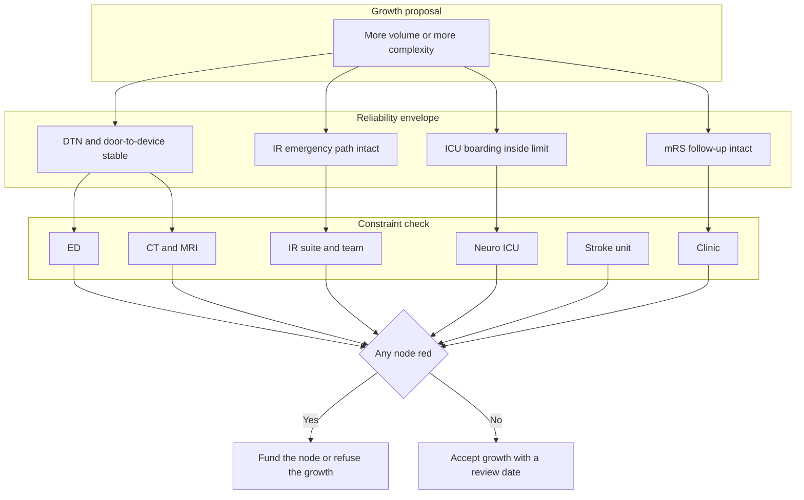

# Strategy, Growth, Volume, and Complexity

## Opening

Strategy for an academic Comprehensive Stroke Center is not a slide about becoming the regional destination. It is a set of decisions about which patients the center will take, which capabilities it will keep reliable at 02:00, which volumes it will refuse until capacity exists, and which complexities it will deliberately build. The Medical Director owns those decisions even when a strategy office owns the deck.

Volume is easy to celebrate. Complexity is what a CSC exists to absorb. The two are not interchangeable. A rise in straightforward ischemic admissions can look like growth while the center loses aneurysm, ICH, and late-window EVT cases that only a CSC should hold. The reverse is also true: a surge in transferred large-vessel occlusions, ruptured aneurysms, and anticoagulant-associated ICH can raise case-mix and teaching value while collapsing the CT queue, the single biplane room, the neuro ICU, and door-to-device reliability.

Ungoverned growth is a reliability event. It shows up first as boarding, delayed second-look imaging, IR start-time slip, ICU overflow onto non-neuro floors, missed 90-day mRS contacts, and a clinic that cannot see the patient whose secondary prevention was the entire point of the admission. It shows up later as staff exit, fellowship strain, falling CSTK-11 and CSTK-12 performance, and referring hospitals that stop trusting the hub.

Treat the multi-year plan as an operating document. Name the capacities that constrain the mission. Name the service lines that define the academic CSC. Name the competitor dynamics without naming competitors. Then write a three-year roadmap that a chair, a CNO, and a CFO can fund without pretending that more volume is always the answer.

## Why This Matters

Certification is a floor, not a growth target. Confirm the current Joint Commission E-App and CSC eligibility table in the active DSC manual before using any volume number in a board packet. The April 2, 2025 Joint Commission announcement reduced the annual aSAH volume criterion to 10; do not treat that floor as a strategy. Historical summaries sometimes cited figures such as 25 IV thrombolysis cases; treat those as historical and confirm current. Do not invent a current numeric EVT or IVT volume requirement. A center that barely clears a floor is not a regional system. A center that chases volume past its reliability envelope is not one either.

Outcomes follow the ability to deliver proven therapy on time. HERMES showed a large EVT effect in appropriate anterior-circulation LVO (mRS 0–2 in 46.0% versus 26.5%; NNT 2.6 for at least a one-point mRS shift). The 2026 AHA/ASA AIS Guideline directs rapid IV thrombolysis for eligible disabling deficits within 4.5 hours regardless of NIHSS—tenecteplase 0.25 mg/kg IV push (max 25 mg) or alteplase 0.9 mg/kg (max 90 mg)—and directs that patients eligible for both IVT and EVT receive both without delaying thrombectomy. None of that benefit survives a strategy that fills the ED, the scanner, and the IR suite past reliable first-pass care.

Capacity is a chain. The weakest node sets the true volume ceiling: ED bed and triage, CT/CTA/CTP and MRI, IR suite and team, neuro ICU and step-down, dedicated stroke-unit beds, and clinic/rehab slots that close the loop. Adding transfer volume without adding the node that is already red is not growth. It is a decision to degrade every patient already in the building.

Academic and community competitors do not play the same game. A community PSC or TSC may compete on access, hotel-like amenities, and a short list of high-visibility procedures. An academic CSC competes on last-resort capability, hemorrhagic and complex vascular care, 24/7 neurocritical care, training, trials, and the willingness to take the case nobody else can finish. Copying community marketing tactics usually produces the wrong volume: low-complexity ischemic admissions that a capable spoke could have treated, while the ICU and IR remaining capacity is consumed before the next aneurysm arrives.

Workforce and equity are strategy variables. Growth that depends on unpaid coordinator nights, uncovered IR call, and clinic backlog is a plan to lose people. Growth that preferentially captures insured transfers and leaves nearby safety-net ischemic patients on a slower path is a plan to fail the regional mission. Write both into the strategy object before anyone writes a press release.

## Core Framework

Hold one strategy object and refuse to let volume, marketing, or a single service line substitute for it.

| Strategy object | Question the Medical Director must answer | Failure mode if left blank |
| --- | --- | --- |
| Regional job | What the center will reliably do for the region at 02:00 that a PSC or TSC cannot | Hub becomes a transfer dump without a system |
| Case-mix intent | Which complexities must rise, hold, or fall | Volume rises while CSC-defining work shrinks |
| Reliability envelope | What DTN, door-to-device, ICU boarding, and clinic access must not do while volume changes | Awards lag while nights fall apart |
| Capacity map | Which node is red now and which node turns red next | Capital is spent on the loudest request, not the constraint |
| Network posture | Which cases stay at capable spokes, which move, and how repatriation works | Extractive hub, angry spokes, worse regional outcomes |
| Academic job | What fellows, trials, and guideline-level practice require in case-mix and infrastructure | Teaching hospital with a community case-mix |
| Equity job | Who is not reaching reperfusion, reversal, or aneurysm care | Growth that widens disparity |
| Stop rules | What volume or complexity the center will not add until a named capacity exists | Strategy becomes a wish list |

### Volume is not complexity

Separate three quantities in every quarterly review: raw stroke discharges, reperfusion and hemorrhagic procedure counts, and the resource intensity of the mix. A center can grow the first while losing the second and third.

| Case cluster | Why it matters to a CSC | Dominant capacity tax | Strategy use |
| --- | --- | --- | --- |
| Community ischemic stroke without reperfusion | Secondary prevention, education, STK reliability | Ward bed, case management, clinic | Do not chase if spokes can treat well; keep enough for teaching and equity |
| IVT-eligible disabling AIS | Time-critical therapy per 2026 AIS Guideline | ED, CT, pharmacy, stroke team | Protect DTN as a daily system; do not divert these to protect elective work |
| EVT-eligible LVO, early and late window | CSC-defining; HERMES-level benefit only if delivered | CT/perfusion, IR, anesthesia, ICU | Grow only with suite, team, and ICU headroom |
| Anticoagulant-associated ICH | Time-critical reversal; 2022 ICH Guideline and CSTK-04 | CT, pharmacy, ICU, hematology | Treat as a service line, not an after-hours inconvenience |
| aSAH and complex aneurysm | CSC-defining; 2023 aSAH Guideline; certification floor is not the goal | IR/OR, ICU, nimodipine pathway, delayed-ischemia surveillance | Build to regional need; confirm current volume criterion rather than advertising the floor |
| Elective complex vascular | Teaching, research, scheduled IR utilization | Daytime IR, clinic, anesthesia | Do not let elective work consume the emergency suite without a second room or a protected emergency path |
| Telestroke-only encounters | Regional access, spoke support | Physician time, documentation, transfer coordination | Count as work; do not pretend they are free |
| Repatriation and post-acute | Network trust, bed recovery | Case management, receiving-facility relationships | Design as a pathway, not a Friday afternoon scramble |

### When growth harms reliability

Use hard stop-lights, not anecdotes. If two or more of the following stay red for a quarter, freeze net new transfer-marketing and elective-complex growth until the constraint is funded.

| Signal | Why it is a strategy problem | Typical false fix |
| --- | --- | --- |
| DTN or door-to-device slipping while volume rises | The hyperacute chain is past its envelope | More huddles without a scanner or suite |
| CSTK-11 or CSTK-12 falling | Arrival-to-reperfusion and puncture-to-reperfusion are degrading | Abstracting harder instead of changing flow |
| Neuro ICU boarding in ED or overflow to non-neuro ICUs | Hemorrhagic and post-EVT care is being improvised | More transfer acceptances "because we are the CSC" |
| Single IR suite utilization that blocks emergency access | The next aneurysm or LVO waits on an elective case | Adding elective volume to "improve utilization" |
| Stroke-unit census above staffing standard | Nursing skill mix is the hidden capacity | Hallway beds counted as capacity |
| 90-day mRS completeness falling | CSTK-02 and CSTK-10 become fiction | Hiring another abstractor without a follow-up method |
| Clinic lag beyond a locally defined safe interval | Prevention and post-ICH/aSAH follow-up fail | Opening more inpatient beds with no clinic FTE |
| Coordinator overtime becoming structural | Quality infrastructure is being eaten by volume | "Everyone just needs to work smarter" |
| Fellowship or night-float complaints clustering on the same constraint | Training is detecting the reliability failure first | Telling trainees to be more resilient |
| Referring-site bounce-back or delayed acceptance complaints | Network trust is the product | A liaison dinner instead of a bed and a time stamp |

### Capacity as a six-node system

Model capacity the way a transfer center actually experiences it. A green IR suite behind a red CT or a red ICU is not capacity.

| Node | What "enough" means | Leading indicator | Strategy lever |
| --- | --- | --- | --- |
| ED | Code-stroke bay, monitored beds, and a path that does not wait on inpatient holds | ED door-to-CT, hallway stroke census | Diversion rules, bed-management authority, EMS destination agreements |
| CT / advanced imaging | Immediate noncontrast CT plus CTA/CTP or MRI without a second negotiation | Queue time, after-hours tech coverage, scanner downtime minutes | Protected stroke slots, second scanner path, downtime SOP |
| IR | Emergency puncture path 24/7, including when an elective case is on the table | Decision-to-puncture, CSTK-09, suite conflict log | Second room or hard emergency preemption policy, team call structure |
| Neuro ICU | Beds and nurses who can run ICH, aSAH, and post-EVT pathways | ED boarding hours, overflow nights, night APP coverage | Closed-unit staffing model, step-down creation, transfer-accept criteria tied to beds |
| Ward / stroke unit | Dedicated beds, swallow, VTE, mobilization, education | Off-service stroke placements, STK fallouts | Unit designation, staffing grid, bounce-back rules |
| Clinic / rehab access | Post-discharge slots that match the discharge volume and complexity | Days to first clinic, 90-day contact rate, unreadables on CSTK-02 | Template time, APP clinic, video follow-up, rehab liaison |

### Service-line planning

Do not write a single "stroke growth" goal. Write service-line aims with owners, capacities, and stop rules.

| Service line | Three-year aim | Medical Director test | Do not do |
| --- | --- | --- | --- |
| Hyperacute AIS | Reliable IVT and EVT for the catchment, including unknown-onset and selected 4.5–9 h patients using DWI-FLAIR or perfusion mismatch as the 2026 AIS Guideline allows | Can a disabling stroke at 01:30 receive imaging, lytic, and EVT without a second phone tree | Trade DTN performance for elective IR utilization |
| ICH | Time-stamped reversal, blood-pressure pathway, and ICU bundle consistent with the 2022 ICH Guideline and 2024 ICH performance measures | Is CSTK-03 and CSTK-04 a managed pathway or a chart-abstraction surprise | Treat ICH as "not our volume" because it is not EVT |
| aSAH | Regional securing of aneurysms, nimodipine reliability, delayed-ischemia surveillance | Is the center building toward regional need or toward the certification floor of 10 | Advertise the floor; hoard cases a partner TSC can co-manage under protocol |
| Complex elective vascular | Scheduled work that teaches and funds skill without blocking emergencies | Is there a documented emergency-preemption rule | Grow elective volume on a single emergency suite |
| Telestroke and transfer | One system: advise, treat-in-place, or move, with data back to the spoke | Do spokes get outcome feedback and education, not only a bed request | Use telestroke as a capture engine for cases that should stay |
| Clinic and prevention | Access that matches 2021 secondary-prevention work and post-hemorrhage follow-up | Can a discharged patient be seen before the prevention window is theater | Add beds without clinic templates |
| Research and StrokeNet | Screening as a clinical pathway, not a hobby | Is coordinator FTE in the clinical budget conversation | Promise trial growth on residual coordinator time |

### Academic versus community competitor dynamics

Compete on the job only an academic CSC can do. Do not compete by stripping well-performing spokes of cases they can treat.

| Dynamic | Academic CSC response | Community or non-academic response the hub should expect | Rule |
| --- | --- | --- | --- |
| Straightforward ischemic volume | Support spoke protocols; keep equity and teaching share | Will market access and hotel services | Do not buy billboards to steal IVT from a functioning PSC |
| EVT and late-window selection | Own imaging quality, team reliability, and CSTK-11/12 | May add EVT and then need overflow support | Partner before the first failed 02:00 case |
| ICH and aSAH | Own reversal, securing, ICU, and repatriation design | May keep mild ICH and transfer the rest late | Publish transfer criteria that reward early movement of the right cases |
| Night and weekend coverage | Pay for true 24/7 capability and measure it | May staff nights thinly and transfer more after 17:00 | Night reliability is the product; do not mock it as "community dumping" |
| Talent | Train, retain, and send graduates to the region | Will recruit with lifestyle and sign-on | A graduate at a spoke is a network asset, not a loss |
| Research | Screen 24/7; treat StrokeNet as infrastructure | May refer trial-eligible patients late or not at all | Make trial screening a transfer-time question, not a weekday luxury |
| Reputation | Publish outcomes, including equity and 90-day mRS completeness | Will publish awards | Awards are lagging; share defect data with partners |

### Three-year roadmap template

Use this as the spine of the annual strategy packet. Replace bracketed items locally. Do not put dollar figures in the clinical column; send those to finance to model.

| Horizon | Reliability | Capacity | Network | Academic | Stop rule |
| --- | --- | --- | --- | --- | --- |
| Year 1 — stabilize | Restore DTN and door-to-device to the internal target; close CSTK-02 follow-up gaps; make ICH reversal time-stamped | Name the red node; stop net new marketing if two reliability signals are red | Rewrite transfer criteria; start outcome feedback to top referring sites | Confirm fellowship case-mix and night supervision | No new service-line launch until the red node has an owner and a date |
| Year 2 — build | Hold Year 1 gains while complexity rises; stratify metrics by transfer vs direct and by equity variables | Fund the red node or a workaround with a sunset date; design clinic templates for the new mix | Spoke education calendar; telestroke and transfer as one SOP; repatriation pathway | StrokeNet screening pathway staffed; coordinator FTE in the operating budget | Do not add a second marketing campaign until CSTK-11/12 and ICU boarding hold |
| Year 3 — lead | Internal targets above award floors; regional transparency | Next constraint funded or explicitly accepted | Regional protocols; generic state advisory role; load-share plan | Guideline-level practice, observer posture, QI portfolio that matches case-mix | If workforce exit or equity gaps widen, freeze growth |

!!! tip "Key Actions"
    Write a one-page strategy object this quarter: regional job, case-mix intent, reliability envelope, red capacity node, and stop rules. Take every growth request through the six-node capacity map before it reaches marketing. Separate volume, reperfusion/hemorrhagic counts, and resource intensity on the quarterly dashboard. Confirm current CSC volume criteria in the active E-App rather than recycling historical numbers. Brief the chair and CNO that night reliability and ICU beds are strategy, not extras.

!!! abstract "Metrics Targets"
    Manage to internal targets, not award floors. Treat GWTG Target: Stroke Elite Plus (75% DTN ≤45 min and 50% DTN ≤30 min) and Advanced Therapy (50% door-to-device ≤90 min direct / ≤60 min transfer) as published external benchmarks, then set tighter local aims only if the envelope can hold them. Watch CSTK-09, CSTK-11 (TICI ≥2B within 120 min of arrival), and CSTK-12 (TICI ≥2B within 60 min of puncture) as complexity-sensitive reliability measures. Require CSTK-02 90-day mRS completeness as a growth-gate, not a registry afterthought. Track ICU boarding hours, IR emergency-preemption events, clinic days-to-visit, and coordinator overtime as capacity metrics. Confirm certification volume floors in the current manual; treat the April 2, 2025 aSAH criterion of 10 as a floor, not a goal.

!!! warning "Common Pitfalls"
    Treating discharge volume as the strategy. Marketing transfers while the ICU is already overflowing. Using historical IVT counts or invented EVT minima in a board packet. Copying community access tactics and then wondering why IR and ICU are full of the wrong mix. Growing elective complex work on a single emergency suite. Ignoring telestroke physician time as uncounted labor. Declaring victory from a GWTG award while 90-day mRS is incomplete and nights are held together by heroics. Expanding beds without clinic, rehab, and coordinator FTE. Calling every additional transfer a win for the academic mission.

!!! success "Implementation Tips"
    Put the strategy object on page one of the stroke governance packet so it is not a separate "offsite" document. Give the transfer center a visible capacity board tied to accept/deny guidance, not a cultural rule that the CSC never says no. Review one refused-growth decision each quarter so the organization learns that refusal is a leadership act. Pair any volume aim with a named capital or FTE request and a review date. Ask fellows and night APPs what broke at 02:00 before asking marketing what the catchment share is. When a community site adds EVT, schedule a joint protocol meeting the same month rather than waiting for the first bad handoff.

## How to Do the Work

### Daily / weekly

Read the capacity board the way a charge nurse does, not the way a quarterly report does. Know today's ED hallway census, CT queue, IR schedule versus emergency-preemption risk, ICU available beds, and stroke-unit staffing. If the red node is already red, the Medical Director's job that day is protection, not promotion.

Review every growth-sensitive defect in weekly ops: DTN or door-to-device outliers, delayed ICH reversal, delayed aneurysm securing, ICU boarding, and transfer-acceptance delays. Ask which node failed. Do not close the huddle with "busy night" as a root cause.

Protect the emergency path in real time. If an elective case is about to consume the only suite, the preemption rule must be executable without a personality contest. If it is not, that is a strategy defect, not a manners problem.

Count telestroke, transfer coordination, and repatriation calls as clinical work. If those activities have no time budget, the strategy is already stealing from the people who answer the phone.

### Monthly / quarterly

Run a volume-versus-complexity review. Present raw discharges, IVT, EVT, ICH, aSAH, telestroke encounters, transfer-in, transfer-out, and repatriation as separate lines. Overlay DTN, door-to-device, CSTK-11, CSTK-12, CSTK-04, CSTK-06, ICU boarding, clinic lag, and 90-day mRS completeness. If volume is up and reliability is down, the quarter is a failure even if the contribution margin looks better.

Re-rank the six nodes. Name one red node and one next-to-red node. Assign an owner and a decision: fund, workaround with a sunset, or refuse related growth. Bring that ranking to hospital capacity leadership so stroke is not the only service surprised by its own ICU.

Review competitor and partner moves without naming villains in the minutes. A nearby site adding EVT, a spoke losing night coverage, or a rehab facility closing beds is a system change. Update transfer criteria and education plans the same quarter.

Audit equity of growth. Stratify reperfusion, reversal, and transfer times by the equity variables the quality chapter uses. If new volume is coming from one ZIP code and one payer class, the strategy is selecting patients, not serving a region.

Refresh the stop rules. If two reliability signals have been red for the quarter, issue a written pause on new transfer-marketing and on elective-complex growth. Send the pause to the chair, CNO, and strategy office the same week.

### Annual / multi-year

Rewrite the three-year roadmap. Year 1 must still be allowed to say "stabilize." Academic centers over-skip to Year 3 language and then run Year 1 operations.

Confirm certification and eligibility numbers from the current DSC manual and E-App. Rebuild any board appendix that still cites historical IVT counts as if they were current requirements. State the aSAH criterion as the April 2, 2025 Joint Commission announcement reducing the annual volume criterion to 10, and then state the center's actual regional aim above that floor.

Take a service-line portfolio to the chair: AIS reperfusion, ICH, aSAH, elective complex vascular, telestroke, clinic, and research. Kill or defer one aim if the red node is unfunded. A portfolio with seven green arrows and one collapsing ICU is not a portfolio.

Reset the academic case-mix conversation with the fellowship and with research leadership. Fellows need complexity and nights that are staffed. StrokeNet screening needs coordinator FTE. Neither is produced by a marketing campaign.

Publish internally the growth the center refused and why. A strategy that cannot show a refused increment is not a strategy.

## Ready-to-Adapt Tools

### Growth-proposal intake (one page)

Use this before any new referring-site campaign, MSU increment, elective-complex block, or transfer-center "yes unless" rule.

1. Proposed change and start date.
2. Intended case cluster (not "more stroke").
3. Predicted effect on each of the six nodes, with the current color of each node.
4. Effect on DTN, door-to-device, CSTK-11/12, ICU boarding, clinic access, and 90-day mRS completeness.
5. Equity effect: who newly reaches care, who waits longer.
6. Workforce effect: call, coordinator hours, night APP, fellowship.
7. Network effect: which spokes lose or gain appropriate cases.
8. Stop rule and review date.
9. Decision: accept / accept with funding / refuse.
10. Owner who will report the review date to stroke governance.

### Capacity-constraint scorecard

| Node | Current color | Leading metric this month | Owner | Decision this quarter |
| --- | --- | --- | --- | --- |
| ED |  | Door-to-CT; hallway stroke census |  |  |
| CT / MRI |  | Queue time; downtime minutes |  |  |
| IR |  | Emergency-preemption events; CSTK-09 |  |  |
| Neuro ICU |  | Boarding hours; overflow nights |  |  |
| Stroke unit |  | Off-service placements |  |  |
| Clinic |  | Days to visit; CSTK-02 completeness |  |  |

### Three-year roadmap one-pager

Copy the Year 1–3 table above. Add only: named owners, one funded constraint per year, one refused growth per year, and the certification numbers confirmed from the current manual. Keep finance figures in a companion model owned by local finance. Do not invent payback periods.

### RACI for strategy decisions

| Decision | Medical Director | Program director | Chair / CNO | Transfer center | Strategy / marketing | Finance |
| --- | --- | --- | --- | --- | --- | --- |
| Reliability envelope and stop rules | A | R | C | I | I | I |
| Accept or refuse a growth increment | A | R | C | C | I | C |
| Transfer-criteria change | A | R | I | R | I | I |
| Capital or FTE tied to a red node | C | C | A | I | I | R |
| External campaign about destination status | C | C | A | I | R | I |
| Service-line launch or closure | A | R | A | C | I | C |

A = accountable, R = responsible, C = consulted, I = informed.

### Quarterly volume-versus-complexity agenda (30 minutes)

1. Four numbers only: discharges, reperfusion counts, hemorrhagic counts, transfer-in.
2. Four reliability numbers: DTN bundle, door-to-device, CSTK-11/12, ICU boarding.
3. One equity slide.
4. One red node and the decision it forces.
5. One partner or competitor system change.
6. One stop-rule test: freeze or proceed.
7. Assignments and the date they return.

## Integration With Other Pillars

Strategy is useless if it is not wired to the rest of the operating system. Use [network leadership](33-network-leadership.md) to define which growth belongs at spokes. Use [financial stewardship](34-financial-stewardship.md) to turn a red node into a request a CFO can model, without invented dollars. Use [disaster and surge](35-disaster-surge.md) to test whether the growth plan survives CT, IR, EHR, or staffing loss. Use [elite performance](36-elite-performance.md) so awards do not get mistaken for strategy.

Upstream, the Medical Director role, governance, and FTE architecture decide whether anyone has the authority to refuse growth. Downstream, hyperacute pathways, imaging, EVT, neuro ICU, the stroke unit, clinic, telestroke, and hemorrhagic programs are the nodes the capacity map is describing. Quality infrastructure, CSTK/STK/GWTG measures, equity stratification, and 90-day follow-up are how the envelope is seen. Fellowship, interprofessional education, and StrokeNet participation are why the case-mix intent cannot collapse into "any stroke admission."

If those chapters and this one disagree, the capacity map and the stop rules win until governance changes them.

## Sources

- 2026 Guideline for the Early Management of Patients With Acute Ischemic Stroke. *Stroke*. 2026;57(8):e316–e436. DOI 10.1161/STR.0000000000000513.
- Greenberg SM, et al. 2022 Guideline for the Management of Patients With Spontaneous Intracerebral Hemorrhage. *Stroke*. 2022. DOI 10.1161/STR.0000000000000407.
- Hoh BL, et al. 2023 Guideline for the Management of Patients With Aneurysmal Subarachnoid Hemorrhage. *Stroke*. 2023;54:e314–e370. DOI 10.1161/STR.0000000000000436.
- 2024 AHA/ASA Performance and Quality Measures for Spontaneous ICH.
- Kleindorfer DO, et al. 2021 Guideline for the Prevention of Stroke in Patients With Stroke and Transient Ischemic Attack. *Stroke*. 2021.
- Joint Commission. DSC stroke certification standards and the active CSC E-App / eligibility table; 2026 Stroke Certification Standards (SCS26). April 2, 2025 announcement reducing the annual aSAH volume criterion to 10.
- Specifications Manual for Joint Commission National Quality Measures, CSTK v2026B (posted 02/06/2026; 3Q–4Q 2026 discharges): CSTK-01 through CSTK-06 and CSTK-08 through CSTK-12.
- GWTG-Stroke recognition criteria as published by AHA (public criteria last reviewed on the AHA page September 9, 2022): achievement 85% on each of seven measures; Target: Stroke Honor Roll / Elite / Elite Plus / Advanced Therapy thresholds.
- Goyal M, et al. HERMES collaboration. *Lancet*. 2016. mRS 0–2 46.0% vs 26.5%; NNT 2.6 for at least a one-point mRS shift.
- Alberts MJ, et al. Recommendations for Comprehensive Stroke Centers. *Stroke*. 2005. Foundational; not a substitute for current CSC standards.
- Landmark operational trials: NINDS tPA; ECASS III; HERMES constituents; DAWN; DEFUSE 3; SELECT2; ANGEL-ASPECT; RESCUE-Japan LIMIT; EXTEND-IA TNK; INTERACT2; INTERACT3. NIH StrokeNet as strategic infrastructure.
