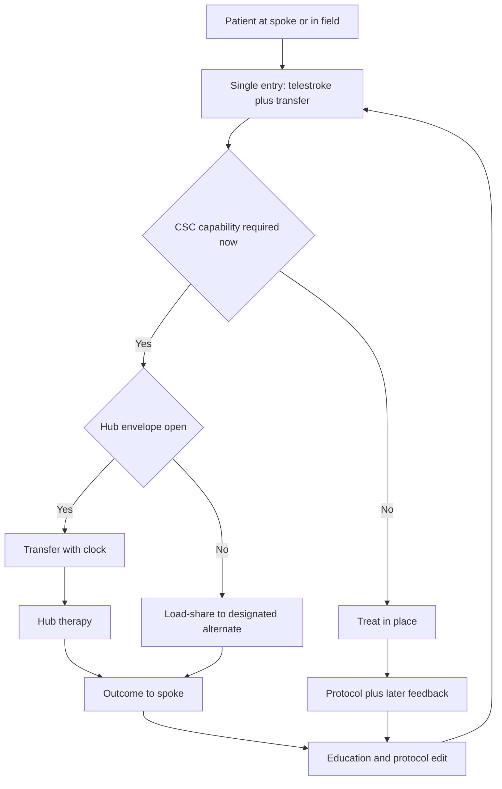

# Network Leadership and Regional Integration

## Opening

An academic Comprehensive Stroke Center does not become a regional system by accepting transfers. It becomes one by making the region more capable: shared protocols, education that changes night behavior at spokes, transfer agreements that move the right patient at the right time, data that returns to the sending site, and a telestroke service that is the same operating system as the transfer center rather than a separate video product.

The Medical Director is the regional designer, not the regional collector. Every inbound LVO, ICH, and ruptured aneurysm is a compliment only if the spoke could not have finished the job and if the hub can finish it without harming the next patient. Every treat-in-place decision is a leadership act. Every silent transfer—no outcome, no feedback, no education—is extractive, even when the clinical care at the hub was excellent.

Hubs fail the region in two opposite ways. They hoard: simple ischemic cases, mild ICH, and repatriation delays that keep spoke beds empty and hub beds full. Or they dump: late accepts, incomplete records, premature bounce-backs, and a telestroke voice that says "transfer" because advice is harder than a bed request. Both patterns destroy trust. Trust is the actual network product.

Build one system. Protocols, education, transfer, telestroke, data, and spoke capability-building are not parallel workstreams. They are one loop. If the loop is not written, the region will still run—on personalities, on whoever is on call, and on whoever answers the transfer line first.

## Why This Matters

Reperfusion and hemorrhage care are time-bound and team-bound. The 2026 AHA/ASA AIS Guideline requires rapid treatment of eligible disabling deficits within 4.5 hours regardless of NIHSS, with tenecteplase 0.25 mg/kg (max 25 mg) or alteplase 0.9 mg/kg (max 90 mg), and it requires that patients eligible for both IVT and EVT receive both without delaying thrombectomy. That sequence often starts at a spoke, on a telestroke camera, or in an ambulance already aimed at the wrong door. A hub that only manages its own door has already accepted a worse regional mRS.

Hemorrhagic care is even more network-dependent. The 2022 ICH Guideline and 2024 ICH performance measures make time to reversal and severity measurement operational, not rhetorical. The 2023 aSAH Guideline makes securing, nimodipine, and delayed-ischemia care a continuum that a small hospital cannot improvise after midnight. The April 2, 2025 Joint Commission announcement reduced the annual aSAH volume criterion to 10; that floor says nothing about how a region should move a suspected aneurysm. Confirm current CSC eligibility numbers in the active E-App. Do not use the floor as a marketing claim or as a reason to strip a capable TSC of cases it can co-manage.

Certification and awards do not measure whether spokes trust the hub. CSTK and GWTG will show what happened to patients who arrived. They will not show the patient who boarded three hours at a PSC waiting for a yes, the telestroke case that was transferred for convenience, or the repatriation that never occurred. Network quality is a separate scorecard: acceptance time, treat-in-place rate for cases that met stay criteria, completeness of outcome feedback, education delivered, and equity of access across sending sites.

Extractive hubs eventually lose the region. Spokes obtain their own EVT, rewrite EMS destinations, or send the next aneurysm to a competitor. Academic centers that treat network leadership as a referral-development function discover this late, usually after a public quality event. Generative hubs keep complexity they must hold, return patients they should return, and leave capability behind them.

State and regional advisory work is part of the job at a generic level: destination policy, data definitions, surge load-sharing, and public education. It is not a personal platform. The Medical Director represents a capability, not a brand.

## Core Framework

Treat the region as an operating system with six functions. If any function is missing, the others become theater.

| Function | What "done" looks like | Owner at the hub | Spoke-facing product |
| --- | --- | --- | --- |
| Shared protocols | One hyperacute, ICH reversal, and transfer-criteria set that spokes can run without calling for permission on every step | Medical Director with pharmacy, radiology, and emergency partners | Pocket algorithm plus EHR-agnostic order elements |
| Education | Night-shift behavior change, not an annual lecture | Associate Medical Director or education lead | Drill calendar, case feedback, and simulation slots |
| Transfer agreements | Written stay/go/return rules, data elements, and acceptance clocks | Medical Director and transfer-center leadership | Single-call pathway with a documented yes/no/why |
| Data feedback | Sending site sees reperfusion grade, complications, 90-day mRS when obtained, and one teaching point | Quality director with coordinator FTE | Monthly site report and immediate outlier call |
| Spoke capability-building | A ladder from ASRH/PSC functions toward TSC functions where appropriate | Medical Director and network lead | Gap list, skill targets, and a stop point that is honest |
| Governance of the network | A forum where spokes can criticize the hub | Medical Director | Quarterly network operations meeting with minutes |

### Extractive hub versus generative hub

Name the behaviors. Do not allow "we are the CSC" to substitute for them.

| Domain | Extractive pattern | Generative pattern |
| --- | --- | --- |
| Telestroke recommendation | Transfer by default; weak documentation of stay criteria | Treat-in-place when criteria met; transfer when CSC capability is required |
| Case selection | Pull insured, low-complexity volume; delay the difficult uninsured ICH | Accept by clinical need and bed reality; track equity of accepts |
| Timing | Slow accept, then blame the spoke for a late puncture | Published acceptance clock; delay is a hub defect |
| Information | Demand images and notes; return a discharge summary weeks later | Immediate outcome note: TICI, hemorrhage, next steps, teaching point |
| Education | Offer an annual symposium that markets the hub | Night drills at the spoke; feedback on the last five transfers |
| Repatriation | Keep the patient until a convenient Friday | Pre-agreed return triggers and a bed-finding owner |
| Talent | Recruit the spoke's only night neurologist | Train, share coverage models, and treat a graduate at the spoke as success |
| Data | Use spoke volume to decorate the hub registry | Give the spoke its own dashboard and help it improve GWTG/STK |
| Surge | Close to transfers without warning | Load-share with announced rules; see [disaster and surge](35-disaster-surge.md) |
| Public posture | Destination advertising that undermines a functioning PSC | Joint EMS education that matches true capability by hour of day |

### What stays, what moves

Write stay/go rules that a night emergency physician can apply. Localize the thresholds; do not invent national numeric volume requirements as if they were transfer criteria.

| Presentation | Default stay at a capable PSC/TSC | Default move to the academic CSC | Requires a live judgment |
| --- | --- | --- | --- |
| Disabling AIS within 4.5 h, no LVO | Give IVT locally; do not delay for transfer | If the spoke cannot give lytic safely | Lytic given, then transfer for other needs |
| LVO, EVT-capable TSC on site | Treat locally if the team and CSTK-11/12 envelope are real | If night team, anesthesia, or ICU is not real | Borderline imaging, large core, tandem disease |
| LVO, no EVT on site | Do not delay lytic | Transfer for EVT; images travel with the patient | Futile-transfer discussion documented, not whispered |
| Unknown-onset or 4.5–9 h candidate | If spoke has DWI-FLAIR or perfusion and a protocol | If selection imaging or therapy is only at the hub | Do not transfer solely to "get a scan" if the hub cannot treat faster |
| Mild ICH, reversible cause, stable | Observe under protocol if ICU/step-down exists | Anticoagulant ICH needing reversal the spoke cannot start, or deteriorating exam | Reversal must start before the wheels move |
| aSAH | Only if a written co-management model with securing capability exists | Default to a center that can secure the aneurysm and run the 2023-guideline pathway | Transfer delays while "confirming the CTA" are usually harmful |
| Post-reperfusion ICU need | If the spoke ICU can run the pathway | If the need is NCC-level monitoring the spoke cannot staff | Do not use the hub ICU as a staffing patch for every fever |
| Elective second opinion | Clinic pathway | Rarely as an inpatient transfer | Do not launder clinic access through the transfer center |

### Telestroke and transfer as one system

If telestroke and the transfer center have different phone numbers, different scripts, and different incentives, the region will receive two answers to one patient. Merge them at the script level even if the vendors differ.

| Integration rule | Why it exists | Test |
| --- | --- | --- |
| One clinical script | Prevents "video says stay, transfer line says come" | Mystery-shop both lines quarterly |
| Shared stay/go list | Advice and bed request use the same criteria | Outlier review when they diverge |
| Images move with the decision | Hub does not re-scan by habit | Track duplicate CT/CTA after transfer |
| Acceptance clock starts at first complete request | Hub delay is visible | Median request-to-yes time by site and by night vs day |
| Outcome note within a locally defined short interval | Trust decays by the next shift | Percent of transfers with a same-week structured feedback |
| Repatriation owner named at accept | Bed recovery is designed, not hoped | Median days from ready-to-return to actual return |
| Diversion state visible to spokes | Silent diversion is extractive | Spokes can see open/closed/load-share status |

### TSC, PSC, and ASRH partnerships

Partnerships are not identical. Write a different contract of behavior for each.

| Partner type | What the academic CSC owes | What the partner owes | Common failure |
| --- | --- | --- | --- |
| ASRH / small ED | Immediate telestroke, simple lytic support, honest destination advice | Early call, image sharing, EMS feedback | Using the camera as a transfer stamp |
| PSC | Joint DTN work, feedback on transfers, help with STK/GWTG, respect for cases that should stay | Give lytic before transfer when indicated; do not hold LVO for a "repeat exam" | Hub stealing IVT volume to decorate its own DTN |
| TSC | Mutual load-share, aligned EVT selection, shared night backup, joint CSTK-11/12 review | Call early when the suite or ICU is down; do not hide complications | Treating the TSC as a rival to be starved of aneurysms and LVOs |
| Unaffiliated site | Same clinical script; no second-class clock | Same data elements if they want feedback | Punishing independence with slow accepts |
| EMS / regulatory bodies | Destination language that matches real hourly capability | Use of agreed triage; participation in review | Hub lobbying for all strokes to itself after 17:00 regardless of spoke capability |

### Spoke capability-building

Capability-building has a stop point. Not every hospital should become a TSC. The Medical Director's job is to be honest about that while still raising the floor.

| Ladder rung | Target capability | Hub support | Stop if |
| --- | --- | --- | --- |
| Reliable recognition | FAST-ED or locally chosen screen; dysphagia screen; glucose | EMS and ED teaching | The site cannot staff a consistent ED champion |
| Reliable door-to-needle | Lytic delivery matching 2026 AIS Guideline agents and windows | Protocol, pharmacy checklist, DTN case review | Lytic is symbolic and always followed by automatic transfer of non-LVO cases |
| Reliable transfer packaging | Images, last-known-well, anticoagulants, family contact, airway | Transfer packet standard | Packaging time exceeds transport benefit |
| Reliable ICH start | Severity score, reversal initiation, blood-pressure pathway | CSTK-03/04-aligned kit and drill | Reversal drugs are not on the night cabinet |
| Selected TSC functions | EVT or aneurysm co-management only with real 24/7 team and ICU | Proctoring, shared M&M, load-share | Night coverage is a single person and a prayer |
| Independent TSC | Self-sustaining CSTK-11/12 and ICU pathway | Peer relationship, not paternalism | The hub keeps inserting itself to retain volume |

### State and regional advisory posture

Serve on destination, data, and surge groups as a technical resource. Bring evidence and operational honesty. Do not bring a volume target.

| Advisory topic | Useful contribution | Out of bounds |
| --- | --- | --- |
| EMS triage | Hour-of-day capability, not just daytime brochure capability | Routing all possible EVT candidates past a functioning TSC |
| Public reporting | Completeness, 90-day mRS, equity strata | Using advisory status to advertise awards |
| Surge and diversion | Load-share rules written before winter | Quietly closing while telling the region the hub is always open |
| Pediatric AIS | 2026 AIS Guideline now includes first pediatric AIS recommendations; know the local pediatric pathway | Improvising adult CSC processes on children without the pediatric system |
| Mobile stroke units | Endorsed in the 2026 AIS Guideline; place them where they change access | Using an MSU as a capture vehicle for insured suburbs only |

!!! tip "Key Actions"
    Merge telestroke and transfer scripts this quarter so stay/go language is identical. Publish an acceptance clock and measure request-to-yes by night versus day. Send structured outcome feedback on every CSC-defining transfer, including TICI or why EVT was not done, hemorrhage complications, and a teaching point. Schedule night-shift education at the top three referring sites rather than another hub-based symposium. Write repatriation triggers at the time of acceptance. Review one extractive behavior in governance each month and kill it.

!!! abstract "Metrics Targets"
    Network measures are not a substitute for CSTK/STK/GWTG; they sit beside them. Track median request-to-acceptance time, percent of telestroke encounters with a documented stay rationale, duplicate advanced imaging after transfer, percent of transfers with structured feedback inside the local interval, repatriation lag, and equity of acceptance across sending sites and payers. Hub reliability still uses Target: Stroke Elite Plus (75% DTN ≤45 min and 50% DTN ≤30 min) and Advanced Therapy (50% door-to-device ≤90 min direct / ≤60 min transfer) as published external benchmarks, plus CSTK-11 and CSTK-12 for transferred EVT. Treat spoke DTN improvement and spoke lytic-before-transfer rates as hub success. Do not set a transfer-volume target as a quality goal.

!!! warning "Common Pitfalls"
    Running telestroke as a marketing funnel. Accepting every transfer to avoid a difficult no, then boarding ICH in the ED. Returning nothing but a billing-friendly discharge summary. Holding repatriation until the hub needs the bed for a different service. Teaching only the spoke's day-shift educators. Treating a TSC as an enemy the month it launches EVT. Using state advisory roles to rewrite destination rules toward the hub. Ignoring pediatric and rural access because they are not in the adult registry. Measuring network success as inbound volume.

!!! success "Implementation Tips"
    Put a spoke medical director, not a liaison, on the quarterly network agenda and give that person the first ten minutes to criticize the hub. Mystery-shop the transfer line after 22:00. Build the outcome note as a structured template the attending can finish before leaving the unit, not a coordinator archaeology project. When a spoke gives lytic well, say so in writing and do not recruit that case next time. If the hub is on diversion, say so in the same channel used for telestroke. Hire or designate a network coordinator whose job is feedback and education, not capture. When fellows rotate, send them to a spoke night so they learn what packaging actually requires.

## How to Do the Work

### Daily / weekly

Listen to the transfer and telestroke stream. The Medical Director does not take every call, but the Medical Director must know whether last night's recommendations matched the stay/go list. Sample calls. Read the outliers.

Make delayed accepts visible the next morning. A long request-to-yes time is a hub operations defect. Do not allow the story to become "the spoke called late" until the time stamps are checked.

Close the loop on CSC-defining transfers while the case is still cognitively fresh: TICI grade (CSTK-08), whether CSTK-11 or CSTK-12 was missed because of packaging versus hub delay, ICH reversal start, aneurysm securing plan. Send that loop to the spoke before the same night team rotates off.

Watch for extractive drift in real time: a non-LVO lytic candidate transferred "for convenience," a clinic patient arriving as a transfer, a repatriation-ready patient still occupying an ICU bed.

### Monthly / quarterly

Publish a site-level network report: transfer counts by indication, accept times, treat-in-place rates, lytic-before-transfer, duplicate imaging, feedback completion, repatriation lag, and two or three teaching cases. Send it to the people who work nights, not only to the spoke executive.

Hold a network operations meeting. The hub speaks second. Review one harm, one good catch, and one protocol mismatch. Change a rule in the stay/go list when the cases demand it. Minutes go back to every site, including unaffiliated ones that send patients.

Review TSC relationships as partnerships. Compare night coverage, suite downtime, and load-share events. If the academic CSC is starving a competent TSC of appropriate cases, that is a strategy violation under [growth and complexity](32-strategy-growth.md).

Audit equity. If one critical-access hospital waits twice as long for a yes as a well-resourced PSC, the network has a preference whether anyone wrote it down.

Refresh education from defects, not from a catalog. If packaging of last-known-well and anticoagulant status is the delay, teach that. If ICH reversal never starts before transport, drill that. Stop flying a general "stroke update" slide deck to sites whose actual failure is one step.

### Annual / multi-year

Rewrite transfer agreements so they match the real stay/go list, the acceptance clock, the feedback obligation, and the repatriation triggers. An agreement that only talks about bed request and payment is not a clinical agreement. Local counsel and payer contracts still govern; the Medical Director supplies the clinical operating content.

Rebuild the capability ladder with each partner. Some sites should be helped toward reliable lytic and packaging and then stopped. Some TSCs should be helped toward independent nights. Write the stop points down so hub marketing cannot quietly reverse them.

Take a generic state or regional advisory role if the center's capability is structurally necessary to the region. Prepare destination and surge advice that would still be correct if the hub were not the beneficiary.

Reassess whether telestroke and transfer have drifted apart after vendor changes, leadership changes, or a new MSU. Re-merge the script.

Report network trust as a multi-year asset in the same packet as volume and awards. Include the growth the hub refused and the capability a spoke gained.

## Ready-to-Adapt Tools

### Stay / go / return card (spoke night pocket)

Adapt locally. Do not paste into production without pharmacy, EMS, and receiving-service review.

1. Time last known well, NIHSS or documented disabling deficit, glucose, anticoagulant, advanced directive.
2. If disabling AIS and within 4.5 h: treat locally if lytic-capable; do not delay for hub permission.
3. If LVO suspected or proven: call the single entry line; give lytic if eligible; move if EVT is not real at the spoke tonight.
4. If ICH: start reversal if indicated before wheels; move if securing, neurosurgery, or NCC is required.
5. If aSAH: move to a securing center unless a written co-management plan says otherwise.
6. Package: images, meds, family contact, airway, time stamps.
7. Return triggers: neurologically stable, no pending CSC-only procedure, receiving bed identified, report given.

### Structured outcome-to-spoke note

| Field | Content |
| --- | --- |
| Times | First call, accept, departure, hub door, imaging, puncture, reperfusion |
| Therapy | IVT agent and dose if given; EVT performed or reason not; TICI |
| Hemorrhage | Reversal agent and time; securing plan; nimodipine if aSAH |
| Defect | Packaging vs transport vs hub delay; one system fix |
| Teaching point | One sentence the night team can use |
| Return plan | Trigger and owner |
| Contact | Named hub physician for questions |

### Network operations agenda (60 minutes)

1. Spoke-led critique (10 min).
2. Acceptance-clock and night/day split (10 min).
3. Two cases: one stay that should have moved, one move that should have stayed (15 min).
4. Feedback and repatriation completion (10 min).
5. Education calendar and who actually attends nights (5 min).
6. Load-share or diversion events (5 min).
7. Decisions and owners (5 min).

### Transfer-agreement clinical skeleton

Local legal must own the contract. This is the clinical appendix.

- Single entry pathway and backup number.
- Stay/go list and the rule that telestroke and transfer use the same list.
- Acceptance clock and what constitutes a complete request.
- Imaging-transfer standard and expectation to avoid reflexive repeat CT.
- Lytic-before-transfer expectation for eligible patients.
- ICH reversal-before-transfer expectation.
- Feedback interval and minimum data elements, including 90-day mRS when the hub is the treating center.
- Repatriation triggers, owner, and dispute path.
- Diversion and load-share notification method.
- Joint review cadence.
- Equity statement: clinical need, not payer, sets the clock.

### RACI for network decisions

| Decision | Medical Director | Network / telestroke lead | Transfer center | Spoke leader | Quality |
| --- | --- | --- | --- | --- | --- |
| Stay/go list | A | R | C | C | C |
| Acceptance clock exception | A | C | R | I | I |
| Site education plan | A | R | I | C | C |
| Outcome-feedback template | A | C | I | C | R |
| Load-share activation | A | C | R | I | I |
| Treating a TSC as peer vs dependent | A | C | I | C | I |

## Integration With Other Pillars

Network leadership is how [strategy and growth](32-strategy-growth.md) stay non-extractive. It is how [financial stewardship](34-financial-stewardship.md) sees transfer economics as a system cost rather than a capture prize. It is the load-share fabric that [disaster and surge](35-disaster-surge.md) will need when CT, IR, or staffing fail. It is a core dimension of [elite performance](36-elite-performance.md): network trust is not a slogan.

Clinical chapters on EMS, hyperacute pathways, imaging, IVT, EVT, ICH/aSAH, telestroke, and mobile stroke units are the content of the shared protocols. Quality chapters supply the measures the hub owes the spoke and the equity strata the acceptance clock must survive. Education chapters supply the night-shift method. Research operations should make trial eligibility a transfer-time question, not a weekday discovery.

If a marketing plan and this chapter disagree, this chapter wins until governance changes the stay/go list.

## Sources

- 2026 Guideline for the Early Management of Patients With Acute Ischemic Stroke. *Stroke*. 2026;57(8):e316–e436. DOI 10.1161/STR.0000000000000513. Includes refined EMS triage, mobile stroke unit endorsement, and first pediatric AIS recommendations.
- Greenberg SM, et al. 2022 Guideline for the Management of Patients With Spontaneous Intracerebral Hemorrhage. *Stroke*. 2022. DOI 10.1161/STR.0000000000000407.
- Hoh BL, et al. 2023 Guideline for the Management of Patients With Aneurysmal Subarachnoid Hemorrhage. *Stroke*. 2023;54:e314–e370. DOI 10.1161/STR.0000000000000436.
- 2024 AHA/ASA Performance and Quality Measures for Spontaneous ICH.
- Joint Commission advanced stroke programs (ASRH, PSC, TSC, CSC) and the active DSC manual / E-App. April 2, 2025 announcement reducing the annual aSAH volume criterion to 10.
- Specifications Manual for Joint Commission National Quality Measures, CSTK v2026B: CSTK-08 TICI; CSTK-09 arrival to puncture; CSTK-11 and CSTK-12 rapid effective reperfusion; CSTK-02 and CSTK-10 90-day mRS.
- GWTG-Stroke and Target: Stroke published recognition criteria, including Elite Plus and Advanced Therapy thresholds.
- Alberts MJ, et al. Recommendations for Comprehensive Stroke Centers. *Stroke*. 2005. Foundational; not a substitute for current standards.
- Landmark operational trials: NINDS tPA; ECASS III; HERMES (mRS 0–2 46.0% vs 26.5%; NNT 2.6); DAWN; DEFUSE 3; EXTEND-IA TNK; INTERACT3.
