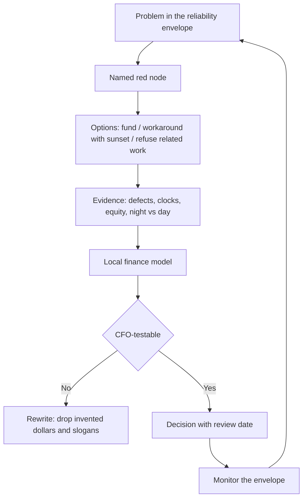

# Financial Stewardship and Resource Allocation

## Opening

Financial stewardship for an academic Comprehensive Stroke Center is the discipline of telling the truth about a high-fixed-cost, 24/7 system and then asking for resources in a form a CFO can test. It is not a hunt for a slogan that stroke "pays for itself." It is not a chargemaster tour. It is not a promise that a biplane, a second MRI, a mobile stroke unit, or a night-coverage increment will return cash in a number of months invented for a slide.

The Medical Director does not replace finance. The Medical Director supplies the clinical production function: what capacity is required to deliver guideline-directed reperfusion, hemorrhage care, neurocritical care, clinic closure, research screening, and network obligations without degrading reliability. Local finance models the dollars. If those two jobs collapse into one person improvising figures, the request will be either naïve or dishonest.

Stroke economics are dominated by standby cost. The IR team, the CT tech, the neuro ICU nurse, the pharmacist who can mix a lytic or a reversal agent, and the coordinator who will later complete 90-day mRS are paid whether the next LVO arrives or not. Variable supply cost is real and usually not the strategic problem. The strategic problem is whether the organization will fund the envelope that [strategy and growth](32-strategy-growth.md) said it would protect.

Write every request as a reliability and equity problem with a modeled option set. Bring case-mix, night risk, transfer effects, and the cost of not funding the node. Leave the currency math to the people whose system can survive audit.

## Why This Matters

Guideline-directed care has a clock. The 2026 AHA/ASA AIS Guideline requires rapid IV thrombolysis for eligible disabling deficits within 4.5 hours, using tenecteplase 0.25 mg/kg (max 25 mg) or alteplase 0.9 mg/kg (max 90 mg), and it requires that patients eligible for both IVT and EVT receive both without delaying thrombectomy. HERMES showed a large treatment effect when EVT is actually delivered (mRS 0–2 in 46.0% versus 26.5%; NNT 2.6 for at least a one-point mRS shift). None of that is free at 02:00. Underfunded nights convert published benefit into registry embarrassment.

Hemorrhagic programs have the same structure. The 2022 ICH Guideline and 2024 ICH performance measures make reversal and severity measurement time-stamped work. The 2023 aSAH Guideline makes securing and ICU surveillance a continuum. The April 2, 2025 Joint Commission announcement reduced the annual aSAH volume criterion to 10; that floor is not a staffing model. Confirm current CSC eligibility in the active E-App. A center cannot run a securing service, a nimodipine pathway, and delayed-ischemia surveillance on residual ICU capacity left over from a different service line.

Quality infrastructure is a production cost. CSTK-02 and CSTK-10 require 90-day mRS. CSTK-11 and CSTK-12 require a reperfusion chain that is staffed, not hoped. GWTG achievement at 85% on each of seven measures, and Target: Stroke Elite Plus plus Advanced Therapy, are labor-intensive. Coordinators, registrars, and follow-up methods are not overhead to be trimmed after the award is framed. They are how the organization sees itself.

Research is not a side bet. NIH StrokeNet participation requires a site PI pipeline, coordinator FTE, 24/7 screening, and central IRB familiarity. If those costs are hidden inside "clinical residual time," either the trial will fail or the clinical night will.

Capital is where dishonest numbers do the most damage. Biplane rooms, MRI capacity, and mobile stroke units are multi-year assets with staffing tails larger than the device. A request that quotes a payback period the Medical Director cannot defend under questioning will be remembered longer than the clinical need.

## Core Framework

### The CSC cost architecture

Describe costs by behavior, not by department politics.

| Cost type | Examples | What the Medical Director must make visible | What not to do |
| --- | --- | --- | --- |
| Standby / fixed clinical | Night IR call, CT tech, neuro ICU minimum grid, pharmacy lytic/reversal readiness | The envelope does not scale linearly with last month's volume | Argue that a quiet week means nights can be unfunded |
| Semi-fixed | Stroke-unit staffing grids, clinic templates, telestroke shifts | Step-ups happen at census and complexity thresholds | Pretend one more transfer is always marginal |
| Variable clinical | Devices, implants, reversal agents, lytics, beds occupied | Case-mix drives this more than raw discharges | Use a single average cost per "stroke" |
| Quality infrastructure | Abstraction, CSTK/STK/GWTG, 90-day mRS, peer review, survey | Coordinator FTE is a production input | Cut FTE after Gold status and hope the next year holds |
| Network | Telestroke platform, transfer coordination, spoke education, repatriation labor | Uncounted physician and coordinator time is still time | Treat inbound volume as free margin |
| Academic | Fellowship supervision, StrokeNet screening, IRB, start-up | Cost-share explicitly | Promise research growth on leftover coordinator hours |
| Capital and its tail | Biplane, MRI, MSU, EHR tools | Device plus staff plus downtime plus training | Submit the purchase price as if it were the project |

### DRG, case-mix, and why averages lie

Inpatient payment in the United States is largely case-mix driven. Stroke is not one product. A short-stay ischemic patient, an EVT patient with ICU days, an anticoagulant ICH with reversal and ventilation, and an aSAH with securing and delayed-ischemia surveillance do not resemble each other in cost or payment. Local finance must model contribution using the hospital's actual case-mix index, transfer status, outlier behavior, denials, and post-acute placement lag. The Medical Director's job is to stop anyone from using a single "average stroke margin" to decide whether nights, ICU beds, or coordinators are affordable.

| Mix driver | Clinical meaning | Financial meaning | Stewardship move |
| --- | --- | --- | --- |
| Transfer-in | Often later, more selected, more complete | May arrive after lytic, with incomplete documentation, longer ICU, harder coding | Measure transfer case-mix separately; do not assume every inbound case is a win |
| Direct-from-home AIS | DTN and community reputation | Shorter stays possible if reperfusion is fast and clinic exists | Fund the hyperacute chain and the clinic, not only the ICU |
| EVT | High benefit when indicated | Device cost plus ICU plus night team; payment depends on coding and complications | Pair EVT growth with suite and ICU, not with a margin cartoon |
| ICH / aSAH | CSC-defining | Long ICU, high pharmacy and implant/OR use, placement delay | Present as a service line with a reliability aim, not as a DRG disappointment |
| Comfort-measures trajectory | Appropriate care | Short or long stays that confuse naïve length-of-stay targets | Do not "improve LOS" by pressuring appropriate NCC |
| Documentation integrity | NIHSS, severity scores, procedures, comorbidities | Under-coding hides true case-mix; over-coding is a compliance event | Dual-review rather than a bounty program |
| Post-acute lag | Rehab and SNF access | Paid days become unpaid or low-value days | Invest in placement and repatriation as financial operations |

### Transfer economics

Transfers are a network good and a local cost. Both statements can be true.

A transferred LVO or ruptured aneurysm can be the entire reason the academic CSC exists. It can also arrive at 03:00, occupy the last ICU bed, miss CSTK-11 because of pre-hospital delay, generate a long stay, and repatriate slowly. A strategy that counts only inbound revenue will over-accept. A strategy that counts only local cost will under-accept and betray the region.

| Transfer question | Clinical owner | Finance owner | Joint product |
| --- | --- | --- | --- |
| Should this case move? | Stay/go list in [network leadership](33-network-leadership.md) | Not a finance veto on clinical need | Clock by need, not by payer |
| Can the envelope absorb it tonight? | ICU, IR, ED capacity board | Boarding cost and cancelled electives are real | Visible yes/no/load-share |
| Who pays for packaging defects? | Spoke education | Repeat imaging and delay costs land at the hub | Feedback and packet standards |
| Who pays for slow repatriation? | Named owner at accept | Occupied bed is an opportunity cost | Return triggers in the agreement |
| How is transfer case-mix reported? | Quality strata | Separate P&L view if finance uses one | No blended "stroke is profitable" slide |

Do not build a transfer campaign on a promised contribution margin. Build it on regional need and a funded envelope. Local finance must model the actual mix.

### Night coverage is a quality purchase

Nights are where CSC status is true or false. The 2026 AIS Guideline does not pause after 17:00. ICH reversal does not pause. Aneurysm securing does not pause. Paying for vascular neurology, neurointervention, neurosurgery, neuroradiology, anesthesia, CT, pharmacy, and ICU skill at night is the purchase of reliability. It will never look efficient on a per-case night spreadsheet because standby is the point.

| Night resource | Failure if underfunded | How to argue it | How not to argue it |
| --- | --- | --- | --- |
| Stroke or VN coverage | Telestroke and in-house decisions degrade; DTN slips | Defects, equity of night vs day treatment, guideline clocks | "Other centers pay more" |
| IR / anesthesia / tech team | Door-to-device and CSTK-11/12 collapse | Emergency-preemption log, missed LVO, suite conflict | Invented case-volume guarantees |
| Neuro ICU skill mix | ICH/aSAH and post-EVT care becomes improvised | Boarding, overflow, rescue events | Average census only |
| Pharmacy | Lytic and reversal delays | Time to bolus, time to reversal, CSTK-04 | Drug invoice as the whole story |
| Coordinator on-call screening | Trial eligibility missed; next-day abstraction chaos | StrokeNet pathway, consent windows | Research will "cover itself" |

### Coordinator FTE as quality infrastructure

A coordinator is not a clerk who appears before survey. Coordinator labor produces the data the Medical Director uses to refuse unsafe growth, to run PDSA, to complete CSTK-02, and to screen trials. When volume or complexity rises, abstraction, follow-up, and screening rise. If FTE does not, the organization will either drop measures or burn people down.

Model FTE against work, not against a ratio copied from another hospital. Work includes concurrent review, registry, 90-day contact methods, peer-review packets, spoke feedback, trial screening, and survey readiness. Local finance and HR must model the dollars. The Medical Director must refuse a growth increment that adds cases without adding this labor.

### Research cost-sharing

Trials consume coordinator time, pharmacist time, night screening, imaging slots, and ICU attention. Industry and network trials have different cost-share rules; none of them make the work free. Put research inside the operating conversation:

- Which trials the site will open this year, and which it will refuse.
- Which coordinator FTE is clinical quality, which is research, and which is honestly mixed.
- Who pays start-up, imaging above standard of care, and after-hours screening.
- How StrokeNet participation is treated: a strategic capability, not a hobby.

Do not claim that research "offsets" night coverage. Local grants offices and finance must model recoveries. The Medical Director's duty is to prevent double-counting of the same FTE.

### Capital: biplane, MRI, MSU, and the tail

Capital requests fail when they are device-first. Start from the constraint.

| Asset | Clinical problem it might solve | Tail that must be funded | Required companion analysis |
| --- | --- | --- | --- |
| Additional or replacement biplane | Emergency path blocked by elective work or by downtime | Techs, anesthesia, nurses, call pay, supplies, maintenance | Emergency-preemption log; CSTK-09/11/12; what happens if the request is refused |
| MRI capacity | Unknown-onset / DWI-FLAIR selection; clinic and inpatient bottleneck | Tech nights, transport, contrast protocols, downtime SOP | Queue times; 2026 AIS Guideline extended-window pathway |
| Mobile stroke unit | Access in a defined geography; 2026 AIS Guideline endorses MSUs | Crew, vehicle replacement, telestroke integration, equity of deployment | Where it changes time to lytic, not where it captures insured volume |
| EHR or AI decision support | Detection and documentation | Validation, bias monitoring, downtime behavior | Govern under the innovation chapter; do not buy a siren |
| Second CT path | Door-to-CT failure | Staffing, contrast, downtime | Measured queue, not anecdote |

For every capital item: local finance must model acquisition, staffing tail, and opportunity cost. Do not attach a payback period. Do not cite another hospital's unpublished margin. Do not use chargemaster list prices as if they were cash.

### What a CFO can accept

A request survives if a skeptical finance leader can re-run it.

| Element | Medical Director brings | Finance brings | Disqualifying substitute |
| --- | --- | --- | --- |
| Problem | Reliability, equity, certification, or network failure in sentences a trustee understands | Nothing yet | "We need to remain a destination" |
| Volume and mix | Actual trends by cluster, transfer vs direct, night vs day | Payment and cost by that same cluster | A single average margin |
| Options | At least two besides "buy the thing" | Cost of each option | One option plus urgency theater |
| Risk of no | Predicted defects, diversion, lost network trust, survey risk | Financial risk of no, including other services harmed | "Patients will die" without a mechanism |
| Staffing tail | Who must be hired or paid for call | Loaded cost | Device quote only |
| Metrics | Clocks and measures that will move, including CSTK and Target: Stroke benchmarks used as benchmarks | How those will be reported to operations | Award names as if they were cash |
| Review date | When the increment will be judged | When the model will be re-opened | Perpetual program with no sunset |
| Dollars | None invented | The model | Payback in X months; chargemaster fantasy |

!!! tip "Key Actions"
    Replace any slide that shows a single average stroke margin with a case-mix table finance can model. Put coordinator FTE and night coverage on the same resource list as ICU beds. Require a staffing tail on every capital request before it leaves stroke governance. Stop using payback-period language. Brief the CFO on the reliability envelope and the red node, not on awards. Separate transfer economics from capture rhetoric. Write down which research FTE is already counted in the clinical budget.

!!! abstract "Metrics Targets"
    Financial stewardship uses operational measures as the leading indicators and leaves currency to finance. Report night-versus-day DTN and door-to-device; CSTK-09, CSTK-11, CSTK-12; CSTK-04 and CSTK-06; ICU boarding hours; emergency-preemption events; 90-day mRS completeness; coordinator overtime; and trial-screening hours. External benchmarks remain published ones: GWTG achievement at 85% on each of seven measures; Target: Stroke Elite Plus (75% DTN ≤45 min and 50% DTN ≤30 min); Advanced Therapy (50% door-to-device ≤90 min direct / ≤60 min transfer). Do not convert those percentages into dollar claims. Do not invent contribution margins or payback intervals.

!!! warning "Common Pitfalls"
    Inventing a return-on-investment story to get a biplane. Using chargemaster rates as if they were collections. Blending all stroke DRGs into one cheerful margin. Cutting coordinator FTE after a Gold award. Promising finance that transfers are uniformly profitable. Hiding research labor inside clinical residual time. Presenting MSU or MRI as self-funding. Treating night call as a temporary favor. Letting marketing announce destination status before the staffing tail is funded. Bringing a request with one option and a deadline meant to prevent analysis.

!!! success "Implementation Tips"
    Take the CFO or the service-line controller to the 02:00 path once: ED door, CT, pharmacy, IR, ICU. Walk the constraint, not the trophy wall. Bring two rejected options to show the request was designed, not wished. Use the same volume-versus-complexity table the strategy chapter uses so finance and quality are not looking at different realities. When finance asks "what if we do nothing," answer with last quarter's defects, not a hypothetical lawsuit. Put review dates on funded increments and attend them. If local finance cannot model a claim, delete the claim.

## How to Do the Work

### Daily / weekly

Do not manage the P&L daily. Do manage the events that become the P&L story: boarded ICU patients, cancelled electives because an emergency consumed the only suite, delayed lytic because pharmacy coverage was thin, coordinator overtime to rescue abstraction, a transfer held because the envelope was already red.

Flag resource defects in the same huddle that reviews clinical defects. If the night team was short, that is a stewardship data point, not only a staffing anecdote.

Refuse informal promises. If someone says a referring site will "send more" if the hub buys a device, write it down as an unmodeled claim and keep it out of the request until finance can test it.

### Monthly / quarterly

Sit with finance on a scheduled cadence. Bring case-mix, transfer status, night-versus-day reliability, boarding, and quality-infrastructure labor. Receive back denials, outlier patterns, and documentation gaps. Do not receive a single blended margin and call the meeting complete.

Re-forecast coordinator and night needs against the growth the program already accepted. If [strategy](32-strategy-growth.md) paused growth, say so and show the money not spent as well as the risk avoided.

Review research cost-share. Close trials that consume screening labor without a realistic enrollment path. Do not open a trial to decorate an academic report if the coordinator FTE is already underwater on CSTK-02.

Rank unfunded requests with the same red-node logic as the capacity map. The loudest physician is not the ranking method.

### Annual / multi-year

Build the annual resource packet as an option set: fund the red node, workaround with a sunset, or refuse related clinical work. Include capital only when the tail is specified.

Reset documentation-integrity work with coding leadership. The aim is accurate case-mix, not an inflated index.

Align multi-year capital with the three-year roadmap. A Year 3 biplane without Year 1 ICU nurse staffing is out of sequence.

Reconfirm that no board appendix contains invented dollars, historical certification numbers treated as current, or a payback claim. Confirm CSC eligibility figures from the current E-App. State the aSAH criterion as the April 2, 2025 Joint Commission announcement reducing the annual volume criterion to 10, and then state what regional securing capacity actually costs to staff—modeled locally.

## Ready-to-Adapt Tools

### CFO-ready request skeleton

Use this order. Delete any section that would require an invented number.

1. Problem in the reliability or equity envelope (one paragraph).
2. Patients and times affected; night versus day if relevant.
3. Measures now versus internal target; published GWTG/CSTK benchmarks cited as benchmarks only.
4. Options: fund A, workaround B with sunset, refuse related work C.
5. Staffing and operating tail of each option (roles and coverage, not dollars).
6. Effect on other services (OR, ICU, ED, clinic).
7. Network and transfer effect.
8. Research and education effect if any.
9. Review date and kill-criteria.
10. Attachment: local finance model, owned by finance.

### Case-mix conversation table

| Cluster | Count this period | Night share | Median LOS | ICU days | Reliability flag | Finance notes |
| --- | --- | --- | --- | --- | --- | --- |
| Ischemic, no reperfusion |  |  |  |  |  | Local model |
| IVT without EVT |  |  |  |  | DTN | Local model |
| EVT |  |  |  |  | CSTK-11/12 | Local model |
| ICH |  |  |  |  | CSTK-04 | Local model |
| aSAH |  |  |  |  | CSTK-06 | Local model |
| Telestroke only |  |  | n/a | n/a | Time budget | Local model |

Leave currency columns to finance. Do not pre-fill them with guesses.

### Coordinator work inventory

| Work block | Volume driver | Current hours | Gap | Budget home |
| --- | --- | --- | --- | --- |
| Concurrent hyperacute review | Code-stroke count |  |  | Clinical quality |
| STK / CSTK / GWTG abstraction | Discharge mix |  |  | Clinical quality |
| 90-day mRS (CSTK-02/10) | Eligible discharges |  |  | Clinical quality |
| Spoke feedback | Transfer-in count |  |  | Network |
| Survey and peer review | Calendar |  |  | Clinical quality |
| Trial screening and visits | Open protocols |  |  | Research / cost-share |

### Capital options memo (two pages)

- Constraint statement.
- Demand the asset is meant to relieve, in operational units (queue minutes, preemption events, geography).
- Three options including "do not buy."
- Staffing tail for each.
- Equity effect of each (especially MSU deployment).
- Downtime and redundancy effect.
- Explicit sentence: "Local finance must model cost and any revenue effects; this memo does not state a payback period."

### RACI for resource decisions

| Decision | Medical Director | Program director | Chair / CNO | Finance | Research admin |
| --- | --- | --- | --- | --- | --- |
| Reliability problem statement | A | R | C | I | I |
| Option set | A | R | C | C | C |
| Dollar model | C | C | C | A | C |
| Night-coverage increment | A | C | A | R | I |
| Coordinator FTE split clinical vs research | A | R | C | C | A |
| Capital go/no-go | C | C | A | A | I |

## Integration With Other Pillars

Stewardship is how the [strategy](32-strategy-growth.md) red node becomes a decision instead of a complaint. It is how [network leadership](33-network-leadership.md) avoids treating transfers as free margin. It is how [surge and continuity](35-disaster-surge.md) fund downtime paths that are otherwise unfunded heroics. It is how [elite performance](36-elite-performance.md) stays honest: awards are lagging; payroll for nights and coordinators is leading.

Leadership and FTE architecture chapters define whether the Medical Director has the authority to refuse unfunded work. Clinical chapters define the production function being priced. Quality chapters define the measures that must not be traded for a blended margin. Education and research chapters define labor that will otherwise be stolen from the night and from CSTK-02.

If a marketing or philanthropy story and this chapter disagree, delete the story until finance can model it.

## Sources

- 2026 Guideline for the Early Management of Patients With Acute Ischemic Stroke. *Stroke*. 2026;57(8):e316–e436. DOI 10.1161/STR.0000000000000513.
- Greenberg SM, et al. 2022 Guideline for the Management of Patients With Spontaneous Intracerebral Hemorrhage. *Stroke*. 2022. DOI 10.1161/STR.0000000000000407.
- Hoh BL, et al. 2023 Guideline for the Management of Patients With Aneurysmal Subarachnoid Hemorrhage. *Stroke*. 2023;54:e314–e370. DOI 10.1161/STR.0000000000000436.
- 2024 AHA/ASA Performance and Quality Measures for Spontaneous ICH.
- Joint Commission DSC stroke certification standards; active CSC E-App. April 2, 2025 announcement reducing the annual aSAH volume criterion to 10.
- Specifications Manual for Joint Commission National Quality Measures, CSTK v2026B, including CSTK-02, CSTK-04, CSTK-06, CSTK-09, CSTK-10, CSTK-11, CSTK-12.
- GWTG-Stroke recognition criteria (public AHA criteria): 85% achievement on each of seven measures; Target: Stroke Honor Roll / Elite / Elite Plus / Advanced Therapy.
- Goyal M, et al. HERMES collaboration. *Lancet*. 2016.
- NIH StrokeNet program documentation: site infrastructure expectations for screening and coordination.
- CMS inpatient prospective payment and case-mix principles at the conceptual level; local finance must apply current local rates, contracts, and denial patterns. Do not treat any handbook figure as a payment rate.
