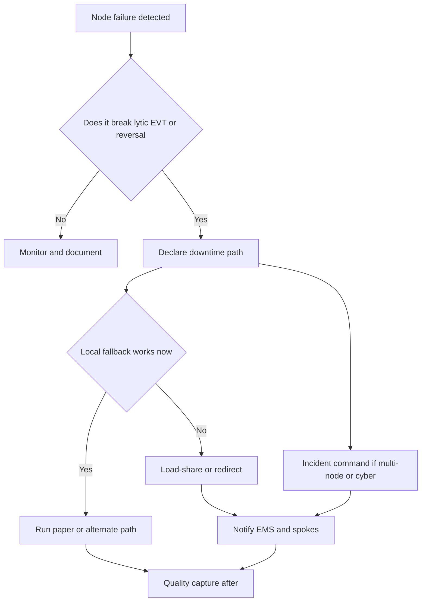

# Disaster, Surge, and Continuity Planning

## Opening

Mass casualty with multiple simultaneous strokes is rare. The events that actually stop an academic Comprehensive Stroke Center are ordinary and vicious: a CT gantry down, the only biplane room dark, the EHR unreachable, a blizzard that empties the night roster, a pandemic that removes a third of the ICU nurses, a cyber event that takes imaging and documentation together, or a diversion cascade in which every capable hospital closes in the same hour.

The Medical Director's continuity job is not to write a binder that satisfies an emergency-management survey. It is to keep a code-stroke path alive when the preferred path is gone. Eligible disabling ischemic stroke still needs a 4.5-hour lytic decision. Eligible LVO still needs a puncture path. Anticoagulant ICH still needs reversal. A suspected aneurysm still needs a securing center. Those clocks do not pause for information technology.

Continuity is a designed set of fallbacks: how to run code stroke on paper, how to move images when PACS is down, how to load-share when the suite is dark, how to staff when the roads are closed, and how to tell the region the truth when the hub is not open in the usual sense. If those fallbacks are first invented during the event, the event will own the outcome.

Rehearse the likely failures. A tabletop that only imagines a stadium collapse will leave the program unready for Monday morning CT downtime.

## Why This Matters

Guideline clocks do not include an exemption for infrastructure. The 2026 AHA/ASA AIS Guideline requires rapid treatment of eligible disabling deficits within 4.5 hours regardless of NIHSS, with tenecteplase 0.25 mg/kg (max 25 mg) or alteplase 0.9 mg/kg (max 90 mg), and it requires that patients eligible for both IVT and EVT receive both without delaying thrombectomy. Extended-window selection using DWI-FLAIR or perfusion mismatch depends on imaging that may be the first thing to fail. Mobile stroke units, endorsed in that guideline, become either a resilience asset or another unavailable crew depending on whether they were written into the downtime plan.

Hemorrhagic pathways fail in different places. The 2022 ICH Guideline and 2024 ICH measures assume a severity score, a reversal agent, and an ICU. The 2023 aSAH Guideline assumes a securing path and nimodipine. If pharmacy cabinets, the OR, or the IR suite are the failed node, the stay/go list from [network leadership](33-network-leadership.md) must flip immediately: the hub becomes a spoke for that hour.

High reliability is the correct frame: preoccupation with failure, reluctance to simplify, sensitivity to operations, commitment to resilience, and deference to expertise. Joint Commission patient-safety and emergency-management expectations belong here, but they are not the content. The content is whether a night emergency physician can still lyse, reverse, and transfer when the usual buttons do not work.

Diversion is a regional event. A hub that goes quiet without telling spokes and EMS converts a local outage into a county-level delay. A hub that stays "open" without CT or IR converts a local outage into a false destination. Both are continuity failures.

Workforce collapse is more probable than a multi-stroke mass casualty. Blizzards, heat, respiratory seasons, and cyber ransomware all remove people or the tools people use. Continuity planning that assumes full staff and only lost machines is incomplete.

## Core Framework

### The threat catalog that actually matters

Rank threats by effect on the reperfusion and hemorrhage chain, not by cinematic scale.

| Threat | Typical first break | Patients at immediate risk | Default fallback |
| --- | --- | --- | --- |
| CT downtime | Door-to-needle and ICH diagnosis | All code strokes | Alternate scanner, neighboring hospital scanner, or redirect EMS |
| Advanced imaging / PACS failure | Late-window selection, CTA for LVO, repeat reads | Extended-window AIS, LVO, aSAH | Noncontrast path plus clinical LVO screen; courier or VPN for images; earlier transfer |
| IR suite outage | EVT and endovascular aneurysm care | LVO, some aSAH | Load-share to designated TSC/CSC; protect lytic and medical care |
| OR / neurosurgery constraint | Surgical ICH, clipping, EVD | Selected ICH and aSAH | Transfer; do not hold for a hoped-for room |
| EHR downtime | Orders, allergies, documentation, medication safety | Every patient | Paper code-stroke packet; verbal closed-loop meds; downtime medication list |
| Pharmacy cabinet or sterile compounding loss | Lytic and reversal | IVT-eligible AIS; anticoagulant ICH | Backup drug locations; transfer if drug cannot be given now |
| Blizzard / access collapse | Staff cannot arrive; EMS interval rises | Night and weekend patients | Sleeping rooms, extended shifts, census throttle, EMS destination change |
| Pandemic / staff illness | ICU and ED skill mix | Hemorrhagic and post-EVT | Census cap, cohorting, load-share, research pause |
| Cyber event | EHR plus PACS plus phones | All time-critical care | Analog communications, paper, pre-agreed load-share, public honesty |
| Diversion cascade | No open EVT or ICU bed in the region | LVO and aSAH in transit | Pre-written regional rotation; state/regional notification |
| Multi-casualty with neurologic injuries | ED and CT overwhelmed | Time-critical strokes plus trauma | Incident command; stroke lead inside the command structure |
| MSU outage | Access in the MSU catchment | Those patients revert to standard EMS | Immediate EMS notification; do not leave a ghost destination |

### Code-stroke downtime procedures

Write one downtime path per failed node. The staff will not read a 40-page plan at 02:00. They will read a card.

| Failed node | Still do | Stop doing | Who declares | Who tells the region |
| --- | --- | --- | --- | --- |
| Primary CT | Use designated alternate CT; start the clock; keep NIHSS | Waiting in the hallway for engineering's next update | Radiology leader plus Medical Director or designee | Transfer center to EMS and spokes |
| All CT | Clinical LVO screen; stabilize; move to a scanning hospital | Pretending a later scan at the hub is faster | Medical Director or night designee | Immediate EMS destination change |
| PACS / network | Treat from the console; photograph key images to a secured downtime method defined by health IT | Informal texting of PHI on personal devices | IT plus Medical Director | Spokes: send discs or the agreed channel |
| EHR | Paper identification, allergy, weight, last-known-well, NIHSS, consent attestation, med administration | Delayed lytic while waiting for the system to "come back any minute" | House supervisor plus Medical Director designee | Internal; external only if acceptance clocks slip |
| Pharmacy system | Use downtime kits for tenecteplase or alteplase and for ICH reversal agents | Dosing from memory without a second check | Pharmacy leader | Only if kits cannot be restocked |
| IR | Lytic if eligible; load-share EVT; medical LVO care | Holding an LVO for a repair ETA that is not a time stamp | IR lead plus Medical Director | All EVT-referring sites and EMS |
| ICU | Accept only what the remaining grid can run; move others | "We are the CSC so we never close" | NCC lead plus Medical Director | Network status board |
| Phones / call system | Backup radios, overhead, designated runners | Assuming a page landed | Hospital command | Regional partners by the analog tree |

Use the agents and windows the 2026 AIS Guideline already set. Downtime is not a moment to invent a new dose. Tenecteplase 0.25 mg/kg IV push, max 25 mg, or alteplase 0.9 mg/kg, max 90 mg, with the usual second-person check on a paper record. TNK 0.4 mg/kg or any cardiac-strength card — refuse (Class 3 – No Benefit). ICH reversal follows the 2022 ICH Guideline pathway already stocked in the downtime kit.

### Regional load-sharing

Load-sharing is the opposite of silent diversion. It is a pre-agreed rotation or pairing that moves EVT, aSAH, and NCC-level ICH when the hub envelope is closed.

| Design rule | Why | Test in a tabletop |
| --- | --- | --- |
| Named alternates by case type | A TSC may take LVO but not securing; a paired CSC may take both | "IR down, aneurysm incoming" |
| Status visible on the same channel as telestroke | Two truths cannot exist | Mystery-shop during a drill |
| Trigger is operational, not emotional | "No emergency puncture path for X hours" not "we feel busy" | Compare last quarter's informal closures to the written trigger |
| Reciprocity | The academic CSC must take partners' overflow on other nights | Review whether the hub only ever sends |
| Equity | Critical-access senders do not go last | Time-to-accept during the drill by site type |
| Research pause rule | Screening stops when care is analog | Who has authority to close enrollment |
| Recovery declaration | Opening is as formal as closing | Avoid ghost capacity |

### Incident command and the stroke role

Hospital incident command will run cyber, blizzard, and pandemic events. Stroke care fails when it has no seat. Assign a stroke operations chief who reports into command, owns the code-stroke downtime card, and owns the external message to EMS and spokes. That person is often the Medical Director by day and a named designee by night. Deference to expertise means the charge nurse, the CT tech, or the IR tech may know the failed node first. The command structure must hear them.

### What "open" means

Publish an internal definition.

| Status | Meaning | External message |
| --- | --- | --- |
| Full CSC function | Lytic, EVT, ICH reversal, aneurysm securing, NCC | Open |
| Partial | Named missing node | Open for X, closed for Y; send Y to Z |
| Load-share | Accepting only what remaining beds and teams can run | On rotation; call the single line |
| Closed for stroke emergencies | Cannot meet lytic or diagnosis clocks | Do not arrive here for code stroke |
| Recovering | Machines back; staff and documentation still analog | Still on downtime path until declared clear |

Awards and certification do not change these definitions. A Gold GWTG center with a dark CT is not open.

!!! tip "Key Actions"
    Write a one-page downtime card for CT, IR, EHR, pharmacy, and ICU, and place it where the night team actually stands. Pre-designate load-share partners by case type and put their numbers on the same card. Define "open / partial / closed" and the person who may declare each after hours. Put a stroke seat into hospital incident command before the next cyber tabletop. Build a paper code-stroke packet that includes weight, last-known-well, NIHSS, allergy, lytic dose worksheet, reversal worksheet, and a CSTK time-stamp strip. Schedule a tabletop this year that starts with CT plus EHR down, not with a stadium.

!!! abstract "Metrics Targets"
    Continuity has its own measures. Track minutes from node failure to declared status, minutes to EMS/spoke notification, percent of downtime code strokes with complete paper time stamps, DTN and door-to-device during downtime versus baseline, load-share accept times, and after-action items closed by the promised date. Published award criteria (Chapter 23) do not relax; analyze downtime months separately so they teach. Door-to-device is first device pass, not CSTK-09 puncture. CSTK-11 and CSTK-12 will expose whether load-share was faster than false hope. Never set a target that staff should "keep the numbers pretty" during a cyber event.

!!! warning "Common Pitfalls"
    Writing a mass-casualty annex and skipping CT downtime. Declaring the hub open because the certificate is on the wall. Holding an LVO for an IR repair estimate that is not a clock. Texting images on personal phones because PACS is down. Delaying lytic for the EHR to return. Forgetting ICH reversal kits in the pharmacy downtime plan. Running a tabletop with only day-shift leaders. Failing to tell spokes and EMS. Recovering the machines and forgetting that documentation backfill will steal coordinator time for a week. Counting a blizzard as an excuse rather than as a rehearsal of night staffing.

!!! success "Implementation Tips"
    Steal the format of the stay/go card: one page, night language, no binder. Run the first tabletop at 07:00 after a real night so night leaders can attend. Invite a spoke and an EMS supervisor; their first question will expose the hole in the notification tree. Pre-print downtime packets and restock them like airway carts. After any real downtime longer than a locally defined interval, do a 30-minute after-action before people forget the workarounds they invented. Give IT and radiology the same after-action respect as physicians. If a cyber event is in progress, pause trial screening and non-urgent transfers out loud, not by rumor.

## How to Do the Work

### Daily / weekly

Know which node is already degraded. A scanner with intermittent faults, an IR room on a parts delay, or an EHR module that is "slow" is a continuity event in slow motion. Put it on the capacity board from [strategy and growth](32-strategy-growth.md).

If a node fails, declare status on the clock. Do not wait for a perfect engineering update. Notify the transfer center, EMS, and spokes with the partial-versus-closed language.

Run code stroke on the downtime card without apology. A paper lytic that is correct beats an electronic lytic that is late.

Capture times on the paper strip as if CSTK will still be abstracted, because it will. Do not create a second, unofficial story.

### Monthly / quarterly

Review every downtime or near-downtime: cause, declaration lag, notification lag, patients affected, outcomes, and workarounds that should become official.

Restock downtime kits. Check expiration of lytic and reversal agents in backup locations with pharmacy. Check that paper packets still match the current agents and doses.

Walk the analog communications tree. Phone trees rot. So do badges, radios, and the list of spoke night numbers.

Include continuity in the quarterly network meeting. Partners should hear how the hub will tell them the truth.

### Annual / multi-year

Run at least one tabletop and one operational drill. Alternate the index threat so that CT, IR, EHR/cyber, and staffing collapse each appear across a two-year cycle.

Rewrite the continuity annex after each real event. Plans that do not change after contact with reality are décor.

Align capital redundancy with [financial stewardship](34-financial-stewardship.md). A second CT path or a second suite is sometimes the continuity plan. Sometimes the plan is a deeper load-share agreement because a second room will not be funded. Write the chosen truth.

Train fellows and night APPs on downtime as a competency, not as folklore. The 2026 AIS Guideline pediatric recommendations also require knowing which pediatric center takes a child when the adult path is analog.

Revisit MSU continuity. An MSU that cannot talk to a downed EHR or a downed hub needs a destination tree of its own.

## Ready-to-Adapt Tools

### Paper code-stroke packet contents

Local pharmacy, nursing, and health-IT must approve.

1. Patient identity, weight, allergy, last-known-well, witness phone.
2. NIHSS worksheet.
3. Pregnancy / glucose / anticoagulant / blood-pressure fields.
4. Lytic worksheet: tenecteplase 0.25 mg/kg max 25 mg **or** alteplase 0.9 mg/kg max 90 mg with bolus/infusion split. Checkbox: **[ ] TNK 0.4 / cardiac-card refused** (Class 3 – No Benefit).
5. ICH reversal worksheet aligned to the local 2022-guideline kit.
6. Time-stamp strip: door, NIHSS, CT start, read, decision, needle, puncture, reperfusion.
7. Consent / exception attestation per local policy.
8. Destination / load-share decision box.
9. After-action bag: place the packet in a designated bin for later abstraction.

### Tabletop exercise agenda (90 minutes)

| Minutes | Item | Owner |
| --- | --- | --- |
| 0–10 | Objectives, rules, and the index threat (example: CT plus EHR down at 01:10 on a weekday) | Medical Director |
| 10–20 | Immediate actions by ED, CT, pharmacy, stroke, transfer center | Night leaders play themselves |
| 20–35 | First patient: disabling AIS within 3 hours, possible LVO | Inject times |
| 35–50 | Second patient: anticoagulant ICH | Inject pharmacy constraint |
| 50–65 | External notification: EMS, top spokes, paired TSC | Transfer center |
| 65–75 | Incident command interface and public message | Hospital EM |
| 75–85 | Recovery: who declares open, how abstraction is backfilled | Quality |
| 85–90 | Three actions with owners and dates | Medical Director |

Injects to keep in a sealed envelope: "IR also goes down at minute 40"; "the spoke cannot send images"; "two nurses cannot arrive."

### After-action one-pager

| Field | Entry |
| --- | --- |
| Event | Node, start, end, declared status |
| Notification | Times to EMS, spokes, internal command |
| Patients | Code strokes, ICH, aSAH, transfers refused or sent |
| What worked |  |
| What was invented on the fly | Promote to the card or kill |
| Harm or near harm |  |
| Measure impact | DTN, door-to-device, CSTK time stamps complete |
| Items | Owner, date, resource needed |
| Review date |  |

### Load-share partner card

| Case type | Primary alternate | Backup | Trigger to send | Information they require |
| --- | --- | --- | --- | --- |
| Lytic-only AIS |  |  | No CT or no drug | Weight, LKW, NIHSS |
| EVT |  |  | No puncture path | Images, LKW, anticoagulant |
| ICH reversal then NCC |  |  | No drug or no ICU | Drug already given, INR/anti-Xa if any |
| aSAH securing |  |  | No suite/OR or no ICU | CTA result, exam, airway |
| Pediatric AIS |  |  | Any child on the adult path | Age, weight, time |

### RACI during a continuity event

| Decision | Night designee | Medical Director | Hospital command | Transfer center | Radiology / IR |
| --- | --- | --- | --- | --- | --- |
| Declare partial or closed | R after hours | A | C | I | C |
| Choose downtime path | R | A | I | I | R for imaging |
| Notify EMS and spokes | I | A | C | R | I |
| Activate load-share | R | A | C | R | C |
| Pause research screening | I | A | I | I | I |
| Declare recovery | C | A | A if command is up | I | C |

## Integration With Other Pillars

Continuity is the stress test of [strategy](32-strategy-growth.md): if growth already made the IR or ICU red, downtime is immediate catastrophe. It is the moment [network leadership](33-network-leadership.md) either tells the truth or becomes extractive. It is a resource problem under [financial stewardship](34-financial-stewardship.md) because downtime kits, extra rooms, and sleep rooms cost money that local finance must model. It is a dimension of [elite performance](36-elite-performance.md): elite programs remain reliable when the preferred path is gone.

Clinical pathway chapters supply the content of the paper packet. Quality chapters supply the after-action method (PDSA, CUSP, high reliability) and forbid pretty-number pressure. Education chapters supply the drill. Research chapters supply the pause rule so screening does not compete with analog care.

If emergency-management paperwork and the downtime card disagree, the card that the night team can run wins until governance updates both.

## Sources

- 2026 Guideline for the Early Management of Patients With Acute Ischemic Stroke. *Stroke*. 2026;57(8):e316–e436. DOI 10.1161/STR.0000000000000513. Includes MSU endorsement and first pediatric AIS recommendations.
- Greenberg SM, et al. 2022 Guideline for the Management of Patients With Spontaneous Intracerebral Hemorrhage. *Stroke*. 2022. DOI 10.1161/STR.0000000000000407.
- Hoh BL, et al. 2023 Guideline for the Management of Patients With Aneurysmal Subarachnoid Hemorrhage. *Stroke*. 2023;54:e314–e370. DOI 10.1161/STR.0000000000000436.
- Joint Commission emergency-management and patient-safety / high-reliability framing; DSC stroke certification standards; active E-App. April 2, 2025 aSAH volume-criterion announcement (10) is a certification floor, not a surge plan.
- Specifications Manual for Joint Commission National Quality Measures, CSTK v2026B: time-stamped measures remain abstractable after downtime if the paper strip exists.
- GWTG-Stroke and Target: Stroke **published award criteria** (Chapter 23), used here as benchmarks to be analyzed with a downtime flag — not CSC certification floors.
- IHI Model for Improvement; AHRQ CUSP; high-reliability organizing principles (preoccupation with failure, reluctance to simplify, sensitivity to operations, commitment to resilience, deference to expertise).
- Hospital incident-command system principles as used in U.S. emergency management; localize to the facility plan.
